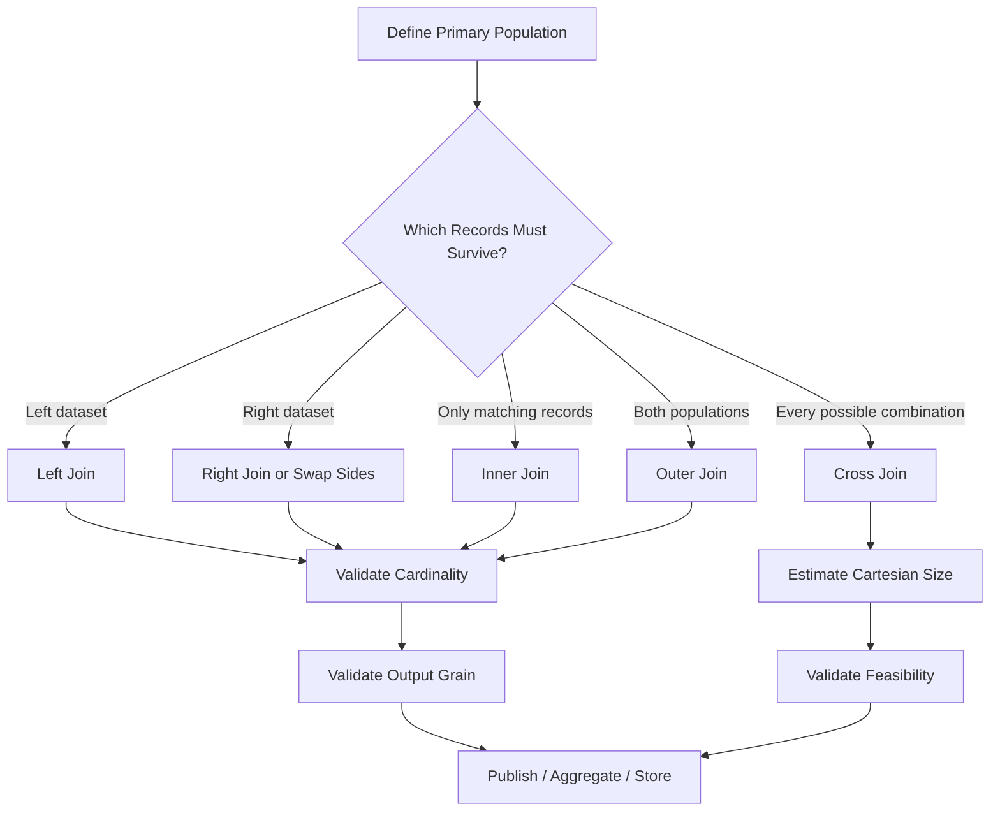

# 04- Merge Types

## Overview

Pandas `merge()` supports several join types that determine **which keys and records survive when two datasets are combined**.

The major merge types are:

```text
inner
left
right
outer
cross
```

Choosing the correct merge type is a data-modeling decision, not merely a syntax choice.

Consider:

```text
orders
    ↓
customer_id
    ↓
customers
```

The question is not only:

> How should these DataFrames be joined?

The important question is:

> Which source records must remain in the result, and what should happen when a matching record does not exist?

That decision determines whether to use an inner, left, right, outer, or cross join.

---

## Why Join Types Matter

Suppose the left DataFrame contains:

```text
customer_id
101
102
103
```

and the right DataFrame contains:

```text
customer_id
101
103
104
```

Different join types produce different populations.

```text
Inner
    → 101, 103

Left
    → 101, 102, 103

Right
    → 101, 103, 104

Outer
    → 101, 102, 103, 104
```

The metrics and business conclusions can therefore change substantially based only on the selected join type.

A wrong join type can silently:

- Drop valid records.
- Introduce nulls.
- Expand the dataset.
- Distort aggregates.
- Change report totals.
- Break downstream data contracts.

---

## Join Type Comparison

| Join Type | Preserves Left Keys | Preserves Right Keys | Keeps Only Matches | Typical Use |
| --- | --- | --- | --- | --- |
| `inner` | No | No | Yes | Matched records only |
| `left` | Yes | Matching only | No | Enrichment |
| `right` | Matching only | Yes | No | Right-side preservation |
| `outer` | Yes | Yes | No | Reconciliation |
| `cross` | All | All | Not applicable | Cartesian combinations |

A practical default is:

```text
Enrich a primary dataset
    → left

Keep only valid relationships
    → inner

Compare two source populations
    → outer

Generate every combination
    → cross
```

---

## Example Data

Use two small DataFrames to understand the semantics:

```python
import pandas as pd


orders = pd.DataFrame(
    {
        "order_id": [1001, 1002, 1003],
        "customer_id": [101, 102, 103],
        "revenue": [250.0, 180.0, 420.0],
    }
)

customers = pd.DataFrame(
    {
        "customer_id": [101, 103, 104],
        "segment": [
            "Enterprise",
            "SMB",
            "Enterprise",
        ],
    }
)
```

The key populations are:

```text
Orders:
101
102
103

Customers:
101
103
104
```

This gives:

```text
Matched:
101
103

Orders without customer:
102

Customers without order:
104
```

Every merge type makes a different decision about those records.

---

## Inner Join

An inner join keeps only records whose join keys exist on both sides.

```python
result = orders.merge(
    customers,
    on="customer_id",
    how="inner",
)
```

Result:

```text
order_id | customer_id | revenue | segment
---------|-------------|---------|------------
1001     | 101         | 250.0   | Enterprise
1003     | 103         | 420.0   | SMB
```

Customer `102` is removed because no customer row exists.

Customer `104` is also absent because no order exists.

---

## When to Use an Inner Join

Use an inner join when unmatched records are not valid for the desired result.

Examples:

```text
Only orders with valid customers
Only transactions with known accounts
Only employees assigned to valid departments
Only events with registered devices
```

Example:

```python
valid_customer_orders = orders.merge(
    customers,
    on="customer_id",
    how="inner",
)
```

This is appropriate only when dropping unmatched orders is intended.

If the unmatched orders represent a data-quality problem that must remain visible, use a left or outer join instead.

---

## Advantages of an Inner Join

An inner join:

- Produces only matched relationships.
- Often creates a smaller result.
- Is useful when referential completeness is required.
- Mirrors common SQL filtering patterns.

It is often useful for downstream analytical datasets where incomplete relationships should not participate.

---

## Limitations of an Inner Join

The main risk is silent row loss.

For example:

```text
1 million orders
    ↓
inner join
    ↓
950,000 rows
```

That 50,000-row difference may be intentional, or it may indicate:

- Missing customer data.
- Identifier changes.
- Delayed ingestion.
- Schema drift.
- Data corruption.

Always measure the loss when the left dataset represents a source population that should be preserved.

---

## Left Join

A left join preserves every row from the left DataFrame:

```python
result = orders.merge(
    customers,
    on="customer_id",
    how="left",
)
```

Result:

```text
order_id | customer_id | revenue | segment
---------|-------------|---------|------------
1001     | 101         | 250.0   | Enterprise
1002     | 102         | 180.0   | NaN
1003     | 103         | 420.0   | SMB
```

Customer `102` remains, but its customer attributes are missing.

Customer `104` is not included because it exists only on the right.

---

## Why Left Join Is Common

Left joins are ideal for enrichment:

```text
Primary records
    +
optional reference attributes
```

Examples:

```text
orders + customers
transactions + accounts
events + service metadata
employees + department data
```

The left DataFrame is treated as the primary population.

---

## Preserving Source Grain

Suppose:

```text
orders
one row = one order
```

and:

```text
customers
one row = one customer
```

Then:

```python
result = orders.merge(
    customers,
    on="customer_id",
    how="left",
    validate="many_to_one",
)
```

should preserve:

```text
one row = one order
```

A useful production assertion is:

```python
if len(result) != len(orders):
    raise ValueError(
        "Left join changed the expected order grain."
    )
```

The combination of:

```python
how="left"
```

and:

```python
validate="many_to_one"
```

is a strong pattern for many enrichment pipelines.

---

## Monitoring Unmatched Left Records

A left join can preserve the source while hiding enrichment failures.

Measure unmatched records:

```python
result = orders.merge(
    customers,
    on="customer_id",
    how="left",
    validate="many_to_one",
)

unmatched_rate = (
    result["segment"].isna().mean()
)
```

A rising unmatched rate can indicate:

```text
customer ingestion lag
identifier drift
source-system failure
schema changes
referential-integrity problems
```

The expected rate should be defined according to the business contract.

---

## Right Join

A right join preserves every row from the right DataFrame:

```python
result = orders.merge(
    customers,
    on="customer_id",
    how="right",
)
```

Result:

```text
order_id | customer_id | revenue | segment
---------|-------------|---------|------------
1001     | 101         | 250.0   | Enterprise
1003     | 103         | 420.0   | SMB
NaN      | 104         | NaN     | Enterprise
```

Customer `104` remains even though there is no corresponding order.

---

## When to Use a Right Join

Right joins are valid when the right dataset is the primary population.

However, many pipelines become easier to read by swapping the operands and using a left join:

```python
result = customers.merge(
    orders,
    on="customer_id",
    how="left",
)
```

This often makes the preserved population immediately obvious.

A good engineering convention is:

> Put the dataset whose rows must survive on the left whenever doing so improves clarity.

---

## Outer Join

An outer join retains all keys from both DataFrames:

```python
result = orders.merge(
    customers,
    on="customer_id",
    how="outer",
)
```

Result:

```text
order_id | customer_id | revenue | segment
---------|-------------|---------|------------
1001     | 101         | 250.0   | Enterprise
1002     | 102         | 180.0   | NaN
1003     | 103         | 420.0   | SMB
NaN      | 104         | NaN     | Enterprise
```

This is the most useful join type for reconciliation because it exposes:

```text
left-only records
right-only records
matched records
```

---

## Outer Join for Reconciliation

Use:

```python
comparison = orders.merge(
    customers,
    on="customer_id",
    how="outer",
    indicator=True,
)
```

Then inspect:

```python
comparison["_merge"].value_counts()
```

This lets you distinguish:

```text
both
left_only
right_only
```

For example:

```python
orders_without_customers = comparison.loc[
    comparison["_merge"].eq("left_only")
]

customers_without_orders = comparison.loc[
    comparison["_merge"].eq("right_only")
]
```

This is valuable for:

- Data migrations.
- Source reconciliation.
- Synchronization checks.
- Backfills.
- Data warehouse validation.

---

## Cross Join

A cross join produces every possible left/right combination:

```python
result = products.merge(
    regions,
    how="cross",
)
```

If:

```text
products = 100 rows
regions  = 10 rows
```

the result contains:

```text
100 × 10 = 1,000 rows
```

There is no matching key involved.

---

## Cross Join Use Cases

Cross joins can be legitimate for:

```text
product × region pricing combinations
date × store scheduling matrices
feature × configuration scenarios
customer × promotion eligibility candidates
```

Use them only when the Cartesian relationship is explicitly required.

---

## Cross Join Risks

For:

```text
left = 1,000,000 rows
right = 100,000 rows
```

the theoretical output is:

```text
100,000,000,000 rows
```

This can exhaust memory and destabilize:

- Local Python processes.
- Docker containers.
- Celery workers.
- Kubernetes pods.
- Cloud batch jobs.

Before a cross join, estimate:

```python
estimated_rows = len(left) * len(right)
```

and determine whether the result is operationally feasible.

---

## Duplicate Keys and Join Type

Join type does not protect against duplicate keys.

Suppose:

```text
left key 101 → 3 rows
right key 101 → 2 rows
```

Every join type that retains that match can produce:

```text
3 × 2 = 6 rows
```

for key `101`.

Use:

```python
validate="many_to_one"
```

when the lookup relationship is expected to be many-to-one:

```python
result = orders.merge(
    customers,
    on="customer_id",
    how="left",
    validate="many_to_one",
)
```

---

## Join Type and Cardinality

The join type answers:

```text
Which keys survive?
```

Cardinality answers:

```text
How many rows can each key produce?
```

These are separate concerns.

For example:

```python
orders.merge(
    customers,
    how="left",
    on="customer_id",
    validate="many_to_one",
)
```

contains two independent decisions:

```text
left
    → preserve order population

many_to_one
    → one customer row per customer_id
```

Senior-level Pandas code makes both decisions explicit.

---

## Comparing Join Types

Using the same input:

```python
inner = orders.merge(
    customers,
    on="customer_id",
    how="inner",
)

left = orders.merge(
    customers,
    on="customer_id",
    how="left",
)

right = orders.merge(
    customers,
    on="customer_id",
    how="right",
)

outer = orders.merge(
    customers,
    on="customer_id",
    how="outer",
)
```

Conceptually:

```text
                 101   102   103   104
                 --------------------------------
inner              ✓         ✓
left               ✓     ✓   ✓
right              ✓         ✓   ✓
outer              ✓     ✓   ✓     ✓
```

The output population is the main difference.

---

## SQL Equivalents

The Pandas join types map naturally to SQL.

### Inner

```sql
SELECT *
FROM orders
INNER JOIN customers
    ON orders.customer_id = customers.customer_id;
```

### Left

```sql
SELECT *
FROM orders
LEFT JOIN customers
    ON orders.customer_id = customers.customer_id;
```

### Right

```sql
SELECT *
FROM orders
RIGHT JOIN customers
    ON orders.customer_id = customers.customer_id;
```

### Outer

```sql
SELECT *
FROM orders
FULL OUTER JOIN customers
    ON orders.customer_id = customers.customer_id;
```

### Cross

```sql
SELECT *
FROM products
CROSS JOIN regions;
```

Understanding these equivalents makes it easier to move transformations between PostgreSQL and Pandas.

---

## Join Type Selection by Business Requirement

Consider these requirements:

| Requirement | Join Type |
| --- | --- |
| Only valid relationships should remain | `inner` |
| Every order must remain | `left` |
| Every customer must remain | `right` or swap + `left` |
| Compare both populations | `outer` |
| Generate all possible combinations | `cross` |

The business wording often directly determines the join type.

For example:

> "Every order must appear even if customer metadata is missing."

maps naturally to:

```python
how="left"
```

---

## Joining After Filtering

Filters affect which records participate in the join.

Example:

```python
active_customers = customers.loc[
    customers["status"].eq("active")
]

orders = orders.merge(
    active_customers,
    on="customer_id",
    how="left",
)
```

An inactive customer may now appear as unmatched.

That does not necessarily mean the customer does not exist. It means the customer was excluded from the right-side population.

This distinction matters for data-quality analysis.

---

## Filter Before or After Join

These operations are not equivalent.

Filter before join:

```python
active_customers = customers.loc[
    customers["status"].eq("active")
]

result = orders.merge(
    active_customers,
    on="customer_id",
    how="left",
)
```

Filter after join:

```python
result = orders.merge(
    customers,
    on="customer_id",
    how="left",
)

result = result.loc[
    result["status"].eq("active")
]
```

The second can remove orders with missing status.

The first preserves those orders but leaves their enrichment fields null.

The correct choice depends on the intended business logic.

---

## Join Types and Missing Values

Suppose the right-side customer segment is missing.

A left join can produce:

```text
segment = NaN
```

This may represent:

```text
customer missing
```

or:

```text
customer exists but segment missing
```

Those are different data-quality states.

A production pipeline should distinguish them when necessary:

```python
result = orders.merge(
    customers,
    on="customer_id",
    how="left",
    indicator=True,
)
```

Then:

```text
_merge = left_only
```

means there was no matching customer.

A matched customer with a null segment is different.

---

## `indicator=True`

`indicator=True` is useful for understanding join populations:

```python
result = left.merge(
    right,
    on="key",
    how="outer",
    indicator=True,
)
```

Use it for:

- Reconciliation.
- Debugging.
- Migration verification.
- Data-quality reports.

Avoid using it merely to compensate for unclear business semantics. Define the expected relationship first.

---

## Preserving Output Grain by Join Type

Suppose:

```text
orders
one row = one order
```

and:

```text
customers
one row = one customer
```

Then:

```python
orders.merge(
    customers,
    on="customer_id",
    how="left",
    validate="many_to_one",
)
```

preserves the order grain.

An inner join:

```python
orders.merge(
    customers,
    on="customer_id",
    how="inner",
    validate="many_to_one",
)
```

also preserves one row per matching order, but can reduce the number of orders.

An outer join changes the output population because it adds customer-only records.

This is why:

```text
join type
+
cardinality
```

must both be considered when defining output grain.

---

## Production Data Flow

A typical merge decision can be represented as:



This separates two concerns:

```text
population semantics
```

from:

```text
relationship/cardinality semantics
```

---

## Performance Considerations

Join type affects output size and therefore performance.

General tendencies:

```text
inner
    → can reduce output population

left
    → often preserves left size for many-to-one lookups

right
    → often preserves right size

outer
    → may increase the result relative to either source

cross
    → potentially enormous
```

But cardinality is usually more important than the join label.

A many-to-many left join can still produce a result much larger than the left dataset.

---

## Reduce Before Joining

Filter and project columns before the merge:

```python
customer_lookup = customers.loc[
    customers["status"].eq("active"),
    [
        "customer_id",
        "segment",
    ],
]

result = orders.merge(
    customer_lookup,
    on="customer_id",
    how="left",
    validate="many_to_one",
)
```

This reduces:

- Right-side row count.
- Right-side width.
- Memory usage.
- Output width.
- Copying overhead.

For large joins, these optimizations can matter more than minor syntax changes.

---

## Large SQL-Backed Workloads

If both datasets reside in PostgreSQL, consider doing the join in SQL:

```sql
SELECT
    o.order_id,
    o.customer_id,
    o.revenue,
    c.segment
FROM orders AS o
LEFT JOIN customers AS c
    ON o.customer_id = c.customer_id;
```

Database execution can take advantage of:

- Indexes.
- Query optimization.
- Predicate pushdown.
- Parallel execution.
- Database-local data movement.

Pandas is often better used after the database has reduced the dataset to the working set required by the application.

---

## Join Type and ETL Architecture

A robust ETL pipeline can use different join types for different stages:

```text
Raw orders
    ↓
Left join customer enrichment
    ↓
Validate unmatched rate
    ↓
Inner join required product reference
    ↓
Aggregate reporting metrics
    ↓
Outer join against expected reporting population
    ↓
Reconciliation
```

Different joins can coexist in the same pipeline because they answer different business questions.

Do not standardize on one join type for every transformation.

---

## API Enrichment

Suppose an API provides transactions and a second API provides account metadata.

```python
transactions = transactions.merge(
    accounts[
        [
            "account_id",
            "segment",
        ]
    ],
    on="account_id",
    how="left",
    validate="many_to_one",
)
```

A left join is usually appropriate if every transaction must remain visible.

Monitor:

```python
unmatched_rate = (
    transactions["segment"].isna().mean()
)
```

This helps detect upstream API failures or identifier mismatches.

---

## Outer Join for Migration Validation

During a database migration:

```python
comparison = old_data.merge(
    new_data,
    on="customer_id",
    how="outer",
    indicator=True,
    suffixes=(
        "_old",
        "_new",
    ),
)
```

Inspect:

```python
comparison["_merge"].value_counts()
```

Then compare fields for rows where:

```text
_merge == "both"
```

This is useful for proving that records have been migrated completely before switching downstream consumers.

---

## Security Considerations

Join type affects what records and attributes can enter a result, but it does not enforce authorization.

For multi-tenant data:

```python
result = orders.merge(
    customers,
    on=[
        "tenant_id",
        "customer_id",
    ],
    how="left",
    validate="many_to_one",
)
```

Scope authorization before the join.

Do not combine unrestricted datasets and depend on later filters to restore tenant isolation.

Also project only required sensitive columns.

---

## Reliability

The join type should be treated as part of the data transformation contract.

For example:

```text
Input:
    one row = one order

Join:
    left
    many_to_one

Expected:
    one row = one order
    row count preserved
```

This contract can be encoded in tests and runtime checks.

Example:

```python
result = orders.merge(
    customers,
    on="customer_id",
    how="left",
    validate="many_to_one",
)

assert len(result) == len(orders)
assert not result["order_id"].duplicated().any()
```

---

## Monitoring

Useful metrics include:

```text
left_input_rows
right_input_rows
left_unique_keys
right_unique_keys
output_rows
matched_rows
left_only_rows
right_only_rows
unmatched_rate
duplicate_key_count
join_duration_ms
memory_usage_bytes
```

Join-type-specific alerts can include:

```text
left join:
    output_rows > left_input_rows

inner join:
    unexpectedly high dropped-row rate

outer join:
    unexpected left_only/right_only counts

cross join:
    output cardinality exceeds expected threshold
```

These checks make join behavior observable.

---

## Testing Join Types

A compact test can verify the population semantics:

```python
def test_join_type_populations() -> None:
    left = pd.DataFrame(
        {
            "key": [1, 2, 3],
        }
    )

    right = pd.DataFrame(
        {
            "key": [1, 3, 4],
        }
    )

    inner = left.merge(
        right,
        on="key",
        how="inner",
    )

    left_join = left.merge(
        right,
        on="key",
        how="left",
    )

    right_join = left.merge(
        right,
        on="key",
        how="right",
    )

    outer = left.merge(
        right,
        on="key",
        how="outer",
    )

    assert inner["key"].tolist() == [1, 3]
    assert left_join["key"].tolist() == [1, 2, 3]
    assert right_join["key"].tolist() == [1, 3, 4]
    assert outer["key"].tolist() == [1, 2, 3, 4]
```

Tests should also verify duplicate-key and unmatched-record behavior.

---

## Testing Cardinality

Join type tests are incomplete without relationship tests.

Example:

```python
def test_left_join_rejects_duplicate_customer_keys() -> None:
    customers = pd.DataFrame(
        {
            "customer_id": [101, 101],
            "segment": [
                "Enterprise",
                "SMB",
            ],
        }
    )

    with pytest.raises(
        pd.errors.MergeError
    ):
        orders.merge(
            customers,
            on="customer_id",
            how="left",
            validate="many_to_one",
        )
```

The production contract is:

```text
left population
+
many-to-one relationship
=
left grain preserved
```

---

## Empty DataFrames

Join behavior with empty inputs should be tested where pipelines can legitimately produce no records.

Examples include:

```text
no events for a time window
no active customers
empty API response
empty database partition
```

The pipeline should distinguish:

```text
valid empty result
```

from:

```text
missing or failed source
```

An empty left DataFrame should not automatically be treated as an application failure unless the business contract requires records.

---

## Common Mistakes

### Using Inner Join for Enrichment

This can silently discard the primary dataset:

```python
orders.merge(
    customers,
    on="customer_id",
    how="inner",
)
```

If every order must survive, prefer:

```python
how="left"
```

and monitor unmatched records.

---

### Using Left Join When Only Valid Matches Should Exist

A left join can preserve invalid relationships as null-enriched rows.

If unmatched records should not participate in the final dataset, an inner join may be more appropriate.

---

### Using Right Join Without a Reason

Right joins can be harder to read when a left join can express the same relationship after swapping inputs.

Prefer the orientation that makes the primary population explicit.

---

### Using Outer Join for Normal Enrichment

An outer join introduces records from the right side that may not belong in the primary dataset.

Use it mainly when both populations matter, such as reconciliation.

---

### Using Cross Join Accidentally

Never use:

```python
merge(how="cross")
```

without estimating:

```text
left_rows × right_rows
```

first.

---

### Confusing Join Type with Cardinality

`left` does not mean:

```text
one-to-many
```

and `inner` does not mean:

```text
one-to-one
```

These are separate concepts.

Use:

```python
how="left"
validate="many_to_one"
```

when both assumptions matter.

---

## Production Pitfalls

### Silent Row Loss

Inner joins can reduce datasets without raising an exception.

Monitor:

```python
dropped_rows = len(orders) - len(result)
```

when the left population is expected to be retained.

---

### Silent Row Multiplication

Left or inner joins can still multiply rows if the right side has duplicate keys.

Use:

```python
validate="many_to_one"
```

where appropriate.

---

### Unmatched Rows Misinterpreted as Missing Data

A left join can produce null attributes because:

```text
the related record does not exist
```

or because:

```text
the related record exists but that attribute is null
```

Use `indicator=True` or additional validation when those states must be distinguished.

---

### Wrong Join Type in Financial Reporting

A single incorrect join can change:

```text
transaction count
revenue
customer count
```

and therefore produce incorrect financial reports.

For critical datasets, verify:

```text
input grain
join type
cardinality
output grain
reconciliation totals
```

before publishing.

---

### Cross Join Memory Exhaustion

Cross joins can create extremely large intermediate results and trigger:

```text
container OOM
Kubernetes pod restart
Celery worker failure
```

Estimate output size before execution.

---

## Interview Traps

### What Is the Difference Between Inner and Left Join?

```text
inner
    → matching keys only

left
    → all left keys + matching right values
```

---

### When Would You Use an Outer Join?

For cases where records from both datasets matter, particularly:

```text
reconciliation
migration validation
source comparison
```

---

### Why Is Left Join Common in ETL?

Because the left dataset often represents the primary population that must not be lost.

The right dataset provides enrichment.

---

### Does a Left Join Always Preserve Row Count?

No.

It preserves the left population only when the right-side relationship does not multiply matching rows.

A many-to-one validation helps enforce that assumption:

```python
validate="many_to_one"
```

---

### What Is the Difference Between Join Type and Cardinality?

Join type determines:

```text
which keys/records survive
```

Cardinality determines:

```text
how many matching rows each key can produce
```

Both must be reasoned about independently.

---

### Why Can Outer Joins Be Useful for Data Quality?

Because they expose:

```text
records only on the left
records only on the right
records present on both sides
```

This makes discrepancies observable.

---

## Recommended Production Pattern

A production enrichment should make the population and relationship explicit:

```python
customer_lookup = customers.loc[
    [
        "customer_id",
        "segment",
        "region",
    ]
].copy()

if customer_lookup[
    "customer_id"
].duplicated().any():
    raise ValueError(
        "Customer lookup contains duplicate keys."
    )

result = orders.merge(
    customer_lookup,
    on="customer_id",
    how="left",
    validate="many_to_one",
)

if len(result) != len(orders):
    raise ValueError(
        "Left join changed the expected order grain."
    )

unmatched_rate = (
    result["segment"].isna().mean()
)
```

This pattern establishes:

```text
primary population
    ↓
left join
    ↓
many-to-one relationship
    ↓
grain preservation
    ↓
unmatched monitoring
```

---

## Decision Guide

| Business Requirement | Join Type | Additional Protection |
| --- | --- | --- |
| Keep every left record | `left` | `validate="many_to_one"` when appropriate |
| Keep only matching records | `inner` | Monitor dropped rows |
| Keep every right record | `right` | Consider swapping to left |
| Keep both populations | `outer` | `indicator=True` |
| Compare source systems | `outer` | `indicator=True` + reconciliation |
| Generate all possible combinations | `cross` | Estimate output cardinality |
| Prevent unexpected row multiplication | Any relational join | `validate=` |
| Enrich a fact table from a dimension | Usually `left` | Validate dimension uniqueness |
| Require complete referential integrity | Usually `inner` | Monitor exclusions |
| Large SQL-backed join | SQL equivalent | Push down when practical |

---

## Key Takeaways

- Join type determines which records survive: `inner` keeps matches, `left` preserves the left population, `right` preserves the right population, `outer` preserves both, and `cross` creates every possible combination.
- Join type and cardinality are separate decisions; combine `how=` with `validate=` when both the surviving population and relationship constraints matter.
- Use left joins for common enrichment workflows, inner joins when unmatched records should be excluded, and outer joins for reconciliation and data-quality analysis.
- Cross joins require explicit cardinality estimation because their output size is `left_rows × right_rows` and can exhaust application or container memory.
- Production pipelines should monitor dropped and multiplied rows, unmatched rates, output grain, key uniqueness, and reconciliation metrics rather than treating successful merge execution as proof of correctness.