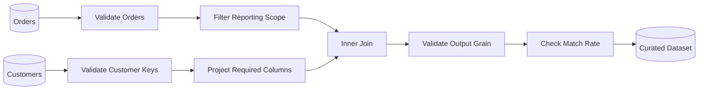

# 05- Inner Join

## Overview

An inner join combines two DataFrames and retains **only rows whose join keys match on both sides**.

In Pandas:

```python
result = left.merge(
    right,
    on="key",
    how="inner",
)
```

An inner join is the Pandas equivalent of a SQL `INNER JOIN`.

It is appropriate when the result should contain only records participating in a valid relationship:

```text
Orders
    +
Customers
    ↓
matching customer_id values
    ↓
orders with recognized customers
```

The important engineering questions are:

```text
What is the join key?
Which rows should survive?
What is the expected cardinality?
Can duplicate keys multiply rows?
How many records are intentionally discarded?
Does the output preserve the required grain?
```

An inner join is simple syntactically but can be dangerous when unmatched records are silently removed.

---

## Why Inner Joins Exist

Normalized systems often store related entities separately.

For example:

```text
customers
    customer_id
    name
    segment

orders
    order_id
    customer_id
    revenue
```

A report may require only orders associated with a known customer.

```python
valid_orders = orders.merge(
    customers,
    on="customer_id",
    how="inner",
)
```

The join establishes the relationship through `customer_id` and removes orders whose customer does not exist in the lookup dataset.

This is useful when the relationship is required for the downstream operation.

---

## Basic Syntax

The standard form is:

```python
result = left.merge(
    right,
    on="key",
    how="inner",
)
```

With different key names:

```python
result = left.merge(
    right,
    left_on="customer_id",
    right_on="id",
    how="inner",
)
```

With multiple keys:

```python
result = left.merge(
    right,
    on=["tenant_id", "customer_id"],
    how="inner",
)
```

With cardinality validation:

```python
result = left.merge(
    right,
    on="customer_id",
    how="inner",
    validate="many_to_one",
)
```

---

## Example Dataset

Consider:

```python
import pandas as pd


orders = pd.DataFrame(
    {
        "order_id": [1001, 1002, 1003, 1004],
        "customer_id": [101, 102, 101, 999],
        "revenue": [250.0, 180.0, 420.0, 150.0],
    }
)

customers = pd.DataFrame(
    {
        "customer_id": [101, 103, 104],
        "segment": [
            "Enterprise",
            "SMB",
            "Enterprise",
        ],
    }
)
```

Matching keys are:

```text
orders:
101
102
101
999

customers:
101
103
104
```

Only `101` exists on both sides.

Therefore:

```python
result = orders.merge(
    customers,
    on="customer_id",
    how="inner",
)
```

produces:

```text
order_id | customer_id | revenue | segment
---------|-------------|---------|------------
1001     | 101         | 250.0   | Enterprise
1003     | 101         | 420.0   | Enterprise
```

Orders for:

```text
customer_id = 102
customer_id = 999
```

are removed.

Customers `103` and `104` are also absent because they have no matching order.

---

## How an Inner Join Works

Conceptually:


The result contains matched record pairs.

For unique keys:

```text
left key 101
    ↕
right key 101
```

produces one output row.

For duplicate keys:

```text
left key 101 → 3 rows
right key 101 → 2 rows
```

the matching portion can produce:

```text
3 × 2 = 6 rows
```

This is why key cardinality matters as much as join type.

---

## Inner Join Semantics

The fundamental rule is:

> Keep records whose join key exists on both sides.

For key sets:

```text
Left  = {101, 102, 103}
Right = {101, 103, 104}
```

the matched key set is:

```text
Intersection = {101, 103}
```

Therefore:

```text
inner join
    → intersection of key populations
```

This is useful when only intersecting populations are meaningful.

---

## When to Use an Inner Join

Use an inner join when:

```text
unmatched left rows should not exist in the output
```

Typical examples:

- Orders with valid customers.
- Transactions with recognized accounts.
- Employees with valid departments.
- Events associated with registered devices.
- Products present in an active catalog.
- Records shared across two systems during reconciliation.

Example:

```python
transactions_with_accounts = transactions.merge(
    accounts,
    on="account_id",
    how="inner",
    validate="many_to_one",
)
```

---

## When Not to Use an Inner Join

Do not use an inner join merely because the output "looks cleaner."

Avoid it when:

```text
the left dataset must be preserved
```

For example:

> Every order must appear even when customer metadata is unavailable.

That requirement calls for a left join:

```python
orders.merge(
    customers,
    on="customer_id",
    how="left",
)
```

An inner join would silently remove the unmatched orders.

---

## Inner Join Versus Left Join

| Requirement | Inner Join | Left Join |
| --- | --- | --- |
| Keep only matched records | Yes | No |
| Preserve every left row | No | Yes |
| Expose missing enrichment as null | No | Yes |
| Useful for required relationships | Yes | Sometimes |
| Useful for optional enrichment | Usually no | Yes |
| Can silently reduce left population | Yes | Usually no, absent row multiplication |

The correct choice depends on whether unmatched records are:

```text
invalid for the output
```

or:

```text
important records that need to remain visible
```

---

## Inner Join Versus Outer Join

An outer join preserves unmatched records from both sides:

```python
comparison = orders.merge(
    customers,
    on="customer_id",
    how="outer",
)
```

An inner join keeps only matches:

```python
matched = orders.merge(
    customers,
    on="customer_id",
    how="inner",
)
```

Use:

```text
inner
    → matched population

outer
    → complete population comparison
```

For data reconciliation, outer joins are generally more informative because they reveal records missing from either side.

---

## Inner Join and Output Grain

Suppose:

```text
orders
one row = one order
```

and:

```text
customers
one row = one customer
```

Then:

```python
result = orders.merge(
    customers,
    on="customer_id",
    how="inner",
    validate="many_to_one",
)
```

has:

```text
one row = one order
```

for the matching orders.

The grain is preserved, but the population may shrink.

This distinction is important:

```text
grain
    → what one row represents

population
    → which rows are present
```

An inner join can change the population without changing the logical grain.

---

## Cardinality

Join cardinality determines how many output rows a matched key can create.

Common relationships:

```text
one-to-one
one-to-many
many-to-one
many-to-many
```

For a typical order enrichment:

```text
orders.customer_id
    many
    ↓
customers.customer_id
    one
```

Use:

```python
validate="many_to_one"
```

This protects against duplicated customer records.

---

## One-to-One Inner Join

When both DataFrames have unique keys:

```python
result = left.merge(
    right,
    on="customer_id",
    how="inner",
    validate="one_to_one",
)
```

Each matching key produces at most one output row.

This is useful for combining two entity-level datasets.

---

## Many-to-One Inner Join

Common for fact-to-dimension relationships:

```python
result = orders.merge(
    customers,
    on="customer_id",
    how="inner",
    validate="many_to_one",
)
```

The meaning is:

```text
many orders
    →
one customer
```

The output contains one row per matching order.

---

## One-to-Many Inner Join

Example:

```python
result = customers.merge(
    orders,
    on="customer_id",
    how="inner",
    validate="one_to_many",
)
```

A customer can match many orders.

The output grain becomes:

```text
one row = one matching order
```

even though the left input was customer-level.

Always reconsider the output grain after changing merge orientation.

---

## Many-to-Many Inner Join

A many-to-many inner join can multiply matching records:

```python
result = left.merge(
    right,
    on="key",
    how="inner",
    validate="many_to_many",
)
```

This should only be used when many-to-many semantics are intentional.

Do not use:

```python
validate="many_to_many"
```

simply because another validation mode fails.

---

## Duplicate Keys

Consider:

```text
left:
key 101 → 2 rows

right:
key 101 → 3 rows
```

The inner join can produce:

```text
2 × 3 = 6 rows
```

This behavior follows relational join semantics.

If the expected relationship is many-to-one, duplicate right keys indicate a problem.

Validate:

```python
result = left.merge(
    right,
    on="key",
    how="inner",
    validate="many_to_one",
)
```

---

## Detecting Duplicate Keys

Check the lookup dataset directly:

```python
duplicate_keys = right.loc[
    right["key"].duplicated(
        keep=False
    )
]
```

Or:

```python
if right["key"].duplicated().any():
    raise ValueError(
        "Right-side join key is not unique."
    )
```

Do not automatically call:

```python
drop_duplicates()
```

without understanding the cause.

Duplicates can represent:

- Historical versions.
- Multiple states.
- Legitimate child records.
- Data corruption.
- Incorrect upstream joins.

---

## `validate=` as a Production Guardrail

Example:

```python
matched_orders = orders.merge(
    customers,
    on="customer_id",
    how="inner",
    validate="many_to_one",
)
```

If customer keys are unexpectedly duplicated, Pandas raises `MergeError`.

This changes the failure mode from:

```text
silent row multiplication
```

to:

```text
visible pipeline failure
```

For production ETL, explicit cardinality validation is strongly preferable to relying on manual assumptions.

---

## Missing Join Keys

Rows with missing join keys generally cannot establish a valid relationship.

For an inner join:

```python
result = orders.merge(
    customers,
    on="customer_id",
    how="inner",
)
```

orders with missing customer IDs do not become matched customer records.

This is usually appropriate when the desired dataset contains only valid relationships.

However, measure the number of missing keys before joining when missingness itself is a data-quality signal:

```python
missing_key_count = orders[
    "customer_id"
].isna().sum()
```

---

## Unmatched Record Analysis

An inner join hides unmatched records by design.

If unmatched records matter operationally, use an outer comparison first:

```python
comparison = orders.merge(
    customers,
    on="customer_id",
    how="outer",
    indicator=True,
)
```

Then:

```python
unmatched_orders = comparison.loc[
    comparison["_merge"].eq("left_only")
]
```

This can be done as a diagnostic before producing the final inner-joined dataset.

---

## `indicator=True` with Inner Joins

You can technically use:

```python
result = orders.merge(
    customers,
    on="customer_id",
    how="inner",
    indicator=True,
)
```

For an inner join, all retained records are matched, so `_merge` will indicate membership on both sides.

Therefore, `indicator=True` is generally more useful with:

```text
outer
left
right
```

when unmatched populations need to be analyzed.

---

## Different Key Names

An inner join can map different source schemas:

```python
result = orders.merge(
    customer_reference,
    left_on="customer_id",
    right_on="id",
    how="inner",
    validate="many_to_one",
)
```

If the two keys represent the same business identifier, normalize the schema when practical:

```python
customer_reference = customer_reference.rename(
    columns={"id": "customer_id"}
)

result = orders.merge(
    customer_reference,
    on="customer_id",
    how="inner",
    validate="many_to_one",
)
```

Consistent schemas simplify long-lived pipelines.

---

## Composite Join Keys

Some identifiers are only unique inside a scope.

For example:

```text
tenant_id
customer_id
```

should be joined together:

```python
result = orders.merge(
    customers,
    on=[
        "tenant_id",
        "customer_id",
    ],
    how="inner",
    validate="many_to_one",
)
```

This prevents records with the same customer ID from different tenants from being incorrectly matched.

Composite keys are especially important in multi-tenant systems.

---

## Join Key Dtypes

Keys should have compatible representations.

Check:

```python
print(
    orders["customer_id"].dtype
)

print(
    customers["customer_id"].dtype
)
```

Normalize explicitly when necessary:

```python
orders["customer_id"] = (
    orders["customer_id"]
    .astype("string")
)

customers["customer_id"] = (
    customers["customer_id"]
    .astype("string")
)
```

This is especially important when combining:

```text
PostgreSQL data
API data
CSV data
Excel data
Parquet data
```

Different sources often represent identifiers differently.

---

## Identifier Semantics

Identifiers should not automatically be converted to numeric types.

For example:

```text
"000123"
```

may be a valid identifier that must remain:

```text
"000123"
```

rather than:

```text
123
```

Use explicit schema normalization before the inner join.

A correct join depends on both:

```text
key values
```

and:

```text
key representation
```

---

## Column Collisions

Suppose both DataFrames contain:

```text
status
```

Then:

```python
result = orders.merge(
    customers,
    on="customer_id",
    how="inner",
    suffixes=(
        "_order",
        "_customer",
    ),
)
```

This produces:

```text
status_order
status_customer
```

Use meaningful names when the fields have different meanings.

Avoid relying on generic `_x` and `_y` suffixes in a production schema.

---

## Project Columns Before Joining

Select only the columns needed from the right side:

```python
customer_lookup = customers[
    [
        "customer_id",
        "segment",
        "region",
    ]
]

result = orders.merge(
    customer_lookup,
    on="customer_id",
    how="inner",
    validate="many_to_one",
)
```

This reduces:

- Memory consumption.
- Result width.
- Data copying.
- Accidental sensitive-data propagation.

It also makes the intended contract easier to understand.

---

## Filtering Before an Inner Join

Filter the source population when the condition defines which records are eligible for matching:

```python
completed_orders = orders.loc[
    orders["status"].eq("completed")
]

result = completed_orders.merge(
    customers,
    on="customer_id",
    how="inner",
    validate="many_to_one",
)
```

The semantics are:

```text
select completed orders
    ↓
keep only those with matching customers
```

Be careful when filtering the right side because that can transform valid relationships into unmatched records.

---

## Example: Active Customer Orders

```python
active_customers = customers.loc[
    customers["status"].eq("active"),
    [
        "customer_id",
        "segment",
    ],
]

result = orders.merge(
    active_customers,
    on="customer_id",
    how="inner",
    validate="many_to_one",
)
```

This produces:

```text
orders
    ↓
match only currently active customers
    ↓
discard orders for non-active customers
```

This is appropriate only if inactive customers are intentionally excluded from the business population.

---

## Inner Join After API Normalization

Suppose two APIs return:

```text
orders:
customerId

customers:
id
```

Normalize first:

```python
orders = orders.rename(
    columns={
        "customerId": "customer_id",
    }
)

customers = customers.rename(
    columns={
        "id": "customer_id",
    }
)

result = orders.merge(
    customers[
        [
            "customer_id",
            "segment",
        ]
    ],
    on="customer_id",
    how="inner",
    validate="many_to_one",
)
```

This creates a stable internal schema independent of external field naming.

---

## PostgreSQL Equivalent

Pandas:

```python
result = orders.merge(
    customers,
    on="customer_id",
    how="inner",
    validate="many_to_one",
)
```

SQL:

```sql
SELECT
    o.order_id,
    o.customer_id,
    o.revenue,
    c.segment
FROM orders AS o
INNER JOIN customers AS c
    ON o.customer_id = c.customer_id;
```

The conceptual semantics are the same:

```text
retain only matching records
```

---

## SQL Pushdown

If both tables are already in PostgreSQL, an inner join often belongs in SQL for large datasets:

```sql
SELECT
    o.order_id,
    o.customer_id,
    o.revenue,
    c.segment
FROM orders AS o
INNER JOIN customers AS c
    ON o.customer_id = c.customer_id
WHERE o.status = 'completed';
```

Instead of:

```text
database
    ↓
millions of rows
    ↓
Pandas
    ↓
inner merge
```

you may prefer:

```text
database
    ↓
filter + inner join
    ↓
smaller result
    ↓
Pandas
```

This reduces network transfer and application memory requirements.

---

## Performance Characteristics

An inner join can produce a smaller result than the source datasets, but this does not automatically mean it is cheap.

Cost depends on:

- Left row count.
- Right row count.
- Key cardinality.
- Duplicate frequency.
- Number of columns.
- Number of matches.
- Result size.
- Key dtypes.

A many-to-many inner join can produce a very large result even when unmatched rows are removed.

---

## Reduce Data Before Joining

A useful optimization pattern is:

```text
filter rows
    ↓
select required columns
    ↓
normalize key types
    ↓
validate uniqueness
    ↓
inner join
```

Example:

```python
active_customers = customers.loc[
    customers["status"].eq("active"),
    [
        "customer_id",
        "segment",
    ],
].copy()

if active_customers[
    "customer_id"
].duplicated().any():
    raise ValueError(
        "Duplicate customer IDs detected."
    )

matched_orders = orders.merge(
    active_customers,
    on="customer_id",
    how="inner",
    validate="many_to_one",
)
```

---

## High-Cardinality Keys

A large number of unique keys increases the size of the structures required to perform the join.

Before joining, inspect:

```python
left_rows = len(orders)
right_rows = len(customers)

left_unique_keys = orders[
    "customer_id"
].nunique()

right_unique_keys = customers[
    "customer_id"
].nunique()
```

This helps identify:

```text
high duplicate concentration
```

or:

```text
unexpected key cardinality
```

which can materially affect output size.

---

## Duplicate Concentration

A useful diagnostic:

```python
key_counts = orders[
    "customer_id"
].value_counts()
```

This shows how many rows each key contributes.

For a many-to-many join, highly duplicated keys deserve special attention because they can dominate output size.

---

## Memory Considerations

The result of an inner join is a new DataFrame.

If:

```text
left = 20 million rows
right = 2 million rows
```

and most records match, the resulting DataFrame can still be large.

Reduce right-side width:

```python
customer_lookup = customers[
    [
        "customer_id",
        "segment",
    ]
]
```

Reduce left-side rows:

```python
orders = orders.loc[
    orders["status"].eq("completed")
]
```

For very large data, consider database-side execution.

---

## Empty Inputs

Inner joins can legitimately produce zero rows.

Examples:

```text
no orders in date range
no customers match filter
source-system mismatch
all transactions invalid
```

An empty result is not necessarily an error.

Distinguish:

```text
valid zero-match result
```

from:

```text
unexpected zero-match result
```

For critical pipelines, monitor the match rate.

---

## Match Rate

A useful operational metric is:

```python
matched = orders.merge(
    customers[
        ["customer_id"]
    ],
    on="customer_id",
    how="inner",
).shape[0]

match_rate = matched / len(orders)
```

For more complex cardinalities, calculate match rates based on the business entity rather than raw rows.

A sudden drop can indicate:

- Identifier changes.
- Missing lookup data.
- Upstream ingestion delays.
- Incorrect filtering.
- Schema drift.

---

## Data Quality Checks

Before the join:

```text
join key exists
join key dtype is correct
required keys are not unexpectedly null
expected uniqueness holds
```

After the join:

```text
row count is within expected bounds
output grain is correct
required columns exist
match rate is acceptable
metrics reconcile
```

This turns the merge into a controlled pipeline stage.

---

## Referential Integrity

An inner join is often useful when validating referential relationships.

Suppose every order should have a valid customer.

You can identify invalid orders separately:

```python
invalid_orders = orders.loc[
    ~orders["customer_id"].isin(
        customers["customer_id"]
    )
]
```

Then:

```python
if not invalid_orders.empty:
    raise ValueError(
        "Orders contain invalid customer IDs."
    )
```

The inner join itself can produce the matched dataset, while explicit validation exposes the records that failed the relationship.

---

## Inner Join in ETL

A common ETL sequence is:



The inner join becomes a deliberate data-quality boundary:

```text
only records with valid relationships
```

continue to the curated stage.

---

## Financial Data Example

Suppose transactions must reference an existing account:

```python
valid_transactions = transactions.merge(
    accounts[
        [
            "account_id",
            "account_type",
        ]
    ],
    on="account_id",
    how="inner",
    validate="many_to_one",
)
```

This can produce a clean downstream dataset.

However, invalid transactions should not simply disappear without being accounted for.

Track them separately:

```python
invalid_transactions = transactions.loc[
    ~transactions["account_id"].isin(
        accounts["account_id"]
    )
]
```

This supports reconciliation and data-quality reporting.

---

## Inner Join and Aggregation

After an inner join:

```python
valid_orders = orders.merge(
    customers,
    on="customer_id",
    how="inner",
    validate="many_to_one",
)
```

you may aggregate:

```python
report = (
    valid_orders.groupby(
        "segment",
        as_index=False,
    )
    .agg(
        total_revenue=("revenue", "sum"),
        order_count=("order_id", "nunique"),
    )
)
```

The reported metrics now represent:

```text
orders with valid customer relationships
```

not necessarily:

```text
all source orders
```

Document that population explicitly.

---

## Inner Join and Grouped Transformations

After matching valid records:

```python
valid_orders = orders.merge(
    customers,
    on="customer_id",
    how="inner",
    validate="many_to_one",
)
```

you can calculate group-level context:

```python
valid_orders["segment_total"] = (
    valid_orders.groupby("segment")[
        "revenue"
    ].transform("sum")
)
```

The join establishes the valid population; the grouped transformation derives additional context.

---

## Common Mistakes

### Using Inner Join for Optional Enrichment

If missing customer metadata should not remove an order:

```python
orders.merge(
    customers,
    on="customer_id",
    how="inner",
)
```

is wrong.

Use a left join instead.

---

### Ignoring Dropped Records

A successful inner join can remove thousands of records without raising an error.

Measure:

```python
input_rows = len(orders)
output_rows = len(result)

dropped_rows = (
    input_rows - output_rows
)
```

For many-to-many joins, use more appropriate entity-level metrics because output rows can increase rather than simply decrease.

---

### Assuming Inner Join Prevents Row Multiplication

It does not.

Duplicate keys can still multiply matching rows.

Use `validate=`.

---

### Treating Missing Results as Automatically Invalid

An empty inner-join result can mean:

```text
valid zero matches
```

or:

```text
pipeline failure
```

The application must distinguish these cases.

---

### Joining on Weak Identifiers

Avoid:

```text
customer_name
email
phone
```

when stable IDs exist.

Weak keys can produce both false mismatches and incorrect matches.

---

### Deduplicating to Force Cardinality

This is risky:

```python
customers = customers.drop_duplicates(
    "customer_id"
)
```

without understanding why duplicates exist.

This can discard legitimate historical or versioned records.

Fix the data model or use the correct temporal/business rule.

---

## Production Pitfalls

### Silent Population Changes

An inner join can cause:

```text
1,000,000 source orders
    ↓
920,000 matched orders
```

The final report may look completely valid while 80,000 source records disappeared.

Always track match or drop rates.

---

### Incorrect Filter Ordering

Filtering the right side before the inner join changes which relationships exist.

For example:

```python
active_customers = customers.loc[
    customers["status"].eq("active")
]

result = orders.merge(
    active_customers,
    on="customer_id",
    how="inner",
)
```

means:

```text
orders belonging to active customers
```

not:

```text
orders with any customer
```

This may be correct, but it must be intentional.

---

### Duplicate Lookup Data

A customer snapshot may contain multiple records per customer because of:

```text
historical versions
multiple source systems
duplicate ingestion
```

Do not force uniqueness without understanding the source semantics.

---

### Aggregating After an Incorrect Join

This can hide the original error:

```text
bad join
    ↓
row multiplication
    ↓
groupby().sum()
    ↓
incorrect revenue
```

Validate joins before aggregation.

---

### Large Joins in Request Handlers

Do not place large Pandas inner joins directly into latency-sensitive FastAPI or Django request paths without careful capacity planning.

For expensive reporting workloads, consider:

```text
Celery
batch jobs
precomputed datasets
PostgreSQL
data warehouse
```

---

## Security Considerations

Inner joins do not provide authorization.

For multi-tenant systems:

```python
result = orders.merge(
    customers,
    on=[
        "tenant_id",
        "customer_id",
    ],
    how="inner",
    validate="many_to_one",
)
```

Ensure the source data is already restricted to the authorized tenant scope.

Also project only required columns:

```python
customers = customers[
    [
        "tenant_id",
        "customer_id",
        "segment",
    ]
]
```

Do not propagate sensitive attributes simply because they are available in the lookup table.

---

## Reliability and Idempotency

An inner join is deterministic when:

```text
left input
+
right input
+
join keys
+
join semantics
```

are deterministic.

For retryable ETL:

```text
same source snapshots
+
same join rules
=
same matched result
```

Do not depend on arbitrary deduplication or unstable source ordering to determine which records survive.

---

## Monitoring

Useful metrics include:

```text
left_input_rows
right_input_rows
left_unique_keys
right_unique_keys
matched_rows
matched_entities
unmatched_left_rows
match_rate
duplicate_right_keys
output_rows
join_duration_ms
memory_usage_bytes
```

Example:

```python
match_rate = (
    result["order_id"].nunique()
    / orders["order_id"].nunique()
)
```

The correct denominator depends on the business entity being measured.

Monitor both technical and business-level metrics.

---

## Testing

Test the essential inner-join properties:

```text
only matching records remain
unmatched records are excluded
expected columns are present
cardinality is enforced
duplicate keys fail when prohibited
output grain is correct
key types are compatible
empty results behave correctly
```

Example:

```python
import pandas as pd


def test_inner_join_keeps_only_matches() -> None:
    orders = pd.DataFrame(
        {
            "order_id": [1, 2, 3],
            "customer_id": [101, 102, 999],
        }
    )

    customers = pd.DataFrame(
        {
            "customer_id": [101, 103],
            "segment": [
                "Enterprise",
                "SMB",
            ],
        }
    )

    result = orders.merge(
        customers,
        on="customer_id",
        how="inner",
        validate="many_to_one",
    )

    assert result["order_id"].tolist() == [1]
    assert result["customer_id"].tolist() == [101]
```

---

## Testing Grain Preservation

For a many-to-one order/customer relationship:

```python
assert result["order_id"].is_unique
```

and, when appropriate:

```python
assert result["order_id"].nunique() <= (
    orders["order_id"].nunique()
)
```

The second condition reflects the fact that an inner join can remove orders but should not create additional order records when the right relationship is many-to-one.

---

## Testing Cardinality Failure

Verify that duplicate lookup records fail:

```python
import pytest
import pandas as pd


def test_duplicate_customer_keys_fail() -> None:
    customers = pd.DataFrame(
        {
            "customer_id": [101, 101],
            "segment": [
                "Enterprise",
                "SMB",
            ],
        }
    )

    orders = pd.DataFrame(
        {
            "order_id": [1],
            "customer_id": [101],
        }
    )

    with pytest.raises(
        pd.errors.MergeError
    ):
        orders.merge(
            customers,
            on="customer_id",
            how="inner",
            validate="many_to_one",
        )
```

This protects against future lookup-table regressions.

---

## Recommended Production Pattern

A reusable inner-join function should make the population and relationship explicit:

```python
import pandas as pd


def get_valid_orders(
    orders: pd.DataFrame,
    customers: pd.DataFrame,
) -> pd.DataFrame:
    required_order_columns = {
        "order_id",
        "customer_id",
        "revenue",
    }

    required_customer_columns = {
        "customer_id",
        "segment",
    }

    missing_order_columns = (
        required_order_columns
        - set(orders.columns)
    )

    if missing_order_columns:
        raise ValueError(
            "Missing order columns: "
            f"{sorted(missing_order_columns)}"
        )

    missing_customer_columns = (
        required_customer_columns
        - set(customers.columns)
    )

    if missing_customer_columns:
        raise ValueError(
            "Missing customer columns: "
            f"{sorted(missing_customer_columns)}"
        )

    customer_lookup = customers[
        [
            "customer_id",
            "segment",
        ]
    ]

    if customer_lookup[
        "customer_id"
    ].duplicated().any():
        raise ValueError(
            "Customer IDs must be unique."
        )

    result = orders.merge(
        customer_lookup,
        on="customer_id",
        how="inner",
        validate="many_to_one",
    )

    if result["order_id"].duplicated().any():
        raise ValueError(
            "Inner join changed order grain."
        )

    return result
```

The processing contract is:

```text
validate input schema
    ↓
project required lookup fields
    ↓
validate lookup uniqueness
    ↓
inner join
    ↓
enforce many-to-one relationship
    ↓
verify output grain
```

For production pipelines, also track how many source records were excluded by the inner join.

---

## Decision Guide

| Requirement | Recommended Approach |
| --- | --- |
| Keep only matching records | `how="inner"` |
| Preserve all left records | `how="left"` |
| Preserve all right records | `how="right"` or swap sides |
| Preserve both populations | `how="outer"` |
| Validate fact-to-dimension relationship | `validate="many_to_one"` |
| Validate unique-to-unique relationship | `validate="one_to_one"` |
| Identify unmatched records | Outer join + `indicator=True` |
| Large database-backed inner join | Prefer SQL when practical |
| Required reference relationship | Inner join + validation |
| Optional enrichment | Usually left join |

---

## Key Takeaways

- An inner join keeps only records with matching join keys on both sides and is appropriate when unmatched records should not enter the resulting dataset.
- Join type and cardinality are separate concerns; use `validate=` to protect expected relationships such as `many_to_one` and prevent silent row multiplication.
- An inner join can silently reduce the source population, so monitor matched records, match rates, and excluded entities when source completeness matters.
- Reduce rows and columns before joining, normalize key dtypes, and prefer PostgreSQL or another scalable query engine for large database-resident joins when practical.
- Production inner joins should have explicit grain, key, null, duplicate, authorization, schema, monitoring, and reconciliation semantics rather than relying on successful execution as proof of correctness.