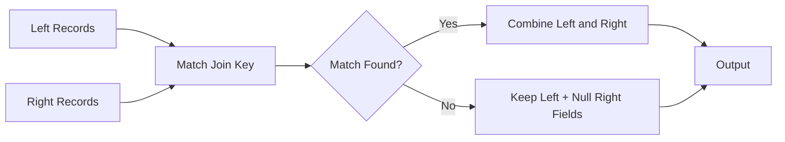
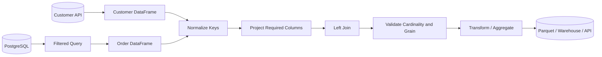
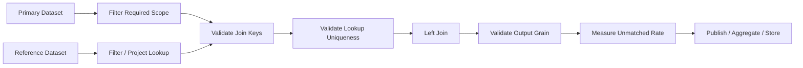

# 06- Left Join

## Overview

A left join combines two DataFrames while preserving **every row from the left DataFrame** and adding matching values from the right DataFrame.

In Pandas:

```python
result = left.merge(
    right,
    on="key",
    how="left",
)
```

A left join is the most common join pattern for **data enrichment**:

```text
Primary dataset
    +
Reference / lookup dataset
    ↓
Left join
    ↓
Primary records preserved
    +
matching attributes
```

Typical examples include:

- Orders enriched with customer attributes.
- Transactions enriched with account metadata.
- Events enriched with service information.
- Employees enriched with department details.
- Products enriched with category information.

The defining property is:

> Every record from the left DataFrame survives unless the join relationship itself multiplies matching rows.

That makes left joins useful for ETL pipelines where the primary dataset must not silently lose records.

---

## Why Left Joins Exist

Production datasets are often normalized.

For example:

```text
orders
    one row = one order

customers
    one row = one customer
```

Orders may contain:

```text
order_id
customer_id
revenue
```

while customers contain:

```text
customer_id
segment
region
```

The application may need customer attributes without losing any orders.

```python
enriched_orders = orders.merge(
    customers,
    on="customer_id",
    how="left",
)
```

This produces an order-level dataset with optional customer enrichment.

---

## Basic Syntax

The standard form is:

```python
result = left.merge(
    right,
    on="key",
    how="left",
)
```

For different key names:

```python
result = left.merge(
    right,
    left_on="customer_id",
    right_on="id",
    how="left",
)
```

For multiple keys:

```python
result = left.merge(
    right,
    on=["tenant_id", "customer_id"],
    how="left",
)
```

For cardinality validation:

```python
result = left.merge(
    right,
    on="customer_id",
    how="left",
    validate="many_to_one",
)
```

---

## Example Dataset

Consider:

```python
import pandas as pd


orders = pd.DataFrame(
    {
        "order_id": [1001, 1002, 1003, 1004],
        "customer_id": [101, 102, 101, 999],
        "revenue": [250.0, 180.0, 420.0, 150.0],
    }
)

customers = pd.DataFrame(
    {
        "customer_id": [101, 102, 103],
        "segment": [
            "Enterprise",
            "SMB",
            "Enterprise",
        ],
        "region": [
            "North",
            "South",
            "West",
        ],
    }
)
```

Perform a left join:

```python
result = orders.merge(
    customers,
    on="customer_id",
    how="left",
)
```

Result:

```text
order_id | customer_id | revenue | segment    | region
---------|-------------|---------|------------|--------
1001     | 101         | 250.0   | Enterprise | North
1002     | 102         | 180.0   | SMB        | South
1003     | 101         | 420.0   | Enterprise | North
1004     | 999         | 150.0   | NaN        | NaN
```

The order with customer `999` remains because it came from the left DataFrame.

---

## Core Semantics

A left join answers:

> For every left-side record, can I find a matching right-side record?

Conceptually:



This makes left joins particularly useful when the left-side dataset is the authoritative population.

---

## When to Use a Left Join

Use a left join when:

```text
all left-side records are important
```

and:

```text
right-side data is optional or enriching
```

Typical cases:

```text
orders + customers
events + services
transactions + accounts
employees + departments
products + categories
```

Example:

```python
orders = orders.merge(
    customers[
        [
            "customer_id",
            "segment",
        ]
    ],
    on="customer_id",
    how="left",
    validate="many_to_one",
)
```

---

## Why Left Joins Are Common in ETL

Fact-like datasets often represent the primary population:

```text
orders
transactions
events
payments
```

Dimension or lookup datasets provide additional context:

```text
customers
accounts
products
services
```

A left join preserves the fact records even when enrichment is temporarily unavailable.

This makes the failure visible as missing attributes rather than silently deleting business records.

---

## Left Join Versus Inner Join

The main difference is what happens to unmatched left rows.

| Behavior | Left Join | Inner Join |
| --- | --- | --- |
| Preserves all left rows | Yes | No |
| Keeps only matches | No | Yes |
| Unmatched left rows get null right fields | Yes | No |
| Common for enrichment | Yes | Sometimes |
| Can silently reduce left population | No, absent row multiplication | Yes |

For example:

```python
orders.merge(
    customers,
    on="customer_id",
    how="inner",
)
```

would remove order `1004`.

A left join keeps it.

---

## Left Join Versus Outer Join

A left join preserves:

```text
all left rows
+
matching right rows
```

An outer join preserves:

```text
all left rows
+
all right rows
```

Use:

```text
left
    → primary population is the left side

outer
    → both populations matter
```

For data reconciliation, outer joins are generally more appropriate because they expose right-only records.

---

## Left Join Versus Right Join

A right join preserves the right-hand population.

Instead of:

```python
orders.merge(
    customers,
    on="customer_id",
    how="right",
)
```

it is often clearer to reverse the operands:

```python
customers.merge(
    orders,
    on="customer_id",
    how="left",
)
```

Using the left side as the primary population often improves readability.

---

## Output Grain

Suppose:

```text
orders
one row = one order
```

and:

```text
customers
one row = one customer
```

Then:

```python
orders.merge(
    customers,
    on="customer_id",
    how="left",
    validate="many_to_one",
)
```

should produce:

```text
one row = one order
```

The population remains:

```text
all orders
```

provided the right-side customer key is unique.

This is one of the most important production invariants for enrichment joins.

---

## Cardinality

A left join does not define the relationship cardinality.

These are separate concerns:

```text
how="left"
    → which left rows survive

validate="many_to_one"
    → how many right rows may match each left row
```

For a typical order/customer relationship:

```text
many orders
    ↓
one customer
```

use:

```python
validate="many_to_one"
```

---

## Many-to-One Left Join

The common enrichment pattern is:

```python
enriched_orders = orders.merge(
    customers,
    on="customer_id",
    how="left",
    validate="many_to_one",
)
```

This means:

```text
left:
many orders per customer

right:
one customer record per customer_id
```

The expected result is:

```text
one row = one order
```

---

## Duplicate Right-Side Keys

Suppose `customers` contains:

```text
customer_id | segment
101         | SMB
101         | Enterprise
```

Then:

```python
orders.merge(
    customers,
    on="customer_id",
    how="left",
)
```

can produce multiple rows for every order belonging to customer `101`.

If one order matches two customer rows:

```text
one order
    ↓
two output rows
```

That violates the expected order grain.

Protect the pipeline with:

```python
validate="many_to_one"
```

---

## Validating Lookup Uniqueness

Check directly:

```python
if customers["customer_id"].duplicated().any():
    raise ValueError(
        "customer_id must be unique in customers."
    )
```

Then use merge validation as a second guardrail:

```python
orders = orders.merge(
    customers,
    on="customer_id",
    how="left",
    validate="many_to_one",
)
```

The source-level check provides a clearer failure reason; `validate` protects the actual join operation.

---

## Row Count Preservation

For a many-to-one left join:

```python
result = orders.merge(
    customers,
    on="customer_id",
    how="left",
    validate="many_to_one",
)
```

the row count should normally remain unchanged:

```python
if len(result) != len(orders):
    raise ValueError(
        "Left join changed the expected row count."
    )
```

This is a useful runtime invariant.

Do not apply this rule to every left join. A legitimate one-to-many relationship can intentionally increase row count.

---

## Unmatched Left Records

A left join preserves unmatched rows by filling right-side fields with missing values.

Example:

```python
result = orders.merge(
    customers,
    on="customer_id",
    how="left",
)
```

If customer `999` does not exist:

```text
customer_id = 999
segment     = NaN
region      = NaN
```

This creates a useful distinction:

```text
record exists
    +
enrichment unavailable
```

instead of:

```text
record disappears
```

---

## Measuring Unmatched Records

Do not simply accept null enrichment values without measuring them.

For example:

```python
unmatched = result["segment"].isna()

unmatched_count = unmatched.sum()
unmatched_rate = unmatched.mean()
```

A production pipeline can monitor:

```text
unmatched_count
unmatched_rate
```

This is useful for detecting:

- Missing lookup data.
- Identifier format changes.
- API failures.
- Ingestion lag.
- Referential-integrity problems.

---

## Distinguishing Missing Records from Missing Attributes

A null enrichment field can mean:

```text
customer did not match
```

or:

```text
customer matched, but segment itself is null
```

Use an indicator when the distinction matters:

```python
result = orders.merge(
    customers,
    on="customer_id",
    how="left",
    indicator=True,
)
```

Then:

```python
unmatched = result.loc[
    result["_merge"].eq("left_only")
]
```

This provides a more reliable measure of relationship failure than simply checking an arbitrary right-side attribute.

---

## Composite Keys

In multi-tenant systems, `customer_id` may not be globally unique.

Use the complete relationship:

```python
result = orders.merge(
    customers,
    on=[
        "tenant_id",
        "customer_id",
    ],
    how="left",
    validate="many_to_one",
)
```

This prevents:

```text
tenant A, customer 101
```

from accidentally matching:

```text
tenant B, customer 101
```

when IDs are scoped per tenant.

---

## Different Join Key Names

If the left side uses:

```text
customer_id
```

and the right side uses:

```text
id
```

use:

```python
result = orders.merge(
    customers,
    left_on="customer_id",
    right_on="id",
    how="left",
    validate="many_to_one",
)
```

For long-lived pipelines, normalizing source schemas first is often easier:

```python
customers = customers.rename(
    columns={
        "id": "customer_id",
    }
)

result = orders.merge(
    customers,
    on="customer_id",
    how="left",
    validate="many_to_one",
)
```

---

## Join Key Dtypes

Join keys should have compatible technical representations.

Check:

```python
orders["customer_id"].dtype
customers["customer_id"].dtype
```

Normalize identifiers when necessary:

```python
orders["customer_id"] = (
    orders["customer_id"]
    .astype("string")
)

customers["customer_id"] = (
    customers["customer_id"]
    .astype("string")
)
```

This is especially important when combining:

```text
PostgreSQL
REST APIs
CSV
Excel
Parquet
```

Identifiers should be normalized at data boundaries.

---

## Identifier Semantics

Do not treat identifiers as measurements.

For example:

```text
customer_id = "000123"
```

may be semantically different from:

```text
customer_id = "123"
```

Blind numeric conversion can destroy leading-zero semantics.

For external data:

```python
customers["customer_id"] = (
    customers["customer_id"]
    .astype("string")
)
```

may be appropriate when the identifier is logically textual.

---

## Missing Join Keys

A missing left-side key cannot normally produce a valid customer match.

Measure missing keys separately:

```python
missing_customer_ids = orders[
    "customer_id"
].isna().sum()
```

In a required relationship:

```python
if missing_customer_ids:
    raise ValueError(
        "Orders contain missing customer IDs."
    )
```

In an optional relationship, preserve the rows and treat them as unmatched.

---

## Filtering Before a Left Join

Filtering the right-hand dataset changes the meaning of the enrichment.

Example:

```python
active_customers = customers.loc[
    customers["status"].eq("active"),
    [
        "customer_id",
        "segment",
    ],
]

result = orders.merge(
    active_customers,
    on="customer_id",
    how="left",
    validate="many_to_one",
)
```

Now an inactive customer behaves like an unmatched customer.

This may be correct if the business requirement is:

```text
attach attributes only for active customers
```

but incorrect if the requirement is:

```text
attach attributes for every known customer
```

The filtering rule must be part of the business definition.

---

## Filtering the Left Side

Filtering the left side determines which primary records participate.

Example:

```python
completed_orders = orders.loc[
    orders["status"].eq("completed")
]

result = completed_orders.merge(
    customers,
    on="customer_id",
    how="left",
    validate="many_to_one",
)
```

This means:

```text
only completed orders
+
customer enrichment
```

Filtering before joining can also improve performance by reducing the number of rows that must be processed.

---

## Projecting the Right Side

Avoid joining an entire lookup table if only a few fields are required:

```python
customer_lookup = customers[
    [
        "customer_id",
        "segment",
        "region",
    ]
]

result = orders.merge(
    customer_lookup,
    on="customer_id",
    how="left",
    validate="many_to_one",
)
```

This reduces:

- Memory usage.
- Output width.
- Copying.
- Accidental data exposure.

It also communicates the data contract clearly.

---

## Column Collisions

If both DataFrames contain the same non-key column:

```python
result = orders.merge(
    customers,
    on="customer_id",
    how="left",
    suffixes=(
        "_order",
        "_customer",
    ),
)
```

This produces:

```text
status_order
status_customer
```

Use meaningful names when the fields have distinct semantics.

Avoid generic:

```text
status_x
status_y
```

in production-facing schemas when the distinction matters.

---

## Left Join with Multiple Tables

A common enrichment pipeline is:

```text
orders
    ↓
customer enrichment
    ↓
product enrichment
    ↓
reporting transformation
```

Example:

```python
enriched_orders = (
    orders
    .merge(
        customers[
            [
                "customer_id",
                "region",
            ]
        ],
        on="customer_id",
        how="left",
        validate="many_to_one",
    )
    .merge(
        products[
            [
                "product_id",
                "category",
            ]
        ],
        on="product_id",
        how="left",
        validate="many_to_one",
    )
)
```

Validate each relationship independently.

A later successful merge does not correct an earlier row-multiplication error.

---

## Left Join and Aggregation

Enrichment often precedes aggregation:

```python
enriched_orders = orders.merge(
    customers[
        [
            "customer_id",
            "region",
        ]
    ],
    on="customer_id",
    how="left",
    validate="many_to_one",
)

report = (
    enriched_orders.groupby(
        "region",
        as_index=False,
    )
    .agg(
        total_revenue=("revenue", "sum"),
        order_count=("order_id", "nunique"),
    )
)
```

The aggregation is only correct if the left join preserved the order grain.

This is why join validation belongs before aggregation.

---

## Left Join and Grouped Transformations

After enrichment:

```python
orders = orders.merge(
    customers[
        [
            "customer_id",
            "segment",
        ]
    ],
    on="customer_id",
    how="left",
    validate="many_to_one",
)
```

you can add group-level context:

```python
orders["segment_total"] = (
    orders.groupby("segment")[
        "revenue"
    ]
    .transform("sum")
)
```

The pipeline is:

```text
left join
    ↓
preserve order records
    ↓
grouped transform
    ↓
derive segment-level context
```

---

## Referential Integrity

A left join is often useful for identifying broken references.

Suppose every order should reference a valid customer.

Find invalid orders before or alongside the join:

```python
invalid_orders = orders.loc[
    ~orders["customer_id"].isin(
        customers["customer_id"]
    )
]
```

Then:

```python
if not invalid_orders.empty:
    raise ValueError(
        "Orders contain invalid customer references."
    )
```

Alternatively, use an indicator-based merge for richer diagnostics:

```python
check = orders.merge(
    customers[
        ["customer_id"]
    ],
    on="customer_id",
    how="left",
    indicator=True,
)
```

---

## Left Join Versus `isin()`

For existence-only checks:

```python
orders["customer_id"].isin(
    customers["customer_id"]
)
```

may be simpler than a full join.

Use `isin()` when you only need:

```text
does a key exist?
```

Use a left join when you need:

```text
attributes from the matching row
```

This avoids unnecessary joins when no enrichment is required.

---

## Left Join Versus `map()`

For a simple one-column lookup:

```python
segment_by_customer = customers.set_index(
    "customer_id"
)["segment"]

orders["segment"] = orders[
    "customer_id"
].map(segment_by_customer)
```

This can be concise.

Use `map()` for straightforward one-to-one value lookups.

Use `merge()` when you need:

- Multiple right-side columns.
- Explicit join types.
- Cardinality validation.
- More complex relational behavior.

---

## SQL Equivalent

Pandas:

```python
result = orders.merge(
    customers,
    on="customer_id",
    how="left",
    validate="many_to_one",
)
```

SQL:

```sql
SELECT
    o.order_id,
    o.customer_id,
    o.revenue,
    c.segment,
    c.region
FROM orders AS o
LEFT JOIN customers AS c
    ON o.customer_id = c.customer_id;
```

The semantics are:

```text
preserve all orders
+
attach matching customer fields
```

---

## PostgreSQL Pushdown

If both datasets are in PostgreSQL, the left join may be better executed there:

```sql
SELECT
    o.order_id,
    o.customer_id,
    o.revenue,
    c.segment,
    c.region
FROM orders AS o
LEFT JOIN customers AS c
    ON o.customer_id = c.customer_id
WHERE o.status = 'completed';
```

Benefits can include:

- Reduced network transfer.
- Lower Pandas memory usage.
- Database query optimization.
- Index utilization.
- Parallel execution where supported.

For very large datasets, avoid pulling entire relational tables into a Pandas worker just to reproduce a SQL join.

---

## Data Flow in a Backend Pipeline

A common production architecture:



The join should occur only after the source data has been validated sufficiently for the relationship being asserted.

---

## REST API Enrichment

Suppose an API returns orders while customer metadata comes from another service:

```python
orders = pd.DataFrame(
    orders_response["items"]
)

customers = pd.DataFrame(
    customer_response["items"]
)

customers = customers.rename(
    columns={
        "id": "customer_id",
    }
)

customers["customer_id"] = (
    customers["customer_id"]
    .astype("string")
)

orders["customer_id"] = (
    orders["customer_id"]
    .astype("string")
)
```

Then:

```python
orders = orders.merge(
    customers[
        [
            "customer_id",
            "segment",
        ]
    ],
    on="customer_id",
    how="left",
    validate="many_to_one",
)
```

Treat remote API data as untrusted input and validate its shape, keys, and freshness.

---

## Parquet Workflow

For local or object-storage data:

```python
orders = pd.read_parquet(
    "input/orders.parquet"
)

customers = pd.read_parquet(
    "input/customers.parquet",
    columns=[
        "customer_id",
        "segment",
    ],
)

result = orders.merge(
    customers,
    on="customer_id",
    how="left",
    validate="many_to_one",
)
```

Projection at read time is preferable when the file format and pipeline permit it.

For large AWS S3 datasets, use partitioning and selective reads where possible rather than loading unnecessary data into memory.

---

## Performance Considerations

Left joins can be expensive because Pandas must:

```text
read keys
    ↓
match records
    ↓
construct output
    ↓
copy required columns
```

Cost depends on:

- Number of rows.
- Key cardinality.
- Duplicate keys.
- Number of columns.
- Data types.
- Output size.

A many-to-one left join is often much more manageable than a many-to-many join.

---

## Optimize Before Joining

Use:

```text
filter rows
    ↓
project columns
    ↓
normalize key types
    ↓
validate uniqueness
    ↓
left join
```

Example:

```python
customer_lookup = customers.loc[
    customers["status"].eq("active"),
    [
        "customer_id",
        "segment",
    ],
].copy()

if customer_lookup[
    "customer_id"
].duplicated().any():
    raise ValueError(
        "Duplicate customer IDs detected."
    )

result = orders.merge(
    customer_lookup,
    on="customer_id",
    how="left",
    validate="many_to_one",
)
```

Do not filter the lookup table unless that filter is semantically correct.

---

## High-Cardinality Keys

Joining on a high-cardinality key is not inherently wrong, but it can increase memory and processing requirements.

Inspect:

```python
left_rows = len(orders)
right_rows = len(customers)

left_unique = orders[
    "customer_id"
].nunique()

right_unique = customers[
    "customer_id"
].nunique()
```

Also inspect duplicate concentrations when the right side should be unique:

```python
customers["customer_id"].value_counts()
```

Unexpected duplicate concentration can explain sudden output growth.

---

## Memory Considerations

A left join can produce a wide output even when the number of rows is preserved.

For example:

```text
10 million orders
+
10 customer attributes
```

can create a large additional memory footprint.

Select only needed columns:

```python
customer_lookup = customers[
    [
        "customer_id",
        "segment",
        "region",
    ]
]
```

For large workloads, measure memory before and after the join.

Avoid carrying sensitive or unused columns through intermediate DataFrames.

---

## Large Dataset Strategy

For a large SQL-backed system:

```text
PostgreSQL
    ↓
filter + left join
    ↓
reduced dataset
    ↓
Pandas
```

is often more efficient than:

```text
PostgreSQL
    ↓
raw orders
raw customers
    ↓
Pandas
    ↓
left merge
```

For larger-than-memory workloads, consider:

```text
PostgreSQL
DuckDB
data warehouse
Spark
distributed processing
```

Pandas should operate on a manageable working set.

---

## Incremental Processing

A left join over an incremental batch can be valid:

```python
daily_orders = orders.loc[
    orders["order_date"] == report_date
]

daily_result = daily_orders.merge(
    customers,
    on="customer_id",
    how="left",
    validate="many_to_one",
)
```

However, remember that the lookup state must correspond to the required time semantics.

A current customer snapshot may not be correct for a historical report.

For time-sensitive dimensions, a temporal join or versioned lookup may be required.

---

## Slowly Changing Dimensions

Suppose customers contain:

```text
customer_id | effective_from | segment
101         | 2025-01-01     | SMB
101         | 2026-01-01     | Enterprise
```

A simple:

```python
orders.merge(
    customers,
    on="customer_id",
    how="left",
)
```

creates multiple matches.

Do not arbitrarily deduplicate the customer table.

The correct implementation may require:

```text
effective-date filtering
temporal join
merge_asof()
current-state lookup table
```

The right approach depends on the business semantics.

---

## Empty DataFrames

A valid reporting interval may contain no orders:

```python
orders = orders.iloc[0:0].copy()
```

A left join should preserve the empty result's schema.

Test empty inputs when the pipeline can legitimately receive them.

Distinguish:

```text
no orders
```

from:

```text
orders source failed
```

The two states may require different operational responses.

---

## Unexpected Input

Validate required columns:

```python
required_columns = {
    "order_id",
    "customer_id",
    "revenue",
}

missing_columns = required_columns.difference(
    orders.columns
)

if missing_columns:
    raise ValueError(
        "Missing order columns: "
        f"{sorted(missing_columns)}"
    )
```

For the lookup:

```python
required_customer_columns = {
    "customer_id",
    "segment",
}

missing_customer_columns = (
    required_customer_columns
    - set(customers.columns)
)

if missing_customer_columns:
    raise ValueError(
        "Missing customer columns: "
        f"{sorted(missing_customer_columns)}"
    )
```

Fail early when required schema assumptions are violated.

---

## Testing Left Join Behavior

A strong test verifies:

- Every left record survives.
- Matching attributes are attached.
- Unmatched records remain.
- Output grain is preserved.
- Cardinality constraints are enforced.

Example:

```python
import pandas as pd
from pandas.testing import assert_frame_equal


def test_left_join_preserves_orders() -> None:
    orders = pd.DataFrame(
        {
            "order_id": [1, 2, 3],
            "customer_id": [101, 102, 999],
        }
    )

    customers = pd.DataFrame(
        {
            "customer_id": [101, 102],
            "segment": [
                "Enterprise",
                "SMB",
            ],
        }
    )

    actual = orders.merge(
        customers,
        on="customer_id",
        how="left",
        validate="many_to_one",
    )

    expected = pd.DataFrame(
        {
            "order_id": [1, 2, 3],
            "customer_id": [101, 102, 999],
            "segment": [
                "Enterprise",
                "SMB",
                None,
            ],
        }
    )

    assert_frame_equal(
        actual,
        expected,
        check_dtype=False,
    )
```

---

## Testing Grain Preservation

For a fact-to-dimension enrichment:

```python
result = orders.merge(
    customers,
    on="customer_id",
    how="left",
    validate="many_to_one",
)

assert len(result) == len(orders)
assert result["order_id"].is_unique
```

This ensures the enrichment did not multiply order records.

---

## Testing Unmatched Rates

For pipelines with an expected completeness threshold:

```python
unmatched_rate = (
    result["segment"].isna().mean()
)

assert unmatched_rate <= 0.01
```

The threshold should come from the data-quality contract.

Do not hard-code arbitrary tolerances merely to make tests pass.

---

## Testing Cardinality Failure

Ensure duplicate lookup keys are rejected:

```python
import pytest


def test_duplicate_customer_keys_fail() -> None:
    customers = pd.DataFrame(
        {
            "customer_id": [101, 101],
            "segment": [
                "Enterprise",
                "SMB",
            ],
        }
    )

    with pytest.raises(
        pd.errors.MergeError
    ):
        orders.merge(
            customers,
            on="customer_id",
            how="left",
            validate="many_to_one",
        )
```

This prevents future upstream changes from silently altering the output grain.

---

## Common Mistakes

### Using Inner Join for Enrichment

Incorrect when every order must remain:

```python
orders.merge(
    customers,
    on="customer_id",
    how="inner",
)
```

Use:

```python
how="left"
```

when the left population is authoritative.

---

### Assuming Left Join Means No Row Multiplication

A left join can still multiply rows when the right side contains duplicate keys.

Use:

```python
validate="many_to_one"
```

where appropriate.

---

### Ignoring Unmatched Rows

Null enrichment fields may indicate:

```text
missing customer
identifier drift
source lag
API failure
```

Measure and monitor them.

---

### Filtering the Lookup Without Considering Semantics

This:

```python
active_customers = customers.loc[
    customers["status"].eq("active")
]
```

changes which customer records can match.

Use it only when the business rule requires active-only enrichment.

---

### Dropping Duplicate Lookup Rows Automatically

Avoid:

```python
customers = customers.drop_duplicates(
    "customer_id"
)
```

unless there is an explicit rule determining which duplicate represents the authoritative record.

---

### Joining on Weak Identifiers

Avoid using:

```text
name
email
phone
```

when a stable identifier exists.

---

### Ignoring Key Dtypes

The same identifier can be represented differently across:

```text
CSV
API
database
Parquet
```

Normalize keys before joining.

---

## Production Pitfalls

### Accidental Row Multiplication

The most important left-join failure mode is:

```text
one left row
    ↓
multiple right matches
    ↓
multiple output rows
```

This can corrupt downstream:

```text
revenue
transaction counts
event counts
```

without producing an obvious exception.

Use cardinality validation and output-grain checks.

---

### Silent Enrichment Degradation

A left join can continue succeeding while the right side stops matching because of an upstream key change.

Example:

```text
expected match rate → 99.9%
actual match rate   → 72%
```

The DataFrame is still valid syntactically.

Monitoring is therefore essential.

---

### Historical Dimension Mismatch

Using today's customer attributes for a historical transaction can produce semantically incorrect reports.

A left join does not solve temporal correctness by itself.

---

### Many-to-Many Join Explosion

A duplicated left key and duplicated right key can multiply records dramatically.

Estimate cardinality and validate expected relationships before joining.

---

### Large In-Memory Enrichment

Loading huge fact and dimension datasets into a Docker or Kubernetes worker can produce:

```text
high memory use
OOM kills
slow garbage collection
worker restarts
```

Push large joins toward PostgreSQL or another analytical engine when practical.

---

## Security Considerations

A left join can propagate sensitive information into the primary dataset.

For example, a customer table may contain:

```text
email
phone
address
internal_risk_score
payment_status
```

but the order pipeline may need only:

```text
segment
region
```

Project only required fields:

```python
customer_lookup = customers[
    [
        "customer_id",
        "segment",
        "region",
    ]
]
```

Authorization must be established before combining restricted datasets.

---

## Multi-Tenant Security

If customer IDs are tenant-scoped:

```python
result = orders.merge(
    customers,
    on=[
        "tenant_id",
        "customer_id",
    ],
    how="left",
    validate="many_to_one",
)
```

Do not rely on:

```text
customer_id
```

alone when it is not globally unique.

A join that crosses tenant boundaries is both a correctness problem and a potential data-isolation failure.

---

## Reliability and Idempotency

A left join is deterministic given stable inputs and keys.

For a retryable ETL job:

```text
same orders snapshot
+
same customer snapshot
+
same join rules
=
same enriched output
```

Avoid nondeterministic deduplication logic.

When lookup data is versioned, make the selected version deterministic using explicit effective-time rules.

---

## Monitoring

Track:

```text
left_input_rows
right_input_rows
left_unique_keys
right_unique_keys
duplicate_right_keys
output_rows
unmatched_left_rows
unmatched_rate
join_duration_ms
memory_usage_bytes
```

For many-to-one enrichment, monitor:

```text
output_rows / left_input_rows
```

A value greater than `1` is usually suspicious unless row multiplication is intentionally part of the data model.

---

## Production Data Flow

A robust left-join stage looks like:



This turns an otherwise implicit join assumption into a controlled transformation boundary.

---

## Recommended Production Pattern

A reusable left-join function should make its assumptions explicit:

```python
import pandas as pd


def enrich_orders(
    orders: pd.DataFrame,
    customers: pd.DataFrame,
) -> pd.DataFrame:
    required_order_columns = {
        "order_id",
        "customer_id",
        "revenue",
    }

    required_customer_columns = {
        "customer_id",
        "segment",
    }

    missing_order_columns = (
        required_order_columns
        - set(orders.columns)
    )

    if missing_order_columns:
        raise ValueError(
            "Missing order columns: "
            f"{sorted(missing_order_columns)}"
        )

    missing_customer_columns = (
        required_customer_columns
        - set(customers.columns)
    )

    if missing_customer_columns:
        raise ValueError(
            "Missing customer columns: "
            f"{sorted(missing_customer_columns)}"
        )

    customer_lookup = customers[
        [
            "customer_id",
            "segment",
        ]
    ]

    if customer_lookup[
        "customer_id"
    ].duplicated().any():
        raise ValueError(
            "Customer lookup contains duplicate keys."
        )

    result = orders.merge(
        customer_lookup,
        on="customer_id",
        how="left",
        validate="many_to_one",
    )

    if len(result) != len(orders):
        raise ValueError(
            "Left join changed the expected "
            "order grain."
        )

    return result
```

The design is:

```text
validate source schema
    ↓
project required lookup columns
    ↓
validate lookup uniqueness
    ↓
left join
    ↓
enforce many-to-one cardinality
    ↓
verify primary grain
```

For important pipelines, also measure unmatched-record rates.

---

## Decision Guide

| Requirement | Recommended Pattern |
| --- | --- |
| Preserve every left record | `how="left"` |
| Enrich a fact table with optional attributes | Left join |
| Only matched records should survive | Inner join |
| Preserve both datasets | Outer join |
| Left fact table to unique dimension table | Left + `validate="many_to_one"` |
| Check existence only | `isin()` |
| Simple one-column lookup | `map()` |
| Multiple lookup attributes | `merge()` |
| Different key names | `left_on` + `right_on` |
| Composite tenant-scoped keys | Multiple `on` columns |
| Detect unmatched relationships | `indicator=True` or explicit key analysis |
| Large SQL-backed enrichment | SQL left join where practical |
| Historical/versioned lookup | Temporal or effective-date join |

---

## Key Takeaways

- A left join preserves the entire left-side population and attaches matching right-side attributes, making it the standard pattern for many data-enrichment workflows.
- `how="left"` controls record preservation while `validate="many_to_one"` or another cardinality rule controls the expected relationship; both should be considered independently.
- A left join can silently produce null enrichments or multiply rows, so monitor unmatched rates and validate output grain rather than assuming successful execution means correct data.
- Reduce and project lookup data before joining, normalize identifier dtypes, and push large database-resident joins into PostgreSQL or another scalable engine when practical.
- Production left joins should explicitly handle duplicate keys, missing identifiers, temporal dimensions, tenant boundaries, sensitive fields, schema contracts, monitoring, and reconciliation.