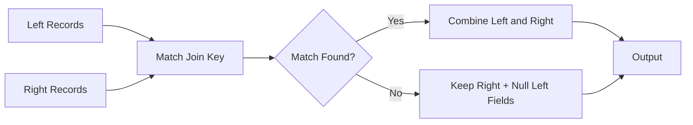
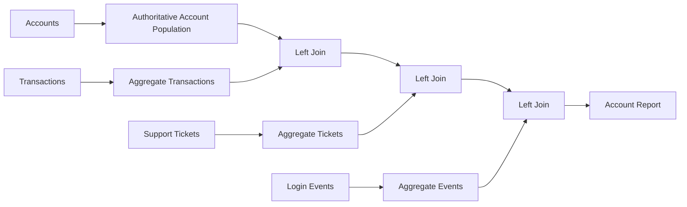

# 07- Right Join

## Overview

A right join combines two DataFrames while preserving **every row from the right DataFrame** and attaching matching values from the left DataFrame.

In Pandas:

```python
result = left.merge(
    right,
    on="key",
    how="right",
)
```

The defining property is:

> Every record from the right DataFrame remains in the result, including records that have no corresponding row on the left.

A right join is logically equivalent to reversing the DataFrames and performing a left join:

```python
left.merge(
    right,
    on="key",
    how="right",
)
```

is conceptually equivalent to:

```python
right.merge(
    left,
    on="key",
    how="left",
)
```

The second form is often easier to read because most production pipelines are designed around an explicitly named primary dataset.

---

## Why Right Joins Exist

A right join is useful when the **right-hand DataFrame represents the authoritative population** that must be preserved.

Consider:

```text
transactions
    one row = one transaction

accounts
    one row = one account
```

Suppose the requirement is:

> Show every account, including accounts that have no transactions.

A right join can express this directly:

```python
account_activity = transactions.merge(
    accounts,
    on="account_id",
    how="right",
)
```

Accounts without transactions receive missing values for transaction columns.

However, reversing the operands is often clearer:

```python
account_activity = accounts.merge(
    transactions,
    on="account_id",
    how="left",
)
```

Both express the same population requirement.

---

## Basic Syntax

The standard syntax is:

```python
result = left.merge(
    right,
    on="key",
    how="right",
)
```

For different key names:

```python
result = left.merge(
    right,
    left_on="account_id",
    right_on="id",
    how="right",
)
```

For multiple keys:

```python
result = left.merge(
    right,
    on=[
        "tenant_id",
        "account_id",
    ],
    how="right",
)
```

With cardinality validation:

```python
result = left.merge(
    right,
    on="account_id",
    how="right",
    validate="many_to_one",
)
```

The `validate` setting should reflect the relationship between the two inputs, not the join direction.

---

## Example Dataset

Consider transaction and account data:

```python
import pandas as pd


transactions = pd.DataFrame(
    {
        "transaction_id": [5001, 5002, 5003],
        "account_id": [101, 101, 102],
        "amount": [250.0, 180.0, 420.0],
    }
)

accounts = pd.DataFrame(
    {
        "account_id": [101, 102, 103, 104],
        "account_name": [
            "Acme Corp",
            "Northwind",
            "Globex",
            "Initech",
        ],
        "status": [
            "active",
            "active",
            "active",
            "suspended",
        ],
    }
)
```

Perform a right join:

```python
result = transactions.merge(
    accounts,
    on="account_id",
    how="right",
)
```

Conceptually, the result is:

```text
transaction_id | account_id | amount | account_name | status
---------------|------------|--------|--------------|---------
5001           | 101        | 250.0  | Acme Corp    | active
5002           | 101        | 180.0  | Acme Corp    | active
5003           | 102        | 420.0  | Northwind    | active
NaN            | 103        | NaN    | Globex       | active
NaN            | 104        | NaN    | Initech      | suspended
```

Accounts `103` and `104` survive even though there are no matching transaction records.

---

## Core Semantics

A right join asks:

> For every right-side record, can I find one or more matching left-side records?



The right DataFrame defines the preserved population.

---

## When to Use a Right Join

Use a right join when:

```text
the right-side population must be fully preserved
```

Examples include:

```text
transactions + accounts
orders + product_catalog
events + services
payments + invoices
employee_activity + employees
```

Typical requirements include:

- Show every account, even inactive ones.
- Show every product, even products with zero orders.
- Show every employee, even employees with no activity.
- Reconcile a transaction feed against an authoritative reference dataset.

---

## Right Join Versus Left Join

A right join and a left join can express the same relationship by reversing operand order.

| Requirement | Preferred Expression |
| --- | --- |
| Preserve left DataFrame | `how="left"` |
| Preserve right DataFrame | `how="right"` |
| Primary dataset is naturally left-oriented | Left join |
| Primary dataset is naturally right-oriented | Right join can be used |
| Want consistent pipeline style | Prefer left join with authoritative table first |

For example:

```python
transactions.merge(
    accounts,
    on="account_id",
    how="right",
)
```

and:

```python
accounts.merge(
    transactions,
    on="account_id",
    how="left",
)
```

have equivalent preservation semantics.

---

## Why Left Joins Are Often Preferred

Although right joins are valid, many teams standardize on left joins because they make the primary population explicit:

```python
primary.merge(
    enrichment,
    on="key",
    how="left",
)
```

This pattern reads naturally:

```text
take primary records
+
attach optional information
```

For maintainability, it can be easier to rewrite:

```python
transactions.merge(
    accounts,
    on="account_id",
    how="right",
)
```

as:

```python
accounts.merge(
    transactions,
    on="account_id",
    how="left",
)
```

when the accounts table is the required population.

The important rule is not to avoid `how="right"` categorically. It is to make the preserved population obvious.

---

## Right Join Versus Inner Join

An inner join keeps only matching records:

```python
transactions.merge(
    accounts,
    on="account_id",
    how="inner",
)
```

A right join keeps every right-side account:

```python
transactions.merge(
    accounts,
    on="account_id",
    how="right",
)
```

Therefore:

```text
inner
    → only relationships that exist on both sides

right
    → all right records + matching left records
```

For zero-activity reporting, an inner join is usually incorrect because entities with no activity disappear.

---

## Right Join Versus Outer Join

A right join preserves:

```text
all right records
+
matching left records
```

An outer join preserves:

```text
all left records
+
all right records
```

For data reconciliation, use an outer join when discrepancies on both sides matter.

For example:

```python
reconciliation = source_a.merge(
    source_b,
    on="transaction_id",
    how="outer",
    indicator=True,
)
```

A right join is more appropriate when the right side is the authoritative population.

---

## Output Grain

Suppose:

```text
transactions
one row = one transaction
```

and:

```text
accounts
one row = one account
```

A right join preserves all accounts, but the output grain is determined by the relationship.

If one account has five transactions:

```text
one account
    ↓
five matching transaction rows
```

then the output contains five rows for that account.

Therefore:

> Preserving the right population does not imply preserving one row per right record.

Join direction and cardinality are separate concepts.

---

## Cardinality

Consider:

```text
transactions
many rows per account

accounts
one row per account
```

The relationship is:

```text
many transactions
    ↓
one account
```

If the DataFrames are:

```python
transactions.merge(
    accounts,
    on="account_id",
    how="right",
    validate="many_to_one",
)
```

then `many_to_one` validates that each transaction-side key maps to at most one account-side record.

This is appropriate when `accounts["account_id"]` is unique.

---

## Duplicate Keys on the Preserved Side

If the right-side table contains duplicates:

```text
account_id | account_name
101        | Acme Corp
101        | Acme Corporation
```

then a right join can produce unexpected row multiplication.

For example:

```python
transactions.merge(
    accounts,
    on="account_id",
    how="right",
)
```

may produce multiple rows for every transaction involving account `101`.

Do not assume that because the right DataFrame is preserved, its rows remain one-to-one.

---

## Validating Right-Side Uniqueness

If the right DataFrame represents one row per account:

```python
if accounts["account_id"].duplicated().any():
    raise ValueError(
        "account_id must be unique in accounts."
    )
```

Then enforce the relationship during the join:

```python
result = transactions.merge(
    accounts,
    on="account_id",
    how="right",
    validate="many_to_one",
)
```

This provides both explicit validation and runtime enforcement.

---

## Right Join and Row Counts

For:

```text
many transactions → one account
```

a right join should produce at least as many rows as the number of right-side accounts:

```python
result = transactions.merge(
    accounts,
    on="account_id",
    how="right",
    validate="many_to_one",
)

assert len(result) >= len(accounts)
```

The result can be larger because accounts with transactions generate one row per transaction.

If the expectation is one row per account, aggregate the left side before joining:

```python
transaction_summary = (
    transactions.groupby(
        "account_id",
        as_index=False,
    )
    .agg(
        transaction_count=(
            "transaction_id",
            "nunique",
        ),
        total_amount=(
            "amount",
            "sum",
        ),
    )
)

account_summary = accounts.merge(
    transaction_summary,
    on="account_id",
    how="left",
    validate="one_to_one",
)
```

This produces account-level output.

---

## Zero-Activity Reporting

A common production use case is reporting all entities, including entities with zero activity.

Start with transactions:

```python
transaction_summary = (
    transactions.groupby(
        "account_id",
        as_index=False,
    )
    .agg(
        transaction_count=(
            "transaction_id",
            "nunique",
        ),
        total_amount=(
            "amount",
            "sum",
        ),
    )
)
```

Then preserve all accounts:

```python
report = accounts.merge(
    transaction_summary,
    on="account_id",
    how="left",
    validate="one_to_one",
)
```

Fill missing metrics:

```python
report["transaction_count"] = (
    report["transaction_count"]
    .fillna(0)
    .astype("int64")
)

report["total_amount"] = (
    report["total_amount"]
    .fillna(0)
)
```

This is usually preferable to joining raw transactions directly when the reporting grain is one row per account.

---

## Right Join with Aggregation

If a right join is required explicitly:

```python
report = transaction_summary.merge(
    accounts,
    on="account_id",
    how="right",
    validate="one_to_one",
)
```

The same output population is obtained, but the left-oriented form may communicate the reporting intent more clearly:

```python
report = accounts.merge(
    transaction_summary,
    on="account_id",
    how="left",
    validate="one_to_one",
)
```

---

## Missing Values

Unmatched right-side records receive missing values for columns originating from the left DataFrame.

For example:

```text
account_id | account_name | transaction_count
103        | Globex       | NaN
```

This distinguishes:

```text
account exists
+
no matching transaction data
```

from an actual numeric zero.

When the business meaning is zero activity:

```python
report["transaction_count"] = (
    report["transaction_count"]
    .fillna(0)
    .astype("int64")
)
```

Do not replace nulls blindly. First determine whether null means:

```text
no matching record
```

or:

```text
matching record exists but value itself is missing
```

---

## Detecting Unmatched Right Records

Use:

```python
result = transactions.merge(
    accounts,
    on="account_id",
    how="right",
    indicator=True,
)
```

Then:

```python
accounts_without_transactions = result.loc[
    result["_merge"].eq("right_only")
]
```

This is useful for:

- Zero-activity reporting.
- Referential-integrity checks.
- Data reconciliation.
- Source freshness monitoring.

---

## `indicator=True`

The indicator column provides the merge source:

```text
left_only
right_only
both
```

Example:

```python
result = transactions.merge(
    accounts,
    on="account_id",
    how="right",
    indicator=True,
)
```

For a right join:

```text
right_only
    → no transaction match

both
    → transaction match exists
```

`indicator=True` is especially useful during diagnostics and data-quality validation.

Drop the technical column before publishing user-facing data:

```python
result = result.drop(
    columns="_merge"
)
```

---

## Join Keys with Different Names

Suppose transactions use:

```text
account_id
```

while the reference table uses:

```text
id
```

Use:

```python
result = transactions.merge(
    accounts,
    left_on="account_id",
    right_on="id",
    how="right",
)
```

If the right side is the authoritative table, consider normalizing its schema first:

```python
accounts = accounts.rename(
    columns={
        "id": "account_id",
    }
)

result = accounts.merge(
    transactions,
    on="account_id",
    how="left",
)
```

The latter is often easier to maintain in a larger pipeline.

---

## Composite Keys

Multi-tenant systems frequently require more than one identifier:

```python
result = transactions.merge(
    accounts,
    on=[
        "tenant_id",
        "account_id",
    ],
    how="right",
    validate="many_to_one",
)
```

This prevents:

```text
tenant A / account 101
```

from matching:

```text
tenant B / account 101
```

A composite key should reflect the actual data-model relationship.

---

## Join Key Dtypes

Inspect key types before joining:

```python
transactions["account_id"].dtype
accounts["account_id"].dtype
```

Normalize at data boundaries when required:

```python
transactions["account_id"] = (
    transactions["account_id"]
    .astype("string")
)

accounts["account_id"] = (
    accounts["account_id"]
    .astype("string")
)
```

This is particularly relevant when combining:

```text
PostgreSQL
REST APIs
CSV
JSON
Excel
Parquet
```

A technically identical identifier can arrive with different Pandas dtypes.

---

## Identifier Semantics

Identifiers should be treated according to their business meaning.

For example:

```text
account_id = "000045"
```

may need to retain leading zeros.

Avoid converting such identifiers to integers simply to make joins appear easier.

Use:

```python
accounts["account_id"] = (
    accounts["account_id"]
    .astype("string")
)
```

when textual identifier semantics are required.

---

## Filtering Before the Join

Suppose the report should include only active accounts.

Filter the authoritative population first:

```python
active_accounts = accounts.loc[
    accounts["status"].eq("active")
].copy()

report = transactions.merge(
    active_accounts,
    on="account_id",
    how="right",
    validate="many_to_one",
)
```

This changes the preserved population to:

```text
all active accounts
```

It does not preserve suspended or closed accounts.

The filtering rule therefore belongs to the business definition of the report, not just to optimization.

---

## Projection Before the Join

If only a few account columns are needed:

```python
account_lookup = accounts[
    [
        "account_id",
        "account_name",
        "status",
    ]
]
```

Then:

```python
result = transactions.merge(
    account_lookup,
    on="account_id",
    how="right",
    validate="many_to_one",
)
```

Projecting columns reduces memory usage and makes the resulting schema explicit.

---

## Column Name Collisions

If both DataFrames contain:

```text
status
```

use explicit suffixes:

```python
result = transactions.merge(
    accounts,
    on="account_id",
    how="right",
    suffixes=(
        "_transaction",
        "_account",
    ),
)
```

Prefer domain-specific names when the distinction matters.

---

## Right Join in Multi-Stage Enrichment

Suppose accounts are the authoritative population and several datasets provide activity:

```text
accounts
    ↓
transactions
    ↓
support tickets
    ↓
login events
```

A robust account-level workflow is usually:



Rather than repeatedly right-joining raw activity data, putting the authoritative population first usually makes the pipeline easier to reason about.

---

## Right Join with `map()`

For a simple lookup from the left DataFrame into the right population, `map()` may be sufficient.

Example:

```python
account_names = accounts.set_index(
    "account_id"
)["account_name"]

transactions["account_name"] = (
    transactions["account_id"]
    .map(account_names)
)
```

However, this does not express the same preservation semantics as a right join because the original transaction population remains authoritative.

Use `merge()` when you need to explicitly combine relational populations or preserve one side.

---

## Right Join Versus `isin()`

For existence-only checks:

```python
accounts["has_transactions"] = (
    accounts["account_id"].isin(
        transactions["account_id"]
    )
)
```

This can be simpler and cheaper than joining when no transaction attributes are required.

Use a join when data from the other DataFrame must actually be attached.

---

## SQL Equivalent

Pandas:

```python
result = transactions.merge(
    accounts,
    on="account_id",
    how="right",
)
```

SQL:

```sql
SELECT
    t.transaction_id,
    t.account_id,
    t.amount,
    a.account_name,
    a.status
FROM transactions AS t
RIGHT JOIN accounts AS a
    ON t.account_id = a.account_id;
```

The result preserves every row from `accounts`.

In practice, many teams rewrite this as:

```sql
SELECT
    a.account_id,
    a.account_name,
    a.status,
    t.transaction_id,
    t.amount
FROM accounts AS a
LEFT JOIN transactions AS t
    ON a.account_id = t.account_id;
```

because the authoritative population is visually obvious.

---

## PostgreSQL and Query Pushdown

If the data already resides in PostgreSQL, perform the join there when the resulting dataset is too large or when database-side query optimization is valuable:

```sql
SELECT
    a.account_id,
    a.account_name,
    COUNT(DISTINCT t.transaction_id) AS transaction_count,
    COALESCE(SUM(t.amount), 0) AS total_amount
FROM accounts AS a
LEFT JOIN transactions AS t
    ON a.account_id = t.account_id
GROUP BY
    a.account_id,
    a.account_name;
```

This lets PostgreSQL handle:

```text
join
+
aggregation
```

before transferring the result to Pandas.

That can reduce network traffic and Pandas memory consumption.

---

## API and JSON Workflows

A REST API may provide the authoritative right-side dataset:

```python
accounts = pd.DataFrame(
    accounts_response["items"]
)

transactions = pd.DataFrame(
    transactions_response["items"]
)
```

Normalize the keys:

```python
accounts["account_id"] = (
    accounts["account_id"]
    .astype("string")
)

transactions["account_id"] = (
    transactions["account_id"]
    .astype("string")
)
```

Then:

```python
result = transactions.merge(
    accounts,
    on="account_id",
    how="right",
    validate="many_to_one",
)
```

Remote data should be treated as untrusted input and validated for schema, identifiers, and unexpected duplicates.

---

## Parquet Workflow

For Parquet-based pipelines:

```python
transactions = pd.read_parquet(
    "input/transactions.parquet"
)

accounts = pd.read_parquet(
    "input/accounts.parquet",
    columns=[
        "account_id",
        "account_name",
        "status",
    ],
)

result = transactions.merge(
    accounts,
    on="account_id",
    how="right",
    validate="many_to_one",
)
```

Reading only required columns is particularly useful for large datasets.

---

## Performance Considerations

Right joins have broadly the same computational characteristics as left joins.

Performance depends on:

- Number of rows.
- Key cardinality.
- Duplicate keys.
- Number of columns.
- Data types.
- Size of the resulting DataFrame.

The difference between:

```python
left.merge(
    right,
    how="right",
)
```

and:

```python
right.merge(
    left,
    how="left",
)
```

is primarily semantic orientation. The expensive operation is still the relational matching and result construction.

---

## Reduce the Working Set

Use this pattern:

```text
filter
    ↓
project
    ↓
normalize
    ↓
validate
    ↓
join
```

Example:

```python
account_lookup = accounts.loc[
    accounts["status"].eq("active"),
    [
        "account_id",
        "account_name",
    ],
].copy()

transaction_data = transactions[
    [
        "transaction_id",
        "account_id",
        "amount",
    ]
]

result = transaction_data.merge(
    account_lookup,
    on="account_id",
    how="right",
    validate="many_to_one",
)
```

Filtering must still be semantically correct; optimization should not change the intended population.

---

## Large Dataset Strategy

For large workloads, avoid:

```text
load huge tables
    ↓
merge everything in Pandas
```

when the database can perform the operation efficiently.

Prefer:

```text
PostgreSQL
    ↓
filter + join + aggregate
    ↓
Pandas
```

or use an analytical engine suited to the scale.

Pandas is an in-memory processing framework. A right join does not make an otherwise out-of-memory workload scalable.

---

## Memory Usage

A join creates a new result object and can temporarily require substantial memory.

Reduce width:

```python
accounts = accounts[
    [
        "account_id",
        "account_name",
        "status",
    ]
]
```

and reduce rows before joining where the business semantics permit.

For large jobs, monitor:

```python
accounts.memory_usage(
    deep=True
).sum()

transactions.memory_usage(
    deep=True
).sum()

result.memory_usage(
    deep=True
).sum()
```

Unexpected result growth is often a cardinality problem rather than merely a memory-optimization problem.

---

## Duplicate Detection Before Production Joins

For a unique right-side dimension:

```python
duplicate_accounts = accounts.loc[
    accounts["account_id"].duplicated(
        keep=False
    )
]

if not duplicate_accounts.empty:
    raise ValueError(
        "Duplicate account IDs detected."
    )
```

This makes the expected data contract explicit.

Do not silently choose an arbitrary row from duplicates.

---

## Empty Input

A right join can still produce output when the left DataFrame is empty.

For example:

```python
transactions = transactions.iloc[0:0].copy()

result = transactions.merge(
    accounts,
    on="account_id",
    how="right",
)
```

The result still contains the right-side accounts, with missing transaction fields.

This is useful for zero-activity reports.

However, distinguish:

```text
legitimately zero transactions
```

from:

```text
transaction ingestion failed
```

The pipeline should know the difference.

---

## Unexpected Input and Schema Validation

Validate required columns:

```python
required_transaction_columns = {
    "transaction_id",
    "account_id",
    "amount",
}

missing = (
    required_transaction_columns
    - set(transactions.columns)
)

if missing:
    raise ValueError(
        "Missing transaction columns: "
        f"{sorted(missing)}"
    )
```

Perform the same validation for the preserved dataset.

Failing early is preferable to producing a partially populated report with silently missing fields.

---

## Testing Right Join Semantics

A useful test verifies that every right-side record survives:

```python
from pandas.testing import assert_frame_equal


def test_right_join_preserves_accounts() -> None:
    transactions = pd.DataFrame(
        {
            "transaction_id": [1, 2],
            "account_id": [101, 102],
            "amount": [100.0, 200.0],
        }
    )

    accounts = pd.DataFrame(
        {
            "account_id": [101, 102, 103],
            "account_name": [
                "Acme",
                "Northwind",
                "Globex",
            ],
        }
    )

    actual = transactions.merge(
        accounts,
        on="account_id",
        how="right",
        validate="many_to_one",
    )

    assert actual["account_id"].tolist() == [
        101,
        102,
        103,
    ]
    assert actual.loc[
        actual["account_id"].eq(103),
        "transaction_id",
    ].isna().all()
```

This tests behavior rather than merely confirming that the merge executes.

---

## Testing Cardinality

If each account must appear once after aggregation:

```python
result = accounts.merge(
    transaction_summary,
    on="account_id",
    how="left",
    validate="one_to_one",
)

assert result["account_id"].is_unique
assert len(result) == len(accounts)
```

This is often a stronger test than checking a few sample values.

---

## Common Mistakes

### Using a Right Join Without Identifying the Preserved Population

The most important question is:

> Which dataset must remain complete?

Make that explicit before choosing the join direction.

---

### Assuming Right Join Means One Row per Right Record

It does not.

Duplicate matches on the left can produce multiple output rows per right record.

Cardinality and grain must be analyzed separately.

---

### Ignoring Duplicate Keys

If the left or right side contains unexpected duplicates, the output can multiply.

Use:

```python
validate="many_to_one"
```

or another appropriate relationship.

---

### Using Right Join When a Left Join Is Clearer

This:

```python
transactions.merge(
    accounts,
    on="account_id",
    how="right",
)
```

may be harder to read than:

```python
accounts.merge(
    transactions,
    on="account_id",
    how="left",
)
```

when accounts are the authoritative population.

Use the expression that makes the business intent easiest to understand.

---

### Treating Missing Values as Zero Automatically

A missing transaction amount can mean:

```text
no transaction matched
```

not:

```text
transaction amount = 0
```

Fill missing values only after defining the correct business semantics.

---

### Performing a Raw Activity Join for a Summary Report

If the desired grain is:

```text
one row = one account
```

aggregate transactions first.

Otherwise, accounts with many transactions will produce repeated account rows.

---

## Production Pitfalls

### Silent Population Errors

A right join preserves the right DataFrame, but upstream filtering can change which right records are present.

For example:

```python
accounts = accounts.loc[
    accounts["status"].eq("active")
]
```

means suspended accounts will no longer appear.

Validate the population before the join.

---

### Join Multiplication

Suppose:

```text
transactions:
account 101 → 50 rows

accounts:
account 101 → 2 rows
```

A join can produce:

```text
50 × 2 = 100 rows
```

The resulting totals may be severely inflated.

This is one of the most important join-related data-quality risks.

---

### Current-State Versus Historical Attributes

If account metadata changes over time, a simple right join may attach current values to historical transactions.

For temporal reporting, consider:

```text
effective dates
versioned dimensions
merge_asof()
```

A normal equality join does not automatically enforce historical correctness.

---

### Large Joins Inside Kubernetes Workers

A large right join can consume significant memory.

Potential consequences include:

```text
container OOM
worker restart
failed batch
repeated retries
```

Monitor memory and consider database-side joins or other processing engines when datasets exceed Pandas' practical working set.

---

## Security Considerations

A right join can expose fields from the left DataFrame to all rows of the preserved right-side dataset.

For example, an activity DataFrame might contain:

```text
internal_ip
authentication_event
fraud_score
```

while the reporting dataset needs only:

```text
transaction_count
total_amount
```

Project only required fields:

```python
transaction_summary = transaction_summary[
    [
        "account_id",
        "transaction_count",
        "total_amount",
    ]
]
```

Data minimization should happen before the join where possible.

---

## Tenant Isolation

In a multi-tenant system, always include tenant scope in the join when identifiers are not globally unique:

```python
result = transactions.merge(
    accounts,
    on=[
        "tenant_id",
        "account_id",
    ],
    how="right",
    validate="many_to_one",
)
```

A missing tenant key can create both correctness issues and data-isolation vulnerabilities.

Treat tenant boundaries as part of the join key, not as an afterthought.

---

## Reliability and Idempotency

A deterministic right join is idempotent when:

```text
input snapshots
+
join keys
+
business filters
+
cardinality rules
```

remain unchanged.

For retryable batch processing:

```python
result = accounts.merge(
    transaction_summary,
    on="account_id",
    how="left",
    validate="one_to_one",
)
```

should produce the same output for the same input snapshots.

Avoid arbitrary duplicate resolution such as selecting the "first" row unless the business rule explicitly defines why that row is authoritative.

---

## Monitoring

For important right-join pipelines, track:

```text
right_input_rows
left_input_rows
right_unique_keys
left_unique_keys
duplicate_keys
output_rows
unmatched_right_rows
unmatched_rate
join_duration_ms
memory_usage_bytes
```

For an account-activity report:

```python
result = transactions.merge(
    accounts,
    on="account_id",
    how="right",
    indicator=True,
)

unmatched_accounts = (
    result["_merge"]
    .eq("right_only")
    .sum()
)
```

Monitor trends rather than only absolute counts.

A sudden change in unmatched accounts may indicate:

- Broken ingestion.
- Identifier changes.
- Missing partitions.
- API degradation.
- Data synchronization lag.

---

## Production Decision Guide

| Requirement | Recommended Pattern |
| --- | --- |
| Preserve left-side population | Left join |
| Preserve right-side population | Right join |
| Right side is authoritative but left-style pipelines are preferred | Reverse operands and use left join |
| Include only matched records | Inner join |
| Preserve both populations | Outer join |
| One row per right-side entity | Aggregate left data before joining |
| Validate unique lookup relationship | `validate="many_to_one"` or appropriate cardinality |
| Detect unmatched right records | `indicator=True` |
| Existence-only check | `isin()` |
| Simple single-column lookup | `map()` |
| Large SQL-backed dataset | Push join into PostgreSQL where practical |
| Historical attribute lookup | Temporal/versioned join strategy |
| Multi-tenant identifiers | Include tenant key in join |

---

## Recommended Production Pattern

When the right DataFrame is authoritative, an explicit right join is valid:

```python
result = activity.merge(
    entities,
    on="entity_id",
    how="right",
    validate="many_to_one",
)
```

But when readability matters, prefer expressing the authoritative population as the left DataFrame:

```python
result = entities.merge(
    activity,
    on="entity_id",
    how="left",
    validate="one_to_one",
)
```

after aggregating activity to the desired entity grain.

For a production reporting pipeline:

```text
define authoritative population
    ↓
validate schema
    ↓
filter according to business rules
    ↓
aggregate activity to target grain
    ↓
validate keys
    ↓
left join authoritative population
    ↓
validate output grain
    ↓
measure unmatched records
    ↓
publish report
```

This is often easier to maintain than repeatedly using right joins across multiple stages.

---

## Key Takeaways

- A right join preserves every row from the right DataFrame, making it appropriate when the right-side population is authoritative.
- Join direction and cardinality are different concerns; use `validate` to enforce the expected relationship and prevent silent row multiplication.
- Right joins are often easier to understand when rewritten as a left join with the authoritative dataset first, especially in multi-stage ETL and reporting pipelines.
- For entity-level reports, aggregate activity to the target grain before joining so that repeated activity rows do not inflate or duplicate entity records.
- Production right joins require explicit key validation, missing-value semantics, tenant isolation, sensitive-column projection, performance controls, and monitoring of unmatched and unexpectedly multiplied records.