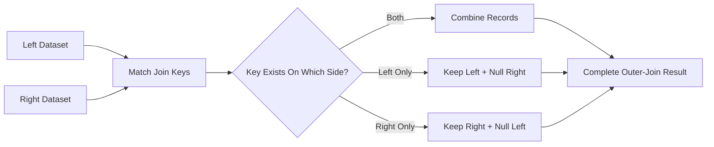
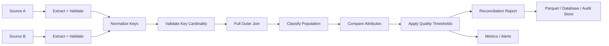

# 08- Outer Join

## Overview

An outer join combines two DataFrames while preserving **all rows from both DataFrames**, whether or not a matching join key exists.

In Pandas:

```python
result = left.merge(
    right,
    on="key",
    how="outer",
)
```

An outer join is primarily a **reconciliation and completeness-analysis operation**.

It answers:

> Which records exist on either side, and which records exist on both?

This differs from:

```text
inner join → only matching records
left join  → all left records
right join → all right records
outer join → all records from both sides
```

The unmatched side is represented with missing values.

---

## Why Outer Joins Exist

Production systems frequently receive logically equivalent datasets from different sources:

```text
PostgreSQL
REST API
Kafka-derived events
CSV exports
Parquet files
Data warehouse
Third-party financial systems
```

These datasets can disagree.

For example:

```text
source_a:
1001
1002
1003

source_b:
1002
1003
1004
```

An inner join would show only:

```text
1002
1003
```

and hide the discrepancies.

An outer join preserves:

```text
1001 → source A only
1002 → both
1003 → both
1004 → source B only
```

This makes outer joins particularly valuable for:

- Data reconciliation.
- Migration validation.
- Data-quality checks.
- Source synchronization.
- Audit reporting.
- Completeness analysis.

---

## Basic Syntax

The standard form is:

```python
result = left.merge(
    right,
    on="key",
    how="outer",
)
```

With multiple keys:

```python
result = left.merge(
    right,
    on=[
        "tenant_id",
        "customer_id",
    ],
    how="outer",
)
```

With different key names:

```python
result = left.merge(
    right,
    left_on="customer_id",
    right_on="id",
    how="outer",
)
```

With provenance information:

```python
result = left.merge(
    right,
    on="customer_id",
    how="outer",
    indicator=True,
)
```

---

## Example Dataset

Consider two transaction exports from separate systems:

```python
import pandas as pd


erp_transactions = pd.DataFrame(
    {
        "transaction_id": [1001, 1002, 1003],
        "amount": [250.0, 180.0, 420.0],
        "currency": ["USD", "USD", "EUR"],
    }
)

bank_transactions = pd.DataFrame(
    {
        "transaction_id": [1002, 1003, 1004],
        "amount": [180.0, 420.0, 125.0],
        "currency": ["USD", "EUR", "USD"],
    }
)
```

Perform an outer join:

```python
reconciliation = erp_transactions.merge(
    bank_transactions,
    on="transaction_id",
    how="outer",
    suffixes=(
        "_erp",
        "_bank",
    ),
    indicator=True,
)
```

Conceptually:

```text
transaction_id | amount_erp | amount_bank | currency_erp | currency_bank | _merge
---------------|------------|-------------|--------------|---------------|-------------
1001           | 250.0      | NaN         | USD          | NaN           | left_only
1002           | 180.0      | 180.0       | USD          | USD           | both
1003           | 420.0      | 420.0       | EUR          | EUR           | both
1004           | NaN        | 125.0       | NaN          | USD           | right_only
```

The outer join exposes the complete relationship between the two populations.

---

## Core Semantics

An outer join is the union of the join keys from both inputs.

Conceptually:



For a simple unique-key relationship:

```text
left keys  = {A, B, C}
right keys = {B, C, D}

outer keys = {A, B, C, D}
```

---

## When to Use an Outer Join

Use an outer join when both datasets matter and unmatched records are meaningful.

Typical applications include:

| Use Case | Why Outer Join Helps |
| --- | --- |
| Financial reconciliation | Finds source-only transactions |
| Migration validation | Compares old and new systems |
| Data quality | Detects missing reference records |
| API synchronization | Finds missing or unexpected objects |
| ETL validation | Checks source-to-target completeness |
| Inventory comparison | Identifies missing products |
| Customer-system comparison | Finds records absent from one system |
| Audit reporting | Shows the complete population |

Avoid outer joins when only one side is authoritative and unmatched records from the other side are irrelevant.

---

## Outer Join Versus Other Join Types

| Join | Preserves Left | Preserves Right | Unmatched Records |
| --- | --- | --- | --- |
| Inner | No | No | Removed |
| Left | Yes | Matching only | Left-side unmatched |
| Right | Matching only | Yes | Right-side unmatched |
| Outer | Yes | Yes | Both sides retained |

The choice should be driven by the desired **population semantics**, not by which method happens to be familiar.

---

## `indicator=True`

For reconciliation work, `indicator=True` is often the most important option.

```python
result = left.merge(
    right,
    on="transaction_id",
    how="outer",
    indicator=True,
)
```

Pandas adds:

```text
_merge
```

with values such as:

```text
left_only
right_only
both
```

Interpretation:

```text
left_only
    → exists only in left

right_only
    → exists only in right

both
    → exists in both
```

This creates an explicit provenance signal without manually comparing datasets.

---

## Reconciliation Example

Find ERP-only transactions:

```python
erp_only = reconciliation.loc[
    reconciliation["_merge"].eq("left_only")
]
```

Find bank-only transactions:

```python
bank_only = reconciliation.loc[
    reconciliation["_merge"].eq("right_only")
]
```

Find common transactions:

```python
matched = reconciliation.loc[
    reconciliation["_merge"].eq("both")
]
```

This is much more useful for reconciliation than simply inspecting null columns.

---

## Measuring Match Rates

Calculate population metrics:

```python
left_only_count = (
    reconciliation["_merge"]
    .eq("left_only")
    .sum()
)

right_only_count = (
    reconciliation["_merge"]
    .eq("right_only")
    .sum()
)

both_count = (
    reconciliation["_merge"]
    .eq("both")
    .sum()
)
```

Then calculate coverage:

```python
left_match_rate = (
    both_count / len(erp_transactions)
)

right_match_rate = (
    both_count / len(bank_transactions)
)
```

These metrics can be emitted as pipeline-quality metrics.

---

## Data Reconciliation

A basic reconciliation flow is:

```text
Source A
   +
Source B
   ↓
Outer Join
   ↓
Classify records
   ↓
Compare attributes
   ↓
Detect discrepancies
   ↓
Generate reconciliation report
```

The outer join identifies **population differences**.

A second comparison stage should identify **attribute differences** for rows present on both sides.

---

## Comparing Matched Records

After the outer join:

```python
matched = reconciliation.loc[
    reconciliation["_merge"].eq("both")
].copy()
```

Compare amounts:

```python
matched["amount_diff"] = (
    matched["amount_erp"]
    - matched["amount_bank"]
)
```

Then identify discrepancies:

```python
amount_mismatches = matched.loc[
    matched["amount_diff"].ne(0)
]
```

For financial systems, comparison rules may need tolerance:

```python
tolerance = 0.01

amount_mismatches = matched.loc[
    matched["amount_diff"].abs()
    > tolerance
]
```

The tolerance should be defined by the domain rather than chosen arbitrarily.

---

## Population Matching Versus Value Matching

These are separate validation problems.

### Population Matching

Determine:

```text
does the record exist on both sides?
```

Use:

```python
indicator=True
```

### Value Matching

Determine:

```text
does the data agree for records that exist on both sides?
```

Use explicit comparison:

```python
matched["amount_diff"] = (
    matched["amount_erp"]
    - matched["amount_bank"]
)
```

A record can therefore be:

```text
present on both sides
but still inconsistent
```

Do not interpret `_merge == "both"` as proof that the records are correct.

---

## Join Grain

Outer joins can only be reasoned about correctly if the input grain is known.

Suppose:

```text
ERP
one row = one transaction

Bank
one row = one transaction
```

Then the expected relationship may be:

```text
one transaction ↔ one transaction
```

But if one side contains multiple entries per transaction:

```text
transaction 1001
    ERP → 1 row
    Bank → 3 rows
```

the outer join can produce multiple output rows.

Define the data grain before choosing `validate`.

---

## Cardinality Validation

For two unique transaction systems:

```python
reconciliation = erp_transactions.merge(
    bank_transactions,
    on="transaction_id",
    how="outer",
    validate="one_to_one",
    indicator=True,
)
```

This asserts:

```text
transaction_id is unique on both sides
```

If duplicates are expected on one side:

```python
validate="one_to_many"
```

or:

```python
validate="many_to_one"
```

If both sides legitimately contain repeated keys:

```python
validate="many_to_many"
```

should be used deliberately, not simply because the merge fails under stricter validation.

---

## Duplicate Keys

Duplicate join keys are especially dangerous in outer joins.

Suppose:

```text
left:
A → 2 rows

right:
A → 3 rows
```

The matching portion can produce:

```text
2 × 3 = 6 rows
```

This can inflate:

- Transaction counts.
- Revenue totals.
- Inventory quantities.
- Event counts.

Always investigate duplicates before allowing a many-to-many relationship.

---

## Detecting Duplicate Keys

```python
left_duplicates = left.loc[
    left["transaction_id"].duplicated(
        keep=False
    )
]

right_duplicates = right.loc[
    right["transaction_id"].duplicated(
        keep=False
    )
]
```

For an expected one-to-one reconciliation:

```python
if not left_duplicates.empty:
    raise ValueError(
        "Duplicate transaction IDs found in left input."
    )

if not right_duplicates.empty:
    raise ValueError(
        "Duplicate transaction IDs found in right input."
    )
```

---

## Composite Keys

A record may only be unique within a tenant or account.

Use the complete key:

```python
result = left.merge(
    right,
    on=[
        "tenant_id",
        "transaction_id",
    ],
    how="outer",
    indicator=True,
    validate="one_to_one",
)
```

Without tenant scope, this can incorrectly match:

```text
tenant A / transaction 1001
```

with:

```text
tenant B / transaction 1001
```

Composite keys are part of the data model, not merely an implementation detail.

---

## Join Key Dtypes

Normalize join keys before reconciling.

Inspect:

```python
left["transaction_id"].dtype
right["transaction_id"].dtype
```

Normalize where appropriate:

```python
left["transaction_id"] = (
    left["transaction_id"]
    .astype("string")
)

right["transaction_id"] = (
    right["transaction_id"]
    .astype("string")
)
```

This is particularly important when combining:

```text
CSV
REST APIs
PostgreSQL
Parquet
Excel
```

Incorrect dtypes can cause failed matches or difficult-to-debug merge errors.

---

## Identifier Normalization

Identifiers may contain:

```text
leading zeros
whitespace
case differences
prefixes
formatting differences
```

A normalization function can make the join contract explicit:

```python
def normalize_transaction_id(
    series: pd.Series,
) -> pd.Series:
    return (
        series
        .astype("string")
        .str.strip()
        .str.upper()
    )
```

Apply consistently:

```python
left["transaction_id"] = (
    normalize_transaction_id(
        left["transaction_id"]
    )
)

right["transaction_id"] = (
    normalize_transaction_id(
        right["transaction_id"]
    )
)
```

Be careful: normalization should standardize known formatting variations, not hide genuinely different identifiers.

---

## Missing Join Keys

Missing keys should be treated as a data-quality condition.

Check:

```python
missing_left_keys = left[
    "transaction_id"
].isna().sum()

missing_right_keys = right[
    "transaction_id"
].isna().sum()
```

For strict reconciliation:

```python
if missing_left_keys:
    raise ValueError(
        "Left input contains missing transaction IDs."
    )

if missing_right_keys:
    raise ValueError(
        "Right input contains missing transaction IDs."
    )
```

If missing identifiers are legitimate, define explicitly how those records should be handled.

Do not let missing-key behavior determine business semantics accidentally.

---

## Outer Join and Missing Values

Unmatched columns are represented with missing values.

Example:

```text
transaction_id | amount_erp | amount_bank
1001           | 250.0      | NaN
1004           | NaN        | 125.0
```

Do not immediately use:

```python
.fillna(0)
```

because:

```text
missing transaction
```

is not necessarily equivalent to:

```text
transaction amount = 0
```

For reconciliation, retaining nulls is often important until discrepancy classification is complete.

---

## Reconciliation Status

After the outer join, create an explicit status:

```python
reconciliation["status"] = (
    reconciliation["_merge"]
    .map(
        {
            "left_only": "missing_in_bank",
            "right_only": "missing_in_erp",
            "both": "matched_population",
        }
    )
)
```

Then value mismatches can be classified separately:

```python
matched = reconciliation["_merge"].eq("both")

reconciliation["amount_mismatch"] = False

reconciliation.loc[
    matched,
    "amount_mismatch",
] = (
    reconciliation.loc[
        matched,
        "amount_erp",
    ]
    != reconciliation.loc[
        matched,
        "amount_bank",
    ]
)
```

This gives the reconciliation report multiple dimensions of status.

---

## Full Reconciliation Workflow

A production-style workflow can be:

```python
reconciliation = (
    erp_transactions
    .merge(
        bank_transactions,
        on="transaction_id",
        how="outer",
        suffixes=(
            "_erp",
            "_bank",
        ),
        indicator=True,
        validate="one_to_one",
    )
)

reconciliation["amount_diff"] = (
    reconciliation["amount_erp"]
    - reconciliation["amount_bank"]
)

reconciliation["population_status"] = (
    reconciliation["_merge"]
    .map(
        {
            "left_only": "missing_in_bank",
            "right_only": "missing_in_erp",
            "both": "present_in_both",
        }
    )
)

reconciliation["value_status"] = "not_comparable"

matched = reconciliation["_merge"].eq("both")

reconciliation.loc[
    matched
    & reconciliation["amount_diff"]
        .abs()
        .le(0.01),
    "value_status",
] = "matched"

reconciliation.loc[
    matched
    & reconciliation["amount_diff"]
        .abs()
        .gt(0.01),
    "value_status",
] = "value_mismatch"
```

This separates:

```text
population mismatch
```

from:

```text
attribute mismatch
```

which is much more useful operationally.

---

## Outer Join and SQL

Pandas:

```python
result = left.merge(
    right,
    on="transaction_id",
    how="outer",
)
```

SQL:

```sql
SELECT
    a.transaction_id,
    a.amount AS amount_a,
    b.amount AS amount_b
FROM source_a AS a
FULL OUTER JOIN source_b AS b
    ON a.transaction_id = b.transaction_id;
```

A full outer join is the SQL equivalent of Pandas:

```text
how="outer"
```

The database can often perform this more efficiently when the source datasets are already relational and large.

---

## PostgreSQL Reconciliation

For large transaction sets, push reconciliation into PostgreSQL:

```sql
SELECT
    COALESCE(a.transaction_id, b.transaction_id)
        AS transaction_id,
    a.amount AS amount_a,
    b.amount AS amount_b,
    CASE
        WHEN a.transaction_id IS NULL
            THEN 'right_only'
        WHEN b.transaction_id IS NULL
            THEN 'left_only'
        ELSE 'both'
    END AS population_status
FROM source_a AS a
FULL OUTER JOIN source_b AS b
    ON a.transaction_id = b.transaction_id;
```

Then Pandas can process the smaller result or final reporting dataset.

This reduces unnecessary movement of large raw datasets into application memory.

---

## API Synchronization

Suppose a FastAPI service receives a current product list while an internal database contains the previous product list.

```text
database snapshot
+
API snapshot
    ↓
outer join
    ↓
new products
removed products
persisted products
```

Example:

```python
changes = database_products.merge(
    api_products,
    on="product_id",
    how="outer",
    indicator=True,
)
```

Classify:

```python
new_products = changes.loc[
    changes["_merge"].eq("right_only")
]

removed_products = changes.loc[
    changes["_merge"].eq("left_only")
]

existing_products = changes.loc[
    changes["_merge"].eq("both")
]
```

For APIs, also validate whether "missing" means deletion, eventual consistency, pagination failure, or incomplete API responses.

---

## ETL Completeness Checks

An outer join is useful at pipeline boundaries:

```text
source extract
    ↓
transform
    ↓
target load
    ↓
reconciliation
```

For example:

```python
comparison = source.merge(
    target,
    on="record_id",
    how="outer",
    indicator=True,
    validate="one_to_one",
)
```

Then:

```python
unexpected_records = comparison.loc[
    comparison["_merge"].ne("both")
]
```

This can become a CI/CD or batch-job data-quality gate.

---

## Incremental Processing

Outer joins are useful when comparing daily batches:

```python
previous = pd.read_parquet(
    "output/day-1.parquet"
)

current = pd.read_parquet(
    "output/day-2.parquet"
)

changes = previous.merge(
    current,
    on="record_id",
    how="outer",
    indicator=True,
)
```

However, the join only tells you whether a record exists in each snapshot.

For change-data detection, compare the relevant attributes as well.

---

## Large Dataset Considerations

Outer joins can consume substantial memory because the output contains the union of both populations.

The result may be wider and larger than either input.

Before joining:

```text
filter
    ↓
project required columns
    ↓
normalize keys
    ↓
validate uniqueness
    ↓
outer join
```

Example:

```python
left_projection = left[
    [
        "transaction_id",
        "amount",
    ]
]

right_projection = right[
    [
        "transaction_id",
        "amount",
    ]
]
```

Avoid joining dozens of unused columns just to compare one or two fields.

---

## Performance and Memory

The largest risks are:

- Large input datasets.
- Wide columns.
- Many-to-many relationships.
- Unnecessary copies.
- Duplicate keys.
- Processing data that could be reconciled in SQL.

Measure:

```python
left.memory_usage(
    deep=True
).sum()

right.memory_usage(
    deep=True
).sum()
```

and inspect the result:

```python
result.memory_usage(
    deep=True
).sum()
```

If an outer join exceeds the practical memory budget, consider:

```text
PostgreSQL
DuckDB
Spark
warehouse-side reconciliation
partitioned processing
```

Pandas remains an in-memory engine.

---

## Chunking and Outer Joins

Chunked processing is more difficult for arbitrary outer joins than for simple aggregations.

A naive approach such as:

```text
read left chunk
    ↓
outer join right
```

can be incorrect unless the right dataset is available consistently and the global key semantics are preserved.

For very large reconciliations, prefer a system designed for distributed or disk-based joins, or push the operation into the database.

Do not introduce chunking solely to avoid memory errors without proving that the resulting algorithm preserves complete join semantics.

---

## Empty DataFrames

Outer joins have useful semantics when one input is empty.

Example:

```python
empty_source = source.iloc[0:0].copy()

result = empty_source.merge(
    target,
    on="record_id",
    how="outer",
    indicator=True,
)
```

The target records remain:

```text
right_only
```

This can detect:

```text
source produced zero records
```

However, distinguish a legitimate empty batch from an upstream extraction failure.

---

## Schema Validation

Before reconciliation, validate required columns:

```python
required_columns = {
    "transaction_id",
    "amount",
}

missing_left = (
    required_columns
    - set(left.columns)
)

missing_right = (
    required_columns
    - set(right.columns)
)

if missing_left or missing_right:
    raise ValueError(
        "Input schema does not satisfy "
        "reconciliation requirements."
    )
```

Schema validation should happen before the join so that missing columns do not become confusing downstream errors.

---

## Security Considerations

Reconciliation datasets can contain sensitive data such as:

```text
customer identifiers
payment information
account numbers
transaction details
```

An outer join may bring together information that was previously isolated.

Project only required fields:

```python
left = left[
    [
        "transaction_id",
        "amount",
    ]
]

right = right[
    [
        "transaction_id",
        "amount",
    ]
]
```

Apply access controls and data-minimization policies before generating persistent reconciliation artifacts.

---

## Multi-Tenant Reconciliation

For tenant-scoped records:

```python
result = left.merge(
    right,
    on=[
        "tenant_id",
        "record_id",
    ],
    how="outer",
    indicator=True,
    validate="one_to_one",
)
```

Never perform a global reconciliation on a key that is only unique within a tenant.

An incorrect join can cause both:

```text
false mismatches
```

and:

```text
cross-tenant data exposure
```

---

## Reliability and Operational Behavior

A reconciliation job should produce deterministic classifications for the same source snapshots.

Typical outputs include:

```text
matched
left_only
right_only
value_mismatch
invalid_key
duplicate_key
```

A production job can then define thresholds:

```text
left-only rate <= expected threshold
right-only rate <= expected threshold
value-mismatch rate <= expected threshold
duplicate count = 0
```

Exceeding thresholds should normally fail or quarantine the batch rather than silently publishing inconsistent data.

---

## Monitoring

Useful reconciliation metrics include:

```text
left_row_count
right_row_count
matched_count
left_only_count
right_only_count
value_mismatch_count
duplicate_key_count
missing_key_count
match_rate
reconciliation_duration_ms
peak_memory_bytes
```

For example:

```python
metrics = {
    "left_rows": len(left),
    "right_rows": len(right),
    "matched_rows": int(
        reconciliation["_merge"]
        .eq("both")
        .sum()
    ),
    "left_only_rows": int(
        reconciliation["_merge"]
        .eq("left_only")
        .sum()
    ),
    "right_only_rows": int(
        reconciliation["_merge"]
        .eq("right_only")
        .sum()
    ),
}
```

Send these metrics to the existing observability stack rather than relying on logs alone.

---

## Testing Outer Joins

A good test verifies all three populations:

```python
def test_outer_join_classifies_records() -> None:
    left = pd.DataFrame(
        {
            "record_id": [1, 2],
            "amount": [100.0, 200.0],
        }
    )

    right = pd.DataFrame(
        {
            "record_id": [2, 3],
            "amount": [200.0, 300.0],
        }
    )

    result = left.merge(
        right,
        on="record_id",
        how="outer",
        indicator=True,
        validate="one_to_one",
    )

    assert (
        result["_merge"]
        .eq("both")
        .sum()
        == 1
    )

    assert (
        result["_merge"]
        .eq("left_only")
        .sum()
        == 1
    )

    assert (
        result["_merge"]
        .eq("right_only")
        .sum()
        == 1
    )
```

This tests the reconciliation semantics rather than merely checking that a DataFrame exists.

---

## Testing Duplicate-Key Failures

```python
import pytest


def test_duplicate_keys_fail_reconciliation() -> None:
    left = pd.DataFrame(
        {
            "record_id": [1, 1],
            "amount": [100.0, 150.0],
        }
    )

    right = pd.DataFrame(
        {
            "record_id": [1],
            "amount": [100.0],
        }
    )

    with pytest.raises(
        pd.errors.MergeError
    ):
        left.merge(
            right,
            on="record_id",
            how="outer",
            validate="one_to_one",
        )
```

This protects the expected data model when upstream datasets change.

---

## Common Mistakes

### Using Inner Join for Reconciliation

An inner join removes unmatched records.

That makes it unsuitable when the goal is to find discrepancies.

Use:

```python
how="outer"
```

for complete population comparison.

---

### Assuming `_merge == "both"` Means the Data Matches

`both` only means:

```text
the join key exists on both sides
```

The corresponding attributes can still differ.

Compare values explicitly.

---

### Ignoring Duplicate Keys

Many-to-many relationships can create Cartesian multiplication for matching keys.

This can invalidate reconciliation metrics and financial totals.

Use `validate` and duplicate checks.

---

### Filling Nulls Too Early

This:

```python
result.fillna(0)
```

can destroy evidence that a record was missing on one side.

Perform reconciliation first; apply business-specific defaults afterward.

---

### Ignoring Key Normalization

Differences such as:

```text
"00123"
123
" 00123 "
```

can represent the same business identifier but behave differently technically.

Normalize only according to explicit identifier rules.

---

### Comparing Floats with `==`

For financial or measured values, use an appropriate tolerance:

```python
difference = (
    matched["amount_a"]
    - matched["amount_b"]
)

mismatch = difference.abs().gt(
    0.01
)
```

The tolerance must reflect the domain.

---

## Production Pitfalls

### Incomplete API Responses

A `right_only` record might indicate a missing object, but it might also indicate:

```text
pagination failure
partial API response
rate limiting
eventual consistency
```

Validate the completeness of upstream extraction before declaring business-level discrepancies.

---

### Snapshot Timing Differences

Two systems may represent different moments in time.

An outer join can correctly detect:

```text
record exists in A
record absent in B
```

while the real explanation is simply:

```text
B has not received the record yet
```

Always compare datasets with known extraction timestamps and freshness assumptions.

---

### Historical Data Differences

Records can legitimately differ because systems apply different retention policies, effective dates, or archival rules.

The reconciliation contract should define the expected comparison window.

---

### Uncontrolled Output Growth

Many-to-many joins can dramatically increase output size.

A reconciliation job should have protective thresholds:

```python
max_output_rows = (
    len(left)
    + len(right)
) * 2

if len(result) > max_output_rows:
    raise RuntimeError(
        "Outer-join output exceeded safety threshold."
    )
```

The threshold should be based on the known data model rather than an arbitrary constant.

---

## Production Reconciliation Architecture

A robust reconciliation pipeline can be structured as:



This separates:

```text
ingestion
validation
matching
comparison
decision
reporting
```

and makes failures easier to diagnose.

---

## Recommended Production Pattern

For a strict one-to-one reconciliation:

```python
import pandas as pd


def reconcile(
    left: pd.DataFrame,
    right: pd.DataFrame,
) -> pd.DataFrame:
    required_columns = {
        "record_id",
        "amount",
    }

    for name, frame in (
        ("left", left),
        ("right", right),
    ):
        missing = (
            required_columns
            - set(frame.columns)
        )

        if missing:
            raise ValueError(
                f"{name} is missing columns: "
                f"{sorted(missing)}"
            )

    left = left[
        [
            "record_id",
            "amount",
        ]
    ].copy()

    right = right[
        [
            "record_id",
            "amount",
        ]
    ].copy()

    if left["record_id"].duplicated().any():
        raise ValueError(
            "Duplicate record IDs in left input."
        )

    if right["record_id"].duplicated().any():
        raise ValueError(
            "Duplicate record IDs in right input."
        )

    result = left.merge(
        right,
        on="record_id",
        how="outer",
        suffixes=(
            "_left",
            "_right",
        ),
        indicator=True,
        validate="one_to_one",
    )

    result["amount_diff"] = (
        result["amount_left"]
        - result["amount_right"]
    )

    result["status"] = "matched"

    result.loc[
        result["_merge"].eq("left_only"),
        "status",
    ] = "left_only"

    result.loc[
        result["_merge"].eq("right_only"),
        "status",
    ] = "right_only"

    value_mismatch = (
        result["_merge"].eq("both")
        & result["amount_diff"]
            .abs()
            .gt(0.01)
    )

    result.loc[
        value_mismatch,
        "status",
    ] = "value_mismatch"

    return result
```

This pattern makes the most important assumptions explicit:

```text
required schema
→ unique keys
→ one-to-one cardinality
→ complete population
→ value comparison
→ explicit status
```

---

## Right Join or Outer Join for Completeness?

The choice depends on the business question.

| Question | Join |
| --- | --- |
| Which left records have a match? | Left |
| Which right records have a match? | Right |
| Which records exist in both? | Inner |
| Which records exist on either side? | Outer |
| Are two source populations identical? | Outer + `indicator=True` |
| Are matched records numerically consistent? | Outer + explicit comparisons |

A useful rule is:

> Use an outer join when the **absence itself is meaningful**.

---

## Key Takeaways

- An outer join preserves all records from both DataFrames, making it the primary Pandas pattern for reconciliation, completeness analysis, and source comparison.
- `indicator=True` exposes whether each key is `left_only`, `right_only`, or `both`, which provides the foundation for population-level data-quality checks.
- Population matching and attribute matching are separate concerns: `_merge == "both"` confirms key presence, not that the associated values are equal.
- Duplicate keys can turn an outer join into a many-to-many multiplication problem, so validate expected cardinality and data grain before trusting the result.
- For large production reconciliations, minimize columns, normalize keys, push joins into PostgreSQL or another scalable engine when appropriate, and monitor match rates, mismatches, duplicates, runtime, and memory usage.