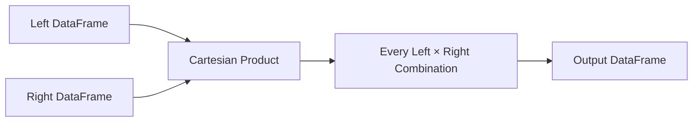

# 09- Cross Join

## Overview

A cross join combines every row from the left DataFrame with every row from the right DataFrame.

In relational terms, it produces a **Cartesian product**:

```text
every left row
    ×
every right row
    ↓
all possible combinations
```

In Pandas:

```python
result = left.merge(
    right,
    how="cross",
)
```

If the left DataFrame contains `m` rows and the right DataFrame contains `n` rows, the result contains:

```text
m × n rows
```

This makes cross joins fundamentally different from key-based joins such as inner, left, right, and outer joins.

Cross joins are useful when every combination is meaningful, such as:

- Product × region planning.
- Employee × shift scheduling.
- Customer × subscription-plan eligibility.
- Date × metric reporting grids.
- Configuration × environment generation.
- Scenario × parameter modeling.

They are also one of the easiest Pandas operations to misuse because output size grows multiplicatively.

---

## Why Cross Joins Exist

A normal relational join answers:

> Which rows are related by a key?

A cross join answers:

> What are all possible combinations of these two populations?

For example:

```text
products:
Laptop
Monitor

regions:
US
EU
```

A cross join produces:

```text
Laptop  × US
Laptop  × EU
Monitor × US
Monitor × EU
```

This is useful when the combinations themselves represent the desired dataset.

There is intentionally **no join key**.

---

## Basic Syntax

The preferred Pandas syntax is:

```python
result = left.merge(
    right,
    how="cross",
)
```

Unlike key-based joins, do not provide:

```python
on=
left_on=
right_on=
```

for a cross join.

Example:

```python
products = pd.DataFrame(
    {
        "product_id": [101, 102],
        "product_name": [
            "Laptop",
            "Monitor",
        ],
    }
)

regions = pd.DataFrame(
    {
        "region": [
            "US",
            "EU",
            "APAC",
        ],
    }
)

product_regions = products.merge(
    regions,
    how="cross",
)
```

Result:

```text
product_id | product_name | region
------------|--------------|-------
101         | Laptop       | US
101         | Laptop       | EU
101         | Laptop       | APAC
102         | Monitor      | US
102         | Monitor      | EU
102         | Monitor      | APAC
```

---

## Output Size

The most important cross-join property is:

```text
output_rows = left_rows × right_rows
```

For example:

| Left Rows | Right Rows | Output Rows |
| ---: | ---: | ---: |
| 10 | 5 | 50 |
| 1,000 | 100 | 100,000 |
| 10,000 | 1,000 | 10,000,000 |
| 100,000 | 10,000 | 1,000,000,000 |

The growth is multiplicative, not additive.

Before performing a cross join:

```python
expected_rows = len(left) * len(right)

print(f"Expected output rows: {expected_rows:,}")
```

For production pipelines, this calculation should often happen before the join itself.

---

## Pre-Flight Size Validation

Protect the process from accidental Cartesian explosions:

```python
expected_rows = len(products) * len(regions)

max_rows = 1_000_000

if expected_rows > max_rows:
    raise ValueError(
        "Cross join would exceed the configured "
        f"row limit: {expected_rows:,} > {max_rows:,}"
    )

result = products.merge(
    regions,
    how="cross",
)
```

This is a simple but effective defensive control in batch jobs and API-backed services.

---

## How Cross Join Works

Conceptually:



For:

```text
left  = [L1, L2, L3]
right = [R1, R2]
```

the conceptual expansion is:

```text
L1-R1
L1-R2
L2-R1
L2-R2
L3-R1
L3-R2
```

No equality comparison between keys is required.

---

## Internal Data Behavior

A cross join constructs a new DataFrame containing repeated values from both inputs.

For:

```text
m × n
```

output rows, Pandas must materialize enough data to represent that Cartesian product.

This means memory consumption can grow rapidly even when both input DataFrames are individually small.

The key engineering constraint is therefore not just CPU time:

```text
row multiplication
+
column width
+
temporary memory
```

can determine whether the operation is practical.

---

## Index Behavior

A cross join produces a new result and does not preserve the original DataFrame indexes as the result index.

Example:

```python
result = left.merge(
    right,
    how="cross",
)
```

The result receives a new integer index.

Do not treat the original indexes as join keys.

If input identity matters, keep explicit identifier columns:

```python
left = left.rename_axis(
    "left_original_index"
).reset_index()

right = right.rename_axis(
    "right_original_index"
).reset_index()
```

Then those identifiers become data columns that can be carried through the Cartesian product.

---

## Column Behavior

All columns from both DataFrames appear in the result.

For example:

```text
products
product_id
name

regions
region
currency
```

produces:

```text
product_id
name
region
currency
```

When non-key column names collide, Pandas applies suffixes.

```python
result = left.merge(
    right,
    how="cross",
    suffixes=(
        "_left",
        "_right",
    ),
)
```

Because a cross join has no join keys, duplicate column names are especially important to handle deliberately.

---

## Practical Example: Product and Region Matrix

Suppose an e-commerce team needs a deployment matrix for supported products and regions.

```python
products = pd.DataFrame(
    {
        "product_id": [101, 102, 103],
        "product_name": [
            "Laptop",
            "Monitor",
            "Keyboard",
        ],
    }
)

regions = pd.DataFrame(
    {
        "region": [
            "US",
            "EU",
            "APAC",
        ],
    }
)

matrix = products.merge(
    regions,
    how="cross",
)
```

Then apply business constraints:

```python
supported_matrix = matrix.loc[
    matrix["region"].isin(
        ["US", "EU"]
    )
].copy()
```

The cross join generates the candidate combinations; filtering determines which combinations are actually relevant.

---

## Cross Join Followed by Filtering

A common pattern is:

```text
generate candidate combinations
    ↓
apply business constraints
    ↓
retain valid combinations
```

Example:

```python
candidates = employees.merge(
    shifts,
    how="cross",
)

eligible = candidates.loc[
    (
        candidates["department"]
        == candidates["required_department"]
    )
    & (
        candidates["hours_available"]
        >= candidates["shift_hours"]
    )
].copy()
```

This can be useful, but it is often more expensive than filtering before generating combinations.

Prefer to reduce each input before the Cartesian product whenever the business logic allows it.

---

## Filter Before the Cross Join

Suppose only active products participate:

```python
active_products = products.loc[
    products["status"].eq("active"),
    [
        "product_id",
        "product_name",
    ],
].copy()
```

and only enabled regions participate:

```python
enabled_regions = regions.loc[
    regions["enabled"],
    [
        "region",
    ],
].copy()
```

Then:

```python
matrix = active_products.merge(
    enabled_regions,
    how="cross",
)
```

This is better than generating combinations for inactive entities and removing them afterward.

---

## Why Filter-First Matters

Suppose:

```text
products = 50,000
regions = 200
```

A cross join produces:

```text
10,000,000 rows
```

If only:

```text
5,000 active products
20 enabled regions
```

matter, filtering first produces:

```text
100,000 rows
```

The difference is significant:

```text
10,000,000
    vs
100,000
```

The most effective optimization for a cross join is often eliminating unnecessary combinations before materialization.

---

## Cross Join for Scheduling

A scheduling system can generate candidate employee-shift assignments:

```python
employees = pd.DataFrame(
    {
        "employee_id": [1, 2, 3],
        "department": [
            "support",
            "engineering",
            "support",
        ],
    }
)

shifts = pd.DataFrame(
    {
        "shift_id": [101, 102],
        "department": [
            "support",
            "engineering",
        ],
    }
)

candidates = employees.merge(
    shifts,
    how="cross",
)
```

Then filter compatible assignments:

```python
eligible = candidates.loc[
    candidates["department_x"].eq(
        candidates["department_y"]
    )
].copy()
```

Rename columns before joining when clarity matters:

```python
employees = employees.rename(
    columns={
        "department": "employee_department",
    }
)

shifts = shifts.rename(
    columns={
        "department": "shift_department",
    }
)

candidates = employees.merge(
    shifts,
    how="cross",
)

eligible = candidates.loc[
    candidates["employee_department"].eq(
        candidates["shift_department"]
    )
]
```

Explicit names are easier to maintain than relying on generic suffixes.

---

## Cross Join for Reporting Grids

Cross joins are particularly useful for generating dense reporting dimensions.

Suppose:

```text
dates
metrics
```

must produce a row for every date/metric combination, even when no event exists.

```python
report_grid = dates.merge(
    metrics,
    how="cross",
)
```

Then enrich with aggregated facts:

```python
report_grid = report_grid.merge(
    daily_metrics,
    on=[
        "report_date",
        "metric_name",
    ],
    how="left",
    validate="one_to_one",
)
```

This produces a complete reporting grid where missing activity can later be represented as zero or another business-specific value.

---

## Cross Join and Zero-Activity Reports

Example:

```python
dates = pd.DataFrame(
    {
        "report_date": pd.date_range(
            "2026-09-01",
            "2026-09-03",
        )
    }
)

metrics = pd.DataFrame(
    {
        "metric_name": [
            "orders",
            "revenue",
        ]
    }
)

grid = dates.merge(
    metrics,
    how="cross",
)
```

Suppose actual data contains only:

```text
2026-09-01 orders
2026-09-01 revenue
2026-09-03 orders
```

A left join onto the generated grid can preserve:

```text
2026-09-02 orders
2026-09-02 revenue
2026-09-03 revenue
```

which might otherwise be absent.

This is a common reporting pattern.

---

## Cross Join with Dates and Dimensions

A more realistic reporting grid may use:

```text
date
region
metric
```

Generate it in stages:

```python
date_region = dates.merge(
    regions,
    how="cross",
)

report_grid = date_region.merge(
    metrics,
    how="cross",
)
```

The row count becomes:

```text
dates
×
regions
×
metrics
```

This is useful but potentially expensive.

Calculate the expected size before materializing.

---

## Cross Join for Scenario Analysis

Suppose financial planning requires all combinations of:

```text
department
scenario
year
```

Create each dimension:

```python
departments = pd.DataFrame(
    {
        "department": [
            "sales",
            "engineering",
        ]
    }
)

scenarios = pd.DataFrame(
    {
        "scenario": [
            "baseline",
            "growth",
            "downside",
        ]
    }
)

years = pd.DataFrame(
    {
        "year": [2027, 2028, 2029]
    }
)
```

Build the scenario matrix:

```python
scenario_matrix = (
    departments
    .merge(
        scenarios,
        how="cross",
    )
    .merge(
        years,
        how="cross",
    )
)
```

Then attach assumptions:

```python
scenario_matrix["annual_budget"] = (
    scenario_matrix["scenario"]
    .map(
        {
            "baseline": 1.00,
            "growth": 1.15,
            "downside": 0.85,
        }
    )
    * 1_000_000
)
```

This pattern is useful for controlled scenario generation.

---

## Cross Join Versus `merge()` with a Constant

Historically, Cartesian products were sometimes emulated using a constant column:

```python
left = left.assign(
    _key=1
)

right = right.assign(
    _key=1
)

result = left.merge(
    right,
    on="_key",
).drop(
    columns="_key"
)
```

Prefer:

```python
result = left.merge(
    right,
    how="cross",
)
```

The explicit `how="cross"` syntax communicates intent better and avoids creating temporary join keys.

---

## Cross Join Versus `itertools.product`

Python can also generate combinations with:

```python
from itertools import product
```

For example:

```python
pairs = list(
    product(
        products["product_id"],
        regions["region"],
    )
)
```

This may be appropriate when the final output is not a DataFrame or when the combinations are being consumed incrementally.

Use a Pandas cross join when:

```text
both inputs are already DataFrames
+
the resulting Cartesian product is itself tabular data
```

For very large products, neither approach solves the fundamental scalability problem.

---

## Cross Join Versus Nested Python Loops

Avoid:

```python
rows = []

for product_id in products["product_id"]:
    for region in regions["region"]:
        rows.append(
            {
                "product_id": product_id,
                "region": region,
            }
        )
```

Then constructing a DataFrame afterward.

A native cross join is clearer and generally better aligned with Pandas' vectorized/data-frame operations:

```python
result = products.merge(
    regions,
    how="cross",
)
```

However, the algorithmic complexity is still:

```text
O(m × n)
```

The operation cannot avoid the size of the requested output.

---

## Performance Considerations

Cross joins are dominated by output cardinality.

A useful mental model is:

```text
input size
+
output size
=
total processing pressure
```

Even a highly optimized implementation cannot make a true Cartesian product cheap when billions of combinations are actually required.

Before joining, calculate:

```python
expected_rows = (
    len(left)
    * len(right)
)
```

Also consider output width:

```text
rows × columns × average memory per value
```

A narrow 10-million-row DataFrame can be substantially cheaper than a wide 10-million-row DataFrame.

---

## Memory Optimization

Reduce columns before joining:

```python
products = products[
    [
        "product_id",
        "product_name",
    ]
]

regions = regions[
    [
        "region",
    ]
]
```

Reduce rows:

```python
products = products.loc[
    products["status"].eq("active")
]
```

Use efficient dtypes where appropriate:

```python
regions["region"] = (
    regions["region"]
    .astype("category")
)
```

Category usage can reduce memory in repeated low-cardinality string dimensions, though the benefit depends on the resulting data and operations.

---

## Output Size Guardrails

A reusable helper can enforce limits:

```python
def safe_cross_join(
    left: pd.DataFrame,
    right: pd.DataFrame,
    max_rows: int,
) -> pd.DataFrame:
    expected_rows = (
        len(left)
        * len(right)
    )

    if expected_rows > max_rows:
        raise ValueError(
            "Cross join exceeds row limit: "
            f"{expected_rows:,} > {max_rows:,}"
        )

    return left.merge(
        right,
        how="cross",
    )
```

Usage:

```python
result = safe_cross_join(
    products,
    regions,
    max_rows=1_000_000,
)
```

This is particularly useful in automated ETL jobs where input sizes can change unexpectedly.

---

## Avoiding Accidental Cartesian Products

A common mistake is omitting `on`, `left_on`, or `right_on` from a normal merge and assuming Pandas will infer the intended relationship.

Do not rely on accidental join behavior.

Use an explicit join type:

```python
result = orders.merge(
    customers,
    on="customer_id",
    how="left",
)
```

and use:

```python
how="cross"
```

only when a Cartesian product is actually intended.

The distinction is part of the data model.

---

## Cross Join and Join Keys

A cross join intentionally ignores keys.

This means:

```python
left.merge(
    right,
    how="cross",
)
```

does not mean:

```text
match equal IDs
```

and does not mean:

```text
match common columns automatically
```

It means:

```text
combine every left row with every right row
```

This is an important interview distinction.

---

## Filtering Cross-Join Results

After generating combinations:

```python
candidates = employees.merge(
    shifts,
    how="cross",
)
```

filter vectorially:

```python
eligible = candidates.loc[
    (
        candidates["employee_department"]
        == candidates["shift_department"]
    )
    & (
        candidates["employee_hours"]
        >= candidates["shift_hours"]
    )
]
```

Prefer vectorized filtering over per-row Python loops.

However, remember that the full candidate matrix has already been created.

If the predicate can be applied before the cross join, do that instead.

---

## When a Cross Join Is the Wrong Tool

Avoid a cross join when the real requirement is:

```text
match records on an identifier
```

Use:

```python
merge(
    ...,
    on="id",
)
```

instead.

Avoid a cross join when the candidate space is enormous but only a tiny subset can ever be valid.

Consider:

```text
SQL joins with predicates
DuckDB
database query pushdown
specialized scheduling algorithms
graph or optimization tooling
```

The right solution depends on the shape of the problem.

---

## SQL Equivalent

Pandas:

```python
result = left.merge(
    right,
    how="cross",
)
```

SQL:

```sql
SELECT
    p.product_id,
    p.product_name,
    r.region
FROM products AS p
CROSS JOIN regions AS r;
```

The SQL semantics are identical:

```text
every product
×
every region
```

---

## Predicate Pushdown in SQL

Suppose only active products and enabled regions are needed.

Prefer:

```sql
SELECT
    p.product_id,
    p.product_name,
    r.region
FROM products AS p
CROSS JOIN regions AS r
WHERE p.status = 'active'
  AND r.enabled = TRUE;
```

Better still, filter at the source before the Cartesian product when query planning and semantics permit.

The general production principle is:

```text
reduce rows before multiplication
```

---

## Database-First Strategy

When the source data resides in PostgreSQL:

```text
PostgreSQL
    ↓
filter dimensions
    ↓
CROSS JOIN
    ↓
additional predicates / aggregation
    ↓
Pandas
```

can be preferable to:

```text
PostgreSQL
    ↓
download all dimensions
    ↓
Pandas
    ↓
cross join
```

especially when the intermediate Cartesian result is large.

Use SQL execution plans and actual cardinality to determine where the operation belongs.

---

## API and Backend Use Cases

A FastAPI service might generate product-region pricing candidates:

```text
GET /pricing/matrix
```

The backend could source:

```text
products
regions
pricing_rules
```

and build a candidate matrix before applying business rules.

For small controlled dimensions this can be reasonable.

For dynamically growing datasets, place explicit limits on:

```text
input cardinality
output cardinality
request duration
memory usage
```

Never allow arbitrary API inputs to trigger unbounded Cartesian products.

---

## Celery and Batch Processing

Cross joins are often more appropriate in background jobs than request/response handlers when the generated result is large.

For example:

```text
API request
    ↓
create job
    ↓
Celery
    ↓
generate candidate combinations
    ↓
validate / transform
    ↓
write Parquet
    ↓
store job status
```

Do not run a potentially huge cross join synchronously inside a web request handled by Django or FastAPI.

This protects API latency and worker capacity.

---

## Kubernetes Considerations

A containerized Pandas worker can be killed if a cross join unexpectedly exceeds its memory allocation.

Typical failure pattern:

```text
larger source batch
    ↓
m × n grows sharply
    ↓
DataFrame allocation
    ↓
container memory pressure
    ↓
OOMKilled
```

Mitigate with:

- Input-size validation.
- Output-size limits.
- Filtering before joins.
- Narrow projections.
- Batch partitioning where semantically safe.
- Database-side execution for large populations.

Do not treat simply increasing Kubernetes memory limits as the primary optimization.

---

## Partitioning Considerations

A cross join can sometimes be partitioned when the downstream workflow permits it.

For example, generate:

```text
products partition A × regions
products partition B × regions
products partition C × regions
```

and write each result independently.

However, this is safe only when:

- Every required combination is generated exactly once.
- Downstream aggregation is associative where applicable.
- The output can be recombined deterministically.

Partitioning solves memory pressure; it does not change the total computational work.

---

## Determinism and Reproducibility

Cross joins are most useful when their output can be deterministically ordered.

Do not assume the row order is a business contract.

If a stable order is required:

```python
result = (
    products
    .merge(
        regions,
        how="cross",
    )
    .sort_values(
        [
            "product_id",
            "region",
        ],
        kind="stable",
    )
    .reset_index(drop=True)
)
```

Persisted reports and test fixtures benefit from explicit ordering.

---

## Duplicate Input Rows

Cross joins preserve duplicates because each input row participates independently.

Suppose:

```text
left:
A
A

right:
X
Y
```

The result contains:

```text
A-X
A-Y
A-X
A-Y
```

If duplicate rows are accidental, clean them before the cross join:

```python
left = left.drop_duplicates()
right = right.drop_duplicates()
```

Do this only when duplicate rows are genuinely redundant.

Do not deduplicate data merely to reduce output size if duplicates have business meaning.

---

## Missing Values

Cross joins do not use key matching, so missing values in ordinary columns do not prevent combinations from being generated.

For example:

```python
products = pd.DataFrame(
    {
        "product_id": [101, None],
    }
)

regions = pd.DataFrame(
    {
        "region": ["US", "EU"],
    }
)

result = products.merge(
    regions,
    how="cross",
)
```

The row containing the missing product identifier still participates in the Cartesian product.

Validate required identifiers before generating downstream business records.

---

## Empty Inputs

The Cartesian product with an empty DataFrame produces no rows:

```text
m × 0 = 0
```

Example:

```python
empty_regions = regions.iloc[0:0].copy()

result = products.merge(
    empty_regions,
    how="cross",
)
```

The result is empty.

This behavior can be useful, but distinguish:

```text
no eligible dimension members
```

from:

```text
dimension ingestion failed
```

in production pipelines.

---

## Input Validation

Before a cross join, validate:

```text
schema
row counts
required identifiers
allowed dimension values
maximum cardinality
duplicate policy
```

Example:

```python
required_product_columns = {
    "product_id",
    "product_name",
}

missing = (
    required_product_columns
    - set(products.columns)
)

if missing:
    raise ValueError(
        "Missing product columns: "
        f"{sorted(missing)}"
    )
```

Validate both sides before constructing the Cartesian product.

---

## Testing Cross Joins

The most important property is the expected row count.

```python
def test_cross_join_row_count() -> None:
    products = pd.DataFrame(
        {
            "product_id": [1, 2],
        }
    )

    regions = pd.DataFrame(
        {
            "region": [
                "US",
                "EU",
                "APAC",
            ],
        }
    )

    result = products.merge(
        regions,
        how="cross",
    )

    assert len(result) == 6
```

Also validate that every expected combination exists.

```python
expected_pairs = {
    (1, "US"),
    (1, "EU"),
    (1, "APAC"),
    (2, "US"),
    (2, "EU"),
    (2, "APAC"),
}

actual_pairs = set(
    result[
        [
            "product_id",
            "region",
        ]
    ].itertuples(
        index=False,
        name=None,
    )
)

assert actual_pairs == expected_pairs
```

---

## Testing Output Uniqueness

If each combination should occur exactly once:

```python
combination_columns = [
    "product_id",
    "region",
]

assert not result.duplicated(
    combination_columns
).any()
```

This is useful when both input dimensions are expected to contain unique entities.

---

## Production Pitfalls

### Accidental Billion-Row Output

A modest increase in each input can have a huge effect:

```text
10,000 × 10,000
=
100,000,000
```

Always calculate:

```python
len(left) * len(right)
```

before execution when inputs are not tightly bounded.

---

### Filtering After the Join

This:

```python
result = left.merge(
    right,
    how="cross",
)

result = result.loc[
    ...
]
```

may allocate a massive intermediate DataFrame.

Filter inputs first whenever the predicate can be expressed independently.

---

### Using Cross Join for Key-Based Relationships

A cross join is not a substitute for:

```python
merge(
    on="id"
)
```

If rows have a natural relationship key, use the appropriate keyed join.

---

### Unbounded API Inputs

Never allow a client to arbitrarily control both dimensions of a Cartesian operation without limits.

For example:

```text
10,000 products
×
10,000 requested regions
=
100,000,000 combinations
```

This can become a denial-of-service vector.

Apply authorization, validation, and hard cardinality limits.

---

### Many-to-Many Semantics Hidden as a Cross Join

If the real business relationship is constrained, model the constraints explicitly.

A full Cartesian product followed by filtering may be much more expensive than directly querying only valid combinations.

---

## Security Considerations

Cross joins can create both computational and data-exposure risks.

### Resource Exhaustion

An externally triggered cross join can consume:

```text
CPU
RAM
worker slots
database capacity
queue capacity
```

Use hard input and output limits.

### Sensitive Combinations

Cross joins can expose combinations that should never be materialized together.

For example:

```text
customer
×
internal pricing tier
×
region
```

might reveal sensitive pricing structures.

Apply authorization and data-minimization rules before generating the matrix.

---

## Monitoring

For production cross-join workloads, monitor:

```text
left_input_rows
right_input_rows
expected_output_rows
actual_output_rows
processing_duration_ms
peak_memory_bytes
filtered_candidate_count
final_valid_count
```

A useful metric is the reduction ratio:

```python
reduction_ratio = (
    len(valid_combinations)
    / len(candidates)
)
```

A sudden change can reveal:

- Input growth.
- Broken filtering rules.
- Unexpected dimension values.
- Duplicate source data.
- Business-rule regressions.

---

## Cost Considerations

For cloud ETL workloads, unnecessary Cartesian products increase:

```text
compute cost
memory cost
storage cost
network transfer
job duration
```

Especially in AWS environments, consider whether the cross join should occur in:

```text
Aurora / PostgreSQL
Redshift
Athena
Glue
DuckDB
Pandas
```

based on dataset size and workload architecture.

The cheapest execution engine is usually the one that can perform the required operation with the least unnecessary data movement and materialization.

---

## Recommended Production Pattern

A safe pattern is:

```text
validate input schema
    ↓
filter each input
    ↓
project required columns
    ↓
calculate expected Cartesian size
    ↓
enforce size limit
    ↓
cross join
    ↓
apply business-level constraints
    ↓
validate final combinations
    ↓
persist or aggregate
```

Example:

```python
def build_product_region_matrix(
    products: pd.DataFrame,
    regions: pd.DataFrame,
    max_rows: int = 1_000_000,
) -> pd.DataFrame:
    required_product_columns = {
        "product_id",
        "product_name",
        "status",
    }

    required_region_columns = {
        "region",
        "enabled",
    }

    missing_products = (
        required_product_columns
        - set(products.columns)
    )

    missing_regions = (
        required_region_columns
        - set(regions.columns)
    )

    if missing_products:
        raise ValueError(
            "Missing product columns: "
            f"{sorted(missing_products)}"
        )

    if missing_regions:
        raise ValueError(
            "Missing region columns: "
            f"{sorted(missing_regions)}"
        )

    active_products = products.loc[
        products["status"].eq("active"),
        [
            "product_id",
            "product_name",
        ],
    ].copy()

    enabled_regions = regions.loc[
        regions["enabled"],
        [
            "region",
        ],
    ].copy()

    expected_rows = (
        len(active_products)
        * len(enabled_regions)
    )

    if expected_rows > max_rows:
        raise ValueError(
            "Cross join exceeds row limit: "
            f"{expected_rows:,} > {max_rows:,}"
        )

    result = active_products.merge(
        enabled_regions,
        how="cross",
    )

    return result
```

This pattern protects the most important production boundaries:

```text
schema
population
memory
cardinality
output expectations
```

---

## Decision Guide

| Requirement | Recommended Approach |
| --- | --- |
| Every left row × every right row | `merge(how="cross")` |
| Match rows by identifier | `merge(on=...)` |
| Preserve every left record with optional enrichment | Left join |
| Preserve every record from both sides | Outer join |
| Existence check only | `isin()` |
| Generate reporting date × metric grid | Cross join |
| Generate bounded scenario combinations | Cross join |
| Generate huge candidate search space | Usually not Pandas |
| SQL-backed large Cartesian operation | Database-side `CROSS JOIN` |
| API-triggered combination generation | Validate and cap cardinality |
| Need incremental/non-tabular combination generation | Consider `itertools.product` |

---

## Interview Perspective

A strong explanation of a Pandas cross join should mention four things:

1. It creates a Cartesian product with no join key.
2. The output row count is `len(left) * len(right)`.
3. It is useful for candidate matrices, scenario generation, and dense reporting grids.
4. Its major production risk is multiplicative memory and processing growth.

A common interview trap is saying:

```text
"cross join just combines the two DataFrames."
```

That misses the most important property: **every possible row combination is generated**.

Another common trap is forgetting that:

```text
10,000 × 10,000
```

is:

```text
100,000,000 rows
```

before any post-join filtering occurs.

---

## Key Takeaways

- A Pandas cross join creates the Cartesian product of two DataFrames using `merge(how="cross")`, with every left row paired with every right row.
- Output size grows multiplicatively as `len(left) × len(right)`, making cardinality estimation and memory protection essential before execution.
- Cross joins are useful for bounded candidate matrices, reporting grids, scheduling candidates, and scenario generation, but should not replace key-based joins.
- Filter and project inputs before the Cartesian product whenever possible; reducing source cardinality is usually far more effective than filtering a huge generated result afterward.
- In production, enforce schema and cardinality limits, monitor output growth and memory, and push large Cartesian operations to PostgreSQL or another suitable processing engine when Pandas is no longer practical.