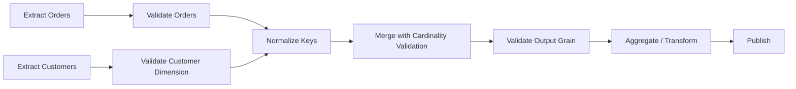

# 10- Merge Validation

## Overview

Pandas `merge()` can combine DataFrames correctly at the syntax level while still producing incorrect business results when the relationship between the join keys is not what the pipeline expects.

**Merge validation** provides a way to assert the expected **key cardinality** during a merge.

The primary option is:

```python
result = left.merge(
    right,
    on="customer_id",
    how="left",
    validate="many_to_one",
)
```

The `validate` parameter checks whether the join keys satisfy an expected relationship:

```text
one_to_one
one_to_many
many_to_one
many_to_many
```

This is important because a join can accidentally multiply rows:

```text
one order
    ↓
three matching customer records
    ↓
three output rows
```

Without validation, the operation succeeds and downstream aggregations may silently overcount revenue, transactions, or events.

Merge validation turns an implicit assumption about the data model into an executable runtime check.

---

## Why Merge Validation Matters

A merge has two separate questions:

1. **Which records should match?**
2. **How many matches are allowed for each key?**

The join type answers the first question:

```python
how="left"
```

The validation rule answers the second:

```python
validate="many_to_one"
```

For example:

```text
orders
many rows per customer_id

customers
one row per customer_id
```

The expected relationship is:

```text
many orders
    ↓
one customer
```

Therefore:

```python
orders.merge(
    customers,
    on="customer_id",
    how="left",
    validate="many_to_one",
)
```

protects the expected data model.

---

## Standard Syntax

```python
result = left.merge(
    right,
    on="key",
    how="left",
    validate="many_to_one",
)
```

The validation modes are:

| `validate` | Expected Relationship |
| --- | --- |
| `"one_to_one"` | Both sides have unique join keys |
| `"one_to_many"` | Left keys unique, right keys may repeat |
| `"many_to_one"` | Left keys may repeat, right keys unique |
| `"many_to_many"` | Both sides may repeat |
| `None` | No cardinality validation |

Use the strictest relationship that matches the actual business model.

---

## `one_to_one`

Use `one_to_one` when a join key must be unique in both DataFrames.

Example:

```python
result = customer_profiles.merge(
    customer_settings,
    on="customer_id",
    how="left",
    validate="one_to_one",
)
```

Expected relationship:

```text
one customer
    ↔
one settings record
```

If either side contains duplicates, Pandas raises a merge validation error.

---

## `many_to_one`

This is one of the most common production patterns.

Suppose:

```text
orders
many orders per customer

customers
one customer record
```

Use:

```python
result = orders.merge(
    customers,
    on="customer_id",
    how="left",
    validate="many_to_one",
)
```

This means:

```text
left key may repeat
right key must be unique
```

For fact-to-dimension enrichment, this is usually the expected relationship.

---

## `one_to_many`

Use `one_to_many` when the left side is unique but the right side can contain several records per key.

Example:

```text
customers
one customer

orders
many orders
```

If the intended output is:

```python
result = customers.merge(
    orders,
    on="customer_id",
    how="left",
    validate="one_to_many",
)
```

then one customer can legitimately produce many rows.

The validation does not prevent row multiplication. It verifies that the multiplication matches the declared data model.

---

## `many_to_many`

Use:

```python
validate="many_to_many"
```

when duplicate keys on both sides are intentional.

Example:

```text
student
many enrollment rows

course
many matching rows under the chosen key
```

However, many-to-many relationships deserve careful scrutiny because:

```text
left duplicates × right duplicates
```

can cause substantial result growth.

Do not use `many_to_many` simply to suppress validation errors.

A validation error may be identifying a real data-quality problem.

---

## Validation Failure

Example:

```python
orders = pd.DataFrame(
    {
        "order_id": [1001, 1002],
        "customer_id": [101, 101],
    }
)

customers = pd.DataFrame(
    {
        "customer_id": [101, 101],
        "segment": [
            "Enterprise",
            "SMB",
        ],
    }
)
```

This relationship is many-to-many.

Running:

```python
orders.merge(
    customers,
    on="customer_id",
    how="left",
    validate="many_to_one",
)
```

raises a:

```text
pandas.errors.MergeError
```

instead of silently multiplying order rows.

---

## Why Duplicate Keys Cause Data Corruption

Suppose:

```text
orders

order_id | customer_id | revenue
---------|-------------|--------
1001     | 101         | 100
```

and:

```text
customers

customer_id | segment
------------|----------
101         | SMB
101         | Enterprise
```

A normal merge can produce:

```text
order_id | customer_id | revenue | segment
---------|-------------|---------|-----------
1001     | 101         | 100     | SMB
1001     | 101         | 100     | Enterprise
```

Then:

```python
result["revenue"].sum()
```

returns:

```text
200
```

even though the actual order revenue is:

```text
100
```

This is a data-correctness failure, not merely a Pandas formatting issue.

---

## Validation as a Data Contract

A merge can be treated as a contract:

```text
orders.customer_id
    many

customers.customer_id
    one
```

The contract becomes executable:

```python
orders.merge(
    customers,
    on="customer_id",
    validate="many_to_one",
)
```

This provides a stronger guarantee than documentation such as:

```text
"customer_id should be unique."
```

The runtime validates the assumption at the point where it matters.

---

## Choosing the Correct Validation

Determine cardinality before writing the merge.

| Business Relationship | Validation |
| --- | --- |
| One user ↔ one profile | `one_to_one` |
| Many orders → one customer | `many_to_one` |
| One customer → many orders | `one_to_many` |
| Many-to-many association | `many_to_many` |

The validation rule should be based on the **logical relationship**, not on which option allows the current data to pass.

---

## Inspecting Uniqueness

Before the merge:

```python
left_unique = left["customer_id"].is_unique
right_unique = right["customer_id"].is_unique
```

This gives a fast check for uniqueness.

For more detailed diagnostics:

```python
left_duplicates = left.loc[
    left["customer_id"].duplicated(
        keep=False
    )
]

right_duplicates = right.loc[
    right["customer_id"].duplicated(
        keep=False
    )
]
```

This helps identify which records violate the expected relationship.

---

## Explaining Validation Failures

A production pipeline should ideally provide useful diagnostics when a merge fails.

Example:

```python
try:
    result = orders.merge(
        customers,
        on="customer_id",
        how="left",
        validate="many_to_one",
    )
except pd.errors.MergeError as exc:
    duplicates = customers.loc[
        customers["customer_id"].duplicated(
            keep=False
        )
    ]

    raise RuntimeError(
        "Customer lookup violates the "
        "expected many-to-one relationship. "
        f"Duplicate customer IDs: "
        f"{duplicates['customer_id'].unique().tolist()}"
    ) from exc
```

This preserves the original exception while adding domain-specific diagnostics.

---

## Validation and Join Type Are Independent

These two options solve different problems:

```python
result = orders.merge(
    customers,
    on="customer_id",
    how="left",
    validate="many_to_one",
)
```

means:

```text
how="left"
    → preserve all order rows

validate="many_to_one"
    → customer key must be unique
```

Changing:

```python
how="left"
```

to:

```python
how="inner"
```

does not remove the need for validation.

Similarly, changing:

```python
validate="many_to_one"
```

does not change which unmatched rows survive.

---

## Validation with Inner Joins

Example:

```python
result = orders.merge(
    customers,
    on="customer_id",
    how="inner",
    validate="many_to_one",
)
```

This means:

```text
only matching orders
+
at most one customer record per customer_id
```

The validation remains valuable even though the join excludes unmatched records.

---

## Validation with Outer Joins

For reconciliation:

```python
result = source_a.merge(
    source_b,
    on="record_id",
    how="outer",
    validate="one_to_one",
    indicator=True,
)
```

This means:

```text
preserve all records from both sources
+
record_id must be unique on both sides
```

This is a strong pattern for one-to-one source reconciliation.

---

## Validation with Right Joins

The relationship is independent of which side is preserved.

```python
transactions.merge(
    accounts,
    on="account_id",
    how="right",
    validate="many_to_one",
)
```

means:

```text
many transactions
    →
one account
```

The right join preserves accounts, while `many_to_one` ensures each account appears only once on the right side.

---

## Validation with Cross Joins

Cross joins have no key-based relationship to validate.

Use:

```python
result = left.merge(
    right,
    how="cross",
)
```

rather than trying to apply a one-to-one or many-to-one relationship.

For cross joins, validate expected output size instead:

```python
expected_rows = (
    len(left)
    * len(right)
)

if expected_rows > max_rows:
    raise ValueError(
        "Cross join exceeds configured row limit."
    )
```

---

## Validation with Composite Keys

A key may only be unique in combination.

For multi-tenant systems:

```python
result = orders.merge(
    customers,
    on=[
        "tenant_id",
        "customer_id",
    ],
    how="left",
    validate="many_to_one",
)
```

This asserts uniqueness of the composite relationship:

```text
(tenant_id, customer_id)
```

rather than:

```text
customer_id
```

alone.

This is critical when identifiers are scoped by tenant.

---

## Composite-Key Validation

Check directly:

```python
duplicate_customers = customers.loc[
    customers.duplicated(
        subset=[
            "tenant_id",
            "customer_id",
        ],
        keep=False,
    )
]
```

If the DataFrame represents one customer per tenant/customer pair:

```python
if not duplicate_customers.empty:
    raise ValueError(
        "Duplicate tenant/customer keys detected."
    )
```

Then use:

```python
validate="many_to_one"
```

as the merge-time guard.

---

## Validation and Index-Based Joins

The same relationship concept applies when joining through indexes.

Example:

```python
customer_lookup = customers.set_index(
    "customer_id"
)

result = orders.join(
    customer_lookup,
    on="customer_id",
    how="left",
    validate="many_to_one",
)
```

The validation protects the lookup relationship:

```text
many orders
    →
one customer index entry
```

This is particularly useful when `DataFrame.join()` is being used for index-oriented enrichment.

---

## Validation and Duplicate Source Records

Sometimes duplicates are expected in raw data but should not exist in the curated lookup.

For example:

```text
raw customer feed
    ↓
multiple records per customer
    ↓
deduplication / canonicalization
    ↓
customer dimension
```

Do not use:

```python
validate="many_to_many"
```

just because the raw source contains duplicates.

Instead, define a deterministic transformation that establishes the intended unique grain before the merge.

Example:

```python
customers = (
    raw_customers
    .sort_values(
        "updated_at",
        kind="stable",
    )
    .drop_duplicates(
        subset=["customer_id"],
        keep="last",
    )
)
```

Then:

```python
orders.merge(
    customers,
    on="customer_id",
    how="left",
    validate="many_to_one",
)
```

The deduplication policy must be a documented business rule.

---

## Validation and Data Cleaning

Merge validation should not replace source data cleaning.

A robust pipeline might be:

```text
ingest
    ↓
schema validation
    ↓
type normalization
    ↓
duplicate detection
    ↓
canonicalization
    ↓
merge validation
    ↓
join
    ↓
output validation
```

Each stage solves a different problem.

---

## Validation Before Aggregation

This is especially important:

```python
enriched_orders = orders.merge(
    customers,
    on="customer_id",
    how="left",
    validate="many_to_one",
)

report = (
    enriched_orders.groupby(
        "region",
        as_index=False,
    )
    .agg(
        revenue=("revenue", "sum"),
    )
)
```

The merge validation ensures that the aggregation starts from the expected order grain.

Without it, duplicated lookup records could inflate:

```text
revenue
order_count
customer_count
```

---

## Output-Grain Validation

Merge validation protects relationship cardinality, but output checks can provide an additional invariant.

For example:

```python
result = orders.merge(
    customers,
    on="customer_id",
    how="left",
    validate="many_to_one",
)

if len(result) != len(orders):
    raise ValueError(
        "Order grain changed unexpectedly."
    )
```

This is especially useful when:

```text
one row = one order
```

must remain true after enrichment.

---

## Validation and `indicator=True`

The two options complement each other:

```python
result = orders.merge(
    customers,
    on="customer_id",
    how="outer",
    validate="many_to_one",
    indicator=True,
)
```

`validate` answers:

```text
is the key relationship structurally valid?
```

`indicator` answers:

```text
which side supplied each key?
```

This combination is powerful for data-quality and reconciliation workflows.

---

## Validation and Missing Keys

A validation rule does not necessarily mean the join keys cannot be null.

For example:

```python
orders.merge(
    customers,
    on="customer_id",
    how="left",
    validate="many_to_one",
)
```

checks the cardinality relationship, but applications should separately define whether missing identifiers are valid.

Check:

```python
missing_customer_ids = orders[
    "customer_id"
].isna().sum()
```

If the identifier is mandatory:

```python
if missing_customer_ids:
    raise ValueError(
        "Orders contain missing customer IDs."
    )
```

Cardinality validation and data completeness are separate validation dimensions.

---

## Dtype Validation

Cardinality can be correct while the keys are represented incorrectly.

Normalize compatible identifiers before merging:

```python
orders["customer_id"] = (
    orders["customer_id"]
    .astype("string")
)

customers["customer_id"] = (
    customers["customer_id"]
    .astype("string")
)
```

Then:

```python
result = orders.merge(
    customers,
    on="customer_id",
    how="left",
    validate="many_to_one",
)
```

For external identifiers, preserve leading zeros and other meaningful formatting.

---

## Validation in ETL Pipelines

Merge validation fits naturally into an ETL architecture:



The merge becomes an explicit quality boundary rather than an unverified transformation.

---

## Validation in Batch Processing

A scheduled batch can fail fast when upstream data violates expected cardinality:

```python
def enrich_orders(
    orders: pd.DataFrame,
    customers: pd.DataFrame,
) -> pd.DataFrame:
    return orders.merge(
        customers[
            [
                "customer_id",
                "segment",
            ]
        ],
        on="customer_id",
        how="left",
        validate="many_to_one",
    )
```

A Celery task or Kubernetes batch worker can catch the failure and mark the batch unsuccessful rather than publishing potentially corrupted output.

This is preferable to allowing a bad lookup dataset to propagate into downstream reports.

---

## Validation in CI/CD

Merge cardinality assumptions should be represented in automated tests.

Example:

```python
def test_customer_dimension_is_unique() -> None:
    customers = load_customer_fixture()

    assert customers[
        "customer_id"
    ].is_unique
```

Then test the actual merge:

```python
def test_order_enrichment_cardinality() -> None:
    orders = load_order_fixture()
    customers = load_customer_fixture()

    result = orders.merge(
        customers,
        on="customer_id",
        how="left",
        validate="many_to_one",
    )

    assert len(result) == len(orders)
```

This tests both the source invariant and the transformation contract.

---

## Testing Expected Failures

Test that invalid source data is rejected:

```python
import pandas as pd
import pytest


def test_duplicate_customers_fail_merge() -> None:
    orders = pd.DataFrame(
        {
            "order_id": [1],
            "customer_id": [101],
        }
    )

    customers = pd.DataFrame(
        {
            "customer_id": [101, 101],
            "segment": [
                "SMB",
                "Enterprise",
            ],
        }
    )

    with pytest.raises(
        pd.errors.MergeError
    ):
        orders.merge(
            customers,
            on="customer_id",
            how="left",
            validate="many_to_one",
        )
```

Testing failure behavior is as important as testing successful transformations.

---

## Validation and Empty DataFrames

Validation still expresses a relationship when one side is empty.

For example:

```python
empty_customers = customers.iloc[0:0].copy()

result = orders.merge(
    empty_customers,
    on="customer_id",
    how="left",
    validate="many_to_one",
)
```

A left join can preserve all orders while the lookup contributes no matches.

However, an empty reference dataset may indicate:

```text
legitimate empty population
```

or:

```text
upstream ingestion failure
```

The merge validation cannot distinguish those cases. Pipeline-level checks are still required.

---

## Performance Considerations

Merge validation introduces an additional integrity check, but the cost should generally be evaluated against the cost of an incorrect join.

For production systems, the larger performance risks usually come from:

```text
input size
duplicate keys
result size
number of columns
many-to-many expansion
memory pressure
```

Do not remove validation merely because the check adds work.

A small validation cost can prevent expensive downstream recomputation and data corruption.

---

## Avoiding Unnecessary Validation Overhead

For extremely large pipelines, validate source uniqueness once when creating a canonical dimension:

```python
customers = build_customer_dimension(
    raw_customers
)

assert customers[
    "customer_id"
].is_unique
```

Then downstream joins can still use:

```python
validate="many_to_one"
```

to protect the actual transformation boundary.

The point is not to eliminate checks, but to place them where they provide useful guarantees.

---

## Validation and Database Constraints

Database schema constraints can provide an upstream guarantee.

For PostgreSQL:

```sql
CREATE UNIQUE INDEX customers_customer_id_uidx
ON customers (customer_id);
```

Then the Pandas layer can reinforce that contract:

```python
orders.merge(
    customers,
    on="customer_id",
    how="left",
    validate="many_to_one",
)
```

This creates defense in depth:

```text
database uniqueness
    +
pipeline validation
    +
transformation validation
```

No single layer should be assumed to be infallible.

---

## Production Error Handling

Do not silently recover from a cardinality violation by changing:

```python
validate="many_to_one"
```

to:

```python
validate="many_to_many"
```

unless the data model has genuinely changed.

A cardinality failure should normally trigger:

```text
batch failure
quarantine
investigation
source correction
or explicit alternate processing
```

The exception is evidence of a broken assumption.

---

## Observability

Track merge validation failures as operational signals.

Useful metrics include:

```text
merge_validation_failures
duplicate_lookup_keys
left_input_rows
right_input_rows
output_rows
unmatched_left_rows
unmatched_right_rows
join_duration_ms
```

A sudden increase in duplicate lookup keys may indicate:

```text
upstream schema change
duplicate ingestion
late-arriving records
bad deduplication logic
versioning issues
```

For production pipelines, log enough context to identify the affected dataset and batch without exposing sensitive record contents.

---

## Security Considerations

Merge validation also has security implications.

Suppose:

```text
tenant_id
customer_id
```

together identify a customer.

Using:

```python
validate="many_to_one"
```

with a composite key can prevent unexpected cross-tenant matching.

```python
result = orders.merge(
    customers,
    on=[
        "tenant_id",
        "customer_id",
    ],
    how="left",
    validate="many_to_one",
)
```

A malformed join can cause unauthorized data association even when the merge technically succeeds.

Cardinality validation should therefore be considered part of data-isolation correctness.

---

## Common Mistakes

### Not Using `validate`

Incorrect:

```python
orders.merge(
    customers,
    on="customer_id",
    how="left",
)
```

when the code assumes one customer per ID.

Prefer:

```python
orders.merge(
    customers,
    on="customer_id",
    how="left",
    validate="many_to_one",
)
```

---

### Using the Wrong Cardinality

This is not necessarily correct:

```python
validate="many_to_many"
```

just because the data currently contains duplicates.

First determine whether the duplicates are:

```text
legitimate business data
```

or:

```text
data-quality defects
```

---

### Deduplicating Blindly

Avoid:

```python
customers.drop_duplicates(
    "customer_id"
)
```

without defining which duplicate should survive.

Use deterministic business rules.

---

### Checking Only the Output Row Count

A row-count check can detect some problems:

```python
assert len(result) == len(orders)
```

but it does not explain or necessarily detect every data-model issue.

Use:

```python
validate="many_to_one"
```

to test the relationship directly.

---

### Treating Validation as Complete Data Quality

`validate` does not check:

```text
missing values
correct business values
freshness
schema completeness
identifier formatting
historical correctness
```

It validates join cardinality only.

---

## Interview Traps

A common interview question is:

> What is the difference between `how="left"` and `validate="many_to_one"`?

A strong answer is:

```text
how="left"
    controls which side's rows are preserved.

validate="many_to_one"
    controls the allowed key cardinality.
```

Another common question:

> Does `validate="many_to_one"` prevent unmatched left rows?

No.

A left join can still produce unmatched left records:

```text
left row
+
missing right match
=
left row with null right fields
```

Validation checks the uniqueness relationship, not referential completeness.

---

## Recommended Production Pattern

For a typical fact-to-dimension enrichment:

```python
def enrich_orders(
    orders: pd.DataFrame,
    customers: pd.DataFrame,
) -> pd.DataFrame:
    required_orders = {
        "order_id",
        "customer_id",
        "revenue",
    }

    required_customers = {
        "customer_id",
        "segment",
    }

    missing_orders = (
        required_orders
        - set(orders.columns)
    )

    missing_customers = (
        required_customers
        - set(customers.columns)
    )

    if missing_orders:
        raise ValueError(
            "Missing order columns: "
            f"{sorted(missing_orders)}"
        )

    if missing_customers:
        raise ValueError(
            "Missing customer columns: "
            f"{sorted(missing_customers)}"
        )

    orders = orders.copy()
    customers = customers[
        [
            "customer_id",
            "segment",
        ]
    ].copy()

    orders["customer_id"] = (
        orders["customer_id"]
        .astype("string")
    )

    customers["customer_id"] = (
        customers["customer_id"]
        .astype("string")
    )

    result = orders.merge(
        customers,
        on="customer_id",
        how="left",
        validate="many_to_one",
    )

    if len(result) != len(orders):
        raise ValueError(
            "Unexpected change in order grain."
        )

    return result
```

This sequence is robust because it makes the contract explicit:

```text
schema
→
key normalization
→
cardinality validation
→
join
→
output-grain validation
```

---

## Validation Strategy by Use Case

| Use Case | Join | Validation |
| --- | --- | --- |
| Order enrichment from customer dimension | Left | `many_to_one` |
| Customer to unique profile | Left | `one_to_one` |
| Customer to order history | Left | `one_to_many` |
| Transaction reconciliation | Outer | `one_to_one` |
| Product to category dimension | Left | `many_to_one` |
| Tenant-scoped enrichment | Left | `many_to_one` on composite key |
| Deliberate many-to-many relationship | Inner/left/outer as needed | `many_to_many` |
| Cartesian product | Cross | Output-size validation instead |

---

## Key Takeaways

- Pandas merge validation uses `validate` to enforce expected join cardinality such as `one_to_one`, `one_to_many`, and `many_to_one`.
- Join type and cardinality solve different problems: `how` controls row preservation, while `validate` checks the relationship between join keys.
- `validate="many_to_one"` is a critical production safeguard for common fact-to-dimension enrichments because duplicate lookup keys can silently multiply rows and corrupt aggregates.
- Merge validation does not replace schema, null, dtype, freshness, referential-integrity, or business-value checks; it should be one layer in a broader data-quality contract.
- Treat cardinality violations as meaningful pipeline failures, use composite keys for tenant-scoped data, and combine merge validation with output-grain checks and observability.