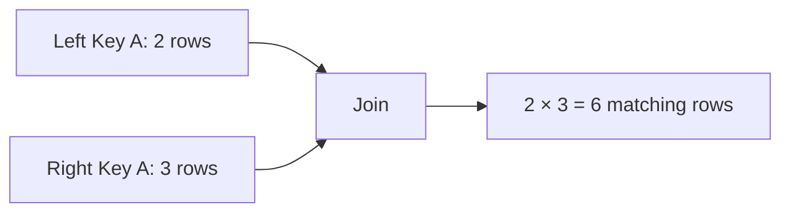
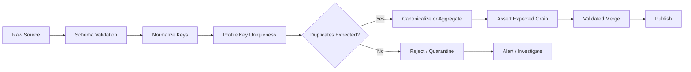

# 11- Duplicate Keys

## Overview

Duplicate join keys are one of the most important correctness concerns when combining Pandas DataFrames.

A duplicate key means the same join-key value appears in multiple rows. Duplicates are not automatically wrong, but they change join cardinality and can cause unexpected row multiplication.

Consider:

```text
orders
order_id | customer_id
---------|------------
1001     | 101
1002     | 101
```

Here `customer_id` is duplicated because multiple orders legitimately belong to the same customer.

But if the customer dimension contains:

```text
customer_id | segment
------------|----------
101         | SMB
101         | Enterprise
```

then an order/customer join becomes many-to-many.

The result can unexpectedly contain:

```text
order 1001 × customer 101 record 1
order 1001 × customer 101 record 2
order 1002 × customer 101 record 1
order 1002 × customer 101 record 2
```

This can inflate:

- Revenue.
- Transaction counts.
- Event counts.
- Inventory quantities.
- Reporting totals.

Duplicate-key handling is therefore not simply a cleaning task. It is part of **data-model correctness, join design, and production reliability**.

---

## What Is a Duplicate Key?

A duplicate key occurs when a join-key value appears more than once in a DataFrame.

Example:

```python
import pandas as pd


orders = pd.DataFrame(
    {
        "order_id": [1001, 1002, 1003],
        "customer_id": [101, 101, 102],
    }
)
```

Here:

```text
customer_id = 101
```

appears twice.

Check uniqueness:

```python
orders["customer_id"].is_unique
```

Result:

```text
False
```

Count duplicate-key rows:

```python
orders["customer_id"].duplicated().sum()
```

This counts duplicated occurrences after the first appearance.

---

## Duplicate Rows Versus Duplicate Keys

These are different concepts.

### Duplicate Rows

The entire row is repeated:

```text
order_id | customer_id | amount
---------|-------------|-------
1001     | 101         | 250.0
1001     | 101         | 250.0
```

Detect with:

```python
orders.duplicated()
```

### Duplicate Keys

The key repeats while other values differ:

```text
customer_id | segment
------------|----------
101         | SMB
101         | Enterprise
```

Detect with:

```python
customers["customer_id"].duplicated()
```

A DataFrame can therefore contain:

```text
duplicate key
+
non-duplicate rows
```

This distinction matters when determining the correct remediation.

---

## Why Duplicate Keys Matter in Joins

Suppose:

```text
left:
A → 2 rows

right:
A → 3 rows
```

A key-based merge can produce:

```text
2 × 3 = 6 rows
```

The multiplication happens because every left occurrence can match every right occurrence for the same key.

Conceptually:



This is expected relational behavior.

The problem occurs when the developer expected:

```text
one row per order
```

but the data actually represents:

```text
many rows per order
```

---

## The Most Important Question

Before removing duplicates, ask:

> Is the repeated key valid at this dataset's intended grain?

Examples:

| Dataset | Key | Duplicate Key Expected? |
| --- | --- | --- |
| Orders | `customer_id` | Yes |
| Customers | `customer_id` | Usually no |
| Transactions | `account_id` | Usually yes |
| Transaction ledger | `transaction_id` | Usually no |
| Events | `user_id` | Yes |
| Product catalog | `product_id` | Usually no |
| Employee assignments | `employee_id` | Depends on grain |

The same key can be validly duplicated in one dataset and invalid in another.

---

## Data Grain and Key Uniqueness

Key uniqueness only has meaning relative to the dataset's grain.

Suppose:

```text
customers
one row = one customer
```

Then:

```text
customer_id
```

should normally be unique.

But:

```text
customer_contacts
one row = one customer contact method
```

can legitimately contain:

```text
customer_id = 101
email
customer_id = 101
phone
```

The key is duplicated because the grain is different.

The engineering rule is:

> Define the row grain first, then determine which columns should be unique.

---

## Detecting Duplicate Keys

Use:

```python
duplicates = customers.loc[
    customers["customer_id"].duplicated(
        keep=False
    )
]
```

`keep=False` marks every occurrence of a duplicated key.

Example:

```text
customer_id
101
101
102
103
103
```

produces:

```text
customer_id
101
101
103
103
```

This is useful for diagnostics because both the original and repeated occurrences are retained.

---

## Finding Duplicate Key Values

To identify only the duplicated key values:

```python
duplicate_keys = (
    customers.loc[
        customers["customer_id"].duplicated(
            keep=False
        ),
        "customer_id",
    ]
    .drop_duplicates()
)
```

This produces one row per problematic key.

For operational diagnostics:

```python
print(
    duplicate_keys.tolist()
)
```

---

## Counting Duplicate Keys

Use:

```python
duplicate_key_counts = (
    customers["customer_id"]
    .value_counts()
    .loc[lambda s: s.gt(1)]
)
```

Example output:

```text
customer_id
101    3
205    2
```

This tells you:

```text
customer 101 appears 3 times
customer 205 appears 2 times
```

This is often more useful than a simple duplicate count because it reveals the severity of duplication.

---

## Detecting Duplicate Composite Keys

A logical key may contain multiple columns:

```text
tenant_id
customer_id
```

Check duplicates with:

```python
duplicates = customers.loc[
    customers.duplicated(
        subset=[
            "tenant_id",
            "customer_id",
        ],
        keep=False,
    )
]
```

This tests uniqueness of:

```text
(tenant_id, customer_id)
```

rather than:

```text
customer_id
```

alone.

For multi-tenant applications, composite-key validation is often essential.

---

## Duplicate Keys and Multi-Tenant Data

Suppose:

```text
tenant_id | customer_id
----------|------------
A         | 101
B         | 101
```

`customer_id` is duplicated globally but may be unique within each tenant.

This is valid if:

```text
customer = (tenant_id, customer_id)
```

The correct merge is:

```python
result = orders.merge(
    customers,
    on=[
        "tenant_id",
        "customer_id",
    ],
    how="left",
    validate="many_to_one",
)
```

Using only:

```python
on="customer_id"
```

could create cross-tenant matches.

That is both a correctness and a security problem.

---

## Duplicate Keys Before a Merge

For a dimension/lookup table:

```python
if customers["customer_id"].duplicated().any():
    raise ValueError(
        "customer_id must be unique."
    )
```

Then:

```python
orders = orders.merge(
    customers,
    on="customer_id",
    how="left",
    validate="many_to_one",
)
```

This provides two layers of protection:

```text
source validation
+
merge-time cardinality validation
```

---

## `merge(validate=...)`

Pandas provides direct merge validation:

```python
orders.merge(
    customers,
    on="customer_id",
    how="left",
    validate="many_to_one",
)
```

This means:

```text
left key can repeat
right key must be unique
```

If duplicates violate the expected relationship, Pandas raises:

```text
pandas.errors.MergeError
```

This is generally preferable to manually checking every assumption and then performing an unvalidated merge.

---

## Choosing the Correct Cardinality

| Data Relationship | Validation |
| --- | --- |
| One user → one profile | `one_to_one` |
| Many orders → one customer | `many_to_one` |
| One customer → many orders | `one_to_many` |
| Many-to-many association | `many_to_many` |

Do not select the validation mode based on which one makes the current batch succeed.

Select it based on the intended data model.

---

## Why `many_to_many` Requires Caution

This is technically valid:

```python
result = left.merge(
    right,
    on="key",
    validate="many_to_many",
)
```

But it does not mean the output is safe.

If:

```text
left key A = 100 rows
right key A = 200 rows
```

then the matching portion can generate:

```text
20,000 rows
```

for a single key.

A many-to-many relationship should therefore be explicitly modeled and bounded.

---

## Safe Deduplication

Sometimes duplicates are accidental and should be removed.

For example:

```python
customers = customers.drop_duplicates(
    subset=["customer_id"]
)
```

This is safe only when all duplicate records are semantically interchangeable.

If:

```text
customer_id | status    | updated_at
------------|-----------|-------------------
101         | inactive  | 2026-09-01 10:00
101         | active    | 2026-09-05 10:00
```

blind deduplication can discard important information.

---

## Deterministic Deduplication

If the business rule is:

> Keep the most recently updated customer record.

Then implement that rule explicitly:

```python
customers = (
    customers
    .sort_values(
        "updated_at",
        kind="stable",
    )
    .drop_duplicates(
        subset=["customer_id"],
        keep="last",
    )
)
```

Now the output has a deterministic policy:

```text
one customer_id
    ↓
latest record
```

This is much safer than:

```python
drop_duplicates()
```

without a documented selection rule.

---

## Deduplication Requires a Business Rule

Possible canonicalization policies include:

```text
latest updated record
most recent event
highest source priority
active record over inactive
trusted source over secondary source
highest version number
```

Example:

```python
customers = (
    customers
    .assign(
        source_priority=lambda df: df[
            "source"
        ].map(
            {
                "crm": 1,
                "legacy": 2,
            }
        )
    )
    .sort_values(
        [
            "customer_id",
            "source_priority",
            "updated_at",
        ],
        ascending=[
            True,
            True,
            False,
        ],
        kind="stable",
    )
    .drop_duplicates(
        subset=["customer_id"],
        keep="first",
    )
)
```

The business rule should be documented and tested.

---

## Never Hide Duplicates Just to Make a Merge Pass

Avoid:

```python
customers = customers.drop_duplicates(
    "customer_id"
)

orders.merge(
    customers,
    on="customer_id",
    validate="many_to_one",
)
```

unless you can explain:

```text
why
+
which row
+
why that row is authoritative
```

Otherwise the pipeline is converting a visible data-quality problem into silent data loss.

A senior engineering approach is:

```text
detect
→ classify
→ resolve according to policy
→ validate
```

---

## Duplicate Detection With Business Priority

Suppose records come from multiple systems:

```text
source
CRM
legacy
manual
```

A deterministic priority can be applied:

```python
source_priority = {
    "crm": 1,
    "legacy": 2,
    "manual": 3,
}

customers = (
    customers
    .assign(
        priority=lambda df: df[
            "source"
        ].map(source_priority)
    )
    .sort_values(
        [
            "customer_id",
            "priority",
            "updated_at",
        ]
    )
    .drop_duplicates(
        "customer_id",
        keep="first",
    )
)
```

Then enforce:

```python
assert customers[
    "customer_id"
].is_unique
```

This turns duplicate resolution into a reproducible transformation.

---

## Duplicate Keys and Aggregation

Sometimes duplicates should not be removed because the data is naturally transactional.

For example:

```text
account_id | amount
-----------|-------
101        | 100
101        | 200
101        | 150
```

This is not duplicate customer data.

It is multiple transactions for the same account.

If the target grain is one row per account, aggregate:

```python
account_summary = (
    transactions
    .groupby(
        "account_id",
        as_index=False,
    )
    .agg(
        total_amount=(
            "amount",
            "sum",
        ),
        transaction_count=(
            "amount",
            "size",
        ),
    )
)
```

Then join:

```python
accounts = accounts.merge(
    account_summary,
    on="account_id",
    how="left",
    validate="one_to_one",
)
```

Aggregation can be the correct solution when duplicates represent legitimate lower-grain data.

---

## Duplicate Keys and Join Explosion

Suppose:

```text
orders
customer_id = 101 → 50 rows

customers
customer_id = 101 → 2 rows
```

A many-to-one enrichment becomes invalid.

The merge can generate:

```text
50 × 2 = 100 rows
```

instead of:

```text
50 rows
```

If revenue is aggregated afterward:

```python
result["revenue"].sum()
```

the result can be approximately doubled for those records.

This is why duplicate-key validation should occur **before downstream aggregation**.

---

## Detecting Join Multiplication

After a merge:

```python
result = orders.merge(
    customers,
    on="customer_id",
    how="left",
)
```

Compare:

```python
input_rows = len(orders)
output_rows = len(result)

print(
    f"Input: {input_rows:,}"
)

print(
    f"Output: {output_rows:,}"
)
```

For a relationship expected to be many-to-one:

```python
if output_rows != input_rows:
    raise ValueError(
        "Join multiplied the expected row count."
    )
```

This is an additional guardrail, not a replacement for `validate`.

---

## Duplicate Key Diagnostics

A useful diagnostic table:

```python
duplicate_summary = (
    customers.loc[
        customers["customer_id"].duplicated(
            keep=False
        )
    ]
    .groupby(
        "customer_id",
        as_index=False,
    )
    .size()
    .rename(
        columns={
            "size": "duplicate_count"
        }
    )
    .sort_values(
        "duplicate_count",
        ascending=False,
    )
)
```

This makes it easy to identify the most problematic keys.

---

## Duplicate Rates

Monitor duplication as a ratio:

```python
duplicate_rate = (
    customers["customer_id"]
    .duplicated()
    .mean()
)
```

This can become a pipeline metric.

For example:

```text
duplicate key rate = 0.00%
```

might be expected for a canonical dimension, while:

```text
duplicate key rate = 4.50%
```

could indicate upstream corruption.

---

## Duplicate Rate Versus Unique-Key Rate

These answer slightly different questions.

Unique keys:

```python
unique_rate = (
    customers["customer_id"]
    .nunique()
    / len(customers)
)
```

Duplicate occurrences:

```python
duplicate_occurrence_rate = (
    customers["customer_id"]
    .duplicated()
    .mean()
)
```

For a dimension table:

```text
unique rate should generally approach 100%
```

But for transactional datasets:

```text
repeated foreign keys may be completely normal
```

Metrics should therefore reflect the intended grain.

---

## Duplicate Keys and Missing Keys

Missing keys require separate handling.

Example:

```python
customers["customer_id"].isna().sum()
```

A missing key is not the same as a duplicate key.

A strong validation layer treats them independently:

```text
missing key count
+
duplicate key count
+
invalid key format
```

For a canonical dimension:

```python
if customers["customer_id"].isna().any():
    raise ValueError(
        "Customer IDs cannot be null."
    )

if customers["customer_id"].duplicated().any():
    raise ValueError(
        "Customer IDs must be unique."
    )
```

---

## Duplicate Keys and Dtypes

Equivalent identifiers can be represented differently across sources.

Normalize keys first:

```python
customers["customer_id"] = (
    customers["customer_id"]
    .astype("string")
    .str.strip()
)

orders["customer_id"] = (
    orders["customer_id"]
    .astype("string")
    .str.strip()
)
```

This prevents problems such as:

```text
101
"101"
" 101 "
```

being treated inconsistently across ingestion boundaries.

Do not normalize blindly when formatting carries business meaning.

---

## Duplicate Keys from API Data

REST APIs can return duplicates due to:

```text
pagination bugs
retries
eventual consistency
multiple versions
upstream query changes
```

Example:

```python
customers = pd.DataFrame(
    api_response["items"]
)

duplicates = customers.loc[
    customers["customer_id"].duplicated(
        keep=False
    )
]
```

Do not assume API output is unique merely because the endpoint documentation suggests one resource per identifier.

Validate the response before using it as a lookup table.

---

## Duplicate Keys from CSV Files

CSV exports can contain:

```text
repeated records
manual edits
multiple exports appended together
header-related issues
```

After loading:

```python
customers = pd.read_csv(
    "customers.csv"
)

if customers["customer_id"].duplicated().any():
    raise ValueError(
        "Duplicate customer IDs found in CSV input."
    )
```

For recurring ingestion, make this a formal data-quality check.

---

## Duplicate Keys from PostgreSQL

A well-designed database can often provide stronger guarantees.

For a unique customer identifier:

```sql
CREATE UNIQUE INDEX customers_customer_id_uidx
ON customers (customer_id);
```

Then Pandas can reinforce the same contract:

```python
customers = pd.read_sql(
    """
    SELECT
        customer_id,
        segment,
        updated_at
    FROM customers
    """,
    connection,
)

assert customers[
    "customer_id"
].is_unique
```

Database constraints and Pandas validation provide defense in depth.

---

## Duplicate Keys and Parquet

Parquet preserves tabular data efficiently, but it does not inherently mean that a logical key is unique.

After loading:

```python
customers = pd.read_parquet(
    "customers.parquet"
)

if not customers[
    "customer_id"
].is_unique:
    raise ValueError(
        "Customer dimension violates "
        "the unique-key contract."
    )
```

A storage format is not a data-quality constraint.

---

## Duplicate Keys in Incremental Processing

Incremental pipelines can introduce duplicates when batches overlap.

Suppose batch `B2` accidentally contains records already present in `B1`.

The combined dataset may contain:

```text
record_id = 1001
B1
B2
```

A common strategy is deterministic upsert-like canonicalization:

```python
combined = pd.concat(
    [
        previous,
        current_batch,
    ],
    ignore_index=True,
)

combined = (
    combined
    .sort_values(
        "updated_at",
        kind="stable",
    )
    .drop_duplicates(
        subset=["record_id"],
        keep="last",
    )
)
```

This is appropriate only when `updated_at` defines which record is authoritative.

---

## Duplicate Keys and Idempotent ETL

An idempotent pipeline should produce the same logical result when the same batch is retried.

Suppose ingestion accidentally repeats:

```text
batch 100
batch 100
```

A canonicalization strategy can prevent duplicate persistence.

For example:

```python
output = (
    pd.concat(
        batches,
        ignore_index=True,
    )
    .sort_values(
        [
            "record_id",
            "updated_at",
        ],
        kind="stable",
    )
    .drop_duplicates(
        "record_id",
        keep="last",
    )
)
```

The deduplication rule must be deterministic.

---

## Duplicate Keys and Kafka Events

Event streams can be delivered more than once.

Suppose:

```text
Kafka
    ↓
consumer
    ↓
Pandas batch
```

contains repeated event identifiers.

Deduplicate using a stable event identity:

```python
events = events.drop_duplicates(
    subset=["event_id"],
    keep="last",
)
```

Only do this if:

```text
event_id
```

uniquely identifies the event.

Do not deduplicate on a weak combination such as:

```text
user_id + timestamp
```

unless the business model guarantees uniqueness.

---

## Duplicate Keys and Historical Records

Some datasets intentionally contain multiple versions:

```text
customer_id | version | updated_at
101         | 1       | ...
101         | 2       | ...
```

These are not necessarily duplicate business records.

They represent:

```text
history
```

The correct transformation may be:

```python
latest = (
    customers
    .sort_values(
        [
            "customer_id",
            "version",
        ],
        kind="stable",
    )
    .drop_duplicates(
        subset=["customer_id"],
        keep="last",
    )
)
```

or keeping all versions for auditing.

Do not collapse history merely to satisfy a merge constraint.

---

## Duplicate Keys and Slowly Changing Dimensions

A slowly changing dimension can legitimately contain multiple records for a business entity:

```text
customer_id | valid_from | valid_to | segment
------------|------------|----------|---------
101         | 2025-01-01 | 2026-01-01 | SMB
101         | 2026-01-01 | NaT        | Enterprise
```

A simple:

```python
orders.merge(
    customers,
    on="customer_id",
)
```

is not sufficient if the correct customer attribute depends on transaction date.

The pipeline may require:

```text
effective-date filtering
temporal joins
merge_asof()
version selection
```

Duplicate keys can therefore be evidence that the data contains valid temporal dimensions.

---

## Duplicate Keys and `merge_asof()`

For time-aware data, exact-key uniqueness may not be the correct model.

Example:

```text
customer_id
effective_at
```

can legitimately repeat over time.

A temporal lookup may be closer to:

```python
result = pd.merge_asof(
    transactions.sort_values(
        "transaction_time"
    ),
    customer_history.sort_values(
        "effective_at"
    ),
    left_on="transaction_time",
    right_on="effective_at",
    by="customer_id",
)
```

The important principle is:

> Do not force temporal data into a unique-key model simply because a normal merge expects a simpler relationship.

---

## Duplicate Keys and Data Contracts

A production dataset should define its expected uniqueness explicitly.

Example:

```text
Dataset: customers
Grain: one row per customer
Natural key: customer_id
Uniqueness: required
Nullability: not allowed
```

This can then be implemented:

```python
if customers["customer_id"].isna().any():
    raise ValueError(
        "customer_id cannot be null."
    )

if not customers["customer_id"].is_unique:
    raise ValueError(
        "customer_id must be unique."
    )
```

Data contracts turn assumptions into enforceable expectations.

---

## Data Flow for Duplicate-Key Handling

A robust pipeline can use:



The important distinction is between:

```text
unexpected duplicates
```

and:

```text
legitimate repeated keys
```

---

## Recommended Validation Function

Create reusable validation utilities for important pipelines:

```python
import pandas as pd


def require_unique_key(
    df: pd.DataFrame,
    key_columns: list[str],
    dataset_name: str,
) -> None:
    missing_columns = set(key_columns).difference(
        df.columns
    )

    if missing_columns:
        raise ValueError(
            f"{dataset_name} is missing key columns: "
            f"{sorted(missing_columns)}"
        )

    if df[key_columns].isna().any().any():
        raise ValueError(
            f"{dataset_name} contains null key values."
        )

    duplicate_mask = df.duplicated(
        subset=key_columns,
        keep=False,
    )

    if duplicate_mask.any():
        duplicate_count = int(
            duplicate_mask.sum()
        )

        raise ValueError(
            f"{dataset_name} contains "
            f"{duplicate_count:,} rows with "
            "duplicate keys."
        )
```

Usage:

```python
require_unique_key(
    customers,
    key_columns=["customer_id"],
    dataset_name="customers",
)

orders = orders.merge(
    customers,
    on="customer_id",
    how="left",
    validate="many_to_one",
)
```

This centralizes a common production invariant.

---

## Producing Useful Duplicate Reports

For batch diagnostics:

```python
def duplicate_key_report(
    df: pd.DataFrame,
    key_columns: list[str],
) -> pd.DataFrame:
    duplicated = df.loc[
        df.duplicated(
            subset=key_columns,
            keep=False,
        )
    ]

    return (
        duplicated
        .groupby(
            key_columns,
            dropna=False,
            as_index=False,
        )
        .size()
        .rename(
            columns={
                "size": "row_count",
            }
        )
        .sort_values(
            "row_count",
            ascending=False,
        )
    )
```

This creates a compact operational report showing which keys are duplicated and how severely.

---

## Production Error Handling

When duplicates violate a hard data contract, fail explicitly:

```python
try:
    result = orders.merge(
        customers,
        on="customer_id",
        how="left",
        validate="many_to_one",
    )
except pd.errors.MergeError as exc:
    raise RuntimeError(
        "Customer enrichment failed because "
        "the customer key is not unique."
    ) from exc
```

Do not silently:

```text
drop duplicates
ignore the error
switch to many_to_many
take the first row
```

unless the business logic explicitly defines that behavior.

---

## Monitoring Duplicate Keys

Track metrics such as:

```text
duplicate_key_rows
duplicate_key_values
duplicate_rate
missing_key_rows
unique_key_count
input_row_count
output_row_count
merge_validation_failures
```

For example:

```python
duplicate_rows = int(
    customers["customer_id"]
    .duplicated()
    .sum()
)

duplicate_values = int(
    customers.loc[
        customers["customer_id"].duplicated(
            keep=False
        ),
        "customer_id",
    ]
    .nunique()
)
```

These metrics can be emitted to the application's observability system.

---

## Alerting Strategy

Not every duplicate should page an engineer.

Use severity based on the data contract.

For a canonical dimension:

```text
duplicate rate > 0%
    → batch failure
```

For a naturally repeated transactional key:

```text
duplicate rate
    → informational metric
```

For a source where small duplication is tolerated:

```text
duplicate rate > threshold
    → warning or quarantine
```

The threshold should come from known business behavior.

---

## Security Considerations

Duplicate keys can become security-sensitive when they cross tenant or authorization boundaries.

Suppose:

```text
tenant_id
customer_id
```

define an entity.

An incorrect join on:

```python
customer_id
```

alone may attach another tenant's metadata.

Always use the complete key:

```python
result = orders.merge(
    customers,
    on=[
        "tenant_id",
        "customer_id",
    ],
    how="left",
    validate="many_to_one",
)
```

Key integrity is therefore part of tenant isolation.

---

## Performance Considerations

Duplicate keys can dramatically increase memory usage because joins may multiply rows.

Suppose:

```text
left = 10 million rows
right = 1 million rows
```

with heavy duplicate concentration on the join key.

The final output can be much larger than either input.

Validation is therefore also a performance safeguard.

Before a large merge:

```python
duplicate_keys = int(
    right["customer_id"]
    .duplicated()
    .sum()
)
```

If the right side is expected to be unique:

```python
if duplicate_keys:
    raise ValueError(
        "Lookup table contains duplicate keys."
    )
```

Failing before the merge can prevent massive temporary allocations.

---

## Memory and Kubernetes

Unexpected join multiplication can cause:

```text
large DataFrame allocation
    ↓
high memory pressure
    ↓
container OOM
    ↓
Kubernetes worker restart
```

A cardinality check before the merge is cheaper than discovering the problem after materializing the output.

For high-volume pipelines, also consider:

```text
database-side joins
DuckDB
Spark
partitioned processing
```

when Pandas becomes an inappropriate execution engine.

---

## Duplicate Keys and SQL

Relational databases also permit repeated values unless uniqueness is explicitly constrained.

A PostgreSQL table:

```sql
CREATE TABLE customers (
    customer_id BIGINT,
    segment TEXT
);
```

does not automatically guarantee:

```text
customer_id is unique
```

If uniqueness is required:

```sql
CREATE UNIQUE INDEX customers_customer_id_uidx
ON customers (customer_id);
```

This lets the database enforce the data model at the storage boundary.

Pandas should still validate imported data because data can come from other sources and transformations.

---

## Database-to-Pandas Workflow

A robust pipeline can enforce uniqueness in PostgreSQL and Pandas:

```text
PostgreSQL
    ↓
UNIQUE constraint
    ↓
SQL query
    ↓
Pandas DataFrame
    ↓
is_unique / merge(validate=...)
    ↓
ETL transformation
```

This defense-in-depth approach protects against:

```text
schema drift
alternate sources
bad extracts
test fixtures
manual files
API changes
```

---

## Testing Duplicate-Key Behavior

Test valid repeated foreign keys:

```python
def test_many_orders_can_share_customer() -> None:
    orders = pd.DataFrame(
        {
            "order_id": [1, 2],
            "customer_id": [101, 101],
        }
    )

    customers = pd.DataFrame(
        {
            "customer_id": [101],
            "segment": ["Enterprise"],
        }
    )

    result = orders.merge(
        customers,
        on="customer_id",
        how="left",
        validate="many_to_one",
    )

    assert len(result) == len(orders)
```

This demonstrates that duplicate keys on the many side are expected.

---

## Testing Invalid Lookup Duplicates

```python
import pandas as pd
import pytest


def test_duplicate_lookup_keys_fail() -> None:
    orders = pd.DataFrame(
        {
            "order_id": [1],
            "customer_id": [101],
        }
    )

    customers = pd.DataFrame(
        {
            "customer_id": [101, 101],
            "segment": [
                "SMB",
                "Enterprise",
            ],
        }
    )

    with pytest.raises(
        pd.errors.MergeError
    ):
        orders.merge(
            customers,
            on="customer_id",
            how="left",
            validate="many_to_one",
        )
```

This verifies the data contract rather than merely checking output values.

---

## Testing Deterministic Deduplication

Suppose the rule is:

> Keep the most recently updated customer.

Test that behavior explicitly:

```python
def test_latest_customer_record_is_selected() -> None:
    customers = pd.DataFrame(
        {
            "customer_id": [101, 101],
            "segment": [
                "SMB",
                "Enterprise",
            ],
            "updated_at": pd.to_datetime(
                [
                    "2026-09-01",
                    "2026-09-05",
                ]
            ),
        }
    )

    result = (
        customers
        .sort_values(
            "updated_at",
            kind="stable",
        )
        .drop_duplicates(
            "customer_id",
            keep="last",
        )
    )

    assert result.iloc[0]["segment"] == (
        "Enterprise"
    )
```

This ensures the canonicalization rule remains stable.

---

## Common Mistakes

### Removing All Duplicate Keys Automatically

This can delete legitimate business records.

Determine the intended grain before deduplicating.

---

### Using `drop_duplicates()` Without a Rule

This makes the surviving row dependent on input ordering.

Sort according to an explicit authority rule first.

---

### Using `many_to_many` to Silence Errors

This can hide a genuine data-quality defect and create inflated downstream metrics.

---

### Assuming Duplicate Keys Are Always Invalid

Foreign keys frequently repeat.

For example:

```text
customer_id
101
101
101
```

is completely normal in an order table.

---

### Checking Only Exact Duplicate Rows

Two rows with the same key but different attributes can still violate the intended key constraint.

Check the logical key, not just whole-row duplication.

---

### Deduplicating Historical Data

Multiple versions of a record may represent legitimate history.

Do not collapse them unless the target dataset requires a current-state view.

---

## Production Pitfalls

### Upstream Schema Changes

A previously unique API field may become repeated due to:

```text
new versioning semantics
pagination changes
multiple statuses
historical records
```

Merge validation can expose this change quickly.

---

### Late-Arriving Data

Incremental ETL jobs can receive multiple versions of the same business entity.

Define whether:

```text
latest wins
source priority wins
all versions are retained
```

before implementing deduplication.

---

### Floating Grain

A dataset may begin as:

```text
one row = one customer
```

and later include:

```text
one row = one customer × region
```

The same `customer_id` then becomes duplicated legitimately.

The data contract must evolve with the grain.

---

### Accidental Row Multiplication

The most dangerous outcome is often not an exception.

It is:

```text
merge succeeds
    ↓
rows multiply
    ↓
aggregation succeeds
    ↓
report looks plausible
    ↓
numbers are wrong
```

Cardinality validation is designed to stop this failure mode early.

---

## Recommended Production Workflow

Use this sequence when a join-key duplicate is discovered:

```text
Identify the intended row grain
        ↓
Identify the logical key
        ↓
Measure duplicate keys
        ↓
Determine whether duplicates are valid
        ↓
If invalid → reject or canonicalize
        ↓
If valid → aggregate or use the correct relationship
        ↓
Declare merge cardinality with validate=
        ↓
Check output grain
        ↓
Monitor duplicate and row-growth metrics
```

This separates data-model decisions from Pandas mechanics.

---

## Practical End-to-End Example

Suppose an e-commerce pipeline receives customer data from a CRM and order data from PostgreSQL.

```python
import pandas as pd


orders = pd.DataFrame(
    {
        "order_id": [1001, 1002, 1003],
        "customer_id": [101, 101, 102],
        "revenue": [250.0, 180.0, 420.0],
    }
)

customers = pd.DataFrame(
    {
        "customer_id": [101, 101, 102],
        "segment": [
            "SMB",
            "Enterprise",
            "Enterprise",
        ],
        "updated_at": pd.to_datetime(
            [
                "2026-09-01",
                "2026-09-05",
                "2026-09-05",
            ]
        ),
    }
)
```

The customer lookup is not unique:

```python
if customers["customer_id"].duplicated().any():
    customers = (
        customers
        .sort_values(
            "updated_at",
            kind="stable",
        )
        .drop_duplicates(
            "customer_id",
            keep="last",
        )
    )
```

Now enforce the relationship:

```python
orders = orders.merge(
    customers[
        [
            "customer_id",
            "segment",
        ]
    ],
    on="customer_id",
    how="left",
    validate="many_to_one",
)
```

The resulting grain is:

```text
one row = one order
```

because:

```text
many orders
    →
one canonical customer record
```

The critical design decision was not `drop_duplicates()` itself. It was defining:

```text
latest customer record = authoritative
```

---

## Decision Guide

| Situation | Recommended Action |
| --- | --- |
| Duplicate foreign key in fact table | Usually keep; verify expected grain |
| Duplicate key in canonical dimension | Investigate / reject |
| Exact duplicate records | Remove if semantically redundant |
| Multiple versions of same entity | Apply explicit version-selection rule |
| Historical dimension records | Preserve history or perform temporal lookup |
| Duplicate keys caused by repeated batches | Use deterministic idempotent canonicalization |
| Duplicate key across tenants | Include tenant in composite key |
| One-to-many relationship | Use `validate="one_to_many"` |
| Many-to-one enrichment | Use `validate="many_to_one"` |
| Intentional many-to-many relationship | Model explicitly and estimate output size |
| Unknown duplicate semantics | Stop and determine the data contract |

---

## Key Takeaways

- Duplicate keys are not inherently bad; their validity depends on the DataFrame's intended row grain and logical key.
- Duplicate keys can multiply join results, causing silent overcounting and severe memory growth, so expected cardinality should always be explicit.
- Use `merge(validate=...)` to enforce relationships such as `many_to_one` and `one_to_one` at the merge boundary.
- Never deduplicate blindly; use deterministic business rules such as latest version, source priority, or aggregation when duplicates need to be resolved.
- In production pipelines, combine duplicate-key checks with schema validation, composite tenant keys, output-grain checks, monitoring, and database constraints for defense in depth.