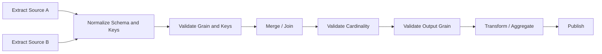

# README

## Overview

The **Combining Data** section covers the Pandas operations used to bring multiple datasets together into a coherent result.

In production data workflows, useful information is rarely contained in a single DataFrame. An e-commerce pipeline may have separate datasets for:

```text
orders
customers
products
payments
inventory
```

A reporting pipeline may combine:

```text
database query results
REST API responses
CSV exports
Parquet partitions
reference datasets
```

| # | File | Description |
|---|---|---|
| 01 | [01- Concat](./01-%20Concat.md) | Combine tabular datasets with compatible structure |
| 02 | [02- Merge](./02-%20Merge.md) | Combine datasets using explicit relationships between keys |
| 03 | [03- Join](./03-%20Join.md) | Combine datasets using index-oriented semantics |
| 04 | [04- Merge Types](./04-%20Merge%20Types.md) | Understand inner, left, right, outer, and cross behavior |
| 05 | [05- Inner Join](./05-%20Inner%20Join.md) | Matching records only |
| 06 | [06- Left Join](./06-%20Left%20Join.md) | All left records |
| 07 | [07- Right Join](./07-%20Right%20Join.md) | All right records |
| 08 | [08- Outer Join](./08-%20Outer%20Join.md) | All records from both sides |
| 09 | [09- Cross Join](./09-%20Cross%20Join.md) | Every possible combination |
| 10 | [10- Merge Validation](./10-%20Merge%20Validation.md) | Enforce expected key cardinality |
| 11 | [11- Duplicate Keys](./11-%20Duplicate%20Keys.md) | Detect and control row multiplication |

Pandas provides several mechanisms for combining these datasets:

```text
Concat
    ↓
Combine tabular datasets with compatible structure

Merge
    ↓
Combine datasets using explicit relationships between keys

Join
    ↓
Combine datasets using index-oriented semantics

Merge Types
    ↓
Understand inner, left, right, outer, and cross behavior

Merge Validation
    ↓
Enforce expected key cardinality

Duplicate Keys
    ↓
Detect and control row multiplication
```

The central engineering problem is not memorizing Pandas syntax. It is understanding:

```text
dataset grain
    +
join keys
    +
cardinality
    +
population semantics
    +
output grain
```

Once these are explicit, choosing the correct Pandas operation becomes much easier.

---

## Section Structure

```text
07- Combining Data/
│
├── 01- Concat.md
├── 02- Merge.md
├── 03- Join.md
├── 04- Merge Types.md
├── 05- Inner Join.md
├── 06- Left Join.md
├── 07- Right Join.md
├── 08- Outer Join.md
├── 09- Cross Join.md
├── 10- Merge Validation.md
├── 11- Duplicate Keys.md
└── README.md
```

The topics progress from basic dataset combination toward production-safe relational processing.

---

## Combining Data Mental Model

There are three primary questions to ask before combining DataFrames.

### Are the datasets representing the same logical schema?

Use:

```python
pd.concat(...)
```

Typical use:

```text
January orders
+
February orders
+
March orders
```

producing:

```text
all orders
```

---

### Do the datasets have a relationship through keys?

Use:

```python
DataFrame.merge(...)
```

Typical use:

```text
orders.customer_id
        ↓
customers.customer_id
```

producing:

```text
orders + customer attributes
```

---

### Is the relationship index-oriented?

Use:

```python
DataFrame.join(...)
```

Typical use:

```text
primary DataFrame
        ↓
indexed lookup DataFrame
```

These operations overlap in capability, but their intended semantics differ.

---

## Concat Versus Merge Versus Join

| Operation | Primary Purpose | Relationship |
| --- | --- | --- |
| `pd.concat()` | Stack or align datasets | Same logical structure or aligned axes |
| `merge()` | Relational combination | Explicit key relationship |
| `join()` | Index-oriented combination | Usually index-based |
| `merge(how="cross")` | Cartesian product | No relationship required |

A practical rule:

```text
same kind of data
    → concat

related entities
    → merge

index-oriented lookup
    → join

every possible combination
    → cross join
```

---

## Dataset Grain

Before combining DataFrames, define the grain of every input.

Examples:

```text
orders
one row = one order

customers
one row = one customer

transactions
one row = one transaction

events
one row = one event

customer_contacts
one row = one customer contact method
```

Grain determines whether duplicate keys are expected.

For example:

```text
orders.customer_id
```

is normally repeated because one customer can have many orders.

But:

```text
customers.customer_id
```

should generally be unique if the customer DataFrame has one row per customer.

Without knowing the grain, join correctness cannot be established.

---

## Join Keys

A join key identifies the relationship between datasets.

Simple key:

```python
orders.merge(
    customers,
    on="customer_id",
)
```

Composite key:

```python
orders.merge(
    customers,
    on=[
        "tenant_id",
        "customer_id",
    ],
)
```

Different key names:

```python
orders.merge(
    customers,
    left_on="customer_id",
    right_on="id",
)
```

The key should reflect the actual business relationship.

Do not choose a convenient column merely because it happens to contain similar-looking values.

---

## Join Cardinality

Cardinality describes how many rows can match for a key.

The primary relationships are:

```text
one-to-one
one-to-many
many-to-one
many-to-many
```

For example:

```text
orders
many rows per customer_id

customers
one row per customer_id
```

This is:

```text
many-to-one
```

Use:

```python
orders.merge(
    customers,
    on="customer_id",
    validate="many_to_one",
)
```

Cardinality is one of the most important concepts in production Pandas joins.

---

## Why Cardinality Matters

Suppose:

```text
left:
customer 101 → 3 rows

right:
customer 101 → 2 rows
```

A normal merge can produce:

```text
3 × 2 = 6 rows
```

This is expected Pandas behavior.

It becomes a production defect when the expected relationship was:

```text
many orders
    →
one customer
```

A row-multiplication defect can silently corrupt:

```text
revenue
counts
inventory
financial reports
analytics
```

Use merge validation and output-grain checks to detect it.

---

## Join Types

The standard relational join types are:

| Join | Preserved Population |
| --- | --- |
| Inner | Matching records only |
| Left | All left records |
| Right | All right records |
| Outer | All records from both sides |
| Cross | Every possible combination |

Examples:

```python
orders.merge(
    customers,
    on="customer_id",
    how="inner",
)
```

```python
orders.merge(
    customers,
    on="customer_id",
    how="left",
)
```

```python
orders.merge(
    customers,
    on="customer_id",
    how="right",
)
```

```python
orders.merge(
    customers,
    on="customer_id",
    how="outer",
)
```

```python
orders.merge(
    customers,
    how="cross",
)
```

---

## Inner Join

An inner join retains only matching records.

```python
result = orders.merge(
    customers,
    on="customer_id",
    how="inner",
)
```

Use it when:

```text
only records with a valid relationship should remain
```

Examples:

- Orders belonging to known customers.
- Transactions linked to known accounts.
- Events linked to known services.

The key risk is population loss.

If a key does not match, that row disappears.

---

## Left Join

A left join preserves all left-side records:

```python
result = orders.merge(
    customers,
    on="customer_id",
    how="left",
    validate="many_to_one",
)
```

This is the most common pattern for enrichment:

```text
primary dataset
+
optional attributes
```

Typical examples:

```text
orders + customers
transactions + accounts
events + service metadata
```

Unmatched right-side attributes become missing values.

---

## Right Join

A right join preserves every right-side record:

```python
result = transactions.merge(
    accounts,
    on="account_id",
    how="right",
)
```

It is useful when the right-side population is authoritative.

However, many teams prefer reversing operands and expressing the same logic as a left join:

```python
result = accounts.merge(
    transactions,
    on="account_id",
    how="left",
)
```

This makes the authoritative dataset visually obvious.

---

## Outer Join

An outer join preserves all records from both sides:

```python
result = source_a.merge(
    source_b,
    on="record_id",
    how="outer",
    indicator=True,
)
```

It is particularly useful for:

```text
reconciliation
source comparison
migration validation
data-quality checks
completeness analysis
```

The indicator identifies:

```text
left_only
right_only
both
```

This makes missing populations explicit.

---

## Cross Join

A cross join produces every combination:

```python
result = products.merge(
    regions,
    how="cross",
)
```

If:

```text
products = 10,000 rows
regions  = 100 rows
```

the output contains:

```text
1,000,000 rows
```

Use it for bounded candidate generation such as:

```text
product × region
date × metric
scenario × year
employee × shift
```

Always calculate expected output size first.

---

## Merge Validation

Use `validate` whenever the relationship has a known cardinality.

```python
result = orders.merge(
    customers,
    on="customer_id",
    how="left",
    validate="many_to_one",
)
```

Available relationships include:

```text
one_to_one
one_to_many
many_to_one
many_to_many
```

Validation turns a business assumption into an executable runtime constraint.

This is especially important for production ETL.

---

## Duplicate Keys

Duplicate keys are not automatically errors.

Example:

```text
orders
customer_id
101
101
101
```

This is normal if:

```text
one row = one order
```

But:

```text
customers
customer_id
101
101
```

may be invalid if:

```text
one row = one customer
```

Always interpret duplicate keys relative to the dataset's grain.

---

## Detecting Duplicate Keys

Use:

```python
duplicates = customers.loc[
    customers["customer_id"].duplicated(
        keep=False
    )
]
```

Count duplicate occurrences:

```python
duplicate_count = (
    customers["customer_id"]
    .duplicated()
    .sum()
)
```

Find duplicate-key frequencies:

```python
duplicate_summary = (
    customers["customer_id"]
    .value_counts()
    .loc[lambda s: s.gt(1)]
)
```

For composite keys:

```python
duplicates = customers.loc[
    customers.duplicated(
        subset=[
            "tenant_id",
            "customer_id",
        ],
        keep=False,
    )
]
```

---

## Deduplication

Never remove duplicates blindly.

This:

```python
customers = customers.drop_duplicates(
    subset=["customer_id"]
)
```

is only safe when duplicate records are semantically interchangeable.

A production pipeline should define a deterministic rule.

For example:

```python
customers = (
    customers
    .sort_values(
        "updated_at",
        kind="stable",
    )
    .drop_duplicates(
        subset=["customer_id"],
        keep="last",
    )
)
```

This means:

```text
latest record wins
```

The business rule should be documented and tested.

---

## Aggregation Instead of Deduplication

Repeated rows may represent legitimate lower-grain data.

Suppose:

```text
transactions
one row = one transaction
```

and the output requires:

```text
one row = one account
```

Aggregate first:

```python
account_summary = (
    transactions
    .groupby(
        "account_id",
        as_index=False,
    )
    .agg(
        transaction_count=(
            "transaction_id",
            "nunique",
        ),
        total_amount=(
            "amount",
            "sum",
        ),
    )
)
```

Then combine:

```python
accounts = accounts.merge(
    account_summary,
    on="account_id",
    how="left",
    validate="one_to_one",
)
```

This preserves valid transaction history while creating the required account-level grain.

---

## Duplicate-Key Failure Pattern

A common production failure looks like:

```text
raw data
    ↓
duplicate lookup records
    ↓
merge
    ↓
row multiplication
    ↓
aggregation
    ↓
incorrect metrics
```

For example:

```text
100 orders
+
2 customer records per customer
```

can create approximately:

```text
200 output rows
```

before aggregation.

The report may still look plausible.

This is why cardinality should be validated before downstream transformations.

---

## Output Grain Validation

Merge validation protects key cardinality, but output-level invariants are also useful.

For a many-to-one order enrichment:

```python
result = orders.merge(
    customers,
    on="customer_id",
    how="left",
    validate="many_to_one",
)

if len(result) != len(orders):
    raise ValueError(
        "Order grain changed unexpectedly."
    )
```

For an entity-level report:

```python
assert result["customer_id"].is_unique
```

The appropriate invariant depends on the intended output grain.

---

## Missing Join Keys

Missing keys should be validated independently from duplicates.

Check:

```python
missing_keys = orders[
    "customer_id"
].isna().sum()
```

If the relationship is mandatory:

```python
if missing_keys:
    raise ValueError(
        "Orders contain missing customer IDs."
    )
```

If the relationship is optional, preserve the rows and define the missing-value semantics explicitly.

A merge succeeding does not mean the join keys are valid.

---

## Join Key Dtypes

Keys from different sources can have different Pandas dtypes:

```text
PostgreSQL → integer
CSV        → object/string
REST API   → string
Parquet    → nullable integer/string
```

Normalize where necessary:

```python
orders["customer_id"] = (
    orders["customer_id"]
    .astype("string")
)

customers["customer_id"] = (
    customers["customer_id"]
    .astype("string")
)
```

This is especially important for external identifiers and keys containing leading zeros.

---

## Identifier Normalization

A key may require normalization before joining:

```python
def normalize_id(
    series: pd.Series,
) -> pd.Series:
    return (
        series
        .astype("string")
        .str.strip()
        .str.upper()
    )
```

Apply consistently:

```python
orders["customer_id"] = (
    normalize_id(
        orders["customer_id"]
    )
)

customers["customer_id"] = (
    normalize_id(
        customers["customer_id"]
    )
)
```

Do not normalize blindly. Formatting differences may represent genuinely different identifiers.

---

## Composite Keys and Tenant Isolation

Multi-tenant systems frequently scope identifiers by tenant:

```text
tenant_id
customer_id
```

The logical key is:

```text
(tenant_id, customer_id)
```

Use:

```python
orders.merge(
    customers,
    on=[
        "tenant_id",
        "customer_id",
    ],
    how="left",
    validate="many_to_one",
)
```

A merge on `customer_id` alone can cause cross-tenant matches.

This is simultaneously:

```text
data correctness risk
+
security isolation risk
```

---

## `indicator=True`

For reconciliation and diagnostics:

```python
result = left.merge(
    right,
    on="record_id",
    how="outer",
    indicator=True,
)
```

Then classify:

```python
left_only = result.loc[
    result["_merge"].eq("left_only")
]

right_only = result.loc[
    result["_merge"].eq("right_only")
]

both = result.loc[
    result["_merge"].eq("both")
]
```

Use the indicator to distinguish population differences before comparing attribute values.

---

## Population Versus Attribute Validation

These are different checks.

### Population

Does the record exist in both systems?

```python
result["_merge"].eq("both")
```

### Attributes

Do the corresponding values agree?

```python
matched["amount_diff"] = (
    matched["amount_source_a"]
    - matched["amount_source_b"]
)
```

A record can be:

```text
present in both
+
different values
```

Do not interpret a successful join as proof that the data matches.

---

## Outer Join for Reconciliation

A common reconciliation pattern:

```python
comparison = source_a.merge(
    source_b,
    on="transaction_id",
    how="outer",
    suffixes=(
        "_a",
        "_b",
    ),
    indicator=True,
    validate="one_to_one",
)
```

Then:

```python
comparison["amount_diff"] = (
    comparison["amount_a"]
    - comparison["amount_b"]
)
```

Classify:

```text
left_only
right_only
both + matching values
both + mismatched values
```

This is a strong pattern for finance and migration validation.

---

## SQL Equivalents

Pandas join operations map naturally to SQL:

| Pandas | SQL |
| --- | --- |
| `how="inner"` | `INNER JOIN` |
| `how="left"` | `LEFT JOIN` |
| `how="right"` | `RIGHT JOIN` |
| `how="outer"` | `FULL OUTER JOIN` |
| `how="cross"` | `CROSS JOIN` |

Example:

```python
orders.merge(
    customers,
    on="customer_id",
    how="left",
)
```

equivalent to:

```sql
SELECT
    o.order_id,
    o.customer_id,
    o.revenue,
    c.segment
FROM orders AS o
LEFT JOIN customers AS c
    ON o.customer_id = c.customer_id;
```

When data is already in PostgreSQL and large, performing the join in SQL is often preferable.

---

## Database Pushdown

Consider:

```text
PostgreSQL
    ↓
orders
customers
    ↓
Pandas
    ↓
merge
```

versus:

```text
PostgreSQL
    ↓
filter + join + aggregate
    ↓
Pandas
```

The second approach can reduce:

- Network transfer.
- Pandas memory usage.
- Data movement.
- Processing time.

Use SQL pushdown when the database can efficiently perform the relational operation and the Pandas stage does not need the raw unjoined datasets.

---

## ETL Pipeline Pattern

A production ETL workflow may look like:



The critical principle is:

```text
validate assumptions before relying on the merged data
```

A join should be treated as a transformation boundary with explicit data contracts.

---

## API Enrichment

A backend pipeline may receive:

```text
orders from REST API
customers from another service
```

Normalize them:

```python
orders = pd.DataFrame(
    orders_response["items"]
)

customers = pd.DataFrame(
    customer_response["items"]
)

orders["customer_id"] = (
    orders["customer_id"]
    .astype("string")
)

customers["customer_id"] = (
    customers["customer_id"]
    .astype("string")
)
```

Then:

```python
orders = orders.merge(
    customers[
        [
            "customer_id",
            "segment",
            "region",
        ]
    ],
    on="customer_id",
    how="left",
    validate="many_to_one",
)
```

Validate API completeness separately from join correctness.

A missing API page can look like a legitimate unmatched record.

---

## Parquet and File-Based Workflows

A batch job may load separate Parquet datasets:

```python
orders = pd.read_parquet(
    "input/orders.parquet"
)

customers = pd.read_parquet(
    "input/customers.parquet",
    columns=[
        "customer_id",
        "segment",
    ],
)
```

Then:

```python
result = orders.merge(
    customers,
    on="customer_id",
    how="left",
    validate="many_to_one",
)
```

Select only required columns before the join to reduce memory usage.

---

## Performance Considerations

Join performance depends on:

```text
input row count
key cardinality
duplicate concentration
column count
dtype
result size
```

For large datasets:

```text
filter early
project early
normalize once
validate assumptions
join only required data
```

Example:

```python
customer_lookup = customers.loc[
    customers["status"].eq("active"),
    [
        "customer_id",
        "segment",
    ],
].copy()
```

Then:

```python
result = orders.merge(
    customer_lookup,
    on="customer_id",
    how="left",
    validate="many_to_one",
)
```

Filtering must not change required business semantics.

---

## Memory Considerations

Joins can allocate large intermediate objects.

Especially dangerous:

```text
many-to-many
cross joins
wide DataFrames
high-cardinality datasets
```

Measure memory:

```python
memory_bytes = (
    result.memory_usage(
        deep=True
    )
    .sum()
)

print(
    f"Result memory: "
    f"{memory_bytes / 1024**2:.2f} MB"
)
```

Project only required columns:

```python
customers = customers[
    [
        "customer_id",
        "segment",
        "region",
    ]
]
```

---

## Scaling Beyond Pandas

Pandas is an in-memory processing engine.

When a join becomes too large for the available worker memory, consider:

```text
PostgreSQL
DuckDB
data warehouse
Spark
distributed processing
partition-aware processing
```

A common production anti-pattern is:

```text
extract huge database tables
    ↓
download everything
    ↓
merge in Pandas
```

when the database could perform the join more efficiently.

---

## Chunk Processing

Chunking can help with some data transformations, but joins require special care.

Simple filtering and aggregation can often be processed independently:

```text
chunk 1 → aggregate
chunk 2 → aggregate
chunk 3 → aggregate
```

A general join is harder because matching records may be distributed across arbitrary chunks.

Do not implement chunked joins without proving that:

```text
every required match is considered
+
no match is duplicated
+
output semantics remain correct
```

For large relational joins, use an engine designed for the workload when appropriate.

---

## Empty DataFrames

Combining operations should explicitly support empty inputs where they are legitimate.

For a left enrichment:

```python
empty_customers = customers.iloc[0:0].copy()

result = orders.merge(
    empty_customers,
    on="customer_id",
    how="left",
    validate="many_to_one",
)
```

Orders remain, but customer attributes are missing.

For a cross join:

```text
m × 0 = 0
```

An empty DataFrame can therefore have different implications depending on the operation.

Distinguish legitimate empty data from source failures.

---

## Unexpected Input

Validate required columns before joining:

```python
required = {
    "customer_id",
    "segment",
}

missing = required.difference(
    customers.columns
)

if missing:
    raise ValueError(
        "Missing customer columns: "
        f"{sorted(missing)}"
    )
```

Also validate:

```text
key dtype
missing keys
duplicate keys
expected grain
allowed values
source freshness
```

Failing early is preferable to publishing subtly incorrect data.

---

## Production Reliability

For important pipelines, treat joins as explicit checkpoints.

Example:

```text
input validation
    ↓
join
    ↓
cardinality validation
    ↓
output-row validation
    ↓
reconciliation metrics
    ↓
publish
```

Do not allow downstream aggregation to be the first place where join corruption becomes visible.

---

## Idempotent Processing

Join operations are deterministic given stable inputs and deterministic business rules.

For retryable ETL:

```text
same source snapshots
+
same key normalization
+
same duplicate resolution
+
same join
=
same logical result
```

Avoid nondeterministic deduplication such as:

```python
drop_duplicates(
    "customer_id"
)
```

without first defining which record should be authoritative.

---

## Monitoring

Useful join and data-quality metrics include:

```text
left_input_rows
right_input_rows
output_rows
left_unique_keys
right_unique_keys
duplicate_key_count
missing_key_count
unmatched_left_rows
unmatched_right_rows
match_rate
join_duration_ms
result_memory_bytes
```

Monitor trends.

For example:

```text
match rate:
99.8%
99.7%
99.6%
97.1%
```

may indicate gradual identifier or source-quality degradation even though every individual job technically succeeds.

---

## Security Considerations

Joining datasets can combine information with different sensitivity levels.

Avoid carrying unnecessary fields:

```python
customer_lookup = customers[
    [
        "customer_id",
        "segment",
    ]
]
```

Do not join sensitive columns merely because they are available.

For multi-tenant applications, include tenant boundaries in the key:

```python
result = orders.merge(
    customers,
    on=[
        "tenant_id",
        "customer_id",
    ],
    how="left",
    validate="many_to_one",
)
```

Incorrect joins can cause unauthorized cross-tenant data association.

---

## Common Mistakes

### Choosing the Join from Habit

Do not default to:

```python
how="inner"
```

or:

```python
how="left"
```

without first identifying the required population.

---

### Ignoring Data Grain

You cannot determine whether a duplicate key is valid without knowing what one row represents.

Define grain first.

---

### Ignoring Cardinality

A merge that executes successfully may still be wrong.

Use:

```python
validate="many_to_one"
```

or another appropriate constraint.

---

### Dropping Duplicates Blindly

This can cause data loss.

Resolve duplicates according to:

```text
latest version
source priority
aggregation
historical semantics
```

rather than arbitrary row selection.

---

### Treating Null as Zero

An unmatched record is not necessarily equivalent to zero.

Preserve nulls until business semantics are established.

---

### Joining Too Many Columns

Wide joins increase memory usage and may expose information unnecessarily.

Project required columns first.

---

### Using Pandas for Database-Scale Joins

When the database already owns both datasets, query pushdown can be more efficient.

---

## Interview Perspective

A strong understanding of combining DataFrames should cover more than syntax.

Be able to explain:

```text
concat
    vs
merge
    vs
join
```

and:

```text
inner
left
right
outer
cross
```

Then explain:

```text
grain
keys
cardinality
duplicates
missing keys
row multiplication
```

A strong production answer should also mention:

```text
validate=
indicator=True
dtype normalization
output-grain checks
SQL pushdown
memory constraints
tenant isolation
```

---

## Practical Decision Guide

| Requirement | Recommended Pandas Operation |
| --- | --- |
| Append datasets with the same logical structure | `pd.concat()` |
| Combine related entities | `merge()` |
| Join using indexes | `join()` |
| Keep only matching records | `how="inner"` |
| Preserve all left records | `how="left"` |
| Preserve all right records | `how="right"` |
| Preserve both populations | `how="outer"` |
| Generate every combination | `how="cross"` |
| Verify join cardinality | `validate=` |
| Diagnose unmatched records | `indicator=True` |
| Detect duplicate keys | `duplicated()` / `is_unique` |
| Simple existence check | `isin()` |
| Simple one-column lookup | `map()` |
| Large database-side relationship | SQL join |
| Huge Cartesian product | Avoid Pandas; use a suitable engine |

---

## Production Checklist

Before shipping a DataFrame combination step, verify:

```text
[ ] Input schema is validated
[ ] Row grain is documented
[ ] Join keys are identified
[ ] Key dtypes are compatible
[ ] Missing keys are handled intentionally
[ ] Duplicate-key behavior is understood
[ ] Join cardinality is explicit
[ ] Appropriate join type is selected
[ ] Required columns are projected
[ ] Output grain is validated
[ ] Output row growth is monitored
[ ] Unmatched records are measurable
[ ] Sensitive fields are minimized
[ ] Tenant boundaries are enforced
[ ] Large joins are pushed to a suitable engine
[ ] Tests cover successful and failing cases
```

This checklist turns a simple DataFrame operation into a production-safe transformation.

---

## Key Takeaways

- Combining DataFrames correctly requires understanding **row grain, join keys, cardinality, population semantics, and output grain**, not just selecting a Pandas method.
- Use `concat()` for structurally related datasets, `merge()` for key-based relationships, `join()` for index-oriented operations, and cross joins only for intentional Cartesian products.
- Duplicate keys are not inherently invalid, but unexpected cardinality can multiply rows and corrupt downstream metrics; use `validate` and explicit output-grain checks.
- Production join pipelines should normalize keys, handle missing values deliberately, minimize columns, protect tenant boundaries, monitor match rates and row growth, and test failure conditions.
- When datasets are large and already reside in PostgreSQL or another scalable engine, prefer database-side joins and aggregation when practical instead of materializing large relational operations in Pandas.