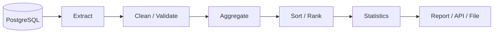

# README

## Overview

The **Sorting, Ranking and Statistics** section covers the Pandas operations used to order data, compare records, calculate descriptive metrics, rank entities, and analyze distributions.

These operations are common after ingestion, cleaning, transformation, joining, and aggregation:

```text
Raw Data
   ↓
Clean / Validate
   ↓
Transform / Combine
   ↓
Sort / Rank / Describe
   ↓
Reports / APIs / ETL Outputs
```

Typical backend and data-engineering use cases include:

- Sorting orders by creation time or revenue.
- Returning highest-value customers.
- Finding top-performing products.
- Calculating transaction statistics.
- Identifying percentile thresholds.
- Comparing business segments.
- Building operational and financial reports.
- Producing deterministic output for APIs and files.

The important engineering concern is not simply knowing individual Pandas methods. It is understanding:

```text
ordering
+
ranking semantics
+
aggregation semantics
+
missing-value behavior
+
data types
+
stability
+
performance
```

These details determine whether a result is merely syntactically valid or operationally correct.

---

## Section Structure

```text
08- Sorting Ranking and Statistics/
│
├── 01- Sort Values.md
├── 02- Sort Index.md
├── 03- Ranking.md
├── 04- Rank.md
├── 05- Descriptive Statistics.md
├── 06- Sum Mean Median.md
├── 07- Min Max.md
├── 08- Count And Nunique.md
├── 09- Value Counts.md
├── 10- Quantiles.md
├── 11- Correlation.md
├── 12- Covariance.md
├── 13- Cumulative Operations.md
└── README.md
```

The section progresses from ordering data toward increasingly analytical operations.

---

## Sorting, Ranking and Statistics Mental Model

The section can be understood as four related capabilities.

### Sorting

Sorting answers:

> In what order should records appear?

Example:

```python
orders.sort_values(
    "revenue",
    ascending=False,
)
```

Typical use cases:

```text
latest events
highest revenue
lowest inventory
alphabetical reports
priority queues
deterministic exports
```

---

### Ranking

Ranking answers:

> Where does each record stand relative to other records?

Example:

```python
orders["revenue_rank"] = (
    orders["revenue"]
    .rank(
        ascending=False,
        method="dense",
    )
)
```

Typical use cases:

```text
top customers
product rankings
leaderboards
priority scoring
relative performance
```

---

### Descriptive Statistics

Statistics answer:

> What does the dataset or a group of records look like?

Examples:

```python
orders["revenue"].mean()
```

```python
orders["revenue"].median()
```

```python
orders["revenue"].quantile(0.95)
```

Typical applications include:

```text
reporting
threshold selection
anomaly detection
capacity planning
operational analysis
```

---

### Cumulative Operations

Cumulative operations answer:

> How does a metric evolve across an ordered sequence?

Examples:

```python
orders["running_revenue"] = (
    orders["revenue"]
    .cumsum()
)
```

This is useful for:

```text
running totals
cumulative counts
progressive balances
time-series reporting
```

Cumulative operations depend heavily on correct sorting.

---

## Sorting Data

The primary method for sorting rows is:

```python
DataFrame.sort_values(...)
```

Example:

```python
orders = orders.sort_values(
    "order_date",
)
```

For descending order:

```python
orders = orders.sort_values(
    "revenue",
    ascending=False,
)
```

Sorting is typically non-mutating unless explicitly assigned back or used with `inplace=True`.

Prefer assignment:

```python
orders = orders.sort_values(
    "revenue",
    ascending=False,
)
```

because it makes data flow explicit.

---

## Sorting Multiple Columns

Production reports frequently need deterministic multi-column ordering:

```python
orders = orders.sort_values(
    [
        "region",
        "revenue",
        "order_date",
    ],
    ascending=[
        True,
        False,
        True,
    ],
)
```

This means:

```text
region      → ascending
revenue     → descending
order_date  → ascending
```

Multi-column sorting is useful when a single sort key does not fully define output order.

---

## Stable Sorting

When records have equal values, the sorting algorithm can affect their relative order.

For deterministic processing, use a stable sorting algorithm when the relative order of equal keys matters:

```python
orders = orders.sort_values(
    "priority",
    kind="stable",
)
```

This is especially useful when:

```text
deduplication
pagination
ranking
latest-record selection
```

depend on preserving the relative ordering established by an earlier operation.

---

## Sorting and Missing Values

Pandas allows control over where missing values appear:

```python
orders.sort_values(
    "revenue",
    na_position="last",
)
```

or:

```python
orders.sort_values(
    "revenue",
    na_position="first",
)
```

This matters in reports and APIs because:

```text
missing
```

does not necessarily mean:

```text
zero
```

Do not fill missing values merely to simplify ordering unless that matches the business semantics.

---

## Sorting Datetime Data

Datetime columns should use actual datetime dtypes:

```python
orders["order_date"] = pd.to_datetime(
    orders["order_date"],
)
```

Then:

```python
orders = orders.sort_values(
    "order_date",
)
```

Avoid sorting datetime strings when chronological behavior is required.

For example:

```text
2026-10-01
2026-09-20
2026-09-30
```

must be represented consistently as datetime values rather than relying on lexical string ordering.

---

## Sorting Numeric Data

Numeric columns should have appropriate numeric dtypes:

```python
orders["revenue"] = pd.to_numeric(
    orders["revenue"],
    errors="coerce",
)
```

Then:

```python
orders = orders.sort_values(
    "revenue",
    ascending=False,
)
```

A column containing:

```text
"100"
"20"
"9"
```

as strings can sort incorrectly:

```text
100
20
9
```

relative to numeric ordering.

Validate dtypes before relying on ordering.

---

## Sorting by Index

For index ordering:

```python
result = df.sort_index()
```

Descending:

```python
result = df.sort_index(
    ascending=False,
)
```

This differs from:

```python
sort_values()
```

because:

```text
sort_values()
    → sorts according to data columns

sort_index()
    → sorts according to index labels
```

Index ordering is especially relevant after:

```text
groupby
set_index
resampling
time-series transformations
```

---

## Ranking

Ranking assigns an ordinal position to values.

Example:

```python
orders["revenue_rank"] = (
    orders["revenue"]
    .rank(
        ascending=False,
    )
)
```

For:

```text
revenue
500
300
100
```

the ranks are:

```text
1
2
3
```

Ranking is different from sorting because ranking adds information to each row while preserving the existing row-level data.

---

## Ranking Versus Sorting

| Requirement | Operation |
| --- | --- |
| Rearrange rows | `sort_values()` |
| Assign relative position | `rank()` |
| Get top N rows | `nlargest()` |
| Get bottom N rows | `nsmallest()` |
| Compare within groups | `groupby().rank()` |

Example:

```python
top_customers = (
    customers
    .nlargest(
        10,
        "lifetime_value",
    )
)
```

This is often preferable to sorting the entire dataset and then taking the first rows.

---

## Ranking Methods

Pandas supports several tie-handling strategies.

| Method | Tie Behavior |
| --- | --- |
| `average` | Average rank of tied values |
| `min` | Lowest rank assigned to ties |
| `max` | Highest rank assigned to ties |
| `first` | Rank based on original order |
| `dense` | Same rank for ties, next rank increments by one |

Example:

```python
series = pd.Series(
    [100, 100, 50]
)

series.rank(
    method="dense",
    ascending=False,
)
```

Produces conceptually:

```text
1
1
2
```

The correct method depends on the business definition of ranking.

---

## Grouped Ranking

For rankings within a business dimension:

```python
orders["region_rank"] = (
    orders
    .groupby("region")["revenue"]
    .rank(
        ascending=False,
        method="dense",
    )
)
```

This answers:

> What is the revenue rank of each order within its region?

Similarly, product ranking can be calculated within categories:

```python
products["category_rank"] = (
    products
    .groupby("category")["revenue"]
    .rank(
        ascending=False,
        method="dense",
    )
)
```

This is a common bridge between grouping and ranking.

---

## Descriptive Statistics

Pandas provides common statistical methods directly on Series and DataFrames:

```python
orders["revenue"].mean()
orders["revenue"].median()
orders["revenue"].min()
orders["revenue"].max()
orders["revenue"].sum()
orders["revenue"].count()
orders["revenue"].nunique()
```

For multiple columns:

```python
orders[
    [
        "revenue",
        "discount",
    ]
].describe()
```

Statistics are useful for:

```text
data profiling
monitoring
reporting
anomaly detection
```

---

## `describe()`

A common inspection operation is:

```python
orders[
    [
        "revenue",
        "discount",
    ]
].describe()
```

For numeric columns, the result commonly includes:

```text
count
mean
std
min
25%
50%
75%
max
```

This gives a compact view of distribution and scale.

It should be treated as an inspection tool rather than a complete data-quality check.

---

## Count Versus Size

The difference between counting rows and counting non-null values matters.

For a Series:

```python
orders["revenue"].count()
```

counts non-null values.

For grouped rows:

```python
orders.groupby(
    "customer_id"
).size()
```

counts rows, including rows where the measured column is null.

This distinction is important when designing reporting metrics.

---

## `nunique()`

Unique-value counts are useful for business and data-quality analysis:

```python
orders["customer_id"].nunique()
```

Grouped:

```python
orders.groupby(
    "region"
)["customer_id"].nunique()
```

Examples:

```text
unique customers
unique products
unique services
unique accounts
```

For identifiers, `nunique()` can be more meaningful than raw row counts.

---

## Missing Values and Statistics

Most numerical aggregation behavior excludes missing values by default.

For example:

```python
orders["revenue"].mean()
```

typically ignores missing values.

Use explicit checks when data completeness matters:

```python
revenue_missing_rate = (
    orders["revenue"].isna().mean()
)
```

A metric calculated from 98% complete data should not necessarily be treated the same as one calculated from 40% complete data.

Production reports should monitor completeness separately from the metric itself.

---

## Sum, Mean and Median

### Sum

```python
total_revenue = orders[
    "revenue"
].sum()
```

Useful for additive metrics.

### Mean

```python
average_order_value = orders[
    "revenue"
].mean()
```

Sensitive to outliers.

### Median

```python
median_order_value = orders[
    "revenue"
].median()
```

More robust against highly skewed distributions.

Use the metric whose semantics match the business question rather than choosing one by habit.

---

## Min and Max

Use:

```python
minimum = orders[
    "revenue"
].min()

maximum = orders[
    "revenue"
].max()
```

These are useful for:

```text
range checks
anomaly detection
threshold analysis
operational monitoring
```

Example:

```python
if orders["amount"].max() > 1_000_000:
    raise ValueError(
        "Transaction amount exceeds configured limit."
    )
```

Maximum values can therefore be used as data-quality guards.

---

## Quantiles

Quantiles identify distribution thresholds.

For the 95th percentile:

```python
p95 = orders[
    "response_time_ms"
].quantile(0.95)
```

For multiple percentiles:

```python
quantiles = orders[
    "response_time_ms"
].quantile(
    [
        0.50,
        0.90,
        0.95,
        0.99,
    ]
)
```

Quantiles are useful for:

```text
latency analysis
customer value segmentation
outlier thresholds
capacity planning
```

Percentile terminology should be used consistently with the metric definition.

---

## Correlation

Correlation measures the relationship between numerical variables.

Example:

```python
orders[
    [
        "discount",
        "revenue",
    ]
].corr()
```

Or:

```python
correlation = orders[
    "discount"
].corr(
    orders["revenue"]
)
```

A high correlation does not establish causation.

In production reporting, correlation should be treated as an analytical signal rather than a causal conclusion.

---

## Covariance

Covariance measures how two numerical variables vary together.

```python
covariance = orders[
    "discount"
].cov(
    orders["revenue"]
)
```

Compared with correlation:

```text
covariance
    → scale-dependent

correlation
    → normalized
```

Covariance is more sensitive to units and magnitude.

---

## Cumulative Operations

Cumulative calculations depend on row ordering.

For running revenue:

```python
orders = orders.sort_values(
    "order_date",
)

orders["running_revenue"] = (
    orders["revenue"]
    .cumsum()
)
```

The sequence is:

```text
sort by time
    ↓
calculate cumulative metric
```

Doing `cumsum()` before sorting can produce a logically incorrect result while still returning valid Pandas output.

---

## Common Cumulative Operations

| Operation | Example | Meaning |
| --- | --- | --- |
| `cumsum()` | `s.cumsum()` | Running total |
| `cumcount()` | `groupby(...).cumcount()` | Running row number |
| `cummax()` | `s.cummax()` | Running maximum |
| `cummin()` | `s.cummin()` | Running minimum |
| `cumprod()` | `s.cumprod()` | Running product |

Grouped cumulative operations are particularly useful for event and time-series pipelines.

---

## Grouped Cumulative Calculations

Example:

```python
orders = orders.sort_values(
    [
        "customer_id",
        "order_date",
    ]
)

orders["customer_running_revenue"] = (
    orders
    .groupby("customer_id")["revenue"]
    .cumsum()
)
```

Now the cumulative metric resets for each customer.

This is a useful pattern for:

```text
customer lifetime progress
account balances
cumulative usage
running spend
```

The grouping key and ordering key must both be correct.

---

## Top-N and Bottom-N Operations

For efficient top-N selection:

```python
top_orders = orders.nlargest(
    10,
    "revenue",
)
```

Bottom N:

```python
lowest_orders = orders.nsmallest(
    10,
    "revenue",
)
```

This often communicates intent better than:

```python
orders.sort_values(
    "revenue",
    ascending=False,
).head(10)
```

For small datasets the performance difference may not matter; for larger datasets, avoid unnecessary full sorting when only a small extreme subset is required.

---

## Sorting for API Responses

A FastAPI endpoint may return the highest-value orders:

```python
top_orders = (
    orders
    .nlargest(
        20,
        "revenue",
    )
    .reset_index(drop=True)
)
```

Convert to API records:

```python
payload = top_orders.to_dict(
    orient="records"
)
```

For stable API pagination, define a deterministic secondary key when values can tie.

For example:

```python
top_orders = (
    orders
    .sort_values(
        [
            "revenue",
            "order_id",
        ],
        ascending=[
            False,
            True,
        ],
        kind="stable",
    )
    .head(20)
)
```

---

## Deterministic Ordering

Sorting only by:

```python
"revenue"
```

does not fully determine the order when multiple records have equal revenue.

For reproducible reports and APIs:

```python
orders = orders.sort_values(
    [
        "revenue",
        "order_id",
    ],
    ascending=[
        False,
        True,
    ],
    kind="stable",
)
```

This is important for:

```text
pagination
snapshot comparisons
tests
exports
cache keys
reproducible reports
```

---

## Pagination and Sorting

Never paginate a dataset without a well-defined ordering.

Bad:

```python
page = orders.iloc[
    0:100
]
```

when the input order is not guaranteed.

Better:

```python
ordered_orders = orders.sort_values(
    [
        "created_at",
        "order_id",
    ],
    ascending=[
        False,
        False,
    ],
    kind="stable",
)

page = ordered_orders.iloc[
    offset:offset + page_size
]
```

For very large APIs, database-side ordering and keyset pagination are usually preferable to loading the entire dataset into Pandas.

---

## SQL Ordering

Pandas:

```python
orders.sort_values(
    "revenue",
    ascending=False,
)
```

SQL:

```sql
SELECT
    order_id,
    customer_id,
    revenue
FROM orders
ORDER BY
    revenue DESC,
    order_id ASC;
```

For large database-backed datasets, let PostgreSQL handle filtering and ordering when practical.

The application should not necessarily fetch millions of rows just to sort them in memory.

---

## Backend Reporting Workflow

A typical reporting pipeline may use:



For example:

```text
database
    ↓
filter reporting period
    ↓
group orders
    ↓
calculate revenue
    ↓
rank customers
    ↓
sort by revenue
    ↓
write Parquet / CSV / API response
```

This is a common Pandas role in backend-oriented analytics workflows.

---

## Performance Considerations

Sorting is generally more expensive than simple filtering.

For large DataFrames:

```text
filter early
    ↓
project required columns
    ↓
sort only required data
```

Example:

```python
filtered = orders.loc[
    orders["status"].eq("completed"),
    [
        "order_id",
        "customer_id",
        "revenue",
    ],
]

result = filtered.sort_values(
    "revenue",
    ascending=False,
)
```

Avoid sorting rows or columns that are not needed downstream.

---

## Avoid Full Sorts for Small Extreme Sets

Instead of:

```python
result = (
    orders
    .sort_values(
        "revenue",
        ascending=False,
    )
    .head(10)
)
```

consider:

```python
result = orders.nlargest(
    10,
    "revenue",
)
```

when the requirement is specifically top-N selection.

This avoids expressing a full ordering requirement when only the extremes are needed.

---

## Memory Considerations

Sorting and ranking may require temporary memory proportional to the size of the working dataset.

Reduce width before expensive operations:

```python
working = orders[
    [
        "order_id",
        "revenue",
    ]
]
```

Also reduce row count early:

```python
working = working.loc[
    working["revenue"].notna()
]
```

when missing values cannot participate in the operation.

Measure memory when processing large batches.

---

## Data Types and Statistical Correctness

Statistical operations depend on appropriate dtypes.

For financial values:

```python
orders["revenue"] = pd.to_numeric(
    orders["revenue"],
    errors="coerce",
)
```

For timestamps:

```python
orders["created_at"] = pd.to_datetime(
    orders["created_at"],
)
```

For categorical dimensions:

```python
orders["region"] = orders[
    "region"
].astype("category")
```

Efficient dtypes can reduce memory usage, while correct dtypes prevent invalid statistical and sorting behavior.

---

## Outliers and Statistics

Statistics can be heavily affected by outliers.

For example:

```python
mean_revenue = orders[
    "revenue"
].mean()

median_revenue = orders[
    "revenue"
].median()
```

If a small number of extremely large orders exist:

```text
mean
    may increase significantly

median
    may remain relatively stable
```

This does not make either metric universally better.

Choose based on the intended business interpretation.

---

## Data Quality Checks Using Statistics

Statistical operations can support automated validation.

Example:

```python
p99 = orders[
    "response_time_ms"
].quantile(0.99)

if p99 > 5_000:
    raise ValueError(
        "P99 response time exceeds threshold."
    )
```

Another example:

```python
if orders[
    "revenue"
].min() < 0:
    raise ValueError(
        "Revenue contains invalid negative values."
    )
```

The statistical computation becomes part of the pipeline's quality contract.

---

## Missing and Empty Datasets

Always define behavior for empty input.

Example:

```python
empty_orders = orders.iloc[0:0].copy()

top_orders = empty_orders.nlargest(
    10,
    "revenue",
)
```

The result remains empty.

For statistics:

```python
empty_orders["revenue"].mean()
```

does not provide a normal business metric.

A reporting pipeline should distinguish:

```text
no records
```

from:

```text
zero-valued metric
```

Do not silently transform an empty population into a false zero.

---

## Common Mistakes

### Sorting Strings as Numbers

Incorrect:

```python
orders.sort_values(
    "revenue"
)
```

when `revenue` is textual.

Convert first:

```python
orders["revenue"] = pd.to_numeric(
    orders["revenue"],
    errors="coerce",
)
```

---

### Ranking Without Defining Tie Semantics

Choosing:

```python
method="average"
```

versus:

```python
method="dense"
```

can change business results.

Define how ties should behave.

---

### Calculating Cumulative Metrics Before Sorting

Incorrect:

```python
orders["running_revenue"] = (
    orders["revenue"]
    .cumsum()
)
```

when the rows are not chronologically ordered.

Correct:

```python
orders = orders.sort_values(
    "order_date"
)

orders["running_revenue"] = (
    orders["revenue"]
    .cumsum()
)
```

---

### Assuming `count()` Counts Rows

`count()` usually excludes null values.

Use:

```python
len(df)
```

or:

```python
groupby().size()
```

when row counts are required.

---

### Treating Correlation as Causation

Correlation can indicate association but does not establish a causal relationship.

Use it as an analytical signal, not proof of business causality.

---

### Sorting the Entire Dataset for Top-N

Prefer:

```python
df.nlargest(
    10,
    "revenue",
)
```

when only the largest ten values are required.

---

## Production Pitfalls

### Unstable Pagination

Sorting only on a non-unique column can cause inconsistent page boundaries.

Use a deterministic secondary key:

```python
orders.sort_values(
    [
        "created_at",
        "order_id",
    ],
    ascending=[
        False,
        False,
    ],
)
```

For high-volume APIs, prefer database-side keyset pagination.

---

### Incorrect Aggregates After Joins

If a join multiplies rows, metrics such as:

```text
sum
mean
count
```

can become incorrect.

Validate merge cardinality before sorting or statistical analysis.

---

### Statistics on Dirty Data

A mean computed from:

```text
invalid values
nulls
wrong units
duplicate records
```

is still a valid Python result but may be a meaningless business metric.

Clean and validate data before statistical analysis.

---

### Large In-Memory Sorts

Sorting millions of rows in a Kubernetes or Celery worker can create:

```text
high memory usage
long execution time
worker contention
OOM kills
```

Push large sorting and aggregation operations into PostgreSQL or another appropriate processing engine when practical.

---

## Security Considerations

Sorting and ranking can accidentally expose sensitive information.

For example, ranking employees by a confidential compensation field may create data exposure if the resulting DataFrame is later returned through an API.

Project only authorized fields:

```python
report = employees[
    [
        "employee_id",
        "department",
        "performance_score",
    ]
]
```

Apply authorization before producing user-specific reports or rankings.

For multi-tenant systems, ensure the dataset is scoped to the requesting tenant before ranking or aggregation.

---

## Reliability and Reproducibility

Reports should be reproducible when the same input snapshot is processed.

Use:

```text
explicit filters
+
explicit ordering
+
stable tie-breaking
+
documented aggregation rules
```

Example:

```python
report = (
    orders.loc[
        orders["status"].eq("completed")
    ]
    .groupby(
        "customer_id",
        as_index=False,
    )
    .agg(
        total_revenue=(
            "revenue",
            "sum",
        ),
    )
    .sort_values(
        [
            "total_revenue",
            "customer_id",
        ],
        ascending=[
            False,
            True,
        ],
        kind="stable",
    )
)
```

This is significantly easier to reproduce than relying on incidental row ordering.

---

## Testing Sorting and Statistics

Test both the values and ordering when ordering is part of the contract.

Example:

```python
def test_orders_are_sorted_by_revenue() -> None:
    orders = pd.DataFrame(
        {
            "order_id": [1, 2, 3],
            "revenue": [100.0, 300.0, 200.0],
        }
    )

    result = orders.sort_values(
        "revenue",
        ascending=False,
    )

    assert result[
        "order_id"
    ].tolist() == [2, 3, 1]
```

For statistics:

```python
def test_revenue_statistics() -> None:
    revenue = pd.Series(
        [100.0, 200.0, 300.0]
    )

    assert revenue.sum() == 600.0
    assert revenue.mean() == 200.0
    assert revenue.median() == 200.0
```

Tests should focus on business behavior rather than only method execution.

---

## Testing Tie Behavior

Ranking tests should explicitly cover ties:

```python
def test_dense_ranking_handles_ties() -> None:
    revenue = pd.Series(
        [300.0, 300.0, 100.0]
    )

    result = revenue.rank(
        ascending=False,
        method="dense",
    )

    assert result.tolist() == [
        1.0,
        1.0,
        2.0,
    ]
```

This prevents future changes from silently altering ranking semantics.

---

## Monitoring

Useful production metrics include:

```text
input_row_count
filtered_row_count
output_row_count
missing_metric_rate
top_n_processing_duration
sort_duration_ms
rank_duration_ms
statistical_calculation_duration_ms
memory_usage_bytes
```

For reports, monitor distribution metrics such as:

```text
mean
median
p95
p99
min
max
unique_count
null_rate
```

Unexpected shifts can indicate upstream data problems.

---

## Production Data Flow

A robust reporting workflow can use:

```mermaid
flowchart LR
    Source[(Database / API / Files)] --> Ingest[Ingest]
    Ingest --> Validate[Validate Schema and Data Quality]
    Validate --> Filter[Filter Required Population]
    Filter --> Project[Project Required Columns]
    Project --> Aggregate[Aggregate if Required]
    Aggregate --> Sort[Sort / Rank]
    Sort --> Stats[Calculate Statistics]
    Stats --> Verify[Validate Output]
    Verify --> Publish[Publish Report / API / Parquet]
```



The ordering of stages matters.

For example:

```text
filter
→ aggregate
→ rank
```

can produce very different results from:

```text
rank
→ filter
→ aggregate
```

Always define the intended grain and business semantics first.

---

## Recommended Production Pattern

For a customer performance report:

```python
customer_report = (
    orders.loc[
        orders["status"].eq("completed"),
        [
            "customer_id",
            "revenue",
            "order_date",
        ],
    ]
    .groupby(
        "customer_id",
        as_index=False,
    )
    .agg(
        total_revenue=(
            "revenue",
            "sum",
        ),
        order_count=(
            "revenue",
            "size",
        ),
        average_order_value=(
            "revenue",
            "mean",
        ),
    )
)

customer_report["revenue_rank"] = (
    customer_report["total_revenue"]
    .rank(
        ascending=False,
        method="dense",
    )
)

customer_report = (
    customer_report
    .sort_values(
        [
            "total_revenue",
            "customer_id",
        ],
        ascending=[
            False,
            True,
        ],
        kind="stable",
    )
    .reset_index(drop=True)
)
```

The workflow is:

```text
filter
    ↓
aggregate
    ↓
calculate statistics
    ↓
rank
    ↓
sort deterministically
    ↓
publish
```

This is a common reporting pattern because each stage operates at a clearly defined grain.

---

## SQL and Pandas Decision Guide

| Requirement | Prefer Pandas When | Prefer SQL When |
| --- | --- | --- |
| Sort a small in-memory result | DataFrame already loaded | Usually unnecessary |
| Rank a small report | DataFrame already loaded | Large database result |
| Calculate descriptive metrics | Complex Python-side workflow | Data already in database |
| Top-N on millions of database rows | Usually avoid | `ORDER BY ... LIMIT` |
| Group and aggregate large tables | Usually avoid raw-table processing | Database-side aggregation |
| Exploratory statistics | Yes | Not necessarily |
| API response transformation | Yes | Not applicable |
| Final reporting presentation | Yes | Maybe |
| Very large time-series data | Consider specialized engine | Often preferable |

The general principle is:

> Process data as close as practical to the system that already owns and can efficiently operate on it.

---

## Interview Perspective

A strong understanding of this section includes more than knowing method names.

Be able to explain:

```text
sort_values()
    vs
sort_index()
```

```text
sort
    vs
rank
```

```text
count()
    vs
size()
    vs
nunique()
```

```text
mean()
    vs
median()
```

```text
full sort
    vs
nlargest()
```

and:

```text
statistical result
    vs
data-quality evidence
```

You should also recognize that:

```text
join cardinality
→ affects row count
→ affects aggregates
→ affects rankings
→ affects statistics
```

Therefore, sorting and statistical correctness depend on the integrity of earlier transformations.

---

## Key Takeaways

- Sorting, ranking, and statistical operations should be driven by explicit data grain, dtype, missing-value semantics, and business definitions rather than by method familiarity.
- Use deterministic multi-column sorting and stable tie-breaking when results feed APIs, pagination, exports, tests, or reproducible reports.
- Ranking requires explicit tie semantics, while cumulative operations require correct ordering before calculation.
- Statistical functions such as `mean`, `median`, `quantile`, `count`, and `nunique` have different null and business semantics; validate data quality before interpreting their results.
- For large database-backed datasets, push filtering, sorting, aggregation, and top-N operations into PostgreSQL or another scalable engine when practical instead of materializing unnecessarily large Pandas workloads.