# README

## Overview

The **Sorting, Ranking and Statistics** section covers the Pandas operations used to order records, assign relative positions, calculate descriptive metrics, analyze distributions, and derive cumulative measurements.

These operations commonly appear after:

```text
ingestion
    ↓
cleaning
    ↓
transformation
    ↓
combining
    ↓
sorting / ranking / statistics
    ↓
reporting / APIs / exports
```

Typical backend and data-engineering workflows include:

- Sorting orders by creation time or revenue.
- Ranking customers or products by performance.
- Calculating transaction totals and averages.
- Measuring latency percentiles.
- Identifying minimum and maximum operational values.
- Counting distinct users or transactions.
- Building cumulative usage and revenue metrics.
- Comparing data distributions across systems.

The section emphasizes a practical principle:

> Statistical and ordering operations are only meaningful when the dataset's grain, dtypes, filtering rules, missing-value behavior, and ordering semantics are correct.

A valid Pandas result is not automatically a valid business result.

---

## Section Structure

```text
08- Sorting Ranking and Statistics/
│
├── 01- Sort Values.md
├── 02- Sort Index.md
├── 03- Ranking.md
├── 04- Rank.md
├── 05- Descriptive Statistics.md
├── 06- Sum Mean Median.md
├── 07- Min Max.md
├── 08- Count And Nunique.md
├── 09- Value Counts.md
├── 10- Quantiles.md
├── 11- Correlation.md
├── 12- Covariance.md
├── 13- Cumulative Operations.md
└── README.md
```

The learning flow moves from basic row ordering toward more advanced statistical and cumulative analysis.

---

## Core Mental Model

The section can be divided into four capabilities.

### Sorting

Sorting answers:

> In what order should records appear?

Example:

```python
orders = orders.sort_values(
    "revenue",
    ascending=False,
)
```

Common uses:

```text
latest records
highest-value records
lowest inventory
priority queues
deterministic exports
API result ordering
```

---

### Ranking

Ranking answers:

> What is the relative position of each record?

Example:

```python
orders["revenue_rank"] = (
    orders["revenue"]
    .rank(
        ascending=False,
        method="dense",
    )
)
```

Common uses:

```text
top customers
product rankings
leaderboards
regional rankings
performance comparisons
```

---

### Statistics

Statistics answer:

> What characteristics describe the dataset or its distribution?

Examples:

```python
orders["revenue"].mean()
```

```python
orders["revenue"].median()
```

```python
orders["revenue"].quantile(0.95)
```

These operations support:

```text
reporting
monitoring
capacity planning
anomaly detection
threshold design
data profiling
```

---

### Cumulative Operations

Cumulative operations answer:

> How does a metric evolve over an ordered sequence?

Example:

```python
orders["running_revenue"] = (
    orders["revenue"]
    .cumsum()
)
```

These calculations depend on a correctly ordered DataFrame.

---

## Why Ordering Matters

Many Pandas operations are order-sensitive.

For example:

```python
orders["running_revenue"] = (
    orders["revenue"]
    .cumsum()
)
```

is only meaningful when `orders` is already ordered according to the intended business sequence.

For time-series data:

```python
orders = orders.sort_values(
    "order_date",
)

orders["running_revenue"] = (
    orders["revenue"]
    .cumsum()
)
```

The correct data flow is:

```text
define ordering
    ↓
sort
    ↓
calculate cumulative or positional metric
```

Skipping the ordering step can produce plausible but incorrect results.

---

## Sorting Data

Use `sort_values()` to order by data columns:

```python
result = orders.sort_values(
    "revenue",
    ascending=False,
)
```

For multiple columns:

```python
result = orders.sort_values(
    [
        "region",
        "revenue",
        "order_date",
    ],
    ascending=[
        True,
        False,
        True,
    ],
)
```

Sorting should be treated as an explicit transformation rather than an incidental formatting operation.

---

## Sorting by Index

Use:

```python
result = df.sort_index()
```

This differs from:

```python
df.sort_values(...)
```

because:

```text
sort_values()
    → orders by column values

sort_index()
    → orders by index labels
```

Index ordering becomes important after operations such as:

```text
set_index()
groupby()
resampling
time-series indexing
index-based joins
```

---

## Ranking

Use:

```python
series.rank()
```

or:

```python
df["metric"].rank(...)
```

Example:

```python
customers["revenue_rank"] = (
    customers["revenue"]
    .rank(
        ascending=False,
        method="dense",
    )
)
```

Ranking preserves row-level records while adding relative-position information.

This differs from sorting, which changes the row order.

---

## Ranking Within Groups

For group-relative rankings:

```python
products["category_rank"] = (
    products
    .groupby("category")["revenue"]
    .rank(
        ascending=False,
        method="dense",
    )
)
```

This answers:

```text
How does this product rank within its category?
```

The same approach works for:

```text
region
department
tenant
customer segment
service
```

---

## Tie Handling

Ranking requires an explicit tie policy.

Pandas supports:

| Method | Tie Behavior |
| --- | --- |
| `average` | Average of tied positions |
| `min` | Lowest rank of the tied group |
| `max` | Highest rank of the tied group |
| `first` | Rank based on existing order |
| `dense` | Same rank for ties; next rank increments by one |

Example:

```python
revenue = pd.Series(
    [500.0, 500.0, 300.0]
)

ranked = revenue.rank(
    ascending=False,
    method="dense",
)
```

Conceptually:

```text
500 → 1
500 → 1
300 → 2
```

The business definition should determine the method.

---

## Statistics and Missing Values

Pandas statistical aggregations generally skip missing values.

For example:

```python
average = orders[
    "revenue"
].mean()
```

does not normally treat a missing value as zero.

Measure data completeness separately:

```python
missing_rate = (
    orders["revenue"]
    .isna()
    .mean()
)
```

This allows a report to distinguish:

```text
metric = 250.0
data completeness = 99.5%
```

from:

```text
metric = 250.0
data completeness = 45.0%
```

The same numerical result can have very different reliability.

---

## Count and Distinct Count

Use:

```python
orders["revenue"].count()
```

for non-null value counts.

Use:

```python
orders["customer_id"].nunique()
```

for distinct customer count.

For row counts:

```python
len(orders)
```

or:

```python
orders.shape[0]
```

For grouped row counts:

```python
orders.groupby(
    "customer_id"
).size()
```

These are not interchangeable.

---

## Sum, Mean and Median

For additive metrics:

```python
total_revenue = orders[
    "revenue"
].sum()
```

For average values:

```python
average_order_value = orders[
    "revenue"
].mean()
```

For skewed distributions:

```python
median_order_value = orders[
    "revenue"
].median()
```

Choose the measure based on the business question.

For example:

```text
sum
    → total financial amount

mean
    → arithmetic average

median
    → central value less sensitive to extreme observations
```

---

## Min and Max

Use:

```python
minimum = orders[
    "revenue"
].min()

maximum = orders[
    "revenue"
].max()
```

These are useful for:

```text
data-quality checks
threshold validation
range analysis
anomaly detection
operational monitoring
```

Example:

```python
if orders["amount"].min() < 0:
    raise ValueError(
        "Transaction amount cannot be negative."
    )
```

---

## Descriptive Statistics

Use:

```python
stats = orders[
    [
        "revenue",
        "discount",
    ]
].describe()
```

For numeric columns, this commonly provides:

```text
count
mean
std
min
25%
50%
75%
max
```

`describe()` is useful for profiling but should not replace explicit data-quality rules.

For example:

```text
minimum >= 0
null rate <= threshold
maximum <= business limit
```

are clearer than relying only on statistical summaries.

---

## Quantiles

Quantiles describe distribution thresholds.

Example:

```python
p95 = orders[
    "response_time_ms"
].quantile(0.95)
```

Multiple quantiles:

```python
latency_quantiles = orders[
    "response_time_ms"
].quantile(
    [
        0.50,
        0.90,
        0.95,
        0.99,
    ]
)
```

Common uses:

```text
API latency
customer spend
transaction value
capacity planning
outlier analysis
service-level reporting
```

---

## Correlation

Correlation measures linear association between numerical variables.

Example:

```python
correlation = orders[
    "discount"
].corr(
    orders["revenue"]
)
```

Or:

```python
matrix = orders[
    [
        "discount",
        "revenue",
        "quantity",
    ]
].corr()
```

Interpret correlation carefully.

A strong correlation does not prove:

```text
causation
```

and can be distorted by:

```text
outliers
missing data
nonlinear relationships
confounding variables
```

---

## Covariance

Covariance measures whether two variables tend to increase or decrease together.

```python
covariance = orders[
    "discount"
].cov(
    orders["revenue"]
)
```

Compared with correlation:

| Property | Covariance | Correlation |
| --- | --- | --- |
| Scale-dependent | Yes | No |
| Unit-sensitive | Yes | No |
| Normalized | No | Yes |
| Typical value range | Not fixed | `-1` to `1` |

For most operational reporting, correlation is easier to interpret.

---

## Cumulative Operations

Pandas supports cumulative calculations such as:

```python
series.cumsum()
series.cumprod()
series.cummin()
series.cummax()
```

Example:

```python
orders = orders.sort_values(
    "order_date",
)

orders["running_revenue"] = (
    orders["revenue"]
    .cumsum()
)
```

Cumulative operations are particularly useful for:

```text
running totals
progress tracking
account balances
cumulative usage
time-series metrics
```

---

## Grouped Cumulative Operations

For customer-level running totals:

```python
orders = orders.sort_values(
    [
        "customer_id",
        "order_date",
    ]
)

orders["customer_running_revenue"] = (
    orders
    .groupby("customer_id")["revenue"]
    .cumsum()
)
```

This produces independent cumulative sequences for each customer.

The ordering requirement remains critical.

---

## Top-N Selection

For small extreme subsets:

```python
top_customers = customers.nlargest(
    10,
    "lifetime_value",
)
```

For bottom values:

```python
lowest_customers = customers.nsmallest(
    10,
    "lifetime_value",
)
```

This can be preferable to:

```python
customers.sort_values(
    "lifetime_value",
    ascending=False,
).head(10)
```

when only the top ten values are needed.

---

## Deterministic Ordering

Sorting by a non-unique column does not fully define the order.

For reproducible output:

```python
result = customers.sort_values(
    [
        "lifetime_value",
        "customer_id",
    ],
    ascending=[
        False,
        True,
    ],
    kind="stable",
)
```

This matters for:

```text
API pagination
exports
snapshot comparison
tests
cache keys
reproducible reports
```

A deterministic secondary key prevents equal-valued records from changing relative positions unexpectedly.

---

## Sorting and API Pagination

A backend endpoint should not rely on incidental DataFrame ordering.

Instead:

```python
ordered = orders.sort_values(
    [
        "created_at",
        "order_id",
    ],
    ascending=[
        False,
        False,
    ],
    kind="stable",
)
```

Then paginate the ordered data.

For very large datasets, prefer PostgreSQL-side ordering and keyset pagination rather than loading the entire dataset into Pandas.

---

## Sorting and Reporting

A common customer-report pipeline is:

```python
report = (
    orders
    .groupby(
        "customer_id",
        as_index=False,
    )
    .agg(
        total_revenue=(
            "revenue",
            "sum",
        ),
        order_count=(
            "order_id",
            "nunique",
        ),
    )
    .sort_values(
        [
            "total_revenue",
            "customer_id",
        ],
        ascending=[
            False,
            True,
        ],
        kind="stable",
    )
)
```

This creates a deterministic report:

```text
aggregate
    ↓
sort
    ↓
publish
```

The ordering happens after aggregation because the ranking criterion is the aggregated value.

---

## Data Flow Through the Section

```mermaid
flowchart LR
    Source[Database / API / Files] --> Ingest[Ingest]
    Ingest --> Validate[Validate Schema and Data Quality]
    Validate --> Filter[Filter Required Population]
    Filter --> Combine[Join / Aggregate]
    Combine --> Sort[Sort]
    Sort --> Rank[Rank if Required]
    Rank --> Stats[Calculate Statistics]
    Stats --> Verify[Validate Output]
    Verify --> Publish[API / Report / Parquet / CSV]
```



The correct sequence depends on the business question.

For example:

```text
aggregate → rank
```

answers a different question from:

```text
rank → aggregate
```

Pipeline ordering is therefore part of business correctness.

---

## SQL Relationship

Many operations in this section have direct SQL equivalents.

| Pandas | SQL |
| --- | --- |
| `sort_values()` | `ORDER BY` |
| `sum()` | `SUM()` |
| `mean()` | `AVG()` |
| `median()` | `PERCENTILE_CONT()` or equivalent |
| `count()` | `COUNT()` |
| `nunique()` | `COUNT(DISTINCT ...)` |
| `min()` | `MIN()` |
| `max()` | `MAX()` |
| `rank()` | Window ranking functions |
| `quantile()` | Percentile functions |
| `cumsum()` | Window `SUM() OVER (...)` |

Example:

```python
orders.sort_values(
    "revenue",
    ascending=False,
)
```

is conceptually:

```sql
SELECT
    order_id,
    customer_id,
    revenue
FROM orders
ORDER BY
    revenue DESC;
```

---

## Database Pushdown

When data already resides in PostgreSQL, expensive operations can often be performed there:

```sql
SELECT
    customer_id,
    SUM(revenue) AS total_revenue
FROM orders
WHERE status = 'completed'
GROUP BY customer_id
ORDER BY
    total_revenue DESC,
    customer_id ASC;
```

Then Pandas processes the smaller result.

This can reduce:

```text
network transfer
Pandas memory usage
CPU pressure
job duration
```

Database-side execution is usually preferable when the database already owns the large source dataset and can perform the operation efficiently.

---

## Performance Considerations

Sorting, ranking, and statistical operations operate over the data that reaches Pandas.

Reduce the working set first:

```text
filter
    ↓
project columns
    ↓
aggregate if possible
    ↓
sort / rank / statistics
```

Example:

```python
working = orders.loc[
    orders["status"].eq("completed"),
    [
        "customer_id",
        "revenue",
    ],
]
```

Then:

```python
report = (
    working
    .groupby(
        "customer_id",
        as_index=False,
    )
    .agg(
        revenue=(
            "revenue",
            "sum",
        )
    )
    .sort_values(
        "revenue",
        ascending=False,
    )
)
```

Avoid expensive operations on unused columns or irrelevant records.

---

## Memory Considerations

Sorting and analytical operations may require temporary memory.

Limit DataFrame width:

```python
working = orders[
    [
        "order_id",
        "revenue",
    ]
]
```

Use efficient dtypes where appropriate:

```python
orders["region"] = orders[
    "region"
].astype("category")
```

Measure memory for large workloads:

```python
memory_bytes = (
    working.memory_usage(
        deep=True
    )
    .sum()
)
```

Unexpected row multiplication from earlier joins can dominate memory consumption, so combining-data correctness should be established before statistical processing.

---

## Dtypes and Correct Results

Sorting and statistical operations depend on correct dtypes.

For numeric values:

```python
orders["revenue"] = pd.to_numeric(
    orders["revenue"],
    errors="coerce",
)
```

For timestamps:

```python
orders["created_at"] = pd.to_datetime(
    orders["created_at"],
)
```

For textual identifiers:

```python
orders["customer_id"] = (
    orders["customer_id"]
    .astype("string")
)
```

Incorrect dtypes can lead to:

```text
incorrect ordering
invalid aggregation
unexpected nulls
memory inefficiency
```

---

## Empty Inputs

Empty datasets should have defined behavior.

Example:

```python
empty_orders = orders.iloc[0:0].copy()

top_orders = empty_orders.nlargest(
    10,
    "revenue",
)
```

The result is empty.

For statistics:

```python
mean = empty_orders[
    "revenue"
].mean()
```

does not represent a real business average.

Distinguish:

```text
no observations
```

from:

```text
metric = 0
```

A production reporting system should not invent zeros for missing populations unless explicitly defined.

---

## Invalid Values

Statistical results can be technically valid while operationally wrong.

Example:

```text
revenue = -500
quantity = -10
latency = -20
```

should be validated before statistical analysis.

Example:

```python
invalid_revenue = orders.loc[
    orders["revenue"].lt(0)
]

if not invalid_revenue.empty:
    raise ValueError(
        "Negative revenue values detected."
    )
```

Data-quality checks should precede business reporting.

---

## Missing Values and Ranking

Ranking with missing values requires deliberate handling.

Example:

```python
customers["rank"] = (
    customers["revenue"]
    .rank(
        ascending=False,
        method="dense",
    )
)
```

If revenue is missing, the rank is typically missing rather than treating it as a meaningful numeric value.

Do not automatically convert null revenue to zero unless:

```text
null revenue
=
zero revenue
```

is an explicit business rule.

---

## Statistical Checks as Data-Quality Rules

The operations in this section can become validation checks.

Example:

```python
p99 = events[
    "latency_ms"
].quantile(0.99)

if p99 > 5_000:
    raise ValueError(
        "P99 latency exceeds threshold."
    )
```

Another:

```python
if transactions[
    "amount"
].max() > 1_000_000:
    raise ValueError(
        "Transaction amount exceeds limit."
    )
```

The distinction between:

```text
analytics
```

and:

```text
automated validation
```

is the surrounding business contract.

---

## Monitoring

Useful production metrics include:

```text
input_row_count
filtered_row_count
output_row_count
null_rate
unique_key_count
sort_duration_ms
rank_duration_ms
aggregation_duration_ms
result_memory_bytes
p50
p95
p99
min
max
```

Monitor changes over time.

For example:

```text
customer count
1,000,000
1,002,000
1,004,000
1,250,000
```

may indicate an ingestion issue before downstream reports obviously fail.

---

## Reliability and Reproducibility

Reports should be reproducible from the same input snapshot.

Use:

```text
explicit filters
+
explicit aggregation
+
explicit ordering
+
stable tie-breaking
+
documented null semantics
```

Example:

```python
report = (
    orders
    .loc[
        orders["status"].eq("completed")
    ]
    .groupby(
        "customer_id",
        as_index=False,
    )
    .agg(
        total_revenue=(
            "revenue",
            "sum",
        ),
    )
    .sort_values(
        [
            "total_revenue",
            "customer_id",
        ],
        ascending=[
            False,
            True,
        ],
        kind="stable",
    )
)
```

This is preferable to relying on incidental input ordering.

---

## Security Considerations

Sorting and ranking can expose sensitive information if performed before authorization filtering.

For example:

```text
tenant A data
+
tenant B data
    ↓
global ranking
```

may reveal information across tenant boundaries.

Scope the data before calculating rankings:

```python
tenant_orders = orders.loc[
    orders["tenant_id"].eq(tenant_id)
].copy()

report = (
    tenant_orders
    .groupby(
        "customer_id",
        as_index=False,
    )
    .agg(
        revenue=(
            "revenue",
            "sum",
        ),
    )
    .sort_values(
        "revenue",
        ascending=False,
    )
)
```

Authorization boundaries should be established before sensitive analytical operations.

---

## Testing

Tests should verify business semantics.

Sorting:

```python
def test_sort_by_revenue() -> None:
    orders = pd.DataFrame(
        {
            "order_id": [1, 2, 3],
            "revenue": [100.0, 300.0, 200.0],
        }
    )

    result = orders.sort_values(
        "revenue",
        ascending=False,
    )

    assert result[
        "order_id"
    ].tolist() == [2, 3, 1]
```

Ranking:

```python
def test_dense_rank() -> None:
    revenue = pd.Series(
        [300.0, 300.0, 100.0]
    )

    result = revenue.rank(
        ascending=False,
        method="dense",
    )

    assert result.tolist() == [
        1.0,
        1.0,
        2.0,
    ]
```

Statistics:

```python
def test_basic_statistics() -> None:
    revenue = pd.Series(
        [100.0, 200.0, 300.0]
    )

    assert revenue.sum() == 600.0
    assert revenue.mean() == 200.0
    assert revenue.median() == 200.0
```

For production reports, also test:

```text
null behavior
tie behavior
empty input
dtype expectations
output ordering
```

---

## Common Mistakes

### Sorting Before Aggregating When the Metric Is Aggregated

Incorrect:

```text
sort individual orders
→ group
```

when the requirement is:

```text
rank customers by total revenue
```

Correct:

```text
group
→ calculate revenue
→ sort customers
```

---

### Using `count()` When Row Count Is Required

`count()` excludes null values for the selected column.

Use:

```python
len(df)
```

or:

```python
groupby().size()
```

for row counts.

---

### Ignoring Ties

A ranking without a defined tie policy can produce unexpected business results.

Specify:

```python
method="dense"
```

or another deliberate method.

---

### Calculating Cumulative Metrics Without Sorting

A running total over unsorted records is not a reliable time-series metric.

Sort first.

---

### Treating Missing Values as Zero

Null and zero often have different business meanings.

Define the semantics before filling.

---

### Computing Statistics on Dirty Data

Invalid records can produce perfectly valid Python results.

Validate:

```text
dtype
range
duplicates
missingness
units
```

before interpreting the metric.

---

## Production Pitfalls

### Unstable API Pagination

Sorting by only:

```python
created_at
```

can leave equal timestamps ambiguously ordered.

Use a stable secondary key:

```python
[
    "created_at",
    "order_id",
]
```

For large datasets, move pagination and ordering into PostgreSQL.

---

### Statistical Drift

A metric can remain syntactically valid while its distribution changes because of:

```text
source changes
unit changes
duplicate records
missing records
population changes
```

Track both the metric and its data-quality context.

---

### Large In-Memory Operations

Sorting or ranking very large DataFrames inside Docker, Kubernetes, or Celery workers can create:

```text
high memory pressure
slow processing
worker starvation
OOM kills
```

Reduce data before processing or push the operation into a more suitable engine.

---

### Incorrect Grain After Joins

A previous many-to-many join can inflate:

```text
sum
count
mean
rank
quantiles
```

Validate join cardinality before using analytical operations.

---

## Backend and Data Engineering Applications

Common workflows include:

```text
PostgreSQL
    ↓
filtered query
    ↓
Pandas
    ↓
groupby / aggregation
    ↓
sort / rank
    ↓
statistics
    ↓
Parquet / API / report
```

Examples:

### Customer Reporting

```text
customer
    → aggregate revenue
    → rank customers
    → sort by revenue
```

### API Monitoring

```text
request events
    → calculate p50/p95/p99
    → compare thresholds
    → publish operational metrics
```

### Financial Processing

```text
transactions
    → validate amounts
    → aggregate balances
    → calculate statistics
    → generate report
```

### Capacity Planning

```text
historical events
    → calculate quantiles
    → identify peak periods
    → estimate capacity
```

Pandas is often the transformation and reporting layer rather than the system of record.

---

## Recommended Production Pattern

A clean reporting pipeline can combine the section's operations explicitly:

```python
def build_customer_report(
    orders: pd.DataFrame,
) -> pd.DataFrame:
    required_columns = {
        "customer_id",
        "revenue",
        "status",
    }

    missing = required_columns.difference(
        orders.columns
    )

    if missing:
        raise ValueError(
            "Missing required columns: "
            f"{sorted(missing)}"
        )

    working = orders.loc[
        orders["status"].eq("completed"),
        [
            "customer_id",
            "revenue",
        ],
    ].copy()

    working["revenue"] = pd.to_numeric(
        working["revenue"],
        errors="coerce",
    )

    if working["revenue"].isna().any():
        raise ValueError(
            "Revenue contains invalid values."
        )

    report = (
        working
        .groupby(
            "customer_id",
            as_index=False,
        )
        .agg(
            total_revenue=(
                "revenue",
                "sum",
            ),
            order_count=(
                "revenue",
                "size",
            ),
            average_order_value=(
                "revenue",
                "mean",
            ),
        )
    )

    report["revenue_rank"] = (
        report["total_revenue"]
        .rank(
            ascending=False,
            method="dense",
        )
    )

    report = (
        report
        .sort_values(
            [
                "total_revenue",
                "customer_id",
            ],
            ascending=[
                False,
                True,
            ],
            kind="stable",
        )
        .reset_index(drop=True)
    )

    return report
```

The transformation is explicit:

```text
validate schema
    ↓
filter population
    ↓
normalize dtype
    ↓
aggregate
    ↓
rank
    ↓
deterministically sort
    ↓
publish
```

This makes the report easier to test, operate, and reproduce.

---

## Decision Guide

| Requirement | Preferred Operation |
| --- | --- |
| Order rows by a column | `sort_values()` |
| Order rows by index | `sort_index()` |
| Select top N | `nlargest()` |
| Select bottom N | `nsmallest()` |
| Assign relative positions | `rank()` |
| Rank within categories | `groupby().rank()` |
| Calculate total | `sum()` |
| Calculate average | `mean()` |
| Robust center for skewed data | `median()` |
| Find extremes | `min()` / `max()` |
| Count non-null values | `count()` |
| Count rows | `len()` / `size()` |
| Count unique entities | `nunique()` |
| Inspect distribution | `describe()` |
| Calculate percentile | `quantile()` |
| Measure linear association | `corr()` |
| Measure joint variation | `cov()` |
| Running total | `cumsum()` |
| Running maximum | `cummax()` |
| Running minimum | `cummin()` |
| Large database-backed operation | SQL pushdown where practical |

---

## Key Takeaways

- Sorting, ranking, and statistical operations must be based on explicit business semantics, correct data grain, compatible dtypes, and intentional missing-value handling.
- Use deterministic ordering and explicit tie-breaking for APIs, pagination, exports, tests, and reproducible reports.
- Validate joins and aggregation before calculating downstream metrics because duplicated or multiplied rows can silently corrupt sums, counts, rankings, and statistics.
- Cumulative calculations depend on correct ordering, while ranking depends on an explicit tie policy; both should be treated as business rules rather than incidental Pandas behavior.
- For large database-backed workloads, reduce the Pandas working set and push filtering, aggregation, sorting, ranking, or statistical computation into PostgreSQL or another suitable processing engine when practical.