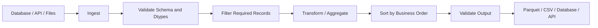

# 01- Sort Values

## Overview

`DataFrame.sort_values()` and `Series.sort_values()` order data according to one or more values stored in the DataFrame or Series.

Sorting is a fundamental operation for:

- Producing deterministic reports.
- Returning newest or highest-priority records.
- Preparing data for cumulative calculations.
- Establishing order before ranking.
- Selecting top or bottom records.
- Preparing data for time-series analysis.
- Generating stable API and file outputs.

The basic operation is:

```python
result = df.sort_values("revenue")
```

For descending order:

```python
result = df.sort_values(
    "revenue",
    ascending=False,
)
```

Production use requires more than choosing ascending or descending order. Correct sorting depends on:

```text
correct dtype
+
correct sort keys
+
missing-value policy
+
tie-breaking
+
deterministic ordering
+
working-set size
```

---

## Why `sort_values()` Exists

DataFrame row order is not generally a business ordering.

Rows may arrive from:

```text
PostgreSQL
REST APIs
Kafka batches
CSV files
Parquet partitions
```

in an order determined by ingestion or storage rather than the application's requirements.

For example, an API response may contain:

```text
order_id | revenue
---------|--------
1003     | 450.0
1001     | 900.0
1002     | 300.0
```

A report requiring highest revenue first needs explicit ordering:

```python
report = orders.sort_values(
    "revenue",
    ascending=False,
)
```

The resulting order becomes:

```text
order_id | revenue
---------|--------
1001     | 900.0
1003     | 450.0
1002     | 300.0
```

---

## Standard Syntax

The general form is:

```python
DataFrame.sort_values(
    by,
    axis=0,
    ascending=True,
    inplace=False,
    kind="quicksort",
    na_position="last",
    ignore_index=False,
    key=None,
)
```

For a Series:

```python
Series.sort_values(
    *,
    axis=0,
    ascending=True,
    inplace=False,
    kind="quicksort",
    na_position="last",
    ignore_index=False,
    key=None,
)
```

In normal DataFrame workflows, the most important arguments are:

```text
by
ascending
kind
na_position
ignore_index
key
```

---

## Sorting by One Column

Example:

```python
orders = pd.DataFrame(
    {
        "order_id": [1001, 1002, 1003],
        "revenue": [250.0, 900.0, 450.0],
    }
)

result = orders.sort_values(
    "revenue",
    ascending=False,
)
```

This sorts rows by the values in:

```text
revenue
```

while keeping the complete rows together.

Sorting a column is therefore different from sorting the column values independently.

---

## Sorting by Multiple Columns

Production reports often require hierarchical ordering.

Example:

```python
result = orders.sort_values(
    [
        "region",
        "revenue",
        "order_id",
    ],
    ascending=[
        True,
        False,
        True,
    ],
)
```

The ordering is:

```text
region      → ascending
revenue     → descending
order_id    → ascending
```

This means rows are first grouped by region, then ordered by revenue inside each region, then by `order_id` to resolve remaining ties.

---

## Multi-Column Ordering as a Business Rule

Suppose the requirement is:

> Show active customers first, then rank by lifetime value, and use customer ID as the deterministic tie-breaker.

Implement explicitly:

```python
result = customers.sort_values(
    [
        "status",
        "lifetime_value",
        "customer_id",
    ],
    ascending=[
        True,
        False,
        True,
    ],
)
```

However, if `"status"` is textual and alphabetical ordering does not represent business priority, create an explicit sort key instead:

```python
status_priority = {
    "active": 0,
    "suspended": 1,
    "closed": 2,
}

result = (
    customers
    .assign(
        status_order=lambda df: df[
            "status"
        ].map(status_priority)
    )
    .sort_values(
        [
            "status_order",
            "lifetime_value",
            "customer_id",
        ],
        ascending=[
            True,
            False,
            True,
        ],
        kind="stable",
    )
    .drop(
        columns="status_order"
    )
)
```

This makes business ordering explicit rather than relying on lexical ordering.

---

## Ascending and Descending Order

A single boolean applies when sorting one column:

```python
orders.sort_values(
    "revenue",
    ascending=False,
)
```

For multiple columns, provide one value per column:

```python
orders.sort_values(
    [
        "region",
        "revenue",
    ],
    ascending=[
        True,
        False,
    ],
)
```

A common mistake is supplying one boolean when different columns require different directions.

---

## Sorting a Series

The same concept applies to a Series:

```python
revenue = pd.Series(
    [250.0, 900.0, 450.0],
    name="revenue",
)

sorted_revenue = revenue.sort_values(
    ascending=False,
)
```

The result is a Series with the original index labels unless:

```python
ignore_index=True
```

is specified.

---

## Index Behavior

By default, sorting rows does **not** reset the index.

Example:

```python
orders = pd.DataFrame(
    {
        "order_id": [1001, 1002, 1003],
        "revenue": [250.0, 900.0, 450.0],
    }
)

result = orders.sort_values(
    "revenue",
    ascending=False,
)
```

The result has an index corresponding to the original row locations.

If a clean sequential index is required:

```python
result = orders.sort_values(
    "revenue",
    ascending=False,
    ignore_index=True,
)
```

Alternatively:

```python
result = (
    orders
    .sort_values(
        "revenue",
        ascending=False,
    )
    .reset_index(drop=True)
)
```

`ignore_index=True` is usually the cleaner choice when the original index has no business meaning.

---

## Sorting Does Not Normally Mutate the DataFrame

By default:

```python
result = df.sort_values(
    "revenue",
)
```

returns a sorted DataFrame.

The original DataFrame is not reordered in place.

Prefer explicit assignment:

```python
orders = orders.sort_values(
    "order_date",
)
```

rather than relying on:

```python
inplace=True
```

in production transformations.

Explicit assignment generally makes data flow easier to trace and test.

---

## `inplace=True`

Pandas supports:

```python
orders.sort_values(
    "revenue",
    ascending=False,
    inplace=True,
)
```

This modifies the existing DataFrame reference and returns `None`.

Although valid, explicit assignment is often easier to maintain:

```python
orders = orders.sort_values(
    "revenue",
    ascending=False,
)
```

Use `inplace=True` only when the mutation is intentional and improves the surrounding design.

---

## Missing Values

By default, missing values are placed at the end:

```python
orders.sort_values(
    "revenue",
    na_position="last",
)
```

To place them first:

```python
orders.sort_values(
    "revenue",
    na_position="first",
)
```

Example:

```python
orders = pd.DataFrame(
    {
        "order_id": [1001, 1002, 1003],
        "revenue": [250.0, None, 450.0],
    }
)

result = orders.sort_values(
    "revenue",
    ascending=False,
    na_position="last",
)
```

Do not replace missing values with zero solely to control ordering unless zero is the correct business meaning.

---

## Missing Values and Business Semantics

Consider:

```text
customer_id | lifetime_value
------------|----------------
101         | 5000
102         | NaN
103         | 1000
```

A missing lifetime value may mean:

```text
not calculated
data unavailable
customer not yet classified
```

It does not necessarily mean:

```text
lifetime_value = 0
```

Therefore:

```python
customers.sort_values(
    "lifetime_value",
    ascending=False,
    na_position="last",
)
```

often preserves the semantic distinction better than:

```python
customers["lifetime_value"] = (
    customers["lifetime_value"]
    .fillna(0)
)
```

---

## Sorting Numeric Values

Ensure the target column is numeric:

```python
orders["revenue"] = pd.to_numeric(
    orders["revenue"],
    errors="coerce",
)
```

Then:

```python
orders = orders.sort_values(
    "revenue",
    ascending=False,
)
```

This avoids incorrect lexical ordering when numeric values were ingested as strings.

For example, strings may sort as:

```text
100
20
9
```

instead of numerically:

```text
100
20
9
```

where the intended order needs numerical semantics.

---

## Sorting Datetimes

Convert timestamps before sorting:

```python
orders["created_at"] = pd.to_datetime(
    orders["created_at"],
)
```

Then:

```python
orders = orders.sort_values(
    "created_at",
)
```

This is important for:

```text
latest records
time-series processing
event ordering
cumulative calculations
incremental processing
```

For timezone-sensitive systems, use consistently timezone-aware timestamps when the source semantics require them.

---

## Sorting Strings

String sorting follows the values and their dtype/ordering semantics.

Example:

```python
customers = customers.sort_values(
    "name",
)
```

For case-insensitive business ordering, use a sort key:

```python
result = customers.sort_values(
    "name",
    key=lambda s: s.str.casefold(),
)
```

The `key` function transforms the values used for sorting without replacing the original data.

---

## The `key` Parameter

Use `key=` when the sorting criterion requires a transformation.

Example:

```python
customers = customers.sort_values(
    "name",
    key=lambda s: s.str.casefold(),
)
```

For whitespace normalization:

```python
customers = customers.sort_values(
    "name",
    key=lambda s: (
        s.astype("string")
        .str.strip()
        .str.casefold()
    ),
)
```

The transformed values determine ordering while the original column values remain unchanged.

This is useful for:

```text
case-insensitive sorting
normalized labels
custom lexical ordering
```

---

## Custom Categorical Ordering

Alphabetical order is often not business order.

Suppose:

```text
priority:
low
medium
high
critical
```

Alphabetical sorting would not produce the desired order.

Create an ordered categorical:

```python
priority_dtype = pd.CategoricalDtype(
    categories=[
        "low",
        "medium",
        "high",
        "critical",
    ],
    ordered=True,
)

tickets["priority"] = tickets[
    "priority"
].astype(priority_dtype)

result = tickets.sort_values(
    "priority",
    ascending=False,
)
```

This makes the ordering semantics explicit and reusable.

---

## Stable Sorting

A stable sort preserves the relative order of rows with equal sort keys.

Use:

```python
result = orders.sort_values(
    "priority",
    kind="stable",
)
```

This matters when a previous operation already established meaningful ordering.

For example:

```text
sort by created_at
    ↓
sort by priority using stable ordering
```

can preserve the original `created_at` order for equal priorities.

Stable sorting is useful for reproducibility and deterministic transformation pipelines.

---

## Tie-Breaking

For production output, do not rely on incidental order when ties matter.

Instead of:

```python
customers.sort_values(
    "revenue",
    ascending=False,
)
```

use:

```python
customers.sort_values(
    [
        "revenue",
        "customer_id",
    ],
    ascending=[
        False,
        True,
    ],
    kind="stable",
)
```

This produces a deterministic order even when multiple customers have the same revenue.

---

## Sorting Before Ranking

Ranking often depends on the ordering of data, particularly when tie behavior uses existing row order.

A deterministic pattern is:

```python
customers = customers.sort_values(
    [
        "revenue",
        "customer_id",
    ],
    ascending=[
        False,
        True,
    ],
    kind="stable",
)

customers["revenue_rank"] = (
    customers["revenue"]
    .rank(
        ascending=False,
        method="dense",
    )
)
```

The sort defines the deterministic presentation order, while `rank()` calculates relative position.

---

## Sorting Before Cumulative Operations

Cumulative calculations are order-sensitive.

Example:

```python
orders = orders.sort_values(
    [
        "customer_id",
        "order_date",
    ],
    kind="stable",
)

orders["running_revenue"] = (
    orders
    .groupby("customer_id")["revenue"]
    .cumsum()
)
```

The correct order is:

```text
sort by business sequence
    ↓
group if required
    ↓
calculate cumulative value
```

A `cumsum()` on unsorted events can return a valid DataFrame with incorrect business meaning.

---

## Sorting After Aggregation

If the requirement is:

> Rank customers by total revenue.

First aggregate:

```python
customer_report = (
    orders
    .groupby(
        "customer_id",
        as_index=False,
    )
    .agg(
        total_revenue=(
            "revenue",
            "sum",
        )
    )
)
```

Then sort:

```python
customer_report = (
    customer_report
    .sort_values(
        [
            "total_revenue",
            "customer_id",
        ],
        ascending=[
            False,
            True,
        ],
        kind="stable",
    )
)
```

Sorting before aggregation would order individual transactions rather than customers.

---

## Sorting and Top-N

If the requirement is simply:

```text
top 10 orders by revenue
```

you can use:

```python
top_orders = orders.nlargest(
    10,
    "revenue",
)
```

instead of sorting the entire DataFrame:

```python
top_orders = (
    orders
    .sort_values(
        "revenue",
        ascending=False,
    )
    .head(10)
)
```

Both can express the requirement, but `nlargest()` directly communicates top-N intent and can avoid unnecessary full ordering.

For deterministic tie handling, consider adding an explicit secondary rule after selecting candidates where business semantics require it.

---

## Sorting by Multiple Data Types

A DataFrame can contain:

```text
string
integer
float
datetime
category
boolean
```

and multiple sort columns can combine them:

```python
result = orders.sort_values(
    [
        "status",
        "created_at",
        "revenue",
    ],
    ascending=[
        True,
        False,
        False,
    ],
)
```

Before sorting, verify that each column's dtype supports the intended ordering semantics.

---

## Sorting Boolean Values

Boolean columns can be sorted:

```python
users.sort_values(
    "is_active",
    ascending=False,
)
```

This places:

```text
True
```

before:

```text
False
```

For more complex priority rules, an explicit numeric priority column may be clearer.

---

## Sorting by a Computed Value

Use `assign()` when a derived sort criterion improves readability:

```python
result = (
    orders
    .assign(
        net_revenue=lambda df: (
            df["revenue"]
            - df["discount"]
        )
    )
    .sort_values(
        [
            "net_revenue",
            "order_id",
        ],
        ascending=[
            False,
            True,
        ],
        kind="stable",
    )
)
```

This is preferable to embedding complicated expressions directly inside the sort call.

---

## Sorting Without Persisting a Temporary Column

For reusable logic, `key=` or a named intermediate Series can avoid modifying the schema.

Example:

```python
sort_key = (
    orders["revenue"]
    - orders["discount"]
)

order_index = sort_key.sort_values(
    ascending=False
).index

result = orders.loc[
    order_index
]
```

In most cases, however, an explicit temporary column through `assign()` is easier to understand.

---

## Sorting Index Versus Values

Use:

```python
df.sort_values("customer_id")
```

when the ordering criterion is a data column.

Use:

```python
df.sort_index()
```

when the index labels define the intended ordering.

Example:

```python
df = df.set_index(
    "created_at"
)

result = df.sort_index()
```

These are different operations and should not be interchanged casually.

---

## Sorting a MultiIndex DataFrame

After operations such as:

```python
groupby
pivot
set_index
```

the DataFrame may have a MultiIndex.

You can still use:

```python
result = df.sort_values(
    "revenue"
)
```

for column values or:

```python
result = df.sort_index()
```

for index levels.

When sorting a particular MultiIndex level:

```python
result = df.sort_index(
    level="region",
)
```

This is useful when hierarchical index structure is part of the data model.

---

## SQL Equivalent

Pandas:

```python
orders.sort_values(
    [
        "created_at",
        "order_id",
    ],
    ascending=[
        False,
        False,
    ],
)
```

SQL:

```sql
SELECT
    order_id,
    customer_id,
    created_at,
    revenue
FROM orders
ORDER BY
    created_at DESC,
    order_id DESC;
```

The conceptual relationship is:

```text
Pandas sort_values()
    ≈
SQL ORDER BY
```

For large database-backed datasets, SQL ordering is often more appropriate.

---

## PostgreSQL Query Pushdown

If the data already resides in PostgreSQL:

```sql
SELECT
    order_id,
    customer_id,
    revenue
FROM orders
WHERE status = 'completed'
ORDER BY
    revenue DESC,
    order_id ASC
LIMIT 100;
```

This is often preferable to:

```text
fetch millions of rows
    ↓
load into Pandas
    ↓
sort millions of rows
    ↓
take 100
```

Push:

```text
filter
+
sort
+
limit
```

into the database when the database can efficiently perform them.

---

## API Response Ordering

For a FastAPI endpoint:

```python
result = (
    orders
    .sort_values(
        [
            "created_at",
            "order_id",
        ],
        ascending=[
            False,
            False,
        ],
        kind="stable",
    )
    .reset_index(drop=True)
)

payload = result.to_dict(
    orient="records"
)
```

Explicit ordering makes API responses deterministic.

For large result sets, perform ordering and pagination in PostgreSQL rather than sorting a complete dataset in the application layer.

---

## Pagination and Deterministic Sorting

Pagination should use a deterministic ordering.

Bad:

```python
orders.sort_values(
    "created_at",
    ascending=False,
)
```

when many records share the same timestamp and page boundaries must remain stable.

Better:

```python
orders.sort_values(
    [
        "created_at",
        "order_id",
    ],
    ascending=[
        False,
        False,
    ],
    kind="stable",
)
```

For very large PostgreSQL datasets, use indexed keyset pagination rather than repeatedly sorting and slicing large Pandas DataFrames.

---

## ETL Workflow

Sorting frequently appears in ETL logic:



Sorting should occur at the stage where the ordering requirement actually applies.

For example:

```text
sort transactions
```

and:

```text
aggregate customers
sort customers
```

represent different business operations.

---

## Performance Considerations

Sorting is not a constant-time operation.

For `n` records, comparison-based sorting is generally on the order of:

```text
O(n log n)
```

The practical cost depends on:

```text
row count
column dtype
number of sort keys
memory pressure
temporary allocations
```

For large DataFrames, minimize the amount of data being sorted.

---

## Filter Before Sorting

Prefer:

```python
completed_orders = orders.loc[
    orders["status"].eq("completed")
]

result = completed_orders.sort_values(
    "revenue",
    ascending=False,
)
```

over sorting records that will later be discarded.

This reduces the working set.

---

## Project Before Sorting

If only a few columns are required:

```python
working = orders[
    [
        "order_id",
        "customer_id",
        "revenue",
    ]
]

result = working.sort_values(
    "revenue",
    ascending=False,
)
```

Reducing DataFrame width can reduce memory pressure during expensive operations.

---

## Sort Only When Needed

Avoid unnecessary sorting:

```python
df = df.sort_values(
    "created_at"
)

# Additional transformations that do not
# depend on ordering.

df = df.sort_values(
    "created_at"
)
```

If ordering has not changed, the second sort may be unnecessary.

Track the assumptions behind sorted state rather than repeatedly sorting defensively.

---

## Large Dataset Strategy

For large datasets, consider:

```text
PostgreSQL
DuckDB
warehouse
Spark
distributed processing
```

depending on workload scale.

A Pandas worker running in Kubernetes should not routinely sort datasets that exceed its practical memory budget.

Database-side:

```text
WHERE
ORDER BY
LIMIT
```

can often be significantly more efficient when the data is already relational.

---

## Sorting and Memory

Sorting can require temporary memory in addition to the DataFrame itself.

Monitor:

```python
memory_bytes = (
    orders.memory_usage(
        deep=True
    )
    .sum()
)
```

For high-volume processing:

```text
filter early
project early
aggregate early when appropriate
sort late
sort only required records
```

This is especially important inside memory-constrained Celery or Kubernetes workers.

---

## Sorting with Categorical Data

Categorical columns can provide explicit business ordering:

```python
status_dtype = pd.CategoricalDtype(
    categories=[
        "pending",
        "processing",
        "completed",
        "failed",
    ],
    ordered=True,
)

jobs["status"] = jobs[
    "status"
].astype(status_dtype)

jobs = jobs.sort_values(
    "status"
)
```

This is often clearer than mapping strings manually in multiple locations.

For low-cardinality repeated values, categoricals can also reduce memory usage.

---

## Missing and Invalid Values

Before sorting critical reports, validate unexpected values:

```python
invalid = orders.loc[
    orders["revenue"].lt(0)
]

if not invalid.empty:
    raise ValueError(
        "Negative revenue values detected."
    )
```

Sorting invalid data does not make it valid.

The pipeline should validate:

```text
dtype
range
missingness
allowed values
```

before treating the ordering as meaningful.

---

## Testing Sort Behavior

Test the actual business ordering:

```python
def test_orders_are_sorted_by_revenue() -> None:
    orders = pd.DataFrame(
        {
            "order_id": [1, 2, 3],
            "revenue": [100.0, 300.0, 200.0],
        }
    )

    result = orders.sort_values(
        "revenue",
        ascending=False,
        ignore_index=True,
    )

    assert result[
        "order_id"
    ].tolist() == [2, 3, 1]
```

Do not rely only on:

```python
assert result is not None
```

The test should verify the business invariant.

---

## Testing Deterministic Tie-Breaking

```python
def test_equal_revenue_uses_order_id() -> None:
    orders = pd.DataFrame(
        {
            "order_id": [1003, 1001, 1002],
            "revenue": [500.0, 500.0, 300.0],
        }
    )

    result = orders.sort_values(
        [
            "revenue",
            "order_id",
        ],
        ascending=[
            False,
            True,
        ],
        kind="stable",
        ignore_index=True,
    )

    assert result[
        "order_id"
    ].tolist() == [1001, 1003, 1002]
```

This protects reproducibility when values are tied.

---

## Testing Missing-Value Placement

```python
def test_missing_revenue_is_last() -> None:
    orders = pd.DataFrame(
        {
            "order_id": [1, 2, 3],
            "revenue": [300.0, None, 100.0],
        }
    )

    result = orders.sort_values(
        "revenue",
        ascending=False,
        na_position="last",
        ignore_index=True,
    )

    assert result[
        "order_id"
    ].tolist() == [1, 3, 2]
```

This ensures missing-value policy is part of the tested contract.

---

## Common Mistakes

### Sorting the Wrong Grain

If the report requires:

```text
one row = one customer
```

but sorting happens before customer aggregation, the output is ordered at the transaction level.

Aggregate first, then sort.

---

### Relying on Input Order

Input order should not be treated as a business guarantee.

Use explicit sorting whenever order matters.

---

### Forgetting a Tie-Breaker

Sorting only by:

```python
"revenue"
```

may leave equal-valued rows without a meaningful deterministic order.

Use a stable secondary key.

---

### Sorting Numeric Data as Strings

Always normalize numeric dtypes before numerical sorting.

---

### Resetting the Index Unnecessarily

The index may carry meaningful row identity.

Use:

```python
ignore_index=True
```

only when a new sequential index is actually desired.

---

### Using `inplace=True` Without Need

Mutation can make data flow harder to reason about.

Prefer explicit assignment unless in-place modification has a clear benefit.

---

### Sorting Instead of Using `nlargest()`

For top-N requirements:

```python
df.nlargest(
    10,
    "revenue",
)
```

may better communicate intent and avoid unnecessary full ordering.

---

## Production Pitfalls

### Unstable Pagination

Equal sort values can move between pages when the ordering does not include a unique secondary key.

Use deterministic ordering.

---

### Repeated Large Sorts

Sorting the same large DataFrame multiple times wastes CPU and memory.

Perform the sort once when possible and keep the ordering assumption explicit.

---

### Sorting Before Filtering

Sorting data that will later be discarded increases work.

Filter the working set first when semantics allow.

---

### Sorting After a Many-to-Many Join

An earlier join that multiplies rows can inflate the dataset before sorting.

Validate join cardinality before performing large downstream operations.

---

### Memory Pressure in Containers

A large sort can cause:

```text
worker memory growth
container OOM
job retry
queue backlog
```

Use input-size limits, data reduction, and database-side processing where appropriate.

---

## Security Considerations

Sorting itself is not usually a security boundary, but sorting and ranking can expose sensitive ordering.

For example:

```text
employee compensation
customer risk score
internal priority
```

should not be ranked and returned to unauthorized users.

Scope data before sorting:

```python
tenant_orders = orders.loc[
    orders["tenant_id"].eq(
        tenant_id
    )
].copy()

result = tenant_orders.sort_values(
    "revenue",
    ascending=False,
)
```

Apply authorization and tenant filtering before analytical ordering.

---

## Reliability and Reproducibility

For reproducible output, define:

```text
sort columns
sort directions
tie-breaking
missing-value placement
dtype semantics
```

Example:

```python
report = orders.sort_values(
    [
        "created_at",
        "order_id",
    ],
    ascending=[
        False,
        False,
    ],
    na_position="last",
    kind="stable",
    ignore_index=True,
)
```

This makes ordering behavior explicit.

---

## Recommended Production Pattern

A production report commonly follows:

```python
def build_order_report(
    orders: pd.DataFrame,
) -> pd.DataFrame:
    required_columns = {
        "order_id",
        "customer_id",
        "revenue",
        "status",
    }

    missing = required_columns.difference(
        orders.columns
    )

    if missing:
        raise ValueError(
            "Missing required columns: "
            f"{sorted(missing)}"
        )

    working = orders.loc[
        orders["status"].eq("completed"),
        [
            "order_id",
            "customer_id",
            "revenue",
        ],
    ].copy()

    working["revenue"] = pd.to_numeric(
        working["revenue"],
        errors="coerce",
    )

    if working["revenue"].isna().any():
        raise ValueError(
            "Revenue contains invalid values."
        )

    result = (
        working
        .sort_values(
            [
                "revenue",
                "order_id",
            ],
            ascending=[
                False,
                True,
            ],
            na_position="last",
            kind="stable",
            ignore_index=True,
        )
    )

    return result
```

The sequence is:

```text
validate schema
    ↓
filter population
    ↓
project required columns
    ↓
normalize dtype
    ↓
validate values
    ↓
sort deterministically
    ↓
publish
```

This pattern keeps sorting close to the point where its business meaning is established.

---

## Decision Guide

| Requirement | Preferred Approach |
| --- | --- |
| Sort rows by column | `sort_values()` |
| Sort rows by index | `sort_index()` |
| Sort one column descending | `sort_values(..., ascending=False)` |
| Sort several columns differently | `by=[...]` + `ascending=[...]` |
| Put nulls first/last | `na_position=` |
| Preserve existing relative tie order | `kind="stable"` |
| Reset to sequential index | `ignore_index=True` |
| Custom string ordering | `key=` |
| Business-defined category ordering | Ordered categorical |
| Top N only | `nlargest()` |
| Bottom N only | `nsmallest()` |
| Rank records | `rank()` |
| Sort before cumulative operation | Explicit `sort_values()` |
| Large database-backed ordering | SQL `ORDER BY` |
| Large API pagination | Database-side ordering + keyset pagination |

---

## Key Takeaways

- `sort_values()` orders DataFrame or Series records by one or more data values and is fundamental for reporting, APIs, ranking, and order-sensitive transformations.
- Production sorting should explicitly define sort keys, direction, missing-value placement, dtypes, and deterministic tie-breaking rather than relying on incidental input order.
- Filter, project, and aggregate before sorting when those operations reduce the working set without changing the required business semantics.
- Use stable sorting and unique secondary keys when ordering affects pagination, reproducibility, cumulative calculations, tests, or persisted reports.
- For large database-backed datasets, prefer SQL-side filtering, ordering, and limiting where practical instead of materializing and sorting unnecessarily large Pandas DataFrames.