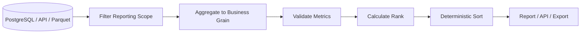

# 04- Rank

## Overview

`rank()` assigns a relative numeric position to values in a Pandas `Series` or DataFrame column.

Unlike `sort_values()`, which changes row ordering, ranking adds a derived value describing where each record stands relative to the others.

Typical examples include:

```text
customer revenue
    ↓
rank customers

product sales
    ↓
rank products

API latency
    ↓
rank services

employee performance
    ↓
rank employees
```

The basic operation is:

```python
customers["revenue_rank"] = (
    customers["revenue"]
    .rank(ascending=False)
)
```

Ranking becomes a production concern when the result affects:

- Business reports.
- Leaderboards.
- Prioritization.
- Customer segmentation.
- SLA analysis.
- Recommendations.
- API responses.
- Resource allocation.

Correct ranking depends on:

```text
metric semantics
+
sort direction
+
tie policy
+
missing-value behavior
+
grouping scope
+
deterministic ordering
```

---

## Why Ranking Exists

Sorting answers:

> Which row comes first?

Ranking answers:

> What is this row's relative position?

Suppose:

```python
customers = pd.DataFrame(
    {
        "customer_id": [101, 102, 103],
        "revenue": [9000.0, 5000.0, 2000.0],
    }
)
```

Sorting:

```python
customers.sort_values(
    "revenue",
    ascending=False,
)
```

changes row order.

Ranking:

```python
customers["rank"] = (
    customers["revenue"]
    .rank(
        ascending=False,
    )
)
```

adds:

```text
customer_id | revenue | rank
------------|---------|-----
101         | 9000    | 1.0
102         | 5000    | 2.0
103         | 2000    | 3.0
```

The original records remain available for additional processing.

---

## Standard Syntax

For a Series:

```python
ranked = series.rank(
    axis=0,
    method="average",
    numeric_only=False,
    na_option="keep",
    ascending=True,
    pct=False,
)
```

For a DataFrame:

```python
ranked = df.rank(
    axis=0,
    method="average",
    numeric_only=False,
    na_option="keep",
    ascending=True,
    pct=False,
)
```

The most important parameters are:

| Parameter | Purpose |
| --- | --- |
| `axis` | Rank down rows or across columns |
| `method` | Defines how ties are ranked |
| `numeric_only` | Restricts DataFrame ranking to numeric columns when applicable |
| `na_option` | Controls missing-value treatment |
| `ascending` | Controls ranking direction |
| `pct` | Returns percentile-style ranks |

For normal business ranking, `method`, `na_option`, `ascending`, and `pct` are usually the most relevant.

---

## Basic Ranking

```python
customers = pd.DataFrame(
    {
        "customer_id": [101, 102, 103, 104],
        "revenue": [
            9000.0,
            5000.0,
            7500.0,
            2000.0,
        ],
    }
)

customers["revenue_rank"] = (
    customers["revenue"]
    .rank(
        ascending=False,
    )
)
```

Result:

```text
customer_id | revenue | revenue_rank
------------|---------|-------------
101         | 9000    | 1.0
102         | 5000    | 3.0
103         | 7500    | 2.0
104         | 2000    | 4.0
```

The DataFrame row order has not been changed.

---

## Ascending Versus Descending

By default:

```python
series.rank(
    ascending=True,
)
```

gives smaller values better ranks.

Example:

```text
100 → 1
200 → 2
300 → 3
```

For business metrics where larger is better:

```python
series.rank(
    ascending=False,
)
```

produces:

```text
300 → 1
200 → 2
100 → 3
```

Always define ranking direction explicitly when the result affects a business decision.

---

## Ranking Methods

Ties require a policy.

Pandas supports:

| Method | Example for `[100, 100, 50]` |
| --- | --- |
| `average` | `[1.5, 1.5, 3.0]` |
| `min` | `[1.0, 1.0, 3.0]` |
| `max` | `[2.0, 2.0, 3.0]` |
| `first` | `[1.0, 2.0, 3.0]` based on existing order |
| `dense` | `[1.0, 1.0, 2.0]` |

The default is:

```python
method="average"
```

Do not choose a tie method arbitrarily. The correct choice is a business rule.

---

## `average`

With:

```python
series = pd.Series(
    [500.0, 500.0, 300.0]
)

series.rank(
    ascending=False,
    method="average",
)
```

the tied `500` values share the average of ranks 1 and 2:

```text
1.5
1.5
3.0
```

This is mathematically useful when the exact rank positions should be averaged.

---

## `min`

```python
series.rank(
    ascending=False,
    method="min",
)
```

For:

```text
500
500
300
```

the result is:

```text
1
1
3
```

The tied values receive the best rank occupied by the group.

This is common when the question is:

> What is the highest position occupied by this tied group?

---

## `max`

```python
series.rank(
    ascending=False,
    method="max",
)
```

For:

```text
500
500
300
```

the result is:

```text
2
2
3
```

The tied values receive the worst position occupied by the tie group.

Use only when this interpretation matches the business rule.

---

## `dense`

```python
series.rank(
    ascending=False,
    method="dense",
)
```

For:

```text
500
500
300
100
```

the result is:

```text
1
1
2
3
```

Unlike standard competition-style ranking, `dense` does not leave a gap after ties.

This is often useful for:

```text
tiers
leaderboards
customer segments
priority bands
category rankings
```

---

## `first`

```python
series.rank(
    ascending=False,
    method="first",
)
```

Ties are resolved using the existing row order.

For:

```text
500
500
300
```

the result is:

```text
1
2
3
```

This is only deterministic when the pre-existing row order itself is deterministic.

For production pipelines, explicitly sort by a secondary key first:

```python
customers = customers.sort_values(
    [
        "revenue",
        "customer_id",
    ],
    ascending=[
        False,
        True,
    ],
    kind="stable",
)

customers["rank"] = (
    customers["revenue"]
    .rank(
        ascending=False,
        method="first",
    )
)
```

---

## Ranking Within Groups

A common requirement is ranking within a business dimension.

Example:

```python
products["category_rank"] = (
    products
    .groupby("category")["revenue"]
    .rank(
        ascending=False,
        method="dense",
    )
)
```

This produces independent rankings for each category.

Conceptually:

```text
category A
    product 1 → rank 1
    product 2 → rank 2

category B
    product 3 → rank 1
    product 4 → rank 2
```

The rank resets at each group boundary.

---

## Grouped Ranking in Multi-Tenant Systems

For tenant-scoped data:

```python
customers["tenant_rank"] = (
    customers
    .groupby("tenant_id")["revenue"]
    .rank(
        ascending=False,
        method="dense",
    )
)
```

This is safer than calculating a global ranking and filtering afterward.

The tenant boundary should be part of the ranking operation itself.

---

## Ranking After Aggregation

If the requirement is:

> Rank customers by total revenue.

Aggregate first:

```python
customer_revenue = (
    orders
    .groupby(
        "customer_id",
        as_index=False,
    )
    .agg(
        total_revenue=(
            "revenue",
            "sum",
        )
    )
)
```

Then rank:

```python
customer_revenue["revenue_rank"] = (
    customer_revenue["total_revenue"]
    .rank(
        ascending=False,
        method="dense",
    )
)
```

The ranking is now performed at:

```text
one row = one customer
```

rather than:

```text
one row = one order
```

This distinction is essential for reporting correctness.

---

## Ranking Versus Sorting

| Requirement | Operation |
| --- | --- |
| Change row order | `sort_values()` |
| Add relative positions | `rank()` |
| Get top N | `nlargest()` |
| Get bottom N | `nsmallest()` |
| Rank within groups | `groupby().rank()` |

Example:

```python
customers["rank"] = (
    customers["revenue"]
    .rank(
        ascending=False,
        method="dense",
    )
)
```

does not rearrange the DataFrame.

To present ranked records in order:

```python
customers = (
    customers
    .sort_values(
        [
            "rank",
            "customer_id",
        ],
        ascending=[
            True,
            True,
        ],
        kind="stable",
    )
)
```

---

## Percentile Ranking

Use:

```python
pct=True
```

to return relative rank values.

Example:

```python
customers["percentile"] = (
    customers["revenue"]
    .rank(
        ascending=False,
        method="average",
        pct=True,
    )
)
```

This produces values between 0 and 1 representing relative rank according to Pandas' ranking semantics.

For reporting, define clearly whether:

```text
higher percentile = better
```

or:

```text
higher percentile = worse
```

because the direction depends on `ascending`.

---

## Top Percentage Segments

Percentile ranking can help classify records:

```python
customers["percentile_rank"] = (
    customers["revenue"]
    .rank(
        ascending=False,
        pct=True,
    )
)
```

Then define a segment:

```python
customers["segment"] = "standard"

customers.loc[
    customers["percentile_rank"].le(0.10),
    "segment",
] = "top_10"
```

The exact percentile boundary should be defined carefully because ranking methods and ties can affect boundary membership.

---

## Missing Values

By default:

```python
na_option="keep"
```

keeps missing values unranked.

Example:

```python
customers["rank"] = (
    customers["revenue"]
    .rank(
        ascending=False,
        na_option="keep",
    )
)
```

A missing revenue remains:

```text
NaN
```

rather than being assigned an arbitrary numeric rank.

This is generally preferable when:

```text
missing
```

does not mean:

```text
zero
```

---

## `na_option`

Pandas provides:

| `na_option` | Behavior |
| --- | --- |
| `"keep"` | Missing values remain unranked |
| `"top"` | Missing values receive the highest ranking position |
| `"bottom"` | Missing values receive the lowest ranking position |

Example:

```python
customers["rank"] = (
    customers["revenue"]
    .rank(
        ascending=False,
        na_option="bottom",
    )
)
```

Use `"top"` or `"bottom"` only when missingness has a deliberate business interpretation.

---

## Missing Values Are Not Automatically Zero

Suppose:

```text
customer_id | revenue
------------|--------
101         | 5000
102         | NaN
103         | 2000
```

If `NaN` means:

```text
data unavailable
```

ranking it as zero would be misleading.

If the business definition explicitly says:

```text
missing revenue = zero revenue
```

then:

```python
customers["revenue"] = (
    customers["revenue"]
    .fillna(0)
)
```

can be appropriate.

The semantic decision belongs before the ranking operation.

---

## Ranking Invalid Values

Validate metrics before ranking.

Example:

```python
invalid = customers.loc[
    customers["revenue"].lt(0)
]

if not invalid.empty:
    raise ValueError(
        "Revenue contains invalid negative values."
    )
```

Ranking invalid values still produces a mathematically valid ordering.

Pandas cannot determine whether a value is economically or operationally valid.

---

## Correct Numeric Dtypes

Ensure the metric is numeric:

```python
customers["revenue"] = pd.to_numeric(
    customers["revenue"],
    errors="coerce",
)
```

Then validate conversion failures:

```python
if customers["revenue"].isna().any():
    raise ValueError(
        "Revenue contains invalid numeric values."
    )
```

Do not rank textual representations of numbers without first normalizing them.

---

## Deterministic Ranking

Ranking itself can be deterministic while the final display order remains ambiguous when ties exist.

For production reports:

```python
customers["revenue_rank"] = (
    customers["revenue"]
    .rank(
        ascending=False,
        method="dense",
    )
)

customers = customers.sort_values(
    [
        "revenue_rank",
        "customer_id",
    ],
    ascending=[
        True,
        True,
    ],
    kind="stable",
)
```

This separates:

```text
rank semantics
```

from:

```text
presentation ordering
```

which makes the pipeline easier to reason about.

---

## Ranking With a Secondary Tie-Breaker

If the business requirement is:

> Customers with equal revenue should be ordered by customer ID.

You can establish the order first and use `method="first"`:

```python
customers = customers.sort_values(
    [
        "revenue",
        "customer_id",
    ],
    ascending=[
        False,
        True,
    ],
    kind="stable",
)

customers["rank"] = (
    customers["revenue"]
    .rank(
        ascending=False,
        method="first",
    )
)
```

This assigns unique ordinal positions.

Use this only when ties should actually be broken rather than shared.

---

## Ranking and Top-N

If the requirement is only:

```text
top 10 customers
```

you may not need a full rank column.

Use:

```python
top_customers = customers.nlargest(
    10,
    "revenue",
)
```

If downstream logic needs the actual relative position:

```python
customers["rank"] = (
    customers["revenue"]
    .rank(
        ascending=False,
        method="dense",
    )
)
```

and then:

```python
top_customers = customers.loc[
    customers["rank"].le(10)
]
```

These have different semantics when ties exist.

---

## Top-N Versus Rank Threshold

Consider:

```text
values:
100
90
90
80
```

Top 2 rows:

```python
values.nlargest(
    2,
)
```

returns:

```text
100
90
```

A dense rank threshold:

```python
values.rank(
    ascending=False,
    method="dense",
).le(2)
```

includes:

```text
100
90
90
```

because both `90` values have rank 2.

This distinction matters in business rules such as:

```text
top 10 customers
```

versus:

```text
customers in the top 10 ranks
```

---

## Ranking Within Multiple Dimensions

Example:

```python
products["region_category_rank"] = (
    products
    .groupby(
        [
            "region",
            "category",
        ]
    )["revenue"]
    .rank(
        ascending=False,
        method="dense",
    )
)
```

This produces a ranking within each:

```text
region × category
```

group.

This pattern is useful for:

```text
regional product performance
department rankings
tenant-specific leaderboards
category-specific reports
```

---

## Ranking With Time Windows

Ranking is often calculated for a specific reporting period:

```python
period_orders = orders.loc[
    orders["order_date"].between(
        "2026-09-01",
        "2026-09-30",
    )
].copy()

customer_revenue = (
    period_orders
    .groupby(
        "customer_id",
        as_index=False,
    )
    .agg(
        revenue=(
            "revenue",
            "sum",
        )
    )
)

customer_revenue["rank"] = (
    customer_revenue["revenue"]
    .rank(
        ascending=False,
        method="dense",
    )
)
```

Filtering the reporting population before aggregation ensures that the ranking corresponds to the intended period.

---

## Ranking and Time-Series Data

For time-based rankings, the time window should be explicit.

Example:

```python
daily_sales = (
    orders
    .assign(
        date=lambda df: pd.to_datetime(
            df["order_date"]
        ).dt.normalize()
    )
    .groupby(
        [
            "date",
            "product_id",
        ],
        as_index=False,
    )
    .agg(
        revenue=(
            "revenue",
            "sum",
        )
    )
)

daily_sales["daily_rank"] = (
    daily_sales
    .groupby("date")["revenue"]
    .rank(
        ascending=False,
        method="dense",
    )
)
```

Each day receives an independent product ranking.

---

## Grouped Ranking and `transform`

Grouped ranking naturally aligns with the original rows:

```python
orders["customer_order_rank"] = (
    orders
    .groupby("customer_id")["revenue"]
    .rank(
        ascending=False,
        method="first",
    )
)
```

Each order receives a rank relative to other orders for the same customer.

This is different from:

```python
orders.groupby(
    "customer_id"
)["revenue"].sum()
```

which reduces the dataset.

`groupby().rank()` preserves one output value per input row.

---

## Ranking and ETL

A ranking stage often follows:

```text
Extract
    ↓
Validate
    ↓
Filter reporting population
    ↓
Aggregate to required grain
    ↓
Rank
    ↓
Sort
    ↓
Publish
```

For example:



Ranking should happen at the grain that the rank is intended to describe.

---

## API Example

A FastAPI reporting endpoint might return the top customers:

```python
customer_report["rank"] = (
    customer_report["revenue"]
    .rank(
        ascending=False,
        method="dense",
    )
)

customer_report = (
    customer_report
    .sort_values(
        [
            "rank",
            "customer_id",
        ],
        kind="stable",
    )
    .reset_index(drop=True)
)

payload = customer_report.to_dict(
    orient="records"
)
```

For high-volume APIs, calculate the ranking in PostgreSQL when possible rather than transferring the entire customer population to Pandas.

---

## SQL Equivalent

Pandas:

```python
customers["rank"] = (
    customers["revenue"]
    .rank(
        ascending=False,
        method="dense",
    )
)
```

SQL:

```sql
SELECT
    customer_id,
    revenue,
    DENSE_RANK() OVER (
        ORDER BY revenue DESC
    ) AS rank
FROM customers;
```

The Pandas `method` determines which SQL ranking function most closely represents the intended semantics.

For example:

```text
method="dense"
    → DENSE_RANK()

method="min"
    → RANK()

method="first"
    → often ROW_NUMBER() with explicit ordering
```

The exact equivalence depends on how ties and secondary ordering are defined.

---

## PostgreSQL Window Functions

For database-backed data:

```sql
SELECT
    customer_id,
    SUM(revenue) AS total_revenue,
    DENSE_RANK() OVER (
        ORDER BY SUM(revenue) DESC
    ) AS revenue_rank
FROM orders
WHERE status = 'completed'
GROUP BY customer_id;
```

This can be more scalable than:

```text
fetch all orders
    ↓
Pandas aggregation
    ↓
Pandas ranking
```

when the source dataset is large.

---

## Performance Considerations

Ranking requires processing the values being ranked.

Cost depends on:

```text
row count
group count
group sizes
dtype
memory
```

Reduce the working set before ranking:

```python
working = orders.loc[
    orders["status"].eq("completed"),
    [
        "customer_id",
        "revenue",
    ],
]
```

Then aggregate if ranking is required at customer level.

---

## Rank After Aggregation

Avoid ranking millions of transactional rows when the actual requirement is a ranking of a smaller entity population.

Instead of:

```text
10 million orders
    ↓
rank orders
```

when the requirement is:

```text
rank 500,000 customers
```

aggregate first:

```text
10 million orders
    ↓
500,000 customers
    ↓
rank customers
```

This can dramatically reduce the amount of data processed.

---

## Memory Considerations

Ranking adds another Series or DataFrame column when results are assigned:

```python
customers["rank"] = ...
```

For large datasets, avoid keeping unnecessary intermediate copies.

Use:

```python
working = orders.loc[
    ...,
    [
        "customer_id",
        "revenue",
    ],
]
```

rather than carrying dozens of unrelated columns through the ranking stage.

---

## Large Dataset Strategy

For very large datasets:

```text
Pandas
    → suitable for manageable working sets

PostgreSQL
    → database-resident ranking

Spark
    → distributed ranking

DuckDB
    → local analytical processing
```

The correct engine depends on:

```text
data volume
latency requirements
deployment architecture
available memory
existing storage
```

Do not move large datasets into Pandas merely because the ranking syntax is familiar.

---

## Ranking and Data Quality

A ranking can be used as a diagnostic tool.

For example:

```python
ranked = (
    customers
    .assign(
        rank=lambda df: df[
            "lifetime_value"
        ].rank(
            ascending=False,
            method="dense",
        )
    )
)
```

Inspect extreme records:

```python
top_customers = ranked.loc[
    ranked["rank"].le(10)
]
```

Unexpected top-ranked values can reveal:

```text
duplicate customers
currency errors
unit mismatches
negative adjustments
data ingestion defects
```

Ranking is therefore useful for both reporting and investigation.

---

## Duplicate Records and Ranking

Duplicate records can distort ranking.

Suppose one customer is duplicated:

```text
customer_id | revenue
101         | 5000
101         | 5000
```

If the intended grain is one row per customer, the ranking is now wrong because the dataset itself is wrong.

Resolve:

```text
duplicate keys
```

before ranking at the entity level.

---

## Ranking and Currency

Financial rankings must use consistent currencies.

Do not rank:

```text
USD
EUR
INR
```

directly against each other.

Normalize first:

```text
source currency
    ↓
exchange-rate normalization
    ↓
common reporting currency
    ↓
aggregate
    ↓
rank
```

Otherwise the ranking can be mathematically correct but financially meaningless.

---

## Ranking and Units

The same issue occurs with measurements.

Do not compare:

```text
milliseconds
seconds
```

without normalization.

Similarly:

```text
megabytes
gigabytes
```

must use a consistent unit.

Data normalization is part of ranking correctness.

---

## Empty DataFrames

Ranking an empty Series returns an empty result:

```python
empty = pd.Series(
    dtype="float64"
)

ranked = empty.rank()
```

This is technically valid.

Production applications should still define whether:

```text
empty ranking result
```

means:

```text
no entities
```

or:

```text
upstream extraction failure
```

Do not convert an empty result into an artificial rank of zero.

---

## Testing Rank Semantics

Test basic ordering:

```python
def test_customer_rank() -> None:
    revenue = pd.Series(
        [900.0, 500.0, 200.0]
    )

    result = revenue.rank(
        ascending=False,
        method="dense",
    )

    assert result.tolist() == [
        1.0,
        2.0,
        3.0,
    ]
```

Test ties:

```python
def test_dense_rank_handles_ties() -> None:
    revenue = pd.Series(
        [900.0, 900.0, 500.0]
    )

    result = revenue.rank(
        ascending=False,
        method="dense",
    )

    assert result.tolist() == [
        1.0,
        1.0,
        2.0,
    ]
```

---

## Testing Missing Values

```python
def test_missing_values_remain_unranked() -> None:
    revenue = pd.Series(
        [900.0, None, 500.0]
    )

    result = revenue.rank(
        ascending=False,
        na_option="keep",
    )

    assert result.iloc[0] == 1.0
    assert pd.isna(result.iloc[1])
    assert result.iloc[2] == 2.0
```

Missing-value behavior should be part of the test contract when rankings are business-critical.

---

## Testing Grouped Ranking

```python
def test_rank_is_calculated_per_category() -> None:
    products = pd.DataFrame(
        {
            "category": [
                "laptop",
                "laptop",
                "monitor",
                "monitor",
            ],
            "revenue": [
                900.0,
                500.0,
                700.0,
                300.0,
            ],
        }
    )

    products["rank"] = (
        products
        .groupby("category")["revenue"]
        .rank(
            ascending=False,
            method="dense",
        )
    )

    assert products["rank"].tolist() == [
        1.0,
        2.0,
        1.0,
        2.0,
    ]
```

This validates the grouping scope as well as ranking behavior.

---

## Common Mistakes

### Ranking Instead of Sorting

If the requirement is:

```text
show newest orders first
```

use:

```python
sort_values()
```

not:

```python
rank()
```

Ranking adds relative position; it does not reorder records.

---

### Ranking Before Aggregation

If the requirement is:

```text
rank customers by total revenue
```

do not rank individual orders first.

Aggregate to customer grain, then rank.

---

### Ignoring Ties

The choice between:

```text
average
min
max
first
dense
```

can materially change the report.

Define tie semantics explicitly.

---

### Using `first` Without Deterministic Ordering

`method="first"` depends on existing row order.

Establish a deterministic order first if unique rankings are required.

---

### Treating Missing as Zero

Missing metrics may represent unavailable information.

Do not automatically assign them the lowest rank.

---

### Ranking Inconsistent Units

Amounts, durations, sizes, and currencies must be normalized before comparison.

---

### Ranking Dirty Data

Duplicate or invalid records can distort rankings without causing exceptions.

Validate the input population first.

---

## Production Pitfalls

### Rank Definition Changes

Changing:

```python
method="dense"
```

to:

```python
method="first"
```

changes business semantics.

Treat ranking configuration as part of the report contract.

---

### Unstable Leaderboards

If multiple users have the same score and unique ordering is required, define a deterministic secondary key.

```python
users = users.sort_values(
    [
        "score",
        "user_id",
    ],
    ascending=[
        False,
        True,
    ],
    kind="stable",
)

users["rank"] = (
    users["score"]
    .rank(
        ascending=False,
        method="first",
    )
)
```

---

### Cross-Tenant Rankings

A global ranking can accidentally combine tenants.

Use:

```python
groupby("tenant_id").rank(...)
```

when rankings are tenant-scoped.

---

### Large In-Memory Ranking Jobs

Ranking very large DataFrames in Kubernetes or Celery workers can cause:

```text
high memory usage
long processing times
worker contention
OOM failures
```

Push large analytical operations into PostgreSQL or another appropriate engine when practical.

---

## Security Considerations

Ranking can expose relative performance or sensitive attributes.

Examples include:

```text
employee compensation
customer lifetime value
fraud scores
internal risk scores
service performance
```

Scope and authorize data before ranking.

For multi-tenant systems:

```python
tenant_data = customers.loc[
    customers["tenant_id"].eq(
        tenant_id
    )
].copy()

tenant_data["rank"] = (
    tenant_data["revenue"]
    .rank(
        ascending=False,
        method="dense",
    )
)
```

Do not compute a global ranking and assume later filtering provides the same isolation.

---

## Reliability and Reproducibility

A ranking pipeline should define:

```text
population
metric
aggregation level
direction
tie method
missing-value behavior
tie-breaking
reporting period
```

Example:

```python
report = (
    orders.loc[
        orders["status"].eq("completed")
    ]
    .groupby(
        "customer_id",
        as_index=False,
    )
    .agg(
        total_revenue=(
            "revenue",
            "sum",
        )
    )
)

report["rank"] = (
    report["total_revenue"]
    .rank(
        ascending=False,
        method="dense",
    )
)

report = report.sort_values(
    [
        "rank",
        "customer_id",
    ],
    kind="stable",
)
```

With these rules fixed, the same input snapshot should produce the same ranking.

---

## Monitoring

For a production ranking pipeline, monitor:

```text
input_row_count
output_entity_count
null_metric_rate
duplicate_key_count
ranked_entity_count
top_ranked_value
bottom_ranked_value
rank_processing_duration_ms
memory_usage_bytes
```

For critical reports, monitor distribution changes:

```text
top 1%
top 10%
median
bottom 10%
```

Large unexpected shifts may indicate:

```text
source changes
duplicate records
unit changes
population changes
```

---

## Recommended Production Pattern

A robust ranking workflow looks like:

```python
def build_customer_ranking(
    orders: pd.DataFrame,
) -> pd.DataFrame:
    required_columns = {
        "customer_id",
        "revenue",
        "status",
    }

    missing = required_columns.difference(
        orders.columns
    )

    if missing:
        raise ValueError(
            "Missing required columns: "
            f"{sorted(missing)}"
        )

    working = orders.loc[
        orders["status"].eq("completed"),
        [
            "customer_id",
            "revenue",
        ],
    ].copy()

    working["revenue"] = pd.to_numeric(
        working["revenue"],
        errors="coerce",
    )

    if working["revenue"].isna().any():
        raise ValueError(
            "Revenue contains invalid values."
        )

    report = (
        working
        .groupby(
            "customer_id",
            as_index=False,
        )
        .agg(
            total_revenue=(
                "revenue",
                "sum",
            )
        )
    )

    report["rank"] = (
        report["total_revenue"]
        .rank(
            ascending=False,
            method="dense",
        )
    )

    report = (
        report
        .sort_values(
            [
                "rank",
                "customer_id",
            ],
            ascending=[
                True,
                True,
            ],
            kind="stable",
        )
        .reset_index(drop=True)
    )

    return report
```

The transformation contract is explicit:

```text
validate schema
    ↓
filter reporting population
    ↓
normalize numeric dtype
    ↓
aggregate to entity grain
    ↓
rank
    ↓
deterministically sort
    ↓
publish
```

---

## Decision Guide

| Requirement | Preferred Approach |
| --- | --- |
| Reorder records | `sort_values()` |
| Add relative positions | `rank()` |
| Rank largest values first | `ascending=False` |
| Shared rank with skipped positions | `method="min"` |
| Shared rank without gaps | `method="dense"` |
| Average tied positions | `method="average"` |
| Force unique ranks by existing order | `method="first"` |
| Leave missing values unranked | `na_option="keep"` |
| Rank missing values last | `na_option="bottom"` |
| Rank within a dimension | `groupby(...).rank()` |
| Get only top N | `nlargest()` |
| Rank entities by aggregate metric | Aggregate first, then `rank()` |
| Tenant-specific ranking | `groupby("tenant_id").rank()` |
| Large PostgreSQL dataset | SQL window function |
| Deterministic unique ranking | Stable secondary ordering + `method="first"` |

---

## Key Takeaways

- `rank()` adds relative position to records without changing their row order, making it different from `sort_values()` and useful for leaderboards, reports, prioritization, and comparative analysis.
- Tie handling is a business rule: `average`, `min`, `max`, `first`, and `dense` produce different ranking semantics and should be selected deliberately.
- Rank at the correct grain; aggregate transactions to customers, products, or other target entities before ranking when the business metric is aggregated.
- Missing values, invalid metrics, duplicate records, inconsistent units, currencies, and tenant boundaries must be handled before ranking to avoid technically valid but incorrect results.
- For large datasets, reduce the working set or use PostgreSQL window functions and other scalable analytical engines instead of performing unnecessarily large Pandas ranking operations in application workers.