# 05- Descriptive Statistics

## Overview

Descriptive statistics summarize the characteristics of a dataset without attempting to infer or predict behavior beyond the observed data.

In Pandas, common descriptive operations include:

```python
count()
sum()
mean()
median()
min()
max()
std()
var()
quantile()
describe()
nunique()
```

They are commonly used for:

```text
data profiling
ETL validation
operational monitoring
reporting
anomaly investigation
capacity analysis
```

For backend and data-engineering systems, the important question is not only:

> What number did Pandas calculate?

It is also:

> What population, data types, missing-value policy, and row grain produced that number?

A statistic calculated from duplicated records, mixed units, invalid values, or an unintended population can be mathematically correct but operationally wrong.

---

## Why Descriptive Statistics Matter

Raw datasets are often too large to inspect directly.

Suppose a transaction DataFrame contains millions of rows:

```text
transaction_id
customer_id
amount
currency
created_at
```

A few statistics can quickly reveal the shape and quality of the data:

```python
transactions["amount"].describe()
```

This can expose:

```text
record count
average amount
spread
minimum
percentiles
maximum
```

Statistics therefore serve two roles:

```text
business analysis
+
data-quality diagnostics
```

---

## Core Statistical Operations

| Operation | Purpose |
| --- | --- |
| `count()` | Count non-null values |
| `sum()` | Calculate total |
| `mean()` | Calculate arithmetic average |
| `median()` | Find central ordered value |
| `min()` | Find minimum |
| `max()` | Find maximum |
| `std()` | Measure standard deviation |
| `var()` | Measure variance |
| `quantile()` | Calculate percentile threshold |
| `nunique()` | Count distinct values |
| `describe()` | Produce a compact descriptive summary |

The correct operation depends on what the metric is supposed to represent.

---

## Example Dataset

```python
import pandas as pd


transactions = pd.DataFrame(
    {
        "transaction_id": [1001, 1002, 1003, 1004, 1005],
        "customer_id": [101, 102, 101, 103, 102],
        "amount": [250.0, 180.0, 420.0, 90.0, 1250.0],
        "status": [
            "completed",
            "completed",
            "completed",
            "failed",
            "completed",
        ],
    }
)
```

Before calculating statistics, define the population.

For example, if the report concerns completed transactions:

```python
completed = transactions.loc[
    transactions["status"].eq("completed")
].copy()
```

Then calculate metrics against:

```python
completed["amount"]
```

rather than the entire DataFrame.

---

## `describe()`

`describe()` provides a compact statistical summary.

For numeric columns:

```python
stats = completed[
    ["amount"]
].describe()

print(stats)
```

Typical output contains:

```text
count
mean
std
min
25%
50%
75%
max
```

For multiple numeric columns:

```python
stats = completed[
    [
        "amount",
        "processing_fee",
    ]
].describe()
```

This is useful for data exploration and monitoring.

It should not replace explicit business validation rules.

---

## What `describe()` Tells You

A typical result:

```text
count    4.000000
mean     525.000000
std      ...
min      125.000000
25%      ...
50%      ...
75%      ...
max     1250.000000
```

can answer questions such as:

```text
How many non-null values exist?
What is the average?
How widely do values vary?
What is the minimum?
What is the upper range?
```

It does not automatically tell you:

```text
whether values are valid
whether duplicates exist
whether units are consistent
whether the population is correct
```

Those are separate data-quality concerns.

---

## `count()`

`count()` counts non-null values.

Example:

```python
amount_count = completed[
    "amount"
].count()
```

If the column contains:

```text
100
200
NaN
300
```

then:

```text
count = 3
```

not:

```text
4
```

Use `count()` when the question is:

> How many non-null observations are available?

---

## Row Count Versus Value Count

These are different:

```python
len(completed)
```

counts rows.

```python
completed["amount"].count()
```

counts non-null amounts.

Example:

```text
4 transaction rows
3 non-null amounts
```

This indicates incomplete metric data.

For grouped operations, the distinction becomes especially important:

```python
completed.groupby(
    "customer_id"
).size()
```

counts rows per group, while:

```python
completed.groupby(
    "customer_id"
)["amount"].count()
```

counts non-null amounts per group.

---

## `sum()`

Use `sum()` for additive metrics:

```python
total_amount = completed[
    "amount"
].sum()
```

Typical additive metrics include:

```text
revenue
transaction amount
units sold
bytes transferred
request count
```

Be careful when the dataset contains:

```text
duplicates
refunds
negative adjustments
mixed currencies
multiple grains
```

A sum is only meaningful when the input population and metric semantics are correct.

---

## `mean()`

Calculate the arithmetic average:

```python
average_amount = completed[
    "amount"
].mean()
```

Mathematically:

```text
mean = sum(values) / number of observations
```

Pandas generally excludes missing values from the calculation.

Mean is useful for:

```text
average order value
average processing time
average resource usage
average transaction amount
```

It can be strongly influenced by extreme observations.

---

## `median()`

The median is the middle value after sorting the observations.

```python
median_amount = completed[
    "amount"
].median()
```

It is often more representative than the mean when the distribution is heavily skewed.

For example:

```text
100
120
130
150
10000
```

The mean is strongly affected by `10000`, while the median remains near the typical values.

Median is useful for:

```text
response times
customer spend
order values
salary-like measurements
```

when extreme observations are common.

---

## Mean Versus Median

| Metric | Strength | Limitation |
| --- | --- | --- |
| Mean | Uses every observation | Sensitive to extreme values |
| Median | Robust to outliers | Does not directly reflect magnitude of extremes |

For operational reporting, it is often useful to inspect both:

```python
summary = {
    "mean": completed["amount"].mean(),
    "median": completed["amount"].median(),
}
```

A large difference between mean and median can indicate a skewed distribution.

---

## `min()` and `max()`

Use:

```python
minimum = completed[
    "amount"
].min()

maximum = completed[
    "amount"
].max()
```

These are useful for:

```text
range analysis
data validation
anomaly detection
capacity planning
```

Example:

```python
if completed["amount"].min() < 0:
    raise ValueError(
        "Completed transaction amount cannot be negative."
    )
```

The minimum and maximum can therefore serve as both analytical outputs and validation boundaries.

---

## Standard Deviation

`std()` measures the dispersion of values around the mean.

```python
amount_std = completed[
    "amount"
].std()
```

A larger standard deviation generally indicates greater spread.

A smaller standard deviation indicates observations are more concentrated around the mean.

Use it for:

```text
variability analysis
process monitoring
anomaly investigation
performance analysis
```

Interpretation depends on the distribution and units of the underlying metric.

---

## Variance

Variance is the squared measure of dispersion:

```python
amount_variance = completed[
    "amount"
].var()
```

Standard deviation is the square root of variance:

```text
std = sqrt(variance)
```

Variance is useful in mathematical and statistical workflows, but standard deviation is often easier to communicate because it remains in the original unit.

---

## `quantile()`

Quantiles identify values below which a given proportion of observations falls.

Example:

```python
p95 = completed[
    "amount"
].quantile(0.95)
```

Multiple quantiles:

```python
quantiles = completed[
    "amount"
].quantile(
    [
        0.50,
        0.90,
        0.95,
        0.99,
    ]
)
```

Typical operational percentiles include:

```text
p50
p90
p95
p99
```

These are especially useful for latency and skewed operational metrics.

---

## Percentiles in Backend Monitoring

Suppose API request latency is:

```python
p95_latency = events[
    "latency_ms"
].quantile(0.95)

p99_latency = events[
    "latency_ms"
].quantile(0.99)
```

A service can monitor:

```text
p50 → typical request
p95 → slower tail
p99 → extreme tail
```

Percentile metrics are often more informative than averages for latency because a small number of slow requests can have a large impact on users.

---

## Quantiles Versus Max

Maximum latency:

```python
events[
    "latency_ms"
].max()
```

can be dominated by a single abnormal request.

P99:

```python
events[
    "latency_ms"
].quantile(0.99)
```

captures the high-end tail while being less sensitive to one extreme observation.

Both can be useful:

```text
p99
+
max
```

provide complementary information.

---

## `nunique()`

Use `nunique()` to count distinct values:

```python
unique_customers = completed[
    "customer_id"
].nunique()
```

This is useful for:

```text
active customers
unique products
distinct transactions
unique services
```

Grouped example:

```python
customers_by_region = (
    completed
    .groupby("region")["customer_id"]
    .nunique()
)
```

Remember that unique counts are usually non-additive across groups.

---

## Distinct Count Versus Row Count

Suppose:

```text
customer_id
101
101
102
```

Then:

```python
len(df)
```

returns:

```text
3
```

while:

```python
df["customer_id"].nunique()
```

returns:

```text
2
```

The correct metric depends on the question:

```text
3 transactions
2 unique customers
```

These should not be substituted for one another.

---

## Grouped Descriptive Statistics

Statistics become more useful when segmented by business dimensions.

Example:

```python
regional_stats = (
    completed
    .groupby("region")["amount"]
    .agg(
        count="count",
        total="sum",
        mean="mean",
        median="median",
        minimum="min",
        maximum="max",
    )
)
```

This produces a region-level statistical profile.

The important concept is:

```text
global statistic
    ≠
group-level statistic
```

The grouping grain must match the report requirement.

---

## Grouped `describe()`

For grouped analysis:

```python
regional_stats = (
    completed
    .groupby("region")["amount"]
    .describe()
)
```

This can produce:

```text
count
mean
std
min
25%
50%
75%
max
```

for every region.

For reporting pipelines, explicit named aggregation often provides a more stable output schema.

---

## Named Aggregation

For production reporting:

```python
regional_stats = (
    completed
    .groupby(
        "region",
        as_index=False,
    )
    .agg(
        transaction_count=(
            "transaction_id",
            "nunique",
        ),
        total_amount=(
            "amount",
            "sum",
        ),
        average_amount=(
            "amount",
            "mean",
        ),
        median_amount=(
            "amount",
            "median",
        ),
        maximum_amount=(
            "amount",
            "max",
        ),
    )
)
```

This produces explicit column names and a predictable schema.

---

## Statistics by Customer

Example:

```python
customer_stats = (
    completed
    .groupby(
        "customer_id",
        as_index=False,
    )
    .agg(
        transaction_count=(
            "transaction_id",
            "nunique",
        ),
        total_spend=(
            "amount",
            "sum",
        ),
        average_spend=(
            "amount",
            "mean",
        ),
        median_spend=(
            "amount",
            "median",
        ),
    )
)
```

The output grain is:

```text
one row = one customer
```

This should be explicit before calculating and interpreting the metrics.

---

## Missing Values

Most standard numerical aggregations exclude missing values.

Example:

```python
values = pd.Series(
    [100.0, 200.0, None, 300.0]
)

values.mean()
```

calculates the mean from available values.

This is useful, but it can conceal poor completeness.

Measure null rate separately:

```python
null_rate = (
    values.isna().mean()
)
```

A production metric should often include both:

```text
statistic
+
data completeness
```

---

## Null Rate as a Data-Quality Metric

Example:

```python
amount_null_rate = (
    transactions["amount"]
    .isna()
    .mean()
)

if amount_null_rate > 0.01:
    raise ValueError(
        "Transaction amount completeness "
        "is below the required threshold."
    )
```

The threshold should come from a documented data contract.

Do not select arbitrary limits simply to make a pipeline pass.

---

## Statistics on Empty Data

An empty Series may produce:

```text
NaN
```

for statistics such as mean or median.

Example:

```python
empty = pd.Series(
    dtype="float64"
)

mean = empty.mean()
```

The result does not mean:

```text
0
```

It means:

```text
there were no observations
```

Reporting systems should distinguish:

```text
no data
```

from:

```text
zero
```

---

## Invalid Values

Descriptive statistics do not know whether values are valid business values.

Suppose:

```text
latency_ms
-20
50
70
```

Pandas can calculate:

```python
events["latency_ms"].mean()
```

but the negative value may be invalid.

Validate ranges first:

```python
invalid_latency = events.loc[
    events["latency_ms"].lt(0)
]

if not invalid_latency.empty:
    raise ValueError(
        "Latency cannot be negative."
    )
```

Statistics should operate on a validated population.

---

## Dtype Correctness

Statistics require appropriate dtypes.

Convert numeric data:

```python
transactions["amount"] = pd.to_numeric(
    transactions["amount"],
    errors="coerce",
)
```

Convert timestamps:

```python
transactions["created_at"] = pd.to_datetime(
    transactions["created_at"],
)
```

Incorrect dtypes can produce:

```text
invalid calculations
incorrect sorting
unexpected coercion
memory inefficiency
```

Always normalize external data before statistical processing.

---

## Duplicate Records and Statistics

Duplicate rows can distort statistical results.

Suppose the intended dataset has:

```text
one row = one transaction
```

but the same transaction is ingested twice.

Then:

```python
transactions["amount"].mean()
```

may be affected.

For additive metrics:

```python
transactions["amount"].sum()
```

is even more directly affected because duplicated values are counted again.

Validate the logical key where uniqueness is expected:

```python
if transactions[
    "transaction_id"
].duplicated().any():
    raise ValueError(
        "Duplicate transaction IDs detected."
    )
```

---

## Statistics After Joins

A previous join can silently affect all later statistics.

For example:

```text
orders
    ↓
many-to-many merge
    ↓
duplicated order rows
    ↓
sum / mean / median
    ↓
incorrect report
```

Validate join cardinality:

```python
enriched_orders = orders.merge(
    customers,
    on="customer_id",
    how="left",
    validate="many_to_one",
)
```

Data preparation correctness comes before statistical interpretation.

---

## Currency and Unit Normalization

Do not calculate a combined average over inconsistent currencies.

For example:

```text
100 USD
100 EUR
100 INR
```

are not equivalent amounts.

Normalize first:

```text
source currency
    ↓
exchange-rate conversion
    ↓
common currency
    ↓
statistics
```

The same principle applies to:

```text
milliseconds vs seconds
megabytes vs gigabytes
kilograms vs pounds
```

Statistical comparisons are meaningful only when units are compatible.

---

## Statistics and Time Windows

Always define the reporting period.

Example:

```python
monthly_orders = orders.loc[
    orders["created_at"].between(
        "2026-09-01",
        "2026-09-30 23:59:59",
    )
].copy()
```

Then calculate:

```python
monthly_revenue = monthly_orders[
    "revenue"
].sum()
```

For production systems, timezone and interval-boundary semantics must also be explicit.

---

## Data Flow

A robust statistical-processing pipeline can be represented as:

```mermaid
flowchart LR
    Source[Database / API / CSV / Parquet] --> Ingest[Ingest]
    Ingest --> Schema[Validate Schema and Dtypes]
    Schema --> Quality[Validate Nulls Duplicates and Ranges]
    Quality --> Scope[Select Reporting Population]
    Scope --> Grain[Establish Data Grain]
    Grain --> Aggregate[Calculate Statistics]
    Aggregate --> Verify[Validate Metrics]
    Verify --> Publish[Report / API / Monitoring]
```



The ordering is intentional:

```text
validate
→ scope
→ aggregate
→ interpret
```

not:

```text
aggregate first
→ investigate data problems later
```

---

## SQL Equivalents

Pandas descriptive statistics map naturally to SQL.

| Pandas | SQL |
| --- | --- |
| `count()` | `COUNT(column)` |
| `sum()` | `SUM(column)` |
| `mean()` | `AVG(column)` |
| `min()` | `MIN(column)` |
| `max()` | `MAX(column)` |
| `nunique()` | `COUNT(DISTINCT column)` |
| `median()` | Database-specific percentile function |
| `quantile()` | Database-specific percentile function |
| `std()` | `STDDEV()` or equivalent |
| `var()` | `VARIANCE()` or equivalent |

Example:

```python
orders["revenue"].mean()
```

corresponds conceptually to:

```sql
SELECT AVG(revenue)
FROM orders;
```

---

## PostgreSQL Pushdown

If the data already resides in PostgreSQL, calculate large-scale statistics in the database when practical:

```sql
SELECT
    COUNT(*) AS order_count,
    SUM(revenue) AS total_revenue,
    AVG(revenue) AS average_revenue,
    MIN(revenue) AS minimum_revenue,
    MAX(revenue) AS maximum_revenue
FROM orders
WHERE status = 'completed';
```

Then use Pandas for:

```text
additional transformation
comparison
report formatting
API serialization
```

This reduces:

```text
network transfer
Pandas memory usage
CPU pressure
```

---

## API and Operational Metrics

A service can ingest event data from an API or database:

```python
events = pd.DataFrame(
    response["items"]
)

latency_stats = {
    "p50": events["latency_ms"].quantile(0.50),
    "p95": events["latency_ms"].quantile(0.95),
    "p99": events["latency_ms"].quantile(0.99),
    "max": events["latency_ms"].max(),
}
```

These values can be written to an operational report or converted into metrics for an observability system.

For high-frequency production monitoring, specialized monitoring systems are generally preferable to computing all metrics in Pandas.

---

## Performance Considerations

Most basic descriptive statistics are linear scans over the relevant values.

Conceptually:

```text
n rows
    ↓
scan values
    ↓
calculate metric
```

A single aggregation is often relatively inexpensive compared with:

```text
large joins
large sorts
many-to-many expansions
```

The main performance concerns are:

```text
dataset size
number of columns
number of repeated computations
memory footprint
```

---

## Reduce the Working Set

Filter before calculating statistics:

```python
completed = transactions.loc[
    transactions["status"].eq("completed"),
    [
        "transaction_id",
        "customer_id",
        "amount",
    ],
]
```

Then:

```python
stats = completed[
    "amount"
].describe()
```

This is preferable to carrying unrelated columns or rows through the analytical stage.

---

## Avoid Recomputing the Same Statistics

Instead of:

```python
mean = df["amount"].mean()
median = df["amount"].median()
minimum = df["amount"].min()
maximum = df["amount"].max()
```

multiple times throughout a pipeline, compute a defined summary once when practical:

```python
summary = df["amount"].describe()
```

or:

```python
summary = df["amount"].agg(
    [
        "count",
        "mean",
        "median",
        "min",
        "max",
    ]
)
```

This can improve readability and avoid repeated scans.

---

## Large Datasets

For datasets that comfortably fit in memory, Pandas is effective for exploratory and batch statistics.

For very large datasets:

```text
PostgreSQL
DuckDB
Spark
data warehouse
```

may be more appropriate.

A common production pattern is:

```text
large raw dataset
    ↓
database-side filtering
    ↓
database-side aggregation
    ↓
smaller result
    ↓
Pandas
```

Do not transfer millions of raw rows into a Pandas worker when the database can calculate the required statistics directly.

---

## Memory Considerations

Statistics may be inexpensive relative to joins and sorts, but wide DataFrames still consume memory.

Project only required fields:

```python
working = transactions[
    [
        "customer_id",
        "amount",
    ]
]
```

For large jobs, inspect:

```python
memory_bytes = (
    working
    .memory_usage(deep=True)
    .sum()
)
```

Efficient dtypes can reduce memory consumption before statistical processing.

---

## Batch and Incremental Processing

Some statistics can be computed incrementally, but not all metrics are equally easy to combine.

For example:

```text
sum
count
```

can be combined safely across batches:

```text
global sum = sum(batch sums)
global count = sum(batch counts)
```

Mean can be reconstructed using:

```text
global mean
=
sum of all values
/
total count
```

Median and arbitrary quantiles are more difficult to combine exactly from independent batches without retaining sufficient distribution information.

For large incremental systems, use database or streaming analytics designed for the required metric semantics when necessary.

---

## Statistics and Batch Windows

For daily processing:

```python
daily_stats = (
    events
    .groupby("event_date")["latency_ms"]
    .agg(
        count="count",
        mean="mean",
        median="median",
        maximum="max",
    )
    .reset_index()
)
```

For each batch, persist the input window and calculation assumptions.

This supports:

```text
reprocessing
auditing
reconciliation
trend analysis
```

---

## Testing Descriptive Statistics

Test exact business values for controlled fixtures:

```python
def test_transaction_statistics() -> None:
    amounts = pd.Series(
        [100.0, 200.0, 300.0]
    )

    assert amounts.count() == 3
    assert amounts.sum() == 600.0
    assert amounts.mean() == 200.0
    assert amounts.median() == 200.0
    assert amounts.min() == 100.0
    assert amounts.max() == 300.0
```

For floating-point calculations, use tolerances where appropriate:

```python
import pytest


def test_float_statistic() -> None:
    values = pd.Series(
        [0.1, 0.2, 0.3]
    )

    assert values.mean() == pytest.approx(
        0.2
    )
```

---

## Testing Missing Values

```python
def test_statistics_ignore_missing_values() -> None:
    values = pd.Series(
        [100.0, None, 300.0]
    )

    assert values.count() == 2
    assert values.mean() == 200.0
```

Also test completeness separately:

```python
def test_missing_rate() -> None:
    values = pd.Series(
        [100.0, None, 300.0]
    )

    assert values.isna().mean() == pytest.approx(
        1 / 3
    )
```

This keeps metric behavior and data-quality behavior explicit.

---

## Testing Empty Data

```python
def test_empty_statistics_are_not_zero() -> None:
    values = pd.Series(
        dtype="float64"
    )

    assert values.count() == 0
    assert pd.isna(values.mean())
```

The exact expected behavior should be defined at the reporting layer if an empty population is possible.

---

## Testing Grouped Statistics

```python
def test_grouped_customer_statistics() -> None:
    orders = pd.DataFrame(
        {
            "customer_id": [101, 101, 102],
            "amount": [100.0, 200.0, 500.0],
        }
    )

    result = (
        orders
        .groupby(
            "customer_id",
            as_index=False,
        )
        .agg(
            total_amount=(
                "amount",
                "sum",
            ),
            average_amount=(
                "amount",
                "mean",
            ),
        )
    )

    customer_101 = result.loc[
        result["customer_id"].eq(101)
    ].iloc[0]

    assert customer_101[
        "total_amount"
    ] == 300.0

    assert customer_101[
        "average_amount"
    ] == 150.0
```

Tests should verify the target grain and business meaning.

---

## Common Mistakes

### Using Mean Without Checking Skew

A few extreme values can strongly distort the average.

Inspect:

```python
mean = values.mean()
median = values.median()
```

and distribution percentiles when appropriate.

---

### Treating `count()` as Row Count

Remember:

```text
count()
    → non-null values

len(df)
    → rows
```

These answer different questions.

---

### Treating Missing as Zero

This:

```python
values.fillna(0)
```

changes the population semantics.

Only use it when zero is explicitly the correct business meaning.

---

### Ignoring Duplicate Rows

Duplicate transactions can inflate:

```text
sum
count
mean
```

and distort distribution statistics.

Validate the logical key.

---

### Mixing Units or Currencies

Never calculate a combined statistic across inconsistent units without normalization.

---

### Calculating Statistics at the Wrong Grain

Do not calculate customer-level metrics directly from a transaction-level requirement without first defining the aggregation.

---

## Production Pitfalls

### Statistics That Look Plausible

The most dangerous data-quality errors often produce realistic-looking numbers.

For example:

```text
expected revenue = 10M
reported revenue = 10.8M
```

may result from duplicate joins or duplicated source files rather than real business growth.

Always reconcile:

```text
row counts
unique keys
null rates
metric distributions
```

alongside the final statistic.

---

### Population Drift

A daily average can change because the data population changed rather than because the business changed.

Track:

```text
row count
unique entity count
null rate
min
median
p95
max
```

alongside the primary metric.

---

### Source Timing Differences

Two systems can report different statistics because their snapshots cover different time windows.

Store:

```text
extract timestamp
reporting window
timezone
source identifier
```

with production reports where required.

---

### Statistical Thresholds Without Baselines

A rule such as:

```python
if p95 > 500:
    alert()
```

is useful only when `500` has a justified meaning.

Thresholds should derive from:

```text
SLO
business constraint
historical baseline
capacity model
contract
```

---

## Security Considerations

Statistics can reveal sensitive information even when individual records are not exposed.

Examples:

```text
employee compensation averages
customer spending
tenant-level usage
fraud scores
internal risk metrics
```

Scope data before calculating and exposing aggregate metrics.

For a multi-tenant system:

```python
tenant_events = events.loc[
    events["tenant_id"].eq(
        tenant_id
    )
].copy()

stats = tenant_events[
    "latency_ms"
].describe()
```

Do not calculate a global statistic and then assume filtering the result provides tenant isolation.

---

## Monitoring

Useful production metrics include:

```text
input_row_count
valid_row_count
null_rate
unique_entity_count
mean
median
p95
p99
min
max
processing_duration_ms
memory_usage_bytes
```

For critical financial or operational pipelines, also monitor changes over time.

Example:

```python
metrics = {
    "row_count": len(completed),
    "null_rate": completed["amount"].isna().mean(),
    "mean_amount": completed["amount"].mean(),
    "median_amount": completed["amount"].median(),
    "p95_amount": completed["amount"].quantile(0.95),
    "max_amount": completed["amount"].max(),
}
```

These values can be emitted to an observability or data-quality system.

---

## Recommended Production Pattern

A reusable statistics stage should explicitly validate its input:

```python
import pandas as pd


def summarize_transactions(
    transactions: pd.DataFrame,
) -> pd.DataFrame:
    required_columns = {
        "transaction_id",
        "amount",
        "status",
    }

    missing = (
        required_columns
        - set(transactions.columns)
    )

    if missing:
        raise ValueError(
            "Missing required columns: "
            f"{sorted(missing)}"
        )

    working = transactions.loc[
        transactions["status"].eq("completed"),
        [
            "transaction_id",
            "amount",
        ],
    ].copy()

    working["amount"] = pd.to_numeric(
        working["amount"],
        errors="coerce",
    )

    if working["amount"].isna().any():
        raise ValueError(
            "Completed transactions contain "
            "invalid amounts."
        )

    if working[
        "transaction_id"
    ].duplicated().any():
        raise ValueError(
            "Duplicate transaction IDs detected."
        )

    summary = pd.DataFrame(
        {
            "transaction_count": [
                working["transaction_id"].nunique()
            ],
            "total_amount": [
                working["amount"].sum()
            ],
            "average_amount": [
                working["amount"].mean()
            ],
            "median_amount": [
                working["amount"].median()
            ],
            "minimum_amount": [
                working["amount"].min()
            ],
            "maximum_amount": [
                working["amount"].max()
            ],
            "p95_amount": [
                working["amount"].quantile(0.95)
            ],
        }
    )

    return summary
```

The transformation is intentionally explicit:

```text
validate schema
    ↓
filter population
    ↓
normalize dtype
    ↓
validate duplicates
    ↓
calculate statistics
    ↓
publish
```

---

## Decision Guide

| Requirement | Preferred Operation |
| --- | --- |
| Count non-null observations | `count()` |
| Count rows | `len(df)` |
| Count rows per group | `groupby().size()` |
| Total additive metric | `sum()` |
| Arithmetic average | `mean()` |
| Central value resistant to outliers | `median()` |
| Minimum | `min()` |
| Maximum | `max()` |
| Standard deviation | `std()` |
| Variance | `var()` |
| Percentile / threshold | `quantile()` |
| Distinct entity count | `nunique()` |
| General numeric profile | `describe()` |
| Grouped business report | `groupby().agg()` |
| Large database-backed aggregation | SQL |
| Operational latency percentiles | Monitoring system or database where practical |
| Incremental sum/count | Batch aggregation |
| Exact incremental median/quantiles | Specialized analytical approach |

---

## Key Takeaways

- Descriptive statistics summarize observed data, but their correctness depends on the population, row grain, dtypes, missing-value policy, units, and data-quality assumptions behind the calculation.
- `count()`, `len()`, `sum()`, `mean()`, `median()`, `min()`, `max()`, `quantile()`, `nunique()`, and `describe()` answer different questions and should not be treated as interchangeable.
- Mean, median, and percentile statistics should be interpreted together when distributions are skewed or contain extreme values; missingness and invalid values should be measured separately.
- Duplicate records, incorrect joins, mixed currencies or units, and wrong aggregation grain can produce statistically valid but operationally incorrect results.
- For large database-backed workloads, filter and aggregate close to the data source, use Pandas for manageable analytical results, and monitor both the statistics and the quality of the population that produced them.