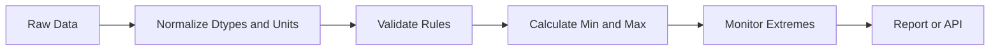

# 07- Min Max

## Overview

Pandas provides `min()` and `max()` reductions for finding the smallest and largest values in a Series or DataFrame.

They are fundamental for:

```text
range analysis
data validation
monitoring
reporting
threshold detection
business metrics
operational analytics
```

Typical backend and data-engineering examples include:

```text
minimum order value
maximum transaction value
minimum API latency
maximum processing time
lowest inventory level
highest daily revenue
earliest or latest event timestamp
```

The basic operations are simple:

```python
minimum = series.min()
maximum = series.max()
```

Production correctness depends on more than calling the methods. The selected population, dtype, missing-value policy, units, duplicates, and aggregation grain all affect the meaning of the result.

---

## Basic Syntax

For a Series:

```python
minimum = orders["revenue"].min()
maximum = orders["revenue"].max()
```

For a DataFrame:

```python
column_minimums = orders.min(numeric_only=True)
column_maximums = orders.max(numeric_only=True)
```

The result depends on the object and operation:

| Input | Operation | Typical Output |
| --- | --- | --- |
| `Series` | `min()` | Scalar |
| `Series` | `max()` | Scalar |
| `DataFrame` | `min()` | Series |
| `DataFrame` | `max()` | Series |
| Grouped DataFrame | `min()` / `max()` | Grouped result |

The default axis behavior for DataFrames is column-wise.

---

## Example Dataset

```python
import pandas as pd


orders = pd.DataFrame(
    {
        "order_id": [1001, 1002, 1003, 1004, 1005],
        "customer_id": [101, 102, 101, 103, 102],
        "revenue": [100.0, 250.0, 300.0, 50.0, 5000.0],
        "status": [
            "completed",
            "completed",
            "completed",
            "failed",
            "completed",
        ],
    }
)
```

Find the minimum and maximum revenue:

```python
minimum_revenue = orders["revenue"].min()
maximum_revenue = orders["revenue"].max()
```

Result:

```text
minimum_revenue = 50.0
maximum_revenue = 5000.0
```

---

## Why `min()` and `max()` Matter

Minimum and maximum values often define operational boundaries.

For example:

```text
minimum inventory
maximum order value
minimum API latency
maximum API latency
```

These values can reveal:

```text
business extremes
invalid records
unexpected spikes
data-entry errors
system incidents
```

They are also useful inputs to other metrics.

For example:

```python
revenue_range = (
    orders["revenue"].max()
    - orders["revenue"].min()
)
```

A large range may indicate a highly skewed distribution or an anomalous record.

---

## Minimum and Maximum Are Different From Mean

Suppose transaction values are:

```text
100
120
130
150
5000
```

Then:

```python
values = pd.Series(
    [100, 120, 130, 150, 5000]
)

minimum = values.min()
maximum = values.max()
mean = values.mean()
median = values.median()
```

These represent different characteristics:

```text
minimum → smallest observation
maximum → largest observation
mean    → arithmetic average
median  → central observation
```

Do not use `max()` as a substitute for a high percentile when the requirement is something like:

```text
"99th percentile latency"
```

Maximum represents one observation, while a percentile describes a distribution threshold.

---

## Missing Values

By default, `min()` and `max()` generally skip missing values.

Example:

```python
values = pd.Series(
    [100.0, None, 300.0]
)

minimum = values.min()
maximum = values.max()
```

The missing value does not normally become the minimum or maximum.

Check completeness separately:

```python
missing_count = values.isna().sum()
```

A valid-looking minimum or maximum does not prove that the underlying dataset is complete.

---

## `skipna`

The missing-value behavior can be controlled with `skipna`:

```python
minimum = values.min(
    skipna=True
)

maximum = values.max(
    skipna=True
)
```

When missing values should invalidate the metric, define that rule explicitly rather than depending on default reduction behavior.

For production pipelines, a useful pattern is:

```text
validate completeness
→ calculate metric
```

rather than:

```text
calculate metric
→ assume completeness
```

---

## Empty Series

Consider an empty numeric Series:

```python
empty = pd.Series(
    dtype="float64"
)

minimum = empty.min()
maximum = empty.max()
```

There are no observations from which a true minimum or maximum can be obtained.

Pandas represents the result using missing-value semantics rather than inventing an actual observation.

Handle this explicitly in production workflows:

```python
if empty.empty:
    raise ValueError(
        "Cannot calculate min/max for empty input."
    )
```

Whether empty input should instead produce a nullable result is a business and API contract decision.

---

## `min()` and `max()` on DataFrames

For numeric columns:

```python
minimums = orders.min(
    numeric_only=True
)

maximums = orders.max(
    numeric_only=True
)
```

The result is a Series where each element represents the reduction for one column.

Conceptually:

```text
DataFrame
    ↓
column-wise reduction
    ↓
Series of minimum values
```

For example:

```text
customer_id    101
revenue         50
```

and:

```text
customer_id    103
revenue       5000
```

The exact columns depend on the dtypes and selected columns.

---

## Explicit Column Selection

In production code, explicitly select the metrics you intend to analyze:

```python
revenue_min = orders[
    "revenue"
].min()

revenue_max = orders[
    "revenue"
].max()
```

This is often safer than:

```python
orders.min()
```

because broad reductions can accidentally include new columns added by upstream schema changes.

Explicit selection makes the metric contract clearer.

---

## Grouped Minimum and Maximum

To find the lowest and highest order value per customer:

```python
customer_extremes = (
    orders
    .groupby(
        "customer_id",
        as_index=False,
    )
    .agg(
        minimum_order_value=(
            "revenue",
            "min",
        ),
        maximum_order_value=(
            "revenue",
            "max",
        ),
    )
)
```

The output grain is:

```text
one row = one customer
```

This is different from calculating global extremes across all orders.

---

## Grouped Minimum and Maximum by Region

```python
regional_extremes = (
    orders
    .groupby(
        "region",
        as_index=False,
    )
    .agg(
        min_revenue=(
            "revenue",
            "min",
        ),
        max_revenue=(
            "revenue",
            "max",
        ),
    )
)
```

This is useful for:

```text
regional reporting
inventory analysis
operational monitoring
financial reporting
```

Always document the grouping key because changing the grain changes the interpretation.

---

## `min()` and `max()` With Datetime

Datetime values can be reduced naturally.

```python
events = pd.DataFrame(
    {
        "event_id": [1, 2, 3],
        "created_at": pd.to_datetime(
            [
                "2026-09-10 08:15:00",
                "2026-09-10 10:30:00",
                "2026-09-10 09:00:00",
            ]
        ),
    }
)

earliest = events[
    "created_at"
].min()

latest = events[
    "created_at"
].max()
```

This can answer:

```text
earliest event received
latest event received
first transaction timestamp
last processed timestamp
```

Do not compare datetime strings blindly when formats or timezone semantics are inconsistent.

---

## Timezone Awareness

Normalize timezone semantics before comparing timestamps.

Prefer:

```python
events["created_at"] = pd.to_datetime(
    events["created_at"],
    utc=True,
    errors="raise",
)
```

Then:

```python
earliest = events[
    "created_at"
].min()

latest = events[
    "created_at"
].max()
```

For distributed systems, UTC normalization avoids many cross-service interpretation errors.

---

## String Values

`min()` and `max()` can operate on strings according to their ordering semantics.

Example:

```python
statuses = pd.Series(
    ["completed", "failed", "pending"]
)

minimum = statuses.min()
maximum = statuses.max()
```

The result reflects lexical ordering, not business priority.

Do not assume:

```text
max(status)
```

means:

```text
most important status
```

For business ordering, use an explicitly ordered categorical dtype or a mapping.

---

## Categorical Data

Suppose order statuses have a business priority:

```text
pending
processing
completed
failed
```

Define that ordering explicitly rather than relying on lexical ordering.

```python
status_order = pd.CategoricalDtype(
    categories=[
        "pending",
        "processing",
        "completed",
        "failed",
    ],
    ordered=True,
)

orders["status"] = orders[
    "status"
].astype(status_order)
```

Then minimum and maximum reflect the defined category ordering.

---

## Numeric Cleaning

External data may contain values such as:

```text
"$1,250.00"
"500"
"unknown"
""
```

Normalize before calculating extrema.

For example:

```python
orders["revenue"] = (
    orders["revenue"]
    .astype("string")
    .str.replace("$", "", regex=False)
    .str.replace(",", "", regex=False)
)

orders["revenue"] = pd.to_numeric(
    orders["revenue"],
    errors="coerce",
)
```

Then inspect invalid values before relying on:

```python
orders["revenue"].min()
orders["revenue"].max()
```

---

## Detecting Invalid Values

Suppose revenue should never be negative.

```python
invalid = orders.loc[
    orders["revenue"] < 0
]

if not invalid.empty:
    raise ValueError(
        "Negative revenue values detected."
    )
```

This is an important distinction:

```text
min()
→ reports the minimum

validation
→ determines whether the minimum is acceptable
```

Do not confuse descriptive statistics with data-quality rules.

---

## Using `min()` and `max()` for Validation

Extrema can be used as simple boundary checks:

```python
revenue_min = orders["revenue"].min()
revenue_max = orders["revenue"].max()

if revenue_min < 0:
    raise ValueError(
        "Revenue cannot be negative."
    )

if revenue_max > 1_000_000:
    raise ValueError(
        "Revenue exceeds configured maximum."
    )
```

However, a threshold should reflect the domain.

For example, a legitimate enterprise transaction may exceed a threshold that would be unreasonable for a consumer application.

---

## Validation Versus Statistics

These are separate responsibilities:

```text
Statistics
→ What values occurred?

Validation
→ Are those values acceptable?
```

A production pipeline can combine both:



The validation stage should not silently mutate invalid values unless the transformation policy explicitly allows it.

---

## Minimum and Maximum After Filtering

The population must be scoped before calculating the metric.

Example:

```python
completed = orders.loc[
    orders["status"].eq("completed")
]

maximum_completed_order = completed[
    "revenue"
].max()
```

This answers:

```text
largest completed order
```

It does not answer:

```text
largest order of any status
```

Filtering after the aggregation would answer a different question and can produce incorrect business results.

---

## Conditional Extremes

For a specific subset:

```python
premium_orders = orders.loc[
    orders["customer_tier"].eq("premium")
]

premium_min = premium_orders[
    "revenue"
].min()

premium_max = premium_orders[
    "revenue"
].max()
```

Keep the population definition close to the metric calculation so the logic remains reviewable.

---

## Finding the Row With the Maximum Value

`max()` returns the value, not the complete row.

To retrieve the corresponding record:

```python
max_order = orders.loc[
    orders["revenue"].idxmax()
]
```

Similarly:

```python
min_order = orders.loc[
    orders["revenue"].idxmin()
]
```

This is useful when the requirement is:

```text
Which order had the highest revenue?
```

rather than:

```text
What was the highest revenue?
```

---

## `idxmax()` and `idxmin()`

The distinction is:

| Operation | Returns |
| --- | --- |
| `max()` | Maximum value |
| `min()` | Minimum value |
| `idxmax()` | Index of maximum |
| `idxmin()` | Index of minimum |

Example:

```python
max_index = orders[
    "revenue"
].idxmax()

max_order = orders.loc[
    max_index
]
```

Be careful when the DataFrame index is not a stable business identifier.

The safest approach is often to retrieve the row and then use the actual key:

```python
max_order_id = orders.loc[
    orders["revenue"].idxmax(),
    "order_id",
]
```

---

## Ties

Suppose two orders have the same maximum value:

```text
order_id | revenue
---------|--------
1001     | 5000
1002     | 5000
```

`max()` returns:

```text
5000
```

but that does not tell you how many rows share the maximum.

Find all matching rows:

```python
maximum_revenue = orders[
    "revenue"
].max()

maximum_orders = orders.loc[
    orders["revenue"].eq(
        maximum_revenue
    )
]
```

This is important when the business requirement is:

```text
all orders tied for the maximum
```

rather than:

```text
one maximum order
```

---

## Top-N Versus Maximum

Use `max()` for exactly one statistic:

```python
maximum = orders["revenue"].max()
```

Use `nlargest()` when you need the largest records:

```python
top_orders = orders.nlargest(
    10,
    "revenue",
)
```

This distinction matters in operational reporting:

```text
maximum transaction
```

versus:

```text
top 10 transactions
```

---

## Minimum and Maximum of Multiple Columns

For selected metrics:

```python
extremes = orders[
    [
        "revenue",
        "discount",
        "shipping_cost",
    ]
].agg(
    [
        "min",
        "max",
    ]
)
```

This creates a compact report of column-wise extrema.

Use explicit columns to avoid accidentally changing the report when unrelated columns are added.

---

## Combining Statistics

A reporting pipeline may need several metrics:

```python
revenue_stats = orders[
    "revenue"
].agg(
    [
        "min",
        "max",
        "mean",
        "median",
    ]
)
```

This gives a more complete distribution picture:

```text
min
max
mean
median
```

A large difference between:

```text
max
```

and:

```text
median
```

can indicate skew or potentially anomalous values.

---

## Outlier Investigation

A maximum value should not automatically be classified as an outlier.

For example:

```text
maximum revenue = 100,000
```

could be:

```text
valid enterprise transaction
```

or:

```text
data-entry error
```

A production validation process should combine:

```text
domain constraints
+
distribution analysis
+
historical comparison
+
business context
```

rather than rejecting every extreme value.

---

## SQL Equivalents

For PostgreSQL:

```sql
SELECT
    MIN(revenue) AS minimum_revenue,
    MAX(revenue) AS maximum_revenue
FROM orders;
```

Grouped:

```sql
SELECT
    customer_id,
    MIN(revenue) AS minimum_order_value,
    MAX(revenue) AS maximum_order_value
FROM orders
GROUP BY customer_id;
```

For database-backed ETL, these operations can often be pushed into SQL when Pandas does not need the underlying rows.

---

## Database Pushdown

Instead of:

```text
PostgreSQL
    ↓
millions of rows
    ↓
Pandas
    ↓
min / max
```

prefer, where appropriate:

```text
PostgreSQL
    ↓
MIN / MAX
    ↓
small result
    ↓
Pandas
```

Example with SQLAlchemy:

```python
from sqlalchemy import text


query = text(
    """
    SELECT
        MIN(revenue) AS min_revenue,
        MAX(revenue) AS max_revenue
    FROM orders
    WHERE status = :status
    """
)

with engine.connect() as connection:
    result = connection.execute(
        query,
        {"status": "completed"},
    ).mappings().one()
```

This reduces:

```text
network transfer
Pandas memory usage
worker processing
```

---

## API Data

For API responses:

```python
transactions = pd.DataFrame(
    response["items"]
)

transactions["amount"] = pd.to_numeric(
    transactions["amount"],
    errors="raise",
)

minimum_amount = transactions[
    "amount"
].min()

maximum_amount = transactions[
    "amount"
].max()
```

Before calculating production metrics, validate:

```text
response completeness
pagination
numeric types
currency
duplicate IDs
missing records
```

Otherwise an API page may contain only a partial population.

---

## Pagination Trap

Suppose an API returns:

```text
100 records per page
```

and the first page has:

```python
page["amount"].max()
```

That is:

```text
maximum on page 1
```

not necessarily:

```text
maximum across the dataset
```

For complete reporting, pagination must be handled correctly before calculating global extrema.

---

## Parquet Workflow

For Parquet:

```python
orders = pd.read_parquet(
    "orders.parquet",
    columns=[
        "order_id",
        "revenue",
        "status",
    ],
)

completed = orders.loc[
    orders["status"].eq("completed")
]

minimum_revenue = completed[
    "revenue"
].min()

maximum_revenue = completed[
    "revenue"
].max()
```

Selecting only required columns reduces unnecessary I/O and memory usage.

Parquet also works well with partitioned datasets when filtering can eliminate irrelevant partitions before data reaches Pandas.

---

## Performance Considerations

`min()` and `max()` are reductions that can generally be computed with a single pass through the relevant values.

The practical cost is influenced by:

```text
number of rows
dtype
number of columns
group cardinality
memory access
data source
```

For ordinary numeric Series, the reduction itself is usually not the bottleneck.

The larger cost may be:

```text
loading unnecessary data
transferring rows from a database
materializing large intermediate DataFrames
```

Optimize data movement before micro-optimizing the reduction.

---

## Vectorization

Prefer:

```python
orders["revenue"].max()
```

over a Python loop:

```python
maximum = float("-inf")

for value in orders["revenue"]:
    maximum = max(maximum, value)
```

The Pandas reduction is clearer, more idiomatic, and implemented through optimized library operations.

---

## Memory Considerations

Avoid loading columns that are irrelevant to the extrema calculation.

Prefer:

```python
orders = pd.read_parquet(
    "orders.parquet",
    columns=["revenue"],
)

maximum = orders[
    "revenue"
].max()
```

instead of loading a wide dataset containing:

```text
customer profiles
product metadata
large JSON strings
unused dimensions
```

when only one numeric column is required.

---

## Batch Processing

Minimum and maximum are naturally composable across batches.

For example:

```python
global_min = None
global_max = None

for batch in batches:
    batch_min = batch["revenue"].min()
    batch_max = batch["revenue"].max()

    if pd.notna(batch_min):
        global_min = (
            batch_min
            if global_min is None
            else min(global_min, batch_min)
        )

    if pd.notna(batch_max):
        global_max = (
            batch_max
            if global_max is None
            else max(global_max, batch_max)
        )
```

This allows extrema to be calculated without holding every batch simultaneously in memory.

Conceptually:

```text
global min = min(batch minimums)
global max = max(batch maximums)
```

This property is useful for chunked ETL systems.

---

## Distributed Processing

Minimum and maximum are associative reductions:

```text
min(
    min(batch_1),
    min(batch_2),
    min(batch_3)
)

max(
    max(batch_1),
    max(batch_2),
    max(batch_3)
)
```

This makes them suitable for distributed data processing systems.

For workloads larger than a practical Pandas memory footprint, engines such as:

```text
Spark
DuckDB
warehouse SQL
distributed processing systems
```

may be more appropriate.

---

## Monitoring Extremes

Minimum and maximum are useful for anomaly detection.

Example:

```python
metrics = {
    "revenue_min": float(
        orders["revenue"].min()
    ),
    "revenue_max": float(
        orders["revenue"].max()
    ),
}
```

Compare against historical ranges:

```text
current maximum
vs.
historical maximum
```

A sudden change can indicate:

```text
pricing change
business event
data corruption
unit conversion bug
duplicate ingestion
upstream schema change
```

Do not alert on the metric alone without understanding expected seasonality and business behavior.

---

## Monitoring API Latency

Suppose a service logs request duration:

```python
latencies = pd.Series(
    [24, 31, 28, 35, 2200],
    dtype="int64",
)

minimum_latency = latencies.min()
maximum_latency = latencies.max()
median_latency = latencies.median()
```

The maximum indicates the slowest observed request, but it is often insufficient for service-level monitoring.

For production latency analysis, also use:

```text
p50
p95
p99
error rate
request volume
```

Maximum can fluctuate heavily because it depends on a single observation.

---

## Security Considerations

Extrema can expose sensitive values.

Examples:

```text
highest employee compensation
largest customer purchase
maximum account balance
largest tenant usage
```

Authorization should happen before calculating the metric.

A safer data flow is:

```text
authenticate
→ authorize data scope
→ filter tenant / account
→ aggregate
→ return result
```

Do not calculate global metrics and assume response-level filtering provides equivalent isolation.

---

## Reliability Considerations

For important business metrics, store enough context to reproduce them:

```text
dataset version
reporting window
population filter
metric definition
currency
unit
calculation timestamp
source system
```

For example:

```text
Metric: Maximum Completed Order Value
Population: completed orders
Window: 2026-09-10 UTC
Currency: USD
Source: PostgreSQL orders
Calculation: MAX(revenue)
```

This prevents ambiguous metrics when upstream data changes.

---

## Common Mistakes

### Treating Maximum as a Percentile

Incorrect:

```python
maximum = latency.max()
```

when the requirement is:

```text
p99 latency
```

Use the appropriate percentile calculation instead.

---

### Calculating Before Filtering

Incorrect:

```python
maximum = orders["revenue"].max()

completed = orders.loc[
    orders["status"].eq("completed")
]
```

when the requirement is:

```text
maximum completed revenue
```

Filter first:

```python
completed = orders.loc[
    orders["status"].eq("completed")
]

maximum = completed[
    "revenue"
].max()
```

---

### Ignoring Duplicates

A duplicate record can make:

```text
maximum
```

look valid while still representing corrupted data.

Validate unique business keys where appropriate.

---

### Assuming `max()` Finds the Record

This:

```python
orders["revenue"].max()
```

returns a value.

It does not identify the complete row.

Use:

```python
orders.loc[
    orders["revenue"].idxmax()
]
```

when the record itself is required.

---

### Ignoring Ties

`idxmax()` identifies one index.

If multiple rows share the maximum, retrieve all matches:

```python
maximum = orders[
    "revenue"
].max()

top_orders = orders.loc[
    orders["revenue"].eq(maximum)
]
```

---

### Comparing Raw Strings

Values such as:

```text
"100"
"20"
"9"
```

must be converted to numeric values before calculating numeric extrema.

Otherwise ordering can be lexical rather than numeric.

---

### Using Broad DataFrame Reductions

Avoid:

```python
df.max()
```

when the metric contract requires one specific business column.

Explicit selection improves:

```text
correctness
readability
schema stability
```

---

## Interview Traps

### `max()` Versus `idxmax()`

Question:

> How do you get the row containing the largest revenue?

Answer:

```python
orders.loc[
    orders["revenue"].idxmax()
]
```

because:

```text
max()    → maximum value
idxmax() → index associated with maximum value
```

---

### Maximum Versus Top-N

Question:

> How would you return the ten largest orders?

Use:

```python
orders.nlargest(
    10,
    "revenue",
)
```

not repeated calls to `max()`.

---

### Grouped Maximum

Question:

> How do you find the largest transaction for every customer?

Use:

```python
customer_max = (
    orders
    .groupby("customer_id")[
        "revenue"
    ]
    .max()
)
```

---

### Empty Dataset

Question:

> What happens when there are no valid observations?

Do not invent a business value.

Define whether the pipeline should produce:

```text
null
empty result
zero
error
```

based on the metric contract.

---

## Production Checklist

Before publishing a minimum or maximum metric, verify:

```text
[ ] Correct source selected
[ ] Correct reporting period
[ ] Correct population filter
[ ] Correct aggregation grain
[ ] Numeric/datetime dtype validated
[ ] Missing-value policy defined
[ ] Duplicate policy defined
[ ] Units and currency normalized
[ ] Empty input behavior defined
[ ] Ties handled where required
[ ] Database aggregation considered
[ ] Metric monitored against historical behavior
```

---

## Key Takeaways

- `min()` and `max()` return the smallest and largest observed values, but the result is meaningful only when the population, grain, dtype, and units are correct.
- Filter the intended population before calculating extrema, and use `idxmin()` or `idxmax()` when the corresponding row rather than only the value is required.
- Missing values, duplicates, incorrect numeric types, string ordering, mixed units, and incomplete API pagination can produce misleading results without raising errors.
- Minimum and maximum compose naturally across batches, making them well suited to chunked and distributed processing; database pushdown is often preferable when the source already supports efficient aggregation.
- Use extrema for validation and monitoring, but do not confuse a maximum with a percentile or assume every extreme value is an invalid outlier.