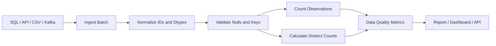

# 08- Count And Nunique

## Overview

`count()` and `nunique()` answer two different but closely related questions:

```text
count()
→ How many non-missing observations are present?

nunique()
→ How many distinct values are present?
```

These operations are fundamental for:

```text
data-quality checks
customer and user counts
transaction analysis
cardinality analysis
ETL validation
reporting
API payload validation
database reconciliation
```

For example, in an orders dataset:

```text
count(order_id)
→ number of orders with a non-null order ID

nunique(customer_id)
→ number of distinct customers represented
```

Confusing the two can produce materially incorrect business metrics. A dataset containing 1,000 orders from 100 customers has:

```text
order count    = 1,000
customer count = 100
```

The correct operation depends on whether the requirement concerns observations or unique entities.

---

## Example Dataset

```python
import pandas as pd


orders = pd.DataFrame(
    {
        "order_id": [
            "O1001",
            "O1002",
            "O1003",
            "O1004",
            None,
        ],
        "customer_id": [
            "C101",
            "C102",
            "C101",
            "C103",
            "C102",
        ],
        "status": [
            "completed",
            "completed",
            "completed",
            "failed",
            "completed",
        ],
        "revenue": [
            100.0,
            250.0,
            300.0,
            50.0,
            500.0,
        ],
    }
)
```

Basic operations:

```python
order_count = orders["order_id"].count()
customer_count = orders["customer_id"].nunique()
```

The first measures non-null order IDs. The second measures distinct customer IDs.

---

## `count()`

`count()` counts non-missing values.

For a Series:

```python
count = orders["customer_id"].count()
```

For a DataFrame:

```python
counts = orders.count()
```

The DataFrame result is a Series containing the non-null count for each column.

Conceptually:

```text
DataFrame
    ↓
count non-null observations
    ↓
Series of counts
```

---

## What `count()` Does Not Mean

`count()` is not always equivalent to the number of rows.

Consider:

```text
row | order_id
----|---------
1   | O1001
2   | O1002
3   | O1003
4   | O1004
5   | null
```

Then:

```python
len(orders)
```

returns:

```text
5
```

while:

```python
orders["order_id"].count()
```

returns:

```text
4
```

The distinction is important.

```text
len(df)
→ physical/logical row count

df["column"].count()
→ non-null values in that column
```

For a column that is guaranteed non-null, they may happen to match.

---

## `count()` and Missing Values

Missing values are excluded from `count()`:

```python
values = pd.Series(
    [10, 20, None, 40]
)

result = values.count()
```

Result:

```text
3
```

This makes `count()` useful for measuring populated observations.

For data-quality monitoring:

```python
value_count = orders["revenue"].count()
missing_count = orders["revenue"].isna().sum()
```

Together:

```text
observed values
+
missing values
=
total rows
```

when the Series corresponds one-to-one with DataFrame rows.

---

## Counting Rows

For total row count:

```python
row_count = len(orders)
```

or:

```python
row_count = orders.shape[0]
```

Do not replace row count with:

```python
orders["some_column"].count()
```

unless that column is guaranteed to be non-null.

| Requirement | Recommended Operation |
| --- | --- |
| Total DataFrame rows | `len(df)` |
| Number of non-null values in a column | `df["column"].count()` |
| Number of non-null values by column | `df.count()` |
| Number of distinct non-null values | `df["column"].nunique()` |
| Number of distinct values including missing | `df["column"].nunique(dropna=False)` |

---

## Counting DataFrame Columns

For each column:

```python
column_counts = orders.count()
```

Example interpretation:

```text
order_id      4
customer_id   5
status        5
revenue       5
```

This can quickly reveal missingness.

A simple completeness report:

```python
completeness = pd.DataFrame(
    {
        "non_null": orders.count(),
        "null": orders.isna().sum(),
        "total": len(orders),
    }
)

completeness["null_rate"] = (
    completeness["null"]
    / completeness["total"]
)
```

This pattern is useful for ETL validation and schema monitoring.

---

## `nunique()`

`nunique()` counts distinct values.

Example:

```python
unique_customers = orders[
    "customer_id"
].nunique()
```

If the customer IDs are:

```text
C101
C102
C101
C103
C102
```

then:

```text
nunique() = 3
```

The operation answers:

```text
How many different values occur?
```

rather than:

```text
How many observations exist?
```

---

## Why `nunique()` Matters

Many business metrics are really cardinality metrics:

```text
active customers
unique users
distinct products
unique accounts
distinct sessions
unique devices
```

For example:

```python
active_customers = orders[
    "customer_id"
].nunique()
```

This is often more meaningful than:

```python
orders["customer_id"].count()
```

because the latter counts order-level observations, not customers.

---

## `count()` Versus `nunique()`

| Operation | Measures | Example |
| --- | --- | --- |
| `count()` | Non-null observations | Number of populated customer IDs |
| `nunique()` | Distinct non-null values | Number of unique customers |
| `len(df)` | Rows | Number of order rows |

Consider:

```text
customer_id
-----------
C101
C101
C102
C103
C103
```

Then:

```text
count()  = 5
nunique() = 3
```

Neither is inherently correct. The business question determines the correct metric.

---

## Missing Values With `nunique()`

By default, `nunique()` excludes missing values.

Example:

```python
customers = pd.Series(
    ["C101", "C102", "C101", None]
)

unique_count = customers.nunique()
```

Result:

```text
2
```

because:

```text
C101
C102
```

are the two distinct non-null values.

To include missing as a distinct category:

```python
unique_count = customers.nunique(
    dropna=False
)
```

The result becomes:

```text
3
```

where the third distinct value represents missingness.

---

## Missing Values Are Not a Customer

For most business reporting:

```text
None
NaN
pd.NA
```

should not be counted as a customer.

Therefore:

```python
orders["customer_id"].nunique()
```

is usually the appropriate choice for:

```text
distinct identified customers
```

Use:

```python
dropna=False
```

only when the requirement explicitly treats missingness as a distinct category.

---

## Counting Unique Records

A common requirement is:

> How many unique customers placed an order?

Use:

```python
customer_count = orders[
    "customer_id"
].nunique()
```

A different requirement:

> How many rows contain a customer ID?

Use:

```python
customer_id_count = orders[
    "customer_id"
].count()
```

The difference can be summarized as:

```text
count
→ observation volume

nunique
→ entity cardinality
```

---

## Grouped `count()`

Suppose we want the number of orders per customer:

```python
orders_per_customer = (
    orders
    .groupby("customer_id")
    .size()
)
```

or, when counting non-null values of a specific column:

```python
orders_per_customer = (
    orders
    .groupby("customer_id")[
        "order_id"
    ]
    .count()
)
```

These are not always interchangeable.

`size()` counts rows in each group.

`count()` counts non-null values of the selected Series.

---

## `groupby().size()` Versus `groupby().count()`

This distinction is critical.

Given:

```text
customer_id | order_id
------------|---------
C101        | O1001
C101        | null
C102        | O1003
```

Then:

```python
orders.groupby(
    "customer_id"
).size()
```

counts:

```text
C101 → 2
C102 → 1
```

while:

```python
orders.groupby(
    "customer_id"
)["order_id"]
.count()
```

counts:

```text
C101 → 1
C102 → 1
```

Use:

```text
size()
→ rows per group

count()
→ non-null values in a selected column
```

---

## Grouped `nunique()`

For unique products purchased by each customer:

```python
unique_products = (
    orders
    .groupby("customer_id")
    .agg(
        unique_products=(
            "product_id",
            "nunique",
        )
    )
)
```

This produces:

```text
one row = one customer
```

with the number of distinct products associated with that customer.

This pattern is common in:

```text
customer analytics
recommendation systems
fraud analysis
usage reporting
```

---

## Multiple Counts and Cardinalities

A report may need both observation volume and entity counts:

```python
customer_metrics = (
    orders
    .groupby("customer_id")
    .agg(
        order_count=(
            "order_id",
            "count",
        ),
        unique_products=(
            "product_id",
            "nunique",
        ),
        total_revenue=(
            "revenue",
            "sum",
        ),
    )
    .reset_index()
)
```

This produces a more useful customer-level dataset:

```text
customer
    ↓
number of orders
    ↓
number of distinct products
    ↓
total revenue
```

---

## Cardinality

Cardinality describes how many distinct values exist in a column.

For example:

```python
customer_cardinality = orders[
    "customer_id"
].nunique()

status_cardinality = orders[
    "status"
].nunique()
```

A rough interpretation might be:

```text
customer_id
→ high cardinality

status
→ low cardinality
```

Cardinality matters for:

```text
memory optimization
database indexing
grouping
categorical encoding
data validation
schema understanding
```

---

## Detecting Unexpected Cardinality

Suppose a status column should contain only:

```text
pending
processing
completed
failed
```

Validate it:

```python
expected_statuses = {
    "pending",
    "processing",
    "completed",
    "failed",
}

actual_statuses = set(
    orders["status"]
    .dropna()
    .unique()
)

unexpected = actual_statuses - expected_statuses

if unexpected:
    raise ValueError(
        "Unexpected statuses: "
        f"{sorted(unexpected)}"
    )
```

`nunique()` can support the check, but exact value validation is still required.

---

## Distinct Count Versus Unique-Value Listing

Use:

```python
orders["customer_id"].nunique()
```

when you need:

```text
the number
```

Use:

```python
orders["customer_id"].unique()
```

when you need:

```text
the actual distinct values
```

And use:

```python
orders["customer_id"].value_counts()
```

when you need:

```text
frequency of each distinct value
```

| Operation | Purpose |
| --- | --- |
| `nunique()` | Number of distinct values |
| `unique()` | Distinct values |
| `value_counts()` | Frequency per distinct value |
| `count()` | Non-null observation count |

---

## Data Quality With Counts

`count()` and `nunique()` are particularly useful for detecting data-quality issues.

Example:

```python
quality = {
    "row_count": len(orders),
    "customer_id_count": orders[
        "customer_id"
    ].count(),
    "unique_customer_count": orders[
        "customer_id"
    ].nunique(),
}
```

A suspicious result might be:

```text
row_count              = 1,000,000
customer_id_count      = 999,999
unique_customer_count  = 999,950
```

This tells you immediately that:

```text
one customer ID is missing
many customer IDs repeat
```

The next investigation can focus on whether those repeats are expected.

---

## Duplicate Detection

`nunique()` can help identify whether a column is unique.

For a candidate unique key:

```python
row_count = len(orders)

unique_order_ids = orders[
    "order_id"
].nunique()

if unique_order_ids != row_count:
    raise ValueError(
        "order_id is not unique."
    )
```

However, this is not sufficient when nulls are allowed.

For a strict business key:

```python
order_ids = orders["order_id"]

if order_ids.isna().any():
    raise ValueError(
        "order_id contains missing values."
    )

if order_ids.nunique() != len(order_ids):
    raise ValueError(
        "Duplicate order_id values detected."
    )
```

This explicitly validates both:

```text
completeness
+
uniqueness
```

---

## Unique Percentage

A useful data-quality metric is the proportion of distinct values:

```python
unique_ratio = (
    orders["customer_id"].nunique()
    / orders["customer_id"].count()
)
```

This can help characterize a field.

For example:

```text
1.0
→ every populated value is distinct

0.01
→ many rows share the same values
```

The meaning depends heavily on the business domain.

A low ratio is normal for:

```text
status
country
product category
```

but may be suspicious for:

```text
transaction_id
account_id
event_id
```

---

## Duplicate Ratio

For an expected unique key:

```python
non_null_count = orders[
    "order_id"
].count()

unique_count = orders[
    "order_id"
].nunique()

duplicate_observation_count = (
    non_null_count
    - unique_count
)
```

This provides a simple measure of repeated identifiers.

Do not assume every repeated value is a duplicate record. A business entity such as `customer_id` is expected to repeat across orders.

---

## Grouped Cardinality

For unique customers per region:

```python
regional_customers = (
    orders
    .groupby("region")
    .agg(
        unique_customers=(
            "customer_id",
            "nunique",
        )
    )
    .reset_index()
)
```

This is useful for:

```text
regional dashboards
sales reporting
tenant usage
market analysis
```

The grouping key defines the reporting grain.

---

## Unique Customers Per Day

For event data:

```python
events["event_time"] = pd.to_datetime(
    events["event_time"],
    utc=True,
    errors="raise",
)

events["event_date"] = (
    events["event_time"].dt.date
)

daily_users = (
    events
    .groupby("event_date")
    .agg(
        unique_users=(
            "user_id",
            "nunique",
        )
    )
    .reset_index()
)
```

The result answers:

```text
How many distinct users generated events each day?
```

This is a common analytics pattern.

---

## Unique Users Across the Whole Period

Do not sum daily unique users to get period-wide unique users.

For example:

```text
Monday    → 1,000 users
Tuesday   → 1,100 users
```

Some users may appear on both days.

Therefore:

```python
period_users = events[
    "user_id"
].nunique()
```

is the correct calculation for:

```text
distinct users across the entire reporting period
```

while:

```python
daily_users["unique_users"].sum()
```

calculates:

```text
sum of daily distinct-user counts
```

These are different metrics.

---

## SQL Equivalents

The Pandas operations map naturally to SQL.

Pandas:

```python
orders["customer_id"].count()
```

SQL:

```sql
SELECT COUNT(customer_id)
FROM orders;
```

Pandas:

```python
orders["customer_id"].nunique()
```

SQL:

```sql
SELECT COUNT(DISTINCT customer_id)
FROM orders;
```

For total rows:

```sql
SELECT COUNT(*)
FROM orders;
```

The distinction between:

```text
COUNT(*)
COUNT(column)
COUNT(DISTINCT column)
```

is important when translating between SQL and Pandas.

---

## SQL Grouped Example

```sql
SELECT
    customer_id,
    COUNT(order_id) AS order_count,
    COUNT(DISTINCT product_id) AS unique_products
FROM orders
GROUP BY customer_id;
```

Equivalent Pandas:

```python
customer_metrics = (
    orders
    .groupby("customer_id")
    .agg(
        order_count=(
            "order_id",
            "count",
        ),
        unique_products=(
            "product_id",
            "nunique",
        ),
    )
)
```

The resulting data model is:

```text
one customer
    ↓
many orders
    ↓
count orders
    +
count distinct products
```

---

## Database Pushdown

For large PostgreSQL tables, distinct counting can be expensive and transferring all rows into Pandas is often unnecessary.

Prefer:

```text
PostgreSQL
    ↓
COUNT / COUNT(DISTINCT)
    ↓
small result
    ↓
Pandas
```

instead of:

```text
PostgreSQL
    ↓
millions of rows
    ↓
Pandas
    ↓
count / nunique
```

Example:

```sql
SELECT
    COUNT(*) AS order_count,
    COUNT(customer_id) AS populated_customer_ids,
    COUNT(DISTINCT customer_id) AS unique_customers
FROM orders
WHERE created_at >= :start_time
  AND created_at < :end_time;
```

This can reduce:

```text
network traffic
memory usage
worker CPU
processing time
```

---

## REST API Example

For API data:

```python
users = pd.DataFrame(
    response["items"]
)

user_count = users[
    "user_id"
].count()

unique_users = users[
    "user_id"
].nunique()
```

Be careful about pagination.

If the API response contains only one page:

```python
users["user_id"].nunique()
```

represents:

```text
unique users on this page
```

not necessarily:

```text
unique users across the API dataset
```

Complete pagination must be handled before calculating global cardinality.

---

## Duplicate API Records

APIs can occasionally return duplicate records due to:

```text
retry behavior
pagination bugs
event replay
upstream replication
```

Blindly deduplicating all records can also be dangerous.

First determine the intended business key:

```python
users = users.drop_duplicates(
    subset=["user_id"]
)
```

only when one row per user is actually the desired grain.

Do not deduplicate a legitimate event stream merely because an identifier repeats.

---

## Event Data and Kafka

In event-processing systems:

```text
Kafka
  ↓
consumer
  ↓
batch
  ↓
Pandas
  ↓
count / nunique
  ↓
report
```

The same event may be delivered more than once depending on the ingestion architecture.

Therefore:

```text
event count
```

and:

```text
distinct event IDs
```

can be useful separate metrics:

```python
event_count = batch["event_id"].count()

unique_events = batch[
    "event_id"
].nunique()
```

A gap between them may indicate:

```text
replays
duplicates
upstream retries
```

but should be interpreted in the context of the system's delivery semantics.

---

## Incremental Processing

`count()` is naturally composable across batches.

For non-null counts:

```text
global count
=
sum of batch counts
```

For example:

```python
total_count = sum(
    batch["customer_id"].count()
    for batch in batches
)
```

Distinct counting is different.

You cannot generally calculate:

```text
global distinct count
=
sum of batch distinct counts
```

because the same value may appear in multiple batches.

For example:

```text
Batch 1 → C101, C102
Batch 2 → C102, C103
```

Then:

```text
batch distinct counts = 2 + 2 = 4
global distinct count = 3
```

This is a critical scalable-processing distinction.

---

## Large-Scale Distinct Counting

Exact `nunique()` can become memory-intensive for high-cardinality columns because the implementation must track distinct values.

For large workloads, consider:

```text
database aggregation
data warehouse
Spark
DuckDB
approximate distinct-count algorithms
```

when appropriate.

Approximate algorithms such as HyperLogLog can trade a small amount of accuracy for significantly lower memory requirements at very large scale.

Do not substitute approximate counts for exact counts when the metric is financially or operationally authoritative.

---

## Data Types and Cardinality

Cardinality is affected by how values are represented.

These values may look identical to a human:

```text
"C101"
" C101 "
"c101"
```

but represent different strings to Pandas.

Normalize before counting when the business identifier is case- or whitespace-insensitive:

```python
customer_ids = (
    orders["customer_id"]
    .astype("string")
    .str.strip()
    .str.upper()
)

unique_customers = (
    customer_ids.nunique()
)
```

Normalization rules should be defined by the data contract rather than applied blindly.

---

## Categorical Data

For low-cardinality repeated string columns such as:

```text
status
region
country
```

categorical dtypes can reduce memory usage:

```python
orders["status"] = orders[
    "status"
].astype("category")
```

Then:

```python
status_count = orders[
    "status"
].nunique()
```

still measures distinct categories represented in the data.

Categoricals are particularly useful when a column has:

```text
many rows
+
relatively few distinct values
```

---

## Performance Considerations

`count()` is generally inexpensive because it only needs to determine which values are non-missing.

`nunique()` can be more expensive because distinct-value tracking is required.

Performance depends on:

```text
row count
cardinality
dtype
group count
missing values
memory availability
```

For high-cardinality identifiers on millions of rows, `nunique()` can become a meaningful memory and CPU operation.

---

## Avoid Python Loops

Prefer:

```python
customer_count = orders[
    "customer_id"
].nunique()
```

over manually maintaining a Python set:

```python
customer_ids = set()

for customer_id in orders["customer_id"]:
    if pd.notna(customer_id):
        customer_ids.add(customer_id)

customer_count = len(customer_ids)
```

Pandas provides the vectorized aggregation directly and communicates intent more clearly.

A Python set can still be appropriate in streaming or custom incremental processing, but it should be an intentional design choice.

---

## Empty DataFrames

Define behavior for empty inputs.

Example:

```python
orders = pd.DataFrame(
    {
        "customer_id": pd.Series(
            dtype="string"
        )
    }
)

customer_count = orders[
    "customer_id"
].count()

unique_customers = orders[
    "customer_id"
].nunique()
```

Both values may be zero.

That does not necessarily mean:

```text
"there were zero customers"
```

It could mean:

```text
"the reporting query returned no rows"
```

This distinction matters in production reporting.

---

## Null-Only Columns

Consider:

```python
values = pd.Series(
    [None, None, None]
)

count = values.count()
unique_count = values.nunique()
unique_with_null = values.nunique(
    dropna=False
)
```

Conceptually:

```text
count()                  → 0
nunique()                → 0
nunique(dropna=False)    → 1
```

The last result treats missingness as one distinct value.

This behavior is useful to understand when defining data-quality metrics.

---

## Testing

Tests should distinguish:

```text
row count
non-null count
distinct count
```

Example:

```python
import pandas as pd


def test_count_and_nunique() -> None:
    customers = pd.Series(
        ["C101", "C102", "C101", None]
    )

    assert customers.count() == 3
    assert customers.nunique() == 2
    assert customers.nunique(
        dropna=False
    ) == 3
```

This directly verifies missing-value behavior.

---

## Testing Uniqueness

```python
def test_identifier_is_unique() -> None:
    order_ids = pd.Series(
        ["O1001", "O1002", "O1003"]
    )

    assert order_ids.notna().all()
    assert order_ids.nunique() == len(order_ids)
```

For production validation, also test the failure case:

```python
def test_duplicate_identifier_is_detected() -> None:
    order_ids = pd.Series(
        ["O1001", "O1001", "O1002"]
    )

    assert order_ids.nunique() < len(order_ids)
```

A test suite should verify business constraints rather than merely confirming that methods execute.

---

## Monitoring Data Quality

Count and cardinality metrics make useful operational signals.

For example:

```python
metrics = {
    "row_count": len(orders),
    "customer_id_non_null_count": orders[
        "customer_id"
    ].count(),
    "unique_customer_count": orders[
        "customer_id"
    ].nunique(),
    "unique_order_count": orders[
        "order_id"
    ].nunique(),
}
```

Track these over time to detect:

```text
sudden data loss
duplicate ingestion
schema changes
population changes
upstream failures
unexpected cardinality growth
```

A sudden increase in distinct `status` values can be especially useful for catching upstream enum changes.

---

## Production Data Flow

A typical ETL validation flow is:



A useful conceptual separation is:

```text
count()
→ volume

nunique()
→ cardinality

isna().sum()
→ missingness

duplicated()
→ duplication
```

These metrics complement one another.

---

## Security Considerations

Distinct counts can themselves be sensitive.

Examples:

```text
number of customers
number of accounts
number of employees
number of tenants
```

A user who cannot access underlying records may still be unauthorized to know the aggregate count.

Apply authorization before aggregation:

```python
authorized_orders = orders.loc[
    orders["tenant_id"].isin(
        authorized_tenant_ids
    )
].copy()

tenant_customer_count = (
    authorized_orders[
        "customer_id"
    ].nunique()
)
```

Avoid exposing cross-tenant cardinalities through supposedly tenant-scoped APIs.

---

## Reliability Considerations

For important metrics, document:

```text
population
time window
row grain
null policy
deduplication policy
identifier normalization
exact versus approximate counting
source system
```

For example:

```text
Metric: Daily Active Customers
Population: successful customer events
Grain: one event per row
Identifier: normalized customer_id
Null policy: exclude missing IDs
Deduplication: distinct customer_id per day
Counting method: exact
Timezone: UTC
```

This prevents two pipelines from producing different answers under the same metric name.

---

## Common Mistakes

### Using `count()` for Unique Entities

Incorrect:

```python
active_customers = orders[
    "customer_id"
].count()
```

This counts customer observations, not distinct customers.

Use:

```python
active_customers = orders[
    "customer_id"
].nunique()
```

---

### Using `nunique()` for Total Rows

Incorrect:

```python
row_count = orders[
    "customer_id"
].nunique()
```

when the requirement is:

```text
number of orders
```

Use:

```python
row_count = len(orders)
```

or count a guaranteed non-null order identifier.

---

### Confusing `groupby().size()` and `count()`

`size()` counts rows.

`count()` counts non-null values in the selected column.

Choose based on the required business definition.

---

### Summing Distinct Counts

Incorrect for period-wide unique users:

```python
daily_users["unique_users"].sum()
```

This double-counts users active on multiple days.

Calculate distinct users across the entire period:

```python
events["user_id"].nunique()
```

---

### Treating Missing as a Real Entity

Avoid:

```python
nunique(dropna=False)
```

for customer counts unless missing identifiers are intentionally treated as a distinct category.

---

### Assuming `nunique()` Proves a Key Is Valid

A uniqueness check should also consider:

```text
nullability
dtype
normalization
business scope
duplicate semantics
```

For example, comparing `"C101"` and `" c101 "` may require normalization before judging uniqueness.

---

### Deduplicating Legitimate Repeated Records

Repeated `customer_id` values are usually expected in an order table.

Do not deduplicate on a foreign key simply because `nunique()` is lower than the row count.

Validate according to the actual row grain and business key.

---

## Interview Traps

### `COUNT(*)` Versus `COUNT(column)`

In SQL:

```sql
COUNT(*)
```

counts rows.

```sql
COUNT(column)
```

excludes null values.

The Pandas distinction is similar:

```python
len(df)
```

versus:

```python
df["column"].count()
```

---

### `count()` Versus `size()`

Question:

> How many rows are in each group, even when the selected column contains nulls?

Use:

```python
df.groupby("group").size()
```

not:

```python
df.groupby("group")["column"].count()
```

---

### Distinct Customers Per Day Versus Across a Period

Question:

> Why can't daily unique-customer counts simply be summed?

Because the same customer can occur on multiple days.

Use `nunique()` at the required reporting grain.

---

### `nunique()` and Missing Values

Question:

> Does `nunique()` count `NaN` by default?

No.

Use:

```python
nunique(dropna=False)
```

when missing should be treated as a distinct value.

---

### Checking Primary-Key Uniqueness

A reasonable validation pattern is:

```python
ids = df["id"]

if ids.isna().any():
    raise ValueError(
        "Primary key contains nulls."
    )

if ids.nunique() != len(ids):
    raise ValueError(
        "Primary key contains duplicates."
    )
```

This explicitly tests the two core constraints:

```text
non-null
+
unique
```

---

## Production Checklist

Before publishing a count or distinct-count metric, verify:

```text
[ ] Correct row grain
[ ] Correct reporting population
[ ] Correct time window
[ ] Correct identifier
[ ] Null policy defined
[ ] Duplicate policy defined
[ ] Identifier normalization defined
[ ] count vs len vs size understood
[ ] Exact vs approximate distinct counting decided
[ ] API pagination completed where required
[ ] Database pushdown evaluated for large datasets
[ ] Metric monitored for unexpected cardinality changes
```

---

## Key Takeaways

- `count()` measures non-null observations, while `nunique()` measures distinct values; neither should be used interchangeably with total row count.
- `len(df)`, `Series.count()`, `groupby().size()`, and `nunique()` represent different concepts and must be selected according to the required data grain.
- Distinct counting is sensitive to missing values, duplicates, normalization, and reporting scope; `nunique(dropna=False)` should be used only when missingness is intentionally treated as a distinct category.
- Distinct counts do not generally compose by simple summation across batches or time periods because the same entity can appear in multiple partitions.
- For large production datasets, validate cardinality carefully and consider SQL/database pushdown or approximate distinct-count techniques when exact Pandas `nunique()` becomes too expensive.