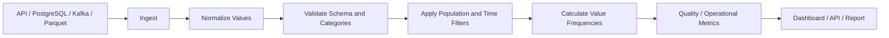

# 09- Value Counts

## Overview

`value_counts()` is a Pandas operation for calculating the frequency of each distinct value in a Series. It is one of the most useful tools for profiling categorical data, validating upstream systems, analyzing event distributions, and producing operational reports.

The central distinction is:

```text
count()
→ How many non-null observations exist?

nunique()
→ How many distinct values exist?

unique()
→ Which distinct values exist?

value_counts()
→ How often does each distinct value occur?
```

For a production backend or ETL workflow, `value_counts()` is particularly useful for:

```text
order statuses
payment methods
HTTP status codes
event types
customer segments
regions
product categories
error codes
workflow states
```

The operation itself is simple, but correct interpretation requires understanding:

```text
population
row grain
missing values
normalization
duplicates
cardinality
sorting
```

---

## Basic Syntax

The standard form is:

```python
counts = df["column"].value_counts()
```

Example:

```python
status_counts = orders["status"].value_counts()
```

Given:

```text
completed
completed
pending
failed
completed
```

the result is conceptually:

```text
completed    3
pending      1
failed       1
```

The returned object is a `Series`:

```text
Series index
→ distinct observed values

Series values
→ frequency of each value
```

By default, the frequencies are sorted from highest to lowest.

---

## Example Dataset

```python
import pandas as pd


orders = pd.DataFrame(
    {
        "order_id": [
            "O1001",
            "O1002",
            "O1003",
            "O1004",
            "O1005",
            "O1006",
        ],
        "customer_id": [
            "C101",
            "C102",
            "C101",
            "C103",
            "C102",
            "C101",
        ],
        "status": [
            "completed",
            "completed",
            "pending",
            "failed",
            "completed",
            "completed",
        ],
        "payment_method": [
            "card",
            "upi",
            "card",
            "card",
            "upi",
            "card",
        ],
        "revenue": [
            100.0,
            250.0,
            300.0,
            50.0,
            500.0,
            125.0,
        ],
    }
)
```

Calculate the distribution of statuses:

```python
status_counts = orders[
    "status"
].value_counts()
```

Calculate payment-method frequencies:

```python
payment_counts = orders[
    "payment_method"
].value_counts()
```

The same operation works for any column where frequency analysis is meaningful.

---

## Why `value_counts()` Exists

Distinct-value counts answer only one part of a data-quality or reporting question.

For example:

```python
orders["status"].nunique()
```

might return:

```text
3
```

That tells us there are three statuses, but not whether the statuses are distributed as:

```text
completed    4
pending      1
failed       1
```

or:

```text
completed    100000
pending      10
failed       2
```

`value_counts()` exposes the actual distribution.

This makes it useful for:

```text
quality diagnostics
operational dashboards
distribution monitoring
business reporting
schema profiling
```

---

## Output Structure

A typical result is:

```python
status_counts = (
    orders["status"]
    .value_counts()
)
```

Conceptually:

```text
status
-------
completed    4
pending      1
failed       1
```

The index contains the category values.

The Series values contain the counts.

For downstream systems, a flat DataFrame is often easier to consume:

```python
status_report = (
    orders["status"]
    .value_counts()
    .rename_axis("status")
    .reset_index(name="count")
)
```

Result:

```text
status       count
-----------  -----
completed       4
pending          1
failed            1
```

This format is convenient for:

```text
JSON APIs
CSV exports
Parquet reports
dashboard datasets
database inserts
```

---

## Default Ordering

By default, `value_counts()` sorts by frequency descending.

```python
counts = orders[
    "status"
].value_counts()
```

The most frequent value appears first.

Use:

```python
ascending=True
```

for least-frequent-first ordering:

```python
counts = orders[
    "status"
].value_counts(
    ascending=True
)
```

Use:

```python
sort=False
```

when frequency-based sorting should not be applied automatically:

```python
counts = orders[
    "status"
].value_counts(
    sort=False
)
```

For deterministic report ordering, explicitly sort afterward when required.

---

## Sorting by Category

To order categories by their value instead of frequency:

```python
counts = (
    orders["status"]
    .value_counts()
    .sort_index()
)
```

This is useful when the output is consumed by:

```text
tests
snapshot comparisons
deterministic exports
ordered reports
```

Do not assume the default frequency ordering is appropriate for every downstream consumer.

---

## Normalized Frequencies

Use:

```python
normalize=True
```

to return proportions instead of raw counts.

```python
distribution = (
    orders["status"]
    .value_counts(
        normalize=True
    )
)
```

Conceptually:

```text
completed    0.667
pending      0.167
failed       0.167
```

This is useful for:

```text
percentage reporting
traffic distribution
status ratios
market share-style metrics
data-quality percentages
```

The proportions represent the current population being counted.

---

## Percentage Reports

Convert proportions to percentages:

```python
status_percentages = (
    orders["status"]
    .value_counts(
        normalize=True
    )
    .mul(100)
)
```

For a reporting DataFrame:

```python
status_report = (
    orders["status"]
    .value_counts(
        normalize=True
    )
    .mul(100)
    .rename("percentage")
    .rename_axis("status")
    .reset_index()
)
```

This yields a schema suitable for an API or dashboard:

```text
status       percentage
-----------  ----------
completed        66.67
pending          16.67
failed           16.67
```

---

## Missing Values

By default, missing values are excluded.

Example:

```python
statuses = pd.Series(
    [
        "completed",
        "completed",
        "failed",
        None,
    ]
)

counts = statuses.value_counts()
```

The `None` value is not counted.

To include missing values:

```python
counts = statuses.value_counts(
    dropna=False
)
```

This is valuable for data-quality analysis because missingness itself may be significant.

---

## Missing Values in Monitoring

Suppose an order status distribution becomes:

```text
completed    90000
pending       5000
failed        4000
NaN           1000
```

The missing category could indicate:

```text
upstream schema drift
failed parsing
database nulls
API payload changes
partial ingestion
```

A production pipeline should not silently discard this signal.

For profiling, prefer:

```python
status_counts = orders[
    "status"
].value_counts(
    dropna=False
)
```

when missingness needs to be visible.

---

## `count()` Versus `value_counts()`

Consider:

```text
status
------
completed
completed
pending
failed
None
```

Then:

```python
orders["status"].count()
```

returns the number of non-null observations.

By contrast:

```python
orders["status"].value_counts()
```

returns the frequency of each distinct status.

| Operation | Meaning |
| --- | --- |
| `count()` | Number of non-null observations |
| `nunique()` | Number of distinct non-null values |
| `unique()` | Distinct values |
| `value_counts()` | Frequency of each distinct value |

These operations are related but not interchangeable.

---

## `nunique()` Versus `value_counts()`

Use `nunique()` when the only requirement is:

```text
How many different statuses exist?
```

Use `value_counts()` when the requirement is:

```text
How frequently does each status occur?
```

Example:

```python
status_cardinality = orders[
    "status"
].nunique()

status_distribution = orders[
    "status"
].value_counts()
```

The first returns one scalar.

The second returns one count per distinct value.

---

## `unique()` Versus `value_counts()`

Use:

```python
statuses = orders[
    "status"
].unique()
```

when you need the actual distinct values.

Use:

```python
status_counts = orders[
    "status"
].value_counts()
```

when you need the distribution.

A useful mental model is:

```text
unique()
→ membership

nunique()
→ cardinality

value_counts()
→ frequency distribution
```

---

## `groupby().size()` Versus `value_counts()`

For one Series:

```python
orders["status"].value_counts()
```

is the direct frequency-counting operation.

A similar result can often be produced with:

```python
orders.groupby(
    "status"
).size()
```

Use `groupby()` when the analysis requires:

```text
multiple dimensions
additional aggregations
complex grouped transformations
```

For straightforward single-column frequency analysis, `value_counts()` is more expressive.

---

## Grouped Frequency Counts

For status distribution by customer:

```python
customer_status_counts = (
    orders
    .groupby("customer_id")["status"]
    .value_counts()
)
```

The result has a MultiIndex:

```text
customer_id  status
-----------  ---------
C101         completed    2
             pending       1
C102         completed     2
C103         failed        1
```

Flatten it for reporting:

```python
customer_status_report = (
    orders
    .groupby("customer_id")["status"]
    .value_counts()
    .rename("count")
    .reset_index()
)
```

The resulting grain is:

```text
one row = one customer/status combination
```

---

## Multiple-Dimension Frequency Analysis

For payment method and order status:

```python
payment_status_counts = (
    orders
    .groupby("payment_method")["status"]
    .value_counts()
    .rename("count")
    .reset_index()
)
```

The output represents:

```text
one payment method
+
one status
=
one row
```

This is useful for:

```text
payment monitoring
conversion analysis
failure analysis
operational dashboards
```

---

## Grouped Normalized Frequencies

You can calculate proportions within each group:

```python
payment_status_share = (
    orders
    .groupby("payment_method")["status"]
    .value_counts(
        normalize=True
    )
)
```

This answers:

```text
Within each payment method,
what proportion of orders has each status?
```

The denominator is the group population, not the entire DataFrame.

This distinction is important when interpreting percentages.

---

## `dropna=False` With Grouping

When missing statuses need to remain visible:

```python
payment_status_counts = (
    orders
    .groupby("payment_method")["status"]
    .value_counts(
        dropna=False
    )
)
```

Use this for data-quality analysis where missing categories are operationally meaningful.

---

## Filtering Before Counting

The population should be defined before calculating frequencies.

For completed orders:

```python
completed_orders = orders.loc[
    orders["status"].eq("completed")
]

customer_counts = (
    completed_orders["customer_id"]
    .value_counts()
)
```

This answers:

```text
How many completed orders did each customer place?
```

It does not answer:

```text
How many total orders did each customer place?
```

The filtering condition is part of the metric definition.

---

## Conditional Status Distribution

For a reporting period:

```python
reporting_orders = orders.loc[
    orders["created_at"].between(
        "2026-09-01",
        "2026-09-30",
    )
].copy()

status_counts = (
    reporting_orders["status"]
    .value_counts(
        dropna=False
    )
)
```

This produces a distribution for the scoped population.

In production, define time boundaries precisely, including:

```text
timezone
inclusive/exclusive boundaries
late-arriving records
```

---

## Categorical Normalization

Values that are semantically identical can appear differently:

```text
Completed
completed
 COMPLETED
```

`value_counts()` treats them as separate values.

Normalize when the business contract requires case-insensitive and whitespace-insensitive categories:

```python
normalized_status = (
    orders["status"]
    .astype("string")
    .str.strip()
    .str.lower()
)

status_counts = (
    normalized_status
    .value_counts(
        dropna=False
    )
)
```

Do not normalize automatically when capitalization or whitespace has semantic meaning.

---

## Identifier Normalization

The same problem occurs with identifiers:

```text
C101
"C101 "
c101
```

If the business identifier is case-insensitive:

```python
customer_ids = (
    orders["customer_id"]
    .astype("string")
    .str.strip()
    .str.upper()
)

customer_frequency = (
    customer_ids.value_counts()
)
```

Normalization must follow an explicit domain rule.

---

## Numeric Binning

`value_counts()` can analyze numeric values using bins:

```python
revenue_distribution = orders[
    "revenue"
].value_counts(
    bins=4
)
```

This creates interval-based frequency counts.

When business-defined ranges are important, `pd.cut()` is often clearer:

```python
orders["revenue_band"] = pd.cut(
    orders["revenue"],
    bins=[
        0,
        100,
        500,
        1_000,
        float("inf"),
    ],
    labels=[
        "0-100",
        "101-500",
        "501-1000",
        "1000+",
    ],
    include_lowest=True,
)

revenue_bands = (
    orders["revenue_band"]
    .value_counts(
        sort=False
    )
)
```

Explicit bins make reporting semantics easier to review.

---

## Rare Values

Frequency analysis can identify low-volume categories:

```python
status_counts = orders[
    "status"
].value_counts()

rare_statuses = status_counts[
    status_counts < 10
]
```

Rare categories may indicate:

```text
legitimate edge cases
new business states
typos
upstream changes
data corruption
```

Do not treat rarity alone as proof of invalid data.

---

## Dominant Values

Find the most frequent category:

```python
counts = orders[
    "status"
].value_counts()

dominant_status = (
    counts.index[0]
    if not counts.empty
    else None
)
```

This is useful when monitoring:

```text
dominant workflow state
dominant error type
dominant payment method
```

A sudden change in the dominant value may indicate a production event or a data-quality issue.

---

## Duplicate Analysis

`value_counts()` is useful for identifying repeated identifiers.

Example:

```python
event_counts = (
    events["event_id"]
    .value_counts()
)

duplicate_events = event_counts[
    event_counts > 1
]
```

This shows which event IDs appear multiple times.

However, repeated values do not necessarily mean duplicate records.

For example:

```text
customer_id
C101
C101
C101
```

is expected in an order table.

Evaluate repetition against the intended row grain.

---

## Detecting Unexpected Event Replays

For an event stream:

```python
event_counts = (
    events["event_id"]
    .value_counts()
)

replayed_event_ids = event_counts[
    event_counts > 1
]
```

A high number of repeated IDs may suggest:

```text
consumer retries
at-least-once delivery
replay processing
upstream duplication
idempotency problems
```

The interpretation depends on Kafka or other event-system delivery semantics.

---

## `value_counts()` and Data Quality

A useful quality profile can combine several metrics:

```python
quality = {
    "row_count": len(orders),
    "status_non_null": orders[
        "status"
    ].count(),
    "status_unique": orders[
        "status"
    ].nunique(),
    "status_distribution": (
        orders["status"]
        .value_counts(
            dropna=False
        )
        .to_dict()
    ),
}
```

This provides:

```text
volume
+
population completeness
+
cardinality
+
frequency distribution
```

These dimensions complement rather than replace each other.

---

## Data Validation

Suppose an order status must belong to:

```text
pending
processing
completed
failed
```

First inspect the distribution:

```python
status_counts = (
    orders["status"]
    .value_counts(
        dropna=False
    )
)
```

Then validate:

```python
allowed_statuses = {
    "pending",
    "processing",
    "completed",
    "failed",
}

observed_statuses = set(
    orders["status"]
    .dropna()
    .unique()
)

unexpected = (
    observed_statuses
    - allowed_statuses
)

if unexpected:
    raise ValueError(
        "Unexpected statuses: "
        f"{sorted(unexpected)}"
    )
```

Frequency analysis tells you what happened.

Validation determines whether it is acceptable.

---

## SQL Equivalent

The SQL equivalent is:

```sql
SELECT
    status,
    COUNT(*) AS count
FROM orders
GROUP BY status
ORDER BY count DESC;
```

This is conceptually equivalent to:

```python
orders["status"].value_counts()
```

For database-backed systems, SQL is often preferable for large datasets because the aggregation can happen where the data already lives.

---

## Database Pushdown

A common production architecture is:


Instead of:

```text
database
→ millions of raw rows
→ network
→ Pandas
→ value_counts()
```

prefer, when appropriate:

```text
database
→ filtered GROUP BY
→ small result
→ Pandas
```

This reduces:

```text
network transfer
Pandas memory consumption
worker CPU
processing latency
```

---

## SQL With Time Window

For example:

```sql
SELECT
    status,
    COUNT(*) AS count
FROM orders
WHERE created_at >= :start_time
  AND created_at < :end_time
GROUP BY status
ORDER BY count DESC;
```

The application receives only the aggregated result.

This is usually a better architecture for large transactional tables.

---

## REST API Workflow

For API data:

```python
orders = pd.DataFrame(
    response["items"]
)

status_counts = (
    orders["status"]
    .value_counts(
        dropna=False
    )
)
```

Before trusting the result, validate:

```text
pagination
response completeness
schema
category normalization
duplicate records
reporting window
```

One API page is not necessarily the full dataset.

---

## Pagination Trap

Suppose an API returns 100 records per request.

This:

```python
response_df["status"].value_counts()
```

may describe:

```text
page-level distribution
```

rather than:

```text
dataset-level distribution
```

For global reporting:

```text
fetch all relevant pages
→ normalize
→ combine
→ count
```

or push the aggregation into the upstream system when supported.

---

## JSON and Parquet

The operation works naturally after ingesting JSON or Parquet.

JSON example:

```python
orders = pd.read_json(
    "orders.json"
)

status_counts = (
    orders["status"]
    .value_counts(
        dropna=False
    )
)
```

Parquet example:

```python
orders = pd.read_parquet(
    "orders.parquet",
    columns=["status"],
)

status_counts = (
    orders["status"]
    .value_counts(
        dropna=False
    )
)
```

Reading only the required column can reduce unnecessary I/O and memory usage.

---

## Performance Considerations

`value_counts()` must identify distinct values and track their frequencies.

The cost depends on:

```text
row count
cardinality
dtype
missing-value behavior
memory availability
grouping dimensions
```

Low-cardinality columns such as:

```text
status
region
country
```

are generally suitable for frequency analysis.

High-cardinality identifiers such as:

```text
request_id
event_id
transaction_id
```

may produce large result sets and higher memory consumption.

---

## Avoid Unnecessary Frequency Tables

If the requirement is simply:

```text
How many unique customers exist?
```

do not calculate:

```python
orders["customer_id"].value_counts()
```

when:

```python
orders["customer_id"].nunique()
```

is sufficient.

Similarly, if the requirement is only:

```text
How many rows exist?
```

use:

```python
len(orders)
```

rather than generating a frequency distribution.

Choose the smallest operation that satisfies the requirement.

---

## High-Cardinality Data

This can become expensive:

```python
df["request_id"].value_counts()
```

when almost every request ID is unique.

The resulting Series may contain millions of rows.

If the purpose is duplicate detection:

```python
request_counts = (
    df["request_id"]
    .value_counts()
)

duplicates = request_counts[
    request_counts > 1
]
```

If only distinct count is required:

```python
unique_requests = df[
    "request_id"
].nunique()
```

---

## Categorical Dtypes

For large datasets with repeated categories:

```python
orders["status"] = orders[
    "status"
].astype("category")
```

Then:

```python
status_counts = (
    orders["status"]
    .value_counts()
)
```

Categorical representation can reduce memory usage when the number of rows is much larger than the number of distinct categories.

Use it when it matches the data's semantics and broader workload.

---

## Chunked Processing

Frequency counts can be combined safely across batches.

Unlike distinct counts, frequencies are additive.

For example:

```text
Batch 1:
completed = 100
failed = 5

Batch 2:
completed = 120
failed = 7

Global:
completed = 220
failed = 12
```

A Python implementation can accumulate batch counts:

```python
from collections import Counter


global_counts = Counter()

for batch in batches:
    batch_counts = (
        batch["status"]
        .value_counts()
        .to_dict()
    )

    global_counts.update(
        batch_counts
    )

global_status_counts = pd.Series(
    global_counts,
    dtype="int64",
).sort_values(
    ascending=False
)
```

The reason this works is:

```text
global frequency
=
sum of frequencies from all batches
```

---

## Distinct Count Versus Frequency Aggregation

This distinction is important in scalable ETL systems.

Frequency:

```text
global count(value)
=
sum(batch count(value))
```

Distinct count:

```text
global distinct values
≠
sum(batch distinct counts)
```

For example:

```text
Batch 1 → C101, C102
Batch 2 → C102, C103
```

Then:

```text
Batch distinct totals = 2 + 2 = 4
Global distinct total = 3
```

Frequency counting is naturally composable across partitions. Distinct counting requires deduplication across partition boundaries.

---

## Monitoring Distribution Drift

Historical `value_counts()` outputs can be used to detect distribution changes.

Suppose:

```text
previous:
completed = 95%
failed    = 2%
pending   = 3%
```

and current data suddenly shows:

```text
completed = 50%
failed    = 45%
pending   = 5%
```

That should trigger investigation.

Possible causes include:

```text
application deployment
payment-provider failure
workflow regression
schema change
upstream outage
```

Frequency distributions are therefore useful observability inputs.

---

## Production Data Flow

A robust frequency-analysis pipeline commonly follows:



The key idea is that frequency analysis happens after the population and representation are defined.

---

## Security Considerations

Frequency distributions can reveal sensitive information.

Examples:

```text
customer count by region
employee distribution by department
account statuses
tenant activity
```

Apply authorization before calculating or exposing aggregates.

For a tenant-aware system:

```python
authorized_orders = orders.loc[
    orders["tenant_id"].isin(
        authorized_tenant_ids
    )
].copy()

status_counts = (
    authorized_orders["status"]
    .value_counts()
)
```

Do not calculate a global distribution and assume filtering the response afterward provides equivalent isolation.

---

## Reliability Considerations

A production frequency metric should define:

```text
source system
time window
population filter
row grain
null handling
normalization policy
duplicate policy
sorting
```

For example:

```text
Metric: Failed Order Distribution
Population: orders created in UTC reporting window
Grain: one row per order
Status normalization: lowercase + trim
Null status: included in quality report
Duplicate policy: order_id unique
Frequency basis: one count per order
```

This makes the metric reproducible and auditable.

---

## Testing

Test both ordinary values and missing-value behavior:

```python
import pandas as pd


def test_status_value_counts() -> None:
    statuses = pd.Series(
        [
            "completed",
            "completed",
            "pending",
            "failed",
            None,
        ]
    )

    counts = statuses.value_counts(
        dropna=False
    )

    assert counts["completed"] == 2
    assert counts["pending"] == 1
    assert counts["failed"] == 1
    assert counts.isna().sum() == 1
```

A production test suite should also test:

```text
empty input
unexpected categories
normalized categories
duplicate identifiers
filtered populations
deterministic output schema
```

---

## Testing Percentage Distributions

```python
def test_normalized_distribution() -> None:
    statuses = pd.Series(
        [
            "completed",
            "completed",
            "failed",
            "pending",
        ]
    )

    distribution = statuses.value_counts(
        normalize=True
    )

    assert distribution["completed"] == 0.5
    assert distribution.sum() == 1.0
```

For floating-point-sensitive calculations, use approximate comparisons when appropriate.

---

## Common Mistakes

### Using `count()` for Frequency Distribution

Incorrect:

```python
orders["status"].count()
```

when the requirement is:

```text
how many rows belong to each status?
```

Use:

```python
orders["status"].value_counts()
```

---

### Forgetting Missing Values

By default:

```python
value_counts()
```

excludes null values.

Use:

```python
value_counts(
    dropna=False
)
```

when missingness needs to be visible.

---

### Counting Before Filtering

Incorrect:

```python
counts = orders[
    "status"
].value_counts()

completed = orders.loc[
    orders["status"].eq("completed")
]
```

when the actual metric concerns only a selected population.

Filter first.

---

### Treating Rare Values as Invalid

A category occurring once may be:

```text
valid
new
exceptional
corrupt
```

Frequency is a diagnostic, not an automatic validation rule.

---

### Using `value_counts()` on Huge Identifiers

This:

```python
df["request_id"].value_counts()
```

can generate a massive result.

Use `nunique()` when only distinct count is required.

---

### Ignoring Category Normalization

These values are distinct to Pandas:

```text
completed
Completed
 completed
```

Normalize before counting when domain semantics require it.

---

### Summing Daily Unique Counts

Do not use:

```python
daily_unique_users.sum()
```

to calculate period-wide unique users.

A user active on multiple days is counted multiple times.

Calculate the distinct count at the required period grain.

---

## Interview Traps

### Most Direct Frequency Operation

Question:

> How do you count how many times each value appears in a Pandas Series?

Answer:

```python
df["column"].value_counts()
```

---

### Include Nulls

Question:

> How do you include missing values?

Answer:

```python
df["column"].value_counts(
    dropna=False
)
```

---

### Return Percentages

Use:

```python
df["column"].value_counts(
    normalize=True
)
```

---

### Find the Most Frequent Value

Use:

```python
counts = df["status"].value_counts()

most_common = (
    counts.index[0]
    if not counts.empty
    else None
)
```

Handle empty input explicitly.

---

### Count Frequencies After Filtering

Use:

```python
filtered = df.loc[
    df["status"].eq("completed")
]

customer_counts = (
    filtered["customer_id"]
    .value_counts()
)
```

The ordering matters because filtering defines the statistical population.

---

### Frequency Counts Across Batches

Question:

> Can value frequencies be combined across batches?

Yes:

```text
global frequency
=
sum of batch frequencies
```

This is different from distinct counting.

---

## Production Checklist

Before using `value_counts()` in a production workflow, verify:

```text
[ ] Population is correctly defined
[ ] Reporting period is correct
[ ] Row grain is understood
[ ] Missing-value policy is explicit
[ ] Category normalization is defined
[ ] Duplicate semantics are understood
[ ] Frequency vs distinct-count requirement is clear
[ ] Output ordering is deterministic when required
[ ] Empty-input behavior is defined
[ ] High-cardinality impact is evaluated
[ ] Database aggregation is considered
[ ] Batch aggregation logic is correct
[ ] Distribution changes are monitored
```

---

## Key Takeaways

- `value_counts()` produces a frequency distribution and is the most direct Pandas operation for analyzing categorical values, event types, statuses, and similar dimensions.
- `count()`, `nunique()`, `unique()`, `groupby().size()`, and `value_counts()` answer different questions and should be selected according to the required population and data grain.
- Missing values are excluded by default; use `dropna=False` when missingness is itself an important data-quality or reporting signal.
- Frequency counts compose naturally across batches by summing per-value counts, while distinct counts generally cannot be combined by simple addition.
- For large production datasets, define normalization and duplicate policies carefully, avoid unnecessary high-cardinality frequency tables, and push aggregation into PostgreSQL or another scalable data engine when appropriate.