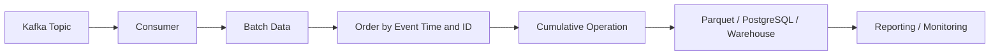

# 13- Cumulative Operations

## Overview

Cumulative operations calculate a running result as a Series or DataFrame progresses through its existing order.

The core Pandas operations are:

```python
cumsum()
cumprod()
cummin()
cummax()
```

They are useful when the business question depends on history rather than only the current row.

Typical backend and data-engineering use cases include:

```text
running revenue
running transaction totals
cumulative units sold
running minimum balance
running maximum balance
cumulative conversion measures
inventory depletion
capacity consumption
```

For example:

```python
orders["running_revenue"] = (
    orders["revenue"].cumsum()
)
```

produces:

```text
row  revenue  running_revenue
---  -------  ---------------
1       100          100
2       200          300
3       150          450
4       300          750
```

The calculation is straightforward, but cumulative metrics are highly dependent on row ordering, grouping, missing-value behavior, and the intended data grain.

---

## Core Cumulative Operations

| Operation | Meaning |
| --- | --- |
| `cumsum()` | Running sum |
| `cumprod()` | Running product |
| `cummin()` | Running minimum |
| `cummax()` | Running maximum |

These operations preserve the original row structure while replacing each value with the cumulative result up to that point.

Conceptually:

```text
input values
    ↓
process sequentially
    ↓
retain state
    ↓
emit cumulative value
```

---

## Example Dataset

```python
import pandas as pd


orders = pd.DataFrame(
    {
        "order_id": [
            "O1001",
            "O1002",
            "O1003",
            "O1004",
            "O1005",
        ],
        "created_at": pd.to_datetime(
            [
                "2026-09-10 09:00:00",
                "2026-09-10 10:00:00",
                "2026-09-10 11:00:00",
                "2026-09-10 12:00:00",
                "2026-09-10 13:00:00",
            ],
            utc=True,
        ),
        "revenue": [
            100.0,
            250.0,
            150.0,
            50.0,
            300.0,
        ],
        "units": [
            1,
            2,
            1,
            1,
            3,
        ],
    }
)
```

Sort the data before calculating a time-dependent cumulative metric:

```python
orders = orders.sort_values(
    "created_at"
).copy()
```

Then:

```python
orders["running_revenue"] = (
    orders["revenue"].cumsum()
)
```

---

## Why Ordering Matters

Cumulative calculations depend on sequence.

These two datasets contain the same rows:

```text
09:00 → 100
10:00 → 250
11:00 → 150
```

but:

```text
10:00 → 250
09:00 → 100
11:00 → 150
```

produce different intermediate cumulative values.

Therefore:

```text
aggregate statistic
→ often order-independent

cumulative statistic
→ order-dependent
```

For time-series and event processing, always establish a deterministic ordering before applying cumulative operations.

---

## Deterministic Ordering

Sort by all fields required to define event order.

For example:

```python
orders = (
    orders
    .sort_values(
        [
            "created_at",
            "order_id",
        ],
        kind="stable",
    )
    .copy()
)
```

Using a secondary key can make ordering deterministic when timestamps are identical.

This is important for:

```text
reproducible reports
tests
incremental pipelines
event processing
```

---

## `cumsum()`

`cumsum()` calculates a running sum.

```python
orders["running_revenue"] = (
    orders["revenue"]
    .cumsum()
)
```

For:

```text
100
250
150
50
```

the result is:

```text
100
350
500
550
```

This is commonly used for:

```text
cumulative revenue
running units sold
running costs
account balances
capacity consumption
```

---

## `cumprod()`

`cumprod()` calculates a running product.

```python
returns = pd.Series(
    [1.01, 0.98, 1.02]
)

growth = returns.cumprod()
```

Result conceptually:

```text
1.01
0.9898
1.009596
```

This is useful for multiplicative processes such as:

```text
compounded growth
investment returns
successive ratios
multiplicative factors
```

For ordinary business totals, `cumsum()` is usually much more relevant than `cumprod()`.

---

## `cummin()`

`cummin()` tracks the lowest value observed so far.

```python
balances = pd.Series(
    [1000, 850, 900, 600, 700]
)

running_minimum = (
    balances.cummin()
)
```

Result:

```text
1000
850
850
600
600
```

This is useful for:

```text
lowest account balance reached
minimum inventory observed
running latency floor
drawdown-style analysis
```

---

## `cummax()`

`cummax()` tracks the highest value observed so far.

```python
revenue = pd.Series(
    [100, 250, 180, 400, 350]
)

running_maximum = (
    revenue.cummax()
)
```

Result:

```text
100
250
250
400
400
```

This is useful for:

```text
highest revenue reached
peak traffic
peak CPU
record transaction value
running service capacity
```

---

## Running Maximum and New Records

`cummax()` can help identify when a new high is reached.

```python
orders["running_max_revenue"] = (
    orders["revenue"]
    .cummax()
)

orders["is_new_revenue_record"] = (
    orders["revenue"]
    .eq(
        orders["running_max_revenue"]
    )
)
```

For more precise record detection where ties should not count as a new record:

```python
orders["previous_max"] = (
    orders["revenue"]
    .cummax()
    .shift(1)
)

orders["is_new_record"] = (
    orders["previous_max"].isna()
    | orders["revenue"].gt(
        orders["previous_max"]
    )
)
```

This pattern is useful for operational event detection.

---

## Running Minimum for Alerting

For inventory:

```python
inventory = pd.DataFrame(
    {
        "timestamp": pd.date_range(
            "2026-09-10 09:00",
            periods=4,
            freq="h",
        ),
        "inventory": [
            100,
            80,
            60,
            75,
        ],
    }
)

inventory["running_minimum"] = (
    inventory["inventory"]
    .cummin()
)
```

The running minimum tells the reporting system the lowest observed inventory level up to each timestamp.

---

## DataFrame Cumulative Operations

Cumulative operations can also be applied to DataFrames.

```python
metrics = orders[
    [
        "revenue",
        "units",
    ]
]

running = metrics.cumsum()
```

The result preserves the DataFrame structure:

```text
each column
→ independently accumulated
```

For production pipelines, explicit column selection is preferable when unrelated numeric columns should not participate.

---

## Axis Behavior

For a DataFrame:

```python
metrics.cumsum(
    axis=0
)
```

calculates cumulatively down rows.

For horizontal cumulative processing:

```python
metrics.cumsum(
    axis=1
)
```

the operation proceeds across columns.

Horizontal cumulative calculations are less common in backend ETL than row-wise cumulative metrics, but the distinction matters when working with matrix-like reports.

---

## Missing Values

Cumulative operations have specific missing-value behavior.

Consider:

```python
values = pd.Series(
    [100.0, None, 200.0, 50.0]
)

running = values.cumsum()
```

By default, Pandas generally skips missing values during the cumulative computation while preserving the missing position in the result.

Conceptually:

```text
input:
100
NaN
200
50

result:
100
NaN
300
350
```

The missing observation does not automatically reset the cumulative state.

---

## `skipna`

The behavior can be controlled explicitly:

```python
running = values.cumsum(
    skipna=True
)
```

For production logic, do not assume that missing values have the same meaning as zero.

For example:

```text
NaN
→ unknown transaction amount

0
→ known zero transaction amount
```

Replacing missing values with zero changes the business semantics.

---

## Filling Missing Values Before Cumulative Operations

Only fill missing values when business rules justify the transformation.

For example, if missing units explicitly mean zero units:

```python
orders["units"] = (
    orders["units"]
    .fillna(0)
)

orders["running_units"] = (
    orders["units"]
    .cumsum()
)
```

Do not use this approach when missing means:

```text
unknown
not received
invalid
```

because it turns uncertainty into a known value.

---

## Cumulative Operations After Filtering

The cumulative metric depends on the selected population.

For example:

```python
completed = (
    orders
    .loc[
        orders["status"].eq("completed")
    ]
    .sort_values("created_at")
    .copy()
)

completed["running_revenue"] = (
    completed["revenue"]
    .cumsum()
)
```

This calculates:

```text
running revenue from completed orders
```

It is not equivalent to calculating cumulative revenue on all orders and filtering afterward.

---

## Grouped Cumulative Operations

A common requirement is:

> Calculate running revenue independently for each customer.

Use:

```python
orders = (
    orders
    .sort_values(
        [
            "customer_id",
            "created_at",
        ],
        kind="stable",
    )
    .copy()
)

orders["customer_running_revenue"] = (
    orders
    .groupby("customer_id")["revenue"]
    .cumsum()
)
```

Each customer starts with an independent cumulative state.

The output remains aligned with the original DataFrame index.

---

## Grouped Cumulative Minimum

Track the minimum balance per account:

```python
transactions = (
    transactions
    .sort_values(
        [
            "account_id",
            "created_at",
        ],
        kind="stable",
    )
    .copy()
)

transactions["running_min_balance"] = (
    transactions
    .groupby("account_id")["balance"]
    .cummin()
)
```

This is useful for:

```text
financial monitoring
credit exposure
inventory
account health
```

---

## Grouped Cumulative Maximum

Track the highest usage per tenant:

```python
usage = (
    usage
    .sort_values(
        [
            "tenant_id",
            "recorded_at",
        ],
        kind="stable",
    )
    .copy()
)

usage["peak_usage"] = (
    usage
    .groupby("tenant_id")["usage"]
    .cummax()
)
```

The result represents the maximum observed usage for each tenant up to each observation.

---

## Grouped Cumulative Product

For compounded return factors per asset:

```python
returns["growth_factor"] = (
    returns
    .groupby("asset_id")["daily_factor"]
    .cumprod()
)
```

This maintains separate cumulative products by asset.

Always verify that the input is ordered correctly within each group.

---

## `groupby().cumsum()` Versus `transform()`

For simple cumulative grouped operations:

```python
orders.groupby(
    "customer_id"
)["revenue"].cumsum()
```

is usually the clearest approach.

`transform()` can also express cumulative calculations:

```python
orders.groupby(
    "customer_id"
)["revenue"].transform(
    "cumsum"
)
```

Both return a Series aligned to the original row structure.

Prefer the direct grouped cumulative operation when it clearly communicates intent.

---

## Cumulative Operations and Index Alignment

A key Pandas property is that Series results generally retain their input index.

For example:

```python
running_revenue = (
    orders["revenue"]
    .cumsum()
)
```

can be safely assigned:

```python
orders["running_revenue"] = (
    running_revenue
)
```

When grouped cumulative operations are used:

```python
orders["customer_running_revenue"] = (
    orders
    .groupby("customer_id")["revenue"]
    .cumsum()
)
```

the result aligns with the original DataFrame rows.

This is useful for ETL transformations because cumulative state can be added without manually reconstructing row positions.

---

## Sorting and Index Reset

Sorting changes row order but does not inherently reset the index.

Example:

```python
orders = (
    orders
    .sort_values("created_at")
    .copy()
)
```

The original index may remain.

If the resulting table is intended as a new sequential dataset:

```python
orders = orders.reset_index(
    drop=True
)
```

Do this intentionally.

Do not reset the index simply because a cumulative operation requires ordered rows. The cumulative calculation itself does not require a particular index type; it requires correct row order.

---

## Cumulative Metrics and Datetimes

For time-series data:

```python
events = (
    events
    .sort_values(
        "event_time",
        kind="stable",
    )
    .copy()
)

events["running_events"] = (
    events["event_id"]
    .notna()
    .cumsum()
)
```

This can create a cumulative event count.

For timestamps, ensure that:

```text
timezone
sorting
duplicate timestamps
late-arriving records
```

are handled consistently.

---

## Running Count

There is no need to create a specialized cumulative-count function for every case.

A boolean Series can be accumulated:

```python
orders["running_completed"] = (
    orders["status"]
    .eq("completed")
    .cumsum()
)
```

Because:

```text
True  → 1
False → 0
```

this produces the cumulative number of completed orders.

This pattern is useful for:

```text
workflow progress
event counts
successful requests
conversion tracking
```

---

## Running Non-Null Count

For cumulative observation counts:

```python
orders["running_revenue_count"] = (
    orders["revenue"]
    .notna()
    .cumsum()
)
```

This answers:

```text
How many valid revenue observations have been seen so far?
```

It should not be confused with:

```python
orders["revenue"].count()
```

which returns one final scalar.

---

## Running Average

Pandas does not require a dedicated `cummean()` operation for many common use cases.

A running average can be calculated as:

```python
orders["running_sum"] = (
    orders["revenue"].cumsum()
)

orders["running_count"] = (
    orders["revenue"].notna().cumsum()
)

orders["running_average"] = (
    orders["running_sum"]
    / orders["running_count"]
)
```

This makes the underlying state explicit:

```text
running sum
/
running valid observation count
```

The exact missing-value policy should be defined before using this pattern.

---

## Running Average by Group

For customer-level running average order value:

```python
orders = (
    orders
    .sort_values(
        [
            "customer_id",
            "created_at",
        ],
        kind="stable",
    )
    .copy()
)

grouped = orders.groupby(
    "customer_id"
)

orders["running_revenue"] = (
    grouped["revenue"]
    .cumsum()
)

orders["running_count"] = (
    grouped["revenue"]
    .transform(
        lambda values: values.notna().cumsum()
    )
)

orders["running_average"] = (
    orders["running_revenue"]
    / orders["running_count"]
)
```

For very large datasets, avoid Python-level group transformations when a more direct vectorized or database-side implementation is available.

---

## Running Percentage

Suppose each row represents an event with a binary outcome.

```python
orders["completed"] = (
    orders["status"]
    .eq("completed")
)

orders["running_completed"] = (
    orders["completed"]
    .cumsum()
)

orders["running_total"] = (
    orders["completed"]
    .notna()
    .cumsum()
)

orders["running_completion_rate"] = (
    orders["running_completed"]
    / orders["running_total"]
)
```

This produces a cumulative conversion-style metric.

The denominator must reflect the intended population.

---

## Inventory Example

Suppose inventory changes after every transaction:

```python
inventory = pd.DataFrame(
    {
        "timestamp": pd.to_datetime(
            [
                "2026-09-10 09:00",
                "2026-09-10 10:00",
                "2026-09-10 11:00",
            ]
        ),
        "quantity_change": [
            100,
            -20,
            -30,
        ],
    }
)

inventory = inventory.sort_values(
    "timestamp",
    kind="stable",
).copy()

inventory["inventory_level"] = (
    inventory["quantity_change"]
    .cumsum()
)
```

The cumulative sum converts transaction-level changes into a running inventory level, assuming the starting inventory is zero.

---

## Starting Values

If a cumulative metric starts from an existing balance:

```python
starting_inventory = 500

inventory["inventory_level"] = (
    starting_inventory
    + inventory["quantity_change"]
    .cumsum()
)
```

This pattern is common for:

```text
account balances
inventory
capacity
resource consumption
```

The starting value must use the same unit and reporting scope as the subsequent observations.

---

## Financial Example

Account transactions can be converted into a running balance:

```python
transactions = (
    transactions
    .sort_values(
        [
            "account_id",
            "created_at",
            "transaction_id",
        ],
        kind="stable",
    )
    .copy()
)

transactions["balance_change"] = (
    transactions["credit"]
    - transactions["debit"]
)

transactions["running_change"] = (
    transactions
    .groupby("account_id")["balance_change"]
    .cumsum()
)

transactions["balance"] = (
    transactions["opening_balance"]
    + transactions["running_change"]
)
```

The exact implementation depends on whether `opening_balance` is:

```text
one fixed value per account
```

or:

```text
repeated on every transaction row
```

Do not accidentally add a repeated opening balance at every row.

---

## API and Event Processing

Cumulative metrics are common when processing paginated or batched API data.

For example:

```python
events = (
    pd.concat(
        pages,
        ignore_index=True,
    )
    .sort_values(
        [
            "event_time",
            "event_id",
        ],
        kind="stable",
    )
    .copy()
)

events["running_events"] = (
    events["event_id"]
    .notna()
    .cumsum()
)
```

Important production considerations include:

```text
duplicate pages
replayed events
pagination gaps
late events
unstable ordering
```

Cumulative calculations are only as correct as the sequence supplied to them.

---

## Kafka and Event Streams

In an event-driven architecture:



For cumulative processing, event ordering and checkpointing matter.

If a late event arrives after a cumulative result has already been published, the previously computed downstream state may need to be corrected.

This is one reason cumulative metrics are more operationally complex than simple batch aggregates.

---

## Incremental Processing

Some cumulative operations are naturally stateful.

For `cumsum()`:

```text
previous cumulative sum
+
current value
=
new cumulative sum
```

For `cummax()`:

```text
max(previous cumulative max, current value)
=
new cumulative max
```

This makes them suitable for incremental processing when the input order and state are reliable.

For example:

```python
running_total = previous_total

for batch in batches:
    batch["running_total"] = (
        running_total
        + batch["revenue"].cumsum()
    )

    running_total = (
        batch["running_total"].iloc[-1]
    )
```

This works only when batches are processed in the correct global order.

---

## Checkpointing

Long-running batch or stream processors should persist cumulative state when recovery is required.

For example:

```text
batch 1
→ cumulative total = 1000
→ checkpoint = 1000

batch 2
→ restore checkpoint
→ cumulative total = 1400
→ checkpoint = 1400
```

Without checkpointing, a worker restart may require replaying all previous data.

For distributed systems, the checkpoint should be stored in durable infrastructure such as:

```text
PostgreSQL
S3
DynamoDB
Kafka state infrastructure
```

depending on the architecture.

---

## Idempotency

Cumulative processing is sensitive to duplicate inputs.

If the same batch is processed twice:

```text
original total
+
duplicate batch
=
inflated cumulative total
```

Use stable identifiers and idempotent ingestion.

For example:

```python
events = events.drop_duplicates(
    subset=["event_id"]
)
```

only when `event_id` uniquely identifies a business event.

Deduplication must be consistent with the upstream delivery semantics.

---

## Late-Arriving Data

Suppose cumulative revenue has already been calculated:

```text
09:00 → 100 → running = 100
10:00 → 200 → running = 300
```

A late 09:30 event worth `50` arrives.

The corrected sequence becomes:

```text
09:00 → 100 → running = 100
09:30 → 50  → running = 150
10:00 → 200 → running = 350
```

Previously published cumulative values may therefore become invalid.

Production systems should define:

```text
watermark
lateness window
reprocessing strategy
correction policy
```

when event arrival is not strictly ordered.

---

## SQL Window Functions

Cumulative Pandas operations map naturally to SQL window functions.

Pandas:

```python
orders = orders.sort_values(
    "created_at"
)

orders["running_revenue"] = (
    orders["revenue"]
    .cumsum()
)
```

SQL:

```sql
SELECT
    order_id,
    created_at,
    revenue,
    SUM(revenue) OVER (
        ORDER BY created_at, order_id
        ROWS BETWEEN UNBOUNDED PRECEDING
        AND CURRENT ROW
    ) AS running_revenue
FROM orders;
```

For per-customer cumulative revenue:

```sql
SELECT
    customer_id,
    order_id,
    created_at,
    revenue,
    SUM(revenue) OVER (
        PARTITION BY customer_id
        ORDER BY created_at, order_id
        ROWS BETWEEN UNBOUNDED PRECEDING
        AND CURRENT ROW
    ) AS running_revenue
FROM orders;
```

Understanding this mapping is highly useful when moving between SQL and Pandas.

---

## Database Pushdown

For very large database-resident datasets, cumulative calculations may be better performed in SQL.

Use:

```text
PostgreSQL
    ↓
window function
    ↓
filtered result
    ↓
Pandas
```

when the database can execute the operation efficiently.

Advantages include:

```text
less network transfer
less Pandas memory usage
better database query planning
centralized SQL semantics
```

Pandas is still useful when:

```text
data is already in memory
custom Python transformations are required
dataset size is moderate
```

---

## Parquet and Time-Series Data

For Parquet-backed workloads:

```python
events = pd.read_parquet(
    "events.parquet",
    columns=[
        "event_id",
        "event_time",
        "revenue",
    ],
)
```

Before cumulative processing:

```python
events = (
    events
    .sort_values(
        [
            "event_time",
            "event_id",
        ],
        kind="stable",
    )
    .copy()
)
```

If the source is partitioned by date, process partitions in chronological order and carry forward cumulative state when calculating a global cumulative metric.

---

## Performance Considerations

Cumulative operations are generally efficient vectorized operations.

The main performance costs often come from:

```text
sorting
grouping
loading unnecessary columns
materializing copies
large intermediate results
```

For example:

```python
orders = orders.sort_values(
    [
        "customer_id",
        "created_at",
    ],
    kind="stable",
)
```

can be more expensive than the subsequent `cumsum()`.

Optimize data ordering and data movement before worrying about the cumulative function itself.

---

## Avoid Unnecessary Copies

Prefer selecting only required columns before cumulative processing:

```python
working = (
    orders[
        [
            "customer_id",
            "created_at",
            "revenue",
        ]
    ]
    .sort_values(
        [
            "customer_id",
            "created_at",
        ],
        kind="stable",
    )
    .copy()
)
```

This reduces the size of the working set.

Do not create several full DataFrame copies simply to calculate a few cumulative columns.

---

## Cumulative Operations on Large Datasets

For large datasets:

```text
Pandas
→ appropriate when working set fits memory

SQL window functions
→ useful for database-resident data

Spark / distributed engine
→ useful when data exceeds practical single-process memory
```

Grouped cumulative operations can become especially expensive because both sorting and grouping may be significant.

Benchmark using realistic data rather than assuming cumulative functions themselves are the bottleneck.

---

## Complexity

For a single already-ordered Series, cumulative reductions are approximately linear:

```text
O(n)
```

Sorting the data can introduce:

```text
O(n log n)
```

behavior.

This distinction matters because a pipeline that appears to be dominated by:

```python
cumsum()
```

may actually spend most of its time in:

```python
sort_values()
```

or:

```text
database extraction
```

---

## Numeric Overflow and Precision

For integer and floating-point data, cumulative operations inherit dtype and numerical considerations from the underlying values.

For financial data, use an appropriate representation and avoid assuming binary floating-point arithmetic is equivalent to decimal accounting semantics.

For example, monetary values may be normalized to integer minor units before cumulative calculations:

```python
orders["revenue_cents"] = (
    orders["revenue"]
    .mul(100)
    .round()
    .astype("int64")
)

orders["running_revenue_cents"] = (
    orders["revenue_cents"]
    .cumsum()
)
```

The exact representation should follow the application's financial data contract.

---

## Empty Data

Cumulative operations on empty Series produce empty results.

Example:

```python
empty = pd.Series(
    dtype="float64"
)

running = empty.cumsum()
```

In production, distinguish:

```text
empty input
```

from:

```text
valid input with cumulative result zero
```

Do not assume an empty report means zero activity without validating the upstream data source.

---

## Invalid Values

Validate domain constraints before cumulative calculations.

For example, inventory changes may be allowed to be negative, but inventory itself may not:

```python
inventory["running_level"] = (
    inventory["quantity_change"]
    .cumsum()
)

if (
    inventory["running_level"]
    < 0
).any():
    raise ValueError(
        "Inventory level became negative."
    )
```

This allows the cumulative metric to serve as part of a business-rule validation process.

---

## Cumulative Threshold Detection

Cumulative metrics can identify when a threshold is reached.

Example:

```python
orders["running_revenue"] = (
    orders["revenue"]
    .cumsum()
)

threshold = 100_000

orders["threshold_reached"] = (
    orders["running_revenue"]
    >= threshold
)
```

To find the first threshold-crossing event:

```python
reached = orders.loc[
    orders["running_revenue"].ge(
        threshold
    )
]

first_threshold_order = (
    reached.iloc[0]
    if not reached.empty
    else None
)
```

This pattern is useful for:

```text
sales milestones
capacity limits
budget consumption
inventory thresholds
```

---

## Common Mistakes

### Forgetting to Sort

Incorrect:

```python
orders["running_revenue"] = (
    orders["revenue"].cumsum()
)
```

when the rows are not already in the required business order.

Correct:

```python
orders = (
    orders
    .sort_values(
        [
            "created_at",
            "order_id",
        ],
        kind="stable",
    )
    .copy()
)

orders["running_revenue"] = (
    orders["revenue"].cumsum()
)
```

---

### Assuming Database Order

Never rely on incidental row order from a SQL query.

Use:

```sql
ORDER BY created_at, order_id
```

when ordering is part of the metric definition.

---

### Filling Nulls With Zero Blindly

This:

```python
df["revenue"].fillna(0).cumsum()
```

changes:

```text
unknown revenue
```

into:

```text
zero revenue
```

only do this when the domain explicitly defines that behavior.

---

### Filtering After Cumulative Calculation

Filtering after `cumsum()` may produce a metric based on rows that should never have been in the population.

Filter first when the cumulative metric is intended for a specific subset.

---

### Ignoring Duplicate Events

Processing the same event twice can inflate cumulative totals.

Use stable identifiers and enforce the correct idempotency strategy.

---

### Aggregating at the Wrong Grain

A cumulative metric calculated at:

```text
order level
```

is different from one calculated after aggregation to:

```text
customer level
daily level
regional level
```

Define the observation grain explicitly.

---

### Reusing Global State Across Groups

Do not accidentally calculate:

```python
orders["revenue"].cumsum()
```

when the requirement is per customer.

Use:

```python
orders.groupby(
    "customer_id"
)["revenue"].cumsum()
```

---

### Ignoring Late Events

In event-driven systems, cumulative values can become stale when events arrive out of order.

Define correction and replay behavior.

---

### Averaging Cumulative Values

A running total is not an ordinary observation.

Avoid:

```python
orders["running_revenue"].mean()
```

unless the business requirement explicitly concerns the average of cumulative states.

This usually answers a different question from average revenue per order.

---

## Interview Traps

### Running Sum

Question:

> How do you calculate a running total?

Answer:

```python
df["running_total"] = (
    df["amount"].cumsum()
)
```

Ensure the DataFrame is correctly ordered first.

---

### Grouped Running Total

```python
df["running_total"] = (
    df
    .sort_values(
        [
            "customer_id",
            "created_at",
        ]
    )
    .groupby("customer_id")[
        "amount"
    ]
    .cumsum()
)
```

This calculates an independent cumulative total per customer.

---

### Running Maximum

Use:

```python
df["running_max"] = (
    df["value"].cummax()
)
```

---

### Running Minimum

Use:

```python
df["running_min"] = (
    df["value"].cummin()
)
```

---

### SQL Equivalent

A Pandas running sum:

```python
df["running_total"] = (
    df["amount"].cumsum()
)
```

maps conceptually to:

```sql
SUM(amount) OVER (
    ORDER BY created_at, id
)
```

For grouped calculations:

```sql
SUM(amount) OVER (
    PARTITION BY customer_id
    ORDER BY created_at, id
)
```

---

### Cumulative Versus Rolling

These are different.

```text
cumulative
→ starts at the beginning and retains all prior observations

rolling
→ operates over a moving fixed-size or time-based window
```

For example:

```python
df["running_total"] = (
    df["amount"].cumsum()
)

df["rolling_total"] = (
    df["amount"]
    .rolling(7)
    .sum()
)
```

A seven-row rolling sum drops older observations as the window advances.

---

## Production Checklist

Before publishing a cumulative metric, verify:

```text
[ ] Correct observation grain
[ ] Correct population filter
[ ] Deterministic ordering
[ ] Timestamp and timezone semantics defined
[ ] Duplicate events controlled
[ ] Missing-value policy defined
[ ] Units and currency consistent
[ ] Starting state defined
[ ] Grouping scope correct
[ ] Late-arriving data policy defined
[ ] Incremental checkpointing considered
[ ] Idempotency strategy defined
[ ] Empty-input behavior defined
[ ] Database window-function pushdown evaluated
[ ] Resource usage benchmarked
```

---

## Key Takeaways

- `cumsum()`, `cumprod()`, `cummin()`, and `cummax()` maintain state across ordered observations and are therefore fundamentally different from order-independent aggregations.
- Correct ordering is part of the metric definition; use deterministic sorting, especially for time-series and event data with duplicate timestamps.
- Grouped cumulative operations such as `groupby(...).cumsum()` create independent running state per entity while preserving row alignment.
- Missing values, duplicate events, aggregation grain, late-arriving data, and starting balances can materially change cumulative results and must be handled explicitly in production pipelines.
- Cumulative operations work naturally with incremental processing and SQL window functions, but large event-driven workloads require checkpointing, idempotency, ordering, and replay strategies in addition to the Pandas calculation.