# README.md

## Overview

The **Strings and Datetime** section covers the Pandas operations required to process textual and temporal data reliably in backend, ETL, analytics, and reporting workflows.

String and datetime columns are common integration boundaries because external systems frequently represent structured information as:

```text
plain strings
JSON fields
CSV columns
database values
API payloads
Kafka events
Excel exports
```

The same logical value can arrive in many representations:

```text
"C101"
" c101 "
"Customer-C101"
```

or:

```text
2026-09-10T14:30:00Z
2026-09-10 14:30:00+00:00
2026-09-10 20:00:00+05:30
```

Production Pandas code must convert these representations into consistent semantic values before filtering, joining, grouping, aggregating, or publishing results.

The section progresses through:

```text
String Access
    ↓
String Cleaning
    ↓
String Search
    ↓
String Extraction
    ↓
Regular Expressions
    ↓
Datetime Types
    ↓
Datetime Parsing
    ↓
Datetime Components
    ↓
Datetime Filtering
    ↓
Calendar Offsets
    ↓
Durations
    ↓
Timezone Handling
    ↓
Resampling
    ↓
Time-Series Indexing
```

The focus is practical engineering:

```text
normalize
→ validate
→ transform
→ analyze
→ publish
```

rather than treating string and datetime functions as isolated APIs.

---

## Section Structure

| File | Topic | Primary Purpose |
| --- | --- | --- |
| `01- String Accessor.md` | String Accessor | Use vectorized `.str` operations on Series |
| `02- String Cleaning.md` | String Cleaning | Normalize and clean textual values |
| `03- String Search.md` | String Search | Search and filter text values |
| `04- String Extraction.md` | String Extraction | Extract structured information from text |
| `05- Regular Expressions.md` | Regular Expressions | Handle complex pattern matching |
| `06- Datetime Overview.md` | Datetime Overview | Understand Pandas temporal data |
| `07- To Datetime.md` | To Datetime | Convert external values to datetime |
| `08- Datetime Components.md` | Datetime Components | Extract year, month, hour, weekday, and similar components |
| `09- Datetime Filtering.md` | Datetime Filtering | Filter records by temporal conditions |
| `10- Date Offsets.md` | Date Offsets | Perform calendar-aware temporal arithmetic |
| `11- Timedeltas.md` | Timedeltas | Represent elapsed durations |
| `12- Timezone Aware Datetime.md` | Timezone-Aware Datetime | Process timezone-aware timestamps safely |
| `13- Resampling.md` | Resampling | Aggregate time-series data into new frequencies |
| `14- Time Series Indexing.md` | Time-Series Indexing | Use DatetimeIndex effectively for temporal analysis |

---

## How the Topics Fit Together

A reliable text and temporal pipeline generally follows this progression:

```text
External Data
    ↓
Raw Strings
    ↓
Normalization
    ↓
Validation
    ↓
Typed Datetime / String Data
    ↓
Filtering and Transformation
    ↓
Aggregation / Resampling
    ↓
Reporting or Storage
```

For example, an API may provide:

```json
{
  "customer_id": " c101 ",
  "created_at": "2026-09-10T14:30:00+05:30",
  "status": " COMPLETED "
}
```

A production pipeline may normalize it as:

```python
records = response["items"]

events = pd.DataFrame(records)

events["customer_id"] = (
    events["customer_id"]
    .astype("string")
    .str.strip()
    .str.upper()
)

events["status"] = (
    events["status"]
    .astype("string")
    .str.strip()
    .str.lower()
)

events["created_at"] = pd.to_datetime(
    events["created_at"],
    utc=True,
    errors="raise",
)
```

The resulting representation is consistent:

```text
customer_id
→ C101

status
→ completed

created_at
→ timezone-aware UTC timestamp
```

This normalized representation can then safely flow into:

```text
joins
filters
groupby
aggregations
time-series analysis
database writes
```

---

## String Processing

### String Accessor

Pandas provides vectorized string operations through `.str`.

Example:

```python
customers["email"] = (
    customers["email"]
    .astype("string")
    .str.strip()
    .str.lower()
)
```

Common operations include:

```text
lower()
upper()
strip()
lstrip()
rstrip()
contains()
startswith()
endswith()
replace()
split()
extract()
len()
```

The accessor allows a Series to be transformed without writing explicit row-level loops.

---

### String Cleaning

String cleaning establishes canonical representations.

Common operations include:

```python
customers["customer_id"] = (
    customers["customer_id"]
    .astype("string")
    .str.strip()
    .str.upper()
)
```

String cleaning is especially important before:

```text
joining
deduplication
grouping
validation
database lookup
```

For example:

```text
"C101"
" C101"
"c101"
```

may represent one logical identifier even though they are different raw strings.

Normalization must follow domain rules. Do not modify case or whitespace when those attributes are semantically meaningful.

---

### String Search

Filtering text:

```python
timeouts = logs.loc[
    logs["message"]
    .str.contains(
        "timeout",
        case=False,
        na=False,
    )
]
```

This is useful for:

```text
log analysis
error classification
support data
event filtering
data-quality investigation
```

`na=False` is useful when missing messages should simply evaluate to false rather than produce missing boolean values.

---

### String Extraction

Structured values can often be extracted from semi-structured text.

Given:

```text
"customer=C101 region=IN"
```

use:

```python
logs["customer_id"] = (
    logs["message"]
    .str.extract(
        r"customer=(\w+)",
        expand=False,
    )
)
```

Extraction should normally be followed by validation:

```text
extract
→ check nulls
→ validate format
→ use identifier
```

Do not assume every successful regex match represents a valid business identifier.

---

### Regular Expressions

Regular expressions are useful for structured patterns such as:

```text
order IDs
ticket references
version strings
log fields
email-like values
```

For example:

```python
logs["request_id"] = (
    logs["message"]
    .str.extract(
        r"request_id=([A-Za-z0-9-]+)",
        expand=False,
    )
)
```

Prefer ordinary string operations when a task does not require a regex. Complex regex patterns are harder to maintain and test.

---

## Datetime Processing

### Datetime Types

Temporal data should be represented with appropriate Pandas datetime types rather than remaining as arbitrary strings.

Important Pandas temporal concepts include:

```text
Timestamp
DatetimeIndex
Timedelta
Period
```

They enable:

```text
comparison
sorting
arithmetic
grouping
resampling
time-based filtering
```

---

### Parsing External Dates

Use `pd.to_datetime()`:

```python
events["created_at"] = pd.to_datetime(
    events["created_at"],
    utc=True,
    errors="raise",
)
```

Important concerns include:

```text
invalid values
mixed formats
timezone offsets
missing values
source conventions
date boundaries
```

For production systems, parsing behavior should be deliberate rather than inferred.

---

### Strict Versus Controlled Parsing

Strict parsing:

```python
events["created_at"] = pd.to_datetime(
    events["created_at"],
    utc=True,
    errors="raise",
)
```

is appropriate when malformed input should fail the pipeline.

Controlled coercion:

```python
events["created_at"] = pd.to_datetime(
    events["created_at"],
    utc=True,
    errors="coerce",
)
```

is useful when invalid records must be quarantined or reported.

For example:

```python
invalid = events.loc[
    events["created_at"].isna()
]

valid = events.loc[
    events["created_at"].notna()
]
```

The important distinction is:

```text
coercion
≠
validation
```

Converting bad values to `NaT` without measuring or handling them can hide upstream data problems.

---

## Datetime Components

Once parsed, components are accessed through `.dt`.

Example:

```python
events["year"] = (
    events["created_at"].dt.year
)

events["month"] = (
    events["created_at"].dt.month
)

events["hour"] = (
    events["created_at"].dt.hour
)

events["day_of_week"] = (
    events["created_at"].dt.dayofweek
)
```

Common components include:

```text
year
month
day
hour
minute
second
quarter
dayofweek
dayofyear
```

These are useful for:

```text
reporting
grouping
business-hour analysis
seasonality
operational dashboards
```

---

## Datetime Filtering

Prefer typed timestamps for filtering.

Example:

```python
start = pd.Timestamp(
    "2026-09-01",
    tz="UTC",
)

end = pd.Timestamp(
    "2026-10-01",
    tz="UTC",
)

monthly_events = events.loc[
    events["created_at"].ge(start)
    & events["created_at"].lt(end)
]
```

The half-open interval:

```text
[start, end)
```

is often preferable because adjacent reporting periods do not overlap.

For example:

```text
September
[Sep 1, Oct 1)

October
[Oct 1, Nov 1)
```

---

## Date Offsets

Calendar-aware operations should use date offsets.

Examples include:

```text
month end
month start
business day
quarter
week
```

Example:

```python
from pandas.tseries.offsets import MonthEnd


month_end = (
    pd.Timestamp("2026-09-10")
    + MonthEnd(0)
)
```

This differs from adding a fixed number of days.

Calendar logic should use calendar-aware offsets rather than assumptions such as:

```text
1 month = 30 days
```

---

## Timedeltas

A `Timedelta` represents a duration.

Example:

```python
events["processing_time"] = (
    events["completed_at"]
    - events["started_at"]
)
```

Convert to seconds:

```python
events["processing_seconds"] = (
    events["processing_time"]
    .dt.total_seconds()
)
```

Typical uses include:

```text
API latency
job duration
SLA measurement
time between events
customer response time
queue wait time
```

The distinction is:

```text
datetime
→ point in time

timedelta
→ duration
```

---

## Timezone-Aware Datetime

Distributed services should establish a canonical timezone strategy.

A common pattern is:

```text
store/process in UTC
→
convert to local time only for presentation
```

Example:

```python
events["created_at"] = pd.to_datetime(
    events["created_at"],
    utc=True,
    errors="raise",
)
```

Timezone awareness becomes important when systems span:

```text
multiple regions
multiple cloud environments
daylight-saving changes
cross-service event streams
```

---

## Event Time Versus Processing Time

Event-driven systems often have multiple timestamps:

```text
event_time
ingested_at
processed_at
```

They represent different lifecycle stages.

For example:

```text
event occurs
    ↓
event_time

message reaches Kafka consumer
    ↓
ingested_at

Pandas pipeline processes it
    ↓
processed_at
```

Do not use processing time as a substitute for event time unless the business requirement explicitly calls for it.

---

## Resampling

Resampling changes the temporal frequency of a time series.

Example:

```python
daily_revenue = (
    orders
    .set_index("created_at")
    .resample("D")["revenue"]
    .sum()
)
```

This converts:

```text
order-level observations
```

into:

```text
daily revenue
```

Other frequencies can be used for:

```text
hourly
daily
weekly
monthly
```

The time-zone and boundary semantics should be understood before interpreting the result.

---

## Time-Series Indexing

For repeated time-based access, a `DatetimeIndex` is useful:

```python
events = (
    events
    .set_index("created_at")
    .sort_index()
)
```

Time-based selection can then be expressed naturally:

```python
recent = events.loc[
    "2026-09-01":"2026-09-07"
]
```

A sorted `DatetimeIndex` is particularly useful for:

```text
time slicing
resampling
rolling calculations
time-series analysis
```

---

## Sorting Is Part of Temporal Correctness

Many temporal operations depend on order.

Before:

```python
events["running_count"] = (
    events["event_id"]
    .notna()
    .cumsum()
)
```

ensure:

```python
events = (
    events
    .sort_values(
        [
            "event_time",
            "event_id",
        ],
        kind="stable",
    )
    .copy()
)
```

For distributed systems, do not rely on:

```text
database return order
API response order
Kafka arrival order
```

unless those ordering guarantees are explicit.

---

## String Normalization Before Joins

Identifiers should be normalized before relational operations.

Example:

```python
customers["customer_id"] = (
    customers["customer_id"]
    .astype("string")
    .str.strip()
    .str.upper()
)

orders["customer_id"] = (
    orders["customer_id"]
    .astype("string")
    .str.strip()
    .str.upper()
)
```

Then:

```python
enriched = orders.merge(
    customers,
    on="customer_id",
    how="left",
    validate="many_to_one",
)
```

This avoids false non-matches caused by representation differences.

---

## Missing Values

String and datetime pipelines need explicit missing-value semantics.

Examples:

```text
NaN
pd.NA
NaT
empty string
```

These are not automatically equivalent.

For example:

```python
missing_names = customers[
    "name"
].isna()

empty_names = customers[
    "name"
].eq("")
```

A production data contract should define whether:

```text
missing
```

and:

```text
empty
```

represent the same state.

Usually, they should be treated separately until the domain definition says otherwise.

---

## Invalid Values

A robust ingestion layer should identify invalid data.

Example:

```python
events["created_at"] = pd.to_datetime(
    events["created_at"],
    utc=True,
    errors="coerce",
)

invalid_events = events.loc[
    events["created_at"].isna()
]
```

Possible responses include:

```text
reject record
quarantine record
send to dead-letter storage
emit quality metric
continue with valid records
```

The appropriate behavior depends on the pipeline's reliability requirements.

---

## Duplicate Records

String normalization can affect duplicate detection.

Consider:

```text
"C101"
" C101 "
"c101"
```

If these are the same business identifier, normalize first and then test uniqueness.

```python
customer_ids = (
    customers["customer_id"]
    .astype("string")
    .str.strip()
    .str.upper()
)

if customer_ids.isna().any():
    raise ValueError(
        "Customer IDs contain missing values."
    )

if customer_ids.nunique() != len(customer_ids):
    raise ValueError(
        "Customer IDs are not unique."
    )
```

Do not apply the same uniqueness rule to a foreign key that is expected to repeat.

---

## Data Quality Checks

Useful checks for this section include:

```text
string null rate
invalid format count
unexpected category count
duplicate identifier count
datetime parse failures
future timestamps
timezone consistency
minimum and maximum timestamp
event-time / processing-time lag
```

Example:

```python
quality = {
    "rows": len(events),
    "null_customer_ids": int(
        events["customer_id"].isna().sum()
    ),
    "null_timestamps": int(
        events["created_at"].isna().sum()
    ),
    "unique_statuses": int(
        events["status"].nunique()
    ),
}
```

These metrics should be emitted alongside the business output for important pipelines.

---

## Database Integration

Prefer database-native types when available.

For PostgreSQL:

```text
TEXT
VARCHAR
TIMESTAMP
TIMESTAMPTZ
```

should remain typed in the database.

Temporal filtering is often better pushed into SQL:

```sql
SELECT
    event_id,
    customer_id,
    created_at,
    status
FROM events
WHERE created_at >= :start_time
  AND created_at < :end_time;
```

This reduces:

```text
rows transferred
network usage
Pandas memory
worker processing
```

---

## SQL String Normalization

Some normalization can also happen in SQL.

For example:

```sql
SELECT
    UPPER(TRIM(customer_id)) AS customer_id
FROM customers;
```

The decision of whether normalization belongs in:

```text
database
application
Pandas transformation
```

should follow ownership and reuse requirements.

Avoid implementing inconsistent normalization rules in multiple services.

---

## REST API Integration

APIs commonly return strings for both identifiers and dates.

Example:

```json
{
  "customer_id": " C101 ",
  "created_at": "2026-09-10T14:30:00Z"
}
```

Normalize at the ingestion boundary:

```python
events["customer_id"] = (
    events["customer_id"]
    .astype("string")
    .str.strip()
    .str.upper()
)

events["created_at"] = pd.to_datetime(
    events["created_at"],
    utc=True,
    errors="raise",
)
```

Do this before:

```text
joins
deduplication
grouping
filtering
aggregation
```

---

## API Pagination

Time-based and categorical statistics are only correct when the full intended population has been retrieved.

This is incorrect for a global metric:

```python
page["status"].value_counts()
```

if `page` contains only one page of a paginated API.

The correct architecture is:

```text
API
    ↓
retrieve all required pages
    ↓
normalize
    ↓
deduplicate if required
    ↓
filter reporting scope
    ↓
calculate metrics
```

Or, when supported, use an upstream endpoint that performs aggregation.

---

## CSV and JSON

Text-based file formats commonly require explicit normalization.

CSV:

```python
events = pd.read_csv(
    "events.csv",
)

events["created_at"] = pd.to_datetime(
    events["created_at"],
    utc=True,
    errors="raise",
)
```

JSON:

```python
events = pd.read_json(
    "events.json",
)
```

The same source validation principles apply:

```text
schema
dtype
null handling
normalization
duplicate handling
```

---

## Parquet

Parquet is useful for typed, columnar analytical workflows.

Example:

```python
events = pd.read_parquet(
    "events.parquet",
    columns=[
        "event_id",
        "event_time",
        "customer_id",
        "status",
    ],
)
```

Column projection reduces unnecessary:

```text
I/O
deserialization
memory
processing
```

For large datasets, Parquet is often a better interchange format than repeatedly processing large CSV files.

---

## ETL Architecture

A practical production workflow is:

```mermaid
flowchart LR
    Source[PostgreSQL / REST API / Kafka / S3] --> Ingest[Ingest Raw Data]
    Ingest --> Normalize[String Normalization]
    Normalize --> Parse[Datetime Parsing]
    Parse --> Validate[Validate Schema and Values]
    Validate --> Scope[Apply Time and Business Filters]
    Scope --> Transform[Transform / Group / Resample]
    Transform --> Quality[Validate Output Metrics]
    Quality --> Publish[PostgreSQL / Parquet / API / Dashboard]
```



The key boundary is:

```text
raw external representation
→ canonical internal representation
```

Once values are canonical, downstream transformations become considerably more predictable.

---

## Performance Considerations

The dominant cost for string and datetime workflows often comes from:

```text
large object columns
string allocation
datetime parsing
sorting
resampling
unnecessary copies
```

Prefer vectorized operations:

```python
events["status"] = (
    events["status"]
    .astype("string")
    .str.strip()
    .str.lower()
)
```

instead of row-by-row Python loops.

For large datasets, also consider:

```text
column projection
database filtering
Parquet
efficient dtypes
chunk processing
```

---

## Memory Considerations

String columns can consume significant memory, especially when values are:

```text
long
high-cardinality
duplicated
```

Low-cardinality dimensions such as:

```text
status
region
country
```

may benefit from categorical representation:

```python
events["status"] = (
    events["status"]
    .astype("category")
)
```

Use this when the dtype fits the workload and downstream semantics.

Do not convert every string column to categorical automatically.

---

## Sorting Cost

For cumulative or time-series workloads, sorting can be more expensive than the subsequent transformation.

Example:

```python
events = (
    events
    .sort_values(
        [
            "customer_id",
            "event_time",
        ],
        kind="stable",
    )
    .copy()
)
```

Sorting may approach:

```text
O(n log n)
```

while a simple cumulative operation is generally linear after ordering.

Optimize:

```text
data volume
columns
ordering strategy
```

before micro-optimizing vectorized string or datetime methods.

---

## Chunked Processing

When a text file is too large to fit comfortably in memory:

```python
for chunk in pd.read_csv(
    "events.csv",
    chunksize=100_000,
):
    chunk["status"] = (
        chunk["status"]
        .astype("string")
        .str.strip()
        .str.lower()
    )

    chunk["created_at"] = pd.to_datetime(
        chunk["created_at"],
        utc=True,
        errors="raise",
    )

    process(chunk)
```

Chunked processing is useful for:

```text
large CSV ingestion
batch ETL
memory-constrained workers
```

Be careful when global operations require cross-chunk state, such as:

```text
global distinct counts
global sorting
global cumulative order
```

These require additional state or an upstream scalable engine.

---

## Incremental Processing

Some operations are naturally local to a batch:

```text
string normalization
timestamp parsing
format validation
```

Others depend on global ordering or state:

```text
cumulative metrics
rolling metrics
global distinct entities
time-series windows
```

For stateful processing, define:

```text
checkpoint
ordering
late-event policy
replay behavior
watermark
```

when processing Kafka events or recurring batch partitions.

---

## Late-Arriving Events

Suppose an event arrives:

```text
event_time = 09:30
ingested_at = 10:15
```

after a report covering the period has already been produced.

The pipeline needs a policy such as:

```text
accept within lateness window
reprocess affected period
update aggregate
```

or:

```text
freeze historical period
accept only future corrections
```

The correct policy is a business and operational decision.

---

## Monitoring

String and datetime metrics are useful observability signals.

Example:

```python
monitoring = {
    "row_count": len(events),
    "invalid_timestamp_count": int(
        events["created_at"].isna().sum()
    ),
    "unique_status_count": int(
        events["status"].nunique()
    ),
    "future_event_count": int(
        (
            events["created_at"]
            > pd.Timestamp.now(tz="UTC")
        ).sum()
    ),
}
```

Useful trends to monitor include:

```text
parse failures
null rate
unexpected categories
duplicate IDs
future timestamps
event-to-ingestion lag
processing duration
```

Unexpected shifts can indicate upstream deployments or schema changes.

---

## Security Considerations

String columns can contain highly sensitive information:

```text
email addresses
names
account identifiers
access tokens
authorization headers
API keys
```

Do not log entire DataFrames during debugging.

Avoid patterns such as:

```python
logger.info(
    "events=%s",
    events.to_dict("records"),
)
```

when the payload may contain secrets or personal information.

Prefer structured, redacted observability data:

```python
logger.info(
    "event_batch_processed",
    extra={
        "row_count": len(events),
        "invalid_timestamp_count": int(
            events["created_at"].isna().sum()
        ),
    },
)
```

Temporal data can also reveal behavioral patterns, so access controls should apply to both raw and aggregated event data.

---

## Testing Strategy

Tests should cover normalization, parsing, validation, and edge cases.

String normalization:

```python
def test_status_normalization() -> None:
    values = pd.Series(
        [
            " COMPLETED ",
            "completed",
            "Completed",
        ]
    )

    normalized = (
        values
        .astype("string")
        .str.strip()
        .str.lower()
    )

    expected = pd.Series(
        [
            "completed",
            "completed",
            "completed",
        ],
        dtype="string",
    )

    assert normalized.equals(expected)
```

Datetime parsing:

```python
def test_datetime_parsing_to_utc() -> None:
    values = pd.Series(
        [
            "2026-09-10T10:00:00Z",
            "2026-09-10T15:30:00+05:30",
        ]
    )

    parsed = pd.to_datetime(
        values,
        utc=True,
        errors="raise",
    )

    assert str(
        parsed.dtype
    ) == "datetime64[ns, UTC]"
```

Also test:

```text
invalid strings
nulls
mixed timezone offsets
duplicate identifiers
empty input
unexpected categories
future timestamps
```

---

## Common Mistakes

### Using Python Loops

Avoid:

```python
for value in df["status"]:
    ...
```

Prefer vectorized `.str` operations.

---

### Calling `.str` on Inconsistent Data Without a Policy

Normalize the type explicitly:

```python
df["status"] = (
    df["status"]
    .astype("string")
)
```

Then perform transformations.

---

### Treating Empty and Missing as the Same

These are different states:

```text
""
pd.NA
```

Do not combine them unless the domain contract says they represent the same condition.

---

### Keeping Datetimes as Strings

Avoid using string slicing or lexical comparison for production temporal logic.

Parse first:

```python
df["created_at"] = pd.to_datetime(
    df["created_at"],
    utc=True,
    errors="raise",
)
```

---

### Mixing Naive and Aware Timestamps

Do not compare timezone-naive timestamps with timezone-aware timestamps without defining the intended timezone.

Prefer a consistent canonical representation.

---

### Using Local Time as the System-Wide Canonical Time

Distributed systems can span multiple regions.

Prefer:

```text
UTC for storage and processing
+
local timezone for presentation
```

when that matches the application's requirements.

---

### Silently Coercing Invalid Timestamps

This:

```python
pd.to_datetime(
    values,
    errors="coerce",
)
```

turns invalid values into `NaT`.

Without follow-up validation, malformed records may disappear from downstream metrics.

---

### Assuming Ingestion Order Equals Event Order

Kafka consumers, API clients, and distributed workers can process events out of order.

Sort using explicit event-time and tie-breaker fields when ordering is part of the metric definition.

---

### Normalizing After Deduplication

If logically equivalent identifiers have different representations:

```text
"C101"
" c101 "
```

deduplicating before normalization can miss the duplicate.

Prefer:

```text
normalize
→ validate
→ deduplicate
```

when the domain semantics require normalization.

---

### Ignoring Timezone Semantics in Reporting

A query for:

```text
"September 10"
```

can mean different UTC intervals depending on the reporting timezone.

Define:

```text
timezone
window boundaries
```

before producing time-based reports.

---

## Interview Traps

### Why Use `.str`?

Because it exposes vectorized string operations for Series values:

```python
df["name"].str.strip()
```

---

### Why Use `.dt`?

Because a datetime Series exposes vectorized temporal components and operations through `.dt`:

```python
df["created_at"].dt.hour
```

---

### Datetime Versus Timedelta

```text
datetime
→ point in time

timedelta
→ duration
```

Example:

```python
duration = (
    events["completed_at"]
    - events["started_at"]
)
```

---

### Date Offset Versus Timedelta

A calendar month is not a fixed duration.

Use:

```text
DateOffset
```

for calendar semantics and:

```text
Timedelta
```

for fixed durations.

---

### Why Use UTC?

UTC provides a stable reference for distributed storage, comparison, event ordering, and cross-service processing.

---

### Why Is Sorting Important?

Because cumulative, rolling, and many time-series operations depend on observation order.

Sorting must be explicit and deterministic.

---

### Why Not Filter Date Strings Directly?

String comparison depends on representation.

Typed datetimes provide consistent:

```text
ordering
comparison
arithmetic
timezone semantics
```

---

### What Happens to Invalid Datetimes With `errors="coerce"`?

Invalid values become `NaT`.

The pipeline must then decide whether to:

```text
reject
quarantine
repair
report
ignore
```

based on the data contract.

---

## Production Checklist

Before deploying a string or datetime workflow, verify:

```text
[ ] Source representation is documented
[ ] String normalization rules are explicit
[ ] Empty and missing semantics are defined
[ ] Identifier normalization happens before key validation
[ ] Datetime fields are converted to typed values
[ ] Invalid-value behavior is defined
[ ] Timezone semantics are explicit
[ ] UTC strategy is defined where appropriate
[ ] Reporting boundaries are explicit
[ ] Event time is distinguished from ingestion time
[ ] Duplicate handling follows the row-grain contract
[ ] API pagination is complete before global analysis
[ ] Required columns are projected before processing
[ ] Vectorized operations are preferred
[ ] Database filtering is pushed down where practical
[ ] Large datasets use suitable chunking or analytical engines
[ ] Late-arriving event behavior is defined
[ ] Sensitive strings are protected from logs
[ ] Parsing and normalization failures are monitored
[ ] Tests cover valid, invalid, null, duplicate, and empty inputs
```

---

## Key Takeaways

- String and datetime processing should establish a canonical representation before joins, filtering, grouping, aggregation, or storage.
- Pandas `.str` and `.dt` provide vectorized processing, but production correctness depends on explicit normalization, validation, missing-value semantics, and dtype management.
- Timezone, event ordering, reporting boundaries, late-arriving data, and the distinction between event time and processing time are critical in distributed and time-series systems.
- For large datasets, project only required columns, use efficient formats such as Parquet, push filtering into databases when appropriate, and avoid expensive Python-level loops.
- Reliable production pipelines treat parsing failures, duplicate identifiers, unexpected categories, sensitive strings, and temporal anomalies as observable data-quality concerns rather than incidental edge cases.