# README.md

## Overview

The **Strings and Datetime** section covers how Pandas processes textual and temporal data in production-oriented workflows.

These data types frequently arrive from integration boundaries such as:

```text
REST APIs
JSON payloads
CSV files
PostgreSQL
Kafka events
Excel exports
Parquet datasets
```

They are also common sources of subtle production failures because the same logical value can appear in different representations:

```text
" C101 "
"C101"
"c101"
```

or:

```text
2026-09-10T14:30:00Z
2026-09-10 20:00:00+05:30
2026-09-10 14:30:00+00:00
```

The goal of this section is to turn those external representations into canonical, validated values that can safely participate in:

```text
filtering
joining
grouping
aggregation
reporting
time-series analysis
storage
```

The progression is:

```text
String Accessor
    ↓
String Cleaning
    ↓
String Search
    ↓
String Extraction
    ↓
Regular Expressions
    ↓
Datetime Overview
    ↓
Datetime Parsing
    ↓
Datetime Components
    ↓
Datetime Filtering
    ↓
Date Offsets
    ↓
Timedeltas
    ↓
Timezone-Aware Datetime
    ↓
Resampling
    ↓
Time-Series Indexing
```

The central engineering pattern is:

```text
ingest
→ normalize
→ validate
→ transform
→ analyze
→ publish
```

---

## Section Structure

| File | Topic | Main Responsibility |
| --- | --- | --- |
| `01- String Accessor.md` | String Accessor | Use vectorized `.str` operations |
| `02- String Cleaning.md` | String Cleaning | Normalize and clean textual values |
| `03- String Search.md` | String Search | Search and filter text values |
| `04- String Extraction.md` | String Extraction | Extract structured values from text |
| `05- Regular Expressions.md` | Regular Expressions | Perform complex pattern matching |
| `06- Datetime Overview.md` | Datetime Overview | Understand Pandas datetime types and semantics |
| `07- To Datetime.md` | To Datetime | Parse external timestamp representations |
| `08- Datetime Components.md` | Datetime Components | Extract temporal components |
| `09- Datetime Filtering.md` | Datetime Filtering | Filter data using temporal conditions |
| `10- Date Offsets.md` | Date Offsets | Perform calendar-aware date arithmetic |
| `11- Timedeltas.md` | Timedeltas | Represent and calculate durations |
| `12- Timezone Aware Datetime.md` | Timezone-Aware Datetime | Handle timezone-aware timestamps safely |
| `13- Resampling.md` | Resampling | Aggregate time-series data into new frequencies |
| `14- Time Series Indexing.md` | Time-Series Indexing | Use `DatetimeIndex` for temporal workloads |

---

## How the Section Progresses

The topics are intentionally ordered from representation-level processing toward temporal analytics.

### String Processing

The first group establishes reliable text handling:

```text
raw text
    ↓
string accessor
    ↓
cleaning
    ↓
search
    ↓
extraction
    ↓
regex
```

This progression supports common tasks such as:

```text
customer identifier normalization
email cleanup
status normalization
log parsing
error classification
reference extraction
```

For example:

```python
customers["customer_id"] = (
    customers["customer_id"]
    .astype("string")
    .str.strip()
    .str.upper()
)
```

The result is not merely cosmetic. Canonical identifiers improve:

```text
joins
deduplication
validation
grouping
database lookups
```

---

### Datetime Processing

The second group moves from raw temporal representations toward time-series analysis:

```text
raw timestamp
    ↓
datetime parsing
    ↓
datetime components
    ↓
datetime filtering
    ↓
calendar arithmetic
    ↓
duration calculations
    ↓
timezone normalization
    ↓
resampling
    ↓
time-series indexing
```

This supports:

```text
reporting windows
SLA calculations
event processing
daily/monthly aggregation
latency analysis
time-series monitoring
```

---

## String Accessor

Pandas exposes vectorized string functionality through `.str`.

Example:

```python
users["email"] = (
    users["email"]
    .astype("string")
    .str.strip()
    .str.lower()
)
```

Typical operations include:

```text
strip()
lower()
upper()
contains()
startswith()
endswith()
replace()
split()
extract()
len()
```

The accessor allows string processing at Series level rather than requiring explicit row loops.

Prefer:

```python
df["status"].str.lower()
```

over:

```python
[
    value.lower()
    for value in df["status"]
]
```

because the vectorized form is clearer and generally more appropriate for Pandas workloads.

---

## String Cleaning

String cleaning establishes canonical values before downstream processing.

Typical transformations include:

```text
whitespace normalization
case normalization
character replacement
identifier cleanup
format validation
```

Example:

```python
orders["customer_id"] = (
    orders["customer_id"]
    .astype("string")
    .str.strip()
    .str.upper()
)
```

Cleaning rules should be explicit.

Do not automatically:

```text
lowercase everything
remove punctuation
collapse whitespace
```

when those characters may be semantically meaningful.

---

## String Search

String search supports filtering and diagnostics.

Example:

```python
timeouts = logs.loc[
    logs["message"]
    .str.contains(
        "timeout",
        case=False,
        na=False,
    )
]
```

Useful applications include:

```text
log analysis
error detection
support data
event classification
data-quality analysis
```

Missing-value behavior should be explicit. `na=False` is often appropriate for filters where missing text should not match.

---

## String Extraction

Semi-structured text often contains useful identifiers.

For:

```text
request_id=REQ-10231 status=failed
```

an extraction can be performed using:

```python
logs["request_id"] = (
    logs["message"]
    .str.extract(
        r"request_id=([A-Za-z0-9-]+)",
        expand=False,
    )
)
```

The extracted field should then be validated:

```text
extract
→ validate
→ normalize if required
→ use downstream
```

Extraction alone does not guarantee that the extracted value is a valid business identifier.

---

## Regular Expressions

Regular expressions are useful when simple string methods are insufficient.

Typical uses:

```text
ID extraction
log parsing
version parsing
structured references
format validation
```

Example:

```python
logs["version"] = (
    logs["message"]
    .str.extract(
        r"version=(\d+\.\d+\.\d+)",
        expand=False,
    )
)
```

Prefer straightforward `.str` methods when possible. Complex regex patterns increase maintenance and testing costs.

---

## Datetime Overview

Pandas provides typed temporal objects that support:

```text
comparison
sorting
arithmetic
grouping
resampling
indexing
```

Important concepts include:

```text
Timestamp
DatetimeIndex
Timedelta
Period
```

The key engineering distinction is:

```text
datetime
→ point in time

timedelta
→ duration
```

External systems commonly represent datetime values as strings, so parsing is usually the boundary between raw input and reliable temporal processing.

---

## Datetime Parsing

Use `pd.to_datetime()` to convert external values.

```python
events["created_at"] = pd.to_datetime(
    events["created_at"],
    utc=True,
    errors="raise",
)
```

Important inputs to consider:

```text
format
timezone
nulls
invalid timestamps
mixed representations
source-system conventions
```

For strict production pipelines, `errors="raise"` is often preferable because malformed data should fail visibly.

Use `errors="coerce"` only when invalid values are intentionally converted to `NaT` and handled downstream.

---

## Datetime Components

Use `.dt` after parsing.

```python
events["year"] = (
    events["created_at"].dt.year
)

events["month"] = (
    events["created_at"].dt.month
)

events["hour"] = (
    events["created_at"].dt.hour
)

events["weekday"] = (
    events["created_at"].dt.dayofweek
)
```

Common uses include:

```text
reporting dimensions
business-hour analysis
seasonality
daily aggregation
operational dashboards
```

Do not use string slicing as a substitute for typed datetime operations once a timestamp has been parsed.

---

## Datetime Filtering

Temporal filtering should use typed timestamps.

Example:

```python
start = pd.Timestamp(
    "2026-09-01",
    tz="UTC",
)

end = pd.Timestamp(
    "2026-10-01",
    tz="UTC",
)

events_in_period = events.loc[
    events["created_at"].ge(start)
    & events["created_at"].lt(end)
]
```

The half-open interval:

```text
[start, end)
```

is usually a useful convention for reporting periods because adjacent windows do not overlap.

---

## Date Offsets

Date offsets represent calendar-aware operations.

Example:

```python
from pandas.tseries.offsets import MonthEnd


month_end = (
    pd.Timestamp("2026-09-10")
    + MonthEnd(0)
)
```

Use offsets for operations such as:

```text
month end
month start
business day
quarter
calendar week
```

Do not assume:

```text
one month = 30 days
```

because calendar periods do not have fixed duration.

---

## Timedeltas

Timedeltas represent elapsed durations.

Example:

```python
events["processing_time"] = (
    events["completed_at"]
    - events["started_at"]
)
```

Convert the duration into a numeric unit when needed:

```python
events["processing_seconds"] = (
    events["processing_time"]
    .dt.total_seconds()
)
```

Typical applications include:

```text
API latency
job duration
queue wait time
SLA calculations
time between events
```

---

## Timezone-Aware Datetime

Timezone handling becomes critical in distributed systems.

A common strategy is:

```text
UTC internally
→
local timezone for presentation
```

Example:

```python
events["created_at"] = pd.to_datetime(
    events["created_at"],
    utc=True,
    errors="raise",
)
```

Canonical UTC processing simplifies:

```text
sorting
comparison
cross-service aggregation
reporting boundaries
event correlation
```

---

## Event Time and Processing Time

Event-driven systems often need multiple temporal fields:

```text
event_time
ingested_at
processed_at
```

They answer different questions.

Example:

```text
event occurs
    ↓
event_time

message enters consumer
    ↓
ingested_at

worker processes message
    ↓
processed_at
```

Do not replace event time with processing time unless the metric explicitly requires processing-time semantics.

This distinction is particularly important with Kafka and asynchronous workers such as Celery.

---

## Resampling

Resampling changes the temporal frequency of a time series.

Example:

```python
daily_revenue = (
    orders
    .set_index("created_at")
    .resample("D")["revenue"]
    .sum()
)
```

The transformation is:

```text
order-level observations
    ↓
daily frequency
    ↓
daily revenue
```

Resampling is commonly used for:

```text
hourly metrics
daily reports
weekly summaries
monthly reporting
time-series dashboards
```

Timezone and interval semantics should be defined before interpreting the result.

---

## Time-Series Indexing

For repeated temporal selection, a `DatetimeIndex` is useful.

```python
events = (
    events
    .set_index("created_at")
    .sort_index()
)
```

Then:

```python
recent_events = events.loc[
    "2026-09-01":"2026-09-07"
]
```

A properly typed and sorted `DatetimeIndex` is useful for:

```text
time slicing
resampling
rolling calculations
time-series analysis
```

---

## Ordering and Temporal Correctness

Cumulative, rolling, and other time-dependent calculations require an explicit order.

Example:

```python
events = (
    events
    .sort_values(
        [
            "event_time",
            "event_id",
        ],
        kind="stable",
    )
    .copy()
)
```

The secondary key makes ordering deterministic when timestamps are equal.

Never rely on incidental ordering from:

```text
SQL result sets without ORDER BY
API responses
Kafka arrival order
filesystem traversal
```

unless ordering is explicitly guaranteed by the system.

---

## String Normalization Before Joins

Identifiers should be normalized consistently on both sides of a join.

```python
customers["customer_id"] = (
    customers["customer_id"]
    .astype("string")
    .str.strip()
    .str.upper()
)

orders["customer_id"] = (
    orders["customer_id"]
    .astype("string")
    .str.strip()
    .str.upper()
)
```

Then:

```python
enriched = orders.merge(
    customers,
    on="customer_id",
    how="left",
    validate="many_to_one",
)
```

Normalization before joining prevents false non-matches caused by representation differences.

---

## Missing Values

String and datetime processing must distinguish:

```text
missing
empty
invalid
```

For example:

```python
missing = customers[
    "name"
].isna()

empty = customers[
    "name"
].eq("")
```

Similarly:

```text
NaT
```

represents missing datetime information.

Do not automatically convert:

```text
NaN → ""
NaT → arbitrary timestamp
```

unless the domain contract requires that behavior.

---

## Data Quality Validation

Useful validation checks include:

```text
required string fields are present
identifier formats are valid
unexpected categories are rejected
duplicate business keys are detected
timestamps parse successfully
timestamps use expected timezone semantics
future dates are investigated
event timestamps fall within expected windows
```

Example:

```python
invalid_statuses = (
    events["status"]
    .dropna()
    .loc[
        ~events["status"].isin(
            {
                "pending",
                "processing",
                "completed",
                "failed",
            }
        )
    ]
)

if not invalid_statuses.empty:
    raise ValueError(
        "Unexpected event statuses detected."
    )
```

---

## Duplicate Handling

Normalization can change whether records are logically duplicates.

Consider:

```text
"C101"
" c101 "
"c101"
```

If these represent one identifier, normalize first:

```text
normalize
→ validate
→ deduplicate
```

For a unique business key:

```python
customer_ids = (
    customers["customer_id"]
    .astype("string")
    .str.strip()
    .str.upper()
)

if customer_ids.isna().any():
    raise ValueError(
        "Customer IDs contain null values."
    )

if customer_ids.nunique() != len(
    customer_ids
):
    raise ValueError(
        "Duplicate customer IDs detected."
    )
```

Do not apply uniqueness rules to foreign keys that legitimately repeat.

---

## SQL Integration

Databases should preserve semantic types where possible.

For PostgreSQL:

```text
TEXT
VARCHAR
TIMESTAMP
TIMESTAMPTZ
```

should generally remain typed rather than being converted to strings unnecessarily.

Temporal filtering can often be pushed into SQL:

```sql
SELECT
    event_id,
    customer_id,
    created_at,
    status
FROM events
WHERE created_at >= :start_time
  AND created_at < :end_time;
```

This reduces the amount of data transferred into Pandas.

---

## SQL String Normalization

Some canonicalization can be performed in the database:

```sql
SELECT
    UPPER(TRIM(customer_id)) AS customer_id
FROM customers;
```

The ownership of normalization should be consistent.

Avoid having:

```text
service A
service B
Pandas pipeline
database view
```

each implement subtly different normalization rules for the same logical field.

---

## REST APIs

APIs frequently return identifiers and timestamps as strings.

Example:

```json
{
  "customer_id": " C101 ",
  "created_at": "2026-09-10T14:30:00Z"
}
```

Normalize at the ingestion boundary:

```python
events["customer_id"] = (
    events["customer_id"]
    .astype("string")
    .str.strip()
    .str.upper()
)

events["created_at"] = pd.to_datetime(
    events["created_at"],
    utc=True,
    errors="raise",
)
```

Perform this before:

```text
joins
deduplication
filtering
grouping
aggregation
```

---

## CSV and JSON

CSV and JSON frequently require explicit parsing.

CSV:

```python
orders = pd.read_csv(
    "orders.csv",
)

orders["created_at"] = pd.to_datetime(
    orders["created_at"],
    utc=True,
    errors="raise",
)
```

JSON:

```python
events = pd.read_json(
    "events.json",
)
```

After loading, validate:

```text
schema
dtype
nulls
formats
identifiers
timestamps
```

Do not assume the source format guarantees semantic correctness.

---

## Parquet

Parquet is useful for typed columnar workflows.

Example:

```python
events = pd.read_parquet(
    "events.parquet",
    columns=[
        "event_id",
        "event_time",
        "customer_id",
        "status",
    ],
)
```

Selecting only required columns reduces:

```text
I/O
deserialization
memory consumption
processing work
```

For large datasets, column projection should be part of the ingestion strategy.

---

## ETL Architecture

A typical production workflow is:

```mermaid
flowchart LR
    Source[PostgreSQL / REST API / Kafka / S3] --> Ingest[Ingest Raw Data]
    Ingest --> Strings[Normalize Strings]
    Strings --> Datetime[Parse Datetimes]
    Datetime --> Validate[Validate Schema and Data Quality]
    Validate --> Scope[Apply Business and Time Filters]
    Scope --> Transform[Transform / Group / Resample]
    Transform --> Verify[Validate Outputs]
    Verify --> Publish[PostgreSQL / Parquet / API / Dashboard]
```



The critical boundary is:

```text
raw representation
→ canonical representation
```

Downstream logic should operate on canonical data whenever possible.

---

## Performance Considerations

For string and datetime workloads, performance is often dominated by:

```text
string allocations
datetime parsing
sorting
resampling
large object columns
unnecessary DataFrame copies
```

Prefer vectorized operations:

```python
events["status"] = (
    events["status"]
    .astype("string")
    .str.strip()
    .str.lower()
)
```

instead of Python-level loops.

Also consider:

```text
column projection
database filtering
Parquet
efficient dtypes
chunk processing
```

---

## High-Cardinality Strings

Large high-cardinality string columns can consume significant memory.

Examples:

```text
request_id
event_id
long URLs
free-form messages
customer-generated text
```

Do not convert all string columns to categorical automatically.

Categorical dtypes are generally most useful for repeated low-cardinality dimensions such as:

```text
status
region
country
```

Example:

```python
events["status"] = (
    events["status"]
    .astype("category")
)
```

Choose the dtype based on actual cardinality and downstream operations.

---

## Sorting Cost

Sorting can be more expensive than the temporal transformation itself.

For example:

```python
events = (
    events
    .sort_values(
        [
            "customer_id",
            "event_time",
        ],
        kind="stable",
    )
    .copy()
)
```

The sorting work can approach:

```text
O(n log n)
```

while many vectorized transformations are approximately linear.

For large workloads, reduce the input size before sorting when possible.

---

## Chunked Processing

Large CSV files can be processed in chunks:

```python
for chunk in pd.read_csv(
    "events.csv",
    chunksize=100_000,
):
    chunk["status"] = (
        chunk["status"]
        .astype("string")
        .str.strip()
        .str.lower()
    )

    chunk["created_at"] = pd.to_datetime(
        chunk["created_at"],
        utc=True,
        errors="raise",
    )

    process(chunk)
```

Chunking works well for batch-local transformations.

Global operations may require additional state, including:

```text
global sorting
global distinct counts
cross-batch cumulative metrics
time-based windows
```

---

## Incremental and Event Processing

Some operations are naturally batch-local:

```text
string normalization
timestamp parsing
format validation
```

Others depend on global state:

```text
cumulative calculations
rolling windows
period-wide distinct entities
late-event handling
```

For Kafka or Celery-based systems, define:

```text
ordering
checkpointing
watermarks
replay behavior
late-event policy
```

before relying on temporal state.

---

## Late-Arriving Events

An event may have:

```text
event_time = 09:30
ingested_at = 10:15
```

A report calculated at 10:00 may therefore need correction.

Production pipelines should define whether late events:

```text
reopen historical windows
update aggregates
are accepted only within a lateness threshold
are quarantined
```

This is a system-level data-contract decision, not merely a Pandas implementation detail.

---

## Monitoring

Monitor both data quality and temporal characteristics.

Example:

```python
metrics = {
    "row_count": len(events),
    "missing_customer_ids": int(
        events["customer_id"].isna().sum()
    ),
    "missing_timestamps": int(
        events["created_at"].isna().sum()
    ),
    "unique_statuses": int(
        events["status"].nunique()
    ),
}
```

Useful operational signals include:

```text
invalid timestamp count
null rate
unexpected category count
duplicate ID count
future timestamp count
event-to-ingestion delay
processing duration
```

Sudden changes may indicate upstream deployments or schema changes.

---

## Security Considerations

String columns may contain sensitive information:

```text
email addresses
customer names
account identifiers
access tokens
API keys
authorization headers
```

Avoid logging raw DataFrames during troubleshooting.

Prefer structured, non-sensitive diagnostics:

```python
logger.info(
    "event_batch_processed",
    extra={
        "row_count": len(events),
        "invalid_timestamp_count": int(
            events["created_at"].isna().sum()
        ),
    },
)
```

Temporal data can also reveal user behavior patterns, so authorization should apply to both raw records and detailed time-based aggregates.

---

## Testing Strategy

Testing should verify semantics rather than simply confirm execution.

String normalization:

```python
def test_customer_id_normalization() -> None:
    values = pd.Series(
        [
            " c101 ",
            "C102",
            " c103",
        ]
    )

    normalized = (
        values
        .astype("string")
        .str.strip()
        .str.upper()
    )

    expected = pd.Series(
        [
            "C101",
            "C102",
            "C103",
        ],
        dtype="string",
    )

    assert normalized.equals(expected)
```

Datetime parsing:

```python
def test_datetime_is_utc() -> None:
    values = pd.Series(
        [
            "2026-09-10T10:00:00Z",
            "2026-09-10T15:30:00+05:30",
        ]
    )

    parsed = pd.to_datetime(
        values,
        utc=True,
        errors="raise",
    )

    assert str(
        parsed.dtype
    ) == "datetime64[ns, UTC]"
```

Also test:

```text
invalid strings
nulls
mixed timezone offsets
duplicate identifiers
empty datasets
unexpected categories
future timestamps
```

---

## Common Mistakes

### Using Python Loops

Avoid:

```python
for value in df["status"]:
    ...
```

Prefer `.str`, `.dt`, and other vectorized operations.

---

### Treating Missing and Empty as Equivalent

These are different states:

```text
pd.NA
""
```

Keep them distinct unless the domain definition explicitly merges them.

---

### Keeping Datetimes as Strings

Avoid:

```python
df["created_at"].str[:10]
```

for production temporal logic.

Parse the field first:

```python
df["created_at"] = pd.to_datetime(
    df["created_at"],
    utc=True,
    errors="raise",
)
```

---

### Silently Coercing Invalid Timestamps

This:

```python
pd.to_datetime(
    values,
    errors="coerce",
)
```

converts invalid data to `NaT`.

Without follow-up validation, malformed records can disappear from downstream statistics.

---

### Mixing Naive and Aware Datetimes

Do not compare timezone-naive and timezone-aware values without an explicit conversion strategy.

Use a consistent timezone policy.

---

### Assuming Arrival Order Is Event Order

Distributed systems can deliver events late or out of order.

Use explicit event-time semantics when calculations depend on chronology.

---

### Normalizing After Deduplication

If:

```text
"C101"
" c101 "
```

are equivalent business identifiers, deduplicating before normalization can miss duplicates.

Prefer:

```text
normalize
→ validate
→ deduplicate
```

when the domain semantics require normalization.

---

### Assuming One Month Equals Thirty Days

Calendar arithmetic and fixed durations are different.

Use:

```text
DateOffset
```

for calendar semantics and:

```text
Timedelta
```

for fixed durations.

---

### Ignoring Reporting Timezone

A date such as:

```text
2026-09-10
```

does not identify a single UTC interval without a timezone convention.

Define reporting timezone and window boundaries explicitly.

---

### Logging Raw String Data

Debug logging can accidentally expose:

```text
PII
credentials
tokens
internal identifiers
```

Log aggregate diagnostics instead of complete payloads.

---

## Interview Traps

### Why Use `.str`?

It provides vectorized string operations over a Series.

```python
df["status"].str.strip()
```

---

### Why Use `.dt`?

It exposes vectorized datetime components and operations after conversion to a datetime dtype.

```python
df["created_at"].dt.hour
```

---

### Datetime Versus Timedelta

```text
datetime
→ point in time

timedelta
→ elapsed duration
```

---

### Date Offset Versus Timedelta

```text
DateOffset
→ calendar-aware arithmetic

Timedelta
→ fixed duration
```

---

### Why Normalize Timestamps to UTC?

UTC provides a stable canonical reference for distributed storage, comparison, aggregation, and event ordering.

---

### Why Is Explicit Sorting Important?

Because temporal operations can depend on row order, especially:

```text
cumulative calculations
rolling calculations
event reconstruction
time-series processing
```

---

### What Does `errors="coerce"` Do?

Invalid datetime values become:

```text
NaT
```

The resulting missing values should then be explicitly handled or reported.

---

### Why Distinguish Event Time and Processing Time?

Because an event may be processed substantially later than when it logically occurred.

Using the wrong timestamp can produce incorrect:

```text
daily totals
SLA metrics
latency measurements
time-series reports
```

---

## Production Checklist

Before deploying string and datetime processing, verify:

```text
[ ] Source representations are documented
[ ] String normalization rules are explicit
[ ] Missing vs empty semantics are defined
[ ] Identifier normalization occurs before key validation
[ ] Datetime fields are typed explicitly
[ ] Invalid-value behavior is defined
[ ] Timezone semantics are explicit
[ ] UTC strategy is defined where appropriate
[ ] Reporting boundaries are explicit
[ ] Event time and processing time are distinguished
[ ] Duplicate handling follows the actual row grain
[ ] API pagination is complete before global analysis
[ ] Required columns are projected before processing
[ ] Vectorized operations are preferred
[ ] Database filtering is pushed down where practical
[ ] Large datasets use suitable chunking or analytical engines
[ ] Late-arriving events have a defined policy
[ ] Sensitive strings are protected from logs
[ ] Parsing and normalization failures are monitored
[ ] Tests cover valid, invalid, null, duplicate, and empty inputs
```

---

## Key Takeaways

- Treat strings and datetimes as integration-boundary data that must be normalized and validated before entering downstream business logic.
- Use vectorized `.str` and `.dt` operations, typed datetime values, explicit missing-value policies, and deterministic normalization rules for reliable Pandas transformations.
- UTC, explicit reporting boundaries, event-time semantics, and late-arriving data policies are essential for distributed and time-series workflows.
- For large datasets, reduce data before expensive operations, project only required columns, prefer Parquet and database pushdown where appropriate, and use chunking or analytical engines when Pandas memory becomes a constraint.
- Production-quality string and datetime pipelines combine transformation logic with validation, observability, security controls, and tests for malformed, missing, duplicated, and unexpected input.