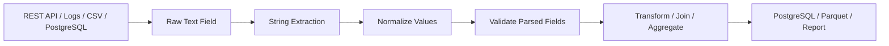

# 04- String Extraction

## Overview

String extraction is the process of deriving structured values from text fields that contain embedded information.

In Pandas, extraction is commonly performed with the `.str` accessor, especially:

```python
str.extract()
str.extractall()
```

This is useful when external systems provide semi-structured strings such as:

```text
request_id=REQ-10231 status=failed
customer=C101 region=IN
order=ORD-2026-00123
version=v2.14.7
```

The goal is to transform:

```text
unstructured or semi-structured text
        ↓
structured columns
```

For example:

```text
"order=ORD-2026-00123 status=completed"
```

can become:

```text
order_id   = ORD-2026-00123
status     = completed
```

String extraction is common in:

```text
API ingestion
log processing
ETL pipelines
data-quality analysis
event processing
reporting
legacy-system integration
```

Extraction should be treated as a parsing boundary. A successful pattern match does not automatically mean the extracted value is valid.

---

## Why String Extraction Exists

Real-world systems often embed multiple logical fields into one string.

Examples include:

```text
log messages
URLs
resource paths
compound identifiers
semi-structured API fields
legacy exports
free-form operational data
```

Suppose a log message contains:

```text
"request_id=REQ-123 customer_id=C101 status=failed"
```

Keeping the entire message as one field makes downstream analysis difficult.

Extraction allows the pipeline to produce:

```text
request_id
customer_id
status
```

as separate fields that can then be:

```text
validated
filtered
joined
grouped
aggregated
stored
```

---

## Core Extraction APIs

| API | Primary Use |
| --- | --- |
| `str.extract()` | Extract the first regex match and capture groups |
| `str.extractall()` | Extract all matches from each value |
| `str.split()` | Split predictable delimiters |
| `str.partition()` | Split around the first delimiter into fixed fields |
| `str.rsplit()` | Split from the right |
| `str.findall()` | Return all matching patterns as lists |

Use the simplest operation that correctly models the source format.

For example:

```text
"customer:C101"
```

does not require regex if a simple delimiter is sufficient.

---

## `str.extract()`

The standard syntax is:

```python
series.str.extract(
    pattern,
    expand=True,
)
```

Example:

```python
logs["customer_id"] = (
    logs["message"]
    .str.extract(
        r"customer_id=(\w+)",
        expand=False,
    )
)
```

The capture group:

```regex
(\w+)
```

defines the value to return.

`expand=False` returns a Series when there is one capture group.

---

## Example Dataset

```python
import pandas as pd


logs = pd.DataFrame(
    {
        "event_id": [
            "EVT-001",
            "EVT-002",
            "EVT-003",
            "EVT-004",
        ],
        "message": [
            "request_id=REQ-1001 customer_id=C101 status=completed",
            "request_id=REQ-1002 customer_id=C102 status=failed",
            "request_id=REQ-1003 customer_id=C103 status=pending",
            "request_id=REQ-1004 customer_id=C104 status=completed",
        ],
    }
)
```

Extract the customer ID:

```python
logs["customer_id"] = (
    logs["message"]
    .str.extract(
        r"customer_id=([A-Za-z0-9-]+)",
        expand=False,
    )
)
```

The output is:

```text
customer_id
-----------
C101
C102
C103
C104
```

---

## Capture Groups

Regex extraction depends on capture groups.

Given:

```text
order_id=ORD-2026-00123
```

use:

```python
orders["order_id"] = (
    logs["message"]
    .str.extract(
        r"order_id=([A-Za-z0-9-]+)",
        expand=False,
    )
)
```

The parentheses define the data to return.

Without a capture group:

```python
logs["message"].str.extract(
    r"order_id=[A-Za-z0-9-]+",
    expand=False,
)
```

does not provide the extracted value in the intended way because the extraction API is designed around capture groups.

A useful mental model is:

```text
regex
    ↓
match structure
    ↓
capture group
    ↓
output column
```

---

## Multiple Capture Groups

One extraction can produce multiple columns.

Suppose:

```text
"customer_id=C101 region=IN"
```

Use:

```python
extracted = (
    logs["message"]
    .str.extract(
        r"customer_id=(\w+)\s+region=(\w+)",
    )
)

extracted.columns = [
    "customer_id",
    "region",
]
```

With `expand=True`, the result is a DataFrame.

A cleaner approach is named groups:

```python
extracted = logs[
    "message"
].str.extract(
    r"customer_id=(?P<customer_id>\w+)"
    r"\s+region=(?P<region>\w+)",
)
```

Named capture groups make the extraction contract clearer.

---

## Named Capture Groups

Prefer named groups when an extraction produces multiple fields:

```python
parsed = logs[
    "message"
].str.extract(
    (
        r"request_id=(?P<request_id>[A-Za-z0-9-]+)"
        r"\s+customer_id=(?P<customer_id>[A-Za-z0-9-]+)"
        r"\s+status=(?P<status>[A-Za-z]+)"
    )
)
```

The resulting DataFrame contains:

```text
request_id
customer_id
status
```

This reduces the chance of positional column-mapping mistakes.

---

## Missing Matches

When no pattern is found, the extraction result is missing.

Example:

```python
messages = pd.Series(
    [
        "customer_id=C101",
        "customer_id=C102",
        "invalid message",
    ]
)

customer_ids = messages.str.extract(
    r"customer_id=(\w+)",
    expand=False,
)
```

Conceptually:

```text
C101
C102
NaN
```

This is a critical production behavior.

A missing extraction can mean:

```text
optional field
malformed input
upstream schema change
unexpected message format
corrupt record
```

Do not automatically fill extraction failures with arbitrary values.

---

## Validate Extraction Results

For a required identifier:

```python
logs["customer_id"] = (
    logs["message"]
    .str.extract(
        r"customer_id=(?P<customer_id>[A-Za-z0-9-]+)",
        expand=False,
    )
)

invalid = logs.loc[
    logs["customer_id"].isna()
]

if not invalid.empty:
    raise ValueError(
        "Messages without a valid customer_id were found."
    )
```

This separates:

```text
parsing
```

from:

```text
validation
```

That separation is important in production pipelines.

---

## Extraction and Normalization

The extracted value may still require normalization.

Example:

```python
logs["customer_id"] = (
    logs["message"]
    .str.extract(
        r"customer_id=(?P<customer_id>[A-Za-z0-9-]+)",
        expand=False,
    )
    .astype("string")
    .str.strip()
    .str.upper()
)
```

The pipeline becomes:

```text
raw message
    ↓
extract
    ↓
normalize
    ↓
validate
```

Do not assume that matching a regex guarantees canonical representation.

---

## `expand=False` Versus `expand=True`

| Setting | One Capture Group | Multiple Capture Groups |
| --- | --- | --- |
| `expand=False` | Series | DataFrame-like result |
| `expand=True` | DataFrame | DataFrame |

For a single field:

```python
customer_id = logs[
    "message"
].str.extract(
    r"customer_id=(\w+)",
    expand=False,
)
```

For multiple fields:

```python
parsed = logs[
    "message"
].str.extract(
    (
        r"customer_id=(?P<customer_id>\w+)"
        r"\s+status=(?P<status>\w+)"
    )
)
```

Prefer named groups and explicit columns when extraction becomes part of a reusable transformation.

---

## Extracting URLs or Paths

String extraction is useful for URL and resource-path parsing.

Suppose:

```text
/api/v2/customers/C101/orders/O1001
```

Use:

```python
paths = pd.Series(
    [
        "/api/v2/customers/C101/orders/O1001",
        "/api/v2/customers/C102/orders/O1002",
    ]
)

parsed = paths.str.extract(
    (
        r"/api/v2/customers/"
        r"(?P<customer_id>[^/]+)"
        r"/orders/"
        r"(?P<order_id>[^/]+)"
    )
)
```

Result:

```text
customer_id | order_id
-------------|---------
C101         | O1001
C102         | O1002
```

When working with untrusted URLs, validate allowed formats rather than relying on overly permissive patterns.

---

## Extracting Version Numbers

For application logs:

```text
"service=payments version=2.14.7 status=healthy"
```

use:

```python
logs["version"] = (
    logs["message"]
    .str.extract(
        r"version=(?P<version>\d+\.\d+\.\d+)",
        expand=False,
    )
)
```

Then optionally parse into components:

```python
version_parts = logs[
    "version"
].str.split(
    ".",
    expand=True,
)

version_parts.columns = [
    "major",
    "minor",
    "patch",
]
```

Use the simplest representation needed by downstream logic.

---

## Extracting Financial References

Suppose transaction records contain:

```text
"payment_ref=PAY-2026-000123 amount=2500 currency=INR"
```

Extract the fields:

```python
payments = logs[
    "message"
].str.extract(
    (
        r"payment_ref=(?P<payment_ref>[A-Za-z0-9-]+)"
        r"\s+amount=(?P<amount>\d+(?:\.\d+)?)"
        r"\s+currency=(?P<currency>[A-Z]{3})"
    )
)
```

Then convert numeric fields explicitly:

```python
payments["amount"] = pd.to_numeric(
    payments["amount"],
    errors="raise",
)
```

Extraction and dtype normalization should remain separate stages.

---

## `str.extractall()`

`extractall()` is used when multiple matches can exist in a single string.

Example:

```python
messages = pd.Series(
    {
        "EVT-001": (
            "customer=C101 customer=C102"
        ),
        "EVT-002": (
            "customer=C103"
        ),
    }
)

customers = messages.str.extractall(
    r"customer=(?P<customer_id>\w+)"
)
```

This produces multiple rows for observations with multiple matches.

Conceptually:

```text
original row
    ↓
multiple matches
    ↓
multiple extracted rows
```

This changes the output shape and therefore requires explicit grain reasoning.

---

## `extract()` Versus `extractall()`

| Operation | Behavior |
| --- | --- |
| `extract()` | First match per input value |
| `extractall()` | Every match per input value |
| Output | One row per input for `extract()` |
| Output | Multiple rows possible for `extractall()` |

Use `extract()` when the field should occur once.

Use `extractall()` when the source contains a repeated pattern and every match matters.

---

## Output Grain With `extractall()`

Suppose one event contains:

```text
customer=C101 customer=C102
```

The original dataset has:

```text
one row = one event
```

After `extractall()`:

```text
one row = one event/match
```

This is a grain change.

If the extracted records are later joined to another table, duplicate multiplication can occur if the new grain is misunderstood.

Always document the intended output grain.

---

## Index Behavior of `extractall()`

`extractall()` returns a DataFrame with a MultiIndex containing:

```text
original index
match number
```

Conceptually:

```text
event_id    match    customer_id
---------   -----    -----------
EVT-001        0     C101
EVT-001        1     C102
EVT-002        0     C103
```

Convert the result into ordinary columns when that is easier for downstream processing:

```python
customers = (
    messages
    .str.extractall(
        r"customer=(?P<customer_id>\w+)"
    )
    .reset_index()
)
```

The resulting schema should then be validated before further joins.

---

## Simple Delimiter Extraction

Regex is not always necessary.

For:

```text
"customer:C101"
```

simple splitting may be clearer:

```python
customers = (
    values
    .str.split(
        ":",
        n=1,
        expand=True,
    )
)

customers.columns = [
    "key",
    "value",
]
```

Prefer delimiter-based operations when the source format is simple and deterministic.

Use regex when the structure is more flexible or conditional.

---

## `str.partition()`

When a value contains one known delimiter:

```python
parts = values.str.partition(":")
```

This returns three columns:

```text
before delimiter
delimiter
after delimiter
```

For example:

```text
customer:C101

→ customer
→ :
→ C101
```

`partition()` can be easier to reason about than regex when exactly one delimiter defines the structure.

---

## `str.split()`

For structured delimiters:

```python
parts = (
    values
    .str.split(
        "|",
        expand=True,
    )
)
```

Example:

```text
C101|IN|premium
```

becomes:

```text
C101
IN
premium
```

For stable input schemas, this can be preferable to regular expressions.

---

## Extraction From JSON-Like Text

Avoid regex when the source is actually valid JSON.

If a column contains serialized JSON:

```text
{"customer_id":"C101","region":"IN"}
```

prefer parsing the JSON structurally rather than extracting values with regex.

For example:

```python
import json


def parse_payload(value: str) -> dict[str, object]:
    return json.loads(value)
```

When the data is already represented as structured JSON, use a JSON parser rather than treating it as arbitrary text.

Regex should be reserved for genuinely textual or semi-structured formats.

---

## Extraction From Database Results

A PostgreSQL query may return a semi-structured text column:

```sql
SELECT
    event_id,
    raw_message
FROM event_logs
WHERE created_at >= :start_time
  AND created_at < :end_time;
```

Pandas can then extract required fields:

```python
logs["request_id"] = (
    logs["raw_message"]
    .str.extract(
        r"request_id=(?P<request_id>[A-Za-z0-9-]+)",
        expand=False,
    )
)
```

When possible, however, structured fields should be extracted at the database or source layer before data reaches Pandas.

---

## API and Log Processing

A practical API/log pipeline may look like:



String extraction belongs near the ingestion boundary because downstream components should ideally operate on structured fields.

---

## Invalid and Unexpected Input

Extraction patterns should account for malformed data.

Example:

```python
pattern = (
    r"request_id=(?P<request_id>[A-Za-z0-9-]+)"
)

parsed = logs[
    "message"
].str.extract(
    pattern
)

invalid = logs.loc[
    parsed["request_id"].isna()
]

if not invalid.empty:
    invalid.to_parquet(
        "invalid_records.parquet"
    )
```

Depending on the pipeline, invalid records can be:

```text
rejected
quarantined
sent to a dead-letter location
logged as quality failures
reprocessed after correction
```

---

## Extraction and Duplicate Records

Suppose multiple records contain the same extracted identifier:

```text
request_id=REQ-1001
request_id=REQ-1001
```

This may indicate:

```text
duplicate events
retry
legitimate repeated references
```

Do not deduplicate automatically.

First determine the row grain and business semantics.

Then validate the appropriate key:

```python
request_ids = parsed[
    "request_id"
]

duplicate_ids = (
    request_ids
    .value_counts()
)

duplicate_ids = duplicate_ids[
    duplicate_ids > 1
]
```

---

## Extraction and Data Types

Extracted values usually begin as strings.

For numeric data:

```python
parsed["amount"] = pd.to_numeric(
    parsed["amount"],
    errors="raise",
)
```

For timestamps:

```python
parsed["created_at"] = pd.to_datetime(
    parsed["created_at"],
    utc=True,
    errors="raise",
)
```

For identifiers:

```python
parsed["customer_id"] = (
    parsed["customer_id"]
    .astype("string")
    .str.strip()
    .str.upper()
)
```

Parsing and dtype conversion should be deliberate.

---

## Regex Design

A production extraction regex should be:

```text
specific enough to avoid false matches
flexible enough to handle valid formats
readable enough to maintain
```

Prefer:

```python
r"request_id=(?P<request_id>[A-Za-z0-9-]+)"
```

over an excessively broad:

```python
r"request_id=(?P<request_id>.+)"
```

The broad pattern can consume unrelated trailing text.

Regex should match the expected grammar of the source, not simply "something after the key."

---

## Anchors and Boundaries

Use anchors when the field must occur at a particular location.

For example:

```python
values.str.extract(
    r"^customer=(?P<customer_id>\w+)$",
)
```

matches the complete string format:

```text
customer=C101
```

but not:

```text
prefix customer=C101 suffix
```

Use anchors when strict validation is part of the requirement.

For embedded extraction, avoid anchors that unintentionally reject valid messages.

---

## Optional Fields

Suppose the message can contain an optional region:

```text
customer=C101
customer=C102 region=IN
```

A named optional capture:

```python
parsed = logs[
    "message"
].str.extract(
    (
        r"customer=(?P<customer_id>\w+)"
        r"(?:\s+region=(?P<region>\w+))?"
    )
)
```

can produce:

```text
customer_id | region
------------|-------
C101        | NaN
C102        | IN
```

Optional fields should then be handled according to the source contract.

---

## Case Sensitivity

Extraction is normally case-sensitive unless the pattern or matching configuration says otherwise.

If source formats are inconsistent:

```text
Customer=C101
customer=C102
CUSTOMER=C103
```

either normalize the source first:

```python
normalized = (
    logs["message"]
    .astype("string")
    .str.lower()
)
```

or use a case-insensitive regex strategy where appropriate.

Prefer normalizing a well-defined category or protocol field over making every regex excessively permissive.

---

## Performance Considerations

Regex extraction can be more expensive than simple string operations.

For large datasets:

```text
prefer literal string methods when possible
avoid repeated regex compilation where practical
project only required columns
filter data before expensive extraction when possible
```

For example, if only failed records contain the required diagnostic field:

```python
failed_logs = logs.loc[
    logs["status"].eq("failed")
].copy()

failed_logs["request_id"] = (
    failed_logs["message"]
    .str.extract(
        r"request_id=(?P<request_id>[A-Za-z0-9-]+)",
        expand=False,
    )
)
```

Reducing the population before extraction can materially decrease work.

---

## Avoid Repeated Extraction

Avoid extracting the same pattern multiple times:

```python
logs["request_id"] = (
    logs["message"]
    .str.extract(
        r"request_id=(\w+)",
        expand=False,
    )
)

logs["customer_id"] = (
    logs["message"]
    .str.extract(
        r"customer_id=(\w+)",
        expand=False,
    )
)
```

when a single regex can safely extract all required fields:

```python
parsed = logs[
    "message"
].str.extract(
    (
        r"request_id=(?P<request_id>\w+)"
        r"\s+customer_id=(?P<customer_id>\w+)"
    )
)

logs[
    [
        "request_id",
        "customer_id",
    ]
] = parsed
```

Only combine patterns when the source format is sufficiently stable and the resulting regex remains maintainable.

---

## Large-Scale Processing

For very large text datasets:

```text
database filtering
→ column projection
→ batch extraction
→ validation
→ downstream processing
```

is preferable to loading the entire source table unnecessarily.

For example:

```python
for chunk in pd.read_csv(
    "logs.csv",
    usecols=[
        "event_id",
        "message",
    ],
    chunksize=100_000,
):
    chunk["request_id"] = (
        chunk["message"]
        .str.extract(
            r"request_id=(?P<request_id>[A-Za-z0-9-]+)",
            expand=False,
        )
    )

    process(chunk)
```

Chunking limits peak memory usage.

Global operations may still require additional state.

---

## Extraction and Parquet

After extraction, structured fields can be stored in Parquet:

```python
parsed = logs[
    "message"
].str.extract(
    (
        r"request_id=(?P<request_id>[A-Za-z0-9-]+)"
        r"\s+customer_id=(?P<customer_id>[A-Za-z0-9-]+)"
    )
)

parsed.to_parquet(
    "parsed_events.parquet",
    index=False,
)
```

This allows future jobs to consume typed structured columns instead of reparsing raw text repeatedly.

A common architecture is:

```text
raw text
→ parse once
→ validate
→ store structured representation
→ reuse downstream
```

This reduces repeated parsing cost.

---

## Security Considerations

String extraction can accidentally expose sensitive values.

Potential examples include:

```text
access tokens
API keys
authorization headers
session identifiers
personal information
account numbers
```

Never extract sensitive fields into unrestricted logs or reports simply because they are available in the source text.

Example of a safer logging pattern:

```python
parsed = logs[
    "message"
].str.extract(
    r"request_id=(?P<request_id>[A-Za-z0-9-]+)",
    expand=False,
)

logger.info(
    "log_batch_processed",
    extra={
        "row_count": len(logs),
        "request_id_count": int(
            parsed.notna().sum()
        ),
    },
)
```

Validate and redact sensitive values before persistence.

---

## Reliability Considerations

Treat extraction logic as part of the data contract.

Document:

```text
source format
required fields
optional fields
allowed characters
case sensitivity
expected occurrence count
invalid-record policy
normalization rules
output dtype
```

For example:

```text
Field: request_id
Source: application log message
Required: yes
Format: REQ-[A-Z0-9-]+
Occurrence: once per message
Normalization: uppercase
Invalid policy: quarantine
Output dtype: string
```

This makes parser behavior reproducible and reviewable.

---

## Testing

Extraction tests should cover valid and malformed inputs.

```python
def test_extract_customer_id() -> None:
    messages = pd.Series(
        [
            "customer_id=C101 status=completed",
            "customer_id=C102 status=failed",
        ]
    )

    result = messages.str.extract(
        r"customer_id=(?P<customer_id>[A-Za-z0-9-]+)",
        expand=False,
    )

    expected = pd.Series(
        ["C101", "C102"],
        dtype="string",
    )

    result = result.astype("string")

    assert result.equals(expected)
```

---

## Testing Missing Matches

```python
def test_missing_customer_id_is_detected() -> None:
    messages = pd.Series(
        [
            "customer_id=C101",
            "status=failed",
        ]
    )

    result = messages.str.extract(
        r"customer_id=(?P<customer_id>[A-Za-z0-9-]+)",
        expand=False,
    )

    assert result.notna().sum() == 1
    assert result.isna().sum() == 1
```

The test verifies parser coverage rather than only successful examples.

---

## Testing Multiple Matches

```python
def test_extractall_returns_all_matches() -> None:
    messages = pd.Series(
        {
            "EVT-001": (
                "customer=C101 customer=C102"
            )
        }
    )

    result = messages.str.extractall(
        r"customer=(?P<customer_id>\w+)"
    )

    assert result["customer_id"].tolist() == [
        "C101",
        "C102",
    ]
```

This verifies that repeated matches are preserved.

---

## Common Mistakes

### Using Regex When Splitting Is Enough

For:

```text
C101|IN|premium
```

simple:

```python
str.split("|")
```

may be clearer than a regex.

Use regex when pattern structure actually requires it.

---

### Forgetting Capture Groups

Extraction patterns should define the values to capture:

```python
r"customer_id=(\w+)"
```

The capture group determines the extracted field.

---

### Using `.+` Excessively

Avoid:

```python
r"customer_id=(.+)"
```

because it may consume additional fields.

Prefer a bounded pattern:

```python
r"customer_id=(?P<customer_id>[A-Za-z0-9-]+)"
```

---

### Assuming Every Match Is Valid

A regex can match syntactically while still violating business rules.

Validate:

```text
format
length
allowed values
existence
uniqueness
```

as required.

---

### Ignoring Missing Matches

A missing extraction can signal malformed input or upstream schema changes.

Track extraction failure rates.

---

### Using `extract()` When Multiple Values Exist

`extract()` is appropriate when one match is expected.

Use:

```python
str.extractall()
```

when every match matters.

---

### Ignoring Grain Changes

`extractall()` can turn:

```text
one row = one event
```

into:

```text
one row = one event/match
```

This can affect joins and aggregations.

---

### Reparsing the Same Raw Text Repeatedly

Repeated regex processing increases CPU cost.

Parse once and persist structured fields when the workflow justifies it.

---

### Parsing Structured JSON With Regex

If the input is valid JSON, use a JSON parser.

Regex is not a substitute for a structured parser.

---

### Logging Extracted Sensitive Values

Extracting an API key or token and then writing it to logs can create a security incident.

Extract only required fields and redact sensitive information.

---

## Interview Traps

### `extract()` Versus `extractall()`

```text
extract()
→ one match per input value

extractall()
→ all matches per input value
```

---

### Why Are Capture Groups Required?

Capture groups define which portion of the matched pattern should be returned as extracted data.

---

### `expand=False` Versus `expand=True`

```text
expand=False
→ Series for a single capture group

expand=True
→ DataFrame-style output
```

Use named capture groups for readable multi-field extraction.

---

### Why Can Extraction Produce Nulls?

Because some source values do not match the pattern.

This should be treated as a data-quality condition when the field is required.

---

### Why Is `extractall()` More Complicated?

Because it can change row grain and returns a MultiIndex representing:

```text
original row
+
match number
```

---

### Regex Versus `split()`

Use:

```text
split()
→ predictable delimiter-based structure

regex extraction
→ pattern-based or conditional structure
```

Choose the simplest correct parser.

---

### Why Parse JSON Structurally?

JSON has a defined grammar.

A JSON parser understands:

```text
objects
arrays
strings
numbers
nulls
nested fields
```

A regex does not provide the same structural guarantees.

---

## Production Checklist

Before deploying string extraction logic, verify:

```text
[ ] Source format is documented
[ ] Required and optional fields are defined
[ ] Appropriate extraction method is selected
[ ] Capture groups are explicit
[ ] Named groups are used for complex extraction
[ ] Missing matches are handled
[ ] Extracted values are normalized where required
[ ] Output dtypes are validated
[ ] Invalid records have a defined policy
[ ] Duplicate semantics are understood
[ ] Row grain is preserved or explicitly changed
[ ] Multiple matches use extractall() when appropriate
[ ] Regex complexity is justified
[ ] Structured formats such as JSON use structural parsers
[ ] Database filtering is pushed down where practical
[ ] Raw text is not unnecessarily reparsed
[ ] High-volume extraction is benchmarked
[ ] Sensitive extracted values are protected
[ ] Extraction failure rates are monitored
[ ] Valid, invalid, missing, and repeated-match cases are tested
```

---

## Key Takeaways

- `str.extract()` converts pattern-based text into structured fields, while `str.extractall()` preserves every matching occurrence and can change the row grain.
- Use named capture groups for multi-field extraction and prefer simple operations such as `split()` or `partition()` when the source structure does not require regex.
- Extraction is only parsing; production pipelines must separately normalize, validate, type-convert, and handle missing or malformed matches.
- Regex design should be specific enough to avoid false captures, and structured formats such as JSON should be parsed with structural parsers rather than regular expressions.
- For production-scale ETL, parse near the ingestion boundary, reduce the input population before expensive extraction, persist reusable structured fields when appropriate, monitor parser failures, and protect sensitive extracted data.