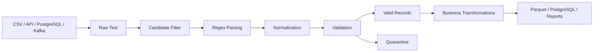

# 05- Regular Expressions

## Overview

Regular expressions, commonly called regex, provide a pattern language for identifying, validating, locating, and extracting text.

In Pandas, regex is primarily used through the `.str` accessor:

```python
Series.str.contains()
Series.str.match()
Series.str.fullmatch()
Series.str.extract()
Series.str.extractall()
Series.str.replace()
Series.str.findall()
```

Regex is particularly useful when source data contains semi-structured text such as:

```text
application logs
transaction references
resource paths
version strings
API metadata
legacy exports
event payload fragments
```

A typical data-processing flow is:

```text
raw text
   ↓
pattern matching
   ↓
extraction / normalization
   ↓
validation
   ↓
structured columns
```

Regex is powerful, but it should not become the default parser for structured formats. If the input is JSON, XML, a database field, or another format with a dedicated parser, use the appropriate parser instead.

---

## Why Regular Expressions Matter in Pandas

Production data frequently contains information that is structurally meaningful but stored as text.

Examples:

```text
"request_id=REQ-1001 status=failed"
"/api/v2/customers/C101/orders/O1001"
"PAY-2026-000123"
"version=2.14.7"
"customer:C101|region:IN"
```

A regex can identify the structure without requiring a Python loop over every row.

Pandas applies the operation across the Series:

```python
logs["request_id"] = (
    logs["message"]
    .str.extract(
        r"request_id=(?P<request_id>[A-Za-z0-9-]+)",
        expand=False,
    )
)
```

This is usually clearer and more efficient than manually iterating through DataFrame rows.

---

## Regex in the Pandas String API

The `.str` accessor provides vectorized string operations.

| Pandas operation | Typical purpose |
| --- | --- |
| `str.contains()` | Determine whether a pattern exists |
| `str.match()` | Match a pattern from the beginning |
| `str.fullmatch()` | Require the entire value to match |
| `str.extract()` | Return capture groups |
| `str.extractall()` | Return all matches |
| `str.findall()` | Return matching substrings as lists |
| `str.replace()` | Replace matching text |
| `str.split()` | Split strings using a pattern or delimiter |

These operations are designed to work directly with Series values and generally preserve the Series index unless the operation changes shape, such as `extractall()`.

---

## Regex Building Blocks

A regex is composed of pattern elements that describe what should match.

Common elements include:

| Pattern | Meaning |
| --- | --- |
| `.` | Any character except newline by default |
| `\d` | Digit |
| `\w` | Word character |
| `\s` | Whitespace |
| `[A-Z]` | One uppercase letter |
| `[0-9]` | One digit |
| `+` | One or more |
| `*` | Zero or more |
| `?` | Zero or one |
| `{n}` | Exactly `n` occurrences |
| `{n,m}` | Between `n` and `m` |
| `^` | Start of string |
| `$` | End of string |
| `(...)` | Capture group |
| `(?:...)` | Non-capturing group |
| `(?P<name>...)` | Named capture group |
| `|` | Alternation |
| `\b` | Word boundary |

Regex should describe the actual source contract rather than simply matching the largest possible string.

---

## Character Classes

Character classes define the allowed characters.

Example:

```python
r"[A-Z]+"
```

matches uppercase sequences:

```text
ABC
IN
ERROR
```

A customer identifier might use:

```python
r"[A-Za-z0-9-]+"
```

which permits letters, digits, and hyphens.

Character classes are preferable to overly broad constructs such as:

```python
r".+"
```

when the expected format is known.

---

## Quantifiers

Quantifiers control how many times a pattern can occur.

```text
+      one or more
*      zero or more
?      zero or one
{3}    exactly three
{2,5}  between two and five
```

Example:

```python
r"REQ-\d{6}"
```

matches:

```text
REQ-123456
```

but not:

```text
REQ-123
REQ-1234567
```

This can be useful for enforcing an identifier format.

---

## Anchors

Anchors define where a pattern must occur.

```python
r"^REQ-\d{6}$"
```

means:

```text
start of string
    ↓
REQ-
    ↓
six digits
    ↓
end of string
```

For validation, anchors are often essential.

```python
valid = (
    transactions["reference"]
    .astype("string")
    .str.fullmatch(r"PAY-\d{4}-\d{6}")
)
```

Using `fullmatch()` communicates the intent more clearly than manually adding `^` and `$` in many validation cases.

---

## `str.contains()`

Use `str.contains()` when the question is:

> Does this value contain a matching pattern?

Example:

```python
failed = logs[
    logs["message"].str.contains(
        r"\bERROR\b",
        na=False,
    )
]
```

The output is a boolean Series:

```text
True
False
True
...
```

This is useful for filtering logs, events, and text fields.

---

## Literal Versus Regex Matching

`str.contains()` uses regex semantics by default.

For literal text, disable regex:

```python
emails = users[
    users["email"].str.contains(
        "@example.com",
        regex=False,
        na=False,
    )
]
```

This distinction matters when user-provided text contains regex metacharacters such as:

```text
.
*
+
?
[
]
(
)
```

When matching literal input, `regex=False` is often safer and simpler.

---

## `na=False`

String operations can encounter missing values.

Use:

```python
logs["message"].str.contains(
    r"timeout",
    na=False,
)
```

when the desired behavior is:

```text
missing value → False
```

Without an explicit policy, missing values can propagate into the boolean result and complicate filtering.

The correct choice depends on the business meaning of missing data.

---

## `str.match()`

`str.match()` checks whether the pattern matches from the beginning of the string.

Example:

```python
valid_prefix = orders[
    orders["order_id"].str.match(
        r"^ORD-\d+",
        na=False,
    )
]
```

A value beginning with the expected pattern can match even if additional characters follow.

For complete validation, use `fullmatch()` instead.

---

## `str.fullmatch()`

`fullmatch()` requires the complete string to match the supplied regex.

Example:

```python
valid = orders[
    orders["order_id"]
    .astype("string")
    .str.fullmatch(
        r"ORD-\d{8}",
        na=False,
    )
]
```

This is useful for:

```text
identifier validation
version validation
country-code validation
reference-number validation
format enforcement
```

The distinction is important:

| Method | Matching behavior |
| --- | --- |
| `contains()` | Pattern can occur anywhere |
| `match()` | Match must begin at the start |
| `fullmatch()` | Entire string must match |

---

## `str.extract()`

Use `extract()` when the objective is to return parts of a match.

Example:

```python
logs["request_id"] = (
    logs["message"]
    .str.extract(
        r"request_id=(?P<request_id>[A-Za-z0-9-]+)",
        expand=False,
    )
)
```

The named capture group becomes the extracted value.

With multiple groups:

```python
parsed = logs[
    "message"
].str.extract(
    (
        r"request_id=(?P<request_id>[A-Za-z0-9-]+)"
        r"\s+status=(?P<status>[A-Za-z]+)"
    )
)
```

The result is a DataFrame containing:

```text
request_id
status
```

---

## `str.extractall()`

When a field can appear multiple times:

```python
events = pd.Series(
    {
        "EVT-001": (
            "customer=C101 customer=C102"
        ),
        "EVT-002": "customer=C103",
    }
)

customers = events.str.extractall(
    r"customer=(?P<customer_id>[A-Za-z0-9-]+)"
)
```

This returns every match.

Unlike `extract()`, it can produce multiple output rows for one input row.

That means the output grain changes from:

```text
one row = one event
```

to:

```text
one row = one event/match
```

This should be treated as a schema change.

---

## Capture Groups

Capture groups specify which part of a pattern should be returned.

Example:

```python
pattern = r"customer_id=(\w+)"

customer_ids = (
    logs["message"]
    .str.extract(
        pattern,
        expand=False,
    )
)
```

The parentheses define the extracted value.

Non-capturing groups are useful when grouping is needed for matching but the group should not become an output column:

```python
pattern = (
    r"status=(?:success|failed|pending)"
)
```

Named capture groups are preferable for maintainable multi-field parsing:

```python
pattern = (
    r"customer_id=(?P<customer_id>\w+)"
    r"\s+region=(?P<region>[A-Z]{2})"
)
```

---

## Alternation

The `|` operator represents alternatives.

Example:

```python
pattern = r"\b(?:ERROR|CRITICAL|FATAL)\b"

errors = logs[
    logs["message"].str.contains(
        pattern,
        na=False,
    )
]
```

This allows several equivalent source values to be handled by one pattern.

Do not use alternation as a substitute for data normalization when the values represent the same canonical concept.

---

## Word Boundaries

A word boundary can prevent accidental partial matches.

Consider:

```python
r"ERROR"
```

which can match:

```text
ERROR
ERROR_CODE
SOME_ERROR
```

Use:

```python
r"\bERROR\b"
```

when only the standalone word should match.

This is particularly important for log classification.

---

## Escaping Regex Metacharacters

Characters such as:

```text
.
+
*
?
[
]
(
)
{
}
|
^
$
```

have special meanings.

For example:

```python
r"\."
```

matches a literal period.

When matching user-controlled literal text, prefer:

```python
import re

pattern = re.escape(user_input)
```

For example:

```python
pattern = re.escape("v1.2.3")

matches = versions[
    versions["value"].str.contains(
        pattern,
        regex=True,
        na=False,
    )
]
```

This prevents the input from being interpreted as an arbitrary regex.

---

## Flags

Python regex supports flags that alter matching behavior.

For case-insensitive matching:

```python
import re


mask = logs["message"].str.contains(
    r"\berror\b",
    flags=re.IGNORECASE,
    na=False,
)
```

Alternatively, normalize case before matching:

```python
mask = (
    logs["message"]
    .astype("string")
    .str.lower()
    .str.contains(
        "error",
        regex=False,
        na=False,
    )
)
```

For simple cases, normalization plus literal matching is often easier to maintain.

---

## Case Sensitivity

Case-sensitive matching is usually the safest default because it follows the actual source contract.

For case-insensitive identifiers or categories:

```python
mask = logs["message"].str.contains(
    r"\bwarning\b",
    case=False,
    na=False,
)
```

Do not make extraction patterns case-insensitive merely to hide upstream data-quality problems.

Case normalization should be a deliberate transformation step.

---

## Raw Python Strings

Regex patterns are commonly written as raw strings:

```python
r"\d{4}-\d{2}-\d{2}"
```

instead of:

```python
"\d{4}-\d{2}-\d{2}"
```

Raw strings reduce escaping complexity and make regex easier to read.

---

## Common Backend Extraction Pattern

Suppose an event log stores:

```text
request_id=REQ-10231 customer_id=C101 status=failed
```

A production-oriented parsing step can be:

```python
import pandas as pd


pattern = (
    r"request_id=(?P<request_id>[A-Za-z0-9-]+)"
    r"\s+customer_id=(?P<customer_id>[A-Za-z0-9-]+)"
    r"\s+status=(?P<status>[A-Za-z]+)"
)

parsed = logs["message"].str.extract(pattern)

parsed["request_id"] = (
    parsed["request_id"]
    .astype("string")
    .str.upper()
)

parsed["customer_id"] = (
    parsed["customer_id"]
    .astype("string")
    .str.upper()
)

parsed["status"] = (
    parsed["status"]
    .astype("string")
    .str.lower()
)
```

The stages are explicit:

```text
extract
→ type
→ normalize
→ validate
```

This is easier to test than embedding every step in one expression.

---

## Validation With Regex

Regex can be used as a data-quality rule.

Example:

```python
valid_reference = (
    transactions["reference"]
    .astype("string")
    .str.fullmatch(
        r"PAY-\d{4}-\d{6}",
        na=False,
    )
)

invalid_transactions = transactions.loc[
    ~valid_reference
]
```

This identifies invalid records without silently modifying them.

A production pipeline can then:

```text
valid records → downstream processing
invalid records → quarantine / review
```

---

## Regex-Based Normalization

Regex is also useful for normalization.

Suppose phone numbers contain punctuation:

```text
+91-98765-43210
+91 (98765) 43210
+919876543210
```

A normalization rule might be:

```python
customers["phone_digits"] = (
    customers["phone"]
    .astype("string")
    .str.replace(
        r"\D+",
        "",
        regex=True,
    )
)
```

This removes non-digit characters.

However, normalization does not prove the result is a valid phone number. Validation should still be applied.

---

## Regex Replacement

`str.replace()` can modify matching text.

Example:

```python
logs["message"] = (
    logs["message"]
    .str.replace(
        r"token=[^\s]+",
        "token=[REDACTED]",
        regex=True,
    )
)
```

This can be useful for sanitizing operational data before storage or reporting.

Be careful not to mutate the only copy of raw data when forensic investigation may be required.

Prefer:

```text
raw zone
    ↓
sanitized processing zone
```

rather than destructive rewriting of source data.

---

## Security: ReDoS and Untrusted Patterns

Regex can become a security concern when patterns or input values are attacker-controlled.

A poorly designed pattern can require excessive computation on crafted input. This is commonly known as Regular Expression Denial of Service (ReDoS).

Avoid highly ambiguous patterns such as:

```python
r"(a+)+$"
```

when processing untrusted text.

More importantly, never blindly execute user-provided regex against large production datasets without explicit controls.

For search endpoints, prefer:

```text
literal matching
validated patterns
bounded input size
query timeouts
rate limiting
```

depending on the application architecture.

---

## Security: User-Supplied Search Terms

Do not treat user input as regex unless regex is explicitly part of the API contract.

Unsafe pattern construction:

```python
pattern = user_input

matches = df[
    df["message"].str.contains(
        pattern,
        regex=True,
        na=False,
    )
]
```

Safer literal matching:

```python
matches = df[
    df["message"].str.contains(
        user_input,
        regex=False,
        na=False,
    )
]
```

If regex support is required, validate and constrain the pattern before applying it.

---

## Missing Values

Regex operations on missing strings require an explicit missing-value strategy.

Example:

```python
mask = (
    logs["message"]
    .astype("string")
    .str.contains(
        r"\btimeout\b",
        na=False,
    )
)
```

For extraction:

```python
request_ids = (
    logs["message"]
    .astype("string")
    .str.extract(
        r"request_id=(?P<request_id>[A-Za-z0-9-]+)",
        expand=False,
    )
)
```

Non-matching and missing values generally result in missing extracted values.

Do not confuse:

```text
missing input
```

with:

```text
non-matching input
```

unless the business contract explicitly treats them the same.

---

## Duplicate Data

Regex extraction can expose duplicate identifiers.

Example:

```python
parsed = logs["message"].str.extract(
    r"request_id=(?P<request_id>[A-Za-z0-9-]+)"
)

duplicate_ids = (
    parsed["request_id"]
    .dropna()
    .value_counts()
    .loc[lambda values: values > 1]
)
```

A duplicate can represent:

```text
retry
duplicate event
legitimate repeated processing
upstream bug
```

Regex should identify structure, not decide business deduplication rules.

---

## Empty DataFrames

Extraction should also behave predictably for empty inputs.

```python
empty_logs = pd.DataFrame(
    {
        "message": pd.Series(dtype="string")
    }
)

result = empty_logs[
    "message"
].str.extract(
    r"request_id=(?P<request_id>[A-Za-z0-9-]+)"
)
```

Production pipelines should explicitly test:

```text
empty batch
all-null column
all-invalid records
mixed valid/invalid records
```

An empty batch should normally produce an empty result with the expected schema rather than causing an unrelated failure.

---

## Regex and Data Types

Regex operates on strings.

Normalize source columns when necessary:

```python
messages = (
    logs["message"]
    .astype("string")
)

matches = messages.str.extract(
    r"order_id=(?P<order_id>[A-Za-z0-9-]+)",
    expand=False,
)
```

After extraction, assign the correct semantic dtype:

```python
logs["order_id"] = (
    matches.astype("string")
)
```

Numeric and datetime values should then be converted explicitly:

```python
logs["amount"] = pd.to_numeric(
    logs["amount"],
    errors="raise",
)

logs["event_time"] = pd.to_datetime(
    logs["event_time"],
    utc=True,
    errors="raise",
)
```

---

## Performance Characteristics

Regex processing is usually more expensive than simple literal string operations.

For large datasets:

```text
literal search
    ↓
simple normalization
    ↓
regex only where necessary
```

is generally preferable to applying complex regexes everywhere.

For example:

```python
candidate_logs = logs.loc[
    logs["service"].eq("payments")
]

candidate_logs = candidate_logs.loc[
    candidate_logs["message"]
    .str.contains(
        "request_id=",
        regex=False,
        na=False,
    )
]

parsed = candidate_logs[
    "message"
].str.extract(
    r"request_id=(?P<request_id>[A-Za-z0-9-]+)"
)
```

A cheap pre-filter can reduce the number of rows requiring regex parsing.

Measure this approach with representative production-scale data rather than assuming it always wins.

---

## Large Dataset Processing

When processing millions of records:

```text
query only required rows
query only required columns
process in chunks when necessary
avoid repeated regex work
persist structured results
```

Example:

```python
for chunk in pd.read_csv(
    "application_logs.csv",
    usecols=["event_id", "message"],
    chunksize=100_000,
):
    parsed = chunk[
        "message"
    ].str.extract(
        (
            r"request_id=(?P<request_id>[A-Za-z0-9-]+)"
            r"\s+status=(?P<status>[A-Za-z]+)"
        )
    )

    process(parsed)
```

Regex itself remains CPU work. Chunking primarily controls memory usage; it does not make the regex algorithm intrinsically cheaper.

---

## Compiled Patterns

Python's `re` module supports compiled patterns:

```python
import re


pattern = re.compile(
    r"request_id=(?P<request_id>[A-Za-z0-9-]+)"
)
```

This can be useful when the same Python regex object is reused repeatedly in Python code.

For ordinary Pandas `.str` operations, write readable patterns first and benchmark before introducing additional complexity. The main performance concern is usually the regex operation across the data, not premature pattern compilation.

---

## Regex Versus String Operations

Do not automatically use regex when a simpler vectorized operation exists.

| Requirement | Preferred approach |
| --- | --- |
| Check literal substring | `str.contains(..., regex=False)` |
| Split a known delimiter | `str.split()` |
| Split around first delimiter | `str.partition()` |
| Remove one known literal | `str.replace(..., regex=False)` |
| Match a structured pattern | Regex |
| Extract variable structured text | `str.extract()` |
| Extract repeated matches | `str.extractall()` |
| Parse JSON | `json.loads()` / JSON normalization |
| Parse timestamps | `pd.to_datetime()` |

Simpler parsing logic is usually easier to maintain and validate.

---

## Regex and SQL

Sometimes the data should be parsed before it reaches Pandas.

For example, PostgreSQL may be able to extract or validate fields with SQL expressions.

Benefits of pushing parsing into the database can include:

```text
less network transfer
filtering before materialization
database-side indexing opportunities
smaller Pandas DataFrames
```

But complex regex-heavy transformations may be easier to maintain in application code.

A practical decision is:

```text
database-native filtering/projection
        ↓
small structured dataset
        ↓
Pandas transformations
```

Do not move every regex into SQL simply because it is technically possible.

---

## Regex and REST APIs

API responses often contain structured fields already.

For example:

```json
{
  "order_id": "ORD-1001",
  "status": "completed"
}
```

Regex should not be used to parse the JSON.

However, regex may be appropriate for textual API fields such as:

```text
resource_path=/customers/C101/orders/O1001
```

After extraction:

```python
response_df["customer_id"] = (
    response_df["resource_path"]
    .str.extract(
        r"/customers/(?P<customer_id>[^/]+)",
        expand=False,
    )
)
```

---

## Regex in ETL Pipelines

A reliable ETL architecture can separate parsing from business transformation:



This separation provides clear operational boundaries.

For example:

```text
regex failure rate
normalization failure rate
validation failure rate
```

can be monitored independently.

---

## Monitoring Regex-Based Pipelines

Useful metrics include:

| Metric | Purpose |
| --- | --- |
| Extraction success rate | Detect malformed or changed input |
| Missing extracted fields | Detect upstream quality problems |
| Invalid format count | Monitor contract violations |
| Rows processed | Throughput monitoring |
| Processing duration | Performance monitoring |
| CPU usage | Capacity planning |
| Quarantined records | Operational quality monitoring |

A sudden drop in extraction success can indicate an upstream format change even when the pipeline process itself still runs successfully.

---

## Handling Upstream Schema Changes

Suppose a producer changes:

```text
customer_id=C101
```

to:

```text
customer=C101
```

The regex may begin returning nulls without raising a Python exception.

This makes extraction failures particularly dangerous: the pipeline can appear healthy while silently producing incomplete data.

Protect against this with:

```text
schema assumptions
validation thresholds
metrics
alerts
sample-based monitoring
tests using representative source data
```

For example:

```python
success_rate = (
    logs["customer_id"]
    .notna()
    .mean()
)

if success_rate < 0.99:
    raise ValueError(
        "Customer ID extraction rate below threshold."
    )
```

Thresholds should reflect the actual business contract.

---

## Testing Regex Logic

Regex logic should be tested independently from the rest of the pipeline.

Example:

```python
import pandas as pd


def extract_order_ids(
    messages: pd.Series,
) -> pd.Series:
    return (
        messages
        .astype("string")
        .str.extract(
            r"order_id=(?P<order_id>[A-Za-z0-9-]+)",
            expand=False,
        )
    )
```

Test valid input:

```python
def test_extract_order_ids() -> None:
    messages = pd.Series(
        [
            "order_id=ORD-1001 status=completed",
            "order_id=ORD-1002 status=failed",
        ],
        dtype="string",
    )

    result = extract_order_ids(messages)

    expected = pd.Series(
        ["ORD-1001", "ORD-1002"],
        dtype="string",
    )

    assert result.reset_index(drop=True).equals(
        expected
    )
```

---

## Testing Edge Cases

A robust test matrix should include:

| Case | Expected behavior |
| --- | --- |
| Valid input | Extract value |
| Missing value | Missing result |
| No match | Missing result |
| Invalid format | Validation failure |
| Extra fields | Correct extraction |
| Repeated field | Defined behavior |
| Empty input | Empty result with valid schema |
| Unicode input | Defined behavior |
| Case variation | Defined behavior |
| Duplicate identifiers | Detected separately |

Regex tests should represent actual production formats, not only idealized examples.

---

## Testing Security-Sensitive Patterns

When regex processes untrusted data, include adversarial cases.

Test:

```text
very long strings
unexpected delimiters
special characters
nested-looking input
empty strings
malformed identifiers
```

For externally supplied patterns, test:

```text
pattern length
allowed syntax
execution cost
timeout behavior
```

Do not rely solely on correctness tests; performance behavior can itself be a security requirement.

---

## Common Mistakes

### Using Regex for Structured Data

Parsing JSON with regex is fragile.

Prefer the format's parser when one exists.

---

### Using `.*` or `.+` Too Broadly

Broad patterns can consume unintended fields.

Prefer bounded patterns that reflect the source grammar.

---

### Forgetting `fullmatch()`

A pattern such as:

```python
str.match(r"ORD-\d+")
```

can accept values with extra trailing content.

Use:

```python
str.fullmatch(r"ORD-\d+", na=False)
```

for complete validation.

---

### Ignoring Missing Values

Always define what missing input and non-matching input mean.

Use `na=False` for boolean filters when missing should behave as false.

---

### Treating Extraction as Validation

Extracting:

```text
PAY-abc
```

does not prove the identifier satisfies the business rules.

Extraction and validation should remain distinct.

---

### Using Regex Instead of `split()`

For fixed delimiters, `split()` is usually clearer.

Regex should solve a pattern-matching problem, not every string-processing problem.

---

### Building Regex From User Input

Unescaped user input can become unintended regex syntax or create a ReDoS risk.

Use literal matching or escape untrusted input.

---

### Ignoring Row Grain

`extractall()` can expand rows.

Joining the result to another DataFrame without understanding the new grain can create duplicate rows and incorrect aggregates.

---

### Silently Accepting Extraction Failures

A pipeline may continue successfully while producing mostly null identifiers.

Monitor extraction coverage and validate required fields.

---

### Overengineering the Regex

Highly complex regexes are difficult to review and maintain.

Prefer:

```text
simple regex
+
explicit normalization
+
explicit validation
```

over one pattern that attempts to handle every possible source variation.

---

## Interview Traps

### `contains()` Versus `match()`

```text
contains()
→ pattern can occur anywhere

match()
→ pattern must begin at the start
```

---

### `match()` Versus `fullmatch()`

```text
match()
→ beginning of value

fullmatch()
→ complete value
```

For identifier validation, `fullmatch()` is often the better semantic match.

---

### `extract()` Versus `extractall()`

```text
extract()
→ one match per input

extractall()
→ all matches
```

`extractall()` can change the row grain.

---

### Why Use Capture Groups?

Capture groups define the specific substrings to return from an extraction.

Named capture groups also make multi-column parsing self-documenting.

---

### Why Use `regex=False`?

When the input is intended to be literal text, disabling regex:

```python
str.contains(value, regex=False)
```

avoids interpreting metacharacters as pattern syntax and is generally easier to reason about.

---

### Why Can Regex Break a Pipeline Without Raising an Exception?

A source format can change while the regex remains syntactically valid.

The operation then returns:

```text
NaN
```

for unmatched values rather than necessarily raising an exception.

This is why extraction coverage must be validated and monitored.

---

## Production Checklist

Before deploying regex-based Pandas processing:

```text
[ ] Source text format is documented
[ ] Regex is limited to cases that actually require regex
[ ] Structured formats use dedicated parsers
[ ] Capture groups are explicit
[ ] Named groups are used for multi-field extraction
[ ] contains(), match(), and fullmatch() semantics are correct
[ ] Missing-value behavior is defined
[ ] Extraction and validation are separate
[ ] Invalid records have a defined handling policy
[ ] Duplicate semantics are understood
[ ] Row grain is preserved or intentionally changed
[ ] User-controlled patterns are treated safely
[ ] Regex complexity has been reviewed
[ ] ReDoS risk is considered for untrusted input
[ ] Large datasets are benchmarked
[ ] Cheap filtering is used when it materially reduces regex work
[ ] Required extracted fields have quality thresholds
[ ] Extraction success rates are monitored
[ ] Raw and sanitized data handling is intentional
[ ] Sensitive values are not unnecessarily logged
[ ] Empty, null, invalid, duplicate, and malformed cases are tested
[ ] Upstream format changes have an observable failure signal
```

## Key Takeaways

- Pandas regex operations provide vectorized pattern matching, validation, replacement, and extraction through the `.str` accessor; choose `contains()`, `match()`, `fullmatch()`, `extract()`, or `extractall()` based on the exact requirement.
- Regex should model the source contract precisely; bounded patterns, named capture groups, and explicit validation are more reliable than broad expressions such as `.*` or `.+`.
- Separate extraction from normalization and validation so that malformed input, missing fields, and upstream schema changes remain observable and testable.
- Prefer simpler Pandas string operations or dedicated parsers for deterministic delimiters and structured formats such as JSON, and use regex only where pattern-based parsing provides real value.
- Treat regex as production code: benchmark large workloads, protect against untrusted patterns and ReDoS, monitor extraction success rates, and test malformed, empty, duplicate, and security-sensitive inputs.