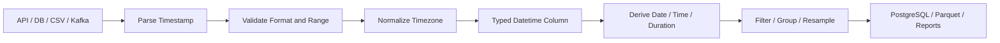

# 06- Datetime Overview

## Overview

Datetime handling is a core part of production data processing because backend systems continuously generate time-based data:

```text
orders
transactions
API events
application logs
Kafka messages
database records
scheduled jobs
metrics
reports
```

Pandas represents datetime data primarily through:

```python
pd.Timestamp
datetime64[ns]
DatetimeIndex
Timedelta
```

and provides operations through:

```python
pd.to_datetime()
Series.dt
pd.Timedelta
pd.DateOffset
```

Datetime correctness is more than choosing the right display format. Production systems must distinguish:

```text
date
time
timestamp
timezone
duration
interval
calendar period
```

Errors in these concepts can produce incorrect reporting, duplicate events, broken incremental loads, incorrect SLA measurements, and inconsistent behavior across services.

A reliable datetime workflow is typically:

```text
raw timestamp
    ↓
parse
    ↓
validate
    ↓
normalize timezone
    ↓
store consistently
    ↓
derive date/time components
    ↓
filter / group / resample
```

---

## Why Datetime Handling Matters

Time often determines the business meaning of a record.

For example:

```text
order_created_at
payment_completed_at
shipment_delivered_at
request_received_at
event_processed_at
```

These timestamps support:

```text
daily reports
hourly metrics
SLA calculations
incremental ETL
event ordering
retention policies
auditing
monitoring
```

A one-hour timezone mistake can change:

```text
which business day an order belongs to
```

A one-day parsing mistake can change:

```text
whether an event is included in an ETL window
```

Datetime handling should therefore be treated as part of the data model, not merely formatting.

---

## Date, Time, Timestamp, and Duration

These concepts should remain distinct.

| Concept | Example | Typical Pandas representation |
| --- | --- | --- |
| Date | `2026-09-10` | `Timestamp` with date semantics |
| Time | `14:30:00` | Python `datetime.time` or parsed component |
| Timestamp | `2026-09-10 14:30:00+00:00` | `Timestamp` / `datetime64[ns, UTC]` |
| Duration | `2 hours 15 minutes` | `Timedelta` |
| Period | `2026-09` | `Period` |
| Datetime index | Ordered timestamps | `DatetimeIndex` |

A timestamp answers:

> When did this event occur?

A duration answers:

> How long did something take?

These should not be represented interchangeably.

---

## Pandas Datetime Model

Pandas builds datetime processing around NumPy/Pandas datetime types.

A datetime column commonly has a dtype such as:

```text
datetime64[ns]
```

or, for timezone-aware data:

```text
datetime64[ns, UTC]
```

Example:

```python
import pandas as pd


orders = pd.DataFrame(
    {
        "order_id": ["ORD-1001", "ORD-1002"],
        "created_at": [
            "2026-09-10 09:30:00",
            "2026-09-10 10:45:00",
        ],
    }
)

orders["created_at"] = pd.to_datetime(
    orders["created_at"],
)
```

Inspect the dtype:

```python
print(orders["created_at"].dtype)
```

A correctly typed datetime column enables efficient datetime operations.

---

## `pd.Timestamp`

`Timestamp` is Pandas' scalar representation of a point in time.

Example:

```python
timestamp = pd.Timestamp(
    "2026-09-10 14:30:00",
)

print(timestamp)
```

A `Timestamp` supports operations such as:

```python
timestamp.year
timestamp.month
timestamp.day
timestamp.hour
```

and arithmetic:

```python
timestamp + pd.Timedelta(hours=2)
```

Use timestamps for individual temporal values and Series/DataFrame datetime dtypes for columnar processing.

---

## `pd.to_datetime()`

`pd.to_datetime()` is the primary conversion API.

Basic usage:

```python
orders["created_at"] = pd.to_datetime(
    orders["created_at"],
)
```

It can convert:

```text
strings
Python datetime objects
lists
Series
DataFrame-like mappings
```

into Pandas datetime representations.

A production pipeline should make parsing assumptions explicit.

---

## Parsing Explicit Formats

If the source has a stable format:

```python
orders["created_at"] = pd.to_datetime(
    orders["created_at"],
    format="%Y-%m-%d %H:%M:%S",
)
```

Explicit formats provide:

```text
clearer contracts
predictable parsing
better error visibility
```

Example input:

```text
2026-09-10 14:30:00
```

matches:

```text
%Y-%m-%d %H:%M:%S
```

Use an explicit format when the source contract is known and stable.

---

## Parsing With Errors

A production pipeline should decide what to do with invalid timestamps.

Strict parsing:

```python
orders["created_at"] = pd.to_datetime(
    orders["created_at"],
    errors="raise",
)
```

This is appropriate when invalid timestamps make the record unusable.

Coercion:

```python
orders["created_at"] = pd.to_datetime(
    orders["created_at"],
    errors="coerce",
)
```

converts invalid values to missing datetimes.

This can be useful in data-quality pipelines, but must be followed by validation.

For example:

```python
orders["created_at"] = pd.to_datetime(
    orders["created_at"],
    errors="coerce",
)

invalid_count = int(
    orders["created_at"].isna().sum()
)

if invalid_count:
    raise ValueError(
        f"Found {invalid_count} invalid timestamps."
    )
```

Do not silently use `errors="coerce"` and forget to inspect the resulting nulls.

---

## Missing Datetimes

Missing datetime values are common.

Examples:

```text
cancelled_at
shipped_at
delivered_at
deleted_at
last_seen_at
```

A nullable datetime column can contain missing values:

```python
orders["delivered_at"] = pd.to_datetime(
    orders["delivered_at"],
    errors="coerce",
)
```

A missing timestamp can mean:

```text
event has not happened yet
source field is unavailable
record is incomplete
parsing failed
```

These meanings should not be conflated.

---

## Timezone-Aware Versus Timezone-Naive

This is one of the most important datetime distinctions.

### Timezone-naive

```text
2026-09-10 14:30:00
```

This tells you the local clock reading but not the timezone.

### Timezone-aware

```text
2026-09-10 14:30:00+00:00
```

This identifies the timestamp relative to UTC.

Production systems should generally prefer timezone-aware timestamps for events that cross service, host, or geographic boundaries.

---

## UTC as a Storage Convention

A common backend architecture is:

```text
client / service
      ↓
timezone-aware input
      ↓
normalize to UTC
      ↓
store UTC
      ↓
convert to local timezone for presentation
```

Example:

```python
events["event_time"] = pd.to_datetime(
    events["event_time"],
    utc=True,
)
```

Now the column has a UTC-aware datetime representation.

UTC storage simplifies:

```text
service-to-service communication
database persistence
event ordering
cross-region processing
ETL windows
```

Local timezone conversion should generally happen near presentation or business-boundary logic.

---

## Timezone Conversion

Once a timestamp is timezone-aware, it can be converted to another timezone.

```python
events["event_time_local"] = (
    events["event_time"]
    .dt.tz_convert("Asia/Kolkata")
)
```

This preserves the same instant while changing the displayed local representation.

Conceptually:

```text
UTC instant
   ↓
timezone conversion
   ↓
local clock representation
```

The underlying event time does not change.

---

## Localization Versus Conversion

These operations are conceptually different.

### Localize

Localization assigns a timezone to a naive datetime.

```python
timestamps = pd.to_datetime(
    values,
)

localized = timestamps.dt.tz_localize(
    "Asia/Kolkata",
)
```

This says:

> These clock values should be interpreted as occurring in this timezone.

### Convert

Conversion changes the representation of an already timezone-aware timestamp:

```python
converted = localized.dt.tz_convert(
    "UTC",
)
```

This says:

> Represent the same instant in another timezone.

Confusing these operations is a common source of incorrect timestamps.

---

## Daylight Saving Time

Some timezones observe daylight saving time.

This means:

```text
local time
    ↓
may contain skipped times
or repeated times
```

For example, a local clock can move from:

```text
01:59:59
```

to:

```text
03:00:00
```

or repeat an hour.

Systems that operate across regions should avoid assuming that every local day has exactly 24 hours.

Using UTC internally avoids many DST problems.

---

## Datetime Accessor: `.dt`

Once a Series has a datetime dtype, Pandas provides `.dt`.

Example:

```python
orders["created_at"].dt.year
```

Other common properties include:

```python
.dt.month
.dt.day
.dt.dayofweek
.dt.hour
.dt.minute
.dt.second
```

Example:

```python
orders["created_date"] = (
    orders["created_at"]
    .dt.date
)
```

For larger data pipelines, prefer datetime-native operations over converting every value to Python objects unless the Python object representation is actually required.

---

## Important `.dt` Operations

| Operation | Purpose |
| --- | --- |
| `.dt.year` | Extract year |
| `.dt.month` | Extract month |
| `.dt.day` | Extract day |
| `.dt.hour` | Extract hour |
| `.dt.minute` | Extract minute |
| `.dt.second` | Extract second |
| `.dt.dayofweek` | Day number |
| `.dt.day_name()` | Day name |
| `.dt.month_name()` | Month name |
| `.dt.date` | Python date values |
| `.dt.normalize()` | Set time to midnight |
| `.dt.floor()` | Floor to a frequency |
| `.dt.ceil()` | Round upward to a frequency |
| `.dt.round()` | Round to a frequency |

---

## Extracting Business Date Components

Example:

```python
orders["order_date"] = (
    orders["created_at"]
    .dt.date
)

orders["order_year"] = (
    orders["created_at"]
    .dt.year
)

orders["order_month"] = (
    orders["created_at"]
    .dt.month
)
```

For analytics, month names or numbers may be useful.

For data engineering, however, retaining the original timestamp and deriving dimensions only where necessary is often preferable.

Avoid replacing the original timestamp with only a date component.

---

## Normalizing to Midnight

If the business logic requires a date-level timestamp:

```python
orders["order_day"] = (
    orders["created_at"]
    .dt.normalize()
)
```

For example:

```text
2026-09-10 14:30:00
```

becomes:

```text
2026-09-10 00:00:00
```

This preserves datetime dtype and is often preferable to converting to Python `date` objects.

---

## Floor, Ceil, and Round

Datetime bucketing is useful for metrics and reporting.

Floor:

```python
events["hour"] = (
    events["event_time"]
    .dt.floor("h")
)
```

Ceil:

```python
events["next_hour"] = (
    events["event_time"]
    .dt.ceil("h")
)
```

Round:

```python
events["nearest_hour"] = (
    events["event_time"]
    .dt.round("h")
)
```

These operations can support:

```text
hourly metrics
batch windows
operational dashboards
event aggregation
```

The chosen operation must match the business semantics.

---

## Timedelta

A `Timedelta` represents elapsed time.

Example:

```python
duration = pd.Timedelta(
    hours=2,
    minutes=30,
)
```

Datetime arithmetic:

```python
orders["delivery_deadline"] = (
    orders["created_at"]
    + pd.Timedelta(days=2)
)
```

Duration calculations:

```python
orders["processing_time"] = (
    orders["completed_at"]
    - orders["created_at"]
)
```

The result is a timedelta-like Series.

---

## Datetime Arithmetic

Datetime arithmetic is useful for:

```text
SLA measurement
retention windows
deadlines
retry schedules
latency analysis
```

Example:

```python
orders["processing_seconds"] = (
    orders["completed_at"]
    - orders["created_at"]
).dt.total_seconds()
```

The original timestamp columns remain available for auditing.

---

## Calendar Arithmetic Versus Duration Arithmetic

A critical distinction is:

```text
fixed duration
```

versus:

```text
calendar-relative offset
```

Example:

```python
timestamp + pd.Timedelta(days=30)
```

means 30 exact 24-hour periods.

A calendar operation such as:

```python
timestamp + pd.DateOffset(months=1)
```

means one calendar month later.

These can produce different results.

For example:

```text
January 31 + 30 days
```

is not necessarily the same business concept as:

```text
January 31 + 1 calendar month
```

Choose based on the domain requirement.

---

## Date Ranges

Pandas can generate datetime sequences:

```python
dates = pd.date_range(
    start="2026-09-01",
    end="2026-09-30",
    freq="D",
)
```

This is useful for:

```text
reporting calendars
test fixtures
time-series indexes
batch windows
date dimension generation
```

Use carefully for large ranges because the number of generated timestamps directly affects memory usage.

---

## Frequency

A frequency defines the spacing of generated or resampled time points.

Common examples:

```text
D   day
h   hour
min minute
s   second
W   week
MS  month start
ME  month end
```

Example:

```python
hourly = pd.date_range(
    start="2026-09-10 00:00",
    periods=24,
    freq="h",
)
```

Choose frequencies according to the required business grain.

---

## DatetimeIndex

A `DatetimeIndex` allows time to become the indexing dimension of a DataFrame.

Example:

```python
events = events.set_index(
    "event_time"
)
```

Now time-based indexing and resampling become convenient.

Example:

```python
daily_events = events.resample(
    "D"
).size()
```

A time index is especially useful for:

```text
time-series analysis
monitoring
metrics
resampling
windowed processing
```

A `DatetimeIndex` is not mandatory for every datetime workflow.

---

## Sorting Before Time-Based Operations

Time-based processing often assumes chronological ordering.

Example:

```python
events = events.sort_values(
    "event_time"
)
```

This is particularly important for:

```text
rolling calculations
event sequencing
as-of joins
incremental processing
time-window logic
```

Do not assume that records returned by an API, database, or Kafka consumer are already globally ordered.

---

## Filtering by Datetime

After parsing timestamps correctly:

```python
start = pd.Timestamp(
    "2026-09-01",
    tz="UTC",
)

end = pd.Timestamp(
    "2026-10-01",
    tz="UTC",
)

filtered = events.loc[
    (events["event_time"] >= start)
    & (events["event_time"] < end)
]
```

Half-open intervals:

```text
[start, end)
```

are often preferable for ETL windows because adjacent windows do not overlap.

For example:

```text
[00:00, 01:00)
[01:00, 02:00)
```

has no duplicate boundary event.

---

## Incremental ETL Windows

Datetime filtering is central to incremental processing.

A robust pattern is:

```text
previous watermark
        ↓
fetch records >= lower bound
        ↓
fetch records < upper bound
        ↓
process
        ↓
commit successful watermark
```

Example:

```python
window_start = pd.Timestamp(
    "2026-09-10 10:00:00",
    tz="UTC",
)

window_end = pd.Timestamp(
    "2026-09-10 11:00:00",
    tz="UTC",
)

batch = events.loc[
    (events["event_time"] >= window_start)
    & (events["event_time"] < window_end)
]
```

This pattern supports repeatable batch boundaries.

---

## Late-Arriving Events

Event time and processing time can differ.

Example:

```text
event_time:
2026-09-10 09:55

ingestion_time:
2026-09-10 10:07
```

The event may arrive after the reporting window has already been processed.

Production systems may therefore use:

```text
event time
processing time
watermark
lookback window
deduplication
reprocessing
```

Do not assume ingestion order equals event order.

---

## Event Time Versus Processing Time

This distinction is common in:

```text
Kafka
stream processing
analytics
observability
ETL
distributed systems
```

Example:

```text
event_time       = when the business event happened
ingested_at      = when the pipeline received it
processed_at     = when the transformation completed
```

Keep these timestamps separate when they represent different lifecycle events.

---

## Database Interaction

PostgreSQL commonly stores timestamps using:

```text
timestamp with time zone
timestamp without time zone
```

The application and database must agree on timezone semantics.

A Pandas workflow might read:

```python
events = pd.read_sql(
    query,
    connection,
)
```

and then normalize:

```python
events["created_at"] = pd.to_datetime(
    events["created_at"],
    utc=True,
)
```

Prefer database-side filtering:

```sql
SELECT
    event_id,
    created_at,
    event_type
FROM events
WHERE created_at >= :start_time
  AND created_at < :end_time;
```

This reduces:

```text
database rows transferred
Pandas memory usage
network traffic
unnecessary parsing
```

---

## REST API Timestamps

REST APIs commonly exchange timestamps as strings.

A robust API boundary should prefer unambiguous formats such as ISO 8601.

Example:

```text
2026-09-10T14:30:00Z
```

Pandas:

```python
events["created_at"] = pd.to_datetime(
    events["created_at"],
    utc=True,
)
```

Do not infer timezone semantics from the server's local timezone.

---

## CSV and Excel

CSV and Excel files often contain inconsistent datetime representations:

```text
2026-09-10
10/09/2026
09-10-2026
2026/09/10 14:30
```

CSV import:

```python
orders = pd.read_csv(
    "orders.csv",
)
```

Then parse explicitly:

```python
orders["created_at"] = pd.to_datetime(
    orders["created_at"],
    format="%Y-%m-%d %H:%M:%S",
    errors="raise",
)
```

Never assume a human-readable date format has universal meaning.

---

## Parquet and Datetime

Parquet can preserve datetime types more reliably than text-oriented formats.

For example:

```python
events.to_parquet(
    "events.parquet",
    index=False,
)
```

and later:

```python
events = pd.read_parquet(
    "events.parquet",
)
```

This avoids repeatedly reparsing textual timestamps.

For analytical pipelines, typed columnar storage can improve both correctness and performance.

---

## Datetime and Reporting

A reporting pipeline may derive:

```python
orders["order_date"] = (
    orders["created_at"]
    .dt.normalize()
)

daily_sales = (
    orders
    .groupby("order_date")["amount"]
    .sum()
)
```

This preserves a clear pipeline:

```text
timestamp
    ↓
business date
    ↓
grouping
    ↓
report
```

The original timestamp should normally remain available for auditing and troubleshooting.

---

## Datetime and Timezones in Reporting

A report's timezone is a business decision.

For example:

```text
UTC reporting
regional reporting
customer-local reporting
warehouse-local reporting
```

An order occurring at:

```text
2026-09-10 23:30 UTC
```

may belong to:

```text
2026-09-11
```

in a timezone several hours ahead.

Define the reporting timezone explicitly before grouping by calendar date.

---

## Datetime and REST API Design

For APIs, prefer a clear contract.

Example response:

```json
{
  "order_id": "ORD-1001",
  "created_at": "2026-09-10T14:30:00Z"
}
```

Avoid ambiguous values such as:

```text
09/10/2026 14:30
```

because consumers may interpret the day and month differently.

The API contract should specify:

```text
format
timezone
precision
nullability
```

---

## Datetime and Kafka

Event-driven systems often include multiple timestamps:

```text
event_time
created_at
ingested_at
processed_at
```

A Pandas consumer may normalize these:

```python
timestamp_columns = [
    "event_time",
    "ingested_at",
    "processed_at",
]

for column in timestamp_columns:
    events[column] = pd.to_datetime(
        events[column],
        utc=True,
        errors="raise",
    )
```

Do not overwrite distinct lifecycle timestamps simply to simplify the schema.

---

## Precision

Datetime values can have varying precision:

```text
second
millisecond
microsecond
nanosecond
```

Example:

```python
timestamp = pd.Timestamp(
    "2026-09-10 14:30:00.123456"
)
```

Precision matters for:

```text
event ordering
deduplication
latency measurement
financial transactions
distributed tracing
```

Choose the precision supported by the source and the business requirement.

Do not invent precision that was never present in the source.

---

## Datetime Dtype and Performance

Typed datetime columns allow Pandas to perform vectorized operations efficiently.

Prefer:

```python
events[
    "event_time"
].dt.hour
```

over:

```python
events[
    "event_time"
].apply(
    lambda value: value.hour
)
```

The vectorized accessor communicates the operation at the column level and is generally preferable for Pandas workloads.

---

## Avoid Converting to Python Objects Prematurely

This:

```python
events["event_time"].dt.date
```

produces Python `date` objects.

Sometimes that is appropriate, but it can lose some benefits of datetime-native operations.

Prefer:

```python
events["event_day"] = (
    events["event_time"]
    .dt.normalize()
)
```

when a datetime-compatible day boundary is sufficient.

Retain native Pandas datetime types as long as practical.

---

## Datetime Validation

A production data-quality layer should validate:

```text
parseability
timezone
range
nullability
ordering
business constraints
```

Example:

```python
events["event_time"] = pd.to_datetime(
    events["event_time"],
    utc=True,
    errors="coerce",
)

invalid = events[
    events["event_time"].isna()
]

if not invalid.empty:
    raise ValueError(
        "Invalid event timestamps detected."
    )
```

Range validation can also be useful:

```python
future_events = events.loc[
    events["event_time"]
    > pd.Timestamp.now(tz="UTC")
]
```

Some future timestamps may be legitimate due to scheduled events, so validation must reflect domain rules.

---

## Duplicate Timestamps

A timestamp is rarely a sufficient unique identifier.

These records can legitimately share the same timestamp:

```text
event_id=E101  event_time=10:00:00
event_id=E102  event_time=10:00:00
```

Do not deduplicate solely on:

```text
timestamp
```

Use the appropriate business key, such as:

```text
event_id
transaction_id
request_id
```

or a composite key.

---

## Empty Datasets

Datetime pipelines must handle empty batches.

```python
events = pd.DataFrame(
    {
        "event_time": pd.Series(
            dtype="datetime64[ns, UTC]"
        ),
        "event_id": pd.Series(
            dtype="string"
        ),
    }
)
```

Operations such as filtering and grouping should preserve the expected schema.

This is particularly important for scheduled ETL where some time windows legitimately contain no records.

---

## Architecture Pattern

A production datetime pipeline can be represented as:



The key principle is to establish temporal correctness early so downstream processing can assume typed, validated data.

---

## Reliability and Monitoring

Datetime pipelines should expose quality metrics such as:

| Metric | Purpose |
| --- | --- |
| Parse failure count | Detect malformed timestamps |
| Null timestamp count | Detect missing values |
| Future timestamp count | Detect clock or source issues |
| Timezone mismatch count | Detect inconsistent input |
| Out-of-order event count | Detect ordering issues |
| Late-event count | Detect delivery delays |
| Window row count | Validate incremental batches |

A pipeline that processes successfully but assigns records to the wrong reporting window is still incorrect.

---

## Clock and Distributed-System Concerns

Different systems may have slightly different clocks.

In distributed environments:

```text
service A timestamp
service B timestamp
database timestamp
Kafka timestamp
```

may not agree perfectly.

For critical event ordering, consider:

```text
event IDs
sequence numbers
database ordering
Kafka offsets
logical timestamps
```

rather than relying exclusively on wall-clock timestamps.

Datetime fields describe time; they do not automatically establish causality.

---

## Common Mistakes

### Mixing Naive and Aware Datetimes

Do not compare:

```text
timezone-aware timestamp
```

with:

```text
timezone-naive timestamp
```

without deliberately establishing timezone semantics.

Normalize timestamps before comparison.

---

### Assuming Local Time Is Universal

A timestamp without timezone information is ambiguous across systems.

Prefer explicit timezone information for distributed workflows.

---

### Silently Coercing Invalid Values

This:

```python
pd.to_datetime(
    values,
    errors="coerce",
)
```

is useful, but dangerous when null results are never checked.

Always measure and validate coercion failures.

---

### Using `date` Objects Everywhere

Python `date` objects can be convenient for presentation, but they remove time-of-day and may be less suitable for time-series operations.

Keep native datetime types when possible.

---

### Treating `30 Days` as `1 Month`

These are different concepts:

```python
pd.Timedelta(days=30)
```

versus:

```python
pd.DateOffset(months=1)
```

Choose based on business semantics.

---

### Grouping by UTC Date Without Checking Business Timezone

A UTC date may not equal the customer's or business's local calendar date.

Define the reporting timezone before deriving daily metrics.

---

### Assuming Ingestion Order Equals Event Order

Distributed systems can deliver late or out-of-order events.

Track event time and processing time separately when required.

---

### Using Timestamp as a Unique Key

Multiple records can legitimately share the same timestamp.

Use actual business identifiers for uniqueness.

---

### Parsing Without Validation

A successfully parsed datetime can still be logically invalid.

Check:

```text
range
timezone
precision
ordering
business constraints
```

---

### Processing Every Timestamp in Pandas

If a database can filter records using an indexed timestamp column, push the time-window predicate to the database.

This reduces:

```text
I/O
network cost
memory usage
Pandas CPU work
```

---

## Interview Traps

### Naive Versus Timezone-Aware

A naive datetime lacks timezone information.

A timezone-aware datetime identifies an instant relative to a timezone.

Distributed applications should generally prefer timezone-aware timestamps.

---

### `tz_localize()` Versus `tz_convert()`

```text
tz_localize()
→ assigns a timezone to a naive timestamp

tz_convert()
→ converts an aware timestamp to another timezone
```

Confusing these operations can shift or misinterpret event times.

---

### `Timedelta` Versus `DateOffset`

```text
Timedelta
→ fixed elapsed duration

DateOffset
→ calendar-aware offset
```

They should not be used interchangeably.

---

### Why Use Half-Open Time Windows?

Use:

```text
[start, end)
```

so adjacent windows do not overlap.

For example:

```text
[10:00, 11:00)
[11:00, 12:00)
```

The boundary belongs to exactly one window.

---

### Event Time Versus Processing Time

Event time describes when the event occurred.

Processing time describes when the pipeline processed it.

They can differ due to network delays, retries, batching, or late delivery.

---

### Why Normalize to UTC?

UTC provides a common temporal reference across:

```text
services
regions
databases
queues
containers
```

Local timezone conversion can then be performed where business or presentation logic requires it.

---

### Why Can a Datetime Pipeline Be Wrong Without Throwing an Error?

Because many datetime bugs are semantic rather than syntactic:

```text
wrong timezone
wrong reporting date
wrong interval boundary
wrong precision
wrong event-time assumption
```

The values may be perfectly parseable while still being incorrect.

---

## Production Checklist

Before deploying datetime processing, verify:

```text
[ ] Date, timestamp, duration, and period semantics are explicit
[ ] Timestamp formats are documented
[ ] Timezone semantics are documented
[ ] Naive versus aware timestamps are intentional
[ ] UTC storage conventions are defined where appropriate
[ ] tz_localize() and tz_convert() are used correctly
[ ] Invalid parsing behavior is explicit
[ ] Missing timestamps have a defined meaning
[ ] Datetime dtypes are validated
[ ] Event time and processing time are separated when necessary
[ ] Reporting timezone is explicitly defined
[ ] Incremental windows use stable boundaries
[ ] Half-open intervals are considered for ETL windows
[ ] Late-arriving events have a defined strategy
[ ] Timestamp precision matches source requirements
[ ] Business uniqueness does not depend solely on timestamps
[ ] Database filtering is pushed down where practical
[ ] Vectorized datetime operations are preferred
[ ] Empty and null datasets are tested
[ ] Future/out-of-range timestamps are validated where appropriate
[ ] Parse failures are monitored
[ ] Timezone and ordering anomalies are observable
[ ] Datetime behavior is covered by automated tests
```

## Key Takeaways

- Treat datetime as a data-model concern: distinguish timestamps, dates, durations, timezones, event time, and processing time rather than treating them as formatted strings.
- Parse timestamps early, validate them explicitly, and use timezone-aware values for distributed systems; UTC is a strong internal convention for cross-system processing.
- Understand the difference between `tz_localize()` and `tz_convert()`, and between fixed `Timedelta` durations and calendar-aware `DateOffset` operations.
- Use native Pandas datetime types, vectorized `.dt` operations, half-open time windows, and database-side filtering to improve correctness and performance.
- Production datetime correctness requires more than successful parsing: monitor invalid, missing, future, late, out-of-order, and timezone-inconsistent records and test the actual business-time semantics.