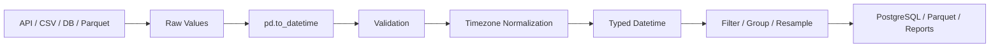

# 07- To Datetime

## Overview

`pd.to_datetime()` is the primary Pandas API for converting values into datetime representations that Pandas can efficiently process.

It is commonly used when data enters a pipeline as:

```text
CSV strings
JSON strings
REST API timestamps
database query results
Excel values
application logs
event records
```

and needs to become typed temporal data:

```text
string / object
      ↓
pd.to_datetime()
      ↓
datetime64[ns]
or
datetime64[ns, UTC]
```

Correct datetime conversion is foundational for:

```text
time-based filtering
sorting
grouping
resampling
incremental ETL
SLA measurement
event ordering
reporting
time-series analysis
```

`pd.to_datetime()` performs parsing and conversion. It does not by itself guarantee that the resulting timestamps are semantically correct for the application.

A production workflow is usually:

```text
raw timestamp
    ↓
parse
    ↓
validate
    ↓
normalize timezone
    ↓
validate business range
    ↓
use in downstream processing
```

---

## Why `pd.to_datetime()` Exists

Datetime values frequently arrive as strings because text-oriented systems do not preserve temporal types.

Examples:

```text
"2026-09-10"
"2026-09-10 14:30:00"
"2026-09-10T14:30:00Z"
"10/09/2026 14:30"
```

If these remain strings, operations such as:

```text
date comparisons
time arithmetic
resampling
timezone conversion
time-based grouping
```

become unreliable or require repeated parsing.

Converting once near the ingestion boundary gives downstream code a typed representation.

---

## Basic Syntax

The common form is:

```python
pd.to_datetime(
    arg,
    errors="raise",
    format=None,
    utc=False,
)
```

Example:

```python
orders["created_at"] = pd.to_datetime(
    orders["created_at"],
)
```

`arg` can be a:

```text
scalar
Series
Index
array-like
DataFrame-like input
```

The returned object depends on the input type.

---

## Basic DataFrame Example

```python
import pandas as pd


orders = pd.DataFrame(
    {
        "order_id": [
            "ORD-1001",
            "ORD-1002",
            "ORD-1003",
        ],
        "created_at": [
            "2026-09-10 09:30:00",
            "2026-09-10 10:45:00",
            "2026-09-10 11:15:00",
        ],
    }
)

orders["created_at"] = pd.to_datetime(
    orders["created_at"],
)

print(orders.dtypes)
```

The `created_at` column is now datetime-typed instead of a generic object/string representation.

This enables:

```python
orders["created_at"].dt.hour
```

and:

```python
orders.loc[
    orders["created_at"]
    >= pd.Timestamp("2026-09-10")
]
```

---

## Input and Output Types

`pd.to_datetime()` preserves the broad shape of the input where practical.

| Input | Typical result |
| --- | --- |
| Scalar string | `Timestamp` |
| Series | `Series` with datetime dtype |
| Datetime-like Index | `DatetimeIndex` |
| List/array | `DatetimeIndex` |
| DataFrame with datetime components | Datetime-like result |

Example:

```python
timestamp = pd.to_datetime(
    "2026-09-10 14:30:00"
)

timestamps = pd.to_datetime(
    [
        "2026-09-10",
        "2026-09-11",
    ]
)
```

Inspect the result instead of assuming its exact representation:

```python
print(type(timestamp))
print(type(timestamps))
```

---

## Parsing ISO 8601 Timestamps

ISO 8601 is a strong interchange format for APIs and distributed systems.

Example:

```python
events["event_time"] = pd.to_datetime(
    events["event_time"],
    utc=True,
)
```

Input:

```text
2026-09-10T14:30:00Z
```

becomes a UTC-aware datetime.

Prefer explicit timezone-aware interchange formats at system boundaries.

---

## Parsing an Explicit Format

When the input format is known:

```python
orders["created_at"] = pd.to_datetime(
    orders["created_at"],
    format="%Y-%m-%d %H:%M:%S",
)
```

For:

```text
2026-09-10 14:30:00
```

the format is:

```text
%Y-%m-%d %H:%M:%S
```

Explicit formats make the source contract clearer and can avoid ambiguous interpretation.

---

## Common Format Directives

| Directive | Meaning | Example |
| --- | --- | --- |
| `%Y` | Four-digit year | `2026` |
| `%y` | Two-digit year | `26` |
| `%m` | Month | `09` |
| `%d` | Day | `10` |
| `%H` | Hour, 24-hour | `14` |
| `%I` | Hour, 12-hour | `02` |
| `%M` | Minute | `30` |
| `%S` | Second | `45` |
| `%f` | Microseconds | `123456` |
| `%z` | Numeric UTC offset | `+0530` |
| `%Z` | Timezone name | `UTC` |

Be particularly careful with:

```text
%m/%d/%Y
```

versus:

```text
%d/%m/%Y
```

because both can parse successfully while producing different dates.

---

## Ambiguous Dates

Consider:

```text
05/06/2026
```

This could represent:

```text
May 6, 2026
```

or:

```text
June 5, 2026
```

Do not depend on automatic inference for ambiguous business-critical data.

Prefer an explicit contract:

```python
dates = pd.to_datetime(
    values,
    format="%d/%m/%Y",
    errors="raise",
)
```

The source system should ideally define the date format rather than leaving interpretation to downstream consumers.

---

## `errors="raise"`

The default behavior is strict parsing.

```python
orders["created_at"] = pd.to_datetime(
    orders["created_at"],
    errors="raise",
)
```

If a value cannot be parsed, an exception is raised.

This is often the correct choice for:

```text
mandatory event timestamps
financial records
transaction timestamps
audit records
strict ETL contracts
```

Failing visibly is often preferable to silently producing incomplete data.

---

## `errors="coerce"`

Use:

```python
orders["created_at"] = pd.to_datetime(
    orders["created_at"],
    errors="coerce",
)
```

when invalid values should become missing datetimes.

Example:

```text
2026-09-10 10:30:00
not-a-date
2026-09-11 12:45:00
```

can become conceptually:

```text
2026-09-10 10:30:00
NaT
2026-09-11 12:45:00
```

`NaT` represents missing datetime information.

Coercion is useful for data-quality workflows, but it becomes dangerous when invalid values are never measured afterward.

---

## `errors="ignore"`

Avoid using `errors="ignore"` as a default production strategy.

It can preserve invalid inputs instead of converting or rejecting them, leaving the column with inconsistent representations.

Prefer a deliberate choice between:

```text
errors="raise"
```

and:

```text
errors="coerce"
```

followed by validation.

---

## Detecting Parse Failures

When using coercion:

```python
orders["created_at"] = pd.to_datetime(
    orders["created_at"],
    errors="coerce",
)

invalid = orders.loc[
    orders["created_at"].isna()
]
```

If null timestamps were not valid source values:

```python
if not invalid.empty:
    raise ValueError(
        "Invalid order timestamps detected."
    )
```

This makes parsing failure observable.

---

## Distinguishing Missing From Invalid

A source may contain both:

```text
missing value
invalid value
```

For example:

```text
None
""
"unknown"
"2026-99-99"
```

Using:

```python
errors="coerce"
```

can turn several distinct conditions into `NaT`.

If the distinction matters, validate the raw input before or alongside parsing.

For example:

```python
raw = orders["created_at"].astype("string")

is_missing = raw.isna() | raw.str.strip().eq("")

parsed = pd.to_datetime(
    raw,
    errors="coerce",
)

is_invalid = (
    parsed.isna()
    & ~is_missing
)
```

This preserves separate signals for:

```text
source missingness
parse failure
```

---

## Missing Datetime Values

Pandas represents missing datetime values using `NaT`.

Example:

```python
values = pd.Series(
    [
        "2026-09-10",
        None,
        "2026-09-12",
    ]
)

dates = pd.to_datetime(
    values,
)
```

Conceptually:

```text
2026-09-10
NaT
2026-09-12
```

Missing timestamps should retain their business meaning.

For example:

```text
delivered_at = NaT
```

may mean:

```text
order has not yet been delivered
```

rather than:

```text
parsing failed
```

---

## `utc=True`

Use `utc=True` when timestamps should be represented as UTC-aware values.

Example:

```python
events["event_time"] = pd.to_datetime(
    events["event_time"],
    utc=True,
)
```

This is particularly useful for:

```text
REST APIs
Kafka events
multi-region systems
microservices
cross-timezone databases
distributed ETL
```

UTC normalization creates a consistent comparison domain.

---

## Parsing Timezone-Aware Strings

Consider:

```text
2026-09-10T14:30:00+05:30
```

Parsing with:

```python
timestamp = pd.to_datetime(
    value,
    utc=True,
)
```

normalizes the instant into UTC.

The local clock representation changes, but the represented instant remains the same.

This is preferable to stripping timezone information.

---

## Mixed Timezones

Production input can contain timestamps with different offsets:

```text
2026-09-10T10:00:00+00:00
2026-09-10T15:30:00+05:30
2026-09-10T12:00:00-04:00
```

Use:

```python
events["event_time"] = pd.to_datetime(
    events["event_time"],
    utc=True,
)
```

to normalize them to a common timezone.

This is particularly important when comparing or sorting timestamps from different regions.

---

## Naive Input With `utc=True`

A naive timestamp such as:

```text
2026-09-10 14:30:00
```

does not identify a timezone.

When:

```python
pd.to_datetime(
    value,
    utc=True,
)
```

receives naive datetime data, the values are treated as UTC rather than being inferred to belong to the machine's local timezone.

Therefore, only use `utc=True` when that interpretation is actually correct.

If the input means:

```text
14:30 Asia/Kolkata
```

the source timezone should be established first.

---

## Parsing Local-Time Data Correctly

For a source that explicitly provides local time without an offset:

```text
2026-09-10 14:30:00
```

and documents it as:

```text
Asia/Kolkata
```

parse it and localize it deliberately:

```python
timestamps = pd.to_datetime(
    values,
    format="%Y-%m-%d %H:%M:%S",
)

timestamps = timestamps.dt.tz_localize(
    "Asia/Kolkata",
)

timestamps = timestamps.dt.tz_convert(
    "UTC",
)
```

This preserves the intended instant.

Do not simply attach UTC if the source timestamp is actually local time.

---

## `format` and Performance

Explicit parsing formats can improve predictability and may improve parsing performance for stable input.

Example:

```python
orders["created_at"] = pd.to_datetime(
    orders["created_at"],
    format="%Y-%m-%d %H:%M:%S",
    errors="raise",
)
```

Use explicit formats when:

```text
source schema is stable
input format is documented
```

Do not force one format onto genuinely heterogeneous data.

---

## Heterogeneous Timestamp Formats

Some legacy sources contain:

```text
2026-09-10 14:30:00
2026-09-10T14:30:00Z
10/09/2026 14:30
```

Blindly applying a single format will fail.

A better engineering solution is usually to:

```text
standardize at the source
```

or:

```text
split known formats explicitly
→ parse each format
→ combine results
→ validate
```

For example:

```python
raw = records["timestamp"].astype("string")

iso_mask = raw.str.contains(
    "T",
    regex=False,
    na=False,
)

parsed = pd.Series(
    pd.NaT,
    index=raw.index,
    dtype="datetime64[ns, UTC]",
)

parsed.loc[iso_mask] = pd.to_datetime(
    raw.loc[iso_mask],
    utc=True,
    errors="coerce",
)
```

A source with uncontrolled datetime formats is usually a data-contract problem rather than merely a Pandas problem.

---

## `dayfirst`

For dates such as:

```text
10/09/2026
```

`dayfirst=True` can influence parsing:

```python
dates = pd.to_datetime(
    values,
    dayfirst=True,
)
```

This can be useful for known day-first data.

However, `dayfirst` is not a substitute for a precise source contract when exact interpretation matters.

Prefer:

```python
format="%d/%m/%Y"
```

when the format is known.

---

## `yearfirst`

For inputs where the year appears first:

```python
dates = pd.to_datetime(
    values,
    yearfirst=True,
)
```

As with `dayfirst`, explicit formats are preferable for strict production contracts.

---

## Parsing DataFrame Components

`pd.to_datetime()` can also construct datetimes from separate columns.

Example:

```python
components = pd.DataFrame(
    {
        "year": [2026, 2026],
        "month": [9, 9],
        "day": [10, 11],
        "hour": [14, 9],
        "minute": [30, 45],
    }
)

timestamps = pd.to_datetime(
    components,
)
```

This is useful when database or CSV data stores temporal components separately.

The expected column names should match the documented datetime components.

---

## Combining Separate Date and Time Columns

Suppose an ETL source provides:

```text
order_date
order_time
```

as separate columns.

A simple approach is:

```python
combined = (
    orders["order_date"].astype("string")
    + " "
    + orders["order_time"].astype("string")
)

orders["created_at"] = pd.to_datetime(
    combined,
    errors="raise",
)
```

When the source format is controlled, explicitly define the expected format:

```python
orders["created_at"] = pd.to_datetime(
    combined,
    format="%Y-%m-%d %H:%M:%S",
    errors="raise",
)
```

Validate the source columns before combining them.

---

## Parsing Unix Timestamps

Numeric timestamps can represent an epoch.

Example:

```python
events["event_time"] = pd.to_datetime(
    events["epoch_seconds"],
    unit="s",
    utc=True,
)
```

Other common units include:

```text
s   seconds
ms  milliseconds
us  microseconds
ns  nanoseconds
```

The unit is critical.

Interpreting milliseconds as seconds can produce timestamps far outside the expected range.

---

## Validating Epoch Units

Suppose an API unexpectedly changes:

```text
epoch milliseconds
```

to:

```text
epoch seconds
```

The values may still parse successfully but represent entirely different dates.

Validate the source contract:

```python
events["event_time"] = pd.to_datetime(
    events["epoch_ms"],
    unit="ms",
    utc=True,
    errors="raise",
)
```

Then apply a reasonable business-range check.

---

## Numeric Dates

Do not assume every numeric value is an epoch.

For example:

```text
20260910
```

might mean:

```text
YYYYMMDD
```

rather than:

```text
epoch timestamp
```

Parse based on the source specification:

```python
dates = pd.to_datetime(
    values.astype("string"),
    format="%Y%m%d",
    errors="raise",
)
```

Always establish the numeric encoding before conversion.

---

## Database Results

Database drivers may already return datetime objects.

For example:

```python
events = pd.read_sql(
    query,
    connection,
)
```

You may still normalize the column explicitly:

```python
events["created_at"] = pd.to_datetime(
    events["created_at"],
    utc=True,
)
```

Before converting, inspect:

```python
print(events["created_at"].dtype)
```

Avoid unnecessary conversion when the driver already provides the desired typed representation.

---

## Database Time Filtering

When the source is PostgreSQL or another relational database, prefer database-side filtering when practical.

Instead of:

```python
events = pd.read_sql(
    "SELECT * FROM events",
    connection,
)

events["created_at"] = pd.to_datetime(
    events["created_at"],
    utc=True,
)

events = events.loc[
    events["created_at"] >= start
]
```

prefer:

```sql
SELECT
    event_id,
    created_at,
    event_type
FROM events
WHERE created_at >= :start_time
  AND created_at < :end_time;
```

This reduces:

```text
database rows returned
network transfer
Pandas memory usage
unnecessary parsing
```

Datetime conversion belongs in Pandas when the source representation needs normalization or the downstream transformation requires it.

---

## REST APIs

An API response may contain:

```json
{
  "order_id": "ORD-1001",
  "created_at": "2026-09-10T14:30:00Z"
}
```

After normalization:

```python
orders["created_at"] = pd.to_datetime(
    orders["created_at"],
    utc=True,
    errors="raise",
)
```

The API contract should define:

```text
timestamp format
timezone
precision
nullable behavior
```

Do not infer these characteristics from a few successful records.

---

## CSV Ingestion

CSV values are frequently read as strings.

Example:

```python
orders = pd.read_csv(
    "orders.csv",
)

orders["created_at"] = pd.to_datetime(
    orders["created_at"],
    format="%Y-%m-%d %H:%M:%S",
    errors="raise",
)
```

When reading very large files, consider reducing memory and work by selecting only required columns and processing in chunks:

```python
for chunk in pd.read_csv(
    "orders.csv",
    usecols=["order_id", "created_at"],
    chunksize=100_000,
):
    chunk["created_at"] = pd.to_datetime(
        chunk["created_at"],
        format="%Y-%m-%d %H:%M:%S",
        errors="raise",
    )

    process(chunk)
```

---

## JSON and API Data

If JSON contains structured timestamp fields, parse those fields directly after normalization.

Do not use regex to parse valid JSON.

For nested JSON:

```python
events = pd.json_normalize(
    payload,
)

events["created_at"] = pd.to_datetime(
    events["created_at"],
    utc=True,
    errors="raise",
)
```

The workflow is:

```text
JSON parsing
    ↓
DataFrame construction
    ↓
datetime conversion
    ↓
validation
```

---

## Parquet

Parquet can preserve typed datetime information.

If a Parquet column is already correctly typed:

```python
events = pd.read_parquet(
    "events.parquet",
)
```

the additional conversion may be unnecessary.

Inspect the dtype:

```python
print(events["event_time"].dtype)
```

If the source still requires normalization:

```python
events["event_time"] = pd.to_datetime(
    events["event_time"],
    utc=True,
)
```

Typed storage reduces repeated textual parsing.

---

## Validation After Conversion

Successful parsing does not imply valid business data.

After:

```python
events["event_time"] = pd.to_datetime(
    events["event_time"],
    utc=True,
    errors="coerce",
)
```

validate:

```python
invalid = events[
    events["event_time"].isna()
]

if not invalid.empty:
    raise ValueError(
        "Timestamp parsing failed."
    )
```

Then validate temporal boundaries:

```python
min_allowed = pd.Timestamp(
    "2020-01-01",
    tz="UTC",
)

max_allowed = pd.Timestamp(
    "2030-01-01",
    tz="UTC",
)

out_of_range = events.loc[
    (events["event_time"] < min_allowed)
    | (events["event_time"] >= max_allowed)
]
```

Range checks should be domain-specific.

---

## Datetime Conversion and Duplicates

Converting timestamps can expose records that appear identical at the timestamp level.

For example:

```text
2026-09-10T14:30:00Z
2026-09-10 14:30:00+00:00
```

represent the same instant after normalization.

Do not deduplicate based solely on timestamp.

Use an actual business key:

```python
duplicate_events = events[
    events.duplicated(
        subset=["event_id"],
        keep=False,
    )
]
```

Timestamp normalization and deduplication are separate concerns.

---

## Empty DataFrames

An empty input should still produce a predictable datetime dtype.

Example:

```python
events = pd.DataFrame(
    {
        "event_time": pd.Series(
            dtype="string"
        )
    }
)

events["event_time"] = pd.to_datetime(
    events["event_time"],
    utc=True,
)
```

This makes downstream operations more predictable.

Scheduled ETL jobs frequently encounter empty windows, so this case should be tested explicitly.

---

## Datetime Conversion in ETL Architecture

A production ingestion flow can be structured as:



The key principle is:

```text
make temporal semantics explicit near the ingestion boundary
```

rather than repeatedly parsing strings throughout the application.

---

## Incremental ETL

`pd.to_datetime()` is commonly part of incremental pipeline logic.

Example:

```python
events["event_time"] = pd.to_datetime(
    events["event_time"],
    utc=True,
    errors="raise",
)

window_start = pd.Timestamp(
    "2026-09-10 10:00:00",
    tz="UTC",
)

window_end = pd.Timestamp(
    "2026-09-10 11:00:00",
    tz="UTC",
)

batch = events.loc[
    (events["event_time"] >= window_start)
    & (events["event_time"] < window_end)
]
```

Use half-open intervals:

```text
[start, end)
```

to avoid overlapping adjacent batches.

---

## Performance Considerations

Datetime conversion can become significant when processing millions of textual timestamps.

Prefer:

```text
typed input over text
explicit formats when stable
database-side filtering
column projection
chunk processing for large files
single conversion near ingestion
```

Avoid repeated conversion:

```python
# Avoid repeated parsing.
for operation in operations:
    data["created_at"] = pd.to_datetime(
        data["created_at"]
    )
```

Instead:

```python
data["created_at"] = pd.to_datetime(
    data["created_at"],
    utc=True,
)

run_operations(data)
```

Normalize once and reuse the typed column.

---

## Memory Considerations

Converting textual timestamps changes their representation and may affect memory usage.

Inspect memory when working with large datasets:

```python
print(
    events.memory_usage(
        deep=True
    )
)
```

The biggest optimization is often reducing unnecessary input rather than micro-optimizing the conversion itself:

```text
select fewer columns
filter earlier
process batches
use typed storage
avoid duplicate DataFrames
```

---

## Avoid Per-Row Python Parsing

Avoid:

```python
events["event_time"] = (
    events["event_time"]
    .apply(
        lambda value: pd.to_datetime(value)
    )
)
```

Prefer:

```python
events["event_time"] = pd.to_datetime(
    events["event_time"],
    utc=True,
)
```

The vectorized Pandas API is the intended abstraction for columnar processing.

---

## Logging and Observability

For production pipelines, log aggregate parsing outcomes rather than every bad timestamp.

Useful metrics include:

```text
records processed
records parsed successfully
records failed parsing
null timestamp count
out-of-range timestamp count
processing duration
```

Example:

```python
parsed_count = int(
    events["event_time"].notna().sum()
)

logger.info(
    "timestamp_parsing_completed",
    extra={
        "rows": len(events),
        "parsed_rows": parsed_count,
    },
)
```

Avoid logging sensitive raw payloads merely to diagnose timestamp failures.

---

## Reliability: Upstream Contract Changes

Suppose an API changes from:

```text
2026-09-10T14:30:00Z
```

to:

```text
10-09-2026 14:30
```

A parser may fail immediately, which is useful.

More dangerous is a change that remains parseable but changes semantics:

```text
MM/DD/YYYY
```

to:

```text
DD/MM/YYYY
```

or:

```text
epoch milliseconds
```

to:

```text
epoch seconds
```

Production validation should therefore test both:

```text
parseability
semantic correctness
```

---

## Security Considerations

Datetime parsing is generally not a security boundary by itself, but untrusted input still requires defensive handling.

Consider:

```text
very large input batches
extremely long strings
unexpected formats
untrusted data files
user-supplied parsing configuration
```

Do not allow clients to dynamically control arbitrary parsing behavior in an API without validation.

When exposing date filters through a REST API:

```text
validate format
validate timezone
validate acceptable range
limit query window
```

and push safe filtering to the database when practical.

---

## Testing

Test conversion behavior as data-contract behavior.

```python
def test_parse_order_timestamps() -> None:
    orders = pd.DataFrame(
        {
            "created_at": [
                "2026-09-10T14:30:00Z",
                "2026-09-10T15:30:00Z",
            ]
        }
    )

    orders["created_at"] = pd.to_datetime(
        orders["created_at"],
        utc=True,
        errors="raise",
    )

    assert str(
        orders["created_at"].dtype
    ) == "datetime64[ns, UTC]"
```

Test the cases that matter operationally, not only the happy path.

---

## Testing Invalid Input

```python
def test_invalid_timestamp_is_rejected() -> None:
    values = pd.Series(
        [
            "2026-09-10T14:30:00Z",
            "invalid-timestamp",
        ]
    )

    parsed = pd.to_datetime(
        values,
        utc=True,
        errors="coerce",
    )

    assert parsed.notna().sum() == 1
    assert parsed.isna().sum() == 1
```

For strict pipelines, use `errors="raise"` and assert that the expected exception occurs.

---

## Testing Timezone Semantics

Test timezone conversion independently from parsing.

```python
def test_utc_normalization() -> None:
    values = pd.Series(
        [
            "2026-09-10T14:30:00+05:30",
        ]
    )

    parsed = pd.to_datetime(
        values,
        utc=True,
    )

    assert str(
        parsed.iloc[0]
    ) == "2026-09-10 09:00:00+00:00"
```

This verifies that the original instant is preserved.

---

## Testing Epoch Units

```python
def test_epoch_milliseconds() -> None:
    values = pd.Series(
        [1789032600000]
    )

    parsed = pd.to_datetime(
        values,
        unit="ms",
        utc=True,
    )

    assert parsed.notna().all()
```

The important test is not merely whether parsing succeeds; it should verify that the resulting instant falls within the expected domain.

---

## Common Mistakes

### Relying on Ambiguous Automatic Parsing

A date such as:

```text
10/09/2026
```

can have multiple interpretations.

Use an explicit source contract and format.

---

### Using `errors="coerce"` Without Validation

Coercion can hide malformed records by converting them to `NaT`.

Always inspect the resulting nulls.

---

### Assuming `utc=True` Means "Convert Local Time to UTC"

For naive input, `utc=True` establishes UTC semantics.

It does not know that a naive value came from a particular local timezone.

---

### Mixing Naive and Aware Timestamps

Comparisons between timezone-naive and timezone-aware timestamps are problematic.

Normalize temporal data before comparison.

---

### Using the Wrong Epoch Unit

Milliseconds interpreted as seconds can create wildly incorrect dates.

The source contract must specify the epoch unit.

---

### Parsing Timestamps Repeatedly

Repeated conversion wastes CPU and complicates code.

Convert once near ingestion and reuse the typed column.

---

### Ignoring Semantic Validation

A timestamp can be syntactically valid but logically impossible:

```text
transaction in the future
employee hired before company existed
delivery before order creation
```

Add domain-specific checks.

---

### Treating Timestamps as Unique Identifiers

Multiple records can share the same timestamp.

Use business keys for deduplication.

---

### Converting Everything to Python Objects

Avoid unnecessary conversion to Python `datetime` or `date` objects when Pandas-native datetime types satisfy the use case.

Native datetime types support efficient vectorized operations.

---

### Reading Entire Tables Before Filtering

For database workflows, push timestamp filters into SQL whenever practical.

This reduces the amount of data transferred into Pandas.

---

## Interview Traps

### What Does `pd.to_datetime()` Do?

It parses or converts supported temporal representations into Pandas datetime objects or datetime-like arrays/Series.

It is a conversion API, not a business-rule validator.

---

### What Is `errors="coerce"`?

It converts values that cannot be parsed into `NaT` instead of raising a parsing exception.

It is useful when invalid records must be isolated, but requires follow-up validation.

---

### Why Use `utc=True`?

To normalize timestamps into a consistent UTC-aware representation, especially when input values contain timezone offsets or originate from multiple systems.

---

### What Happens to a Naive Timestamp With `utc=True`?

It is interpreted as UTC rather than as an unknown local timezone.

This makes the source timezone contract critical.

---

### When Should `format=` Be Used?

Use it when the input format is known and stable.

It improves explicitness and can improve parsing predictability and performance.

---

### Why Is Parsing Not Enough?

Because parsing only establishes that a value can be represented as a datetime.

It does not establish:

```text
correct timezone
correct business range
correct epoch unit
correct event semantics
```

---

### Why Prefer Database-Side Time Filtering?

Because filtering in the database can reduce:

```text
rows returned
network traffic
memory usage
Pandas processing
```

The database can often exploit indexes on timestamp columns as well.

---

## Production Checklist

Before using `pd.to_datetime()` in a production pipeline, verify:

```text
[ ] Source timestamp format is documented
[ ] Ambiguous dates have an explicit interpretation
[ ] Timezone semantics are defined
[ ] Naive versus aware input is understood
[ ] utc=True is used intentionally
[ ] Explicit format is used when the source contract is stable
[ ] Epoch unit is documented for numeric timestamps
[ ] errors="raise" or errors="coerce" is chosen deliberately
[ ] Coerced NaT values are measured and validated
[ ] Missing input is distinguished from invalid input where required
[ ] Output dtype is verified
[ ] Business date/time semantics are defined
[ ] Range validation is implemented where appropriate
[ ] Event time and processing time are not conflated
[ ] Duplicate semantics do not rely solely on timestamps
[ ] Database filtering is pushed down where practical
[ ] Large inputs are processed efficiently
[ ] Conversion is not repeated unnecessarily
[ ] Typed Parquet/storage formats are used where appropriate
[ ] Empty inputs are tested
[ ] Mixed timezone inputs are tested
[ ] Invalid formats are tested
[ ] Epoch conversions are tested
[ ] Parsing success/failure metrics are observable
[ ] Upstream datetime contract changes produce an observable signal
```

## Key Takeaways

- `pd.to_datetime()` converts strings, numeric epochs, and other supported inputs into Pandas datetime representations suitable for vectorized temporal processing.
- Parsing and correctness are separate concerns: validate timezone semantics, epoch units, ranges, missing values, and business rules after conversion.
- Use explicit formats for stable source contracts, `errors="raise"` for strict pipelines, and `errors="coerce"` only when invalid values are intentionally isolated and monitored.
- Normalize distributed-system timestamps deliberately, with UTC as a strong internal convention when the source semantics support it; never assume `utc=True` can infer an unknown local timezone.
- For production ETL, convert once near ingestion, filter data at the database when practical, avoid per-row parsing, test edge cases, and monitor parsing failures and semantic anomalies.