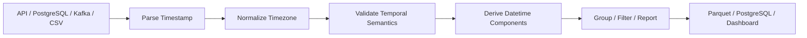

# 08- Datetime Components

## Overview

Once a Pandas column has been converted to a datetime dtype, the `.dt` accessor provides vectorized access to individual datetime components and datetime-aware transformations.

Typical components include:

```text
year
quarter
month
week
day
day of week
day of year
hour
minute
second
microsecond
nanosecond
```

These components are useful for deriving dimensions and operational attributes from timestamps:

```text
order timestamp
    ↓
year / month / day
hour / weekday
    ↓
business reporting
partitioning
filtering
grouping
monitoring
```

The important engineering principle is to derive components from a correctly parsed datetime column rather than repeatedly manipulating timestamp strings.

---

## Why Datetime Components Matter

Raw timestamps are required for accurate event ordering and auditing, but analytical and operational workflows often need derived temporal dimensions.

For example:

```text
created_at = 2026-09-10 14:37:52+00:00
```

may be used to derive:

```text
year        → 2026
month       → 9
day         → 10
hour        → 14
weekday     → Thursday
```

These derived values support:

```text
daily reporting
hourly traffic analysis
weekday/weekend analysis
business-hour filtering
partition selection
SLA dashboards
time-based segmentation
```

The source timestamp should normally remain available. Derived components are additional attributes, not replacements for the original event timestamp.

---

## The `.dt` Accessor

The `.dt` accessor exposes datetime-specific operations on a Pandas Series.

Example:

```python
orders["created_at"] = pd.to_datetime(
    orders["created_at"],
    utc=True,
)

orders["order_year"] = (
    orders["created_at"]
    .dt.year
)
```

`.dt` requires a datetime-like Series.

This works:

```python
orders["created_at"].dt.month
```

but this is not reliable when the column is still plain text:

```python
orders["created_at"].astype("string").dt.month
```

Parse the timestamp first.

---

## Standard Datetime Components

| Component | Example | Typical use |
| --- | --- | --- |
| `.dt.year` | `2026` | Annual reporting |
| `.dt.quarter` | `3` | Quarterly reporting |
| `.dt.month` | `9` | Monthly reporting |
| `.dt.day` | `10` | Calendar-day analysis |
| `.dt.dayofweek` | `3` | Weekday logic |
| `.dt.day_name()` | `Thursday` | Human-readable reports |
| `.dt.dayofyear` | `253` | Seasonal analysis |
| `.dt.isocalendar()` | ISO calendar fields | ISO week reporting |
| `.dt.week` | — | Prefer `isocalendar()` for ISO weeks |
| `.dt.hour` | `14` | Hourly traffic |
| `.dt.minute` | `37` | Minute-level analysis |
| `.dt.second` | `52` | Fine-grained timing |

The exact choice should follow the business requirement rather than convenience.

---

## Example Dataset

```python
import pandas as pd


orders = pd.DataFrame(
    {
        "order_id": [
            "ORD-1001",
            "ORD-1002",
            "ORD-1003",
            "ORD-1004",
        ],
        "created_at": [
            "2026-09-10T14:37:52Z",
            "2026-09-11T09:15:10Z",
            "2026-09-12T18:42:05Z",
            "2026-09-13T08:05:30Z",
        ],
        "amount": [
            1200.00,
            850.00,
            2100.00,
            475.00,
        ],
    }
)

orders["created_at"] = pd.to_datetime(
    orders["created_at"],
    utc=True,
)
```

The column is now suitable for vectorized datetime operations.

---

## Year

Use:

```python
orders["year"] = (
    orders["created_at"]
    .dt.year
)
```

Result:

```text
created_at                  year
-------------------------   ----
2026-09-10 14:37:52+00:00   2026
2026-09-11 09:15:10+00:00   2026
```

Year extraction is useful for:

```text
annual metrics
retention cohorts
historical comparisons
partitioning
```

Do not discard the original timestamp just because year has been extracted.

---

## Quarter

Use:

```python
orders["quarter"] = (
    orders["created_at"]
    .dt.quarter
)
```

Result:

```text
quarter
-------
3
3
3
3
```

Quarter values range from:

```text
1 → January through March
2 → April through June
3 → July through September
4 → October through December
```

This is useful for business reporting and fiscal analysis when calendar quarters are appropriate.

For a non-calendar fiscal year, additional business logic may be required.

---

## Month

Use:

```python
orders["month"] = (
    orders["created_at"]
    .dt.month
)
```

The result is an integer from:

```text
1
```

through:

```text
12
```

For reporting:

```python
orders["month_name"] = (
    orders["created_at"]
    .dt.month_name()
)
```

For stable sorting and joins, numeric month values are often preferable to month names.

---

## Day

Use:

```python
orders["day"] = (
    orders["created_at"]
    .dt.day
)
```

This returns the calendar day within the month.

Do not confuse:

```text
day of month
```

with:

```text
day of week
day of year
```

Each represents a different dimension.

---

## Day of Week

Pandas exposes the weekday as an integer:

```python
orders["weekday"] = (
    orders["created_at"]
    .dt.dayofweek
)
```

The numbering is:

```text
Monday    → 0
Tuesday   → 1
Wednesday → 2
Thursday  → 3
Friday    → 4
Saturday  → 5
Sunday    → 6
```

Example:

```python
orders["is_weekend"] = (
    orders["created_at"]
    .dt.dayofweek
    >= 5
)
```

This is useful for:

```text
business-hours rules
weekend reporting
staffing analysis
traffic segmentation
```

---

## Day Names

For human-readable reports:

```python
orders["weekday_name"] = (
    orders["created_at"]
    .dt.day_name()
)
```

Example output:

```text
Thursday
Friday
Saturday
Sunday
```

Names are convenient for presentation but less suitable as a primary analytical key.

For grouping:

```python
weekday_counts = (
    orders
    .groupby(
        orders["created_at"].dt.dayofweek
    )
    .size()
)
```

Numeric or ordered categorical dimensions are usually easier to sort predictably.

---

## Day of Year

Use:

```python
orders["day_of_year"] = (
    orders["created_at"]
    .dt.dayofyear
)
```

This is useful for:

```text
seasonality
year-over-year daily comparisons
annual operational cycles
```

Leap years affect the maximum value.

Do not assume that every year has exactly the same number of calendar days.

---

## ISO Calendar Components

ISO week-based reporting is common in business systems.

Use:

```python
iso = orders[
    "created_at"
].dt.isocalendar()

orders["iso_year"] = iso.year
orders["iso_week"] = iso.week
orders["iso_day"] = iso.day
```

The distinction between:

```text
calendar year
```

and:

```text
ISO year
```

matters around New Year's boundaries.

For example, the first few days of January can belong to the final ISO week of the previous ISO year.

Do not derive ISO week reporting with simple calendar assumptions.

---

## Hour

Use:

```python
orders["hour"] = (
    orders["created_at"]
    .dt.hour
)
```

This produces values from:

```text
0
```

through:

```text
23
```

Hourly components are useful for:

```text
traffic analysis
capacity planning
business-hour reporting
API request analysis
job scheduling analysis
```

For timezone-aware values, the extracted hour is based on the timezone represented by the Series.

---

## Minute and Second

Use:

```python
orders["minute"] = (
    orders["created_at"]
    .dt.minute
)

orders["second"] = (
    orders["created_at"]
    .dt.second
)
```

These components are useful when the business process operates at sub-hour granularity.

For latency and duration calculations, however, prefer subtracting timestamps and using `Timedelta` rather than manually combining seconds and minutes.

---

## Microseconds and Nanoseconds

Pandas can expose fine-grained components:

```python
events["microsecond"] = (
    events["event_time"]
    .dt.microsecond
)

events["nanosecond"] = (
    events["event_time"]
    .dt.nanosecond
)
```

Use these only when the source system actually provides meaningful precision.

Do not assume that a timestamp reported to nanosecond precision is operationally accurate to nanoseconds.

---

## Date Versus Datetime Components

These are different representations.

```python
orders["created_date"] = (
    orders["created_at"]
    .dt.date
)
```

produces Python `date` values.

By contrast:

```python
orders["created_day"] = (
    orders["created_at"]
    .dt.normalize()
)
```

keeps a datetime-compatible representation:

```text
2026-09-10 00:00:00+00:00
```

For continued Pandas datetime processing, keeping datetime-native values is often preferable.

---

## Normalize Before Date-Level Grouping

Suppose the requirement is:

> Calculate sales per calendar day in UTC.

Use:

```python
orders["order_day"] = (
    orders["created_at"]
    .dt.normalize()
)

daily_sales = (
    orders
    .groupby("order_day", as_index=False)
    .agg(
        total_sales=("amount", "sum"),
        order_count=("order_id", "count"),
    )
)
```

This produces a stable day-level datetime key.

The original timestamp remains available for detailed analysis.

---

## Timezone and Component Extraction

Datetime components depend on the timezone represented by the timestamp.

Suppose an event occurs at:

```text
2026-09-10 23:30:00 UTC
```

and is viewed in:

```text
Asia/Kolkata
```

the local calendar date and hour differ.

Convert first:

```python
events["local_time"] = (
    events["event_time"]
    .dt.tz_convert("Asia/Kolkata")
)

events["local_hour"] = (
    events["local_time"]
    .dt.hour
)
```

Do not extract business calendar components from UTC when the business definition is based on a local timezone.

---

## Reporting Timezone

The correct reporting timezone must be explicit.

For a global platform:

```text
event_time
    ↓
UTC canonical timestamp
    ↓
reporting timezone
    ↓
year/month/day/hour
```

For example:

```python
reporting_time = (
    events["event_time"]
    .dt.tz_convert("Asia/Kolkata")
)

events["report_date"] = (
    reporting_time
    .dt.normalize()
)
```

This prevents a common class of reporting errors around midnight.

---

## Business Hours

Datetime components can support business-hours classification.

Example:

```python
local_time = (
    orders["created_at"]
    .dt.tz_convert("Asia/Kolkata")
)

is_weekday = (
    local_time.dt.dayofweek < 5
)

is_business_hour = (
    local_time.dt.hour >= 9
) & (
    local_time.dt.hour < 18
)

orders["within_business_hours"] = (
    is_weekday
    & is_business_hour
)
```

Define the business timezone first.

If business hours include minute-level boundaries such as `09:30`, combine hour and minute carefully or compare against localized timestamps.

---

## Grouping by Components

Datetime components work naturally with `groupby()`.

Example:

```python
monthly_sales = (
    orders
    .groupby(
        orders["created_at"].dt.to_period("M")
    )["amount"]
    .sum()
)
```

For timezone-aware data, converting to a Period can remove timezone information from the representation and may not match all reporting requirements.

When timezone semantics matter, an explicit normalized timestamp or a carefully defined calendar dimension is often safer.

A straightforward alternative is:

```python
orders["order_month"] = (
    orders["created_at"]
    .dt.strftime("%Y-%m")
)

monthly_sales = (
    orders
    .groupby("order_month")["amount"]
    .sum()
)
```

Choose the representation based on whether the grouped key is analytical or presentation-oriented.

---

## Multiple Derived Components

Derive several components in one readable transformation:

```python
orders = orders.assign(
    order_year=orders["created_at"].dt.year,
    order_month=orders["created_at"].dt.month,
    order_day=orders["created_at"].dt.day,
    order_hour=orders["created_at"].dt.hour,
    weekday=orders["created_at"].dt.dayofweek,
)
```

This can improve readability when the derived columns are part of the same transformation stage.

Do not generate dozens of redundant temporal columns without a downstream consumer.

---

## Extracting Components Without Loops

Prefer vectorized operations:

```python
orders["order_hour"] = (
    orders["created_at"]
    .dt.hour
)
```

Avoid:

```python
orders["order_hour"] = orders[
    "created_at"
].apply(
    lambda value: value.hour
)
```

The `.dt` accessor expresses the operation at the Series level and avoids unnecessary Python-level iteration.

---

## Component Extraction and Data Types

Most scalar components such as:

```python
.dt.year
.dt.month
.dt.day
.dt.hour
```

produce integer-like data.

Missing timestamps can cause nullable integer behavior depending on the operation and Pandas version.

Inspect the result when schema stability matters:

```python
print(orders["order_month"].dtype)
```

If downstream storage requires a specific integer representation, standardize it explicitly.

---

## Missing Datetimes

Missing values propagate into component extraction.

Example:

```python
events["event_time"] = pd.to_datetime(
    events["event_time"],
    utc=True,
    errors="coerce",
)

events["event_hour"] = (
    events["event_time"]
    .dt.hour
)
```

If `event_time` is `NaT`, the derived hour is missing.

Do not automatically replace missing components with:

```text
0
```

because `0` is a valid hour.

Missingness and zero are different states.

---

## Invalid Datetimes

Component extraction should happen only after parsing.

Bad pattern:

```python
events["event_hour"] = (
    events["event_time"]
    .astype("string")
    .str[11:13]
)
```

This treats timestamp formatting as the data model.

Correct pattern:

```python
events["event_time"] = pd.to_datetime(
    events["event_time"],
    utc=True,
    errors="raise",
)

events["event_hour"] = (
    events["event_time"]
    .dt.hour
)
```

This makes the temporal representation explicit.

---

## Component Extraction From Database Results

Suppose PostgreSQL returns:

```text
created_at
```

as a timestamp column.

Read it and derive the required attributes:

```python
events["created_at"] = pd.to_datetime(
    events["created_at"],
    utc=True,
)

events["created_date"] = (
    events["created_at"]
    .dt.normalize()
)

events["created_hour"] = (
    events["created_at"]
    .dt.hour
)
```

If the database can perform a required aggregation efficiently, consider computing the aggregation in SQL instead of materializing every row in Pandas.

Pandas is most useful when the data is already in the processing layer or when downstream transformations genuinely require it.

---

## Component Extraction From API Data

A REST API may provide:

```json
{
  "order_id": "ORD-1001",
  "created_at": "2026-09-10T14:37:52Z"
}
```

After normalization:

```python
orders["created_at"] = pd.to_datetime(
    orders["created_at"],
    utc=True,
    errors="raise",
)

orders["created_hour"] = (
    orders["created_at"]
    .dt.hour
)
```

Avoid deriving components directly from the textual timestamp.

---

## Event Processing and Kafka

Kafka-based systems often contain event-time fields.

For example:

```python
events["event_time"] = pd.to_datetime(
    events["event_time"],
    utc=True,
    errors="raise",
)

events["event_date"] = (
    events["event_time"]
    .dt.normalize()
)
```

The extracted date can support:

```text
partition-oriented processing
daily aggregation
reporting
late-event analysis
```

Do not confuse event time with Kafka record metadata such as ingestion or processing time.

---

## Calendar Dimensions

Large reporting systems often maintain a date dimension rather than deriving all calendar attributes repeatedly.

A calendar dimension may contain:

```text
date
year
quarter
month
month_name
week
iso_year
iso_week
day_of_week
day_name
is_weekend
is_holiday
fiscal_period
```

Pandas can derive these fields during ETL:

```python
calendar = pd.DataFrame(
    {
        "date": pd.date_range(
            "2026-01-01",
            "2026-12-31",
            freq="D",
        )
    }
)

calendar["year"] = calendar["date"].dt.year
calendar["month"] = calendar["date"].dt.month
calendar["quarter"] = calendar["date"].dt.quarter
calendar["weekday"] = calendar["date"].dt.dayofweek
```

For enterprise reporting, business-specific calendar attributes such as fiscal periods and holidays often belong in an explicit dimension rather than in ad hoc Pandas expressions.

---

## Fiscal Calendar Considerations

Calendar components are not always equivalent to business reporting periods.

A company may use:

```text
fiscal year starting in April
4-4-5 calendar
retail calendar
custom reporting periods
```

In these cases:

```python
.dt.year
.dt.month
.dt.quarter
```

may not represent the organization's reporting periods.

Build or join to a business calendar when the organization's definition differs from the standard Gregorian calendar.

---

## Partitioning by Datetime Components

Temporal components can be useful for partition-oriented storage.

For example:

```python
events["event_date"] = (
    events["event_time"]
    .dt.strftime("%Y-%m-%d")
)
```

This can be used when constructing paths such as:

```text
events/
    year=2026/
        month=09/
            day=10/
```

However, do not create unnecessary string representations if a typed partitioning system or storage engine can operate directly on datetime-derived columns.

---

## Parquet and Derived Components

For repeated analytical workloads, storing commonly used derived attributes can reduce repeated computation.

For example:

```python
events["event_date"] = (
    events["event_time"]
    .dt.normalize()
)

events["event_hour"] = (
    events["event_time"]
    .dt.hour
)

events.to_parquet(
    "events.parquet",
    index=False,
)
```

Persist derived fields when:

```text
they are frequently queried
the derivation is deterministic
the storage cost is acceptable
the additional schema complexity is justified
```

Do not materialize every possible component by default.

---

## Performance Considerations

`.dt` operations are vectorized and generally preferable to Python loops or per-row `.apply()`.

Prefer:

```python
events["hour"] = (
    events["event_time"]
    .dt.hour
)
```

over:

```python
events["hour"] = events[
    "event_time"
].apply(
    lambda value: value.hour
)
```

For very large datasets, performance is also affected by:

```text
number of columns derived
number of rows processed
timezone conversions
memory allocation
unnecessary DataFrame copies
```

Derive only what downstream processing actually needs.

---

## Avoid Repeated Component Derivation

If several pipeline stages repeatedly derive the same field:

```python
events["event_hour"] = (
    events["event_time"].dt.hour
)
```

compute it once when the field has a clear downstream purpose.

A useful pipeline pattern is:

```text
typed timestamp
    ↓
validated timestamp
    ↓
derived temporal dimensions
    ↓
transformations
    ↓
output
```

This avoids duplicated logic across separate functions.

---

## Avoid String-Based Component Extraction

Do not use:

```python
events["event_time"].astype("string").str[:4]
```

to extract a year when the column is already datetime-like.

Prefer:

```python
events["event_year"] = (
    events["event_time"].dt.year
)
```

String slicing is fragile because it depends on textual formatting rather than datetime semantics.

---

## Component Extraction and Duplicate Records

Derived components should not be treated as unique identifiers.

For example:

```text
2026-09-10 09:00:00
2026-09-10 09:05:00
```

both have:

```text
year = 2026
month = 9
day = 10
hour = 9
```

That does not imply duplicate records.

Deduplicate using the actual business key:

```python
events = events.drop_duplicates(
    subset=["event_id"],
)
```

Datetime components are dimensions, not identity keys.

---

## Empty DataFrames

Empty inputs should still produce predictable output schemas.

Example:

```python
events = pd.DataFrame(
    {
        "event_time": pd.Series(
            dtype="datetime64[ns, UTC]"
        )
    }
)

events["event_hour"] = (
    events["event_time"]
    .dt.hour
)
```

Scheduled ETL jobs may legitimately process empty windows.

Test these cases explicitly rather than assuming every batch contains records.

---

## Data Quality Validation

Temporal components can be used for validation.

For example, verify that all events belong to an expected reporting year:

```python
unexpected_years = events.loc[
    ~events["event_time"].dt.year.isin(
        [2025, 2026]
    )
]
```

Or verify business-hour expectations:

```python
unexpected_hours = events.loc[
    ~events["event_time"].dt.hour.between(
        8,
        19,
    )
]
```

These checks are useful only when the corresponding business rule is explicit.

Do not reject legitimate overnight or scheduled events merely because they fall outside a presumed business window.

---

## Testing Component Extraction

Test both values and datatypes where the schema matters.

```python
def test_datetime_components() -> None:
    timestamps = pd.Series(
        pd.to_datetime(
            [
                "2026-09-10T14:37:52Z",
            ],
            utc=True,
        )
    )

    assert timestamps.dt.year.iloc[0] == 2026
    assert timestamps.dt.month.iloc[0] == 9
    assert timestamps.dt.day.iloc[0] == 10
    assert timestamps.dt.hour.iloc[0] == 14
    assert timestamps.dt.minute.iloc[0] == 37
    assert timestamps.dt.second.iloc[0] == 52
    assert timestamps.dt.dayofweek.iloc[0] == 3
```

These tests verify the actual temporal semantics.

---

## Testing Timezone-Sensitive Components

Timezone-aware tests are important when reporting depends on local time.

```python
def test_local_hour_after_timezone_conversion() -> None:
    timestamps = pd.Series(
        pd.to_datetime(
            [
                "2026-09-10T18:30:00Z",
            ],
            utc=True,
        )
    )

    local_time = timestamps.dt.tz_convert(
        "Asia/Kolkata"
    )

    assert local_time.dt.hour.iloc[0] == 0
```

The event occurs at:

```text
18:30 UTC
```

but:

```text
00:00 Asia/Kolkata
```

on the following local calendar day.

---

## Monitoring Derived Temporal Data

For production reporting pipelines, monitor temporal distributions.

Useful metrics include:

```text
records by date
records by hour
records by weekday
future timestamp count
null timestamp count
out-of-range dates
unexpected timezone behavior
```

Unexpected changes can expose:

```text
upstream format changes
timezone configuration errors
clock problems
duplicate ingestion
partial data loads
```

A sudden shift from:

```text
mostly business-hour events
```

to:

```text
mostly midnight events
```

may indicate a timezone or parsing regression.

---

## Reliability in Distributed Systems

Component extraction depends on correct timestamp semantics.

A robust architecture is:



The order matters.

Do not derive:

```text
date
hour
weekday
```

before establishing the correct timezone when those components are business-sensitive.

---

## Common Mistakes

### Extracting Components From Strings

Avoid:

```python
timestamp.astype(str).str[0:4]
```

Prefer:

```python
timestamp.dt.year
```

Datetime semantics should come from the datetime dtype.

---

### Using UTC Components for Local Reports

If the business report is in a local timezone, convert first:

```python
local_time = timestamp.dt.tz_convert(
    "Asia/Kolkata"
)
```

then derive:

```python
local_time.dt.date
```

or:

```python
local_time.dt.hour
```

---

### Treating Day Components as the Same Thing

These are distinct:

```text
.dt.day
.dt.dayofweek
.dt.dayofyear
```

Do not substitute one for another.

---

### Assuming Calendar Quarter Equals Fiscal Quarter

Business calendars may use custom fiscal periods.

Use an explicit fiscal calendar where required.

---

### Replacing Missing Components With Zero

An absent hour should remain missing rather than becoming:

```text
0
```

unless the business rule explicitly defines that behavior.

---

### Materializing Every Possible Component

Extra columns increase:

```text
memory
storage
schema complexity
maintenance
```

Only materialize fields that have a clear downstream purpose.

---

### Using Components as Deduplication Keys

Two distinct events can share all extracted date/time components.

Use actual business identifiers for deduplication.

---

### Ignoring ISO Week Semantics

ISO week years can differ from calendar years around New Year's.

Use:

```python
.dt.isocalendar()
```

when ISO week logic is required.

---

### Applying Row-Wise Lambdas

Avoid:

```python
series.apply(
    lambda value: value.hour
)
```

when `.dt.hour` expresses the same operation.

---

## Interview Traps

### What Does `.dt` Do?

It provides vectorized datetime-specific operations for a datetime-like Pandas Series.

---

### Why Must the Column Be Datetime-Like?

Datetime components such as year, month, and hour are semantic properties of temporal values, not text positions.

---

### What Is the Difference Between `.dt.day` and `.dt.dayofweek`?

```text
.dt.day
→ day of month, 1–31

.dt.dayofweek
→ weekday number, Monday=0 through Sunday=6
```

---

### Why Convert Timezones Before Extracting Components?

Because the local date, hour, and weekday depend on timezone.

Extracting components before timezone conversion can assign an event to the wrong business calendar period.

---

### What Is the Difference Between Calendar Year and ISO Year?

Calendar year follows the Gregorian calendar year.

ISO year belongs to the ISO week date system and can differ near the beginning or end of a calendar year.

---

### Why Keep the Original Timestamp?

Derived components are convenient dimensions, but the original timestamp preserves:

```text
event precision
ordering
auditability
timezone context
reprocessing capability
```

---

### Why Prefer `.dt` Over `.apply()`?

`.dt` expresses columnar datetime operations directly and avoids unnecessary Python-level per-row function calls.

---

## Production Checklist

Before deriving datetime components in a production pipeline, verify:

```text
[ ] Source timestamps have already been parsed
[ ] Datetime dtype is validated
[ ] Timezone semantics are explicit
[ ] Reporting timezone is defined
[ ] Components are derived after timezone conversion when required
[ ] Year, month, day, weekday, and day-of-year semantics are understood
[ ] ISO week logic uses isocalendar() where appropriate
[ ] Fiscal calendar requirements are handled explicitly
[ ] Missing timestamp behavior is defined
[ ] Missing components are not silently replaced with valid values
[ ] Original timestamps are retained when auditability matters
[ ] Derived components are not used as unique identifiers
[ ] Only required components are materialized
[ ] Vectorized .dt operations are preferred
[ ] String slicing is avoided for datetime semantics
[ ] Database-side aggregation is considered where appropriate
[ ] Large workloads are benchmarked
[ ] Timezone-sensitive cases are tested
[ ] Empty datasets are tested
[ ] Boundary dates around month/year changes are tested
[ ] ISO week boundary behavior is tested where relevant
[ ] Temporal anomalies are monitored
[ ] Derived schema is documented for downstream consumers
```

## Key Takeaways

- Use the Pandas `.dt` accessor to derive temporal components from typed datetime columns instead of parsing timestamp strings with slicing or row-wise Python functions.
- Timezone semantics must be established before extracting business-sensitive components such as date, hour, weekday, or reporting period.
- Distinguish calendar concepts carefully: `.dt.day`, `.dt.dayofweek`, `.dt.dayofyear`, calendar year, ISO year, and fiscal periods represent different dimensions.
- Keep the original timestamp for ordering, auditing, and reprocessing, and materialize only the derived components that have a defined downstream purpose.
- Treat datetime-component derivation as part of the data pipeline contract: validate missing and invalid timestamps, test timezone and calendar boundaries, and monitor temporal distributions for upstream regressions.