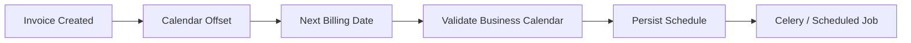

# 10- Date Offsets

## Overview

Date offsets represent calendar-aware movement from one datetime to another.

In Pandas, the main tools are:

```python
pd.DateOffset
pd.offsets.*
```

They are useful when the required operation follows a calendar rule rather than a fixed elapsed duration.

Examples include:

```text
one month from an invoice date
next business day
month end
quarter start
next Monday
first day of the month
last business day
```

This distinction matters because:

```python
pd.Timedelta(days=30)
```

and:

```python
pd.DateOffset(months=1)
```

do not mean the same thing.

A `Timedelta` represents elapsed time.

A `DateOffset` represents a calendar-relative adjustment.

---

## Why Date Offsets Exist

Business rules frequently depend on calendar semantics rather than a fixed number of seconds.

Examples:

```text
renew subscription one month later
run report on the next business day
calculate month-end exposure
schedule a quarterly review
move to the next Monday
```

A naive implementation such as:

```python
timestamp + pd.Timedelta(days=30)
```

can produce the wrong business date because calendar months have different lengths.

Date offsets solve this class of problem by expressing calendar rules directly.

---

## `DateOffset` Versus `Timedelta`

| Operation | Semantic meaning | Example |
| --- | --- | --- |
| `Timedelta` | Fixed elapsed duration | 30 × 24 hours |
| `DateOffset` | Calendar-relative movement | One calendar month |
| `BusinessDay` | Business-day movement | Next working day |
| `MonthEnd` | Move to month-end | Last day of month |
| `QuarterBegin` | Move to quarter start | First day of next/current quarter |

Use:

```python
pd.Timedelta(...)
```

for durations such as:

```text
30 minutes
2 hours
72 hours
15 days
```

Use:

```python
pd.DateOffset(...)
```

or a specialized offset for:

```text
one month
one quarter
next business day
month end
```

---

## Basic `DateOffset`

The standard form is:

```python
pd.DateOffset(
    years=...,
    months=...,
    days=...,
    hours=...,
    minutes=...,
)
```

Example:

```python
import pandas as pd


created_at = pd.Timestamp(
    "2026-01-31 10:00:00"
)

next_month = (
    created_at
    + pd.DateOffset(months=1)
)

print(next_month)
```

This applies calendar-month semantics rather than adding a fixed number of days.

---

## Month Arithmetic

Consider an order created on:

```text
2026-01-31
```

Using:

```python
timestamp + pd.Timedelta(days=30)
```

means:

```text
exactly 30 elapsed days
```

Using:

```python
timestamp + pd.DateOffset(months=1)
```

means:

```text
one calendar month later
```

The resulting day may be adjusted when the target month does not contain the original day.

This makes calendar offsets appropriate for:

```text
subscriptions
billing cycles
monthly contracts
renewal schedules
```

---

## Example: Subscription Renewal

```python
subscriptions = pd.DataFrame(
    {
        "subscription_id": [
            "SUB-1001",
            "SUB-1002",
            "SUB-1003",
        ],
        "started_at": pd.to_datetime(
            [
                "2026-01-15",
                "2026-01-31",
                "2026-03-10",
            ]
        ),
    }
)

subscriptions["renewal_at"] = (
    subscriptions["started_at"]
    + pd.DateOffset(months=1)
)
```

This expresses:

```text
subscription start
        ↓
one calendar month
        ↓
renewal date
```

It is more accurate than assuming every month has 30 days.

---

## Multiple Offset Components

A single `DateOffset` can combine calendar components.

Example:

```python
future = (
    timestamp
    + pd.DateOffset(
        months=2,
        days=5,
    )
)
```

This can be useful for business rules such as:

```text
two months and five calendar days after creation
```

Keep combined offsets readable.

For complex scheduling rules, explicit intermediate values may be easier to test than a single heavily composed expression.

---

## Specialized Offsets

Pandas provides specialized offsets for common calendar rules.

Examples include:

```python
pd.offsets.Day
pd.offsets.BusinessDay
pd.offsets.Week
pd.offsets.MonthBegin
pd.offsets.MonthEnd
pd.offsets.QuarterBegin
pd.offsets.QuarterEnd
pd.offsets.YearBegin
pd.offsets.YearEnd
```

These make intent more explicit than constructing equivalent logic manually.

---

## `Day`

A one-day offset:

```python
next_day = (
    timestamp
    + pd.offsets.Day()
)
```

For ordinary elapsed 24-hour durations, `Timedelta(days=1)` may communicate the requirement better.

Use the semantic distinction deliberately when timezone and calendar behavior matter.

---

## `Week`

Move by calendar weeks:

```python
next_week = (
    timestamp
    + pd.offsets.Week()
)
```

You can also specify the weekday associated with a weekly offset.

For example:

```python
next_monday = (
    timestamp
    + pd.offsets.Week(
        weekday=0
    )
)
```

Weekday numbering follows:

```text
Monday    = 0
Tuesday   = 1
Wednesday = 2
Thursday  = 3
Friday    = 4
Saturday  = 5
Sunday    = 6
```

This is useful for calendar scheduling.

---

## Business Days

`BusinessDay` skips weekends when moving through dates.

Example:

```python
next_business_day = (
    timestamp
    + pd.offsets.BusinessDay()
)
```

This is useful for:

```text
settlement dates
business reporting
operational schedules
workday-based SLAs
```

However, ordinary `BusinessDay` does not automatically model every organization's holiday calendar.

---

## Custom Business Calendars

Many businesses have holidays that are not captured by simple Monday-Friday logic.

Pandas supports custom business-day offsets:

```python
from pandas.tseries.holiday import (
    AbstractHolidayCalendar,
)
```

or explicit holiday configuration depending on the application.

A typical architecture is:

```text
weekends
+
organization-specific holidays
+
business rules
    ↓
business calendar
```

If settlement or financial processing depends on exact market holidays, use the authoritative calendar for that domain rather than assuming a generic business week.

---

## Month Start

Use `MonthBegin` when the requirement is tied to the beginning of a month.

```python
month_start = (
    timestamp
    + pd.offsets.MonthBegin()
)
```

This is useful for:

```text
monthly reporting
billing periods
month-based partitions
```

Be careful about whether the desired behavior is:

```text
current month start
```

or:

```text
next month start
```

Offset behavior is sensitive to where the original timestamp falls in the calendar.

---

## Month End

Use `MonthEnd` for month-end boundaries:

```python
month_end = (
    timestamp
    + pd.offsets.MonthEnd()
)
```

This is useful for:

```text
financial reporting
monthly snapshots
accounting periods
period-end processing
```

For monthly ETL, month-end offsets are often preferable to manually constructing the final day of the month.

---

## Current Versus Next Period

When using anchored offsets such as:

```python
pd.offsets.MonthBegin()
pd.offsets.MonthEnd()
```

understand whether the offset rolls a date to the current anchored boundary or moves it forward.

For example:

```python
timestamp = pd.Timestamp(
    "2026-09-10"
)

result = timestamp + pd.offsets.MonthBegin()
```

versus:

```python
result = timestamp + pd.offsets.MonthBegin(
    n=2
)
```

should be tested against the exact intended schedule.

When boundary behavior is business-critical, include representative edge cases in automated tests.

---

## Quarter Offsets

Quarter-based reporting often uses:

```python
pd.offsets.QuarterBegin()
pd.offsets.QuarterEnd()
```

Example:

```python
quarter_end = (
    timestamp
    + pd.offsets.QuarterEnd()
)
```

This is useful for:

```text
quarterly reporting
financial close
planning periods
compliance reporting
```

If the organization uses a non-calendar fiscal year, use the appropriate fiscal configuration rather than assuming standard calendar quarters.

---

## Year Offsets

Year-based calendar movement can use:

```python
timestamp + pd.DateOffset(years=1)
```

or specialized year-boundary offsets:

```python
pd.offsets.YearBegin()
pd.offsets.YearEnd()
```

For annual subscriptions:

```python
subscriptions["renewal_at"] = (
    subscriptions["started_at"]
    + pd.DateOffset(years=1)
)
```

This expresses the business rule more directly than:

```python
+ pd.Timedelta(days=365)
```

because leap years exist.

---

## Leap Years

A fixed duration such as:

```python
pd.Timedelta(days=365)
```

does not mean:

```text
same calendar date next year
```

For calendar-year movement:

```python
pd.DateOffset(years=1)
```

is generally the correct semantic expression.

Example:

```python
date = pd.Timestamp(
    "2024-02-29"
)

next_year = (
    date
    + pd.DateOffset(years=1)
)
```

Calendar arithmetic must define what happens when the target calendar does not contain the same day.

That behavior should be tested when financial, contractual, or compliance semantics depend on it.

---

## Rolling to a Calendar Boundary

Date offsets are particularly useful when transforming arbitrary timestamps to meaningful boundaries.

Example:

```python
events["month_end"] = (
    events["event_time"]
    + pd.offsets.MonthEnd()
)
```

For a normalized period boundary:

```python
events["month_start"] = (
    events["event_time"]
    - pd.offsets.MonthBegin()
    + pd.offsets.MonthBegin()
)
```

For complex boundary logic, using explicit period conversion may be clearer than stacking multiple offsets.

---

## Offsets on a Series

Offsets can be applied vectorially to a datetime Series.

Example:

```python
orders["due_at"] = (
    orders["created_at"]
    + pd.DateOffset(days=7)
)
```

This is preferred over:

```python
orders["created_at"].apply(
    lambda value: value
    + pd.DateOffset(days=7)
)
```

Use Pandas' column-oriented operations where practical.

---

## Date Offsets and Timezones

Timezone-aware timestamps can be combined with offsets, but timezone semantics must be understood.

Example:

```python
events["next_month"] = (
    events["event_time"]
    + pd.DateOffset(months=1)
)
```

For systems operating across DST transitions, calendar movement may produce a local timestamp whose UTC offset changes.

This is another reason to distinguish:

```text
calendar schedule
```

from:

```text
fixed elapsed duration
```

---

## DST and Calendar Offsets

Consider a recurring local business event:

```text
09:00 America/New_York
```

Around daylight-saving transitions, the corresponding UTC instant changes.

Using a calendar offset is appropriate when the requirement is:

```text
same local calendar schedule
```

A fixed `Timedelta` may instead represent:

```text
exactly 24 elapsed hours
```

These are different requirements.

---

## `DateOffset` in Recurring Schedules

Suppose invoices are generated monthly.

A conceptual schedule can be:



The date offset defines the calendar movement.

The scheduling infrastructure:

```text
Celery
Kubernetes CronJob
EventBridge
application scheduler
```

is responsible for actually executing the job.

Do not confuse date calculation with job scheduling.

---

## Billing and Renewal Example

```python
subscriptions["next_billing_at"] = (
    subscriptions["billing_at"]
    + pd.DateOffset(months=1)
)
```

This is suitable for determining the next calendar billing date.

The production design should additionally define:

```text
month-end behavior
timezone
holiday behavior
failed payments
proration
cancellation
retry policy
idempotency
```

Pandas should calculate the date; business policy should determine whether that calculated date is operationally valid.

---

## Business-Day SLA Example

Suppose a transaction must be processed one business day after creation:

```python
transactions["processing_due"] = (
    transactions["created_at"]
    + pd.offsets.BusinessDay()
)
```

This does not automatically mean:

```text
same as "24 hours later"
```

For operational SLAs, explicitly define whether the requirement means:

```text
one business date
```

or:

```text
24 elapsed hours
```

---

## Combining Offsets With Filtering

Date offsets can generate filter boundaries.

Example:

```python
run_time = pd.Timestamp(
    "2026-09-10 08:00:00",
    tz="UTC",
)

window_start = (
    run_time
    - pd.DateOffset(months=1)
)

window_end = run_time

monthly_window = events.loc[
    (events["event_time"] >= window_start)
    & (events["event_time"] < window_end)
]
```

This is useful for rolling calendar-based reporting.

---

## Offset-Based Incremental Windows

A recurring ETL job may define:

```text
current run
    ↓
calendar offset
    ↓
previous boundary
    ↓
[start, end)
    ↓
extract
```

Example:

```python
window_end = pd.Timestamp.now(
    tz="UTC"
)

window_start = (
    window_end
    - pd.DateOffset(months=1)
)

batch = events.loc[
    (events["event_time"] >= window_start)
    & (events["event_time"] < window_end)
]
```

For replayable pipelines, persist the exact window boundaries used by each run rather than reconstructing them later from the current clock.

---

## Snapshot Scheduling

Month-end snapshots often require a calendar boundary:

```python
snapshot_date = (
    pd.Timestamp.now(tz="UTC")
    + pd.offsets.MonthEnd()
)
```

For production accounting workflows, confirm whether the requirement is:

```text
last calendar day
last business day
last trading day
```

These require different offset strategies.

---

## Business Day Versus Business Month End

`MonthEnd` and business-day rules are not equivalent.

For example:

```text
month end = Saturday
```

does not necessarily mean:

```text
last business day = Saturday
```

A financial system may require:

```text
Friday
```

instead.

Use a business-day-aware rule when the domain explicitly requires working days.

---

## Offset Normalization

Specialized offsets can normalize timestamps to boundaries.

For example:

```python
normalized = (
    timestamps
    + pd.offsets.MonthBegin()
)
```

For more explicit boundary semantics, combine with `.normalize()` where needed:

```python
normalized = (
    timestamps
    + pd.offsets.MonthBegin()
).dt.normalize()
```

Keep time-of-day semantics separate from calendar-boundary semantics when possible.

---

## Offset Comparison

| Requirement | Preferred tool |
| --- | --- |
| 30 exact days | `Timedelta(days=30)` |
| One calendar month | `DateOffset(months=1)` |
| One calendar year | `DateOffset(years=1)` |
| Next weekday | `BusinessDay()` |
| Month beginning | `MonthBegin()` |
| Month ending | `MonthEnd()` |
| Quarter boundary | `QuarterBegin()` / `QuarterEnd()` |
| Year boundary | `YearBegin()` / `YearEnd()` |

The correct tool depends on the business meaning, not just the numeric amount of time.

---

## Date Offsets and SQL

Databases have their own calendar-aware date arithmetic.

PostgreSQL supports expressions such as:

```sql
created_at + INTERVAL '1 month'
```

and:

```sql
date_trunc('month', created_at)
```

For large datasets, prefer database-side date arithmetic when the result is needed only for:

```text
filtering
grouping
aggregation
```

Pandas is appropriate when the data is already materialized in memory or when more complex DataFrame transformations follow.

Avoid transferring large datasets to Pandas merely to perform simple SQL-native calendar operations.

---

## Date Offsets and APIs

REST APIs may provide:

```text
subscription_start
billing_cycle
renewal_at
```

A Pandas ETL step can calculate derived dates:

```python
subscriptions["renewal_at"] = (
    subscriptions["started_at"]
    + pd.DateOffset(months=1)
)
```

The API contract should define:

```text
timezone
billing calendar
month-end semantics
holiday rules
```

Otherwise different clients may calculate different dates.

---

## Date Offsets and Parquet

Derived calendar dates can be persisted in Parquet when repeatedly needed:

```python
orders["billing_month"] = (
    orders["billing_at"]
    .dt.to_period("M")
)
```

or as normalized datetime boundaries:

```python
orders["billing_month_start"] = (
    orders["billing_at"]
    .dt.to_period("M")
    .dt.start_time
)
```

Choose a representation based on downstream querying requirements.

For timezone-sensitive workflows, validate whether period conversion matches the intended reporting timezone before persisting the derived field.

---

## Performance Considerations

Date offsets are vectorizable when applied to a datetime Series:

```python
events["next_month"] = (
    events["event_time"]
    + pd.DateOffset(months=1)
)
```

However, calendar-aware operations can be more computationally expensive than simple integer or fixed-duration arithmetic.

For large datasets:

```text
filter early
project only required columns
avoid repeated offset calculations
benchmark large workloads
push simple date arithmetic into SQL when appropriate
```

Do not calculate dozens of unused calendar fields.

---

## Avoid Row-Wise Offset Functions

Avoid:

```python
events["next_month"] = (
    events["event_time"]
    .apply(
        lambda value:
            value + pd.DateOffset(months=1)
    )
)
```

Prefer:

```python
events["next_month"] = (
    events["event_time"]
    + pd.DateOffset(months=1)
)
```

The vectorized expression is clearer and generally better suited to Pandas' columnar execution model.

---

## Empty DataFrames

Date offset operations should be tested with empty inputs.

```python
events = pd.DataFrame(
    {
        "event_time": pd.Series(
            dtype="datetime64[ns, UTC]"
        )
    }
)

events["next_month"] = (
    events["event_time"]
    + pd.DateOffset(months=1)
)
```

The output should preserve a predictable schema.

Scheduled ETL pipelines often encounter empty windows, so this is a normal production case rather than an exceptional one.

---

## Missing Datetimes

Missing timestamps remain missing when an offset is applied.

```python
events["next_month"] = (
    events["event_time"]
    + pd.DateOffset(months=1)
)
```

If `event_time` is `NaT`, the derived value is also missing.

Do not replace missing values with arbitrary dates before applying offsets unless the business rule explicitly defines a default date.

---

## Duplicate Records

Date offsets do not detect or resolve duplicate records.

For example:

```text
subscription_id = SUB-1001
started_at = 2026-01-15
```

appearing twice produces the same derived renewal date twice.

Deduplication should use the business key:

```python
subscriptions = (
    subscriptions
    .drop_duplicates(
        subset=["subscription_id"],
    )
)
```

Do not treat the calculated date as a uniqueness constraint.

---

## Validation

After applying offsets, validate the derived values.

Example:

```python
subscriptions["renewal_at"] = (
    subscriptions["started_at"]
    + pd.DateOffset(months=1)
)

invalid = subscriptions.loc[
    subscriptions["renewal_at"]
    < subscriptions["started_at"]
]

if not invalid.empty:
    raise ValueError(
        "Invalid renewal dates detected."
    )
```

Additional checks can verify:

```text
timezone
allowed date range
business-day requirements
contract constraints
```

---

## Monitoring

Calendar-related metrics can reveal production problems.

Useful metrics include:

```text
records with invalid derived dates
month-end records
business-day adjustment count
missing source dates
unexpected future dates
records crossing period boundaries
```

For billing or financial systems, monitor boundary behavior explicitly because defects often appear near:

```text
month end
quarter end
year end
leap day
DST transitions
```

---

## Reliability and Reproducibility

Avoid calculating important pipeline boundaries only from:

```python
pd.Timestamp.now()
```

without persisting the resulting values.

Instead:

```text
job starts
    ↓
calculate exact window
    ↓
persist run metadata
    ↓
process records
    ↓
persist output
```

Store:

```text
run_id
window_start
window_end
timezone
calendar rule
code version
```

when reproducibility matters.

This makes reruns and audits deterministic.

---

## Security Considerations

Date offsets are not inherently a security mechanism.

However, user-controlled date ranges can create expensive workloads in APIs.

For example, allowing an unrestricted request for:

```text
10 years of daily calculations
```

can generate significant database and Pandas work.

For public or multi-tenant APIs:

```text
validate date range
limit maximum window
paginate
rate-limit
filter at the source
```

Do not rely on Pandas alone to protect a service from expensive temporal queries.

---

## Common Mistakes

### Using `Timedelta(days=30)` for One Month

A month is not always 30 days.

Use:

```python
pd.DateOffset(months=1)
```

when the requirement is calendar-relative.

---

### Using `Timedelta(days=365)` for One Year

Leap years make this unreliable for calendar-year movement.

Use:

```python
pd.DateOffset(years=1)
```

when the requirement is one calendar year.

---

### Assuming `BusinessDay` Knows Company Holidays

A generic business-day offset primarily handles weekday semantics.

Use an explicit custom holiday calendar when exact business calendars matter.

---

### Confusing Month End With Business Month End

The last calendar day can fall on:

```text
Saturday
Sunday
holiday
```

Financial workflows may require the last working day instead.

---

### Ignoring Timezones

A calendar date depends on timezone.

A month boundary in UTC can occur at a different local date and time.

---

### Using Row-Wise `apply()`

Prefer vectorized offset application:

```python
series + pd.DateOffset(...)
```

rather than a Python callback for every row.

---

### Treating Derived Dates as Unique

Multiple events can legitimately result in the same calculated date.

Use business identifiers for deduplication.

---

### Advancing ETL Windows From the Current Clock During Retries

A retry can calculate a different boundary if the clock has moved.

Persist exact window boundaries for reproducibility.

---

### Assuming Calendar Rules Are Universal

Different organizations may use:

```text
Gregorian calendar
fiscal calendar
trading calendar
holiday calendar
custom billing calendar
```

Define the actual business calendar explicitly.

---

## Interview Traps

### `DateOffset` Versus `Timedelta`

```text
Timedelta
→ fixed elapsed duration

DateOffset
→ calendar-relative adjustment
```

---

### Why Is `Timedelta(days=30)` Not Equivalent to `DateOffset(months=1)`?

Because calendar months have different lengths.

The former represents fixed elapsed time; the latter represents a calendar-month adjustment.

---

### How Do You Add One Calendar Year?

Use:

```python
timestamp + pd.DateOffset(years=1)
```

rather than assuming 365 days.

---

### What Is `BusinessDay`?

A calendar-aware offset that moves through business weekdays according to the configured business-day semantics.

It should not automatically be interpreted as a complete organization-specific holiday calendar.

---

### When Should Date Arithmetic Be Performed in SQL?

When the operation is simple, source-side, and benefits from:

```text
filter pushdown
reduced data transfer
database indexing
database-side aggregation
```

Keep it in Pandas when the data is already materialized or the transformation belongs naturally to the DataFrame pipeline.

---

### Why Persist ETL Window Boundaries?

Because recalculating them from the current time during a retry can produce a different set of records.

Persisted boundaries make processing reproducible and auditable.

---

## Production Checklist

Before using date offsets in production, verify:

```text
[ ] Requirement is classified as elapsed time or calendar time
[ ] Timedelta versus DateOffset is chosen intentionally
[ ] Month-end behavior is defined
[ ] Year-end behavior is defined
[ ] Leap-year behavior is understood
[ ] Business-day requirements are explicit
[ ] Holiday calendars are defined where necessary
[ ] Fiscal-calendar requirements are documented
[ ] Timezone semantics are explicit
[ ] DST behavior is considered where relevant
[ ] Current versus next period behavior is tested
[ ] Missing timestamps are handled intentionally
[ ] Empty datasets are tested
[ ] Duplicate semantics use business keys
[ ] Derived dates are validated
[ ] ETL boundaries are persisted for reproducibility
[ ] Large workloads are benchmarked
[ ] Unnecessary offset calculations are avoided
[ ] Database-side date arithmetic is considered
[ ] API date ranges are bounded
[ ] Calendar-boundary anomalies are monitored
[ ] Month-end, year-end, leap-day, and DST cases are tested where applicable
```

## Key Takeaways

- Use `pd.DateOffset` and specialized offsets for calendar semantics such as months, years, business days, month ends, and quarter boundaries; use `Timedelta` for fixed elapsed durations.
- Calendar arithmetic must explicitly define month-end, leap-year, business-day, holiday, fiscal-calendar, and timezone behavior when those rules affect the business process.
- Apply offsets vectorially to Pandas datetime columns, avoid row-wise `apply()` for ordinary offset calculations, and derive only the fields that downstream processing actually needs.
- For incremental ETL and scheduled workflows, persist exact calculated boundaries and calendar context so retries, audits, and reprocessing remain deterministic.
- Validate and monitor derived dates around month-end, quarter-end, year-end, leap days, holidays, and DST transitions rather than assuming successful arithmetic guarantees correct business semantics.