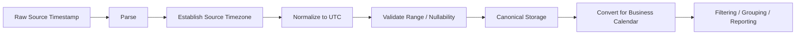

# 12- Timezone Aware Datetime

## Overview

Timezone-aware datetimes represent timestamps together with enough timezone information to identify an instant in time unambiguously.

This matters whenever data crosses:

```text
services
regions
databases
APIs
message queues
containers
cloud infrastructure
```

A timezone-aware timestamp can distinguish:

```text
2026-09-10 14:30 UTC
```

from:

```text
2026-09-10 14:30 Asia/Kolkata
```

even though the wall-clock time looks identical.

In Pandas, timezone-aware datetime processing commonly uses:

```python
pd.to_datetime(..., utc=True)
Series.dt.tz_localize()
Series.dt.tz_convert()
```

A production temporal workflow is generally:

```text
source timestamp
    ↓
parse
    ↓
establish timezone semantics
    ↓
normalize to a canonical timezone
    ↓
store / process
    ↓
convert to business timezone when required
    ↓
derive date/time components
```

The core principle is:

> A timestamp should identify an instant consistently across systems.

---

## Why Timezones Matter

A local clock value without timezone information is incomplete.

Consider:

```text
2026-09-10 09:00:00
```

This could mean:

```text
09:00 UTC
09:00 Asia/Kolkata
09:00 America/New_York
09:00 Europe/London
```

These are different instants.

This ambiguity can cause:

```text
incorrect reports
missed ETL windows
wrong event ordering
incorrect billing dates
SLA calculation errors
duplicate processing
```

Timezone-aware datetimes eliminate much of this ambiguity.

---

## Naive Versus Timezone-Aware Datetimes

A naive datetime contains no timezone information.

```python
timestamp = pd.Timestamp(
    "2026-09-10 14:30:00"
)
```

A timezone-aware timestamp identifies its timezone context:

```python
timestamp = pd.Timestamp(
    "2026-09-10 14:30:00",
    tz="UTC",
)
```

Conceptually:

```text
Naive:
2026-09-10 14:30:00

Aware:
2026-09-10 14:30:00+00:00
```

For distributed systems, timezone-aware timestamps are generally the safer representation.

---

## Why Naive Datetimes Are Dangerous

Naive datetimes are not inherently invalid. They are appropriate when the domain explicitly defines them as timezone-free local values.

Examples might include:

```text
store opens at 09:00 local time
employee shift starts at 08:30 local time
```

But an event such as:

```text
payment completed at 09:00
```

needs an identifiable instant.

For event data, audit records, logs, and distributed processing, timezone-aware timestamps are generally preferable.

---

## Pandas Timezone-Aware Dtype

A timezone-aware datetime Series can have a dtype such as:

```text
datetime64[ns, UTC]
```

Example:

```python
events["event_time"] = pd.to_datetime(
    events["event_time"],
    utc=True,
)

print(events["event_time"].dtype)
```

A timezone-naive Series typically has:

```text
datetime64[ns]
```

The dtype itself is useful for validating temporal assumptions in a pipeline.

---

## Parsing UTC Timestamps

The simplest case is a source that already provides UTC:

```python
events["event_time"] = pd.to_datetime(
    events["event_time"],
    utc=True,
    errors="raise",
)
```

For an input such as:

```text
2026-09-10T14:30:00Z
```

Pandas produces a UTC-aware timestamp.

This is an ideal API boundary representation.

---

## Parsing Offset-Aware Timestamps

Sources may provide explicit offsets:

```text
2026-09-10T20:00:00+05:30
```

Normalize them:

```python
events["event_time"] = pd.to_datetime(
    events["event_time"],
    utc=True,
    errors="raise",
)
```

The resulting instant is represented in UTC.

This allows timestamps from different regions to be compared consistently.

---

## Mixed Timezones

Consider:

```text
2026-09-10T10:00:00+00:00
2026-09-10T15:30:00+05:30
2026-09-10T06:00:00-04:00
```

These can all be normalized:

```python
events["event_time"] = pd.to_datetime(
    events["event_time"],
    utc=True,
)
```

After normalization, the Series has one timezone context:

```text
UTC
```

This is especially useful for:

```text
Kafka events
REST API data
multi-region services
centralized analytics
cross-service ETL
```

---

## `tz_localize()`

`tz_localize()` assigns a timezone to timezone-naive values.

Example:

```python
timestamps = pd.to_datetime(
    values,
)

localized = timestamps.dt.tz_localize(
    "Asia/Kolkata",
)
```

This means:

> These wall-clock values should be interpreted as occurring in Asia/Kolkata.

It does not mean:

> Convert an existing instant to Asia/Kolkata.

That distinction is fundamental.

---

## `tz_convert()`

`tz_convert()` changes the timezone representation of already timezone-aware values.

Example:

```python
utc_times = timestamps.dt.tz_convert(
    "UTC",
)
```

For example:

```text
14:30 Asia/Kolkata
```

represents:

```text
09:00 UTC
```

The instant remains the same.

Only the timezone representation changes.

---

## `tz_localize()` Versus `tz_convert()`

| Operation | Input | Purpose |
| --- | --- | --- |
| `tz_localize()` | Naive datetime | Assign timezone interpretation |
| `tz_convert()` | Timezone-aware datetime | Represent same instant in another timezone |

Typical flow:

```text
naive local source
    ↓
tz_localize(source timezone)
    ↓
tz_convert("UTC")
```

Typical flow for an offset-aware API:

```text
timezone-aware source
    ↓
pd.to_datetime(..., utc=True)
    ↓
UTC
```

---

## Practical Example

Suppose a legacy system exports:

```text
2026-09-10 14:30:00
```

and its documentation states that all timestamps are:

```text
Asia/Kolkata
```

Use:

```python
timestamps = pd.to_datetime(
    values,
    format="%Y-%m-%d %H:%M:%S",
    errors="raise",
)

timestamps = timestamps.dt.tz_localize(
    "Asia/Kolkata",
)

timestamps = timestamps.dt.tz_convert(
    "UTC",
)
```

The source's timezone meaning is established first.

---

## Why You Should Not Localize to UTC Blindly

This is dangerous:

```python
timestamps = (
    pd.to_datetime(values)
    .dt.tz_localize("UTC")
)
```

when the source actually means:

```text
Asia/Kolkata
```

You have now changed the interpreted instant.

For example:

```text
14:30 local
```

should become:

```text
09:00 UTC
```

but blind UTC localization interprets it as:

```text
14:30 UTC
```

which is a five-and-a-half-hour error.

---

## UTC as a Canonical Representation

A common architecture is:


UTC provides a common reference for:

```text
storage
comparison
ordering
event processing
incremental windows
```

Local time can then be applied for business presentation or calendar logic.

---

## Storage Versus Presentation Timezone

A useful rule is:

```text
store canonical instant
        ↓
convert near business boundary
        ↓
present local time
```

For example:

```python
events["event_time_local"] = (
    events["event_time"]
    .dt.tz_convert("Asia/Kolkata")
)
```

The original UTC column remains the authoritative timestamp.

This supports:

```text
auditability
reproducibility
cross-region comparison
```

---

## Timezone Conversion and Datetime Components

Datetime components such as:

```text
date
hour
weekday
month
```

depend on timezone.

Suppose:

```text
event_time = 2026-09-10 20:00 UTC
```

Converting:

```python
local = (
    events["event_time"]
    .dt.tz_convert("Asia/Kolkata")
)
```

before extracting:

```python
events["local_date"] = (
    local.dt.normalize()
)

events["local_hour"] = (
    local.dt.hour
)
```

ensures the components use the intended business timezone.

---

## Reporting by Local Calendar Day

Suppose a report is defined by:

```text
Asia/Kolkata calendar day
```

Use localized timestamps before calculating the date boundary:

```python
local_time = (
    events["event_time"]
    .dt.tz_convert("Asia/Kolkata")
)

events["report_day"] = (
    local_time.dt.normalize()
)
```

Grouping directly on UTC date could assign events to the wrong reporting day.

---

## Timezone-Aware Filtering

Use compatible timezone-aware boundaries.

```python
start = pd.Timestamp(
    "2026-09-10 00:00:00",
    tz="UTC",
)

end = pd.Timestamp(
    "2026-09-11 00:00:00",
    tz="UTC",
)

filtered = events.loc[
    (events["event_time"] >= start)
    & (events["event_time"] < end)
]
```

For a local business-day filter:

```python
start = pd.Timestamp(
    "2026-09-10 00:00:00",
    tz="Asia/Kolkata",
)

end = pd.Timestamp(
    "2026-09-11 00:00:00",
    tz="Asia/Kolkata",
)

local_time = (
    events["event_time"]
    .dt.tz_convert("Asia/Kolkata")
)

filtered = events.loc[
    (local_time >= start)
    & (local_time < end)
]
```

---

## DST and Ambiguous Local Times

Some timezones observe daylight saving time.

During DST transitions:

```text
some local times never occur
some local times occur twice
```

A naive timestamp such as:

```text
2026-11-01 01:30:00
```

may be ambiguous in a DST-observing timezone.

When localizing naive timestamps, Pandas provides mechanisms to control ambiguous and nonexistent times.

Example:

```python
localized = timestamps.dt.tz_localize(
    "America/New_York",
    ambiguous="NaT",
    nonexistent="NaT",
)
```

Possible policies should be selected according to the source contract.

For critical financial or event data, silently guessing an ambiguous time may be worse than quarantining it.

---

## Ambiguous Times

During a DST transition, one local clock value may correspond to two different instants.

This creates ambiguity:

```text
local time
    ↓
two possible instants
```

Possible strategies include:

```text
raise an error
mark ambiguous values as NaT
provide explicit disambiguation
use source-provided offsets
```

The correct choice depends on the business domain.

---

## Nonexistent Times

During a forward DST transition, some local times do not exist.

For example:

```text
01:59
02:00
03:00
```

may occur without an actual:

```text
02:30
```

If a naive source contains such a value, localization requires a policy.

Example:

```python
localized = timestamps.dt.tz_localize(
    "America/New_York",
    nonexistent="NaT",
)
```

Use an explicit policy rather than silently inventing a timestamp.

---

## Timezone Names

Prefer IANA timezone names such as:

```text
UTC
Asia/Kolkata
America/New_York
Europe/London
Australia/Sydney
```

These provide timezone rules, including historical and DST behavior where applicable.

Avoid treating fixed abbreviations such as:

```text
IST
EST
CST
```

as universally unambiguous timezone identifiers.

Some abbreviations refer to multiple regional interpretations.

---

## Fixed UTC Offsets Versus Named Timezones

These are different concepts:

```text
+05:30
```

is a fixed offset.

```text
Asia/Kolkata
```

is a timezone region with defined historical rules.

For long-lived business data, named IANA timezones are usually more expressive when the source or business rule is regional.

---

## Timezone-Aware Arithmetic

Subtracting timezone-aware timestamps representing instants produces a duration:

```python
events["duration"] = (
    events["completed_at"]
    - events["started_at"]
)
```

This is appropriate for:

```text
latency
processing time
SLA duration
queue delay
```

Timezone conversion should not change the actual elapsed duration between equivalent instants.

---

## DST and Duration Semantics

Consider two local timestamps across a DST transition.

A naive interpretation of:

```text
01:00 → 04:00
```

might suggest:

```text
3 hours
```

but the actual elapsed time can differ depending on the transition.

For elapsed-time calculations:

```text
use timezone-aware instants
```

rather than manually subtracting local clock components.

---

## Timezone-Aware `Timedelta`

A fixed duration can be added to timezone-aware timestamps:

```python
events["timeout_at"] = (
    events["event_time"]
    + pd.Timedelta(hours=24)
)
```

This means:

```text
24 elapsed hours later
```

It does not necessarily mean:

```text
same local clock time tomorrow
```

That distinction matters across DST transitions.

---

## Timezone-Aware `DateOffset`

Calendar operations have different semantics:

```python
events["next_month"] = (
    events["event_time"]
    + pd.DateOffset(months=1)
)
```

This represents:

```text
one calendar month later
```

rather than:

```text
a fixed number of hours later
```

The correct operation depends on whether the business rule is duration-based or calendar-based.

---

## Event Time and Processing Time

Distributed systems commonly track multiple timestamps:

```text
event_time
created_at
received_at
processed_at
completed_at
```

These may have different semantics even when all are timezone-aware.

Example:

```python
events["ingestion_lag"] = (
    events["received_at"]
    - events["event_time"]
)
```

This is meaningful only if both fields represent compatible instants.

Do not rename all timestamps to one generic field such as:

```text
timestamp
```

when they describe different lifecycle events.

---

## PostgreSQL Integration

PostgreSQL commonly stores:

```text
timestamp with time zone
```

or:

```text
timestamp without time zone
```

The application and database must agree on semantics.

A Pandas pipeline can normalize database results:

```python
events["created_at"] = pd.to_datetime(
    events["created_at"],
    utc=True,
    errors="raise",
)
```

When querying time-based data, use explicit timezone-aware parameters and database-side filtering when possible.

---

## REST API Integration

Prefer API timestamps that contain explicit timezone information.

Good:

```text
2026-09-10T14:30:00Z
```

or:

```text
2026-09-10T20:00:00+05:30
```

Avoid ambiguous values such as:

```text
10/09/2026 14:30
```

unless the API contract explicitly specifies:

```text
timezone
format
locale
precision
```

Pandas should normalize the values after ingestion.

---

## Kafka and Event Streams

Kafka-based systems may process events from multiple regions.

A robust event record can contain:

```text
event_id
event_time
ingested_at
processed_at
```

Normalize event timestamps early:

```python
events["event_time"] = pd.to_datetime(
    events["event_time"],
    utc=True,
    errors="raise",
)
```

This supports:

```text
event ordering
windowing
lag analysis
incremental processing
reprocessing
```

Do not assume consumer processing time represents event time.

---

## Incremental ETL

Timezone awareness is essential for incremental processing.

Example:

```python
window_start = pd.Timestamp(
    "2026-09-10 10:00:00",
    tz="UTC",
)

window_end = pd.Timestamp(
    "2026-09-10 11:00:00",
    tz="UTC",
)

batch = events.loc[
    (events["event_time"] >= window_start)
    & (events["event_time"] < window_end)
]
```

Using UTC for the ETL watermark gives all workers a common temporal reference.

---

## Local Business-Day ETL

A report may use local calendar boundaries while storage uses UTC.

For example:

```python
local_start = pd.Timestamp(
    "2026-09-10 00:00:00",
    tz="Asia/Kolkata",
)

local_end = pd.Timestamp(
    "2026-09-11 00:00:00",
    tz="Asia/Kolkata",
)

utc_start = local_start.tz_convert(
    "UTC"
)

utc_end = local_end.tz_convert(
    "UTC"
)
```

Then query/filter in UTC:

```python
batch = events.loc[
    (events["event_time"] >= utc_start)
    & (events["event_time"] < utc_end)
]
```

This pattern cleanly separates:

```text
business calendar
```

from:

```text
storage/computation timezone
```

---

## Timezone Normalization at the Data Boundary

A strong ETL architecture is:



Normalization near the ingestion boundary prevents downstream consumers from independently interpreting timestamps.

---

## Timezone and Partitioning

Date-based storage partitions must use an explicit timezone definition.

For example:

```text
event_date = UTC date
```

is different from:

```text
event_date = customer-local date
```

If Parquet objects use:

```text
year=2026/month=09/day=10
```

document whether that partition is derived from:

```text
UTC
```

or:

```text
business timezone
```

Otherwise partition pruning and reporting logic can disagree.

---

## Timezone and Reporting

For customer-facing reporting:

```text
UTC storage
    ↓
customer timezone
    ↓
local date/hour
    ↓
report
```

For system-level operational metrics:

```text
UTC storage
    ↓
UTC aggregation
    ↓
global dashboard
```

There is no universal "correct" reporting timezone.

The correct timezone is determined by the metric's business semantics.

---

## Performance Considerations

Timezone-aware processing is usually efficient with Pandas-native datetime operations, but timezone conversions still require computation.

Prefer:

```python
local_time = (
    events["event_time"]
    .dt.tz_convert("Asia/Kolkata")
)
```

and reuse the result:

```python
events["local_date"] = (
    local_time.dt.normalize()
)

events["local_hour"] = (
    local_time.dt.hour
)
```

rather than repeatedly converting the same column.

For large datasets:

```text
normalize once
reuse derived values
filter early
avoid unnecessary copies
```

---

## Database Pushdown

When a time filter can be expressed in PostgreSQL:

```sql
SELECT
    event_id,
    event_time,
    event_type
FROM events
WHERE event_time >= :start_time
  AND event_time < :end_time;
```

prefer database-side filtering where practical.

This reduces:

```text
network transfer
Pandas memory
CPU spent processing discarded rows
```

The database can also use an appropriate index on the timestamp column.

---

## Missing Timezones

A source timestamp with no timezone should trigger a source-contract decision.

Possible meanings include:

```text
UTC
server local time
customer local time
warehouse local time
unknown
```

Do not guess.

If the timezone is genuinely unknown, preserve that uncertainty rather than assigning an arbitrary timezone and creating false precision.

---

## Invalid and Missing Values

Timezone parsing can fail because of:

```text
malformed timestamp
invalid timezone
missing offset
ambiguous local time
nonexistent local time
```

Use explicit policies.

Example:

```python
events["event_time"] = pd.to_datetime(
    events["event_time"],
    utc=True,
    errors="coerce",
)

invalid = events.loc[
    events["event_time"].isna()
]
```

Then route invalid records according to the ETL policy:

```text
quarantine
retry
reject
manual review
```

---

## Duplicate Records

Timezone normalization can cause different source representations to map to the same instant.

For example:

```text
2026-09-10T14:30:00Z
2026-09-10T20:00:00+05:30
```

represent the same instant.

After normalization, they compare as equivalent timestamps.

This does not automatically mean the records are duplicates.

Use the actual business identity:

```python
events = events.drop_duplicates(
    subset=["event_id"]
)
```

---

## Empty DataFrames

Timezone-aware pipelines should behave predictably with empty inputs.

```python
events = pd.DataFrame(
    {
        "event_time": pd.Series(
            dtype="datetime64[ns, UTC]"
        )
    }
)

events["local_time"] = (
    events["event_time"]
    .dt.tz_convert("Asia/Kolkata")
)
```

An empty ETL window is not necessarily an operational failure.

Test the schema and dtype behavior explicitly.

---

## Testing Timezone Semantics

Timezone behavior should be tested with explicit expected instants.

```python
def test_timezone_conversion() -> None:
    values = pd.Series(
        pd.to_datetime(
            [
                "2026-09-10T14:30:00+05:30",
            ],
            utc=True,
        )
    )

    assert str(
        values.iloc[0]
    ) == "2026-09-10 09:00:00+00:00"
```

This verifies instant preservation.

---

## Testing Localized Dates

```python
def test_local_calendar_day() -> None:
    values = pd.Series(
        pd.to_datetime(
            [
                "2026-09-10T20:00:00Z",
            ],
            utc=True,
        )
    )

    local = values.dt.tz_convert(
        "Asia/Kolkata"
    )

    assert (
        local.dt.normalize().iloc[0]
        == pd.Timestamp(
            "2026-09-11",
            tz="Asia/Kolkata",
        )
    )
```

This verifies that local date semantics are applied after timezone conversion.

---

## Testing DST Behavior

When supporting DST-observing timezones, include:

```text
spring-forward transition
fall-back transition
ambiguous local time
nonexistent local time
```

Example:

```python
values = pd.to_datetime(
    ["2026-03-08 02:30:00"]
)

localized = values.tz_localize(
    "America/New_York",
    nonexistent="NaT",
)
```

The expected policy should be explicit.

---

## Monitoring

Useful timezone-related operational metrics include:

| Metric | Purpose |
| --- | --- |
| Missing timezone count | Detect source contract violations |
| Parse failure count | Detect malformed timestamps |
| Ambiguous local-time count | Detect DST issues |
| Nonexistent local-time count | Detect DST issues |
| Future timestamp count | Detect clock/source problems |
| Timezone conversion failures | Detect invalid input |
| Events by reporting date | Detect timezone shifts |
| Event-time versus processing-time lag | Detect ingestion delays |

A sudden reporting-volume shift around midnight is often worth investigating for timezone regressions.

---

## Security Considerations

Timezone data is generally not sensitive on its own, but timestamps can contain operational information.

Detailed event timing can reveal:

```text
user activity
service behavior
business operations
deployment schedules
```

Avoid exposing internal event timestamps unnecessarily through public APIs.

For user-provided timezones:

```text
validate against allowed timezone names
```

rather than accepting arbitrary configuration without validation.

---

## Common Mistakes

### Calling `tz_localize()` on an Aware Series

`tz_localize()` assigns a timezone to naive values.

For an already aware Series, use:

```python
tz_convert()
```

to change the timezone representation.

---

### Calling `tz_convert()` on Naive Values

A naive Series has no timezone to convert.

Establish the source timezone first:

```python
tz_localize()
```

then convert.

---

### Assuming `utc=True` Knows the Source Local Time

For naive values, `utc=True` interprets them as UTC.

It does not infer:

```text
Asia/Kolkata
America/New_York
```

from the source environment.

---

### Comparing Different Timezone Semantics

A local wall-clock timestamp and a UTC instant should not be treated as equivalent merely because their text representations look similar.

---

### Extracting `.dt.date` Before Timezone Conversion

This can assign records to the wrong business day.

Convert to the intended timezone first.

---

### Treating Timezone Abbreviations as Universal

Values such as:

```text
IST
CST
EST
```

can be ambiguous.

Prefer IANA timezone identifiers.

---

### Ignoring DST

Local timestamps can be ambiguous or nonexistent.

Handle DST explicitly when localizing naive data.

---

### Converting Between Local Clocks Instead of Instants

Do not manually add or subtract hour offsets.

Use:

```python
dt.tz_convert(...)
```

so timezone rules are applied correctly.

---

### Using Fixed Durations for Calendar Semantics

A 24-hour duration is not always the same as "same local time tomorrow."

Use calendar-aware operations when that is the actual business rule.

---

### Assuming Timezone Normalization Deduplicates Records

Two source timestamps can represent the same instant while remaining separate records.

Use business keys for deduplication.

---

### Silently Assigning a Timezone to Unknown Data

Unknown timezone semantics should be treated as a data-quality issue rather than guessed.

---

## Interview Traps

### What Is a Timezone-Aware Datetime?

A datetime that contains timezone context sufficient to identify an instant in time.

---

### `tz_localize()` Versus `tz_convert()`?

```text
tz_localize()
→ assign timezone to naive values

tz_convert()
→ convert an aware value to another timezone
```

---

### Why Store UTC?

UTC provides a common reference across distributed systems, simplifying:

```text
comparison
ordering
ETL windows
storage
cross-region processing
```

---

### Does UTC Solve Every Time Problem?

No.

Business rules can still depend on:

```text
local calendar day
local business hours
holidays
DST
fiscal periods
```

UTC solves ambiguity of the instant, not the definition of every business calendar.

---

### Why Does Local Date Depend on Timezone?

Because the same instant can correspond to different local calendar dates.

An event late in the UTC day may already be the next calendar day in another timezone.

---

### Why Are Naive Datetimes Sometimes Valid?

Some domains describe a local schedule rather than an instant.

For example:

```text
store opens at 09:00 local time
```

does not necessarily require an absolute timestamp until the location is known.

---

### Why Can DST Break Local-Time Logic?

Because daylight-saving transitions can create:

```text
nonexistent local times
ambiguous local times
```

---

### How Should Timezone-Aware Durations Be Calculated?

Subtract timestamps that represent compatible instants:

```python
completed_at - started_at
```

Do not manually subtract local clock components.

---

### Why Convert to Local Time Before Reporting?

Because many reports are defined using local business calendars rather than UTC calendar boundaries.

---

## Production Checklist

Before deploying timezone-aware datetime processing, verify:

```text
[ ] Source timestamp semantics are documented
[ ] Naive versus aware input is understood
[ ] Source timezone is known for naive timestamps
[ ] IANA timezone names are preferred
[ ] UTC is used consistently as a canonical representation where appropriate
[ ] tz_localize() and tz_convert() are used for the correct purposes
[ ] Mixed timezone inputs are normalized
[ ] API timestamp contracts include timezone information
[ ] Database timestamp semantics are understood
[ ] Business reporting timezone is explicitly defined
[ ] Local calendar components are extracted after timezone conversion
[ ] DST behavior is considered where applicable
[ ] Ambiguous local times have an explicit policy
[ ] Nonexistent local times have an explicit policy
[ ] Fixed offsets are not confused with named timezones
[ ] Event time and processing time remain distinct
[ ] Incremental ETL watermarks use a consistent timezone
[ ] Local reporting windows are converted to the canonical timezone correctly
[ ] Missing timezone information is not guessed
[ ] Invalid and missing timestamps are observable
[ ] Duplicate handling uses business keys
[ ] Empty datasets are tested
[ ] Timezone-sensitive boundaries are tested
[ ] DST transitions are tested where relevant
[ ] Large-scale timezone conversions are benchmarked
[ ] Repeated conversions are avoided
[ ] Database filtering is pushed down where practical
[ ] User-provided timezones are validated
[ ] Timestamp exposure through public APIs follows security requirements
[ ] Timezone-related anomalies are monitored
```

## Key Takeaways

- Timezone-aware datetimes identify instants consistently across services and regions; naive datetimes should only be used when the domain explicitly defines them as timezone-free local values.
- `tz_localize()` establishes timezone semantics for naive values, while `tz_convert()` changes the representation of an already timezone-aware instant.
- Normalize event timestamps to a canonical timezone such as UTC at system boundaries, then convert to the required business timezone before deriving local dates, hours, weekdays, or reporting periods.
- DST, ambiguous local times, missing timezone information, and local-calendar requirements remain separate concerns even when timestamps are stored in UTC.
- Production pipelines should validate timezone assumptions, use explicit ETL boundaries, test DST and calendar transitions, avoid repeated conversions, and monitor parsing and temporal anomalies.