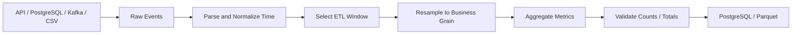

# 13- Resampling

## Overview

Resampling converts time-series data from one temporal frequency to another.

For example:

```text
second-level events
        ↓
minute-level metrics
        ↓
hourly metrics
        ↓
daily reports
```

In Pandas, resampling is primarily performed with:

```python
Series.resample()
DataFrame.resample()
```

Resampling is useful when records are indexed by time and the business requirement is to change the temporal grain:

```text
raw events
→ hourly counts

transactions
→ daily revenue

API metrics
→ 5-minute averages

application logs
→ hourly error rates
```

Resampling is not simply grouping by a date component. It defines explicit time bins and then applies an aggregation, transformation, or filling operation to those bins.

A production workflow is typically:

```text
parse timestamps
    ↓
normalize timezone
    ↓
sort / establish time index
    ↓
define frequency and boundaries
    ↓
resample
    ↓
aggregate / fill / transform
    ↓
validate output
```

---

## Why Resampling Exists

Operational and analytical systems often generate data at a finer granularity than consumers require.

For example, an API monitoring system may produce:

```text
2026-09-10 10:00:03 → 210 ms
2026-09-10 10:00:17 → 190 ms
2026-09-10 10:00:43 → 240 ms
...
```

A dashboard may only need:

```text
10:00 → average latency
10:01 → average latency
10:02 → average latency
```

Resampling provides a consistent temporal aggregation layer.

It is useful for:

```text
monitoring
analytics
financial reporting
capacity planning
event processing
ETL
time-series feature generation
```

---

## Core Resampling Model

Conceptually:

```text
timestamped observations
        ↓
time bins
        ↓
aggregation
        ↓
new time series
```

For example:

```text
10:00:05 ─┐
10:00:35 ─┤
10:00:58 ─┘ → 10:00 bin → mean

10:01:12 ─┐
10:01:44 ─┘ → 10:01 bin → mean
```

The resampling frequency determines the bins.

The aggregation determines what value represents each bin.

---

## DatetimeIndex Requirement

A common pattern is to make the timestamp the index:

```python
events = events.set_index(
    "event_time"
).sort_index()
```

Then:

```python
hourly = events.resample(
    "h"
).size()
```

For time-series resampling, a `DatetimeIndex`, `TimedeltaIndex`, or `PeriodIndex` is the typical basis.

A clear datetime index also makes time-oriented operations easier to reason about.

---

## Basic `resample()`

Example dataset:

```python
import pandas as pd


events = pd.DataFrame(
    {
        "event_time": pd.to_datetime(
            [
                "2026-09-10 10:05:00",
                "2026-09-10 10:15:00",
                "2026-09-10 10:35:00",
                "2026-09-10 11:05:00",
            ],
            utc=True,
        ),
        "amount": [
            100,
            250,
            175,
            300,
        ],
    }
)

events = events.set_index(
    "event_time"
).sort_index()
```

Resample into hourly totals:

```python
hourly = (
    events["amount"]
    .resample("h")
    .sum()
)
```

Conceptually:

```text
10:00 → 525
11:00 → 300
```

---

## Frequency

The frequency controls the target temporal grain.

Common frequencies include:

| Frequency | Meaning |
| --- | --- |
| `s` | Second |
| `min` | Minute |
| `h` | Hour |
| `D` | Calendar day |
| `W` | Week |
| `MS` | Month start |
| `ME` | Month end |
| `QS` | Quarter start |
| `YS` | Year start |

Choose the frequency based on the business grain rather than the available convenience.

For example:

```text
API latency dashboard → 1 minute
operational report → 1 hour
financial summary → 1 day or month
```

---

## Aggregation

Resampling creates bins; aggregation determines what is returned for each bin.

Common aggregations include:

```python
.sum()
.mean()
.min()
.max()
.count()
.size()
.median()
.first()
.last()
```

Example:

```python
daily_sales = (
    orders["amount"]
    .resample("D")
    .sum()
)
```

Average latency:

```python
hourly_latency = (
    metrics["latency_ms"]
    .resample("h")
    .mean()
)
```

---

## `size()` Versus `count()`

This distinction is important.

`size()` counts rows:

```python
events.resample("h").size()
```

`count()` counts non-null values in a selected column:

```python
events["event_id"].resample(
    "h"
).count()
```

For example, if three rows exist but one `event_id` is null:

```text
size()  → 3
count() → 2
```

Choose according to whether the metric represents:

```text
records received
```

or:

```text
non-null observations
```

---

## Multiple Aggregations

Use `.agg()` for multiple metrics.

Example:

```python
hourly = (
    events
    .resample("h")
    .agg(
        total_amount=("amount", "sum"),
        average_amount=("amount", "mean"),
        max_amount=("amount", "max"),
        order_count=("amount", "size"),
    )
)
```

This is often preferable to performing several independent resampling operations because the transformation remains centralized and easier to review.

---

## Resampling a DataFrame

Resampling a DataFrame allows multiple columns to be processed at once.

```python
hourly = (
    events
    .resample("h")
    .agg(
        total_amount=("amount", "sum"),
        average_amount=("amount", "mean"),
        event_count=("event_id", "count"),
    )
)
```

Be explicit about which columns are being aggregated.

Avoid accidentally aggregating unrelated numeric columns simply because Pandas can infer a compatible operation.

---

## Empty Time Bins

A time range can contain periods with no observations.

For example:

```text
10:00 → 5 events
11:00 → 0 events
12:00 → 7 events
```

Depending on the resampling operation, empty bins can appear as missing results.

For counts:

```python
hourly_counts = (
    events
    .resample("h")
    .size()
)
```

empty bins can be represented as zero when they are explicitly generated by the resampler.

For metrics such as averages:

```python
hourly_mean = (
    events["amount"]
    .resample("h")
    .mean()
)
```

an empty bin generally has no meaningful average and should remain missing.

Do not indiscriminately replace missing aggregates with zero.

---

## Zero Versus Missing

This distinction matters operationally.

For a transaction count:

```text
0
```

can mean:

```text
the system observed the interval and there were no transactions
```

For latency:

```text
NaN / NaT
```

can mean:

```text
there were no observations, so latency cannot be calculated
```

These are semantically different.

For example:

```python
hourly_counts = (
    events["event_id"]
    .resample("h")
    .count()
    .fillna(0)
)
```

may be appropriate for a count metric, while:

```python
hourly_latency = (
    metrics["latency_ms"]
    .resample("h")
    .mean()
)
```

should usually preserve missing intervals.

---

## Upsampling

Upsampling increases temporal frequency.

Example:

```text
hourly
→
minute-level
```

Suppose:

```python
hourly = pd.Series(
    [100, 120],
    index=pd.to_datetime(
        [
            "2026-09-10 10:00:00",
            "2026-09-10 11:00:00",
        ],
        utc=True,
    ),
)
```

Upsample:

```python
minute = hourly.resample(
    "min"
).asfreq()
```

This creates minute-level timestamps but does not invent values.

Missing values appear for newly created bins.

---

## `asfreq()`

`asfreq()` selects or creates values at the requested frequency without aggregating multiple observations.

Example:

```python
daily_snapshot = (
    snapshots
    .resample("D")
    .asfreq()
)
```

Use it when the source data is already aligned with the desired temporal representation or when the goal is to expose missing periods rather than aggregate observations.

---

## Filling After Upsampling

After upsampling, you may need to fill missing values.

Forward-fill:

```python
minute = (
    hourly
    .resample("min")
    .asfreq()
    .ffill()
)
```

Backward-fill:

```python
minute = (
    hourly
    .resample("min")
    .asfreq()
    .bfill()
)
```

Interpolation:

```python
minute = (
    hourly
    .resample("min")
    .asfreq()
    .interpolate()
)
```

The correct choice depends on the business meaning of missing intervals.

Never fill simply because a DataFrame looks incomplete.

---

## Forward Fill Semantics

Forward fill assumes that the previous value remains valid until the next observation.

This can be appropriate for:

```text
configuration state
account balance snapshots
latest status
reference values
```

It is usually inappropriate for event counts.

For example, carrying:

```text
10 transactions at 10:00
```

forward into:

```text
10:15
```

does not mean 10 new transactions occurred at 10:15.

---

## Interpolation

Interpolation estimates values between known observations.

Example:

```python
temperature = (
    temperature
    .resample("15min")
    .asfreq()
    .interpolate()
)
```

This can be useful for:

```text
sensor measurements
continuous metrics
smooth physical signals
```

It should not be used blindly for:

```text
financial transactions
event counts
discrete state changes
audit events
```

---

## Downsampling

Downsampling reduces temporal frequency:

```text
second
→ minute
→ hour
→ day
```

Example:

```python
daily_revenue = (
    orders["amount"]
    .resample("D")
    .sum()
)
```

Downsampling is generally an aggregation problem.

The aggregation function must match the metric.

Examples:

```text
transaction count → sum
revenue → sum
latency → mean / median / percentile
inventory snapshot → last
temperature → mean
```

---

## Snapshot Metrics

For state-based data, `last()` or `first()` may be more appropriate than `sum()`.

Example:

```python
daily_inventory = (
    inventory["stock"]
    .resample("D")
    .last()
)
```

This means:

> Take the last observed inventory level for each day.

It does not mean:

> Add every inventory observation during the day.

Choosing the wrong aggregation can produce a mathematically valid but meaningless report.

---

## OHLC Resampling

Financial or market data may require:

```text
open
high
low
close
```

Pandas provides:

```python
ohlc = (
    prices["price"]
    .resample("h")
    .ohlc()
)
```

The output contains:

```text
open
high
low
close
```

The aggregation semantics are different from simple mean or sum.

Use OHLC only when the source represents an appropriate price or time-series measurement.

---

## `first()` and `last()`

For temporal snapshots:

```python
first_value = (
    states["value"]
    .resample("D")
    .first()
)

last_value = (
    states["value"]
    .resample("D")
    .last()
)
```

These are useful for:

```text
opening balance
closing balance
daily state
configuration snapshot
```

Be aware that `first()` and `last()` refer to non-null observations under typical aggregation semantics, not necessarily the first or last raw row if missing values are involved.

---

## Temporal Boundaries

Resampling is affected by how bins are constructed.

For example:

```python
events.resample(
    "h"
)
```

creates hour-based bins according to the frequency's default boundary semantics.

For exact reporting requirements, inspect and explicitly configure:

```text
closed
label
origin
offset
```

rather than assuming the default matches the business definition.

---

## `label`

`label` controls which side of the interval provides the resulting timestamp label.

Conceptually:

```text
left-labeled
```

versus:

```text
right-labeled
```

Example:

```python
hourly = (
    events
    .resample(
        "h",
        label="right",
    )
    .sum()
)
```

This affects the timestamp attached to the aggregate, not which raw records belong to the bin by itself.

---

## `closed`

`closed` controls which side of the interval is inclusive.

Example:

```python
hourly = (
    events
    .resample(
        "h",
        closed="left",
    )
    .sum()
)
```

This matters at exact boundaries such as:

```text
10:00:00
11:00:00
```

For ETL and reporting, boundary semantics must be documented.

---

## `label` Versus `closed`

These settings solve different problems.

| Setting | Controls |
| --- | --- |
| `closed` | Which boundary is included in the bin |
| `label` | Which boundary timestamp labels the output |

Changing `label` does not change membership.

Changing `closed` can change which records belong to which bin.

---

## `origin` and `offset`

Advanced resampling sometimes requires control over where bins begin.

Example:

```python
hourly = (
    events
    .resample(
        "h",
        origin="start_day",
    )
    .sum()
)
```

`origin` can align bins relative to a defined reference.

`offset` can shift the bin alignment.

These are useful when business windows are not naturally aligned to midnight or another default boundary.

For example:

```text
business day starts at 06:00
```

may require explicit bin alignment.

---

## Timezone-Aware Resampling

Timezone-aware indexes can be resampled.

Example:

```python
events = events.set_index(
    "event_time"
).sort_index()

hourly = (
    events
    .resample("h")
    .size()
)
```

The timezone of the index remains part of the temporal representation.

For business reporting, decide whether the frequency should follow:

```text
UTC calendar boundaries
```

or:

```text
local business-time boundaries
```

This is especially important around DST transitions.

---

## Local-Time Resampling

Suppose timestamps are stored in UTC but the report is defined in:

```text
Asia/Kolkata
```

Convert before resampling:

```python
local_events = events.copy()

local_events.index = (
    local_events.index
    .tz_convert("Asia/Kolkata")
)

daily = (
    local_events
    .resample("D")
    .size()
)
```

This produces daily bins according to the local timezone.

Do not resample in UTC and assume the resulting daily boundaries represent local business days.

---

## DST and Resampling

DST-observing timezones can contain:

```text
23-hour local days
25-hour local days
```

A daily resample remains calendar-based, but hourly bins around transitions can behave differently from a simplistic assumption of exactly 24 local hours.

For global systems:

```text
UTC aggregation
```

is often operationally simpler.

For local business reporting:

```text
timezone-aware local aggregation
```

may be required.

The choice should be explicit.

---

## Resampling Versus Grouping by Date

These operations are related but not equivalent.

Component grouping:

```python
events.groupby(
    events.index.date
).size()
```

Resampling:

```python
events.resample(
    "D"
).size()
```

Resampling is generally better for time-series workflows because it provides:

```text
frequency-aware bins
date/time boundaries
resampling methods
upsampling
time-based filling
```

and integrates naturally with other time-series operations.

---

## Resampling and Multi-Index Data

A DataFrame may have dimensions such as:

```text
service
event_time
```

For example:

```text
service + timestamp
```

Resample within groups using:

```python
hourly = (
    events
    .groupby("service")
    .resample("h")
    .agg(
        request_count=("request_id", "count"),
        average_latency=("latency_ms", "mean"),
    )
)
```

This is useful for:

```text
service monitoring
tenant metrics
regional metrics
```

The resulting index can be a MultiIndex.

Use `.reset_index()` when downstream systems expect ordinary columns:

```python
hourly = hourly.reset_index()
```

---

## Resampling Per Customer

Suppose transactions contain:

```text
customer_id
transaction_time
amount
```

Daily totals can be calculated by customer:

```python
daily_customer_sales = (
    transactions
    .groupby("customer_id")
    .resample("D", on="transaction_time")
    .agg(
        total_amount=("amount", "sum"),
        transaction_count=("amount", "size"),
    )
)
```

This avoids manually extracting dates for every row.

---

## `on=` Without Setting the Index

A DataFrame can resample using a datetime column directly.

Example:

```python
daily = (
    events
    .resample(
        "D",
        on="event_time",
    )
    .agg(
        event_count=("event_id", "count"),
        total_amount=("amount", "sum"),
    )
)
```

This can be convenient when the timestamp should remain a normal column.

Use a `DatetimeIndex` when the DataFrame is fundamentally time-series oriented and many subsequent operations depend on time ordering.

---

## Resampling and Aggregation Grain

Always identify the grain before resampling.

Example:

```text
Before:
one row = one transaction

After:
one row = one customer per day
```

or:

```text
Before:
one row = one API request

After:
one row = one service per hour
```

This matters because downstream joins and aggregations must use the new grain.

---

## Resampling and Duplicate Timestamps

Duplicate timestamps are not necessarily a problem.

For example:

```text
10:00:05 → request A
10:00:05 → request B
```

Both observations can belong to the same resampling bin.

Do not deduplicate timestamps just because their values are equal.

Deduplication should use the true business key:

```python
events = events.drop_duplicates(
    subset=["event_id"]
)
```

---

## Missing Values During Aggregation

Suppose:

```python
metrics["latency_ms"] = pd.Series(
    [100, None, 200],
    index=metrics.index,
)
```

Then:

```python
metrics["latency_ms"].resample(
    "h"
).mean()
```

generally ignores missing values according to Pandas aggregation semantics.

This means a result can represent:

```text
mean of observed values
```

rather than:

```text
mean across all expected events
```

For data-quality-sensitive metrics, track observation counts alongside aggregates.

---

## Example: Latency Reporting

```python
hourly_latency = (
    metrics
    .resample("h")
    .agg(
        request_count=("latency_ms", "count"),
        mean_latency_ms=("latency_ms", "mean"),
        max_latency_ms=("latency_ms", "max"),
    )
)
```

The `request_count` metric provides useful context.

A reported mean of:

```text
250 ms
```

with:

```text
2 requests
```

means something very different from:

```text
250 ms
```

with:

```text
20,000 requests
```

---

## Percentiles and Resampling

For latency and other skewed distributions, mean may not be enough.

You can calculate quantiles per time bin:

```python
p95_latency = (
    metrics["latency_ms"]
    .resample("h")
    .quantile(0.95)
)
```

Or combine metrics:

```python
hourly_latency = (
    metrics["latency_ms"]
    .resample("h")
    .agg(
        mean="mean",
        median="median",
    )
)
```

For p95/p99 monitoring, confirm that each bin has sufficient observations.

Percentiles computed from very small samples can be statistically unstable.

---

## Resampling and Rolling Windows

Resampling and rolling are complementary operations.

For example:

```text
raw events
   ↓
minute aggregation
   ↓
15-minute rolling average
```

Example:

```python
minute_latency = (
    metrics["latency_ms"]
    .resample("min")
    .mean()
)

rolling_latency = (
    minute_latency
    .rolling("15min")
    .mean()
)
```

The first operation changes temporal grain.

The second computes a moving window over that grain.

---

## Resampling and Incremental ETL

A common architecture is:



The critical issue is whether the batch contains enough context to produce correct aggregates.

A time-based aggregate may need:

```text
late-arriving events
lookback
overlapping windows
incremental merge/upsert
```

especially when events can arrive after their event-time window.

---

## Incremental Resampling Pitfall

Suppose the pipeline processes:

```text
10:00–11:00
```

and computes:

```text
hourly total
```

before all late events have arrived.

The aggregate may be incomplete.

Possible strategies include:

```text
lookback window
recompute recent bins
idempotent upsert
finalization delay
```

The correct strategy depends on how quickly data becomes complete.

---

## Database Pushdown

When PostgreSQL can aggregate directly:

```sql
SELECT
    date_trunc('hour', event_time) AS hour,
    COUNT(*) AS event_count,
    SUM(amount) AS total_amount
FROM events
WHERE event_time >= :start_time
  AND event_time < :end_time
GROUP BY 1
ORDER BY 1;
```

consider doing the aggregation in the database.

This reduces:

```text
rows transferred
network traffic
Pandas memory
local processing
```

Pandas resampling is most valuable when:

```text
data is already materialized
multiple local transformations follow
the aggregation logic is easier to express in Pandas
```

Do not move simple source-native aggregations into Pandas without a reason.

---

## Parquet and Resampling

Columnar storage can provide efficient input for time-series aggregation.

Example:

```python
events = pd.read_parquet(
    "events.parquet",
)

events["event_time"] = pd.to_datetime(
    events["event_time"],
    utc=True,
)

hourly = (
    events
    .set_index("event_time")
    .resample("h")
    .agg(
        event_count=("event_id", "count"),
        total_amount=("amount", "sum"),
    )
)
```

For very large datasets, partition data by suitable time dimensions so only required partitions need to be read.

---

## Performance Considerations

Resampling is efficient for appropriately typed time-series data, but large datasets still require careful design.

Consider:

```text
index sorting
number of rows
number of groups
frequency granularity
aggregation complexity
timezone conversion
memory requirements
```

A one-second resampling of a year of data can generate a very large number of bins.

Do not select a finer target frequency than the business requirement requires.

---

## High-Frequency Resampling

Suppose source events occur at arbitrary times but the output requires:

```text
every second
```

The resulting index may contain millions of bins even when only a small fraction contain observations.

Before high-frequency resampling, ask:

```text
Is the dense output actually required?
Would sparse event aggregation be sufficient?
Can the calculation be performed in the database or streaming system?
```

This can significantly affect cost and memory.

---

## Avoid Repeated Resampling

Do not repeatedly resample the same data for several metrics when a combined aggregation is sufficient.

Prefer:

```python
hourly = (
    events
    .resample("h")
    .agg(
        count=("event_id", "count"),
        total=("amount", "sum"),
        average=("amount", "mean"),
    )
)
```

over separate passes when the shared computation is equivalent.

The benefit is primarily clearer pipeline structure and potentially reduced work.

---

## Index Ordering

For time-series processing, keep the datetime index sorted:

```python
events = events.sort_index()
```

Sorting is especially important for reliable reasoning about:

```text
time windows
rolling calculations
as-of joins
time slicing
```

Do not repeatedly sort unchanged data inside every pipeline stage.

Sort once at the appropriate boundary.

---

## Timezone Conversion Cost

Timezone conversion can add processing overhead:

```python
events.index = (
    events.index
    .tz_convert("Asia/Kolkata")
)
```

If multiple reporting metrics use the same local timezone:

```python
local_events = events.copy()

local_events.index = (
    local_events.index
    .tz_convert("Asia/Kolkata")
)
```

derive all local aggregates from that representation rather than converting repeatedly.

---

## Empty Inputs

A resampling job can legitimately receive:

```text
no events
```

for a time period.

Example:

```python
empty = pd.DataFrame(
    {
        "event_time": pd.Series(
            dtype="datetime64[ns, UTC]"
        ),
        "amount": pd.Series(
            dtype="float64"
        ),
    }
)

hourly = (
    empty
    .resample(
        "h",
        on="event_time",
    )
    .agg(
        total_amount=("amount", "sum"),
        event_count=("amount", "size"),
    )
)
```

Test whether the expected output should contain:

```text
zero rows
```

or:

```text
an explicit set of empty time bins
```

The business requirement determines the correct representation.

---

## Empty Bins and Complete Reporting Calendars

Sometimes a report must contain every expected period, even when no events occurred.

Generate the complete index explicitly:

```python
expected_hours = pd.date_range(
    start="2026-09-10 00:00:00",
    end="2026-09-10 23:00:00",
    freq="h",
    tz="UTC",
)

hourly = (
    events
    .resample("h")
    .agg(
        event_count=("event_id", "count"),
        total_amount=("amount", "sum"),
    )
    .reindex(expected_hours)
)
```

Then fill only metrics where zero is semantically valid:

```python
hourly["event_count"] = (
    hourly["event_count"]
    .fillna(0)
)
```

Do not automatically fill every metric.

---

## Reliability Considerations

Resampling logic should document:

```text
source timestamp
timezone
target frequency
bin boundaries
label semantics
aggregation
missing-value policy
late-event policy
output grain
```

For example:

```text
Source time: event_time
Timezone: UTC
Frequency: hourly
Bin interval: [start, end)
Label: left
Revenue: sum
Requests: count
Latency: p95
Late data: 15-minute lookback
Output grain: service/hour
```

This turns a resampling operation into an explicit data contract.

---

## Monitoring Resampled Pipelines

Useful operational metrics include:

| Metric | Purpose |
| --- | --- |
| Source row count | Validate input volume |
| Output bin count | Validate expected time coverage |
| Empty bin count | Detect sparse periods |
| Aggregation total | Reconcile source and output |
| Late-event count | Monitor completeness |
| Processing duration | Monitor performance |
| Missing metric count | Detect aggregation gaps |
| Per-bin volume distribution | Detect anomalies |

For financial reports, reconcile:

```text
sum(raw transactions)
=
sum(resampled transaction totals)
```

within the same time and filtering boundaries.

---

## Reconciliation

For additive metrics such as:

```text
revenue
transaction count
units sold
```

resampling should often preserve totals.

Example:

```python
raw_total = (
    events["amount"]
    .sum()
)

resampled_total = (
    events["amount"]
    .resample("h")
    .sum()
    .sum()
)
```

Compare:

```python
assert raw_total == resampled_total
```

subject to the same filtering, missing-value, and numeric-precision rules.

This is a valuable ETL data-quality check.

---

## Non-Additive Metrics

Not every metric should be summed.

Examples:

```text
temperature
latency
inventory level
account balance
conversion rate
```

These require domain-specific aggregation.

For example:

```text
inventory → last
latency → mean / median / percentile
conversion rate → calculate from numerator and denominator
```

Do not assume every numeric field can safely use `.sum()`.

---

## Resampling Ratios and Rates

Aggregating a precomputed ratio can be misleading.

Suppose each row contains:

```text
conversion_rate
```

A simple mean of rates may not equal the overall conversion rate.

Prefer aggregating the underlying components:

```python
daily = (
    events
    .resample("D")
    .agg(
        conversions=("converted", "sum"),
        visits=("visited", "sum"),
    )
)

daily["conversion_rate"] = (
    daily["conversions"]
    / daily["visits"]
)
```

This is generally more correct when the metric is a ratio.

---

## Resampling Financial Data

Financial metrics often require careful aggregation.

Examples:

```text
transaction amounts → sum
account balance → last
positions → last
price → OHLC
percentage return → domain-specific calculation
```

Do not apply a generic aggregation to every financial column.

Preserve:

```text
transaction timestamp
currency
account
instrument
```

and confirm that all records belong to the same reporting context before aggregation.

---

## Duplicate and Idempotency Concerns

If the same event enters the pipeline twice:

```text
event_id=E1001
```

resampling can double-count it.

The aggregation layer cannot determine whether the duplicate is legitimate.

Deduplicate or enforce source uniqueness before resampling:

```python
events = events.drop_duplicates(
    subset=["event_id"]
)
```

For distributed pipelines, use stable event identifiers and idempotent processing.

---

## Security Considerations

Datetime resampling can become expensive when user-controlled parameters determine:

```text
time range
frequency
grouping dimensions
aggregation
```

For public APIs, validate:

```text
maximum time range
allowed frequencies
maximum result size
authorized data scope
```

For example, do not allow an unauthenticated endpoint to request:

```text
one-second metrics
for several years
across all tenants
```

without strict controls.

---

## Testing

Test resampling at the boundary level.

```python
def test_hourly_order_totals() -> None:
    events = pd.DataFrame(
        {
            "event_time": pd.to_datetime(
                [
                    "2026-09-10 10:05:00Z",
                    "2026-09-10 10:55:00Z",
                    "2026-09-10 11:05:00Z",
                ],
                utc=True,
            ),
            "amount": [
                100,
                200,
                50,
            ],
        }
    )

    result = (
        events
        .resample(
            "h",
            on="event_time",
        )
        .agg(
            total_amount=("amount", "sum"),
        )
    )

    assert result["total_amount"].tolist() == [
        300,
        50,
    ]
```

This verifies temporal bin membership and aggregation.

---

## Testing Boundary Timestamps

Always test timestamps exactly at boundaries:

```text
10:00:00
10:59:59
11:00:00
```

Example:

```python
values = pd.DataFrame(
    {
        "event_time": pd.to_datetime(
            [
                "2026-09-10 10:00:00Z",
                "2026-09-10 10:59:59Z",
                "2026-09-10 11:00:00Z",
            ],
            utc=True,
        ),
        "value": [1, 2, 3],
    }
)
```

Boundary tests catch errors caused by incorrect `closed` or `label` assumptions.

---

## Testing Timezone Behavior

```python
def test_local_day_resampling() -> None:
    events = pd.DataFrame(
        {
            "event_time": pd.to_datetime(
                [
                    "2026-09-10T23:30:00Z",
                    "2026-09-11T00:30:00Z",
                ],
                utc=True,
            ),
            "event_id": [
                "E1",
                "E2",
            ],
        }
    )

    events["event_time"] = (
        events["event_time"]
        .dt.tz_convert("Asia/Kolkata")
    )

    result = (
        events
        .resample(
            "D",
            on="event_time",
        )
        .size()
    )

    assert result.sum() == 2
```

Timezone-sensitive reporting should include explicit expected local dates.

---

## Testing Missing Values

Test that aggregation handles missing values according to the intended metric definition.

```python
def test_missing_amounts() -> None:
    events = pd.DataFrame(
        {
            "event_time": pd.to_datetime(
                [
                    "2026-09-10T10:00:00Z",
                    "2026-09-10T10:30:00Z",
                ],
                utc=True,
            ),
            "amount": [100.0, None],
        }
    )

    result = (
        events
        .resample(
            "h",
            on="event_time",
        )
        .agg(
            total_amount=("amount", "sum"),
        )
    )

    assert result["total_amount"].iloc[0] == 100.0
```

For business-critical aggregates, explicitly define how missing observations are interpreted.

---

## Common Mistakes

### Resampling Without Understanding Timezone

Daily bins depend on timezone.

A UTC day is not necessarily a local business day.

---

### Using the Wrong Aggregation

Examples:

```text
inventory → sum
conversion_rate → mean
balance → sum
```

may all be wrong.

Choose aggregation based on the metric's semantics.

---

### Treating Empty Bins as Zero Automatically

Zero is appropriate for some counts, but not for every metric.

An empty latency bin does not mean:

```text
0 ms
```

---

### Ignoring Boundary Semantics

Records exactly at:

```text
10:00
11:00
```

can move between bins depending on configuration.

Test boundaries explicitly.

---

### Forgetting Row Grain

Resampling changes the grain.

For example:

```text
one row = one event
```

may become:

```text
one row = one service/hour
```

Downstream joins must account for this.

---

### Resampling Precomputed Ratios

Averaging percentages or rates can produce incorrect results.

Aggregate numerator and denominator first when appropriate.

---

### Deduplicating Timestamps Instead of Events

Multiple legitimate events can share the same timestamp.

Use business identifiers for deduplication.

---

### Filling All Missing Values

Blind `.fillna(0)` can turn:

```text
no observation
```

into:

```text
measured zero
```

and corrupt metrics.

---

### Resampling in Small ETL Batches Without Late-Data Handling

A bin may be incomplete when the batch runs.

Use lookback, recomputation, or delayed finalization where required.

---

### Pulling Huge Raw Datasets Into Pandas

If PostgreSQL can perform the time aggregation efficiently, push the filtering and aggregation to the database.

---

### Generating Extremely Fine-Grained Output

Upsampling millions of sparse records to second-level or millisecond-level bins can create large memory and storage costs.

Only create dense time grids when consumers actually need them.

---

## Interview Traps

### What Is Resampling?

Resampling changes the temporal frequency of time-indexed data by creating time bins and optionally aggregating, filling, or transforming values within those bins.

---

### Resampling Versus Grouping by Date?

`groupby()` groups based on arbitrary keys or extracted components.

`resample()` is frequency-aware and designed for time-series binning and temporal transformations.

---

### `size()` Versus `count()`?

```text
size()
→ number of rows

count()
→ number of non-null values in the selected column
```

---

### Downsampling Versus Upsampling?

```text
downsampling
→ higher frequency to lower frequency

upsampling
→ lower frequency to higher frequency
```

Upsampling generally introduces missing periods that may require explicit filling or interpolation.

---

### What Does `closed` Control?

It controls which side of each resampling interval is inclusive.

---

### What Does `label` Control?

It determines which interval boundary is used as the output timestamp label.

It does not by itself change bin membership.

---

### Why Can a Mean Be Misleading?

A mean from two observations and a mean from 20,000 observations can look identical while representing very different levels of evidence.

Track observation counts alongside important aggregates.

---

### Why Is `last()` Useful?

For state or snapshot data, `last()` can represent the closing value of each time interval.

It is not equivalent to summing all observations.

---

### Why Can Aggregating Ratios Be Wrong?

Ratios are often non-additive.

The correct result may require aggregating the underlying numerator and denominator first.

---

### Why Does Late Data Matter?

Because an event can arrive after its event-time bin has already been aggregated.

Incremental resampling therefore may require lookback, recomputation, or delayed finalization.

---

## Production Checklist

Before deploying a resampling pipeline, verify:

```text
[ ] Source timestamp is correctly parsed
[ ] Datetime dtype is validated
[ ] Timezone semantics are explicit
[ ] Datetime index or on= column is intentional
[ ] Time data is sorted where required
[ ] Target frequency matches business grain
[ ] Downsampling versus upsampling is explicit
[ ] Aggregation functions match metric semantics
[ ] Sum/count metrics are distinguished from state metrics
[ ] Non-additive metrics use appropriate calculations
[ ] Ratios are recomputed from underlying components where necessary
[ ] Empty-bin behavior is defined
[ ] Zero versus missing semantics are defined
[ ] closed semantics are understood
[ ] label semantics are understood
[ ] origin/offset are configured when custom alignment is required
[ ] Boundary timestamps are tested
[ ] DST behavior is considered for local-time reporting
[ ] Local versus UTC reporting boundaries are explicit
[ ] Duplicate event handling uses business keys
[ ] Late-arriving event handling is defined
[ ] Incremental aggregates are idempotent or recomputable
[ ] Source filtering is pushed down where practical
[ ] Large-frequency outputs are evaluated for memory cost
[ ] Number of generated bins is bounded
[ ] Observation counts accompany important statistics
[ ] Source/output totals are reconciled for additive metrics
[ ] Empty input behavior is tested
[ ] Missing-value behavior is tested
[ ] Timezone-sensitive behavior is tested
[ ] Public API range and frequency parameters are constrained
[ ] Processing duration and output volume are monitored
```

## Key Takeaways

- `resample()` changes the temporal grain of time-indexed data by constructing frequency-based bins and applying aggregation, filling, or transformation operations.
- Correct resampling depends on temporal semantics: timezone, bin boundaries, `closed`, `label`, frequency, and business calendar definitions must be explicit.
- Aggregation must match the metric: counts and revenue may be additive, while balances, inventory, rates, and latency often require different treatment.
- Production ETL requires careful handling of empty bins, missing values, duplicate events, late-arriving data, incremental recomputation, and reconciliation of additive totals.
- For large workloads, use typed and sorted time data, avoid unnecessarily fine-grained dense outputs, push filtering and simple aggregation into PostgreSQL when appropriate, and monitor both processing cost and output quality.