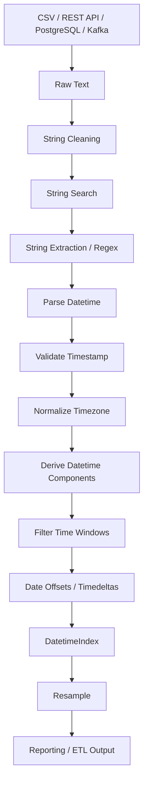

# README.md

## Overview

The **Strings and Datetime** section covers two closely related areas of production data processing:

```text
raw textual data
        ↓
string normalization / extraction
        ↓
typed datetime values
        ↓
timezone-aware temporal processing
        ↓
filtering / offsets / durations
        ↓
resampling / time-series indexing
```

Strings are often the boundary between external systems and structured application data. Datetimes are one of the most important structured types in backend systems because APIs, databases, logs, queues, reports, and ETL pipelines all depend on reliable temporal semantics.

This section progresses from:

```text
String operations
↓
Regex and extraction
↓
Datetime parsing
↓
Datetime components
↓
Filtering
↓
Calendar offsets
↓
Durations
↓
Timezone-aware processing
↓
Resampling
↓
Time-series indexing
```

| # | File | Description |
|---|---|---|
| 01 | [01- String Accessor](./01-%20String%20Accessor.md) | Introduces the `.str` interface and vectorized model for string processing |
| 02 | [02- String Cleaning](./02-%20String%20Cleaning.md) | Focuses on normalizing source text before downstream operations |
| 03 | [03- String Search](./03-%20String%20Search.md) | Covers finding textual patterns without necessarily extracting them |
| 04 | [04- String Extraction](./04-%20String%20Extraction.md) | Focuses on converting semi-structured text into structured columns |
| 05 | [05- Regular Expressions](./05-%20Regular%20Expressions.md) | Develops the regex knowledge required for pattern-based text processing |
| 06 | [06- Datetime Overview](./06-%20Datetime%20Overview.md) | Establishes the temporal model and distinguishes date, time, timestamp, duration, timezone, calendar period |
| 07 | [07- To Datetime](./07-%20To%20Datetime.md) | Focuses on `pd.to_datetime()` and parsing timestamps |
| 08 | [08- Datetime Components](./08-%20Datetime%20Components.md) | Covers the `.dt` accessor for extracting datetime components |
| 09 | [09- Datetime Filtering](./09-%20Datetime%20Filtering.md) | Covers temporal selection: before, after, between timestamps, specific day, month, incremental window |
| 10 | [10- Date Offsets](./10-%20Date%20Offsets.md) | Explains calendar-aware movement with Typical examples |
| 11 | [11- Timedeltas](./11-%20Timedeltas.md) | Covers elapsed time with typical operations |
| 12 | [12- Timezone Aware Datetime](./12-%20Timezone%20Aware%20Datetime.md) | Covers one of the most important production concerns with `tz_localize()` and `tz_convert()` |
| 13 | [13- Resampling](./13-%20Resampling.md) | Covers changing temporal granularity |
| 14 | [14- Time Series Indexing](./14-%20Time%20Series%20Indexing.md) | Brings the datetime topics together through `DatetimeIndex` |

The emphasis is not on memorizing Pandas methods. The goal is to build reliable transformations that remain correct when data is:
```

The emphasis is not on memorizing Pandas methods. The goal is to build reliable transformations that remain correct when data is:

```text
missing
malformed
duplicated
timezone-aware
late
out of order
large
```

---

## Section Structure

```text
09- Strings and Datetime/
│
├── 01- String Accessor.md
├── 02- String Cleaning.md
├── 03- String Search.md
├── 04- String Extraction.md
├── 05- Regular Expressions.md
├── 06- Datetime Overview.md
├── 07- To Datetime.md
├── 08- Datetime Components.md
├── 09- Datetime Filtering.md
├── 10- Date Offsets.md
├── 11- Timedeltas.md
├── 12- Timezone Aware Datetime.md
├── 13- Resampling.md
├── 14- Time Series Indexing.md
└── README.md
```

---

## Learning Flow

### String Processing

The first part of the section establishes reliable text processing.

```text
String Accessor
      ↓
String Cleaning
      ↓
String Search
      ↓
String Extraction
      ↓
Regular Expressions
```

These topics build progressively.

### String Accessor

`01- String Accessor.md` introduces the `.str` interface and establishes the vectorized model for string processing.

Core concepts include:

```python
series.str.lower()
series.str.strip()
series.str.contains()
series.str.replace()
series.str.split()
```

The focus is on:

```text
vectorized operations
missing-value handling
string dtypes
non-mutating transformations
```

---

### String Cleaning

`02- String Cleaning.md` focuses on normalizing source text before downstream operations.

Typical transformations include:

```text
trim whitespace
normalize case
remove unwanted characters
standardize identifiers
normalize categories
```

This is especially important before:

```text
joins
deduplication
validation
grouping
API processing
database loads
```

A useful engineering pattern is:

```text
raw source
    ↓
clean
    ↓
normalize
    ↓
validate
    ↓
use as key
```

---

### String Search

`03- String Search.md` covers finding textual patterns without necessarily extracting them.

Common operations include:

```python
str.contains()
str.startswith()
str.endswith()
str.find()
```

Typical use cases include:

```text
log classification
status detection
record filtering
identifier discovery
data-quality rules
```

Literal matching should be preferred over regex when regex semantics are unnecessary.

---

### String Extraction

`04- String Extraction.md` focuses on converting semi-structured text into structured columns.

For example:

```text
"customer_id=C101 status=failed"
```

can become:

```text
customer_id = C101
status      = failed
```

The central APIs are:

```python
str.extract()
str.extractall()
```

The section emphasizes:

```text
capture groups
named groups
missing matches
output grain
validation
```

`extractall()` deserves special attention because it can change:

```text
one input row
```

into:

```text
multiple output rows
```

which affects downstream joins and aggregations.

---

### Regular Expressions

`05- Regular Expressions.md` develops the regex knowledge required for pattern-based text processing.

It covers:

```text
character classes
quantifiers
anchors
boundaries
capture groups
alternation
flags
escaping
validation
ReDoS considerations
```

Regex should be used when the source format actually requires pattern matching.

Prefer:

```text
split()
partition()
literal contains()
structured parsers
```

when they are simpler and more appropriate.

---

## Datetime Processing

The second part of the section turns textual timestamps into reliable temporal data.

```text
Datetime Overview
      ↓
To Datetime
      ↓
Datetime Components
      ↓
Datetime Filtering
      ↓
Date Offsets
      ↓
Timedeltas
      ↓
Timezone Aware Datetime
      ↓
Resampling
      ↓
Time Series Indexing
```

---

### Datetime Overview

`06- Datetime Overview.md` establishes the temporal model.

It distinguishes:

```text
date
time
timestamp
duration
timezone
calendar period
```

The key engineering distinction is:

```text
Timestamp
→ point in time

Timedelta
→ elapsed duration

DateOffset
→ calendar-relative movement
```

This distinction becomes important throughout the rest of the section.

---

### To Datetime

`07- To Datetime.md` focuses on:

```python
pd.to_datetime()
```

Typical ingestion flow:

```python
events["event_time"] = pd.to_datetime(
    events["event_time"],
    utc=True,
    errors="raise",
)
```

Important topics include:

```text
format handling
ambiguous dates
invalid values
NaT
UTC normalization
epoch timestamps
database timestamps
API timestamps
CSV data
```

Parsing should happen near the ingestion boundary so downstream code works with typed temporal data.

---

### Datetime Components

`08- Datetime Components.md` covers the `.dt` accessor:

```python
.dt.year
.dt.month
.dt.day
.dt.hour
.dt.minute
.dt.second
.dt.dayofweek
.dt.isocalendar()
```

These components are useful for:

```text
reporting
grouping
partitioning
business-hour analysis
calendar dimensions
```

Timezone conversion should occur before component extraction whenever the business rule depends on local time.

---

### Datetime Filtering

`09- Datetime Filtering.md` covers temporal selection:

```text
before timestamp
after timestamp
between timestamps
specific day
specific month
incremental window
rolling lookback
```

The preferred production pattern is usually:

```python
filtered = events.loc[
    (events["event_time"] >= start)
    & (events["event_time"] < end)
]
```

This creates a half-open interval:

```text
[start, end)
```

which is particularly useful for:

```text
ETL windows
watermarks
batch processing
incremental synchronization
```

---

### Date Offsets

`10- Date Offsets.md` explains calendar-aware movement.

Typical examples include:

```python
pd.DateOffset(months=1)
pd.DateOffset(years=1)
pd.offsets.BusinessDay()
pd.offsets.MonthEnd()
pd.offsets.QuarterBegin()
```

The key decision is:

```text
fixed duration
    vs
calendar movement
```

For example:

```python
pd.Timedelta(days=30)
```

is not equivalent to:

```python
pd.DateOffset(months=1)
```

This matters for:

```text
billing
subscriptions
renewals
financial periods
business-day processing
```

---

### Timedeltas

`11- Timedeltas.md` covers elapsed time.

Typical operations include:

```python
completed_at - started_at
pd.Timedelta(minutes=15)
pd.to_timedelta(values)
```

Common uses:

```text
API latency
SLA duration
processing time
queue delay
retry windows
lookback periods
event lag
```

The section also emphasizes:

```text
NaT
negative durations
total_seconds()
numeric duration units
```

Do not confuse:

```text
duration
```

with:

```text
calendar offset
```

---

### Timezone-Aware Datetime

`12- Timezone Aware Datetime.md` covers one of the most important production concerns in datetime processing.

The fundamental operations are:

```python
dt.tz_localize()
dt.tz_convert()
```

The distinction is:

```text
tz_localize()
→ establish timezone semantics

tz_convert()
→ represent the same instant in another timezone
```

A typical distributed-system pattern is:

```text
API / service / database
          ↓
       parse
          ↓
      normalize
          ↓
         UTC
          ↓
     process/store
          ↓
localize for business reporting
```

The section also covers:

```text
DST
ambiguous local times
nonexistent local times
IANA timezone names
local business days
UTC storage
```

---

## Time-Series Processing

The final part of the section applies the preceding concepts to temporal datasets.

```text
Timezone-aware timestamps
          ↓
DatetimeIndex
          ↓
Resampling
          ↓
Rolling / aggregation
          ↓
Time-series reporting
```

---

### Resampling

`13- Resampling.md` covers changing temporal granularity.

Examples:

```text
events → hourly counts
transactions → daily revenue
metrics → 5-minute averages
latency → hourly p95
```

The core API is:

```python
series.resample("h")
```

followed by an operation such as:

```python
.sum()
.mean()
.count()
.size()
.agg(...)
```

The section emphasizes:

```text
downsampling
upsampling
empty bins
missing values
bin boundaries
closed
label
timezone-aware resampling
late-arriving data
incremental aggregation
```

A central principle is:

> The aggregation function must match the metric's semantics.

For example:

```text
revenue     → sum
event count → count/size
balance     → last
latency     → mean/median/percentile
```

---

### Time Series Indexing

`14- Time Series Indexing.md` brings the datetime topics together through `DatetimeIndex`.

Typical setup:

```python
events["event_time"] = pd.to_datetime(
    events["event_time"],
    utc=True,
)

events = (
    events
    .set_index("event_time")
    .sort_index()
)
```

This enables:

```python
events.loc["2026-09-10"]
events.loc["2026-09"]
events.resample("h")
events.rolling("30min")
```

The topic also connects time-series indexing with:

```text
as-of joins
rolling windows
incremental ETL
watermarks
late-arriving events
index alignment
```

---

## How the Topics Fit Together

The complete section can be viewed as a production transformation pipeline:



The sequence matters because each stage establishes assumptions used by the next.

For example:

```text
raw timestamp string
    ↓
pd.to_datetime()
    ↓
timezone normalization
    ↓
DatetimeIndex
    ↓
resample()
```

is fundamentally different from trying to resample raw strings.

---

## Core Production Pattern

A robust ingestion workflow often looks like:

```python
import pandas as pd


events = pd.read_parquet(
    "events.parquet",
)

events["event_time"] = pd.to_datetime(
    events["event_time"],
    utc=True,
    errors="raise",
)

events = (
    events
    .loc[
        events["event_time"].notna()
    ]
    .set_index("event_time")
    .sort_index()
)

hourly = (
    events
    .resample("h")
    .agg(
        event_count=("event_id", "count"),
        total_amount=("amount", "sum"),
    )
)
```

The important properties are:

```text
typed datetime
timezone consistency
explicit filtering
sorted temporal index
defined aggregation
```

---

## Data Quality Across the Section

String and datetime processing should be treated as a data-quality boundary.

Common quality conditions include:

```text
null strings
empty strings
malformed identifiers
unexpected formats
failed regex matches
invalid timestamps
missing timezone
duplicate records
negative durations
future timestamps
out-of-range dates
late events
```

A good pipeline does not simply transform these values. It decides what they mean and what should happen to them.

Typical policies include:

```text
accept
normalize
reject
quarantine
retry
alert
```

---

## Missing Data

Missing values have different meanings across this section.

Examples:

```text
missing string
→ source value unavailable

missing extracted field
→ parsing failure or optional field

NaT timestamp
→ missing or invalid datetime

missing duration
→ incomplete lifecycle

empty time bin
→ no observations
```

Do not replace missing values with zero or placeholder strings without a defined business meaning.

---

## Duplicate Data

String normalization and datetime processing frequently expose duplicate records.

A duplicate may be:

```text
exact duplicate
retry
late delivery
legitimate repeated event
source-system replay
```

Do not use:

```text
string value
timestamp
derived date
duration
```

as automatic deduplication keys.

Use the appropriate business identity, such as:

```text
event_id
transaction_id
request_id
order_id
```

---

## Performance Guidance

String and datetime operations should use Pandas' vectorized APIs.

Prefer:

```python
events["customer_id"] = (
    events["message"]
    .str.extract(
        r"customer_id=(?P<customer_id>[A-Za-z0-9-]+)",
        expand=False,
    )
)
```

over:

```python
events["customer_id"] = events[
    "message"
].apply(
    parse_customer_id
)
```

Similarly, prefer:

```python
events["latency"] = (
    events["completed_at"]
    - events["started_at"]
)
```

over row-wise calculations.

For large datasets:

```text
filter early
project required columns
avoid repeated parsing
avoid unnecessary copies
use typed storage
process in chunks when necessary
```

---

## Database Pushdown

Pandas should not automatically perform work that the source system can perform more efficiently.

For PostgreSQL:

```sql
SELECT
    event_id,
    event_time,
    amount
FROM events
WHERE event_time >= :start_time
  AND event_time < :end_time;
```

This can reduce:

```text
rows transferred
network traffic
memory usage
Pandas CPU usage
```

Similarly, APIs should be queried with server-side date filters when supported.

Pandas becomes the transformation layer after the input has been reduced to an appropriate working set.

---

## Parquet

Parquet is particularly useful after string and datetime normalization because it preserves typed data more effectively than text-oriented formats.

A common workflow is:

```text
CSV / API / database
        ↓
Pandas ingestion
        ↓
clean
        ↓
parse datetime
        ↓
normalize timezone
        ↓
validate
        ↓
Parquet
        ↓
future analytical workloads
```

This avoids repeatedly reparsing raw text.

---

## ETL Architecture

A production ETL implementation can divide responsibilities:

```text
ingestion
    ↓
normalization
    ↓
validation
    ↓
temporal enrichment
    ↓
filtering
    ↓
aggregation
    ↓
storage
```

For example:

```text
API response
    ↓
string cleaning
    ↓
regex extraction
    ↓
datetime parsing
    ↓
UTC normalization
    ↓
incremental time filter
    ↓
daily/hourly aggregation
    ↓
Parquet / PostgreSQL
```

This separation makes testing and operational diagnosis easier.

---

## Incremental Processing

Datetime topics are central to incremental ETL.

A common pattern is:

```text
previous watermark
        ↓
define [start, end)
        ↓
source-side filtering
        ↓
parse / validate
        ↓
transform
        ↓
persist
        ↓
commit watermark
```

Late-arriving events can require:

```text
lookback windows
deduplication
upserts
recomputation
delayed finalization
```

Pandas provides the processing primitives, but correctness depends on the surrounding pipeline design.

---

## Reporting Systems

Datetime components and resampling commonly feed reporting systems.

Example:

```python
report = (
    orders
    .assign(
        report_day=(
            orders["created_at"]
            .dt.tz_convert("Asia/Kolkata")
            .dt.normalize()
        )
    )
    .groupby("report_day", as_index=False)
    .agg(
        order_count=("order_id", "count"),
        revenue=("amount", "sum"),
    )
)
```

The report timezone should be explicit.

Never assume the storage timezone and business reporting timezone are always the same.

---

## Backend Integration

The concepts in this section map directly to common backend architectures.

### REST APIs

Use Pandas to:

```text
normalize response fields
parse timestamps
extract identifiers
validate values
filter time ranges
generate reporting datasets
```

---

### PostgreSQL

Use Pandas to:

```text
consume query results
normalize database-derived values
perform transformations
prepare analytical outputs
```

Push filters and simple source-native aggregations into PostgreSQL when practical.

---

### Kafka

Use temporal processing for:

```text
event-time normalization
lag analysis
time-window aggregation
late-event handling
batch analysis
```

Do not assume event arrival order equals event-time order.

---

### Celery

Timedeltas and datetime components can support:

```text
task runtime analysis
SLA monitoring
retry windows
scheduled reporting
worker performance metrics
```

Pandas should analyze task history; task execution itself belongs to the scheduling/worker system.

---

### AWS

Common storage and processing combinations include:

```text
S3
↓
Parquet
↓
Pandas
↓
reporting / analytics
```

For larger workloads, distributed processing tools may become more appropriate than Pandas.

---

## Scaling Boundaries

Pandas is excellent for:

```text
single-node
in-memory
columnar
moderate-to-large analytical workloads
```

but its main limitation remains memory-bound processing.

When datasets no longer fit comfortably in memory, consider:

```text
chunked Pandas processing
Parquet partitioning
PostgreSQL aggregation
PySpark
distributed query engines
AWS-native analytical services
```

Do not force a single DataFrame to process data that should be reduced or distributed earlier in the architecture.

---

## Testing Strategy

Tests across this section should verify behavior rather than merely execution.

Important cases include:

```text
valid input
missing input
malformed input
duplicate input
empty input
timezone-aware input
timezone-naive input
boundary timestamps
invalid dates
late events
multiple regex matches
empty time bins
negative durations
```

For temporal transformations, test exact boundary values such as:

```text
00:00:00
00:59:59
01:00:00
```

and timezone-sensitive transitions where applicable.

---

## Monitoring Strategy

Useful production metrics include:

| Metric | Purpose |
| --- | --- |
| String normalization failure rate | Detect source-quality changes |
| Extraction success rate | Detect format/schema changes |
| Timestamp parse failure rate | Detect malformed temporal data |
| Null timestamp count | Detect incomplete records |
| Late-event count | Detect delayed delivery |
| Negative duration count | Detect clock/order problems |
| Rows per time window | Detect volume anomalies |
| Empty time-bin count | Detect sparse or missing data |
| Watermark lag | Detect ETL backlog |
| Resampling duration | Detect performance regressions |

Monitoring transformation quality is as important as monitoring job availability.

A pipeline that returns HTTP 200 or exits successfully can still produce incorrect data.

---

## Common Production Pitfalls

### Treating Strings as Structured Data

String formatting is not a reliable substitute for a schema.

Normalize and validate text before using it as a key.

### Parsing Dates Without a Contract

Ambiguous formats such as:

```text
10/09/2026
```

can be interpreted differently.

Define the source format explicitly.

### Ignoring Timezones

A datetime without timezone semantics may be impossible to interpret correctly across distributed systems.

### Using `Timedelta` for Calendar Rules

A fixed duration is not equivalent to:

```text
one month
one business day
month end
```

### Resampling With the Wrong Aggregation

A mathematically valid aggregation can still be semantically incorrect.

### Treating `NaT` as Zero

Missing time information is not the same as zero duration.

### Filtering by Local Date Before Timezone Conversion

This can assign records to the wrong reporting day.

### Ignoring Late Events

Event time and ingestion time are not guaranteed to match.

### Advancing Watermarks Before Successful Persistence

This can permanently skip records after a failed batch.

### Repeating Expensive Parsing

Parse and normalize once at the ingestion boundary where practical.

---

## Interview Focus

By the end of this section, interview questions should be answerable from both API and engineering perspectives.

Important areas include:

```text
.str accessor behavior
str.extract vs extractall
regex versus split
pd.to_datetime
errors="raise" vs errors="coerce"
NaT
DatetimeIndex
timezone-aware versus naive
tz_localize vs tz_convert
Timedelta versus DateOffset
datetime filtering
half-open ETL windows
resampling
rolling time windows
row-based versus time-based windows
late-arriving events
watermarks
database pushdown
```

The important goal is to explain not only:

```text
"What method does this?"
```

but also:

```text
"Why is this the correct abstraction?"
```

and:

```text
"What happens in production when the input is malformed or delayed?"
```

---

## Recommended Engineering Patterns

### Parse Once

```python
events["event_time"] = pd.to_datetime(
    events["event_time"],
    utc=True,
    errors="raise",
)
```

Avoid reparsing the same column throughout the pipeline.

### Normalize Early

```text
raw
→ clean
→ parse
→ normalize timezone
→ validate
```

Downstream logic should operate on stable types.

### Prefer Explicit Temporal Boundaries

```python
(
    events["event_time"] >= start
) & (
    events["event_time"] < end
)
```

This is easier to reason about than implicit date assumptions in incremental pipelines.

### Keep Event Identity Separate From Time

```text
event_id → identity
event_time → temporal attribute
```

Do not use timestamps as a substitute for business keys.

### Push Down Source Filtering

Filter in:

```text
PostgreSQL
REST API
partition-aware storage
```

before loading unnecessary data into Pandas.

---

## Production Checklist

Before considering this section complete, verify:

```text
[ ] Vectorized string operations are understood
[ ] String cleaning rules are explicit
[ ] Literal search is distinguished from regex search
[ ] String extraction capture groups are understood
[ ] extract() versus extractall() is understood
[ ] Regex input is treated safely
[ ] Structured formats use dedicated parsers
[ ] Datetime parsing uses documented source formats
[ ] Invalid timestamps have an explicit policy
[ ] NaT handling is understood
[ ] Datetime components are derived from typed values
[ ] Timezone semantics are explicit
[ ] tz_localize() versus tz_convert() is understood
[ ] UTC normalization is used where appropriate
[ ] Business reporting timezone is defined
[ ] Datetime filters use explicit boundaries
[ ] Half-open ETL windows are understood
[ ] DateOffset versus Timedelta is understood
[ ] Duration units are explicit
[ ] Negative durations are validated
[ ] DatetimeIndex usage is understood
[ ] Time-series ordering is controlled
[ ] Resampling frequency matches business grain
[ ] Resampling aggregation matches metric semantics
[ ] Empty bins are handled correctly
[ ] Late-arriving events have a defined strategy
[ ] Incremental watermarks advance only after successful processing
[ ] Database and API filtering is pushed down where practical
[ ] Large workloads use appropriate memory strategies
[ ] Missing, duplicate, invalid, and empty inputs are tested
[ ] Timezone and boundary cases are tested
[ ] Temporal data quality is monitored
```

## Key Takeaways

- String and datetime processing form a production data boundary: clean and validate external text before turning it into structured identifiers and temporal values.
- Parse timestamps once, establish explicit timezone semantics, and distinguish fixed durations (`Timedelta`) from calendar-relative movement (`DateOffset`).
- Use explicit datetime ranges, preferably `[start, end)`, for incremental ETL, and preserve business identity separately from timestamp-based indexing.
- `DatetimeIndex`, resampling, rolling windows, and time-based alignment are powerful when temporal grain and timezone semantics are explicitly defined.
- Production correctness depends on handling malformed input, missing values, duplicates, timezone transitions, late-arriving events, memory limits, and source-side filtering—not merely making Pandas operations execute successfully.