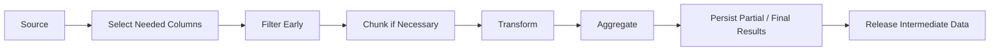

# 01- Pandas Performance

## Overview

Pandas performance is primarily about controlling how much data is processed, how it is represented in memory, and how much Python-level work is performed.

A Pandas operation can be functionally correct and still be unsuitable for production because it:

```text
uses excessive memory
performs unnecessary copies
executes Python code per row
repeats expensive transformations
loads far more data than required
creates unnecessarily large intermediate DataFrames
```

A useful performance model is:

```text
data volume
    ↓
I/O cost
    ↓
memory representation
    ↓
operation cost
    ↓
intermediate allocations
    ↓
CPU utilization
    ↓
output/storage cost
```

For backend and data-engineering workloads, optimization should begin with the pipeline architecture rather than isolated micro-optimizations.

The most important principles are:

```text
read less
→ store efficiently
→ filter early
→ vectorize
→ avoid unnecessary copies
→ aggregate efficiently
→ process in chunks when required
→ measure before and after
```

---

## Why Pandas Performance Matters

Pandas is designed primarily for in-memory, column-oriented data processing.

That provides excellent productivity for:

```text
ETL
reporting
analytics
data cleaning
batch processing
```

but also creates an important constraint:

> The working dataset and its intermediate representations must fit within available memory.

Suppose a pipeline reads:

```text
20 GB source data
```

into a process with:

```text
8 GB RAM
```

then memory usage becomes the primary architectural problem regardless of how fast individual Pandas operations are.

Performance therefore has at least four dimensions:

| Dimension | Typical question |
| --- | --- |
| CPU | How much computation is required? |
| Memory | How much data exists in RAM at peak? |
| I/O | How much data is read and written? |
| End-to-end latency | How long does the complete pipeline take? |

Do not optimize CPU while ignoring a much larger database or storage bottleneck.

---

## Performance Model

A practical way to reason about Pandas performance is:


Each stage can become the bottleneck.

For example:

```text
slow CSV parsing
```

cannot necessarily be fixed by optimizing:

```python
groupby()
```

Similarly:

```text
unnecessary DataFrame copies
```

can cause memory pressure even when the transformation itself is efficient.

---

## Measure Before Optimizing

Use measurement rather than intuition.

Basic timing:

```python
from time import perf_counter


started = perf_counter()

result = (
    orders
    .groupby("customer_id", as_index=False)
    .agg(
        total_amount=("amount", "sum"),
    )
)

elapsed = perf_counter() - started

print(
    f"Aggregation completed in {elapsed:.3f}s"
)
```

For more rigorous benchmarks, use:

```python
import timeit


elapsed = timeit.timeit(
    stmt="""
result = (
    orders
    .groupby("customer_id", as_index=False)
    .agg(
        total_amount=("amount", "sum"),
    )
)
""",
    number=10,
    globals=globals(),
)

print(elapsed)
```

Benchmark with representative data volume and distribution.

---

## Measure Memory Usage

Inspect DataFrame memory:

```python
memory_bytes = (
    orders.memory_usage(
        index=True,
        deep=True,
    )
    .sum()
)

memory_mb = (
    memory_bytes
    / 1024**2
)

print(
    f"{memory_mb:.2f} MB"
)
```

`deep=True` is useful when object/string columns are involved because their referenced Python objects can otherwise be underestimated.

Memory measurement should focus on:

```text
baseline memory
peak memory
intermediate DataFrames
output memory
```

Peak memory often matters more than the final DataFrame size.

---

## Profile the Pipeline

For larger workloads, use profilers and system-level metrics.

Useful tools include:

```text
cProfile
py-spy
memray
memory_profiler
timeit
```

At the process level, monitor:

```text
RSS
CPU utilization
I/O throughput
swap usage
container memory
```

In Docker or Kubernetes, also monitor:

```text
memory requests
memory limits
OOM kills
CPU throttling
```

A DataFrame that fits on a developer laptop may fail inside a container with a lower memory limit.

---

## Read Less Data

One of the highest-value optimizations is reducing the amount of data entering Pandas.

Instead of:

```python
events = pd.read_csv(
    "events.csv"
)
```

prefer:

```python
events = pd.read_csv(
    "events.csv",
    usecols=[
        "event_id",
        "event_time",
        "event_type",
        "amount",
    ],
)
```

This reduces:

```text
I/O
parsing work
memory
downstream processing
```

The same principle applies to:

```text
PostgreSQL
REST APIs
Parquet
object storage
```

---

## Push Filtering to the Source

If PostgreSQL can filter data:

```sql
SELECT
    order_id,
    customer_id,
    created_at,
    amount
FROM orders
WHERE created_at >= :start_time
  AND created_at < :end_time;
```

do not download the entire table and filter afterward unless there is a specific reason.

Source-side filtering can reduce:

```text
database work
network traffic
Pandas memory
Pandas CPU
```

This is generally more important than micro-optimizing the final DataFrame operation.

---

## Column Projection

Project only required columns.

Instead of:

```python
orders = orders[
    [
        "order_id",
        "customer_id",
        "created_at",
        "amount",
        "internal_note",
        "raw_payload",
        "debug_metadata",
    ]
]
```

maintain a narrow working schema:

```python
orders = orders[
    [
        "order_id",
        "customer_id",
        "created_at",
        "amount",
    ]
]
```

Wide DataFrames increase:

```text
memory
copy cost
serialization cost
cache pressure
```

Column projection is particularly valuable when source data contains large text or JSON fields.

---

## Row Filtering

Filter before expensive transformations when possible.

Prefer:

```python
failed = logs.loc[
    logs["status"].eq("failed")
].copy()

failed["request_id"] = (
    failed["message"]
    .str.extract(
        r"request_id=(?P<request_id>[A-Za-z0-9-]+)",
        expand=False,
    )
)
```

rather than parsing every row when only failed requests need extraction.

This reduces work for:

```text
regex
joins
grouping
sorting
```

---

## Vectorization

Vectorization means expressing operations through Pandas or NumPy operations instead of executing Python code for every row.

Prefer:

```python
orders["total"] = (
    orders["quantity"]
    * orders["unit_price"]
)
```

over:

```python
orders["total"] = orders.apply(
    lambda row:
        row["quantity"]
        * row["unit_price"],
    axis=1,
)
```

The vectorized form is generally more efficient because the operation is expressed at the column level.

---

## Python-Level Loops

Avoid:

```python
for row in orders.itertuples():
    ...
```

for transformations that Pandas can express directly.

Loops may still be appropriate when:

```text
external API calls are required
complex stateful logic cannot be vectorized
a small dataset makes clarity more important than raw speed
a specialized Python operation is unavoidable
```

Performance guidance is contextual.

The goal is not:

> Never use loops.

The goal is:

> Avoid Python-level iteration when the operation is naturally columnar.

---

## `apply()` Trade-Offs

`apply()` is convenient but often introduces Python-level execution.

For example:

```python
orders["risk"] = orders[
    "amount"
].apply(
    classify_risk
)
```

may be reasonable if:

```python
classify_risk()
```

contains genuinely complex logic that has no good vectorized equivalent.

However, if the logic is simple:

```python
orders["risk"] = np.where(
    orders["amount"] > 10000,
    "high",
    "normal",
)
```

or:

```python
orders["risk"] = (
    orders["amount"]
    .gt(10_000)
    .map({
        True: "high",
        False: "normal",
    })
)
```

may be better suited to columnar execution.

Measure when the difference is material.

---

## `iterrows()` Is Usually a Poor Default

Avoid:

```python
for _, row in orders.iterrows():
    ...
```

for ordinary transformation logic.

Problems include:

```text
Python-level iteration
potential dtype conversion
poor scalability
harder optimization
```

Prefer:

```python
orders["net_amount"] = (
    orders["gross_amount"]
    - orders["discount"]
)
```

or another vectorized expression.

---

## Avoid Unnecessary Copies

DataFrame copies increase peak memory.

For example:

```python
filtered = orders.copy()

filtered = filtered.loc[
    filtered["status"].eq("completed")
].copy()
```

may create more memory pressure than necessary.

Use copies intentionally:

```python
filtered = orders.loc[
    orders["status"].eq("completed")
].copy()
```

when the result will be modified independently.

Avoid copying data only because it feels safer.

Understand whether an operation requires an independent object.

---

## Explicit Intermediate DataFrames

Do not optimize readability away.

This:

```python
filtered = orders.loc[
    orders["status"].eq("completed")
].copy()

filtered["net_amount"] = (
    filtered["amount"]
    - filtered["discount"]
)

daily = (
    filtered
    .groupby("order_date", as_index=False)
    .agg(
        revenue=("net_amount", "sum"),
    )
)
```

is often better than:

```python
daily = (
    orders
    .loc[orders["status"].eq("completed")]
    .assign(
        net_amount=lambda df:
            df["amount"] - df["discount"]
    )
    .groupby("order_date")
    .net_amount.sum()
)
```

Long method chains can create readability and debugging costs.

Performance optimization should not make transformation logic unmaintainable.

---

## Dtypes and Performance

Data types strongly affect memory usage.

Consider:

```text
Python object string
integer64
float64
category
nullable extension types
datetime64
```

A DataFrame with unnecessary wide dtypes can consume substantially more memory than required.

Inspect:

```python
print(orders.dtypes)
```

and:

```python
print(
    orders.memory_usage(
        deep=True
    )
)
```

Choose dtypes based on:

```text
value domain
missingness
cardinality
required precision
downstream interoperability
```

Do not optimize dtype solely for memory if it changes correctness.

---

## Numeric Downcasting

For bounded numeric values, narrower types may reduce memory.

Example:

```python
orders["quantity"] = pd.to_numeric(
    orders["quantity"],
    downcast="integer",
)
```

Similarly:

```python
orders["amount"] = pd.to_numeric(
    orders["amount"],
    downcast="float",
)
```

Downcasting should be validated against:

```text
minimum value
maximum value
required precision
overflow risk
```

Do not downcast financial values merely because they fit in a smaller float.

---

## Integer Types and Missing Values

Standard NumPy integer dtypes do not represent missing values directly.

Pandas nullable integers can:

```python
orders["quantity"] = (
    orders["quantity"]
    .astype("Int64")
)
```

This supports:

```text
integer values
+
missing values
```

The appropriate dtype depends on downstream performance and interoperability requirements.

Correctness should take precedence over marginal memory savings.

---

## String Dtypes

Modern Pandas provides a dedicated string dtype:

```python
orders["customer_id"] = (
    orders["customer_id"]
    .astype("string")
)
```

Compared with generic `object`, an explicit string dtype provides clearer semantics and missing-value behavior.

Memory characteristics depend on the workload and Pandas backend/version, so benchmark large datasets rather than assuming one representation is always smallest.

---

## Categorical Data

Categorical dtype can reduce memory for low-cardinality repeated values.

Example:

```python
orders["status"] = (
    orders["status"]
    .astype("category")
)
```

Good candidates include:

```text
status
region
country
department
event_type
```

when the number of distinct values is substantially smaller than the number of rows.

Avoid categorical conversion for extremely high-cardinality columns such as:

```text
UUID
request_id
free-form text
```

unless there is a demonstrated reason.

---

## Cardinality Matters

Suppose:

```text
10 million rows
```

contain:

```text
status = completed / failed / pending
```

A categorical representation may provide substantial memory savings.

But if:

```text
10 million rows
```

contain:

```text
10 million unique request IDs
```

categorical encoding may provide little benefit and can add overhead.

Always consider:

```text
row count
distinct count
distribution
```

before changing dtype.

---

## Datetime Dtypes

Store timestamps as datetime types rather than strings.

Prefer:

```python
events["event_time"] = pd.to_datetime(
    events["event_time"],
    utc=True,
)
```

This enables:

```text
vectorized filtering
sorting
resampling
time arithmetic
```

It also avoids repeated parsing.

For analytics pipelines, typed Parquet storage is often preferable to reparsing timestamps from CSV or JSON on every run.

---

## Performance of Filtering

Prefer vectorized boolean masks:

```python
completed = orders.loc[
    orders["status"].eq("completed")
]
```

For multiple conditions:

```python
filtered = orders.loc[
    orders["status"].eq("completed")
    & orders["amount"].gt(1_000)
]
```

Avoid Python callbacks:

```python
orders[
    orders.apply(
        lambda row:
            row["status"] == "completed"
            and row["amount"] > 1_000,
        axis=1,
    )
]
```

The vectorized approach scales much better.

---

## Efficient Membership Filtering

Use `isin()`:

```python
regions = {
    "IN",
    "SG",
    "AE",
}

filtered = orders.loc[
    orders["region"].isin(regions)
]
```

rather than iterating through rows.

For large membership sets, the input representation and cardinality can affect performance, so benchmark if it becomes a hot path.

---

## GroupBy Performance

Grouping is a common bottleneck.

Example:

```python
daily = (
    orders
    .groupby("customer_id", as_index=False)
    .agg(
        total_amount=("amount", "sum"),
        order_count=("order_id", "count"),
    )
)
```

Performance depends on:

```text
row count
number of groups
grouping keys
dtype
aggregation
memory pressure
```

Reduce the working set before grouping.

Avoid grouping on unused columns or unnecessarily high-cardinality dimensions.

---

## Categorical Grouping

Categorical grouping can improve memory characteristics and sometimes performance when group keys have low cardinality.

Example:

```python
orders["region"] = (
    orders["region"]
    .astype("category")
)

regional = (
    orders
    .groupby(
        "region",
        observed=True,
    )["amount"]
    .sum()
)
```

`observed=True` avoids generating groups for unused categorical combinations in relevant grouped operations.

This is particularly useful when categorical dimensions contain many possible values but only a subset occurs in the current batch.

---

## Efficient Sorting

Sorting can be expensive for large datasets.

Avoid repeatedly doing:

```python
orders = orders.sort_values(
    "created_at"
)
```

at every pipeline stage.

If the data remains unchanged, sort once at the boundary where order is required.

For time-series processing:

```python
events = events.sort_values(
    "event_time"
)
```

then reuse the sorted DataFrame.

---

## Sorting and Memory

Sorting may require additional memory because the operation can create temporary structures or copies.

For large datasets:

```text
sort once
sort only required columns when practical
avoid unnecessary full-frame sorting
```

If the source database can already return data ordered by an indexed column, consider whether pushing ordering to the source is beneficial.

Remember that database-side sorting and Pandas-side sorting have different resource trade-offs.

---

## Efficient Joins

Joins can become major memory consumers.

Before joining:

```python
orders.merge(
    customers,
    on="customer_id",
)
```

reduce both sides to the columns actually required.

Example:

```python
customer_subset = customers[
    [
        "customer_id",
        "segment",
    ]
]

result = orders.merge(
    customer_subset,
    on="customer_id",
    how="left",
)
```

This reduces memory in the join output and intermediate structures.

---

## Validate Join Cardinality

Unexpected duplicate keys can cause explosive row multiplication.

Before joining:

```python
customers["customer_id"].is_unique
```

If the relationship should be one-to-one:

```python
result = orders.merge(
    customers,
    on="customer_id",
    how="left",
    validate="many_to_one",
)
```

Join validation is both a correctness and performance safeguard.

A broken one-to-many relationship can multiply millions of rows unexpectedly.

---

## Avoid Cartesian Products

Cross joins can produce:

```text
N × M
```

rows.

This can exhaust memory quickly.

Do not use:

```python
orders.merge(
    customers,
    how="cross",
)
```

unless the product size is intentionally bounded and required.

For large datasets, redesign the operation or push it into a system capable of handling the scale.

---

## Regex Performance

Regex can be significantly more expensive than literal string operations.

Prefer:

```python
logs["message"].str.contains(
    "ERROR",
    regex=False,
    na=False,
)
```

when a literal match is sufficient.

Use regex only when the structure requires it.

For expensive patterns:

```text
reduce candidate rows
use bounded patterns
avoid pathological expressions
benchmark representative data
```

Security-sensitive services should also consider ReDoS risks for untrusted patterns.

---

## String Processing and Memory

String columns can have large memory footprints, particularly when storing:

```text
raw JSON
stack traces
large log messages
HTML
free-form descriptions
```

Project only required string columns:

```python
logs = logs[
    [
        "event_id",
        "status",
        "message",
    ]
]
```

If raw payloads are needed later, keep them in a separate raw storage layer rather than carrying them through every transformation.

---

## Datetime Parsing Performance

Repeatedly parsing the same string timestamps is wasteful.

Prefer:

```python
events["event_time"] = pd.to_datetime(
    events["event_time"],
    utc=True,
)
```

once near ingestion.

Then reuse:

```python
events["event_time"]
```

for:

```text
filtering
grouping
resampling
indexing
duration calculation
```

Typed storage formats such as Parquet can eliminate repeated string parsing across pipeline runs.

---

## Chunked Processing

When the dataset does not fit comfortably in memory, process it in chunks.

Example:

```python
for chunk in pd.read_csv(
    "orders.csv",
    usecols=[
        "order_id",
        "created_at",
        "amount",
    ],
    chunksize=100_000,
):
    chunk["created_at"] = pd.to_datetime(
        chunk["created_at"],
        utc=True,
        errors="raise",
    )

    process(chunk)
```

Chunking controls peak memory usage.

It does not automatically make every operation scalable because some calculations require global state.

---

## Chunk-Friendly Operations

Operations that naturally work chunk-by-chunk include:

```text
row-level validation
column transformations
filtering
per-chunk aggregation
file conversion
```

Operations requiring global state are harder:

```text
global sort
exact global median
global duplicate detection
global unique count
complex joins
```

For those, consider:

```text
external state
pre-aggregation
database processing
distributed systems
specialized algorithms
```

---

## Incremental Aggregation

Some aggregates can be safely combined across chunks.

For additive metrics:

```text
sum
count
```

chunk results can be merged.

Example:

```python
partial_totals = []

for chunk in pd.read_csv(
    "orders.csv",
    chunksize=100_000,
):
    partial = (
        chunk
        .groupby("customer_id")["amount"]
        .sum()
    )

    partial_totals.append(partial)

total = (
    pd.concat(partial_totals)
    .groupby(level=0)
    .sum()
)
```

This pattern avoids loading the entire raw dataset at once.

For non-additive metrics, the aggregation strategy must be designed carefully.

---

## Memory-Aware Pipeline Design

A production pipeline should minimize peak memory:



The objective is not merely to reduce final DataFrame size.

It is to control:

```text
peak resident memory
```

because the operating system and container limits act on peak usage.

---

## Intermediate DataFrames

Suppose:

```python
raw
cleaned
joined
aggregated
```

all exist simultaneously.

If each consumes:

```text
2 GB
```

the process may need substantially more than:

```text
2 GB
```

even though the final result is small.

Delete or scope intermediate objects when they are no longer required:

```python
del joined
```

More importantly, design the pipeline so large intermediates do not coexist unnecessarily.

Explicit pipeline stages can make memory ownership easier to reason about.

---

## Copy-on-Write Considerations

Modern Pandas has copy-on-write behavior that changes when physical copies are materialized.

This improves safety and can reduce some unnecessary copying, but it does not mean copying is free or impossible.

The engineering principle remains:

```text
avoid unnecessary DataFrame duplication
```

Do not rely on implementation details to justify retaining many large intermediate objects.

Measure memory behavior with the Pandas version used in production.

---

## File Format Matters

CSV is convenient but expensive for repeated analytical workloads because it is:

```text
text-based
schema-light
larger on disk
costly to parse
```

Parquet is often preferable for analytical pipelines because it provides:

```text
columnar storage
typed values
compression
column pruning
partitioning
```

Example:

```python
events = pd.read_parquet(
    "events.parquet",
    columns=[
        "event_id",
        "event_time",
        "amount",
    ],
)
```

Reading only required columns can materially reduce I/O and memory.

---

## Compression Trade-Offs

Compressed storage can reduce:

```text
disk usage
network transfer
object storage cost
```

but can increase CPU usage during compression/decompression.

For example:

```text
high compression
→ smaller files
→ more CPU

lower compression
→ larger files
→ less CPU
```

Choose based on:

```text
storage cost
network bandwidth
CPU availability
pipeline latency
```

Benchmark with representative data.

---

## Database Query Design

A Pandas performance problem may actually be a SQL problem.

Instead of:

```python
SELECT *
FROM orders;
```

prefer:

```sql
SELECT
    order_id,
    customer_id,
    created_at,
    amount
FROM orders
WHERE created_at >= :start_time
  AND created_at < :end_time;
```

Good source queries reduce:

```text
rows
columns
network traffic
Pandas memory
```

Use database indexes and query plans appropriate to the workload.

---

## API Query Design

The same principle applies to APIs.

Prefer:

```text
GET /events?start=...&end=...
```

over:

```text
download every event
then filter in Pandas
```

when the API supports server-side filtering.

For large API responses, combine:

```text
pagination
time filters
field projection
incremental synchronization
```

with chunked Pandas processing.

---

## CPU-Bound Versus I/O-Bound Workloads

Identify the actual bottleneck.

### I/O-Bound

Examples:

```text
S3 download
PostgreSQL query
CSV parsing
Parquet reads
API calls
```

Optimization may involve:

```text
source filtering
compression
batch size
connection reuse
parallel I/O where appropriate
```

### CPU-Bound

Examples:

```text
regex extraction
complex transformations
large groupby
sorting
joins
```

Optimization may involve:

```text
vectorization
dtype changes
fewer rows
simpler algorithms
chunking
parallel/distributed processing
```

Do not optimize CPU code when the real bottleneck is database or object-storage latency.

---

## Concurrency and Parallelism

Pandas operations are not automatically faster because a Python program uses threads.

For CPU-heavy transformations:

```text
Python GIL
memory bandwidth
process overhead
DataFrame serialization
```

can limit the benefit of naive concurrency.

For larger parallel workloads, consider:

```text
multiprocessing
Dask
Polars
PySpark
database processing
distributed compute
```

based on workload size and architecture.

Do not introduce distributed processing solely because Pandas has one slow operation; first identify the real bottleneck.

---

## Kubernetes Considerations

A Pandas job in Kubernetes should account for container memory limits.

Example:

```yaml
resources:
  requests:
    cpu: "1"
    memory: "4Gi"
  limits:
    cpu: "2"
    memory: "8Gi"
```

A DataFrame that requires:

```text
7 GiB
```

inside an:

```text
8 GiB
```

container leaves little room for:

```text
Python runtime
Pandas internals
network buffers
other processes
temporary allocations
```

Design for peak memory, not nominal DataFrame size.

---

## AWS Considerations

Typical cloud architectures include:

```text
S3
 ↓
Parquet
 ↓
Pandas processing
 ↓
S3 / PostgreSQL / reporting
```

Performance decisions affect cost through:

```text
S3 request count
data transfer
compute duration
memory-optimized instance requirements
container runtime
```

Reading fewer columns and partitions can reduce both runtime and cloud cost.

For datasets that outgrow comfortable single-node processing, use:

```text
Athena
Glue
EMR / Spark
Redshift
distributed processing
```

where appropriate.

---

## Monitoring Performance

Production jobs should track:

| Metric | Purpose |
| --- | --- |
| Processing duration | Detect regressions |
| Rows processed | Measure throughput |
| Rows per second | Track efficiency |
| Peak memory | Prevent OOM |
| CPU utilization | Identify CPU bottlenecks |
| Input bytes | Explain runtime changes |
| Output bytes | Monitor storage behavior |
| Query duration | Identify source bottlenecks |
| Join row multiplication | Detect correctness/performance issues |
| Failed batches | Reliability monitoring |

A useful high-level metric is:

```text
rows processed / second
```

but it should always be interpreted alongside:

```text
CPU
memory
I/O
input size
```

---

## Benchmarking Properly

A meaningful benchmark should vary:

```text
row count
column count
data types
cardinality
null frequency
distribution
number of groups
```

For example:

```text
100K rows
1M rows
10M rows
```

may exhibit different bottlenecks.

A benchmark that runs only on:

```text
1,000 rows
```

is not sufficient for a production job handling:

```text
10 million rows
```

---

## Performance Regression Tests

For critical pipelines, maintain benchmark thresholds.

Example:

```python
def benchmark_processing(events: pd.DataFrame) -> float:
    from time import perf_counter

    started = perf_counter()

    _ = (
        events
        .groupby("service", as_index=False)
        .agg(
            request_count=("request_id", "count"),
            average_latency=("latency_ms", "mean"),
        )
    )

    return perf_counter() - started
```

Benchmark suites can detect:

```text
unexpected CPU growth
memory regressions
algorithmic regressions
```

Use realistic fixtures and avoid brittle absolute thresholds across unrelated hardware.

---

## Observability

A production Pandas job should emit structured metadata such as:

```text
pipeline_name
run_id
input_rows
output_rows
duration_seconds
peak_memory_mb
input_bytes
output_bytes
invalid_rows
duplicate_rows
```

Example:

```python
logger.info(
    "pandas_batch_completed",
    extra={
        "input_rows": len(events),
        "output_rows": len(result),
        "duration_seconds": elapsed,
    },
)
```

Avoid logging full DataFrames or sensitive data.

---

## Data Quality and Performance

Performance optimizations can accidentally change semantics.

Examples:

```text
dropping nulls too early
using float instead of exact numeric representation
changing join type
deduplicating unexpectedly
converting timezone
changing category semantics
```

Optimization is successful only when:

```text
correctness
+
performance
```

both remain within requirements.

---

## Common Performance Anti-Patterns

### `iterrows()` for Transformations

```python
for _, row in df.iterrows():
    ...
```

Usually replace with vectorized operations.

### Repeated `apply()`

Repeated Python callbacks can become expensive.

### `SELECT *`

Loads unnecessary database columns.

### Reading Entire Files

Use column projection and chunking where appropriate.

### Repeated DataFrame Copies

Increase peak memory.

### Repeated Regex Parsing

Parse once and reuse structured fields.

### Repeated Sorting

Sort only when required and avoid repeating unchanged work.

### Large Cross Joins

Can generate explosive row counts.

### Wide Intermediate DataFrames

Carry only columns required by the current stage.

### Over-Optimization Without Measurement

A theoretically faster technique may be slower for the actual workload.

---

## When Pandas Is No Longer the Right Tool

Pandas is a strong fit when:

```text
data fits in memory
workload is primarily tabular
single-node processing is sufficient
transformations are manageable
```

Consider another architecture when:

```text
data is substantially larger than available memory
processing requires distributed execution
global operations dominate at very large scale
pipeline SLA cannot be met on one node
parallel processing becomes fundamental
```

Potential alternatives include:

```text
PostgreSQL
DuckDB
Polars
Dask
PySpark
AWS Athena
AWS Glue
Redshift
```

The correct choice depends on:

```text
data volume
latency requirement
team expertise
operational complexity
cost
query patterns
```

Do not adopt a distributed system before proving that single-node optimization is insufficient.

---

## Production Optimization Strategy

A practical optimization sequence is:

```text
Measure
  ↓
Reduce input
  ↓
Project columns
  ↓
Push filtering to source
  ↓
Use appropriate dtypes
  ↓
Vectorize
  ↓
Avoid unnecessary copies
  ↓
Optimize joins/grouping
  ↓
Chunk if memory-bound
  ↓
Persist efficient formats
  ↓
Benchmark again
  ↓
Scale architecture only if required
```

This prevents premature optimization and keeps performance improvements measurable.

---

## Testing Performance-Critical Transformations

Performance tests should still verify functional correctness.

Example:

```python
def test_large_batch_preserves_schema(
    large_orders: pd.DataFrame,
) -> None:
    result = (
        large_orders
        .groupby("customer_id", as_index=False)
        .agg(
            total_amount=("amount", "sum"),
        )
    )

    assert list(result.columns) == [
        "customer_id",
        "total_amount",
    ]

    assert result["customer_id"].is_unique
```

A faster pipeline that changes the expected output is not a successful optimization.

---

## Production Checklist

Before deploying a performance-sensitive Pandas workload, verify:

```text
[ ] Actual bottleneck has been measured
[ ] Input row count is known
[ ] Input byte size is known
[ ] Only required columns are loaded
[ ] Source-side filtering is used where practical
[ ] Datetime columns are parsed once
[ ] Appropriate dtypes are selected
[ ] Low-cardinality columns use category where beneficial
[ ] Vectorized operations replace unnecessary Python loops
[ ] apply() is used only where appropriate
[ ] iterrows() is avoided for ordinary transformations
[ ] Unnecessary DataFrame copies are avoided
[ ] Intermediate DataFrames are kept narrow
[ ] Groupby operations use only required keys and columns
[ ] Join cardinality is validated
[ ] Cartesian joins are avoided unless intentional
[ ] Sorting is performed only when required
[ ] Regex is avoided when literal operations are sufficient
[ ] Expensive regex patterns are bounded and tested
[ ] Large inputs use chunking where appropriate
[ ] Chunk aggregation semantics are correct
[ ] Peak memory is measured
[ ] Container memory limits leave headroom
[ ] CPU and I/O utilization are monitored
[ ] Parquet or another efficient storage format is considered
[ ] Database/API pushdown is used where appropriate
[ ] Performance benchmarks use representative data
[ ] Correctness tests accompany optimization
[ ] Performance regressions are detectable
[ ] Invalid, duplicate, missing, and empty data are still handled
[ ] Cloud storage and compute costs are considered
[ ] A scaling boundary is defined before Pandas becomes a bottleneck
```

## Key Takeaways

- Pandas performance starts with reducing the workload: read fewer rows, project fewer columns, filter at the source, and avoid carrying unnecessary data through the pipeline.
- Vectorized operations, appropriate dtypes, efficient joins/grouping, and controlled DataFrame copies are the primary tools for improving CPU and memory behavior.
- Peak memory matters more than final DataFrame size; chunk processing, Parquet, narrow intermediates, and realistic container headroom are essential for production workloads.
- Optimize from measurements, not assumptions: profile duration, memory, CPU, I/O, row throughput, and join/aggregation behavior using representative data.
- Pandas is a strong single-node processing engine, but when data volume or SLA requirements exceed its practical limits, move computation to databases or appropriately scaled tools such as DuckDB, Polars, Dask, PySpark, or AWS analytics services.