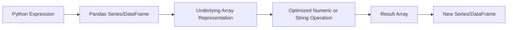
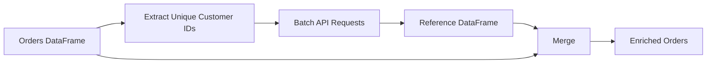

# 02- Vectorization

## Overview

Vectorization is the primary technique for expressing Pandas transformations at the column or array level instead of executing Python code once per row.

For data-processing workloads, the difference is architectural:

```text
Python loop
    ↓
Python interpreter executes each row
    ↓
many Python-level operations
    ↓
higher CPU overhead
```

versus:

```text
Pandas / NumPy expression
    ↓
column-oriented operation
    ↓
optimized implementation
    ↓
lower Python overhead
```

For example:

```python
orders["total_amount"] = (
    orders["quantity"]
    * orders["unit_price"]
)
```

is vectorized because the multiplication operates on entire Series objects.

Vectorization is not simply a syntax preference. It affects:

- CPU utilization
- execution time
- memory behavior
- scalability
- maintainability
- ability to optimize the pipeline

The goal is not to eliminate every loop. The goal is to keep ordinary tabular transformations in column-oriented operations and reserve Python-level iteration for cases where it is genuinely necessary.

---

## What Vectorization Means in Pandas

In Pandas, vectorization generally means applying an operation to a whole Series or DataFrame rather than repeatedly invoking Python code for individual rows.

Example:

```python
orders["net_amount"] = (
    orders["gross_amount"]
    - orders["discount"]
)
```

The operation is expressed against entire columns.

A row-wise implementation would instead look like:

```python
orders["net_amount"] = orders.apply(
    lambda row:
        row["gross_amount"] - row["discount"],
    axis=1,
)
```

Both can produce the same result, but they use different execution models.

| Approach | Execution model | Typical use |
| --- | --- | --- |
| Vectorized operation | Column/array level | Arithmetic, comparisons, masks |
| `Series.map()` | Element-wise mapping | Dictionary or simple function mapping |
| `Series.apply()` | Python function per element | Logic without a vectorized equivalent |
| `DataFrame.apply(axis=1)` | Python function per row | Complex row-dependent logic |
| `iterrows()` | Python iteration | Usually avoid |
| `itertuples()` | Faster Python iteration | Exceptional cases requiring row iteration |

---

## Why Vectorization Matters

Python is highly productive, but executing millions of Python-level function calls is expensive.

Consider:

```python
for row in rows:
    process(row)
```

With one million rows, there can be approximately one million iterations and associated Python-level dispatch overhead.

A vectorized operation expresses the same intent as one column-level operation:

```python
df["total"] = (
    df["quantity"] * df["price"]
)
```

The underlying implementation can perform much more work outside the Python interpreter.

The exact speedup varies with:

```text
operation
dtype
dataset size
CPU
Pandas version
NumPy version
memory bandwidth
```

Therefore, vectorization should be treated as a strong default rather than a guarantee of a fixed performance multiplier.

---

## How Pandas Vectorized Operations Work

A simplified execution model is:



For numeric operations, Pandas commonly delegates underlying array operations to NumPy or other array implementations.

For example:

```python
result = orders["quantity"] * orders["unit_price"]
```

conceptually performs:

```text
Series alignment
↓
underlying array operation
↓
result array
↓
Series with appropriate index
```

The exact implementation depends on the data type and Pandas internals, so vectorized does not mean every operation runs through one identical low-level path.

---

## Series Alignment

Pandas performs label-based alignment in many operations.

Example:

```python
prices = pd.Series(
    [100, 200],
    index=["A", "B"],
)

quantities = pd.Series(
    [2, 3],
    index=["B", "A"],
)

result = quantities * prices
```

The multiplication is aligned by index:

```text
A → 3 × 100
B → 2 × 200
```

rather than blindly multiplying by positional order.

This is a major semantic difference from raw NumPy arrays.

When performance and correctness both matter, understand whether an operation is:

```text
position-based
```

or:

```text
label-aligned
```

---

## Basic Arithmetic Vectorization

Financial and transactional calculations are common candidates.

```python
orders["subtotal"] = (
    orders["quantity"]
    * orders["unit_price"]
)

orders["tax"] = (
    orders["subtotal"]
    * orders["tax_rate"]
)

orders["total"] = (
    orders["subtotal"]
    + orders["tax"]
)
```

This avoids row-wise Python logic.

A more readable production pipeline can use `assign()`:

```python
orders = (
    orders
    .assign(
        subtotal=lambda df:
            df["quantity"] * df["unit_price"],
    )
    .assign(
        tax=lambda df:
            df["subtotal"] * df["tax_rate"],
    )
    .assign(
        total=lambda df:
            df["subtotal"] + df["tax"],
    )
)
```

Use method chaining when the sequence remains easy to understand.

---

## Comparison Operations

Boolean comparisons are vectorized:

```python
high_value = orders["amount"].gt(10_000)

completed = orders["status"].eq("completed")
```

They produce boolean Series that can be used as masks:

```python
filtered = orders.loc[
    orders["status"].eq("completed")
    & orders["amount"].gt(10_000)
]
```

This is preferable to:

```python
filtered = orders.loc[
    orders.apply(
        lambda row:
            row["status"] == "completed"
            and row["amount"] > 10_000,
        axis=1,
    )
]
```

---

## Boolean Expressions and Operator Rules

Pandas uses element-wise boolean operators:

```python
&
|
~
```

not Python's scalar boolean operators:

```python
and
or
not
```

Correct:

```python
filtered = orders.loc[
    orders["status"].eq("completed")
    & orders["amount"].gt(10_000)
]
```

Incorrect:

```python
filtered = orders.loc[
    orders["status"].eq("completed")
    and orders["amount"].gt(10_000)
]
```

The latter attempts to evaluate an entire Series as a single truth value and raises an error.

Parentheses are strongly recommended:

```python
(
    condition_a
    & condition_b
)
```

because operator precedence can otherwise produce incorrect expressions.

---

## Conditional Vectorization with `np.where`

For a binary condition:

```python
import numpy as np

orders["priority"] = np.where(
    orders["amount"].gt(10_000),
    "high",
    "normal",
)
```

This is appropriate when there are exactly two branches.

It makes the intent explicit:

```text
condition
→ true value
→ false value
```

---

## Multiple Conditions with `np.select`

For multiple mutually exclusive business rules:

```python
import numpy as np

conditions = [
    orders["amount"].ge(50_000),
    orders["amount"].ge(10_000),
    orders["amount"].ge(1_000),
]

choices = [
    "critical",
    "high",
    "normal",
]

orders["risk"] = np.select(
    conditions,
    choices,
    default="low",
)
```

This is often preferable to deeply nested Python conditionals.

Keep the conditions ordered intentionally because the first matching condition wins.

---

## `map()` for Lookup-Style Transformations

For direct value mapping:

```python
region_names = {
    "IN": "India",
    "SG": "Singapore",
    "AE": "United Arab Emirates",
}

customers["country_name"] = (
    customers["country_code"]
    .map(region_names)
)
```

Unknown keys become missing values.

Handle them explicitly when required:

```python
customers["country_name"] = (
    customers["country_code"]
    .map(region_names)
    .fillna("Unknown")
)
```

`map()` is appropriate for:

```text
code → label
status → description
small lookup dictionaries
```

For a larger reference dataset, prefer a join instead of maintaining a very large Python dictionary.

---

## `replace()` Versus `map()`

These operations solve related but different problems.

| Operation | Best use |
| --- | --- |
| `map()` | Transform every value using a mapping |
| `replace()` | Replace specified values while preserving other values |
| `merge()` | Join against a reference DataFrame |

Example:

```python
orders["status"] = orders["status"].replace({
    "done": "completed",
    "cancelled_by_user": "cancelled",
})
```

Use `replace()` when unlisted values should remain unchanged.

Use `map()` when missing mappings should become missing values or when every expected value should be controlled.

---

## Vectorized String Operations

Pandas string accessors provide vectorized-style operations over text columns.

```python
customers["email"] = (
    customers["email"]
    .str.strip()
    .str.lower()
)
```

Search:

```python
failed = logs.loc[
    logs["message"].str.contains(
        "timeout",
        case=False,
        regex=False,
        na=False,
    )
]
```

Extract structured data:

```python
logs["request_id"] = (
    logs["message"]
    .str.extract(
        r"request_id=(?P<request_id>[A-Za-z0-9-]+)",
        expand=False,
    )
)
```

These operations are preferable to manually looping over rows.

---

## String Vectorization Is Not Always Cheap

A string accessor is preferable to explicit row iteration, but that does not mean string processing is inexpensive.

Operations such as:

```text
regex
substring extraction
large string replacements
case conversion
normalization
```

can be CPU-intensive.

For large workloads:

```text
filter first
process only required columns
use literal operations where possible
avoid repeated parsing
```

For example:

```python
error_logs = logs.loc[
    logs["level"].eq("ERROR"),
    ["message"],
].copy()

error_logs["request_id"] = (
    error_logs["message"]
    .str.extract(
        r"request_id=(?P<request_id>[A-Za-z0-9-]+)",
        expand=False,
    )
)
```

This avoids running the regex across unrelated rows and columns.

---

## Vectorized Datetime Operations

Datetime accessors support column-level operations:

```python
events["event_time"] = pd.to_datetime(
    events["event_time"],
    utc=True,
)
```

Extract components:

```python
events["event_date"] = (
    events["event_time"]
    .dt.date
)

events["hour"] = (
    events["event_time"]
    .dt.hour
)
```

Filter by date:

```python
recent = events.loc[
    events["event_time"]
    .ge(start_time)
    & events["event_time"]
    .lt(end_time)
]
```

Avoid repeatedly parsing timestamps row by row.

---

## Missing Values in Vectorized Operations

Vectorized operations generally propagate missing values according to the operation's semantics.

Example:

```python
orders["total"] = (
    orders["quantity"]
    * orders["unit_price"]
)
```

If either value is missing, the resulting value may also be missing.

Make missing-value behavior explicit when business logic requires it:

```python
orders["discount"] = (
    orders["discount"]
    .fillna(0)
)

orders["net_amount"] = (
    orders["amount"]
    - orders["discount"]
)
```

Do not blindly replace every missing numeric value with zero. Determine whether:

```text
missing = unknown
```

or:

```text
missing = logically zero
```

for the business domain.

---

## Vectorized Null Checks

Use:

```python
valid = orders["customer_id"].notna()
```

rather than row-wise checks.

For multiple required fields:

```python
valid = (
    orders["customer_id"].notna()
    & orders["amount"].notna()
    & orders["created_at"].notna()
)
```

Then:

```python
valid_orders = orders.loc[valid]
```

This is both readable and efficient.

---

## Vectorized Membership

Use `isin()`:

```python
supported_regions = {
    "IN",
    "SG",
    "AE",
}

filtered = customers.loc[
    customers["region"].isin(
        supported_regions
    )
]
```

For exclusions:

```python
filtered = customers.loc[
    ~customers["region"].isin(
        unsupported_regions
    )
]
```

This is preferable to row-by-row membership tests.

---

## Vectorized Aggregation

Many aggregation operations are naturally vectorized:

```python
daily_revenue = (
    orders
    .groupby("order_date", as_index=False)
    .agg(
        order_count=("order_id", "count"),
        revenue=("amount", "sum"),
        average_order_value=("amount", "mean"),
    )
)
```

Avoid calculating these through row loops:

```python
totals = {}

for row in orders.itertuples():
    ...
```

when `groupby()` can express the business operation directly.

---

## Vectorized Group Transformations

`transform()` is useful when the output must retain the original row structure.

Example:

```python
orders["customer_total"] = (
    orders
    .groupby("customer_id")["amount"]
    .transform("sum")
)

orders["customer_share"] = (
    orders["amount"]
    / orders["customer_total"]
)
```

This avoids manually maintaining state for every customer.

It is especially useful for:

```text
group-relative metrics
normalization
percent-of-group calculations
group-level thresholds
```

---

## Vectorized Ranking

Ranking is another operation where Python loops are unnecessary.

```python
customers["revenue_rank"] = (
    customers["revenue"]
    .rank(
        method="dense",
        ascending=False,
    )
)
```

For top customers:

```python
top_customers = (
    customers
    .nlargest(
        100,
        "revenue",
    )
)
```

Using `nlargest()` can be preferable to sorting the entire DataFrame when only the top `N` rows are required.

---

## Vectorized Cumulative Operations

Cumulative calculations are also available directly:

```python
transactions = (
    transactions
    .sort_values("transaction_time")
)

transactions["running_balance"] = (
    transactions["amount"]
    .cumsum()
)
```

This is clearer and typically more efficient than maintaining a Python accumulator.

The required ordering must be explicit.

A cumulative operation on unsorted event data may produce mathematically valid but business-incorrect results.

---

## Vectorized Window Operations

Rolling calculations can be expressed using Pandas window operations:

```python
daily["rolling_revenue"] = (
    daily["revenue"]
    .rolling(
        window=7,
        min_periods=1,
    )
    .mean()
)
```

This avoids explicit loops and is useful for:

```text
moving averages
rolling counts
rolling sums
time-series analysis
```

Window semantics must be defined carefully, especially around missing dates and time-based windows.

---

## Vectorization and Data Types

Vectorization depends heavily on dtype.

Numeric columns such as:

```text
int64
float64
nullable numeric types
```

are generally well-suited to vectorized arithmetic.

Generic `object` columns can be more expensive because they may contain arbitrary Python objects.

Inspect:

```python
print(df.dtypes)
```

and normalize data types early:

```python
orders["amount"] = pd.to_numeric(
    orders["amount"],
    errors="raise",
)
```

Good vectorization starts with appropriate data representation.

---

## The `object` Dtype Trap

This:

```python
orders["amount"].dtype
```

may reveal:

```text
object
```

even when the column visually contains numbers.

A vectorized numeric expression over such a column may behave differently or require expensive conversions.

Normalize once:

```python
orders["amount"] = pd.to_numeric(
    orders["amount"],
    errors="raise",
)
```

Then reuse the typed column throughout the pipeline.

Do not repeatedly convert the same column inside transformations.

---

## Vectorization Versus `apply()`

`apply()` is not always wrong.

The important distinction is:

```text
Can the operation be expressed with a built-in column operation?
```

If yes, prefer the vectorized operation.

If no, `apply()` may be appropriate.

Example:

```python
orders["risk"] = orders["amount"].apply(
    classify_risk,
)
```

may be acceptable when `classify_risk()` contains complex business logic.

But if the function is essentially:

```python
def classify_risk(amount):
    if amount >= 50_000:
        return "critical"
    if amount >= 10_000:
        return "high"
    return "normal"
```

then:

```python
orders["risk"] = np.select(
    [
        orders["amount"].ge(50_000),
        orders["amount"].ge(10_000),
    ],
    [
        "critical",
        "high",
    ],
    default="normal",
)
```

is usually the better representation.

---

## Vectorization Versus `iterrows()`

Avoid:

```python
for index, row in df.iterrows():
    df.at[index, "total"] = (
        row["quantity"] * row["price"]
    )
```

This combines several inefficient patterns:

```text
Python iteration
row construction
scalar DataFrame writes
repeated indexing
```

Replace it with:

```python
df["total"] = (
    df["quantity"]
    * df["price"]
)
```

The difference becomes significant as row counts increase.

---

## When `itertuples()` Is Acceptable

There are cases where row iteration is legitimate.

For example, a workflow may need to call an external service:

```text
read rows
→ construct request
→ call API
→ record response
```

Pandas cannot vectorize arbitrary network requests.

In such cases:

```python
for row in orders.itertuples(index=False):
    response = client.lookup_customer(
        row.customer_id
    )
```

can be preferable to `iterrows()`.

However, network latency then dominates the workload.

For large API integrations, consider:

```text
batch endpoints
async I/O
connection reuse
rate limiting
retry policies
Celery
queue-based processing
```

rather than focusing only on Pandas iteration speed.

---

## Vectorization and External APIs

A common anti-pattern is to assume API calls can be vectorized simply because the data is in a DataFrame.

This:

```python
orders["customer_segment"] = (
    orders["customer_id"]
    .apply(fetch_customer_segment)
)
```

may execute one network request per row.

That creates:

```text
N network requests
N× latency
rate-limit pressure
retry complexity
possible duplicate requests
```

A better architecture is often:



Example:

```python
customer_ids = (
    orders["customer_id"]
    .dropna()
    .drop_duplicates()
)

segments = fetch_customer_segments(
    customer_ids.tolist()
)

orders = orders.merge(
    segments,
    on="customer_id",
    how="left",
    validate="many_to_one",
)
```

This is an important senior-level distinction:

> Vectorize the data transformation, not arbitrary side effects.

---

## Vectorization and SQL

Many operations can be pushed into SQL.

For example, instead of:

```python
orders = pd.read_sql(
    """
    SELECT *
    FROM orders
    """,
    connection,
)

orders = orders.loc[
    orders["status"].eq("completed")
]
```

prefer source-side filtering:

```python
orders = pd.read_sql(
    """
    SELECT
        order_id,
        customer_id,
        amount,
        created_at
    FROM orders
    WHERE status = %(status)s
    """,
    connection,
    params={
        "status": "completed",
    },
)
```

The highest-value optimization may be to avoid transferring unnecessary data into Pandas at all.

---

## Vectorization and ETL

A production ETL pipeline often looks like:


The Pandas stages should generally:

```text
avoid row loops
avoid repeated parsing
avoid unnecessary copies
preserve explicit schemas
```

This makes performance behavior easier to reason about.

---

## Vectorization and Memory

Vectorized expressions can still allocate temporary arrays.

For example:

```python
orders["net_amount"] = (
    orders["amount"]
    - orders["discount"]
)
```

may require memory for intermediate representations.

For ordinary DataFrames this is usually acceptable, but at large scale:

```text
multiple simultaneous temporary columns
wide DataFrames
large string columns
complex chained expressions
```

can increase peak memory.

Performance therefore has two sides:

```text
CPU efficiency
+
memory efficiency
```

Do not assume a vectorized expression is automatically memory-optimal.

---

## Avoid Recomputing Expensive Expressions

If an expression is expensive and reused, calculate it once.

For example:

```python
normalized_email = (
    customers["email"]
    .str.strip()
    .str.lower()
)

customers["email_normalized"] = normalized_email
```

Then reuse:

```python
duplicates = customers.loc[
    customers["email_normalized"]
    .duplicated(keep=False)
]
```

rather than repeatedly normalizing the same strings.

This is especially important for:

```text
regex
string normalization
datetime parsing
complex calculations
```

---

## Expression Reuse

A readable approach is:

```python
is_completed = (
    orders["status"]
    .eq("completed")
)

is_large = (
    orders["amount"]
    .gt(10_000)
)

large_completed = orders.loc[
    is_completed & is_large
]
```

This provides several benefits:

```text
readability
testability
debuggability
reusability
```

It also makes performance profiling easier because expensive predicates can be measured independently.

---

## Method Chaining and Vectorization

Method chaining can make vectorized pipelines expressive:

```python
result = (
    orders
    .loc[
        orders["status"].eq("completed")
    ]
    .assign(
        net_amount=lambda df:
            df["amount"] - df["discount"],
    )
    .groupby(
        "customer_id",
        as_index=False,
    )
    .agg(
        total_spend=("net_amount", "sum"),
        order_count=("order_id", "count"),
    )
)
```

Do not use chaining purely to minimize lines.

Prefer explicit variables when:

```text
the transformation is reused
debugging requires inspection
the pipeline becomes too long
business rules are complex
```

Performance and maintainability should be optimized together.

---

## Vectorization and Empty DataFrames

Production pipelines must handle zero-row batches.

Example:

```python
filtered = orders.loc[
    orders["status"].eq("completed")
]

if filtered.empty:
    return pd.DataFrame(
        columns=[
            "customer_id",
            "total_spend",
        ]
    )
```

Do not assume vectorized operations always produce the same schema you expect on empty input.

For production pipelines, define expected:

```text
columns
dtypes
index semantics
output contract
```

especially when downstream systems expect a fixed schema.

---

## Vectorization and Invalid Data

Vectorized operations do not replace validation.

Example:

```python
orders["amount"] = pd.to_numeric(
    orders["amount"],
    errors="coerce",
)
```

After coercion:

```python
invalid_amounts = orders[
    orders["amount"].isna()
    & orders["raw_amount"].notna()
]
```

The pipeline should distinguish:

```text
valid input
invalid input
missing input
unexpected input
```

rather than silently converting every parsing failure into missing data.

---

## Precision and Financial Data

Vectorized arithmetic is not a reason to ignore numeric correctness.

For financial data:

```python
transactions["total"] = (
    transactions["quantity"]
    * transactions["unit_price"]
)
```

may use floating-point values.

Depending on system requirements, exact decimal arithmetic may be required.

For money-sensitive systems, establish:

```text
currency representation
precision
rounding policy
database type
serialization format
```

before choosing numeric dtypes.

Performance optimizations must never change financial semantics.

---

## Vectorization and Joins

Joins are already set-oriented operations:

```python
result = orders.merge(
    customers[
        [
            "customer_id",
            "segment",
        ]
    ],
    on="customer_id",
    how="left",
    validate="many_to_one",
)
```

Do not manually look up customer attributes row by row:

```python
orders["segment"] = orders[
    "customer_id"
].apply(
    lambda customer_id:
        customer_lookup(customer_id)
)
```

A join is both more natural for relational data and usually much easier to reason about operationally.

---

## Vectorization and Duplicate Handling

Deduplication is another set-oriented operation:

```python
customers = customers.drop_duplicates(
    subset=["customer_id"],
    keep="last",
)
```

Avoid:

```python
seen = set()

for row in customers.itertuples():
    ...
```

unless the deduplication rule is genuinely more complex than Pandas' built-in semantics.

Business deduplication rules should be explicit.

For example:

```python
customers = (
    customers
    .sort_values("updated_at")
    .drop_duplicates(
        subset=["customer_id"],
        keep="last",
    )
)
```

---

## Common Mistakes

### Assuming Every Pandas Method Is Fully Vectorized

Some methods invoke Python functions internally or operate through object-heavy representations.

Check the operation's behavior and benchmark it.

### Replacing Every `apply()` Without Understanding the Logic

A complex transformation may have no practical vectorized equivalent.

Do not sacrifice correctness merely to eliminate `apply()`.

### Using Python `and` / `or`

Use:

```python
&
|
~
```

for Series-level boolean expressions.

### Ignoring Dtypes

Poor dtypes can undermine performance and memory efficiency.

### Vectorizing Network Calls

External I/O is not made efficient merely by placing it inside `apply()`.

Batch or redesign the I/O layer.

### Building Giant One-Liners

A theoretically efficient expression can become difficult to test and maintain.

### Ignoring Temporary Allocations

Vectorized does not mean zero-copy.

### Recomputing Expensive Expressions

Parse and normalize once when the result is reused.

---

## Performance Comparison

A typical hierarchy for tabular transformations is:

| Technique | Typical performance profile | Recommended default |
| --- | --- | --- |
| Built-in vectorized operation | Usually best for supported operations | Yes |
| NumPy expression | Very efficient for array-oriented logic | Yes when appropriate |
| `map()` | Good for simple element mappings | Yes for lookup-style mapping |
| `Series.apply()` | Python-level callable per element | Use when needed |
| `DataFrame.apply(axis=1)` | Python-level callable per row | Avoid when vectorization is possible |
| `itertuples()` | Python-level row iteration | Use only when row iteration is necessary |
| `iterrows()` | Python-level row iteration with conversion overhead | Generally avoid |

These are general engineering defaults, not absolute performance guarantees.

Benchmark the actual workload when performance is material.

---

## Benchmarking Vectorized Alternatives

Use representative data.

```python
from time import perf_counter

started = perf_counter()

vectorized = (
    orders["quantity"]
    * orders["unit_price"]
)

vectorized_elapsed = (
    perf_counter() - started
)

started = perf_counter()

applied = orders.apply(
    lambda row:
        row["quantity"] * row["unit_price"],
    axis=1,
)

apply_elapsed = (
    perf_counter() - started
)

print(
    {
        "vectorized_seconds": vectorized_elapsed,
        "apply_seconds": apply_elapsed,
    }
)
```

The benchmark should preserve equivalent semantics.

Also verify:

```python
pd.testing.assert_series_equal(
    vectorized.reset_index(drop=True),
    applied.reset_index(drop=True),
    check_names=False,
)
```

The fastest result is useful only if it is functionally equivalent.

---

## Benchmarking Considerations

Do not compare operations using only tiny data.

A meaningful benchmark should test:

```text
100K rows
1M rows
10M rows
```

when those sizes reflect the production workload.

Vary:

```text
null frequency
cardinality
dtype
string length
number of columns
group count
```

because these factors can materially affect performance.

---

## When Vectorization Is Not Enough

Even a well-vectorized Pandas pipeline can stop scaling when:

```text
data exceeds practical memory
joins become extremely large
global sorting dominates execution
CPU requirements exceed one node
pipeline SLA becomes too strict
```

At that point consider:

```text
SQL pushdown
DuckDB
Polars
Dask
PySpark
AWS Athena
AWS Glue
```

The escalation path should generally be:

```text
measure
→ reduce work
→ vectorize
→ optimize memory
→ push computation to source
→ process in chunks
→ change execution engine
```

Do not jump directly to distributed processing without understanding the actual bottleneck.

---

## Production Design Pattern

A production-quality Pandas transformation layer can follow:

```text
Input
 ↓
Schema Validation
 ↓
Column Projection
 ↓
Type Normalization
 ↓
Vectorized Filtering
 ↓
Vectorized Transformation
 ↓
Vectorized Grouping / Joining
 ↓
Business Validation
 ↓
Output
```

Example:

```python
def build_customer_report(
    orders: pd.DataFrame,
    customers: pd.DataFrame,
) -> pd.DataFrame:
    required_orders = {
        "order_id",
        "customer_id",
        "status",
        "amount",
    }

    missing = (
        required_orders
        - set(orders.columns)
    )

    if missing:
        raise ValueError(
            f"Missing order columns: {sorted(missing)}"
        )

    completed = orders.loc[
        orders["status"].eq("completed"),
        [
            "order_id",
            "customer_id",
            "amount",
        ],
    ].copy()

    if completed.empty:
        return pd.DataFrame(
            columns=[
                "customer_id",
                "total_spend",
                "order_count",
                "segment",
            ]
        )

    summary = (
        completed
        .groupby(
            "customer_id",
            as_index=False,
        )
        .agg(
            total_spend=("amount", "sum"),
            order_count=("order_id", "count"),
        )
    )

    customer_segment = customers[
        [
            "customer_id",
            "segment",
        ]
    ]

    return summary.merge(
        customer_segment,
        on="customer_id",
        how="left",
        validate="one_to_one",
    )
```

This pattern combines:

```text
validation
projection
vectorized filtering
aggregation
join validation
explicit output schema
```

without unnecessary row-level Python logic.

---

## Testing Vectorized Transformations

Performance does not replace correctness tests.

Test:

```text
normal input
empty input
missing values
invalid types
duplicate keys
unexpected categories
large inputs
```

Example:

```python
def test_customer_report_aggregates_completed_orders() -> None:
    orders = pd.DataFrame(
        {
            "order_id": [1, 2, 3],
            "customer_id": [10, 10, 20],
            "status": [
                "completed",
                "completed",
                "cancelled",
            ],
            "amount": [
                100.0,
                50.0,
                200.0,
            ],
        }
    )

    customers = pd.DataFrame(
        {
            "customer_id": [10, 20],
            "segment": [
                "enterprise",
                "consumer",
            ],
        }
    )

    result = build_customer_report(
        orders,
        customers,
    )

    expected = pd.DataFrame(
        {
            "customer_id": [10],
            "total_spend": [150.0],
            "order_count": [2],
            "segment": ["enterprise"],
        }
    )

    pd.testing.assert_frame_equal(
        result.reset_index(drop=True),
        expected,
    )
```

Tests should assert business behavior rather than merely checking that the function runs.

---

## Operational Considerations

For scheduled Pandas jobs running through:

```text
Celery
Kubernetes Jobs
AWS Batch
ECS
Airflow
CI/CD pipelines
```

monitor:

```text
input rows
output rows
processing duration
rows per second
peak memory
CPU usage
failed validations
```

Useful operational questions include:

```text
Did input volume suddenly increase?
Did a dtype change?
Did a join multiply rows?
Did vectorization regress after a code change?
Did memory peak increase?
Did upstream filtering stop working?
```

Vectorization is most useful when paired with observability.

---

## Security Considerations

Vectorization does not automatically make data processing safe.

Production pipelines should still protect:

```text
PII
financial records
authentication tokens
API credentials
raw payloads
customer identifiers
```

Do not log complete DataFrames merely for debugging:

```python
logger.info("orders=%s", orders)
```

Prefer metrics and bounded metadata:

```python
logger.info(
    "orders_processed",
    extra={
        "row_count": len(orders),
    },
)
```

Also validate untrusted input before vectorized operations, especially when processing:

```text
CSV uploads
API payloads
external files
user-provided expressions
```

---

## Cost Considerations

Efficient vectorization can reduce:

```text
CPU time
container runtime
database load
cloud compute cost
```

but the financial effect depends on the architecture.

For example:

```text
source filtering
+
column projection
+
vectorized transformation
```

may allow a Kubernetes job to finish faster and use less memory.

However, moving too much computation into Pandas may increase database/network costs if SQL could perform the operation more efficiently.

Optimization should therefore consider total system cost, not only Python execution time.

---

## Interview Perspective

A common interview question is:

> Why is vectorization usually faster than `iterrows()`?

A strong answer should cover:

```text
iterrows() performs Python-level row iteration
→ each row incurs interpreter and object overhead
→ row-based processing limits throughput

vectorized operations work on whole Series/arrays
→ less Python-level dispatch
→ optimized underlying implementations
→ generally better CPU efficiency
```

Another important question:

> Is `apply()` always slow?

A better answer is:

```text
No.
apply() is useful when the transformation cannot be expressed cleanly
with existing vectorized operations, but it often executes Python code
per element or row and therefore may scale poorly compared with native
vectorized alternatives.
```

The key is to understand the execution model rather than memorize that "`apply()` is bad."

---

## Key Takeaways

- Prefer column-level Pandas and NumPy operations for arithmetic, filtering, grouping, datetime, string, and conditional transformations instead of unnecessary Python row iteration.
- `apply()` and `itertuples()` are not inherently invalid; use them when the required logic genuinely cannot be expressed efficiently with native vectorized operations.
- Vectorization improves CPU efficiency but does not eliminate memory allocations, expensive string/regex work, or poor upstream data access; optimize the entire pipeline.
- Do not confuse data transformation with external side effects: batch database or API operations and use joins rather than making one network request per DataFrame row.
- Treat vectorization as part of a broader production strategy that includes measurement, dtype management, source-side filtering, memory control, validation, testing, and appropriate scaling boundaries.