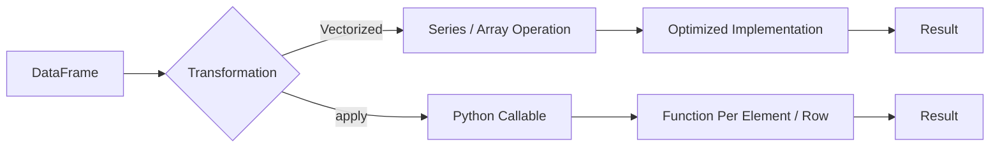
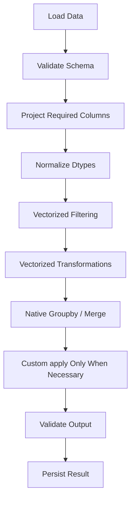

# 03- Apply Vs Vectorization

## Overview

`apply()` and vectorized operations can both transform Pandas data, but they have very different execution characteristics.

The central distinction is:

```text
Vectorization
    ↓
operate on entire Series / arrays
    ↓
optimized column-oriented execution

apply()
    ↓
call Python code for each element or row
    ↓
higher interpreter overhead
```

For production data processing, prefer native Pandas or NumPy operations when the transformation can be expressed clearly with them. Use `apply()` when the business logic genuinely cannot be represented efficiently with existing vectorized operations.

The important engineering question is not:

> "Is `apply()` bad?"

It is:

> "What execution model best represents this operation at this data volume?"

---

## Why the Distinction Matters

A transformation over:

```text
1,000 rows
```

may not expose meaningful performance differences.

The same transformation over:

```text
10 million rows
```

can become a significant CPU and latency bottleneck.

For backend and ETL workloads, inefficient row-level processing can increase:

```text
CPU time
memory pressure
container runtime
database connection duration
job latency
cloud cost
```

The impact becomes particularly important in scheduled pipelines, Kubernetes jobs, Celery workers, and batch processing systems.

---

## The Execution Models

A simplified comparison looks like this:



Vectorization minimizes Python-level iteration.

`apply()` explicitly introduces a callable into the transformation path.

---

## Vectorization

Vectorization expresses a computation against an entire Series or DataFrame.

```python
orders["total_amount"] = (
    orders["quantity"]
    * orders["unit_price"]
)
```

The operation applies to the entire columns.

Other common examples include:

```python
orders["is_large"] = (
    orders["amount"]
    .gt(10_000)
)

orders["normalized_email"] = (
    customers["email"]
    .str.strip()
    .str.lower()
)
```

Vectorized operations are generally the preferred implementation for ordinary tabular transformations.

---

## Why Vectorization Is Usually Faster

Python function calls have overhead.

A row-oriented operation such as:

```python
orders.apply(
    lambda row:
        row["quantity"] * row["unit_price"],
    axis=1,
)
```

must repeatedly:

```text
construct/access row representation
invoke Python callable
perform Python-level operations
store result
```

A vectorized expression:

```python
orders["quantity"] * orders["unit_price"]
```

can delegate the underlying array operation to optimized implementations with substantially less Python-level dispatch.

The exact performance difference depends on:

```text
operation
dtype
Pandas version
NumPy version
dataset size
CPU architecture
memory bandwidth
```

Do not assume a fixed speedup.

---

## What `apply()` Does

`apply()` accepts a Python callable and applies it across a Series or DataFrame.

For a Series:

```python
orders["amount"].apply(
    classify_amount,
)
```

the callable is applied to individual values.

For a DataFrame with:

```python
axis=1
```

the callable is typically invoked for each row:

```python
orders.apply(
    calculate_total,
    axis=1,
)
```

This distinction is critical.

### Series `apply()`

```python
orders["amount"].apply(
    classify_amount,
)
```

Conceptually:

```text
value 1 → function
value 2 → function
value 3 → function
...
```

### DataFrame row-wise `apply()`

```python
orders.apply(
    calculate_total,
    axis=1,
)
```

Conceptually:

```text
row 1 → function
row 2 → function
row 3 → function
...
```

The second form is commonly the more expensive choice.

---

## Standard `apply()` Syntax

Series:

```python
result = series.apply(function)
```

DataFrame:

```python
result = dataframe.apply(
    function,
    axis=1,
)
```

Example:

```python
def classify_order(amount: float) -> str:
    if amount >= 50_000:
        return "critical"
    if amount >= 10_000:
        return "high"
    return "normal"


orders["risk"] = orders["amount"].apply(
    classify_order,
)
```

The code is readable and may be perfectly valid when no suitable built-in operation exists.

---

## A Typical Anti-Pattern

Suppose the requirement is:

```text
amount >= 10,000 → high
otherwise        → normal
```

A beginner might write:

```python
orders["priority"] = orders["amount"].apply(
    lambda amount:
        "high"
        if amount >= 10_000
        else "normal",
)
```

The logic is correct, but it introduces Python-level work for every value.

A vectorized alternative is:

```python
import numpy as np

orders["priority"] = np.where(
    orders["amount"].ge(10_000),
    "high",
    "normal",
)
```

For larger datasets, the vectorized form is usually preferable.

---

## Multiple Conditions

A more complex example:

```python
import numpy as np

conditions = [
    orders["amount"].ge(50_000),
    orders["amount"].ge(10_000),
    orders["amount"].ge(1_000),
]

choices = [
    "critical",
    "high",
    "normal",
]

orders["risk"] = np.select(
    conditions,
    choices,
    default="low",
)
```

This replaces:

```python
def classify_order(amount: float) -> str:
    if amount >= 50_000:
        return "critical"
    if amount >= 10_000:
        return "high"
    if amount >= 1_000:
        return "normal"
    return "low"


orders["risk"] = orders["amount"].apply(
    classify_order,
)
```

The vectorized version makes the rules explicit as column-level predicates.

---

## Arithmetic: Always Consider Vectorization First

Prefer:

```python
orders["subtotal"] = (
    orders["quantity"]
    * orders["unit_price"]
)

orders["tax"] = (
    orders["subtotal"]
    * orders["tax_rate"]
)

orders["total"] = (
    orders["subtotal"]
    + orders["tax"]
)
```

over:

```python
def calculate_total(row: pd.Series) -> float:
    subtotal = (
        row["quantity"]
        * row["unit_price"]
    )
    tax = subtotal * row["tax_rate"]
    return subtotal + tax


orders["total"] = orders.apply(
    calculate_total,
    axis=1,
)
```

The vectorized version is:

```text
shorter
clearer
more idiomatic
typically faster
easier to optimize
```

---

## Boolean Logic

Prefer vectorized boolean expressions:

```python
is_completed = (
    orders["status"]
    .eq("completed")
)

is_large = (
    orders["amount"]
    .gt(10_000)
)

filtered = orders.loc[
    is_completed & is_large
]
```

Avoid:

```python
filtered = orders.loc[
    orders.apply(
        lambda row:
            row["status"] == "completed"
            and row["amount"] > 10_000,
        axis=1,
    )
]
```

Vectorized boolean masks are one of the most important building blocks in efficient Pandas code.

---

## Membership Checks

Use `isin()`:

```python
supported_regions = {
    "IN",
    "SG",
    "AE",
}

orders = orders.loc[
    orders["region"].isin(
        supported_regions
    )
]
```

Instead of:

```python
orders = orders.loc[
    orders["region"].apply(
        lambda value:
            value in supported_regions,
    )
]
```

The built-in set-oriented operation is clearer and normally preferable.

---

## String Operations

Avoid `apply()` when a string accessor exists.

Instead of:

```python
customers["email"] = customers[
    "email"
].apply(
    lambda value:
        value.strip().lower()
)
```

prefer:

```python
customers["email"] = (
    customers["email"]
    .str.strip()
    .str.lower()
)
```

This communicates the intent directly and uses Pandas' string operation machinery.

---

## String Search

Instead of:

```python
logs["is_timeout"] = logs[
    "message"
].apply(
    lambda message:
        "timeout" in message.lower()
)
```

prefer:

```python
logs["is_timeout"] = (
    logs["message"]
    .str.contains(
        "timeout",
        case=False,
        regex=False,
        na=False,
    )
)
```

The `na=False` choice is important when messages may contain missing values.

---

## Datetime Operations

Instead of:

```python
events["event_hour"] = events[
    "event_time"
].apply(
    lambda value:
        value.hour
)
```

prefer:

```python
events["event_hour"] = (
    events["event_time"]
    .dt.hour
)
```

Likewise:

```python
events["event_date"] = (
    events["event_time"]
    .dt.date
)
```

Datetime accessors express the operation at the column level.

---

## `map()` Instead of `apply()` for Simple Mappings

Suppose country codes map to country names.

Prefer:

```python
country_names = {
    "IN": "India",
    "SG": "Singapore",
    "AE": "United Arab Emirates",
}

customers["country_name"] = (
    customers["country_code"]
    .map(country_names)
)
```

rather than:

```python
customers["country_name"] = (
    customers["country_code"]
    .apply(
        lambda code:
            country_names.get(
                code,
                "Unknown",
            )
    )
)
```

`map()` directly represents the lookup operation.

Handle missing mappings explicitly:

```python
customers["country_name"] = (
    customers["country_code"]
    .map(country_names)
    .fillna("Unknown")
)
```

---

## `replace()` Instead of `apply()`

For straightforward substitutions:

```python
orders["status"] = orders["status"].replace({
    "done": "completed",
    "cancelled_by_user": "cancelled",
})
```

This is preferable to:

```python
orders["status"] = orders["status"].apply(
    lambda status:
        {
            "done": "completed",
            "cancelled_by_user": "cancelled",
        }.get(status, status)
)
```

`replace()` directly expresses the intended transformation.

---

## `where()` and `mask()`

Conditional replacement can often avoid `apply()`.

Example:

```python
orders["amount"] = orders[
    "amount"
].where(
    orders["amount"].ge(0),
    other=pd.NA,
)
```

For masking:

```python
orders["status"] = orders[
    "status"
].mask(
    orders["status"].eq("unknown"),
    other=pd.NA,
)
```

These operations make conditional data manipulation explicit and column-oriented.

---

## GroupBy and `apply()`

Group-level `apply()` requires special attention.

Suppose the requirement is:

```text
for each customer:
    calculate total spend
```

Do not default to:

```python
result = orders.groupby(
    "customer_id"
).apply(
    calculate_customer_total,
)
```

Prefer a native aggregation:

```python
result = (
    orders
    .groupby(
        "customer_id",
        as_index=False,
    )
    .agg(
        total_spend=("amount", "sum"),
    )
)
```

Built-in aggregations are usually easier to reason about and optimize.

---

## GroupBy `transform()`

When the result must align with the original rows, `transform()` is often a better fit than group-level `apply()`.

Example:

```python
orders["customer_total"] = (
    orders
    .groupby("customer_id")["amount"]
    .transform("sum")
)

orders["customer_share"] = (
    orders["amount"]
    / orders["customer_total"]
)
```

This avoids manually rebuilding row alignment.

---

## When `apply()` Is Appropriate

`apply()` is useful when:

```text
the transformation is genuinely custom
no suitable vectorized operation exists
the function contains complex business rules
the data volume is small enough that performance is not material
clarity is improved without a practical performance concern
```

Example:

```python
def derive_compliance_status(row: pd.Series) -> str:
    if row["country"] == "US" and row["customer_type"] == "regulated":
        return "manual_review"

    if row["risk_score"] >= 90 and row["transaction_count"] > 20:
        return "enhanced_review"

    return "standard"


customers["compliance_status"] = customers.apply(
    derive_compliance_status,
    axis=1,
)
```

If this logic is stable and performance-sensitive, consider redesigning it into vectorized predicates.

---

## Converting Complex `apply()` Logic

Start with the business rules.

For example:

```python
def classify_customer(row: pd.Series) -> str:
    if row["revenue"] >= 1_000_000:
        return "enterprise"

    if (
        row["revenue"] >= 100_000
        and row["orders"] >= 50
    ):
        return "mid_market"

    return "standard"
```

Convert each decision into a vectorized predicate:

```python
conditions = [
    customers["revenue"].ge(1_000_000),
    (
        customers["revenue"].ge(100_000)
        & customers["orders"].ge(50)
    ),
]

choices = [
    "enterprise",
    "mid_market",
]

customers["segment"] = np.select(
    conditions,
    choices,
    default="standard",
)
```

This often produces a more explicit and maintainable rule set.

---

## Side Effects Are a Different Problem

A frequent mistake is using `apply()` to perform external operations.

Example:

```python
orders["customer_segment"] = (
    orders["customer_id"]
    .apply(fetch_customer_segment)
)
```

If `fetch_customer_segment()` performs an HTTP request, this is not merely a Pandas transformation.

It creates:

```text
one Python function call
→ one network request
→ one latency period
```

per row.

For one million rows, that could mean one million requests.

This is an architectural problem, not simply a Pandas performance problem.

---

## Better API Enrichment

Prefer:

```text
DataFrame
    ↓
extract unique IDs
    ↓
batch API requests
    ↓
reference DataFrame
    ↓
merge
    ↓
enriched DataFrame
```

Example:

```python
customer_ids = (
    orders["customer_id"]
    .dropna()
    .drop_duplicates()
    .tolist()
)

segments = fetch_customer_segments(
    customer_ids,
)

orders = orders.merge(
    segments,
    on="customer_id",
    how="left",
    validate="many_to_one",
)
```

This separates:

```text
I/O
```

from:

```text
tabular transformation
```

and usually reduces network overhead dramatically.

---

## Database Lookups

The same rule applies to PostgreSQL.

Avoid:

```python
orders["customer_name"] = (
    orders["customer_id"]
    .apply(
        fetch_customer_from_database
    )
)
```

This can generate an N+1 query pattern:

```text
1 DataFrame
→ N database queries
```

Prefer a single query or batched query:

```sql
SELECT
    customer_id,
    customer_name,
    segment
FROM customers
WHERE customer_id = ANY(%(customer_ids)s);
```

Load the result and join it:

```python
customers = pd.read_sql(
    customer_query,
    connection,
    params={
        "customer_ids": customer_ids,
    },
)

orders = orders.merge(
    customers,
    on="customer_id",
    how="left",
    validate="many_to_one",
)
```

The correct optimization is often to eliminate the repeated I/O rather than replacing one Pandas method with another.

---

## Missing Values and `apply()`

Consider:

```python
orders["amount"].apply(
    classify_amount,
)
```

What happens if `amount` contains missing values?

The function may not handle them.

For example:

```python
def classify_amount(
    amount: float | None,
) -> str:
    if pd.isna(amount):
        return "unknown"

    if amount >= 10_000:
        return "high"

    return "normal"
```

This makes missing-value semantics explicit.

A vectorized alternative may be:

```python
orders["risk"] = np.select(
    [
        orders["amount"].isna(),
        orders["amount"].ge(10_000),
    ],
    [
        "unknown",
        "high",
    ],
    default="normal",
)
```

The vectorized version makes null handling part of the transformation contract.

---

## Dtype Implications

`apply()` can sometimes produce a less predictable or less efficient result dtype, especially when the function returns mixed Python objects.

Example:

```python
result = orders["amount"].apply(
    custom_function,
)
```

If the function returns:

```text
float
None
string
custom object
```

the result may require a generic object representation.

Prefer consistent output types.

For example:

```python
def normalize_status(value: str | None) -> str:
    if value is None:
        return "unknown"

    return value.strip().lower()
```

Then inspect:

```python
print(
    orders["normalized_status"].dtype
)
```

Explicit dtype normalization after transformation may be appropriate.

---

## Index and Output Behavior

The output of `apply()` depends on what is being applied.

For a Series:

```python
result = orders["amount"].apply(
    classify_amount,
)
```

the result is normally a Series with the same index.

For a DataFrame:

```python
result = orders.apply(
    summarize_row,
    axis=1,
)
```

the resulting shape depends on what the callable returns.

A function returning a scalar generally produces a Series.

A function returning a Series can produce a DataFrame.

This flexibility is useful but can make complex `apply()` pipelines harder to reason about.

---

## Mutation Behavior

Do not mutate the source DataFrame from inside an `apply()` callable.

Avoid:

```python
def transform(row: pd.Series) -> str:
    row["status"] = "processed"
    return row["status"]
```

Instead, return the desired value:

```python
def transform(row: pd.Series) -> str:
    if row["amount"] > 10_000:
        return "priority"

    return "standard"
```

then assign:

```python
orders["priority"] = orders.apply(
    transform,
    axis=1,
)
```

Transformations should be explicit and side-effect free.

---

## `apply()` Versus Vectorization

| Consideration | Vectorization | `apply()` |
| --- | --- | --- |
| Python-level calls | Low | Higher |
| Typical scalability | Better | Worse |
| Simple arithmetic | Excellent | Unnecessary |
| Boolean logic | Excellent | Usually unnecessary |
| String operations | Prefer `.str` | Usually unnecessary |
| Datetime operations | Prefer `.dt` | Usually unnecessary |
| Lookup mapping | Prefer `.map()` | Usually unnecessary |
| Complex custom logic | Sometimes difficult | Often convenient |
| External I/O | Not directly applicable | Possible, but usually poor architecture |
| Readability | Usually high | High for genuinely custom logic |
| Memory efficiency | Often better | Depends on callable and result |

This table describes the default engineering trade-off, not an absolute rule.

---

## Performance Comparison

A representative benchmark might look like:

```python
from time import perf_counter

vectorized_start = perf_counter()

vectorized_result = (
    orders["quantity"]
    * orders["unit_price"]
)

vectorized_seconds = (
    perf_counter()
    - vectorized_start
)

apply_start = perf_counter()

apply_result = orders.apply(
    lambda row:
        row["quantity"] * row["unit_price"],
    axis=1,
)

apply_seconds = (
    perf_counter()
    - apply_start
)

print(
    {
        "vectorized_seconds": vectorized_seconds,
        "apply_seconds": apply_seconds,
    }
)
```

For a valid comparison, confirm both implementations produce equivalent results:

```python
pd.testing.assert_series_equal(
    vectorized_result.reset_index(drop=True),
    apply_result.reset_index(drop=True),
    check_names=False,
)
```

Benchmark representative data rather than relying on assumptions.

---

## Benchmark Design

Performance comparisons should consider:

```text
10K rows
100K rows
1M rows
10M rows
```

where those sizes reflect real workloads.

Also vary:

```text
null frequency
dtype
cardinality
string length
number of columns
group count
```

An optimization that wins at 10K rows may provide little benefit at 10M rows, or a different bottleneck may dominate entirely.

---

## Memory Considerations

Vectorization is not automatically zero-copy.

For example:

```python
orders["net_amount"] = (
    orders["amount"]
    - orders["discount"]
)
```

can require intermediate storage.

Likewise, `apply()` may allocate result objects and intermediate Python objects.

Measure:

```python
orders.memory_usage(
    deep=True,
)
```

when memory is a production concern.

The relevant metric is often:

```text
peak process memory
```

rather than the final result size.

---

## Performance at Small Data Volumes

For:

```text
100 rows
```

the runtime difference between `apply()` and vectorization may be irrelevant.

In such cases, a simple custom function may be reasonable:

```python
customers["classification"] = (
    customers["risk_score"]
    .apply(classify_risk)
)
```

Do not create unnecessary complexity solely to eliminate a few milliseconds.

Engineering optimization should consider:

```text
data volume
SLA
maintenance cost
frequency
operational impact
```

---

## Performance at Large Data Volumes

For:

```text
millions of rows
```

the choice becomes more consequential.

A row-wise `apply(axis=1)` can become the primary CPU bottleneck.

Optimization should usually proceed in this order:

```text
measure
→ identify expensive apply()
→ check built-in vectorized alternatives
→ reduce input rows/columns
→ normalize dtypes
→ eliminate repeated work
→ benchmark again
```

Only after local optimization should you consider larger architectural changes.

---

## Readability Versus Performance

Do not turn every transformation into a difficult expression merely to avoid `apply()`.

A maintainable vectorized implementation:

```python
conditions = [
    customers["revenue"].ge(1_000_000),
    (
        customers["revenue"].ge(100_000)
        & customers["orders"].ge(50)
    ),
]

customers["segment"] = np.select(
    conditions,
    [
        "enterprise",
        "mid_market",
    ],
    default="standard",
)
```

is better than a highly compressed expression that no engineer can safely modify.

Optimization must preserve maintainability.

---

## Avoid Overusing `np.vectorize`

`np.vectorize()` can look like a vectorization solution:

```python
vectorized_function = np.vectorize(
    classify_amount,
)

orders["risk"] = vectorized_function(
    orders["amount"],
)
```

However, `np.vectorize()` is primarily a convenience wrapper around Python-level function application. It should not be treated as equivalent to true native vectorized computation.

Use genuine Pandas/NumPy operations when available.

---

## `np.where()` Versus `np.select()`

Use `np.where()` for a simple binary condition:

```python
orders["priority"] = np.where(
    orders["amount"].gt(10_000),
    "high",
    "normal",
)
```

Use `np.select()` when multiple conditions are required:

```python
orders["priority"] = np.select(
    [
        orders["amount"].ge(50_000),
        orders["amount"].ge(10_000),
    ],
    [
        "critical",
        "high",
    ],
    default="normal",
)
```

This keeps the rule structure explicit.

---

## `map()` Versus `apply()`

Use `map()` for direct element mappings:

```python
orders["status_label"] = (
    orders["status"]
    .map(status_labels)
)
```

Use `apply()` for custom callable logic:

```python
orders["status_label"] = (
    orders["status"]
    .apply(normalize_status)
)
```

If the operation is fundamentally a lookup, `map()` communicates the intent better.

---

## Built-In Aggregations Versus `apply()`

Prefer:

```python
summary = (
    orders
    .groupby("customer_id")
    .agg(
        order_count=("order_id", "count"),
        total_revenue=("amount", "sum"),
        average_order=("amount", "mean"),
    )
)
```

over custom group-level functions when the requirements are standard aggregations.

Native operations are generally:

```text
simpler
faster
easier to test
easier to explain
```

---

## Production ETL Pattern

A good production transformation layer should resemble:



The intended role of `apply()` is narrow:

```text
native operation exists
    → use it

no suitable native operation
    → consider apply()

external side effect required
    → move side effect out of DataFrame transformation
```

This separation produces more predictable ETL performance.

---

## Backend Integration

### REST APIs

Do not use row-wise `apply()` for one-request-per-row enrichment.

Prefer:

```text
batch request
→ DataFrame
→ merge
```

### PostgreSQL

Avoid N+1 lookups through `apply()`.

Prefer:

```text
single query / batch query
→ DataFrame
→ merge
```

### Kafka

For event batches, vectorize normalization and enrichment after deserialization.

Do not perform expensive Python callbacks for every event unless the transformation genuinely requires custom logic.

### Celery

For large background jobs:

```text
load bounded batch
→ vectorized processing
→ persist
→ release memory
```

rather than passing entire unbounded DataFrames through long-lived workers.

### Kubernetes

Measure CPU and memory because row-wise `apply()` can increase:

```text
CPU saturation
pod runtime
autoscaling pressure
```

A performance regression can therefore become an infrastructure cost problem.

---

## Security Considerations

`apply()` should not execute dynamically constructed code.

Never transform untrusted input into executable Python expressions.

Avoid patterns such as:

```python
df.apply(
    lambda value:
        eval(value),
)
```

For external data:

```text
validate schema
normalize types
validate ranges
sanitize strings
```

before processing.

Vectorization improves performance, but it does not replace input validation or data-security controls.

---

## Common Mistakes

### Using `apply(axis=1)` for Arithmetic

Bad:

```python
df.apply(
    lambda row:
        row["a"] + row["b"],
    axis=1,
)
```

Better:

```python
df["result"] = (
    df["a"] + df["b"]
)
```

### Using `apply()` for Membership

Bad:

```python
df["country"].apply(
    lambda value:
        value in countries,
)
```

Better:

```python
df["country"].isin(countries)
```

### Using `apply()` for String Normalization

Bad:

```python
df["email"].apply(
    lambda value:
        value.strip().lower(),
)
```

Better:

```python
df["email"].str.strip().str.lower()
```

### Using `apply()` for Database Queries

This creates an N+1 query pattern.

Use a batch query and join.

### Using `apply()` for HTTP Requests

This creates row-level network I/O.

Use batched APIs or a separate asynchronous/queued workflow.

### Assuming `np.vectorize()` Provides Native Vectorization

It generally does not.

### Eliminating `apply()` Without Checking Semantics

A faster expression is not correct if it changes:

```text
null handling
precedence
ordering
precision
business rules
```

---

## Interview Traps

### "Is `apply()` Always Bad?"

No.

It is often appropriate for custom transformations that do not map naturally to built-in vectorized operations.

### "Is `apply()` Vectorized?"

No. A function passed to `apply()` is generally executed through Python-level callable invocation.

### "Is `apply(axis=1)` More Expensive?"

Usually, because row-wise processing introduces Python-level calls and row handling.

### "Can `apply()` Perform Side Effects?"

It can, but that is usually poor production architecture for external I/O.

### "Is `np.vectorize()` the Same as Vectorization?"

No. It is primarily a convenience mechanism for applying Python functions over arrays.

### "Should You Always Optimize `apply()`?"

No. Measure first. Optimization is worthwhile when the workload or SLA makes the cost material.

---

## Decision Framework

Use this decision tree:

```text
Can a built-in Pandas operation express the logic?
        │
       yes
        ↓
Use the built-in/vectorized operation
        │
       no
        ↓
Can NumPy express the logic cleanly?
        │
       yes
        ↓
Use NumPy
        │
       no
        ↓
Is this genuinely custom row/element logic?
        │
       yes
        ↓
Consider apply()
        │
        ↓
Does the function perform I/O or external side effects?
        │
       yes
        ↓
Move I/O outside Pandas and batch/queue it
```

This is a more useful engineering rule than simply saying:

```text
"Never use apply()."
```

---

## Practical Recommendation

For every `apply()` found in production code, ask:

```text
1. Is there a Pandas method that expresses this directly?
2. Is there a NumPy operation that expresses it more efficiently?
3. Can the logic be written with boolean masks?
4. Can it use map(), replace(), where(), or mask()?
5. Can groupby().agg() or transform() replace it?
6. Is the function performing external I/O?
7. Is the row count large enough for the difference to matter?
8. Have equivalent implementations been benchmarked?
9. Are null and invalid-value semantics preserved?
10. Is the resulting code still maintainable?
```

This process provides a practical path from correct code to production-quality code.

---

## Key Takeaways

- Prefer native Pandas and NumPy operations for arithmetic, boolean logic, strings, datetimes, mappings, grouping, and other operations that naturally support column-level execution.
- `apply()` is appropriate for genuinely custom Python logic, but `DataFrame.apply(axis=1)` is usually expensive at scale because it introduces Python-level row processing.
- Never use `apply()` as a convenient substitute for batched database or HTTP operations; separate external I/O from DataFrame transformations and use joins or batch APIs.
- `map()`, `replace()`, `where()`, `mask()`, `np.where()`, `np.select()`, `groupby().agg()`, and `transform()` often provide better alternatives to custom `apply()` functions.
- Optimize only after measuring, and preserve null handling, dtype expectations, business semantics, and maintainability while replacing or retaining `apply()`.