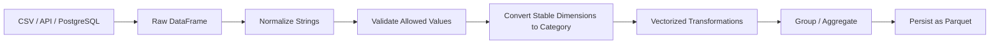

# 05- Categorical Dtype

## Overview

Pandas `category` is a specialized dtype for columns whose values come from a relatively small, reusable set of categories.

Typical examples include:

```text
status
region
country
department
payment_method
event_type
priority
```

Instead of storing the complete string value repeatedly for every row, categorical data separates:

```text
category definitions
+
integer-like category codes
```

Conceptually:

```text
"completed" → code 0
"pending"   → code 1
"failed"    → code 2
```

A million rows can then reference a small category dictionary rather than independently storing repeated values.

This can reduce memory consumption and can improve some operations such as grouping, comparisons, and sorting. The benefit depends strongly on cardinality, workload, and the underlying data representation.

The engineering goal is not:

> Convert every string column to `category`.

The correct goal is:

> Use categorical dtype when the column has stable categorical semantics and the measured memory or processing benefit justifies it.

---

## What Categorical Dtype Is

A categorical Series contains:

```text
categories
codes
ordered flag
```

Example:

```python
orders["status"] = orders["status"].astype(
    "category"
)
```

Inspect the dtype:

```python
print(orders["status"].dtype)
```

Result:

```text
category
```

Inspect categories:

```python
print(
    orders["status"].cat.categories
)
```

Inspect the integer-like codes:

```python
print(
    orders["status"].cat.codes
)
```

The codes are an implementation detail exposed for inspection. Application logic should generally operate through category values rather than manipulating codes directly.

---

## Why Categorical Dtype Exists

Repeated strings can be expensive to store.

Consider:

```text
10 million rows
status = completed
```

If the same small set of status strings is repeated across a large DataFrame, storing equivalent categorical values can be more efficient.

Categorical dtype is useful because it can:

```text
reduce repeated-value storage
represent a finite domain explicitly
support ordered categories
improve some grouping/sorting operations
make domain constraints more visible
```

It is particularly useful in analytical and ETL workloads.

---

## Basic Example

```python
import pandas as pd

orders = pd.DataFrame(
    {
        "order_id": [101, 102, 103, 104],
        "status": [
            "completed",
            "pending",
            "completed",
            "failed",
        ],
    }
)

orders["status"] = (
    orders["status"]
    .astype("category")
)

print(orders.dtypes)
```

Conceptually:

```text
categories:
completed
failed
pending

rows:
completed → code
pending   → code
completed → code
failed    → code
```

The visible values remain:

```text
completed
pending
completed
failed
```

but the internal representation is categorical.

---

## Inspecting Categories

Use the `.cat` accessor:

```python
status = orders["status"]

print(status.cat.categories)
print(status.cat.codes)
```

Useful attributes include:

```python
status.cat.categories
status.cat.ordered
status.cat.codes
```

For production code, do not use category codes as durable identifiers.

Category codes can change when categories are reordered, removed, or reconstructed.

---

## Category Codes Are Not Business IDs

Avoid:

```python
orders["status_code"] = (
    orders["status"].cat.codes
)
```

and then persisting those codes as if they were stable database identifiers.

For example:

```text
completed → 0
failed    → 1
pending   → 2
```

may later become:

```text
completed → 1
failed    → 0
pending   → 2
```

depending on category ordering.

If the system needs durable status codes, define an explicit business mapping:

```python
status_codes = {
    "pending": 10,
    "completed": 20,
    "failed": 30,
}
```

Category codes are representation details, not domain identifiers.

---

## Cardinality

The most important factor when evaluating `category` is cardinality.

Cardinality is the number of distinct values in the column.

Example:

```python
unique_values = orders["status"].nunique(
    dropna=False,
)

row_count = len(orders)

ratio = unique_values / row_count

print(unique_values)
print(ratio)
```

A column with:

```text
10 million rows
4 unique statuses
```

has very low cardinality.

A column with:

```text
10 million rows
9.5 million unique values
```

has very high cardinality.

Categorical dtype is generally most attractive when cardinality is low relative to the number of rows.

---

## Good Candidates

Typical candidates include:

| Column | Category candidate? | Reason |
| --- | --- | --- |
| `status` | Yes | Small stable set |
| `region` | Yes | Repeated dimension |
| `country_code` | Usually | Finite domain |
| `payment_method` | Usually | Limited values |
| `event_type` | Usually | Finite event taxonomy |
| `department` | Usually | Repeated organizational dimension |
| `request_id` | Usually no | Very high cardinality |
| `email` | Usually no | High cardinality |
| `transaction_id` | Usually no | Near-unique |
| `free_text` | No | Unbounded values |

These are heuristics rather than absolute rules.

---

## High-Cardinality Columns

Do not blindly convert unique identifiers:

```python
events["request_id"] = (
    events["request_id"]
    .astype("category")
)
```

When almost every value is unique, the category dictionary becomes large and the memory benefit may disappear.

Category management can also introduce overhead.

Measure first:

```python
before = (
    events["request_id"]
    .memory_usage(deep=True)
)

after = (
    events["request_id"]
    .astype("category")
    .memory_usage(deep=True)
)

print(
    {
        "before_bytes": before,
        "after_bytes": after,
    }
)
```

---

## Measuring Memory Savings

Always measure the actual column.

```python
status = orders["status"]

before = status.memory_usage(
    deep=True,
)

category = status.astype(
    "category"
)

after = category.memory_usage(
    deep=True,
)

print(
    f"Before: {before / 1024**2:.2f} MB"
)

print(
    f"After:  {after / 1024**2:.2f} MB"
)

print(
    f"Saved: {(before - after) / 1024**2:.2f} MB"
)
```

The benefit is workload-dependent.

For small DataFrames, the difference may be irrelevant.

For large datasets, repeated categorical columns can materially reduce memory usage.

---

## Category Conversion Cost

Converting to category is itself work:

```python
orders["status"] = (
    orders["status"]
    .astype("category")
)
```

The conversion may involve:

```text
scanning values
building category definitions
assigning codes
allocating category structures
```

Therefore, category conversion is particularly valuable when the resulting Series is:

```text
large
reused repeatedly
grouped frequently
sorted frequently
persisted efficiently
```

For a tiny one-off DataFrame, the conversion may not be worth the additional complexity.

---

## Explicit Categories

You can define an explicit domain using `CategoricalDtype`.

```python
from pandas.api.types import CategoricalDtype

status_dtype = CategoricalDtype(
    categories=[
        "pending",
        "processing",
        "completed",
        "failed",
    ],
)

orders["status"] = (
    orders["status"]
    .astype(status_dtype)
)
```

This is useful when the valid domain is known in advance.

For example:

```text
pending
processing
completed
failed
```

are a business-defined state machine rather than arbitrary strings.

---

## Why Explicit Categories Matter

An inferred categorical column contains categories based on the values currently present.

Suppose the batch contains only:

```text
completed
pending
```

but the production contract allows:

```text
pending
processing
completed
failed
cancelled
```

An explicit categorical dtype can preserve the full domain:

```python
status_dtype = CategoricalDtype(
    categories=[
        "pending",
        "processing",
        "completed",
        "failed",
        "cancelled",
    ],
)

orders["status"] = (
    orders["status"]
    .astype(status_dtype)
)
```

This makes schema semantics more explicit.

---

## Unknown Categories

When assigning a value not present in the category set, Pandas represents it as missing rather than silently expanding the category set.

Example:

```python
status_dtype = CategoricalDtype(
    categories=[
        "pending",
        "completed",
    ],
)

orders["status"] = (
    orders["status"]
    .astype(status_dtype)
)
```

If the source contains:

```text
cancelled
```

the converted value becomes missing.

This behavior is valuable for data-quality enforcement, but it must be monitored.

Otherwise, invalid source values can become apparent as nulls rather than explicit exceptions.

---

## Detecting Unknown Categories

After conversion:

```python
invalid_statuses = orders.loc[
    orders["status"].isna(),
    "raw_status",
]
```

You can validate:

```python
if invalid_statuses.notna().any():
    raise ValueError(
        "Input contains unsupported statuses"
    )
```

Keep the original raw value when validation matters:

```python
orders["raw_status"] = (
    orders["status"]
    .astype("string")
)

orders["status"] = (
    orders["raw_status"]
    .astype(status_dtype)
)
```

This allows invalid source values to be diagnosed rather than discarded.

---

## Ordered Categories

Categories can be ordered.

Example:

```text
low < medium < high < critical
```

Define the order explicitly:

```python
priority_dtype = CategoricalDtype(
    categories=[
        "low",
        "medium",
        "high",
        "critical",
    ],
    ordered=True,
)

orders["priority"] = (
    orders["priority"]
    .astype(priority_dtype)
)
```

Now sorting respects the domain order.

```python
sorted_orders = orders.sort_values(
    "priority"
)
```

This is different from lexical string ordering.

---

## Lexical Ordering Versus Business Ordering

String sorting might produce:

```text
critical
high
low
medium
```

which is not the intended business order.

An ordered categorical dtype provides:

```text
low
medium
high
critical
```

This is particularly useful for:

```text
priority
risk levels
severity
lifecycle stages
service tiers
```

When ordering has business meaning, encode it explicitly rather than relying on string ordering.

---

## Reordering Categories

Categories can be reordered:

```python
orders["priority"] = (
    orders["priority"]
    .cat.reorder_categories(
        [
            "low",
            "medium",
            "high",
            "critical",
        ],
        ordered=True,
    )
)
```

This changes category ordering, not the underlying business values.

Be explicit about the intended ordering so that sorting and comparisons remain predictable.

---

## Renaming Categories

You can rename category labels:

```python
orders["status"] = (
    orders["status"]
    .cat.rename_categories({
        "completed": "Complete",
        "failed": "Failed",
    })
)
```

Use this carefully in production.

Renaming category values can affect:

```text
reports
joins
filters
downstream schemas
serialization
```

Normalize business labels at a well-defined pipeline boundary instead of changing categories opportunistically.

---

## Adding Categories

New categories can be added explicitly:

```python
orders["status"] = (
    orders["status"]
    .cat.add_categories([
        "cancelled",
    ])
)
```

This is useful when the domain expands.

For production systems, however, category definitions should generally come from an explicit schema or configuration rather than being changed ad hoc throughout the pipeline.

---

## Removing Categories

Unused categories can remain defined.

Remove them when appropriate:

```python
orders["status"] = (
    orders["status"]
    .cat.remove_unused_categories()
)
```

This can be useful after filtering:

```python
completed = orders.loc[
    orders["status"].eq("completed")
].copy()

completed["status"] = (
    completed["status"]
    .cat.remove_unused_categories()
)
```

The operation can reduce category metadata when the resulting DataFrame contains only a subset of the original category domain.

---

## Missing Values

Categorical columns support missing values:

```python
orders["status"] = (
    orders["status"]
    .astype("category")
)
```

Missing values remain distinct from valid categories.

For example:

```text
completed
pending
<missing>
failed
```

A missing value does not automatically become a category.

Inspect:

```python
print(
    orders["status"].isna().sum()
)
```

and treat null handling as part of the business contract.

---

## Adding Missing as a Category

If the business domain explicitly requires a category such as:

```text
unknown
```

add it intentionally:

```python
orders["status"] = (
    orders["status"]
    .cat.add_categories(["unknown"])
    .fillna("unknown")
)
```

This is different from leaving values as missing.

Choose based on semantics:

```text
missing → source did not provide a value
unknown → value was evaluated but could not be classified
```

Do not conflate the two.

---

## GroupBy with Categorical Columns

Categorical data can be useful for grouped analysis.

```python
regional_revenue = (
    orders
    .groupby(
        "region",
        observed=True,
    )["amount"]
    .sum()
)
```

`observed=True` is important when grouping by categorical columns and you want groups observed in the data rather than all possible category combinations.

This is particularly relevant when the category domain is broader than the values present in a particular batch.

---

## GroupBy Behavior

Suppose the category definition is:

```text
IN
SG
AE
US
GB
```

but the current batch contains:

```text
IN
SG
```

Without careful grouped-output semantics, you may get results that account for unobserved categories.

For production reporting, always define whether the output should contain:

```text
observed values only
```

or:

```text
the complete category domain
```

Do not assume the desired reporting behavior.

---

## Category and Filtering

Filtering works naturally:

```python
completed = orders.loc[
    orders["status"].eq("completed")
]
```

Category semantics remain intact.

For a reusable filtered DataFrame:

```python
completed = orders.loc[
    orders["status"].eq("completed")
].copy()
```

You can then remove unused categories if appropriate:

```python
completed["status"] = (
    completed["status"]
    .cat.remove_unused_categories()
)
```

Do not remove unused categories if the complete domain must be preserved for downstream reporting.

---

## Category and Sorting

For unordered categories, sorting follows category order rather than ordinary lexical string order only when the category order has been defined appropriately.

For ordered categories:

```python
orders = orders.sort_values(
    "priority"
)
```

can directly implement a business-defined severity sequence.

This is useful for reports where:

```text
critical
high
medium
low
```

must consistently appear in a specific order.

---

## Category and Comparisons

Ordered categories support meaningful relational comparisons:

```python
orders["priority"].ge(
    "high"
)
```

when the category is ordered.

This allows expressions such as:

```python
high_priority = orders.loc[
    orders["priority"].ge("high")
]
```

Without an ordered categorical domain, relational comparisons between categorical values are more restricted.

Do not define ordering merely to enable comparisons unless the ordering has genuine business meaning.

---

## Category and Memory Layout

Conceptually, categorical storage consists of:

```text
category values
       ↓
unique category dictionary

row values
       ↓
integer-like codes
```

For example:

```text
categories:
0 → completed
1 → pending
2 → failed

rows:
0
1
0
2
```

The exact internal representation can vary by Pandas implementation and version, but the important engineering property is that repeated values can share a compact categorical representation.

---

## Category and Performance

Categorical dtype can improve performance for some workloads involving:

```text
groupby
sorting
comparisons
factorization
repeated categorical processing
```

The actual benefit varies.

Performance depends on:

```text
cardinality
row count
operation
dtype
category distribution
hardware
Pandas version
```

Benchmark representative workloads when category conversion is being introduced specifically for performance.

---

## Category Is Not a Universal Speed Optimization

Do not write:

```python
for column in df.select_dtypes(
    include="object"
).columns:
    df[column] = (
        df[column]
        .astype("category")
    )
```

and assume the DataFrame is now optimized.

Some columns:

```text
are high cardinality
are free-form text
change categories frequently
are better represented as string
```

and should remain in another dtype.

Performance engineering is selective, not mechanical.

---

## Category and Joins

Categorical columns can participate in joins, but the category definitions matter.

Consider:

```python
orders["status"] = (
    orders["status"]
    .astype("category")
)

customers["status"] = (
    customers["status"]
    .astype("category")
)
```

If two categorical columns have different category definitions, Pandas may need to reconcile them rather than benefiting from a shared categorical representation.

For join keys, prioritize:

```text
logical compatibility
schema consistency
correctness
```

over category optimization.

Identifiers are generally not good candidates for categorical dtype merely because they are strings.

---

## Category and Concatenation

Concatenating categorical Series requires compatible category semantics.

For example:

```python
jan["status"] = (
    jan["status"]
    .astype(status_dtype)
)

feb["status"] = (
    feb["status"]
    .astype(status_dtype)
)

combined = pd.concat(
    [jan, feb],
    ignore_index=True,
)
```

Using the same explicit categorical dtype helps preserve consistent schema behavior.

If separate datasets infer categories independently, category sets can differ.

Production pipelines should define shared categorical domains when consistent schema matters.

---

## Category and Parquet

Categorical data can work well with columnar storage.

Example:

```python
orders.to_parquet(
    "orders.parquet",
    index=False,
)
```

and:

```python
orders = pd.read_parquet(
    "orders.parquet",
)
```

Parquet is a natural fit for analytical pipelines because it preserves rich columnar type information and supports efficient column-oriented storage.

Verify the resulting dtype after read/write when schema preservation is a contractual requirement.

---

## Category and CSV

CSV does not preserve rich categorical metadata in the same way as typed columnar formats.

For example:

```python
orders.to_csv(
    "orders.csv",
    index=False,
)
```

followed by:

```python
orders = pd.read_csv(
    "orders.csv",
)
```

may require dtype reconstruction.

For production pipelines that depend on explicit category domains, prefer:

```text
Parquet
or
explicit schema restoration during CSV ingestion
```

rather than relying on CSV to preserve categorical metadata.

---

## Category in ETL Pipelines

A production ETL flow can use categories like this:



The important ordering is:

```text
normalize
→ validate
→ categorize
```

Do not convert malformed values into categories before understanding the input quality.

---

## Category at Ingestion

For CSV input, you can establish categorical fields using `dtype`:

```python
orders = pd.read_csv(
    "orders.csv",
    dtype={
        "status": "category",
        "region": "category",
    },
)
```

For strict domains, explicit `CategoricalDtype` can provide better control:

```python
status_dtype = CategoricalDtype(
    categories=[
        "pending",
        "processing",
        "completed",
        "failed",
    ],
)

orders = pd.read_csv(
    "orders.csv",
)

orders["status"] = (
    orders["status"]
    .astype(status_dtype)
)
```

The second pattern is useful when allowed values are part of a controlled business schema.

---

## Category in API Pipelines

API responses frequently contain repeated dimensions:

```json
{
  "status": "completed",
  "region": "IN",
  "payment_method": "card"
}
```

After loading:

```python
orders = pd.DataFrame(
    api_response,
)

for column in [
    "status",
    "region",
    "payment_method",
]:
    orders[column] = (
        orders[column]
        .astype("category")
    )
```

Apply this only where those fields have:

```text
stable domains
high repetition
meaningful reuse
```

For large API batches, this can reduce the working-set size.

---

## Category in Reporting

Categorical data is particularly useful for reporting dimensions.

Example:

```python
orders["region"] = (
    orders["region"]
    .astype("category")
)

report = (
    orders
    .groupby(
        "region",
        observed=True,
        as_index=False,
    )
    .agg(
        order_count=("order_id", "count"),
        revenue=("amount", "sum"),
    )
)
```

This creates a predictable analytical dimension while reducing repeated storage for highly repetitive values.

---

## Category Schema Contracts

For production pipelines, define categorical domains centrally.

Example:

```python
STATUS_VALUES = [
    "pending",
    "processing",
    "completed",
    "failed",
]

PAYMENT_METHOD_VALUES = [
    "card",
    "bank_transfer",
    "wallet",
]
```

Then create dtypes:

```python
status_dtype = CategoricalDtype(
    categories=STATUS_VALUES,
)

payment_method_dtype = CategoricalDtype(
    categories=PAYMENT_METHOD_VALUES,
)
```

This avoids different pipeline stages silently inferring different category sets.

---

## Configuration-Driven Categories

For larger systems, domains can be configuration-backed:

```yaml
status:
  - pending
  - processing
  - completed
  - failed

payment_method:
  - card
  - bank_transfer
  - wallet
```

Python can load the configuration and construct `CategoricalDtype`.

This is useful when:

```text
business dimensions change
multiple pipelines share the same taxonomy
ETL jobs run independently
schema consistency matters
```

The category configuration should be versioned alongside the pipeline contract.

---

## Schema Evolution

Category domains can evolve:

```text
pending
processing
completed
failed
```

may become:

```text
pending
processing
completed
failed
cancelled
refunded
```

A production pipeline should define how new values are handled:

```text
reject
quarantine
map to unknown
extend category set
```

Do not silently convert newly introduced production values into missing values without monitoring.

---

## Category and Data Validation

Categories can be used as part of validation.

Example:

```python
allowed_statuses = {
    "pending",
    "processing",
    "completed",
    "failed",
}

invalid = (
    orders["status"]
    .dropna()
    .loc[
        ~orders["status"]
        .isin(allowed_statuses)
    ]
)

if not invalid.empty:
    raise ValueError(
        "Unsupported status values detected"
    )
```

Only after validation:

```python
orders["status"] = (
    orders["status"]
    .astype(status_dtype)
)
```

This makes the pipeline failure mode explicit.

---

## Null and Empty DataFrames

Category operations should preserve expected schemas for empty batches.

Example:

```python
status_dtype = CategoricalDtype(
    categories=[
        "pending",
        "completed",
        "failed",
    ],
)

empty_orders = pd.DataFrame({
    "order_id": pd.Series(
        dtype="string",
    ),
    "status": pd.Series(
        dtype=status_dtype,
    ),
})
```

This is useful for batch pipelines where downstream consumers expect a stable schema even when a batch contains zero rows.

---

## Common Mistakes

### Converting Every String to Category

Not every string column has low cardinality.

Evaluate:

```text
cardinality
memory usage
workload
semantic stability
```

before conversion.

### Categorizing Unique IDs

UUIDs, transaction IDs, and request IDs are usually poor candidates.

### Treating Category Codes as Stable IDs

Codes can change. They are not domain identifiers.

### Ignoring Unknown Values

Explicit categorical domains can turn unsupported values into missing values.

Validate the raw input.

### Using Ordered Categories Without Business Meaning

Do not invent an arbitrary order merely because it enables comparisons.

### Assuming Categories Persist Through CSV

CSV does not provide rich categorical schema metadata.

### Ignoring Category Compatibility

Different category definitions across DataFrames can affect concatenation and joins.

### Removing Unused Categories Too Early

This can destroy a complete category domain needed by downstream reporting.

### Using Category on Tiny DataFrames

The optimization may provide negligible value.

---

## Performance Optimization Workflow

A disciplined approach is:

```text
Inspect
  ↓
Measure cardinality
  ↓
Measure memory
  ↓
Identify repeated dimensions
  ↓
Choose category candidates
  ↓
Define business category domains
  ↓
Validate source values
  ↓
Convert
  ↓
Benchmark workload
  ↓
Monitor production behavior
```

This prevents category usage from becoming a blanket optimization rule.

---

## Measuring Cardinality at Scale

For large datasets, compute the metrics needed to decide whether category conversion is justified:

```python
candidate_columns = [
    "status",
    "region",
    "payment_method",
    "event_type",
]

for column in candidate_columns:
    unique_count = orders[column].nunique(
        dropna=False,
    )

    row_count = len(orders)

    print(
        {
            "column": column,
            "rows": row_count,
            "unique": unique_count,
            "ratio": (
                unique_count / row_count
                if row_count
                else 0
            ),
        }
    )
```

Do not treat a specific ratio as a universal cutoff.

Use the ratio as one signal among:

```text
memory savings
processing frequency
workload behavior
schema stability
```

---

## Monitoring Category Quality

Production metrics can include:

```text
unknown category count
null category count
category cardinality
rows per category
category-domain changes
memory usage
groupby duration
```

For example:

```python
unknown_count = (
    orders["status"]
    .isna()
    .sum()
)

logger.info(
    "status_category_quality",
    extra={
        "unknown_count": int(
            unknown_count
        ),
        "category_count": len(
            orders["status"]
            .cat.categories
        ),
    },
)
```

Do not log complete categorical datasets when they may contain sensitive information.

---

## Interview Questions

### Why Can `category` Save Memory?

Because repeated values can share a category dictionary while rows reference categories through compact codes rather than storing each repeated value independently.

### Should Every String Column Be Categorical?

No. High-cardinality, free-form, or rapidly changing values may not benefit.

### Are Category Codes Stable IDs?

No. Codes depend on category representation and ordering.

### When Is Ordered Category Useful?

When the values have genuine domain ordering, such as:

```text
low < medium < high
```

### What Happens to Unknown Values with an Explicit Category Domain?

Values outside the defined category set can become missing during conversion and should be validated deliberately.

### Why Is `observed=True` Useful with Categorical GroupBy?

It restricts grouped results to category combinations actually observed in the data rather than unnecessarily materializing unobserved category combinations.

---

## Production Recommendations

Use categorical dtype when all or most of the following are true:

```text
[ ] Values form a stable finite domain
[ ] Cardinality is low relative to row count
[ ] Values repeat frequently
[ ] The column is large enough for memory savings to matter
[ ] The column is used repeatedly in grouping/sorting/filtering
[ ] Business semantics support categorical treatment
[ ] Unknown values have an explicit validation strategy
[ ] Downstream systems can handle the resulting dtype
```

Avoid categorical dtype when:

```text
[ ] Values are almost all unique
[ ] The column contains free-form text
[ ] Category definitions change constantly
[ ] Dtype conversion costs more than the workload benefits
[ ] Downstream interoperability requires another representation
```

## Key Takeaways

- `category` is best suited to stable, low-cardinality domains such as status, region, event type, and payment method; it is not a universal optimization for every string column.
- Categorical storage separates category definitions from row-level values, which can substantially reduce memory usage for large, repetitive columns and may improve some grouping, sorting, and comparison workloads.
- Treat category codes as internal representation details, never as durable business identifiers or database keys.
- Explicit `CategoricalDtype` definitions are valuable for production ETL because they make allowed domains, ordering, unknown-value handling, and schema evolution explicit.
- Optimize categoricals through measurement: compare memory and workload performance, validate category domains, monitor unknown/null values, and verify behavior across joins, concatenation, reporting, and storage formats such as Parquet.