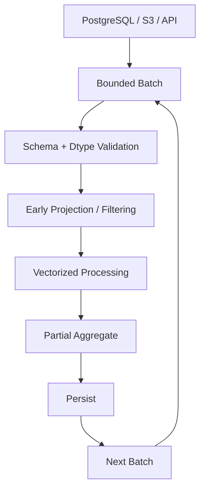

# 06- Memory Usage

## Overview

Memory usage is one of the most important operational constraints when processing large datasets with Pandas.

A DataFrame may appear small based on:

```text
row count
```

while consuming substantial memory because of:

```text
column count
dtype choices
Python objects
strings
temporary arrays
joins
copies
intermediate DataFrames
```

For production systems, the important metric is usually **peak process memory**, not only the memory footprint of the final DataFrame.

A useful model is:

```text
Input
  ↓
Parsing
  ↓
Initial DataFrame
  ↓
Filtering / Transformation
  ↓
Temporary allocations
  ↓
Joins / Aggregations
  ↓
Final DataFrame
```

At each stage, memory can temporarily increase.

A robust memory strategy is:

```text
measure
→ reduce input
→ select efficient dtypes
→ eliminate unnecessary copies
→ control intermediates
→ chunk large inputs
→ persist efficient formats
→ monitor peak usage
```

Memory optimization should preserve:

```text
correctness
schema semantics
precision
maintainability
```

---

## Why Memory Usage Matters

Pandas is primarily an in-memory processing library.

If a process needs more memory than the host or container can provide, the workload can fail regardless of CPU performance.

For example:

```text
DataFrame:        6 GB
Temporary join:   3 GB
Python runtime:   0.5 GB
Other objects:    1 GB
```

A container with:

```text
8 GB memory limit
```

can still be terminated because peak usage exceeds the limit.

This is especially relevant for:

```text
Docker containers
Kubernetes Jobs
Celery workers
AWS Batch
scheduled ETL jobs
CI/CD data-processing tasks
```

---

## Memory Terminology

Several terms are useful when diagnosing Pandas workloads.

| Term | Meaning |
| --- | --- |
| DataFrame memory | Memory attributed to DataFrame columns and index |
| Resident Set Size (RSS) | Physical memory currently used by the process |
| Peak RSS | Highest process memory observed during execution |
| Virtual memory | Address space reserved by the process |
| Temporary allocation | Short-lived memory created during an operation |
| Working set | Data and structures actively needed during processing |

`DataFrame.memory_usage()` does not represent the complete memory footprint of the Python process.

A production investigation should therefore measure both:

```text
DataFrame-level memory
+
process-level memory
```

---

## Inspecting DataFrame Memory

Use:

```python
memory_by_column = orders.memory_usage(
    index=True,
    deep=True,
)

print(memory_by_column)

total_bytes = memory_by_column.sum()

print(
    f"Total DataFrame memory: "
    f"{total_bytes / 1024**2:.2f} MB"
)
```

The output identifies which columns contribute most to memory usage.

Example:

```text
Index          128
order_id       80000000
customer_id    80000000
status         650000000
message        2400000000
amount         80000000
```

Optimization should focus on the largest contributors first.

---

## Why `deep=True` Matters

For simple numeric arrays, shallow memory accounting is often sufficient.

For object-backed values, the DataFrame may contain references to Python objects whose memory is not fully represented by a shallow estimate.

Use:

```python
orders.memory_usage(
    deep=True,
)
```

when examining:

```text
object
string-heavy
mixed Python-object
```

columns.

Without deep inspection, memory usage can be significantly underestimated.

---

## Measuring the Entire Process

Use process-level metrics when the workload is production-sensitive.

Example with `psutil`:

```python
import os

import psutil


process = psutil.Process(os.getpid())

memory_bytes = (
    process.memory_info().rss
)

memory_mb = (
    memory_bytes / 1024**2
)

print(
    f"Process RSS: {memory_mb:.2f} MB"
)
```

Measure before and after expensive stages:

```python
def log_memory(label: str) -> None:
    process = psutil.Process()

    rss_mb = (
        process.memory_info().rss
        / 1024**2
    )

    print(
        f"{label}: {rss_mb:.2f} MB RSS"
    )
```

Then:

```python
log_memory("before load")

orders = pd.read_parquet(
    "orders.parquet",
)

log_memory("after load")

orders = orders[
    [
        "customer_id",
        "amount",
        "status",
    ]
]

log_memory("after projection")
```

This identifies where memory increases in the actual process.

---

## Column-Level Profiling

Sort memory usage to identify high-value optimization targets:

```python
memory_by_column = (
    orders
    .memory_usage(
        deep=True,
    )
    .sort_values(
        ascending=False,
    )
)

print(memory_by_column)
```

A common production result might look conceptually like:

```text
raw_payload       3.2 GB
message           1.8 GB
metadata          900 MB
status            700 MB
customer_id       80 MB
quantity          80 MB
```

Changing `quantity` from `int64` to `int32` might save relatively little.

Removing or projecting unnecessary payload columns could save gigabytes.

---

## Memory Contributors

Common sources of high Pandas memory usage include:

```text
large object/string columns
wide DataFrames
unnecessary columns
unnecessarily wide numeric dtypes
duplicated DataFrames
join results
sort operations
groupby intermediates
temporary arrays
full-table copies
```

A useful diagnostic question is:

> What is the largest object alive at the point of peak memory?

That often leads to the real optimization.

---

## Memory and Dtypes

Dtype selection can have a major impact.

Example:

```python
orders["quantity"] = pd.to_numeric(
    orders["quantity"],
    downcast="integer",
)
```

For repeated low-cardinality strings:

```python
orders["status"] = (
    orders["status"]
    .astype("category")
)
```

For strings with explicit semantics:

```python
orders["customer_id"] = (
    orders["customer_id"]
    .astype("string")
)
```

Do not optimize dtype blindly.

Always consider:

```text
value range
precision
nullability
cardinality
business meaning
downstream compatibility
```

---

## Object Dtype and Memory

Generic `object` columns can consume significant memory because they may reference individual Python objects.

For example:

```python
orders["status"].dtype
```

may return:

```text
object
```

even when the column contains repeated strings.

If the domain is stable and low-cardinality:

```python
orders["status"] = (
    orders["status"]
    .astype("category")
)
```

may substantially reduce memory.

For general text:

```python
orders["description"] = (
    orders["description"]
    .astype("string")
)
```

may provide clearer semantics, though actual memory usage should still be measured.

---

## Categorical Memory Optimization

Categorical dtype is particularly useful for repeated dimension values:

```python
categorical_columns = [
    "status",
    "region",
    "payment_method",
]

for column in categorical_columns:
    orders[column] = (
        orders[column]
        .astype("category")
    )
```

Evaluate:

```text
cardinality
row count
memory before
memory after
```

High-cardinality identifiers are usually poor candidates:

```text
request_id
transaction_id
UUID
email
```

---

## Numeric Downcasting

For suitable numeric columns:

```python
for column in [
    "quantity",
    "customer_age",
]:
    orders[column] = pd.to_numeric(
        orders[column],
        downcast="integer",
    )
```

For approximate floating-point values:

```python
orders["utilization"] = pd.to_numeric(
    orders["utilization"],
    downcast="float",
)
```

Validate the domain before narrowing.

Do not downcast financial values unless the precision requirements explicitly allow it.

---

## Nullable Dtypes and Memory

A nullable integer:

```python
orders["quantity"] = (
    orders["quantity"]
    .astype("Int64")
)
```

preserves integer semantics with missing values.

Similarly:

```python
orders["is_active"] = (
    orders["is_active"]
    .astype("boolean")
)
```

can represent:

```text
True
False
missing
```

Choose the dtype based on the data contract rather than memory alone.

---

## Index Memory

The index also consumes memory:

```python
index_memory = orders.index.memory_usage(
    deep=True,
)

print(
    f"Index: "
    f"{index_memory / 1024**2:.2f} MB"
)
```

If the index is not needed for downstream logic, consider:

```python
orders = orders.reset_index(
    drop=True,
)
```

However, resetting an index may allocate a new object depending on the operation and current memory state.

Do not manipulate the index solely to save a trivial amount of memory.

---

## Avoiding Unnecessary Copies

This:

```python
filtered = orders[
    orders["status"].eq("completed")
].copy()
```

creates an independently owned result.

A copy is appropriate when the result will be modified independently:

```python
filtered["priority"] = ...
```

But repeatedly copying large DataFrames can cause high peak memory.

Avoid patterns such as:

```python
a = orders.copy()
b = a.copy()
c = b.copy()
```

when the intermediate independent objects are not required.

---

## Copy Cost

Suppose:

```text
orders = 4 GB
```

A full copy can require another approximately:

```text
4 GB
```

of additional DataFrame storage, with further temporary overhead possible.

Two or three simultaneous copies can quickly exceed container memory.

For large pipelines, prefer:

```text
narrow intermediates
short object lifetimes
explicit ownership
fewer full-frame copies
```

---

## Intermediate DataFrames

Consider:

```python
cleaned = clean(raw)
joined = cleaned.merge(customers)
aggregated = joined.groupby(...)
```

If all objects remain alive:

```text
raw
+
cleaned
+
joined
+
aggregated
```

can create large cumulative memory usage.

Release intermediates when they are no longer needed:

```python
del cleaned
```

More importantly, structure the pipeline so large intermediates do not coexist unnecessarily.

Python's memory allocator and garbage collector also mean that process RSS may not immediately fall even after an object becomes unreachable.

Therefore, deleting an object is useful for object lifetime, but should not be treated as a guarantee that the operating system immediately reclaims the RSS.

---

## Memory and Method Chaining

Method chains improve readability but can create intermediate objects.

Example:

```python
result = (
    orders
    .loc[
        orders["status"].eq("completed")
    ]
    .assign(
        net_amount=lambda df:
            df["amount"] - df["discount"],
    )
    .groupby(
        "customer_id",
        as_index=False,
    )
    .agg(
        total=("net_amount", "sum"),
    )
)
```

This may still create temporary structures.

Do not avoid method chaining solely because of hypothetical memory concerns.

Instead:

```text
measure peak memory
identify large allocations
simplify only the stages that matter
```

Readability remains an engineering requirement.

---

## Memory and Boolean Masks

Boolean filtering creates temporary arrays:

```python
mask = (
    orders["status"].eq("completed")
    & orders["amount"].gt(1_000)
)

filtered = orders.loc[mask]
```

The mask consumes memory proportional to the number of rows.

For extremely large DataFrames, combining:

```text
large DataFrame
+
multiple masks
+
large intermediate frames
```

can affect peak usage.

Filter as early as practical and avoid constructing unnecessary masks repeatedly.

---

## Reusing Expensive Masks

When a predicate is reused:

```python
is_completed = (
    orders["status"].eq("completed")
)

completed = orders.loc[
    is_completed
]

completed_count = (
    is_completed.sum()
)
```

This avoids recomputing the same condition.

Whether the memory cost of retaining the mask is worthwhile depends on its reuse.

For a large, one-time operation, keeping the mask may not be necessary.

---

## Memory and Joins

Joins are among the most important memory risks.

Example:

```python
result = orders.merge(
    customers,
    on="customer_id",
    how="left",
    validate="many_to_one",
)
```

Memory may increase because the result contains:

```text
left columns
+
right columns
+
join structures
+
temporary allocations
```

Before joining:

```python
customers_subset = customers[
    [
        "customer_id",
        "segment",
    ]
]
```

This reduces the amount of data carried into the join.

---

## Join Explosion

If keys are unexpectedly duplicated, row counts can grow dramatically.

Suppose:

```text
orders = 10 million rows
customers = 1 million rows
```

and the customer table unexpectedly contains duplicate keys.

A supposedly many-to-one join can become many-to-many and generate a much larger result.

Prevent this with:

```python
result = orders.merge(
    customers,
    on="customer_id",
    how="left",
    validate="many_to_one",
)
```

Join validation is therefore also a memory protection mechanism.

---

## Memory and GroupBy

Grouping can allocate substantial intermediate state.

Example:

```python
summary = (
    orders
    .groupby(
        "customer_id",
        as_index=False,
    )
    .agg(
        total=("amount", "sum"),
        count=("order_id", "count"),
    )
)
```

Memory behavior depends on:

```text
row count
number of groups
key dtype
aggregation functions
number of columns
```

Reduce the DataFrame before grouping:

```python
orders_for_grouping = orders[
    [
        "customer_id",
        "amount",
        "order_id",
    ]
]
```

This avoids carrying unrelated columns into the operation.

---

## Memory and Sorting

Sorting large DataFrames can require significant temporary memory.

Avoid:

```python
orders = orders.sort_values(
    "created_at",
)
```

unless ordering is actually required.

If only the largest values are required:

```python
top_orders = orders.nlargest(
    100,
    "amount",
)
```

may avoid the need to sort the entire DataFrame conceptually, depending on the implementation and workload.

For repeated pipelines, sort once where possible and reuse the resulting order.

---

## Memory and `merge_asof`

Time-based joins such as:

```python
pd.merge_asof(
    trades,
    prices,
    on="event_time",
)
```

have ordering requirements and can involve significant working memory.

Before using them:

```text
sort correctly
project required columns
normalize datetime dtype
validate assumptions
```

Do not carry raw payload columns through a large temporal join unless necessary.

---

## Memory and Strings

String-heavy datasets can dominate memory.

Examples:

```text
raw API payload
JSON blobs
HTML
stack traces
log messages
free-form descriptions
```

For ETL pipelines, separate raw storage from analytical transformation:

```text
raw payload
    ↓
object storage / raw table
    ↓
extract required fields
    ↓
narrow DataFrame
    ↓
analytics
```

Do not carry large raw payloads through every transformation if downstream stages only need a few extracted fields.

---

## Memory and JSON Payloads

Consider an API response with:

```json
{
  "event_id": "...",
  "customer_id": "...",
  "metadata": {...},
  "raw_payload": "very large string"
}
```

Instead of:

```python
events = pd.DataFrame(api_response)
```

and carrying every field through processing, select only what the analytical pipeline requires:

```python
events = pd.DataFrame(
    [
        {
            "event_id": item["event_id"],
            "customer_id": item["customer_id"],
            "event_time": item["event_time"],
            "amount": item["amount"],
        }
        for item in api_response
    ]
)
```

For very large API responses, process pages or batches rather than materializing the entire response.

---

## Memory and CSV

CSV parsing can create substantial temporary memory because:

```text
text input
→ parser buffers
→ parsed values
→ DataFrame
```

may coexist during ingestion.

Use:

```python
orders = pd.read_csv(
    "orders.csv",
    usecols=[
        "order_id",
        "customer_id",
        "amount",
        "status",
    ],
    dtype={
        "order_id": "string",
        "customer_id": "string",
        "status": "category",
    },
)
```

This reduces the amount of unnecessary data materialized during parsing.

---

## Chunked CSV Processing

For large CSV files:

```python
for chunk in pd.read_csv(
    "orders.csv",
    usecols=[
        "customer_id",
        "amount",
        "status",
    ],
    chunksize=100_000,
):
    process_chunk(chunk)
```

This bounds the size of the active input DataFrame.

A chunked pipeline should avoid storing every processed chunk in a list:

```python
chunks = []

for chunk in ...:
    chunks.append(process(chunk))
```

because the list eventually recreates the memory problem.

Instead, aggregate or persist incrementally.

---

## Chunked Aggregation

For additive metrics:

```python
partial_results = []

for chunk in pd.read_csv(
    "orders.csv",
    chunksize=100_000,
):
    partial = (
        chunk
        .groupby("customer_id")["amount"]
        .sum()
    )

    partial_results.append(partial)
```

This still accumulates partial results.

For extremely large data, write or merge partial aggregates incrementally where practical.

The correct design depends on the required global aggregation semantics.

---

## Global Operations and Memory

Chunking does not automatically solve operations requiring all data simultaneously.

Examples include:

```text
global sorting
large many-to-many joins
exact global median
global duplicate detection
complex window calculations
```

For these, consider:

```text
database processing
external sort
pre-aggregation
partitioning
DuckDB
Dask
Polars
PySpark
```

The right choice depends on scale and operational requirements.

---

## Parquet and Memory Efficiency

Parquet is often preferable to CSV for analytical workloads.

Example:

```python
orders = pd.read_parquet(
    "orders.parquet",
    columns=[
        "customer_id",
        "amount",
        "status",
    ],
)
```

Column projection can reduce:

```text
disk I/O
network transfer
decompression work
memory
```

Parquet also stores typed data, reducing repeated parsing compared with text formats.

---

## Parquet Partitioning

For large datasets, partitioned storage can further reduce the amount read.

Conceptually:

```text
S3
└── orders/
    ├── year=2026/
    │   ├── month=01/
    │   └── month=02/
    └── year=2027/
```

A query needing only:

```text
year = 2026
month = 09
```

can avoid reading unrelated partitions when the storage/query system supports partition pruning.

This is often more effective than trying to optimize a DataFrame after loading excessive data.

---

## Memory and SQL Pushdown

A common solution to a memory problem is not a Pandas optimization at all.

Instead of:

```python
orders = pd.read_sql(
    "SELECT * FROM orders",
    connection,
)
```

use:

```python
orders = pd.read_sql(
    """
    SELECT
        order_id,
        customer_id,
        amount,
        created_at
    FROM orders
    WHERE created_at >= %(start_time)s
      AND created_at < %(end_time)s
    """,
    connection,
    params={
        "start_time": start_time,
        "end_time": end_time,
    },
)
```

Database-side filtering can prevent gigabytes of data from entering the Python process.

---

## Memory and Aggregation Pushdown

If PostgreSQL can perform a large aggregation efficiently:

```sql
SELECT
    customer_id,
    SUM(amount) AS total_amount,
    COUNT(*) AS order_count
FROM orders
WHERE created_at >= :start_time
  AND created_at < :end_time
GROUP BY customer_id;
```

there may be little reason to load all raw orders into Pandas.

Pandas should receive:

```text
the smallest useful dataset
```

rather than the complete source table whenever source-side computation is appropriate.

---

## Memory Lifecycle in an ETL Job

A production ETL pipeline should be designed around object lifetime:


The goal is to prevent:

```text
large raw input
+
large cleaned input
+
large joined data
+
large output
```

from remaining resident simultaneously.

---

## Memory-Aware Architecture

A useful architecture for large batch processing is:



This design provides:

```text
bounded memory
repeatable processing
incremental progress
easier retries
```

and is often more reliable than loading an entire dataset into one DataFrame.

---

## Memory and Kubernetes

For a Kubernetes workload:

```yaml
resources:
  requests:
    cpu: "1"
    memory: "4Gi"
  limits:
    cpu: "2"
    memory: "8Gi"
```

do not assume an:

```text
8 GB DataFrame
```

can safely run under an:

```text
8 GiB memory limit
```

The process also requires memory for:

```text
Python runtime
Pandas
NumPy
temporary allocations
network buffers
filesystem buffers
other application objects
```

Maintain operational headroom.

Monitor:

```text
container_memory_working_set_bytes
OOM kills
restart counts
job duration
```

using the monitoring stack appropriate to the cluster.

---

## Memory and Celery

A long-lived Celery worker processing large DataFrames requires additional caution.

Repeated jobs can expose:

```text
memory fragmentation
object retention
unexpected worker growth
```

Use bounded batch sizes and monitor worker RSS.

For memory-sensitive workloads, worker recycling policies can be useful, but recycling should complement proper memory management rather than hide leaks or uncontrolled object growth.

---

## AWS Cost Implications

Memory usage affects cloud cost indirectly.

A workload requiring larger memory may require:

```text
larger ECS task
larger Kubernetes node
memory-optimized EC2 instance
longer-running container
```

Reducing input volume and DataFrame memory can therefore reduce:

```text
compute duration
instance size
job retries
```

Efficient Parquet storage and partition pruning can additionally reduce storage and data-transfer costs.

---

## Detecting Memory Regressions

Track production metrics such as:

| Metric | Why it matters |
| --- | --- |
| Input rows | Detect volume changes |
| Input bytes | Detect larger source payloads |
| DataFrame memory | Understand dataset footprint |
| Peak RSS | Detect process-level growth |
| Output rows | Validate pipeline behavior |
| Join row count | Detect row multiplication |
| Processing duration | Identify resource regressions |
| Container OOM count | Detect hard memory failures |

A memory regression can occur even when source row count remains constant if:

```text
a new column is added
dtype changes
cardinality increases
payload size increases
```

---

## Profiling Large Jobs

For detailed investigations, use tools such as:

```text
psutil
memory_profiler
Memray
tracemalloc
```

`tracemalloc` is useful for Python allocation tracing:

```python
import tracemalloc

tracemalloc.start()

# Run the memory-sensitive operation.

current, peak = (
    tracemalloc.get_traced_memory()
)

print(
    f"Current: {current / 1024**2:.2f} MB"
)

print(
    f"Peak: {peak / 1024**2:.2f} MB"
)

tracemalloc.stop()
```

Note that Python allocation tracing and process RSS measure different things. Use the profiler that matches the question being investigated.

---

## Memory Profiling Strategy

A practical investigation flow is:

```text
Measure process RSS
    ↓
Measure DataFrame memory
    ↓
Identify largest columns
    ↓
Identify largest intermediates
    ↓
Check copies
    ↓
Check joins/groupbys/sorts
    ↓
Check temporary allocations
    ↓
Check source over-fetching
    ↓
Optimize
    ↓
Measure again
```

Do not start by changing dtypes if the real problem is a many-to-many join that multiplies the dataset by 20×.

---

## Memory and Empty Data

Production code should also define behavior for zero-row inputs.

Example:

```python
empty_orders = pd.DataFrame({
    "order_id": pd.Series(
        dtype="string",
    ),
    "customer_id": pd.Series(
        dtype="string",
    ),
    "amount": pd.Series(
        dtype="Float64",
    ),
})
```

Keeping a stable schema prevents downstream code from performing unexpected dtype inference when no rows arrive.

---

## Memory and Invalid Data

Invalid values can also increase memory indirectly.

For example, a numeric field containing one malformed string may force an entire column into a generic representation.

Normalize early:

```python
orders["amount"] = pd.to_numeric(
    orders["amount"],
    errors="raise",
)
```

For controlled ingestion:

```python
orders["quantity"] = pd.to_numeric(
    orders["quantity"],
    errors="coerce",
)
```

then explicitly inspect invalid values.

Do not trade memory efficiency for silent data corruption.

---

## Memory-Aware Transformation Example

A production-style transformation can keep the working set narrow:

```python
def build_daily_sales(
    orders: pd.DataFrame,
) -> pd.DataFrame:
    required_columns = [
        "order_id",
        "created_at",
        "amount",
        "status",
    ]

    orders = orders.loc[
        :,
        required_columns,
    ].copy()

    orders["created_at"] = pd.to_datetime(
        orders["created_at"],
        utc=True,
        errors="raise",
    )

    orders["status"] = (
        orders["status"]
        .astype("category")
    )

    completed = orders.loc[
        orders["status"].eq("completed")
    ]

    if completed.empty:
        return pd.DataFrame({
            "order_date": pd.Series(
                dtype="datetime64[ns]",
            ),
            "revenue": pd.Series(
                dtype="float64",
            ),
            "order_count": pd.Series(
                dtype="int64",
            ),
        })

    result = (
        completed
        .assign(
            order_date=lambda df:
                df["created_at"].dt.floor("D"),
        )
        .groupby(
            "order_date",
            as_index=False,
        )
        .agg(
            revenue=("amount", "sum"),
            order_count=("order_id", "count"),
        )
    )

    return result
```

The important memory decisions are:

```text
project early
→ parse once
→ use appropriate dtype
→ filter before aggregation
→ discard unnecessary columns
```

---

## Common Memory Anti-Patterns

### Loading Everything

```python
df = pd.read_csv(
    "huge.csv",
)
```

without `usecols`, filtering, or chunking.

### Selecting `object` for Everything

Generic Python objects can consume significant memory.

### Copying Large DataFrames Repeatedly

Each independent copy increases the working set.

### Carrying Raw Payloads Through Every Stage

Large JSON or log fields can dominate memory.

### Unbounded `concat`

```python
results = []

for chunk in chunks:
    results.append(process(chunk))

result = pd.concat(results)
```

can recreate the full memory problem if all results are large.

### Unvalidated Joins

Unexpected duplicate keys can cause catastrophic row multiplication.

### Sorting Unnecessarily

Large sorts can require substantial temporary memory.

### Retaining Debug Objects

Keeping:

```python
raw
cleaned
joined
result
```

alive "just in case" can significantly increase peak memory.

---

## Production Checklist

```text
[ ] DataFrame memory is measured
[ ] Process RSS is monitored for production workloads
[ ] Memory is inspected by column
[ ] `deep=True` is used for object/string-heavy profiling
[ ] Input columns are projected early
[ ] Source-side filtering is used when practical
[ ] Numeric dtypes are appropriate for value ranges
[ ] Nullable dtypes are used when nullability matters
[ ] Low-cardinality columns are evaluated for category
[ ] High-cardinality identifiers are not blindly categorized
[ ] Financial precision is preserved
[ ] Timestamps use appropriate datetime dtypes
[ ] Large object/string payloads are removed from the working set
[ ] Unnecessary DataFrame copies are avoided
[ ] Intermediate DataFrames have controlled lifetimes
[ ] Join cardinality is validated
[ ] Large groupbys and sorts are evaluated for peak memory
[ ] Chunk processing is used when full-data loading is unsafe
[ ] Chunk results are aggregated or persisted incrementally
[ ] Parquet column projection is used where appropriate
[ ] Empty-input schemas are explicit
[ ] Invalid dtype conversions are validated
[ ] Kubernetes/Celery memory limits include operational headroom
[ ] Peak memory is tracked across production runs
[ ] Memory regressions are part of performance monitoring
```

## Interview Perspective

### What Is the Difference Between DataFrame Memory and Process Memory?

`DataFrame.memory_usage()` measures memory associated with DataFrame components, while process RSS measures the physical memory used by the entire Python process.

Process RSS can therefore be larger because it includes:

```text
Python runtime
libraries
temporary allocations
other Python objects
allocator overhead
```

### Why Can a Small Final DataFrame Still Cause an OOM?

Because intermediate operations may create large temporary structures.

For example:

```text
4 GB input
→ 8 GB join intermediate
→ 500 MB final output
```

The final DataFrame is small, but peak memory may still exceed the container limit.

### How Does Join Validation Help Memory?

It detects unexpected key multiplicity before a supposedly bounded join silently becomes many-to-many and creates a huge result.

### Why Does Chunking Help?

It limits the amount of raw data resident in memory simultaneously. It does not make inherently global operations automatically scalable.

### What Is the First Thing to Optimize in a Memory Problem?

Measure first, then identify the largest contributors. Reducing unnecessary input columns and eliminating large intermediate objects often provides more benefit than micro-optimizing numeric dtypes.

---

## Key Takeaways

- Optimize for **peak process memory**, not only the final DataFrame size; large joins, sorts, groupbys, copies, and temporary allocations can dominate memory usage.
- Measure both DataFrame-level memory with `memory_usage(deep=True)` and process-level RSS when diagnosing production memory behavior.
- Reduce the working set early through source-side filtering, column projection, appropriate dtypes, categorical representations, and removal of unnecessary intermediates.
- Treat joins, raw string payloads, full-frame copies, and unbounded accumulation as major memory risks; validate join cardinality and process large inputs incrementally when necessary.
- Design Pandas jobs around bounded memory, explicit schemas, observability, and operational headroom so workloads remain reliable inside Docker, Kubernetes, Celery, and AWS environments.