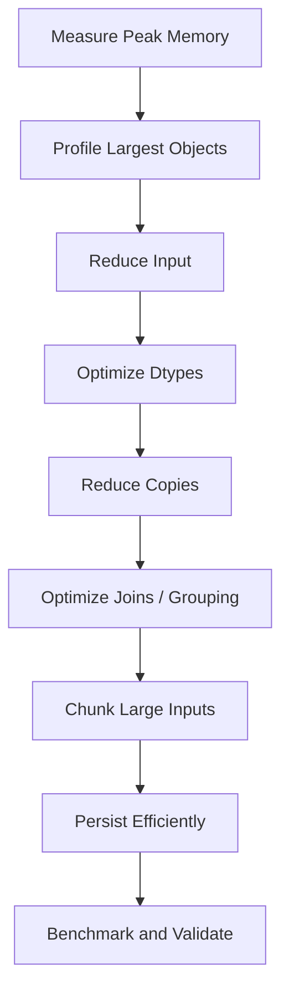

# 07- Memory Optimization

## Overview

Memory optimization in Pandas is the disciplined reduction of the memory required to load, transform, combine, and persist tabular data without changing the intended data semantics.

It builds on three ideas:

```text
reduce what enters memory
        ↓
represent it efficiently
        ↓
avoid unnecessary allocations
```

For production pipelines, memory optimization should be treated as an end-to-end engineering problem rather than a collection of `astype()` tricks.

A useful optimization model is:

```text
Source
  ↓
Read only required rows/columns
  ↓
Choose efficient dtypes
  ↓
Filter early
  ↓
Transform without unnecessary copies
  ↓
Control joins / aggregations
  ↓
Process in chunks when required
  ↓
Persist efficiently
```

The target is **bounded peak memory** while preserving:

```text
correctness
precision
schema compatibility
data-quality guarantees
maintainability
```

---

## Memory Optimization Goals

There are three useful goals:

| Goal | Meaning |
| --- | --- |
| Lower footprint | Reduce steady-state DataFrame memory |
| Lower peak memory | Prevent temporary operations from exceeding limits |
| Lower total work | Read, transform, and store less data |

Lowering the final DataFrame size is valuable, but lowering peak memory is usually more important for production reliability.

For example:

```text
Input DataFrame:     4 GB
Join intermediate:   9 GB
Final DataFrame:     500 MB
```

The process must survive the approximately 9 GB peak, not merely the 500 MB final result.

---

## Measure Before Optimizing

Start with DataFrame-level memory:

```python
memory_bytes = (
    orders
    .memory_usage(
        index=True,
        deep=True,
    )
    .sum()
)

print(
    f"DataFrame memory: "
    f"{memory_bytes / 1024**2:.2f} MB"
)
```

Then inspect individual columns:

```python
memory_by_column = (
    orders
    .memory_usage(
        deep=True,
    )
    .sort_values(
        ascending=False,
    )
)

print(memory_by_column)
```

This determines where optimization effort is likely to have the highest return.

---

## Measure Process-Level Memory

A DataFrame's reported memory is not the entire Python process.

Use process-level measurement for operational decisions:

```python
import os

import psutil


process = psutil.Process(
    os.getpid(),
)

rss_mb = (
    process.memory_info().rss
    / 1024**2
)

print(
    f"RSS: {rss_mb:.2f} MB"
)
```

Monitor both:

```text
DataFrame memory
+
process RSS
```

because libraries, temporary allocations, Python objects, buffers, and other application state also consume memory.

---

## Optimization Workflow

A practical workflow is:



Do not start by changing dtypes across every column.

First determine where the peak comes from.

---

## Reduce Rows Before Loading

The cheapest row is the row that never enters memory.

When querying PostgreSQL:

```sql
SELECT
    order_id,
    customer_id,
    created_at,
    amount
FROM orders
WHERE created_at >= :start_time
  AND created_at < :end_time;
```

This is preferable to:

```sql
SELECT *
FROM orders;
```

followed by:

```python
orders = orders.loc[
    orders["created_at"].between(
        start_time,
        end_time,
        inclusive="left",
    )
]
```

when the database can perform the filtering efficiently.

Source-side filtering reduces:

```text
database result size
network transfer
Pandas memory
Pandas processing
```

---

## Reduce Columns Before Loading

Use column projection at ingestion.

```python
orders = pd.read_csv(
    "orders.csv",
    usecols=[
        "order_id",
        "customer_id",
        "created_at",
        "amount",
        "status",
    ],
)
```

Do not load large fields that are not needed:

```text
raw_payload
debug_metadata
full_message
HTML body
large JSON blobs
```

unless the current processing stage actually requires them.

---

## Keep the Working Schema Narrow

After ingestion, maintain only columns needed by the current stage.

```python
orders = orders[
    [
        "order_id",
        "customer_id",
        "amount",
        "status",
    ]
]
```

This is particularly valuable before:

```text
merge
groupby
sort
copy
serialization
```

because those operations may otherwise carry unnecessary columns into memory-intensive stages.

---

## Project Before Expensive Operations

Prefer:

```python
customer_subset = customers[
    [
        "customer_id",
        "segment",
    ]
]

result = orders.merge(
    customer_subset,
    on="customer_id",
    how="left",
    validate="many_to_one",
)
```

rather than joining the complete customer table.

Memory optimization often means changing the data flow:

```text
wide data
→ narrow working set
→ expensive operation
```

rather than attempting to optimize the expensive operation itself.

---

## Optimize Dtypes

Dtype selection can substantially reduce memory.

Example:

```python
orders["quantity"] = pd.to_numeric(
    orders["quantity"],
    downcast="integer",
)
```

For low-cardinality dimensions:

```python
orders["status"] = (
    orders["status"]
    .astype("category")
)
```

For explicit strings:

```python
orders["customer_id"] = (
    orders["customer_id"]
    .astype("string")
)
```

Use the smallest representation that preserves:

```text
range
precision
nullability
semantics
compatibility
```

---

## Numeric Downcasting

For numeric fields with bounded domains:

```python
orders["quantity"] = pd.to_numeric(
    orders["quantity"],
    downcast="integer",
)
```

Inspect ranges first:

```python
print(
    orders["quantity"].min(),
    orders["quantity"].max(),
)
```

Do not blindly convert all integer columns to narrower types.

Consider future values and schema evolution as well as the current batch.

---

## Floating-Point Optimization

Floating-point downcasting:

```python
orders["conversion_rate"] = pd.to_numeric(
    orders["conversion_rate"],
    downcast="float",
)
```

can reduce memory.

It is appropriate for workloads where the resulting precision is sufficient.

Do not apply it blindly to:

```text
money
billing
financial reconciliation
regulatory reporting
high-precision measurements
```

Precision is part of the data contract.

---

## Nullable Dtypes

When missing values are meaningful:

```python
orders["quantity"] = (
    orders["quantity"]
    .astype("Int64")
)
```

and:

```python
orders["is_refunded"] = (
    orders["is_refunded"]
    .astype("boolean")
)
```

can preserve logical types while supporting null values.

Avoid replacing missing values with arbitrary defaults solely to enable a smaller dtype.

For example:

```text
missing quantity ≠ quantity of zero
```

unless the business domain explicitly defines that equivalence.

---

## Categorical Optimization

Low-cardinality repeated strings are strong candidates:

```python
for column in [
    "status",
    "region",
    "payment_method",
]:
    orders[column] = (
        orders[column]
        .astype("category")
    )
```

Before conversion, inspect cardinality:

```python
for column in [
    "status",
    "region",
    "payment_method",
]:
    print(
        column,
        orders[column].nunique(
            dropna=False,
        ),
    )
```

Do not categorize high-cardinality identifiers automatically.

---

## Optimize Only High-Impact Columns

Suppose a DataFrame consumes:

```text
5.0 GB total
```

and:

```text
raw_payload → 3.5 GB
status      → 700 MB
quantity    → 80 MB
```

Changing `quantity` to a narrower integer is unlikely to solve the primary memory problem.

A better strategy is:

```text
remove raw_payload if unnecessary
↓
optimize status
↓
then consider smaller numeric dtypes
```

Optimization should be proportional to the memory contribution.

---

## Avoid Full-Frame Copies

A copy of a large DataFrame can temporarily double the working set.

Avoid:

```python
cleaned = orders.copy()
```

when an independent copy is not required.

When a filtered result will be modified independently, make the ownership explicit:

```python
completed = orders.loc[
    orders["status"].eq("completed")
].copy()

completed["priority"] = ...
```

The important rule is:

> Copy intentionally, not habitually.

---

## Prefer Narrow Copies

If only a few columns are needed:

```python
completed = orders.loc[
    orders["status"].eq("completed"),
    [
        "order_id",
        "customer_id",
        "amount",
    ],
].copy()
```

This can be significantly cheaper than:

```python
completed = orders.loc[
    orders["status"].eq("completed")
].copy()
```

when the original DataFrame is wide.

---

## Avoid Unnecessary Intermediate Objects

This pattern retains several large DataFrames:

```python
raw = load_data()

cleaned = clean(raw)

joined = join_data(cleaned)

result = aggregate(joined)
```

When `raw` and `cleaned` are no longer needed, their lifetimes should end.

A more memory-conscious design can scope transformations:

```python
def build_report(
    source: pd.DataFrame,
) -> pd.DataFrame:
    cleaned = clean(source)

    result = aggregate(
        join_data(cleaned)
    )

    return result
```

Python object lifetime is influenced by references and garbage collection, so object deletion is not identical to immediate OS-level memory release.

---

## Using `del`

For a large object that is definitely no longer required:

```python
del joined
```

This removes the current reference.

It can be useful in long-running batch jobs, but it is not a substitute for good pipeline design.

Prefer eliminating unnecessary object coexistence in the first place.

---

## Be Careful with Accumulating Lists

This pattern can recreate a memory problem:

```python
results = []

for chunk in chunks:
    results.append(
        process(chunk)
    )

result = pd.concat(results)
```

All processed chunks remain in memory until the final concatenation.

For large pipelines, prefer:

```text
partial aggregation
incremental persistence
bounded batches
```

instead of accumulating every intermediate DataFrame.

---

## Chunked Processing

When the complete dataset cannot safely fit in memory:

```python
for chunk in pd.read_csv(
    "orders.csv",
    chunksize=100_000,
):
    process(chunk)
```

Only a bounded portion of the input is resident at a time.

Chunking works particularly well for:

```text
filtering
validation
row-level transformations
per-batch aggregation
format conversion
incremental persistence
```

---

## Chunk Size Selection

A larger chunk:

```text
fewer iterations
potentially better throughput
higher peak memory
```

A smaller chunk:

```text
lower peak memory
more iteration overhead
potentially lower throughput
```

Choose chunk size based on:

```text
row width
transformation cost
available memory
I/O characteristics
output strategy
```

Benchmark rather than selecting an arbitrary value.

---

## Chunk-Friendly Aggregations

Additive metrics are easy to combine:

```python
partials = []

for chunk in pd.read_csv(
    "orders.csv",
    chunksize=100_000,
):
    partial = (
        chunk
        .groupby("customer_id")["amount"]
        .sum()
    )

    partials.append(partial)

customer_totals = (
    pd.concat(partials)
    .groupby(level=0)
    .sum()
)
```

This still stores partial results, but the intermediate data is typically much smaller than the original raw rows.

For very large workloads, persist partial aggregates instead of accumulating them indefinitely.

---

## Operations That Resist Chunking

Some operations require broader global state.

Examples:

```text
global sort
exact global median
large many-to-many join
global duplicate detection
some window calculations
```

For these, consider:

```text
database execution
external storage
partition-aware algorithms
DuckDB
Polars
Dask
PySpark
```

The goal is to choose an execution model that matches the operation.

---

## Join Optimization

Before a merge:

```python
customers_small = customers[
    [
        "customer_id",
        "segment",
    ]
]

result = orders.merge(
    customers_small,
    on="customer_id",
    how="left",
    validate="many_to_one",
)
```

Also verify key uniqueness:

```python
if not customers_small["customer_id"].is_unique:
    raise ValueError(
        "Customer IDs must be unique"
    )
```

Unexpected duplicate keys can multiply row counts and cause severe memory spikes.

---

## Join Cardinality as a Memory Control

Suppose:

```text
orders = 10 million rows
customers = 1 million rows
```

and the customer table unexpectedly contains duplicate IDs.

A join intended to be:

```text
many-to-one
```

can become:

```text
many-to-many
```

and generate a much larger result.

Use:

```python
validate="many_to_one"
```

to detect this condition.

Data-quality validation is therefore part of memory management.

---

## Avoid Cross Joins

A cross join can produce:

```text
N × M
```

rows.

For:

```text
1 million orders
×
100,000 products
```

the theoretical result contains:

```text
100 billion rows
```

This is a memory and architecture problem.

Use cross joins only when the result cardinality is intentionally bounded and justified.

---

## Reduce Before Grouping

Instead of:

```python
summary = (
    orders
    .groupby("customer_id")
    .agg(...)
)
```

carry only columns required by the aggregation:

```python
grouping_input = orders[
    [
        "customer_id",
        "order_id",
        "amount",
    ]
]

summary = (
    grouping_input
    .groupby("customer_id")
    .agg(
        order_count=("order_id", "count"),
        total_amount=("amount", "sum"),
    )
)
```

The reduction can lower working memory during the groupby.

---

## Reduce Before Sorting

Sorting a wide DataFrame requires moving large row structures.

If only a subset is needed:

```python
top_orders = (
    orders[
        [
            "order_id",
            "customer_id",
            "amount",
        ]
    ]
    .nlargest(
        100,
        "amount",
    )
)
```

Avoid sorting all columns when the business requirement does not need them.

---

## Avoid Repeated Expensive Transformations

Parse or normalize once:

```python
orders["created_at"] = pd.to_datetime(
    orders["created_at"],
    utc=True,
    errors="raise",
)
```

Then reuse the typed column.

Likewise:

```python
customers["email_normalized"] = (
    customers["email"]
    .str.strip()
    .str.lower()
)
```

Repeated transformations increase:

```text
CPU
temporary allocations
pipeline latency
```

---

## Filter Before Expensive String Processing

Instead of:

```python
logs["request_id"] = (
    logs["message"]
    .str.extract(
        r"request_id=(?P<request_id>[A-Za-z0-9-]+)",
        expand=False,
    )
)

errors = logs.loc[
    logs["level"].eq("ERROR")
]
```

prefer:

```python
errors = logs.loc[
    logs["level"].eq("ERROR"),
    [
        "event_id",
        "message",
    ],
].copy()

errors["request_id"] = (
    errors["message"]
    .str.extract(
        r"request_id=(?P<request_id>[A-Za-z0-9-]+)",
        expand=False,
    )
)
```

The expensive operation runs on fewer rows.

---

## Avoid Carrying Raw Payloads

A production event pipeline may ingest:

```text
event_id
customer_id
event_type
event_time
metadata
raw_payload
```

If downstream logic needs only:

```text
event_id
customer_id
event_type
event_time
```

extract those fields and remove the raw payload from the working DataFrame.

Persist raw data separately when required for:

```text
audit
reprocessing
forensics
data lineage
```

Do not carry it through every transformation stage.

---

## Efficient File Formats

CSV is useful for interchange but is often inefficient for repeated analytical processing.

A better persistent format is often:

```python
orders.to_parquet(
    "orders.parquet",
    index=False,
)
```

Then:

```python
orders = pd.read_parquet(
    "orders.parquet",
    columns=[
        "customer_id",
        "amount",
        "status",
    ],
)
```

Benefits include:

```text
typed data
column projection
compression
efficient analytical reads
```

---

## Partitioned Parquet

For large datasets, partition by appropriate dimensions such as:

```text
event_date
year
month
region
```

Conceptually:

```text
s3://analytics/events/
    year=2026/
        month=09/
            part-000.parquet
            part-001.parquet
```

This allows downstream processing to read only relevant partitions when the query pattern aligns with the partitioning strategy.

Do not partition by extremely high-cardinality fields such as request IDs.

---

## Compression Trade-Offs

Compression can reduce:

```text
storage
network transfer
I/O
```

but may increase CPU cost.

A memory-aware pipeline should consider the full resource profile:

```text
CPU
RAM
disk
network
latency
storage cost
```

For cloud workloads, the cheapest format is not necessarily the one with the smallest file size if decompression CPU dominates runtime.

---

## SQL Pushdown

Memory optimization should often happen before Pandas.

Example:

```sql
SELECT
    customer_id,
    SUM(amount) AS total_amount,
    COUNT(*) AS order_count
FROM orders
WHERE created_at >= :start_time
  AND created_at < :end_time
  AND status = 'completed'
GROUP BY customer_id;
```

Pandas then receives:

```text
small aggregated result
```

instead of:

```text
millions of raw orders
```

Use the database for operations it is designed to execute efficiently.

---

## API Pushdown

For REST APIs, request only the necessary data when supported:

```text
time range
pagination
field selection
status filters
incremental cursor
```

The architecture should be:


rather than:

```text
download everything
→ build huge DataFrame
→ discard most rows
```

---

## Incremental Processing

Instead of processing:

```text
January → September
```

in one DataFrame, process bounded windows:

```text
January batch
February batch
...
September batch
```

or use incremental event IDs/timestamps.

A production incremental pipeline might use:

```text
last_successful_cursor
        ↓
fetch next batch
        ↓
process
        ↓
validate
        ↓
persist
        ↓
commit cursor
```

This keeps memory bounded and improves recoverability.

---

## Idempotency and Memory Optimization

Incremental processing should be idempotent.

A safe pattern is:


Do not advance the checkpoint before the output is durably written.

This prevents retries from either:

```text
losing data
```

or:

```text
creating inconsistent duplicate output
```

Memory optimization should not compromise reliability.

---

## DataFrame Ownership

Make ownership clear between pipeline stages.

A useful boundary is:

```python
def normalize_orders(
    orders: pd.DataFrame,
) -> pd.DataFrame:
    result = orders.loc[
        :,
        [
            "order_id",
            "customer_id",
            "amount",
            "status",
        ],
    ].copy()

    result["status"] = (
        result["status"]
        .astype("category")
    )

    return result
```

The function owns its returned DataFrame.

Explicit ownership makes it easier to reason about when copying is required.

---

## Optimize Method Chains Carefully

This is readable:

```python
result = (
    orders
    .loc[
        orders["status"].eq("completed"),
        [
            "customer_id",
            "amount",
        ],
    ]
    .groupby(
        "customer_id",
        as_index=False,
    )
    .agg(
        revenue=("amount", "sum"),
    )
)
```

Do not rewrite it into obscure code merely to save a temporary object unless profiling demonstrates a meaningful benefit.

Maintainability has operational value.

---

## Memory Optimization and Vectorization

Vectorization reduces Python-level overhead, but it does not mean zero allocations.

For example:

```python
orders["net_amount"] = (
    orders["amount"]
    - orders["discount"]
)
```

may require memory for the resulting values.

For a large DataFrame:

```text
multiple vectorized expressions
+
many temporary masks
+
multiple new columns
```

can still create substantial peak memory.

Use vectorization together with:

```text
narrow schemas
controlled intermediates
early filtering
```

---

## Avoid Temporary Columns When They Are Not Needed

This:

```python
orders["is_large"] = (
    orders["amount"].gt(10_000)
)

result = orders.loc[
    orders["is_large"]
]
```

retains an additional full-length column.

When the predicate is used only once:

```python
result = orders.loc[
    orders["amount"].gt(10_000)
]
```

may be sufficient.

When the condition is reused repeatedly, retaining the boolean Series can be reasonable.

The decision depends on reuse and memory cost.

---

## Memory Optimization for Empty Batches

A production pipeline should preserve schemas even when a batch has no rows.

```python
empty_orders = pd.DataFrame({
    "order_id": pd.Series(
        dtype="string",
    ),
    "customer_id": pd.Series(
        dtype="string",
    ),
    "amount": pd.Series(
        dtype="Float64",
    ),
    "status": pd.Series(
        dtype="category",
    ),
})
```

Stable schemas prevent unexpected dtype inference in downstream stages.

---

## Invalid Data Can Increase Memory

Poorly typed input can force generic representations.

For example:

```text
amount:
100
200
unknown
300
```

may result in an undesirable dtype.

Normalize explicitly:

```python
orders["amount"] = pd.to_numeric(
    orders["amount"],
    errors="raise",
)
```

When invalid values should be quarantined:

```python
orders["amount"] = pd.to_numeric(
    orders["amount"],
    errors="coerce",
)
```

then inspect and handle the invalid rows explicitly.

---

## Schema Validation Before Optimization

Do not optimize first and validate later.

A good ingestion sequence is:

```text
load
→ schema validation
→ dtype normalization
→ value validation
→ optimization
→ transformation
```

This prevents a memory optimization from silently changing:

```text
IDs
dates
money
nullability
categorical domains
```

---

## Monitoring Memory

Production metrics should include:

| Metric | Purpose |
| --- | --- |
| Input row count | Detect data-volume changes |
| Input bytes | Detect payload growth |
| DataFrame memory | Measure working-set size |
| Peak RSS | Detect process-level memory pressure |
| Output row count | Validate transformation behavior |
| Join row count | Detect cardinality explosions |
| Batch size | Verify bounded processing |
| Runtime | Detect performance regressions |
| OOM events | Detect hard resource failures |

Monitor memory alongside business metrics.

A sudden increase in memory may indicate:

```text
schema drift
higher cardinality
new columns
join duplication
larger payloads
```

---

## Kubernetes Considerations

Container limits create hard memory boundaries.

Example:

```yaml
resources:
  requests:
    cpu: "1"
    memory: "4Gi"
  limits:
    cpu: "2"
    memory: "8Gi"
```

An application should not target an 8 GiB DataFrame inside an 8 GiB container.

Reserve headroom for:

```text
Python runtime
Pandas
NumPy
temporary allocations
network buffers
logging
application state
```

Track:

```text
working set
RSS
OOM kills
restarts
batch duration
```

A memory optimization is operationally successful only if the workload remains stable under its deployment limits.

---

## Celery Considerations

Celery workers that process large Pandas jobs may be long-lived.

Memory optimization should therefore include:

```text
bounded batch sizes
controlled object lifetime
limited concurrency
worker memory monitoring
```

For memory-intensive workloads, worker recycling may provide an operational safety mechanism, but it should not be used to conceal uncontrolled memory growth.

The underlying pipeline should still release unnecessary objects and bound its working set.

---

## AWS Considerations

Memory optimization can reduce cloud cost by allowing:

```text
smaller ECS tasks
smaller EC2 instances
smaller Kubernetes nodes
shorter-running AWS Batch jobs
fewer retries
```

Storage optimization also matters:

```text
Parquet
+
compression
+
partition pruning
+
column projection
```

can reduce data transfer and compute requirements.

For datasets that no longer fit practical single-node memory limits, consider moving computation into services designed for larger-scale analytical processing.

---

## Performance Regression Testing

Memory should be part of regression testing for critical pipelines.

Example:

```python
def dataframe_memory_mb(
    df: pd.DataFrame,
) -> float:
    return (
        df.memory_usage(
            deep=True,
        )
        .sum()
        / 1024**2
    )
```

A benchmark can record:

```text
input size
output size
memory
runtime
```

rather than enforcing one universal memory threshold across every environment.

For reliable comparisons, use representative fixtures and consistent execution environments.

---

## Benchmarking Optimization Changes

For every meaningful optimization, compare:

```text
before
after
```

across:

```text
runtime
peak memory
result correctness
output schema
```

Example:

```python
before_mb = dataframe_memory_mb(
    original_orders,
)

after_mb = dataframe_memory_mb(
    optimized_orders,
)

print(
    {
        "before_mb": before_mb,
        "after_mb": after_mb,
        "saved_mb": before_mb - after_mb,
    }
)
```

An optimization is successful only if the resource improvement justifies any added complexity and preserves behavior.

---

## Common Memory Optimization Mistakes

### Optimizing the Wrong Column

Changing a tiny numeric column while a huge text payload dominates memory provides little benefit.

### Blindly Downcasting Everything

This can cause overflow or precision loss.

### Categorizing High-Cardinality Values

The category dictionary may become large with little memory benefit.

### Copying Before Every Operation

Repeated copies can dominate peak memory.

### Keeping Every Pipeline Stage in Memory

Long-lived intermediates increase cumulative memory.

### Accumulating Every Chunk

Chunking does not help if every processed chunk is stored until the end.

### Ignoring Join Cardinality

Unexpected duplicates can create enormous outputs.

### Loading `SELECT *`

Source over-fetching is often the simplest cause of excessive Pandas memory.

### Assuming `del` Immediately Returns Memory to the OS

Removing a Python reference does not guarantee immediate reduction in process RSS.

### Optimizing Before Measuring

Memory changes should be based on observed bottlenecks.

---

## Production Optimization Checklist

```text
[ ] Peak process memory has been measured
[ ] DataFrame memory has been measured with deep inspection
[ ] Largest columns have been identified
[ ] Unnecessary source rows are filtered before Pandas
[ ] Unnecessary columns are projected out early
[ ] Numeric dtypes match value ranges
[ ] Financial values preserve required precision
[ ] Nullable dtypes are used where required
[ ] Low-cardinality dimensions are evaluated for category
[ ] High-cardinality identifiers are not blindly categorized
[ ] Join keys have compatible dtypes
[ ] Join cardinality is validated
[ ] Cross joins are explicitly justified
[ ] Expensive transformations run after filtering
[ ] Large string payloads are removed from working sets
[ ] Expensive parsing is performed once
[ ] Unnecessary full-frame copies are avoided
[ ] Intermediate DataFrame lifetimes are controlled
[ ] Large inputs are chunked when necessary
[ ] Chunk results are aggregated or persisted incrementally
[ ] Parquet is used when appropriate
[ ] Partitioning matches access patterns
[ ] Empty inputs retain a stable schema
[ ] Invalid data is detected instead of silently corrupted
[ ] Memory and runtime are benchmarked before/after changes
[ ] Production RSS and OOM events are monitored
[ ] Container memory limits include operational headroom
[ ] Optimization has been validated for correctness
```

## Interview Perspective

### What Is the Most Important Memory Metric?

For deployment reliability, peak process memory is often more important than the final DataFrame size because temporary allocations can create the highest memory demand.

### Why Doesn't `memory_usage()` Tell the Whole Story?

Because it measures DataFrame-related memory, not the entire Python process. RSS includes the broader process footprint.

### What Is the Highest-Value Memory Optimization?

Usually reducing the amount of data that enters the Pandas process:

```text
fewer rows
+
fewer columns
+
source-side filtering
```

before applying local dtype optimizations.

### Why Can a Join Cause an OOM?

An incorrect join cardinality can multiply the number of rows and create a much larger result and intermediate working set.

### Does Chunking Solve All Memory Problems?

No. It helps when computation can be partitioned, but operations requiring global state may still require a different algorithm or processing engine.

---

## Key Takeaways

- Optimize memory from the outside in: reduce source rows and columns first, then optimize dtypes, copies, intermediates, joins, and storage.
- Measure both DataFrame memory and process-level peak RSS; the largest production risk is often a temporary allocation rather than the final DataFrame.
- Use bounded processing, efficient dtypes, narrow working schemas, incremental aggregation, and Parquet to keep large pipelines within predictable memory limits.
- Treat joins, copies, raw payloads, unbounded chunk accumulation, and high-cardinality data as major memory risks and validate them explicitly.
- Memory optimization is successful only when it improves resource usage without changing precision, schema semantics, data quality, reliability, or downstream behavior.