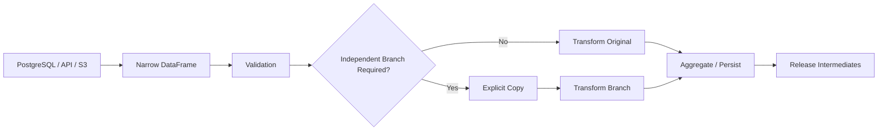

# 08- Copy Vs View

## Overview

Understanding copies and views is essential for writing correct and memory-efficient Pandas code.

A DataFrame operation may produce:

```text
a new independent object
```

or:

```text
an object that shares underlying data
```

Historically, Pandas behavior around views and copies has been difficult to reason about because it depends on the operation, dtype, indexing path, and internal representation. Modern Pandas has increasingly moved toward **Copy-on-Write (CoW)** semantics, which changes when physical copies are materialized.

The production-level principle is therefore not:

> "Every slice is a view."

or:

> "Every slice is a copy."

Instead:

> Treat derived DataFrames as separate logical objects, make ownership explicit when mutation matters, and understand the Copy-on-Write behavior of the Pandas version used by your application.

This topic matters because poor ownership assumptions can lead to:

```text
unexpected mutations
silent data bugs
SettingWithCopyWarning
unnecessary memory consumption
large temporary allocations
difficult-to-reproduce pipeline behavior
```

---

## What Is a Copy?

A copy creates an independent object with its own data ownership.

Example:

```python
subset = orders[
    [
        "order_id",
        "amount",
    ]
].copy()
```

The `.copy()` explicitly requests an independent DataFrame.

Afterward:

```python
subset["amount"] = (
    subset["amount"] * 1.10
)
```

the original:

```python
orders
```

is not intended to be modified by the assignment.

A copy is appropriate when the derived object represents an independently mutable pipeline stage.

---

## What Is a View?

A view is a derived object that may share underlying data with another object.

Conceptually:

```text
Original DataFrame
       │
       └── shared underlying storage
               │
               └── Derived object
```

If storage is shared, modifying the data through one object can potentially affect another object under view-based semantics.

However, Pandas does not expose a simple universal rule that lets application code safely predict view behavior for every operation.

Therefore, code should not depend on accidental sharing.

---

## Copy Versus View

| Property | Copy | View / Shared Data |
| --- | --- | --- |
| Independent logical data | Yes | Not necessarily |
| Explicit ownership | Clear | Potentially ambiguous |
| Additional memory | Usually higher | Potentially lower |
| Mutation isolation | Strong | Depends on semantics |
| Safe default for independent mutation | Yes | No |
| Useful for memory optimization | Sometimes expensive | Potentially efficient |
| Application code should rely on accidental behavior | No | No |

Modern Copy-on-Write semantics change the implementation details, but the ownership distinction remains important.

---

## Why the Distinction Matters

Consider:

```python
completed = orders.loc[
    orders["status"].eq("completed")
]

completed["priority"] = "normal"
```

The important question is:

> Is `completed` logically independent from `orders`?

If that answer is ambiguous, the transformation becomes harder to reason about.

A clearer pattern is:

```python
completed = orders.loc[
    orders["status"].eq("completed")
].copy()

completed["priority"] = "normal"
```

The ownership boundary is explicit.

---

## The Traditional Chained Indexing Problem

A common problematic pattern is:

```python
orders[
    orders["status"].eq("completed")
]["priority"] = "high"
```

This performs multiple indexing operations.

Historically, Pandas could not always determine whether the intermediate object was a view or copy, which led to warnings such as:

```text
SettingWithCopyWarning
```

More importantly, the code communicates ambiguous ownership.

Prefer:

```python
completed = orders.loc[
    orders["status"].eq("completed")
].copy()

completed["priority"] = "high"
```

or, when the intention is to mutate the original DataFrame:

```python
orders.loc[
    orders["status"].eq("completed"),
    "priority",
] = "high"
```

The second form makes the mutation target explicit.

---

## `loc` for Explicit Mutation

When modifying an existing DataFrame, use `.loc` to identify rows and columns precisely.

```python
orders.loc[
    orders["status"].eq("completed"),
    "priority",
] = "high"
```

This communicates:

```text
target DataFrame: orders
target rows:       completed orders
target column:     priority
assignment:        high
```

This is safer and more readable than chained indexing.

---

## `.copy()` for Independent Processing

When a filtered dataset becomes its own transformation stage:

```python
completed = orders.loc[
    orders["status"].eq("completed"),
    [
        "order_id",
        "customer_id",
        "amount",
    ],
].copy()
```

Now the intention is clear:

```text
orders
  ↓
completed
  ↓
independent transformation
```

This is especially useful in ETL pipelines where multiple branches operate on the same source DataFrame.

---

## `.copy(deep=True)`

The default:

```python
df.copy()
```

uses:

```python
deep=True
```

unless specified otherwise.

Example:

```python
orders_copy = orders.copy(
    deep=True,
)
```

This creates an independent copy of the DataFrame's data structures.

However, "deep copy" in Pandas should not be interpreted as recursively duplicating arbitrary Python objects stored inside object columns.

If a column contains mutable Python objects, there are additional aliasing considerations.

---

## `.copy(deep=False)`

You can request:

```python
shared = orders.copy(
    deep=False,
)
```

This creates a new Pandas object while sharing underlying data more aggressively.

It can be useful for specialized internal workflows, but application code should use it only when the sharing semantics are explicitly understood.

With modern Copy-on-Write behavior, shallow copies can behave differently from historical Pandas versions because mutations may trigger physical copying rather than immediately modifying shared data.

Do not use `deep=False` as a generic memory optimization.

---

## Copy-on-Write

Copy-on-Write, commonly abbreviated as CoW, changes the semantics of shared data.

The conceptual model is:

```text
Derived object
      │
      ↓
shares data initially
      │
      ↓
read operation
      │
      └── no required physical copy

mutation requested
      │
      ↓
copy shared data if necessary
      │
      ↓
perform mutation safely
```

This can reduce unnecessary copying for read-heavy operations while preserving isolation when mutation occurs.

The exact behavior depends on the Pandas version and configuration.

Production systems should explicitly standardize the Pandas version and test under the same Copy-on-Write configuration used in deployment.

---

## Enabling Copy-on-Write Explicitly

Where supported by the Pandas version in use:

```python
pd.options.mode.copy_on_write = True
```

This makes the intended behavior explicit within the process.

For production applications:

```text
pin Pandas version
configure CoW consistently
test mutation semantics
benchmark memory behavior
```

Do not rely on different environments having identical defaults.

---

## Why Copy-on-Write Helps

Suppose:

```python
subset = orders[
    [
        "customer_id",
        "amount",
    ]
]
```

is used only for reading.

Under CoW-style semantics, shared storage can potentially avoid eagerly copying all data.

If later:

```python
subset["amount"] *= 1.10
```

requires mutation, Pandas can isolate the changed data.

The important optimization is:

```text
avoid copying until independent mutation is required
```

rather than:

```text
copy everything immediately
```

---

## Copy-on-Write Does Not Mean Zero Memory Cost

When a shared object is mutated, Pandas may need to materialize new storage.

For example:

```python
subset["amount"] = (
    subset["amount"] * 1.10
)
```

can create a new result array.

Therefore:

```text
shared initially
```

does not mean:

```text
shared forever
```

Monitor peak memory for large transformations.

---

## Why `.copy()` Still Matters with CoW

Copy-on-Write reduces ambiguity around mutation, but explicit copies can still be valuable as a code-level ownership signal.

Example:

```python
customer_orders = orders.loc[
    orders["customer_id"].eq(customer_id)
].copy()
```

This tells future maintainers:

```text
This object is an independent transformation stage.
```

That intent can matter even when the implementation could otherwise defer physical copying.

Use `.copy()` when explicit ownership improves correctness and maintainability.

---

## When `.copy()` Is Wasteful

Blindly copying large DataFrames can increase peak memory.

Avoid:

```python
a = orders.copy()
b = a.copy()
c = b.copy()
```

when no independent mutation boundary exists.

Suppose:

```text
orders = 4 GB
```

A full eager copy can require another approximately:

```text
4 GB
```

of DataFrame storage, plus temporary overhead.

A better strategy is:

```text
narrow the dataset
→ filter
→ select required columns
→ copy only where ownership requires it
```

---

## Copy After Projection

If only a subset is needed:

```python
completed = orders.loc[
    orders["status"].eq("completed"),
    [
        "order_id",
        "customer_id",
        "amount",
    ],
].copy()
```

This is generally better than:

```python
completed = orders.loc[
    orders["status"].eq("completed")
].copy()

completed = completed[
    [
        "order_id",
        "customer_id",
        "amount",
    ]
]
```

because the first pattern establishes a narrow working set immediately.

---

## Read-Only Transformation

If a derived object is only consumed and never mutated:

```python
customer_totals = (
    orders
    .groupby("customer_id")["amount"]
    .sum()
)
```

there is usually no reason to introduce an explicit full DataFrame copy merely to make the result "safe."

Copying should be driven by ownership and mutation requirements, not habit.

---

## Mutation of the Original DataFrame

Suppose the business requirement is:

```text
update status on the existing orders DataFrame
```

Do not create an unnecessary copy:

```python
updated = orders.copy()

updated.loc[
    updated["amount"].gt(10_000),
    "priority",
] = "high"
```

when the application genuinely wants to mutate `orders`.

Instead:

```python
orders.loc[
    orders["amount"].gt(10_000),
    "priority",
] = "high"
```

This makes the intended target explicit.

---

## Creating an Independent Branch

Suppose the pipeline needs two independent branches:

```text
orders
├── completed workflow
└── cancelled workflow
```

Use clear ownership:

```python
completed = orders.loc[
    orders["status"].eq("completed"),
    [
        "order_id",
        "customer_id",
        "amount",
    ],
].copy()

cancelled = orders.loc[
    orders["status"].eq("cancelled"),
    [
        "order_id",
        "customer_id",
        "amount",
    ],
].copy()
```

Each branch can then evolve independently.

---

## Avoiding Mutation Through Shared References

A separate Python variable does not necessarily mean separate Pandas storage.

For example:

```python
a = orders
b = a
```

Now:

```text
a
└── same DataFrame object
    └── b
```

Both names reference the same object.

If:

```python
b["priority"] = "high"
```

then `a` refers to the same DataFrame and observes the mutation.

Use:

```python
b = orders.copy()
```

when a genuinely separate DataFrame is required.

This is standard Python object reference behavior, not specifically a Pandas view issue.

---

## Assignment to a New Column

Consider:

```python
orders["total"] = (
    orders["quantity"]
    * orders["unit_price"]
)
```

This updates the target DataFrame.

If `orders` is an independently owned DataFrame, this is straightforward.

If `orders` is itself a derived object whose ownership is ambiguous, explicitly establish the ownership boundary before mutation:

```python
orders = orders.copy()

orders["total"] = (
    orders["quantity"]
    * orders["unit_price"]
)
```

The exact need depends on how the object was constructed and on Copy-on-Write semantics, but explicit ownership is still useful.

---

## Setting Values in Filtered Data

Prefer:

```python
orders.loc[
    orders["status"].eq("completed"),
    "priority",
] = "high"
```

over:

```python
orders[
    orders["status"].eq("completed")
]["priority"] = "high"
```

The `.loc` pattern avoids ambiguous chained assignment and clearly identifies the mutation target.

---

## Selecting Rows and Then Mutating

A common production pattern is:

```python
completed = orders.loc[
    orders["status"].eq("completed")
].copy()

completed["net_amount"] = (
    completed["amount"]
    - completed["discount"]
)
```

This is appropriate when:

```text
completed
```

is intended to be an independent processing object.

If the mutation should apply to `orders` itself, mutate through:

```python
orders.loc[
    orders["status"].eq("completed"),
    "net_amount",
] = (
    orders.loc[
        orders["status"].eq("completed"),
        "amount",
    ]
    - orders.loc[
        orders["status"].eq("completed"),
        "discount",
    ]
)
```

or establish the mutation mask once for readability.

---

## Avoiding Repeated Filtering

For complex transformations:

```python
completed_mask = (
    orders["status"]
    .eq("completed")
)

completed = orders.loc[
    completed_mask,
    [
        "order_id",
        "customer_id",
        "amount",
    ],
].copy()

completed["priority"] = "standard"
```

This separates:

```text
selection
+
ownership
+
mutation
```

and makes each stage easier to test.

---

## Memory Trade-Offs

Copies consume memory, but sharing data can create aliasing complexity.

The trade-off is:

| Strategy | Memory | Mutation safety | Complexity |
| --- | --- | --- | --- |
| Eager copy | Higher | High | Low |
| Shared object | Lower | Low if semantics unclear | Higher |
| Copy-on-Write | Potentially lower | High | Lower than manual sharing |
| Narrow copy | Lower than full copy | High | Low |

For production code:

> Prefer the smallest independently owned object that gives the required correctness guarantees.

---

## Copying Wide DataFrames

Suppose:

```text
100 columns
10 million rows
```

and the next stage requires only:

```text
customer_id
amount
status
```

Do not copy the entire DataFrame:

```python
subset = orders.copy()
```

then remove 97 columns.

Prefer:

```python
subset = orders.loc[
    :,
    [
        "customer_id",
        "amount",
        "status",
    ],
].copy()
```

This keeps the working set narrow.

---

## Copying Large String Columns

String-heavy DataFrames can make copies particularly expensive.

For example:

```text
raw_payload
message
description
html
metadata
```

may dominate memory.

Before copying:

```python
subset = orders.loc[
    :,
    [
        "customer_id",
        "amount",
    ],
].copy()
```

rather than copying the full object-heavy DataFrame.

Column projection is one of the highest-value memory optimizations when copies are required.

---

## Copying and Joins

Joins can create large independent result DataFrames:

```python
result = orders.merge(
    customers,
    on="customer_id",
    how="left",
    validate="many_to_one",
)
```

Avoid immediately copying the join result again:

```python
result = orders.merge(...).copy()
```

unless there is a specific reason to establish another ownership boundary.

The join itself already produces a result object.

---

## Copying and GroupBy

Groupby results are often new objects:

```python
summary = (
    orders
    .groupby("customer_id", as_index=False)
    .agg(
        total_amount=("amount", "sum"),
    )
)
```

There is usually no need to call:

```python
summary = summary.copy()
```

without a demonstrated ownership or mutation requirement.

Avoid defensive copying that has no semantic purpose.

---

## Copying and Method Chains

A chain can contain several transformations:

```python
result = (
    orders
    .loc[
        orders["status"].eq("completed"),
        [
            "customer_id",
            "amount",
        ],
    ]
    .assign(
        net_amount=lambda df:
            df["amount"] - df["discount"],
    )
)
```

Do not automatically insert:

```python
.copy()
```

after every operation.

Instead, introduce copies at meaningful ownership boundaries.

For example:

```python
completed = orders.loc[
    orders["status"].eq("completed"),
    [
        "customer_id",
        "amount",
        "discount",
    ],
].copy()

result = (
    completed
    .assign(
        net_amount=lambda df:
            df["amount"] - df["discount"],
    )
)
```

This makes the branch boundary explicit without duplicating every stage.

---

## View Detection Is Not an Application Contract

Developers sometimes inspect internal or implementation-oriented properties to determine whether an object is a view.

That is not a robust application design strategy.

The problem is that view/copy details can change with:

```text
Pandas version
dtype
operation
internal data manager
Copy-on-Write configuration
```

Application code should express intent through:

```text
.loc
.copy()
clear ownership
controlled mutation
```

rather than depending on undocumented internals.

---

## `SettingWithCopyWarning`

Historically, Pandas could emit:

```text
SettingWithCopyWarning
```

when assignment was made through an ambiguous chained indexing path.

Example:

```python
orders[
    orders["status"].eq("completed")
]["priority"] = "high"
```

The warning indicates that Pandas cannot confidently guarantee the intended mutation semantics.

The correct fix is not:

```python
pd.options.mode.chained_assignment = None
```

The correct fix is to make the operation explicit.

Mutate the original:

```python
orders.loc[
    orders["status"].eq("completed"),
    "priority",
] = "high"
```

or create an independent object:

```python
completed = orders.loc[
    orders["status"].eq("completed")
].copy()

completed["priority"] = "high"
```

---

## Why Suppressing the Warning Is Dangerous

Suppressing warnings can hide:

```text
incorrect assignments
unexpected mutation
pipeline bugs
version-dependent behavior
```

Do not globally disable warnings simply to make a pipeline "clean."

Fix the ambiguous ownership or indexing logic.

---

## Copy and Data Validation

Validation should happen against the object that owns the data being transformed.

Example:

```python
completed = orders.loc[
    orders["status"].eq("completed"),
    [
        "order_id",
        "amount",
    ],
].copy()

if completed["amount"].lt(0).any():
    raise ValueError(
        "Completed orders cannot have negative amounts"
    )
```

Now:

```text
validation
+
transformation
```

operate against a well-defined dataset.

This is useful in ETL pipelines where multiple branches represent different business subsets.

---

## Copy and Missing Values

Copy semantics do not change the importance of null handling.

Example:

```python
completed = orders.loc[
    orders["status"].eq("completed"),
    [
        "order_id",
        "amount",
        "discount",
    ],
].copy()

completed["discount"] = (
    completed["discount"]
    .fillna(0)
)
```

The copied object can be safely normalized without unintentionally changing the source branch.

But do not use copying as a substitute for understanding null semantics.

---

## Copy and Dtypes

Copies preserve the logical DataFrame structure, but dtype optimization can change the memory cost of downstream objects.

For example:

```python
orders["status"] = (
    orders["status"]
    .astype("category")
)
```

before branching can reduce the memory cost of repeated copies or derived objects.

This is one reason:

```text
dtype normalization
```

and:

```text
copy strategy
```

should be designed together.

---

## Copy and Large ETL Pipelines

Consider:

```text
raw
 ↓
cleaned
 ↓
enriched
 ↓
aggregated
```

If every stage is a full eager copy:

```text
raw       → 4 GB
cleaned   → 4 GB
enriched  → 5 GB
aggregate → 500 MB
```

peak memory can become much larger than the size of the final result.

A better design is:

```text
raw
 ↓
project required columns
 ↓
filter
 ↓
independent branch where necessary
 ↓
transform
 ↓
persist
 ↓
release intermediate
```

Memory ownership should be considered as part of pipeline architecture.

---

## Copy and Incremental Processing

Chunk processing reduces memory pressure:

```python
for chunk in pd.read_csv(
    "orders.csv",
    chunksize=100_000,
):
    normalized = chunk.loc[
        :,
        [
            "customer_id",
            "amount",
            "status",
        ],
    ].copy()

    result = process(normalized)

    persist(result)
```

The critical property is:

```text
bounded input
+
bounded intermediate lifetime
```

Do not accumulate every copied chunk in memory.

---

## Copy and Parquet

When using Parquet:

```python
orders = pd.read_parquet(
    "orders.parquet",
    columns=[
        "customer_id",
        "amount",
        "status",
    ],
)
```

you already reduce the input working set through column projection.

Then:

```python
completed = orders.loc[
    orders["status"].eq("completed")
].copy()
```

creates an explicitly owned subset.

This is often more effective than loading a very wide dataset and repeatedly copying it.

---

## Backend Data Flow

A production backend or ETL architecture may look like:



This makes memory ownership an intentional architecture decision rather than an accidental consequence of indexing.

---

## FastAPI and Django Considerations

Pandas DataFrames should usually remain inside the data-processing layer rather than being used as mutable shared state across web requests.

For example:

```text
HTTP request
    ↓
service layer
    ↓
query / batch extraction
    ↓
DataFrame
    ↓
transform
    ↓
response model
```

Do not place a mutable global DataFrame in a Django or FastAPI process and rely on copy/view semantics to isolate concurrent requests.

Web workers are long-lived processes, and shared mutable state creates correctness and concurrency problems regardless of Pandas.

---

## Concurrency Considerations

Copy/view behavior is not a replacement for concurrency control.

Avoid patterns such as:

```python
GLOBAL_ORDERS = load_orders()
```

followed by:

```python
GLOBAL_ORDERS["processed"] = True
```

from multiple request handlers or worker tasks.

Use request-local or task-local data:

```text
request
→ load bounded data
→ transform
→ return
```

or persist shared state in:

```text
PostgreSQL
Redis
object storage
```

as appropriate.

Pandas should generally operate on data local to the processing task.

---

## Memory Measurement Around Copies

Profile the effect of explicit copies:

```python
import os

import psutil


process = psutil.Process(
    os.getpid(),
)


def rss_mb() -> float:
    return (
        process.memory_info().rss
        / 1024**2
    )


before = rss_mb()

completed = orders.loc[
    orders["status"].eq("completed"),
    [
        "order_id",
        "customer_id",
        "amount",
    ],
].copy()

after = rss_mb()

print(
    {
        "before_mb": before,
        "after_mb": after,
        "delta_mb": after - before,
    }
)
```

Measure on representative data.

A small fixture can hide substantial production allocation costs.

---

## Testing Copy Semantics

Tests should focus on observable behavior rather than internal implementation.

For an independent branch:

```python
def test_filtered_branch_does_not_modify_source(
    orders: pd.DataFrame,
) -> None:
    original = orders.copy(deep=True)

    completed = orders.loc[
        orders["status"].eq("completed")
    ].copy()

    completed["priority"] = "high"

    pd.testing.assert_frame_equal(
        orders,
        original,
    )
```

This tests the contract that matters:

```text
modifying the derived branch
does not modify the original
```

---

## Testing Intentional Mutation

For a function intended to mutate a supplied DataFrame, the contract should be explicit.

```python
def mark_large_orders(
    orders: pd.DataFrame,
) -> pd.DataFrame:
    result = orders.copy()

    result.loc[
        result["amount"].gt(10_000),
        "priority",
    ] = "high"

    return result
```

Test that:

```python
def test_mark_large_orders_does_not_mutate_input(
    orders: pd.DataFrame,
) -> None:
    original = orders.copy(deep=True)

    result = mark_large_orders(
        orders,
    )

    pd.testing.assert_frame_equal(
        orders,
        original,
    )

    assert (
        result.loc[
            result["amount"].gt(10_000),
            "priority",
        ]
        .eq("high")
        .all()
    )
```

Returning a new DataFrame can be a clean functional-style contract for transformation functions.

---

## Functional Versus In-Place Design

There are two common API styles.

### Functional Style

```python
def normalize_orders(
    orders: pd.DataFrame,
) -> pd.DataFrame:
    result = orders.copy()

    result["status"] = (
        result["status"]
        .astype("string")
        .str.strip()
        .str.lower()
    )

    return result
```

Advantages:

```text
clear ownership
easy testing
fewer side effects
safer composition
```

Trade-off:

```text
potentially higher memory usage
```

### In-Place Style

```python
def normalize_orders(
    orders: pd.DataFrame,
) -> None:
    orders["status"] = (
        orders["status"]
        .astype("string")
        .str.strip()
        .str.lower()
    )
```

Advantages:

```text
potentially fewer independent objects
```

Trade-offs:

```text
mutation
harder reasoning
stronger ownership requirements
```

Choose one style deliberately.

---

## Production Recommendation

For reusable transformation functions, a good default is:

```text
input DataFrame
    ↓
explicit ownership decision
    ↓
validate
    ↓
transform
    ↓
return result
```

For shared pipeline stages, make it clear whether a function:

```text
mutates its input
```

or:

```text
returns an independently transformed DataFrame
```

Do not leave mutation semantics implicit.

---

## Common Mistakes

### Assuming Filtering Always Returns a View

Pandas does not provide a simple guarantee that every filtered object is a view.

### Assuming Filtering Always Returns a Copy

The opposite assumption is equally unsafe.

### Mutating Through Chained Indexing

```python
df[mask]["column"] = value
```

Use `.loc` or an explicit `.copy()`.

### Suppressing `SettingWithCopyWarning`

Fix the ownership ambiguity instead.

### Copying Every DataFrame

This can dramatically increase peak memory.

### Using `deep=False` Casually

Shallow sharing semantics require deliberate understanding.

### Treating `a = b` as a Copy

Python assignment creates another reference to the same object.

### Using Internal View Detection as Business Logic

Implementation details can change across versions and configurations.

### Ignoring Copy-on-Write

Memory and mutation behavior should be tested under the actual Pandas configuration used in production.

### Forgetting External Mutable Objects

A DataFrame copy does not imply recursive copying of arbitrary objects stored inside object columns.

---

## Copy Strategy Decision Tree

Use this mental model:

```text
Need to mutate the original DataFrame?
        │
       yes
        ↓
Use .loc / explicit assignment

Need an independent processing branch?
        │
       yes
        ↓
Select required rows/columns + .copy()

Only reading derived data?
        │
       yes
        ↓
Avoid unnecessary copies

Working with large datasets?
        │
       yes
        ↓
Measure peak memory and prefer narrow subsets

Relying on shared storage?
        │
       yes
        ↓
Understand Copy-on-Write and version behavior
```

The key is to make ownership intentional.

---

## Production Checklist

```text
[ ] Mutation targets are explicit
[ ] `.loc` is used for targeted assignment
[ ] Chained assignment is avoided
[ ] Independent branches use explicit ownership
[ ] `.copy()` is used when isolation is required
[ ] `.copy()` is not added mechanically after every operation
[ ] Large DataFrames are projected before copying
[ ] High-memory string columns are avoided in unnecessary copies
[ ] Join and groupby results are not redundantly copied
[ ] `deep=False` is used only with deliberate semantics
[ ] Copy-on-Write behavior is understood for the deployed Pandas version
[ ] Pandas version is pinned in production
[ ] Transformation functions document mutation behavior
[ ] Shared mutable DataFrames are not used across web requests
[ ] Large ETL branches have bounded memory
[ ] Chunked pipelines do not accumulate every processed chunk
[ ] Memory behavior is benchmarked on representative datasets
[ ] Tests verify source isolation where required
[ ] Tests verify intended mutation where applicable
[ ] Internal view-detection properties are not part of application logic
```

## Interview Perspective

### Is a Pandas Slice a View or a Copy?

There is no single universal answer that application code should rely on. Behavior depends on the operation, representation, Pandas version, and Copy-on-Write configuration.

### Why Use `.copy()`?

To establish an explicit independent object when subsequent mutation or ownership isolation matters.

### Why Use `.loc`?

It makes the mutation target explicit and avoids ambiguous chained indexing.

### Does `.copy()` Always Deep-Copy Everything Recursively?

No. Pandas' `deep` semantics are not equivalent to recursively cloning arbitrary Python objects contained inside object columns.

### Does Copy-on-Write Eliminate the Need to Understand Copies?

No. It changes when physical copies are made, but developers still need to reason about ownership, mutation, memory, and version/configuration consistency.

### What Is the Best Memory Optimization When a Copy Is Required?

Project only the required rows and columns before copying:

```python
subset = df.loc[
    mask,
    required_columns,
].copy()
```

This avoids duplicating unnecessary data.

## Key Takeaways

- Do not rely on an assumption that a Pandas slice is always a view or always a copy; make ownership explicit through `.loc`, `.copy()`, and clear transformation contracts.
- Use `.loc` for mutations to an existing DataFrame and use an explicit `.copy()` when a derived DataFrame is intended to become an independent mutable processing branch.
- Copying improves isolation but can increase peak memory substantially, so project required columns and filter rows before creating large independent objects.
- Modern Copy-on-Write can defer physical copying until mutation, but production systems should pin Pandas versions, standardize configuration, and benchmark actual memory behavior rather than relying on undocumented internals.
- Treat copy semantics as part of pipeline design: define mutation ownership, test source isolation, avoid shared mutable DataFrames across requests, and keep large ETL working sets bounded.