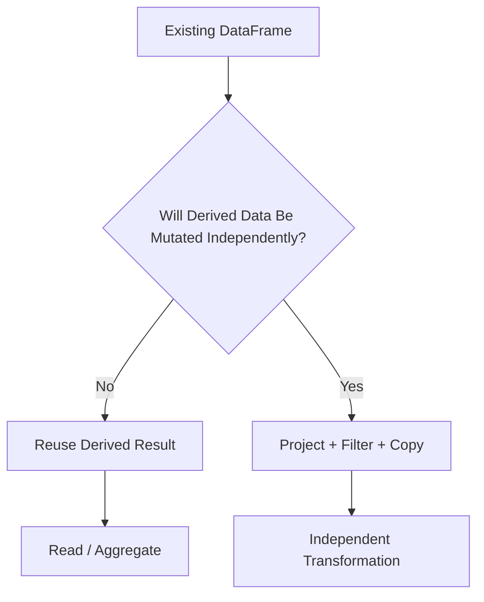
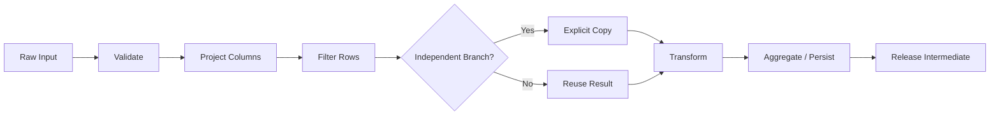

# 09- Avoiding Unnecessary Copies

## Overview

Unnecessary DataFrame copies are one of the most common causes of avoidable memory growth in Pandas pipelines.

A copy may be required for correctness, ownership isolation, or compatibility with a transformation strategy. The problem is copying by habit:

```python
df = df.copy()
```

after every operation, or:

```python
stage_a = df.copy()
stage_b = stage_a.copy()
stage_c = stage_b.copy()
```

For large datasets, every unnecessary copy can increase:

```text
peak memory
allocation cost
CPU time
garbage-collection pressure
pipeline latency
container resource requirements
```

The correct strategy is not:

> Never copy.

It is:

> Create independent storage only when the processing contract requires it, and make the copied object as small as possible.

A memory-aware Pandas pipeline therefore treats copy decisions as part of dataflow design:

```text
source
  ↓
project required columns
  ↓
filter required rows
  ↓
ownership decision
  ├── read-only → avoid unnecessary copy
  └── independent mutation → copy
  ↓
transform
  ↓
persist / release
```

---

## Why Unnecessary Copies Matter

Suppose a DataFrame consumes:

```text
4 GB
```

Creating an additional full-frame copy can require several more gigabytes of memory depending on the columns and operation involved.

If the pipeline then creates:

```text
raw        → 4 GB
cleaned    → 4 GB
enriched   → 5 GB
result     → 500 MB
```

the process may require substantially more memory than the final output suggests.

This can cause:

```text
container OOM
worker restart
job retry
longer execution time
higher cloud cost
```

The problem is especially important in:

```text
Kubernetes Jobs
Celery workers
AWS Batch
scheduled ETL
large reporting jobs
```

---

## What Counts as an Unnecessary Copy?

A copy is unnecessary when:

```text
the data does not need independent ownership
no mutation isolation is required
the operation already creates the required result object
a narrower selection could be copied instead
the copy exists only because of habit
```

For example:

```python
summary = (
    orders
    .groupby("customer_id", as_index=False)
    .agg(
        total=("amount", "sum"),
    )
)

summary = summary.copy()
```

The second copy usually provides no additional semantic value.

Similarly:

```python
filtered = (
    orders.loc[
        orders["status"].eq("completed")
    ]
    .copy()
)

filtered = filtered.copy()
```

is redundant.

---

## What Counts as a Necessary Copy?

A copy can be justified when:

```text
an independent mutable branch is required
the API contract explicitly promises input isolation
a transformation must not affect the source
ownership needs to be made explicit
downstream code requires an independently owned object
```

Example:

```python
completed = orders.loc[
    orders["status"].eq("completed"),
    [
        "order_id",
        "customer_id",
        "amount",
    ],
].copy()

completed["amount"] *= 1.05
```

Here the copy establishes a clear branch that can be modified independently.

---

## The Core Ownership Question

Before copying, ask:

> Who owns the data after this operation?

Typical answers are:

```text
same stage
new stage
read-only consumer
independent branch
```

A useful model is:



Ownership should be intentional rather than inferred from how indexing happens to behave internally.

---

## Assignment Is Not a Copy

Python assignment creates another reference to the same object.

```python
a = orders
b = a
```

Conceptually:

```text
a ─┐
   ├──> same DataFrame object
b ─┘
```

Therefore:

```python
b["priority"] = "high"
```

also changes what `a` refers to.

This is ordinary Python reference behavior.

If independent ownership is required:

```python
b = orders.copy()
```

---

## Avoid Defensive Copies by Habit

A common pattern is:

```python
def process_orders(
    orders: pd.DataFrame,
) -> pd.DataFrame:
    orders = orders.copy()
    ...
```

This may be reasonable if the function's contract requires:

```text
input is never mutated
```

But if the function does not mutate the input and only creates derived results, the copy may be unnecessary.

For example:

```python
def customer_totals(
    orders: pd.DataFrame,
) -> pd.DataFrame:
    return (
        orders
        .groupby(
            "customer_id",
            as_index=False,
        )
        .agg(
            total=("amount", "sum"),
        )
    )
```

There is no need to copy `orders` merely because it is a function argument.

---

## Copy Only What You Need

When a copy is required, reduce the working set first.

Prefer:

```python
completed = orders.loc[
    orders["status"].eq("completed"),
    [
        "order_id",
        "customer_id",
        "amount",
    ],
].copy()
```

over:

```python
completed = orders.loc[
    orders["status"].eq("completed")
].copy()

completed = completed[
    [
        "order_id",
        "customer_id",
        "amount",
    ]
]
```

The first pattern establishes:

```text
row selection
+
column projection
+
ownership
```

in one operation.

This becomes important when the source contains large columns such as:

```text
raw_payload
message
metadata
HTML
debug_data
```

---

## Filter Before Copy

Suppose only 15% of records are needed.

Instead of:

```python
completed = orders[
    [
        "order_id",
        "customer_id",
        "amount",
    ]
].copy()

completed = completed.loc[
    completed["status"].eq("completed")
]
```

prefer:

```python
completed = orders.loc[
    orders["status"].eq("completed"),
    [
        "order_id",
        "customer_id",
        "amount",
    ],
].copy()
```

This minimizes the size of the independent object.

---

## Project Before Copy

If the source DataFrame is wide:

```python
required = [
    "customer_id",
    "amount",
    "created_at",
]

subset = orders.loc[
    :,
    required,
].copy()
```

This is generally preferable to:

```python
subset = orders.copy()

subset = subset[
    required
]
```

The second pattern copies columns that will immediately be discarded.

---

## Copy After Filtering When Mutation Is Required

A common production pattern is:

```python
failed = logs.loc[
    logs["status"].eq("failed"),
    [
        "event_id",
        "message",
    ],
].copy()

failed["message"] = (
    failed["message"]
    .str.strip()
)
```

The copy is justified because:

```text
failed
```

is becoming an independently transformed dataset.

---

## Avoid Copying Read-Only Derived Results

When the result is only consumed:

```python
regional_revenue = (
    orders
    .groupby(
        "region",
        as_index=False,
    )
    .agg(
        revenue=("amount", "sum"),
    )
)
```

do not add:

```python
regional_revenue = (
    regional_revenue.copy()
)
```

unless the extra ownership boundary serves a real purpose.

Derived operations already return result objects.

---

## GroupBy Results

A groupby aggregation:

```python
summary = (
    orders
    .groupby("customer_id")
    .agg(
        total=("amount", "sum"),
    )
)
```

already creates a result object.

A redundant:

```python
summary = summary.copy()
```

adds memory cost without changing the logical result.

This is a common example of defensive copying that should be removed.

---

## Merge Results

Likewise:

```python
result = orders.merge(
    customers,
    on="customer_id",
    how="left",
    validate="many_to_one",
)
```

already produces a separate result.

Avoid:

```python
result = orders.merge(...).copy()
```

unless a second explicit ownership boundary is required.

If the merge is large, the join itself may already be the dominant memory allocation.

---

## Concat Results

Similarly:

```python
combined = pd.concat(
    [
        january,
        february,
    ],
    ignore_index=True,
)
```

returns a result object.

Do not immediately copy it again:

```python
combined = pd.concat(...).copy()
```

without a specific semantic reason.

---

## Sorting Results

`sort_values()` produces a result when assigned:

```python
sorted_orders = orders.sort_values(
    "created_at",
)
```

Do not automatically follow it with:

```python
sorted_orders = (
    sorted_orders.copy()
)
```

The additional copy is usually unnecessary.

---

## Renaming and Other Transformations

Likewise, do not copy every transformation:

```python
renamed = (
    orders
    .rename(
        columns={
            "amount": "order_amount",
        }
    )
    .copy()
)
```

unless the additional copy establishes something the result itself does not provide.

The question is always:

```text
What does this additional copy buy us?
```

If the answer is:

```text
nothing
```

remove it.

---

## Method Chains and Copy Decisions

Method chains can make copy placement less obvious.

For example:

```python
completed = (
    orders
    .loc[
        orders["status"].eq("completed"),
        [
            "customer_id",
            "amount",
            "discount",
        ],
    ]
    .copy()
    .assign(
        net_amount=lambda df:
            df["amount"] - df["discount"],
    )
)
```

Here the copy establishes an intentional independent branch.

Compare that with:

```python
result = (
    orders
    .groupby("customer_id")
    .agg(
        total=("amount", "sum"),
    )
    .copy()
)
```

The latter usually has no corresponding ownership requirement.

---

## Copy at Meaningful Boundaries

Good copy boundaries often align with pipeline stages:

```text
raw source
   ↓
normalized data
   ↓
filtered business subset
   ↓
independent transformation
   ↓
output
```

For example:

```python
normalized = normalize_orders(raw)

completed = normalized.loc[
    normalized["status"].eq("completed"),
    [
        "order_id",
        "customer_id",
        "amount",
    ],
].copy()

report = build_report(
    completed,
)
```

The copy is associated with the transition to an independently mutable subset rather than inserted after every operation.

---

## Branching Pipelines

Suppose the same source feeds two independent workflows:

```text
orders
├── revenue report
└── fraud report
```

Each branch can define its own ownership:

```python
revenue_orders = orders.loc[
    orders["status"].eq("completed"),
    [
        "customer_id",
        "amount",
    ],
].copy()

fraud_orders = orders.loc[
    orders["risk_score"].ge(80),
    [
        "order_id",
        "customer_id",
        "amount",
        "risk_score",
    ],
].copy()
```

Do not copy the entire source first:

```python
base = orders.copy()

revenue_orders = ...
fraud_orders = ...
```

The latter unnecessarily duplicates data that neither branch may need.

---

## Copy-On-Write

Modern Pandas provides Copy-on-Write semantics that can avoid some eager copying by allowing objects to share data until mutation requires isolation.

Conceptually:

```text
derived object
      ↓
shared underlying data
      ↓
read
      ↓
no required physical copy

mutation
      ↓
materialize isolated storage as needed
```

This can improve memory behavior in some workflows.

However:

```text
Copy-on-Write ≠ no memory allocations
Copy-on-Write ≠ no need for ownership reasoning
```

A mutation can still trigger new allocations.

---

## Why Copy-on-Write Changes the Optimization Strategy

Without Copy-on-Write, developers may overuse explicit copies to avoid uncertain mutation behavior.

With Copy-on-Write, the system can often defer physical copying.

Nevertheless, explicit `.copy()` remains useful when the code needs to communicate:

```text
this is now an independent processing branch
```

The right question becomes:

```text
Do I need explicit ownership here?
```

rather than:

```text
Can I force Pandas to share memory?
```

---

## Do Not Rely on Accidental Sharing

Avoid application logic that assumes:

```text
this slice must share memory
```

or:

```text
this slice must be fully independent
```

based solely on implementation details.

Behavior can depend on:

```text
Pandas version
operation
dtype
Copy-on-Write configuration
internal representation
```

Use documented APIs and explicit ownership decisions.

---

## `deep=False`

A shallow copy can be requested:

```python
view_like = orders.copy(
    deep=False,
)
```

This should not become the default memory optimization technique.

Its behavior is tied to Pandas' copy semantics and can interact with Copy-on-Write.

Use it only when:

```text
shared data semantics are intentional
```

and the team understands the deployed Pandas behavior.

For general application code, explicit logical ownership is usually more important than forcing shallow sharing.

---

## Full Copy Versus Narrow Copy

Suppose:

```text
100 columns
20 million rows
```

and the next stage needs:

```text
5 columns
```

A full copy:

```python
subset = orders.copy()
```

is substantially more expensive than:

```python
subset = orders.loc[
    :,
    required_columns,
].copy()
```

The second pattern should be the default when an independent subset is required.

---

## Copying String-Heavy Data

String columns can dominate memory.

For example:

```text
message
raw_payload
description
html
metadata
```

If the next stage needs only:

```python
[
    "event_id",
    "status",
]
```

do not copy the raw text columns:

```python
subset = logs.loc[
    :,
    [
        "event_id",
        "status",
    ],
].copy()
```

This is often much more impactful than optimizing small numeric columns.

---

## Copy and Dtype Optimization

Performing dtype optimization before branching can reduce the memory cost of derived objects.

For example:

```python
orders["status"] = (
    orders["status"]
    .astype("category")
)
```

then:

```python
completed = orders.loc[
    orders["status"].eq("completed"),
].copy()
```

This can be preferable to copying a large object-backed string column first and categorizing afterward.

The ideal stage depends on whether the dtype conversion itself is worth performing for the entire source or only for a branch.

---

## Copy and Filtering

Filtering both reduces rows and can establish a meaningful ownership boundary:

```python
high_value = orders.loc[
    orders["amount"].gt(10_000),
    [
        "order_id",
        "customer_id",
        "amount",
    ],
].copy()
```

This is an efficient pattern when `high_value` will be independently modified.

It avoids copying:

```text
low-value orders
unused columns
```

that the branch will never need.

---

## Copy and Sorting

If a branch needs independent sorting:

```python
customer_orders = orders.loc[
    orders["customer_id"].eq(customer_id),
    required_columns,
].copy()

customer_orders = (
    customer_orders
    .sort_values("created_at")
)
```

The important memory decision occurs at branch creation.

There is usually no reason to copy again after sorting.

---

## Copy and Resetting the Index

Avoid redundant copies such as:

```python
result = (
    filtered
    .reset_index(drop=True)
    .copy()
)
```

unless there is an independent ownership requirement after `reset_index()`.

Likewise:

```python
result = filtered.copy()

result = (
    result
    .reset_index(drop=True)
)
```

may be unnecessarily expensive.

Choose the operation sequence based on actual ownership needs.

---

## Copy and Empty DataFrames

Copy optimization should not break empty-input behavior.

Example:

```python
completed = orders.loc[
    orders["status"].eq("completed"),
    [
        "order_id",
        "customer_id",
        "amount",
    ],
].copy()
```

If the result is empty, its schema should still be validated.

For stable output contracts, explicitly construct or normalize the expected columns and dtypes when required.

---

## Copy and Invalid Input

Do not copy large invalid datasets unnecessarily before rejecting them.

Prefer validating cheap structural conditions early:

```python
required_columns = {
    "order_id",
    "customer_id",
    "amount",
}

missing = (
    required_columns
    - set(orders.columns)
)

if missing:
    raise ValueError(
        f"Missing columns: {sorted(missing)}"
    )
```

Then perform expensive copying only after the input satisfies the structural contract.

---

## Copy and Duplicate Data

Duplicate rows can also increase copy cost.

If duplicates should be removed before a branch:

```python
unique_orders = (
    orders
    .drop_duplicates(
        subset=["order_id"],
    )
)
```

then copy only if the resulting object needs independent mutation:

```python
unique_orders = (
    orders
    .drop_duplicates(
        subset=["order_id"],
    )
    .copy()
)
```

Do not copy the entire duplicated dataset first unless the workflow requires it.

---

## Copy and ETL

A memory-efficient ETL process can be structured as:



The copy decision is made at a meaningful transformation boundary.

This is more robust than sprinkling `.copy()` throughout every function.

---

## Chunk Processing

In chunked pipelines:

```python
for chunk in pd.read_csv(
    "orders.csv",
    chunksize=100_000,
):
    completed = chunk.loc[
        chunk["status"].eq("completed"),
        [
            "customer_id",
            "amount",
        ],
    ].copy()

    process(completed)
```

The copied DataFrame is bounded by the chunk size and selected columns.

Avoid:

```python
results = []

for chunk in ...:
    results.append(
        chunk.copy()
    )
```

because this accumulates independent copies until the entire input has effectively been retained.

---

## Incremental Persistence

If each batch can be persisted independently:

```python
for chunk in pd.read_csv(
    "orders.csv",
    chunksize=100_000,
):
    result = transform_chunk(
        chunk,
    )

    write_result(result)
```

This is preferable to:

```python
processed = []

for chunk in ...:
    processed.append(
        transform_chunk(chunk)
    )

final = pd.concat(processed)
```

when the processed data is already large.

Incremental persistence keeps object lifetimes bounded.

---

## Backend Architecture

For a backend data-processing service:

```text
PostgreSQL / REST API / S3
        ↓
bounded extraction
        ↓
Pandas DataFrame
        ↓
projection + filtering
        ↓
explicit branch ownership where required
        ↓
vectorized transformation
        ↓
validation
        ↓
Parquet / PostgreSQL / report
```

A good architecture keeps DataFrames task-local.

Do not maintain shared mutable DataFrames across:

```text
FastAPI workers
Django requests
Celery tasks
Kafka consumers
```

and attempt to manage concurrency through copy behavior.

---

## Memory Monitoring

Track memory at stages where copies may occur:

```python
import os

import psutil


process = psutil.Process(
    os.getpid(),
)


def rss_mb() -> float:
    return (
        process.memory_info().rss
        / 1024**2
    )


before = rss_mb()

completed = orders.loc[
    orders["status"].eq("completed"),
    [
        "customer_id",
        "amount",
    ],
].copy()

after = rss_mb()

logger.info(
    "branch_created",
    extra={
        "rss_before_mb": before,
        "rss_after_mb": after,
        "rss_delta_mb": after - before,
        "rows": len(completed),
    },
)
```

This makes copy cost observable.

Do not log sensitive row contents.

---

## Measuring DataFrame Memory

Use:

```python
def memory_mb(
    df: pd.DataFrame,
) -> float:
    return (
        df.memory_usage(
            deep=True,
        )
        .sum()
        / 1024**2
    )
```

Compare:

```python
print(
    {
        "orders_mb": memory_mb(orders),
        "completed_mb": memory_mb(completed),
    }
)
```

This helps determine whether a copy is material relative to the overall pipeline.

---

## Benchmark Copy Decisions

Measure:

```text
runtime
DataFrame memory
peak RSS
row count
column count
```

Compare:

```text
full copy
vs
narrow copy
vs
no copy
```

For example:

```python
from time import perf_counter

started = perf_counter()

subset = orders.loc[
    orders["status"].eq("completed"),
    required_columns,
].copy()

elapsed = (
    perf_counter() - started
)

print(
    {
        "seconds": elapsed,
        "memory_mb": memory_mb(subset),
        "rows": len(subset),
    }
)
```

Use production-like data sizes.

A benchmark with 1,000 rows is not enough to validate memory behavior for a job processing 50 million rows.

---

## Copy Decisions and Testing

Tests should validate observable ownership behavior.

Example:

```python
def test_branch_can_be_modified_without_changing_source(
    orders: pd.DataFrame,
) -> None:
    original = orders.copy(deep=True)

    completed = orders.loc[
        orders["status"].eq("completed"),
        [
            "order_id",
            "amount",
        ],
    ].copy()

    completed["amount"] = (
        completed["amount"] * 1.10
    )

    pd.testing.assert_frame_equal(
        orders,
        original,
    )
```

The important contract is:

```text
independent branch mutation
→ source remains unchanged
```

Do not test internal view flags as the primary application contract.

---

## Testing No Unnecessary Mutation

For functions that should be read-only:

```python
def calculate_revenue(
    orders: pd.DataFrame,
) -> pd.DataFrame:
    return (
        orders
        .groupby(
            "customer_id",
            as_index=False,
        )
        .agg(
            revenue=("amount", "sum"),
        )
    )
```

Test that the input remains unchanged:

```python
def test_calculate_revenue_does_not_mutate_input(
    orders: pd.DataFrame,
) -> None:
    original = orders.copy(deep=True)

    calculate_revenue(orders)

    pd.testing.assert_frame_equal(
        orders,
        original,
    )
```

This allows the implementation to avoid an unnecessary defensive copy while still enforcing a useful API contract.

---

## Function Design

Prefer functions whose mutation contract is clear.

A functional-style API:

```python
def normalize_orders(
    orders: pd.DataFrame,
) -> pd.DataFrame:
    result = orders.loc[
        :,
        [
            "order_id",
            "customer_id",
            "amount",
            "status",
        ],
    ].copy()

    result["status"] = (
        result["status"]
        .astype("string")
        .str.strip()
        .str.lower()
    )

    return result
```

has explicit ownership.

An in-place API:

```python
def normalize_orders_in_place(
    orders: pd.DataFrame,
) -> None:
    orders["status"] = (
        orders["status"]
        .astype("string")
        .str.strip()
        .str.lower()
    )
```

has a different contract.

Either can be valid, but the choice should be explicit.

---

## Avoid Copying at Every Function Boundary

This pattern can be expensive:

```python
def clean(df):
    return df.copy()


def transform(df):
    return df.copy()


def aggregate(df):
    return df.copy()
```

A pipeline calling:

```python
df = clean(df)
df = transform(df)
df = aggregate(df)
```

may produce unnecessary allocations.

Instead, define ownership at the appropriate stage:

```python
df = clean(df)

subset = df.loc[
    df["status"].eq("completed"),
    required_columns,
].copy()

result = aggregate(subset)
```

Each function should copy only when its contract requires independent mutation.

---

## Copy and Read-Only Contracts

A useful senior-level pattern is to make transformation functions logically read-only where possible.

For example:

```python
def build_customer_totals(
    orders: pd.DataFrame,
) -> pd.DataFrame:
    return (
        orders
        .groupby(
            "customer_id",
            as_index=False,
        )
        .agg(
            total_amount=("amount", "sum"),
        )
    )
```

The function does not need a defensive copy because it does not mutate `orders`.

This provides:

```text
lower memory
clearer behavior
easier testing
better composability
```

---

## Copy and DataFrame Branching

When branching is unavoidable:

```python
base = orders.loc[
    :,
    [
        "customer_id",
        "amount",
        "status",
    ],
]

completed = base.loc[
    base["status"].eq("completed"),
].copy()

pending = base.loc[
    base["status"].eq("pending"),
].copy()
```

The common schema is narrowed once, while each mutable branch owns only the records it needs.

This can be substantially more efficient than copying the original wide DataFrame twice.

---

## When to Remove a Copy

A copy should be a candidate for removal when:

```text
the next operation is read-only
the result already owns the data needed by the next stage
the copy is immediately transformed into another result
the source is never mutated
the function does not promise input isolation
```

For example:

```python
summary = (
    orders
    .groupby("region")
    .amount
    .sum()
    .copy()
)
```

The final `.copy()` is normally unnecessary.

---

## When to Keep a Copy

Keep an explicit copy when:

```text
the branch will be independently mutated
the function contract promises input immutability
ownership ambiguity would harm maintainability
the copied subset is intentionally isolated
```

Example:

```python
high_risk = orders.loc[
    orders["risk_score"].ge(80),
    [
        "order_id",
        "customer_id",
        "risk_score",
    ],
].copy()
```

The copy communicates that `high_risk` is an independent processing branch.

---

## Common Mistakes

### `.copy()` After Every Operation

This creates unnecessary allocations.

### Full Copy Before Selecting Columns

Copies data that will immediately be discarded.

### Copying Before Filtering

Copies rows that the next stage will not use.

### Copying GroupBy/Merge Results Again

The result is already a new object.

### Accumulating Copied Chunks

This defeats the purpose of chunk processing.

### Using `deep=False` Without Understanding Semantics

Shallow sharing should be deliberate.

### Assuming Copy-on-Write Means No Memory Cost

Mutation can still materialize data.

### Mutating Shared Global DataFrames

This creates concurrency and correctness problems independent of copy optimization.

### Suppressing Assignment Warnings Instead of Fixing Ownership

Ambiguous mutation should be redesigned, not hidden.

### Optimizing Without Measurement

A removed copy may save little while making ownership less clear.

---

## Production Checklist

```text
[ ] Every explicit copy has a documented or obvious ownership reason
[ ] Rows are filtered before copying when possible
[ ] Required columns are projected before copying
[ ] Large string/blob-like columns are excluded from branches where unnecessary
[ ] GroupBy results are not redundantly copied
[ ] Merge results are not redundantly copied
[ ] Concat results are not redundantly copied
[ ] Sort and aggregation results are not defensively copied without reason
[ ] Functions do not defensively copy read-only inputs without a contract reason
[ ] Transformation functions have clear mutation semantics
[ ] Independent branches use explicit ownership
[ ] `.loc` is used for intentional mutation of an existing DataFrame
[ ] Chained assignment is avoided
[ ] Copy-on-Write behavior is understood for the deployed Pandas version
[ ] `deep=False` is used only intentionally
[ ] Large chunked pipelines do not accumulate every copied result
[ ] Join cardinality is validated before large merges
[ ] Peak RSS is monitored for memory-sensitive jobs
[ ] DataFrame memory is profiled with `deep=True`
[ ] Copy-heavy stages are benchmarked using representative data
[ ] Tests verify source isolation where required
[ ] Shared mutable DataFrames are not used across concurrent requests/tasks
[ ] Empty and invalid inputs preserve expected schema behavior
```

## Interview Perspective

### Why Are Unnecessary Copies Dangerous?

They increase memory usage and can create large temporary allocations. At scale, this can become an OOM or cloud-cost problem.

### Should You Always Call `.copy()` After Filtering?

No. Use a copy when the filtered object needs independent mutation or explicit ownership isolation.

### Why Project Columns Before Copying?

Because the copied object contains only the data required by the downstream operation, reducing both allocation size and peak memory.

### Does `groupby()` Need a `.copy()` Afterwards?

Normally no. Groupby aggregations return result objects, so an immediate additional copy is generally redundant.

### How Does Copy-on-Write Change the Picture?

Copy-on-Write can defer physical copying until mutation, reducing some unnecessary eager copies. It does not eliminate memory allocations or the need to reason about ownership and mutation.

### What Is the Best Rule for Copying?

Copy intentionally at meaningful ownership boundaries, after reducing rows and columns as much as practical.

## Key Takeaways

- Do not treat `.copy()` as a safety ritual; every explicit copy should have a clear ownership, mutation-isolation, or API-contract reason.
- When a copy is required, filter rows and project columns first so the independent object contains only the data needed by the next processing stage.
- Avoid redundant copies after operations that already produce result objects, such as `groupby()`, `merge()`, `concat()`, sorting, and aggregations.
- Copy strategy must account for modern Copy-on-Write behavior, peak memory, chunking, joins, and long-lived backend workers rather than relying on historical view/copy assumptions.
- Measure copy-heavy stages and test observable ownership behavior so memory optimization does not introduce mutation bugs or weaken maintainability.