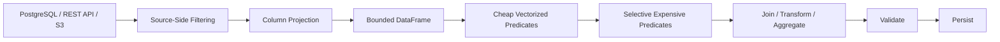

# 10- Efficient Filtering

## Overview

Efficient filtering is the practice of selecting only the rows required for a computation while minimizing CPU work, memory allocations, and unnecessary data movement.

Filtering is one of the highest-value optimization opportunities in Pandas because every row removed early can reduce the cost of subsequent:

```text
transformations
joins
groupby operations
sorting
string processing
serialization
```

A production-oriented filtering strategy is:

```text
filter at source when possible
        ↓
project required columns
        ↓
apply cheap predicates early
        ↓
apply expensive predicates only to candidates
        ↓
perform transformations on the reduced dataset
```

The objective is not simply to make a boolean expression faster. It is to reduce the amount of data that every downstream operation has to process.

---

## Why Filtering Performance Matters

Consider:

```text
50 million input rows
```

where only:

```text
2 million rows
```

are relevant.

If the pipeline performs expensive processing before filtering:

```text
50M rows
→ regex
→ datetime extraction
→ join
→ aggregation
→ filter
```

it performs unnecessary work.

A better design is:

```text
50M rows
→ cheap filter
→ 2M rows
→ expensive processing
→ aggregation
```

The performance improvement can be much larger than optimizing the final aggregation itself.

---

## Filtering Strategy

A useful optimization hierarchy is:

```text
Database / API filtering
        ↓
File-level filtering / column projection
        ↓
Cheap Pandas predicates
        ↓
Selective expensive predicates
        ↓
Expensive transformations
```

For example:

```text
PostgreSQL WHERE
→ Parquet column/partition pruning
→ Pandas status/date filter
→ regex on remaining rows
```

This minimizes data entering each subsequent stage.

---

## Vectorized Boolean Filtering

Prefer vectorized boolean masks:

```python
completed = orders.loc[
    orders["status"].eq("completed")
]
```

For multiple conditions:

```python
high_value_completed = orders.loc[
    orders["status"].eq("completed")
    & orders["amount"].gt(10_000)
]
```

This is preferable to row-wise processing:

```python
high_value_completed = orders.loc[
    orders.apply(
        lambda row:
            row["status"] == "completed"
            and row["amount"] > 10_000,
        axis=1,
    )
]
```

Vectorized predicates avoid unnecessary Python-level row processing.

---

## `.loc` for Filtering

`.loc` clearly separates:

```text
row predicate
column projection
```

Example:

```python
filtered = orders.loc[
    orders["status"].eq("completed"),
    [
        "order_id",
        "customer_id",
        "amount",
    ],
]
```

This is often better than:

```python
filtered = orders[
    orders["status"].eq("completed")
][
    [
        "order_id",
        "customer_id",
        "amount",
    ]
]
```

The `.loc` form communicates the full selection in one operation.

---

## Filter and Project Together

If the next stage needs only a few columns, combine row and column selection:

```python
completed = orders.loc[
    orders["status"].eq("completed"),
    [
        "order_id",
        "customer_id",
        "amount",
        "created_at",
    ],
]
```

This prevents unnecessary columns from being carried into downstream processing.

If the result will be independently mutated:

```python
completed = orders.loc[
    orders["status"].eq("completed"),
    [
        "order_id",
        "customer_id",
        "amount",
        "created_at",
    ],
].copy()
```

The copy is an ownership decision, not a filtering requirement.

---

## Equality Predicates

Prefer explicit Series methods:

```python
completed = orders.loc[
    orders["status"].eq("completed")
]
```

over:

```python
completed = orders.loc[
    orders["status"] == "completed"
]
```

Both are valid.

Methods such as:

```text
eq
ne
gt
ge
lt
le
```

can improve consistency when composing more complex vectorized expressions.

Example:

```python
filtered = orders.loc[
    orders["amount"].ge(1_000)
    & orders["amount"].lt(50_000)
]
```

---

## Range Filtering

For a numeric range:

```python
filtered = orders.loc[
    orders["amount"].between(
        1_000,
        50_000,
        inclusive="left",
    )
]
```

This is useful for expressions representing:

```text
lower bound
≤ value
< upper bound
```

For timestamps:

```python
filtered = events.loc[
    events["event_time"].ge(start_time)
    & events["event_time"].lt(end_time)
]
```

The half-open interval:

```text
[start, end)
```

is particularly useful for ETL windows because adjacent batches do not overlap.

---

## Date and Time Filtering

Prefer typed datetime columns:

```python
events["event_time"] = pd.to_datetime(
    events["event_time"],
    utc=True,
    errors="raise",
)
```

Then filter directly:

```python
daily_events = events.loc[
    events["event_time"].ge(start_time)
    & events["event_time"].lt(end_time)
]
```

Avoid repeatedly parsing strings during filtering.

Datetime normalization should happen near ingestion.

---

## Boolean Combinations

Use:

```python
&
|
~
```

for Series-level boolean logic.

Example:

```python
eligible = orders.loc[
    orders["status"].eq("completed")
    & (
        orders["amount"].gt(1_000)
        | orders["priority"].eq("high")
    )
]
```

Do not use:

```python
and
or
not
```

with Pandas Series.

Always use parentheses around compound conditions.

---

## `isin()`

For finite membership sets:

```python
supported_regions = {
    "IN",
    "SG",
    "AE",
}

filtered = customers.loc[
    customers["region"].isin(
        supported_regions
    )
]
```

For exclusions:

```python
filtered = customers.loc[
    ~customers["region"].isin(
        blocked_regions
    )
]
```

This is preferable to row-wise membership functions.

---

## `query()`

`query()` can make complex filtering more readable:

```python
filtered = orders.query(
    "status == 'completed' and amount > 10000"
)
```

It is useful when:

```text
expressions are easier to read as strings
column names interact awkwardly with Python expressions
the filtering logic is large enough to benefit from a query-style form
```

However, do not treat `query()` as automatically faster than ordinary boolean masks.

Choose based on:

```text
clarity
correctness
maintainability
measured performance
```

---

## `query()` and External Values

Use parameter substitution rather than dynamically constructing query strings.

Example:

```python
minimum_amount = 10_000

filtered = orders.query(
    "status == 'completed' and "
    "amount >= @minimum_amount"
)
```

This avoids fragile string interpolation.

Do not construct queries from untrusted input through string concatenation.

---

## Filtering Missing Values

Use explicit null predicates:

```python
valid_orders = orders.loc[
    orders["customer_id"].notna()
    & orders["amount"].notna()
]
```

For rows requiring a missing value:

```python
missing_customer = orders.loc[
    orders["customer_id"].isna()
]
```

This is preferable to:

```python
orders["customer_id"] == None
```

because Pandas missing-value semantics are more complex than Python `None` equality.

---

## Filtering Invalid Values

Validate numeric ranges before expensive processing:

```python
valid = orders.loc[
    orders["amount"].ge(0)
    & orders["amount"].le(1_000_000)
]
```

Invalid rows can be isolated:

```python
invalid = orders.loc[
    orders["amount"].lt(0)
    | orders["amount"].gt(1_000_000)
]
```

This is useful for ETL pipelines where invalid records should be:

```text
rejected
quarantined
logged
reprocessed
```

rather than silently incorporated into reports.

---

## Filter Before Expensive String Operations

Regex and large string transformations can be expensive.

Instead of:

```python
logs["request_id"] = (
    logs["message"]
    .str.extract(
        r"request_id=(?P<request_id>[A-Za-z0-9-]+)",
        expand=False,
    )
)

errors = logs.loc[
    logs["level"].eq("ERROR")
]
```

prefer:

```python
errors = logs.loc[
    logs["level"].eq("ERROR"),
    [
        "event_id",
        "message",
    ],
].copy()

errors["request_id"] = (
    errors["message"]
    .str.extract(
        r"request_id=(?P<request_id>[A-Za-z0-9-]+)",
        expand=False,
    )
)
```

Only candidate rows incur the regex cost.

---

## Filter Before Datetime Extraction

If only a small subset is required, filter first.

```python
api_events = events.loc[
    events["event_type"].eq("api_request"),
    [
        "event_id",
        "event_time",
    ],
].copy()

api_events["event_hour"] = (
    api_events["event_time"]
    .dt.hour
)
```

This prevents unnecessary datetime component extraction for unrelated rows.

---

## Filter Before Joins

Reduce both sides where business semantics allow it.

```python
completed_orders = orders.loc[
    orders["status"].eq("completed"),
    [
        "order_id",
        "customer_id",
        "amount",
    ],
]

active_customers = customers.loc[
    customers["is_active"].eq(True),
    [
        "customer_id",
        "segment",
    ],
]

result = completed_orders.merge(
    active_customers,
    on="customer_id",
    how="left",
    validate="many_to_one",
)
```

This reduces:

```text
join input size
join working memory
join CPU
result size
```

Always verify that filtering does not change the intended business semantics.

---

## Filter Before GroupBy

Instead of aggregating all orders:

```python
summary = (
    orders
    .groupby("customer_id")
    .amount
    .sum()
)
```

filter unnecessary rows first:

```python
summary = (
    orders.loc[
        orders["status"].eq("completed"),
        [
            "customer_id",
            "amount",
        ],
    ]
    .groupby("customer_id")["amount"]
    .sum()
)
```

This reduces the number of rows entering the grouping operation.

---

## Filter Before Sorting

If only a subset needs ordering:

```python
recent = orders.loc[
    orders["created_at"].ge(cutoff),
    [
        "order_id",
        "customer_id",
        "amount",
        "created_at",
    ],
]

recent = recent.sort_values(
    "created_at",
)
```

Avoid sorting the entire historical dataset if only recent records are relevant.

---

## `nlargest()` and Top-N Filtering

When the requirement is:

```text
top 100 orders by amount
```

prefer:

```python
top_orders = orders.nlargest(
    100,
    "amount",
)
```

instead of:

```python
top_orders = (
    orders
    .sort_values(
        "amount",
        ascending=False,
    )
    .head(100)
)
```

`nlargest()` is designed specifically for top-N selection and can avoid fully sorting the entire DataFrame.

---

## `nsmallest()`

Likewise:

```python
lowest_orders = orders.nsmallest(
    100,
    "amount",
)
```

is appropriate when only the smallest values are required.

Use top-N methods when you do not need the full sorted order.

---

## Duplicate-Aware Filtering

Filtering can be combined with duplicate detection.

Example:

```python
duplicate_customers = customers.loc[
    customers["customer_id"]
    .duplicated(keep=False)
]
```

Then:

```python
valid_customers = customers.loc[
    ~customers["customer_id"].duplicated(
        keep="last",
    )
]
```

Be careful to define the business rule before deduplicating.

Filtering duplicates for memory optimization should never silently discard records that are required for auditing or reconciliation.

---

## Filter Ordering

Not all predicates have the same cost.

Suppose:

```text
status check     → cheap
numeric range    → cheap
regex extraction → expensive
```

Prefer:

```text
cheap filters
→ expensive filters
```

Example:

```python
candidates = logs.loc[
    logs["service"].eq("payments")
    & logs["level"].eq("ERROR")
]

matches = candidates.loc[
    candidates["message"].str.contains(
        "timeout|connection reset",
        regex=True,
        na=False,
    )
]
```

The regex runs only on relevant payment error records.

Do not reorder filters if doing so changes the meaning of the workflow.

---

## Selectivity

A filter's **selectivity** describes how much data it removes.

For example:

```text
100 million rows
→ status filter
→ 5 million rows
```

is highly selective.

A predicate that removes only:

```text
1%
```

may have less impact.

Prioritize filters that are:

```text
cheap
highly selective
safe to apply early
```

This is a useful general optimization principle.

---

## Predicate Ordering

For independent predicates, a useful pattern is:

```text
cheap + selective
        ↓
cheap + selective
        ↓
moderately expensive
        ↓
expensive regex / custom logic
```

Example:

```python
candidates = events.loc[
    events["event_type"].eq("payment")
    & events["amount"].gt(1_000)
]

suspicious = candidates.loc[
    candidates["payload"]
    .str.contains(
        "chargeback",
        regex=False,
        na=False,
    )
]
```

Do not reorder filters if doing so changes the meaning of the workflow.

---

## Filtering at the Database

The largest performance gain may occur before Pandas.

Instead of:

```python
orders = pd.read_sql(
    "SELECT * FROM orders",
    connection,
)

orders = orders.loc[
    orders["status"].eq("completed")
]
```

prefer:

```python
orders = pd.read_sql(
    """
    SELECT
        order_id,
        customer_id,
        amount,
        created_at
    FROM orders
    WHERE status = %(status)s
    """,
    connection,
    params={
        "status": "completed",
    },
)
```

This moves filtering to the database and reduces:

```text
database result size
network traffic
Pandas memory
Pandas CPU
```

---

## Database Indexes

Database-side filtering becomes more effective when supported by appropriate indexes.

For example:

```sql
CREATE INDEX CONCURRENTLY IF NOT EXISTS
    idx_orders_status_created_at
ON orders (status, created_at);
```

Whether a particular index is beneficial depends on:

```text
data distribution
query predicates
query frequency
write volume
query planner behavior
```

Inspect the database query plan rather than assuming an index will improve every query.

---

## API-Side Filtering

For REST APIs, use server-side filtering where available:

```text
GET /orders?status=completed&start=...&end=...
```

rather than:

```text
download every order
→ filter in Pandas
```

For large API datasets combine:

```text
pagination
time windows
field projection
incremental cursors
```

with Pandas processing.

---

## Parquet and Efficient Filtering

With analytical files, filtering can often be moved closer to storage through:

```text
partition pruning
column projection
predicate pushdown where supported by the reader/storage engine
```

For example:

```python
events = pd.read_parquet(
    "events/",
    columns=[
        "event_id",
        "event_time",
        "event_type",
        "amount",
    ],
)
```

For datasets partitioned by date:

```text
year=2026/month=09/
```

read only the relevant partitions when the storage/read path supports that access pattern.

This can be more effective than reading everything and filtering afterward.

---

## Filtering Large Datasets with Chunks

When the source does not support efficient filtering, use bounded input:

```python
for chunk in pd.read_csv(
    "orders.csv",
    usecols=[
        "order_id",
        "customer_id",
        "status",
        "amount",
    ],
    chunksize=100_000,
):
    completed = chunk.loc[
        chunk["status"].eq("completed")
    ]

    process(completed)
```

This controls memory while allowing filtering to occur incrementally.

Do not accumulate every filtered chunk unless the combined result is known to fit safely in memory.

---

## Filtering and Empty Results

Efficient filtering must handle zero matching rows.

```python
completed = orders.loc[
    orders["status"].eq("completed")
]

if completed.empty:
    return empty_report()
```

For stable downstream schemas, define the expected output even when no rows match.

Do not assume every batch contains qualifying records.

---

## Filtering and Missing Values

A predicate such as:

```python
orders["status"].eq("completed")
```

can produce missing/nullable boolean behavior depending on the Series dtype and values.

For production filtering, define null behavior explicitly.

For string searches:

```python
logs["message"].str.contains(
    "timeout",
    regex=False,
    na=False,
)
```

The `na=False` choice means missing messages are treated as non-matches.

That is appropriate only if that is the intended business behavior.

---

## Filtering Categorical Data

Categorical columns can be efficient filtering dimensions:

```python
orders["status"] = (
    orders["status"]
    .astype("category")
)

completed = orders.loc[
    orders["status"].eq("completed")
]
```

Category dtype is most useful when the values are:

```text
low-cardinality
repeated
stable
```

Do not convert every filtering column to category without measuring actual workload benefits.

---

## Filtering by Index

If a DataFrame has a meaningful `DatetimeIndex`, time-based selection can be concise:

```python
events = (
    events
    .set_index("event_time")
    .sort_index()
)

recent = events.loc[
    start_time:end_time
]
```

An index can make repeated time-based access convenient.

However, a Pandas index is not equivalent to a database index, and index-based filtering should not be assumed to have database-style lookup performance in every workload.

---

## Filtering with `MultiIndex`

For hierarchical indexes:

```python
result = df.loc[
    ("IN", "completed"),
    :
]
```

For repeated access patterns, an appropriately structured index can improve selection ergonomics.

However, index complexity can also increase:

```text
memory
maintenance cost
schema complexity
```

Use indexes because the access pattern requires them, not merely because indexed filtering sounds faster.

---

## Filtering by Position

`.iloc` is position-based:

```python
recent_rows = orders.iloc[
    -100_000:
]
```

This is useful when the requirement is positional rather than semantic.

Do not use positional slicing when the business requirement is:

```text
created_at >= cutoff
```

because row position is not necessarily correlated with business time.

---

## Filtering with Sorted Data

Sorting can make repeated range operations easier to express:

```python
events = (
    events
    .sort_values("event_time")
)

recent = events.loc[
    events["event_time"].ge(cutoff)
]
```

For time-series workloads with frequent temporal access, maintaining a sorted time representation can be valuable.

However, sorting itself has a cost.

Do not sort solely for a single filter if the filter can be performed more cheaply without it.

---

## Avoid Filtering Through Row-Wise `apply()`

Bad:

```python
filtered = orders.loc[
    orders.apply(
        lambda row:
            row["status"] == "completed"
            and row["amount"] > 10_000,
        axis=1,
    )
]
```

Better:

```python
filtered = orders.loc[
    orders["status"].eq("completed")
    & orders["amount"].gt(10_000)
]
```

The vectorized form is:

```text
clearer
more idiomatic
typically faster
easier to optimize
```

---

## Avoid Repeated Filtering

This can repeat the same predicate:

```python
completed = orders.loc[
    orders["status"].eq("completed")
]

count = orders.loc[
    orders["status"].eq("completed")
].shape[0]

total = orders.loc[
    orders["status"].eq("completed"),
    "amount",
].sum()
```

Compute the mask once when reuse justifies retaining it:

```python
completed_mask = (
    orders["status"].eq("completed")
)

completed = orders.loc[
    completed_mask
]

count = int(
    completed_mask.sum()
)

total = completed["amount"].sum()
```

Do not retain masks unnecessarily in extremely large datasets.

Reuse when it meaningfully reduces repeated work.

---

## Filter Once Before Multiple Expensive Operations

A common ETL pattern is:

```python
completed = orders.loc[
    orders["status"].eq("completed"),
    [
        "order_id",
        "customer_id",
        "amount",
        "created_at",
    ],
].copy()

daily = (
    completed
    .groupby(
        completed["created_at"].dt.floor("D"),
        as_index=False,
    )
    .agg(
        revenue=("amount", "sum"),
        order_count=("order_id", "count"),
    )
)
```

The expensive downstream operations work only on the selected subset.

---

## Avoid Materializing Unneeded Results

Filtering itself may create a derived DataFrame.

If the next stage is a boolean test, avoid materializing rows unnecessarily when possible.

For example:

```python
has_large_orders = (
    orders["amount"].gt(100_000).any()
)
```

is more appropriate than:

```python
large_orders = orders.loc[
    orders["amount"].gt(100_000)
]

has_large_orders = not large_orders.empty
```

when only existence is required.

This is an important optimization principle:

> Compute the smallest result that satisfies the requirement.

---

## Existence and Count Checks

Use vectorized reductions when possible:

```python
has_errors = (
    logs["level"].eq("ERROR").any()
)
```

Count matching rows:

```python
error_count = int(
    logs["level"].eq("ERROR").sum()
)
```

Instead of:

```python
errors = logs.loc[
    logs["level"].eq("ERROR")
]

error_count = len(errors)
```

when the DataFrame itself is not required.

This avoids creating an unnecessary filtered object.

---

## Filter Versus Count

Choose the operation based on the requirement.

| Requirement | Prefer |
| --- | --- |
| Need matching rows | Boolean mask + `.loc` |
| Need to know whether any match exists | `.any()` |
| Need number of matching rows | Boolean mask + `.sum()` |
| Need only top N matches | `nlargest()` / `nsmallest()` |
| Need group-level counts | `groupby().size()` or appropriate aggregation |

Avoid materializing a DataFrame when only a scalar answer is required.

---

## Filter Versus Aggregate

Suppose the requirement is:

```text
total revenue from completed orders
```

Use:

```python
completed_revenue = (
    orders.loc[
        orders["status"].eq("completed"),
        "amount",
    ]
    .sum()
)
```

rather than:

```python
completed = orders.loc[
    orders["status"].eq("completed")
]

completed_revenue = (
    completed["amount"].sum()
)
```

The second form is still valid when `completed` is reused, but the first is preferable for a one-off scalar computation.

---

## Filter and Column Pruning Together

For memory-sensitive workloads:

```python
completed_amounts = orders.loc[
    orders["status"].eq("completed"),
    "amount",
]
```

This is more memory-efficient than creating a full filtered DataFrame when only one Series is required.

Likewise:

```python
customer_ids = orders.loc[
    orders["status"].eq("completed"),
    "customer_id",
].dropna()
```

Focus the result on exactly what the next operation consumes.

---

## Production Filtering Pattern

A robust pattern is:

```python
def get_high_value_completed_orders(
    orders: pd.DataFrame,
) -> pd.DataFrame:
    required_columns = [
        "order_id",
        "customer_id",
        "status",
        "amount",
    ]

    missing = (
        set(required_columns)
        - set(orders.columns)
    )

    if missing:
        raise ValueError(
            f"Missing columns: {sorted(missing)}"
        )

    filtered = orders.loc[
        orders["status"].eq("completed")
        & orders["amount"].ge(10_000),
        required_columns,
    ].copy()

    if filtered.empty:
        return pd.DataFrame(
            columns=required_columns,
        )

    return filtered
```

This combines:

```text
schema validation
vectorized predicates
column projection
explicit ownership
empty-result handling
```

---

## Backend Data Flow

A production filtering architecture can look like:



The earlier the data can be eliminated safely, the less work every downstream stage performs.

---

## Monitoring Filtering Effectiveness

For large pipelines, track:

```text
input rows
filtered rows
filter selectivity
processing duration
memory before filter
memory after filter
```

Example:

```python
input_rows = len(orders)

filtered = orders.loc[
    orders["status"].eq("completed")
]

output_rows = len(filtered)

logger.info(
    "order_filter_completed",
    extra={
        "input_rows": input_rows,
        "output_rows": output_rows,
        "selectivity": (
            output_rows / input_rows
            if input_rows
            else 0.0
        ),
    },
)
```

Do not log sensitive row contents.

A sudden change in selectivity can indicate:

```text
upstream data changes
schema drift
business-rule changes
source-system failures
```

---

## Security Considerations

Filtering should not be treated as an access-control mechanism by itself.

For sensitive backend data:

```text
authorization
+
database access controls
+
row-level security
+
application filtering
```

may all be required.

Do not assume:

```python
df.loc[df["customer_id"] == customer_id]
```

provides sufficient isolation if the DataFrame already contains data the caller should never have received.

Security boundaries should be enforced before sensitive data enters the processing context whenever possible.

---

## Cost Considerations

Efficient filtering can reduce:

```text
database transfer
API bandwidth
S3 reads
CPU time
memory requirements
container duration
```

which can lower operational cost.

The highest-value optimization is often:

```text
do not transfer unnecessary data
```

rather than:

```text
make Pandas filtering a few milliseconds faster
```

---

## Common Mistakes

### Loading Everything and Filtering Later

This wastes:

```text
I/O
network
memory
CPU
```

Use source-side filtering when possible.

### Applying Regex Before Cheap Filters

Run expensive predicates only on candidate rows.

### Filtering Through `apply(axis=1)`

Use vectorized masks.

### Selecting All Columns

Project only required fields.

### Materializing Rows for Scalar Questions

Use `.any()`, `.sum()`, `.count()`, or related reductions when the rows themselves are not needed.

### Repeating the Same Predicate

Reuse a mask when the memory trade-off is worthwhile.

### Ignoring Null Semantics

Explicitly define how missing values affect inclusion.

### Filtering by Position for Business Conditions

Use semantic columns such as timestamps, statuses, and IDs rather than assuming row position represents business state.

### Assuming `query()` Is Always Faster

Choose `query()` primarily for readability unless measurement shows a performance advantage.

### Ignoring Join Cardinality After Filtering

Filtering can reduce rows, but a later many-to-many join can still create a large result.

---

## Performance Decision Framework

When optimizing a filter, ask:

```text
Can the source filter the data?
        ↓
Can I project columns during the read?
        ↓
Can cheap, selective predicates run first?
        ↓
Can expensive predicates be delayed?
        ↓
Can I avoid materializing the filtered DataFrame?
        ↓
Can I reuse the predicate safely?
        ↓
Does the filter materially reduce downstream work?
        ↓
Have I measured the result on representative data?
```

This keeps filtering aligned with the entire pipeline rather than optimizing the predicate in isolation.

---

## Interview Perspective

### Why Filter Early?

Because filtering reduces the number of rows processed by subsequent operations such as:

```text
joins
groupby
sorting
regex
transformations
serialization
```

The performance benefit compounds across the pipeline.

### Should Filtering Always Happen in Pandas?

No. Filtering should happen as close to the source as practical when the source system can perform it efficiently.

### Is `query()` Faster Than Boolean Masking?

Not automatically. The choice should be driven by readability, semantics, and measured performance.

### Why Filter Before a Join?

A smaller join input reduces memory, CPU, and the risk of expensive intermediate results.

### Why Avoid Materializing a DataFrame for `.any()`?

Because the requirement is a scalar answer, not the matching rows. A reduction avoids creating an unnecessary filtered object.

### What Makes a Filter "Efficient"?

An efficient filter is usually:

```text
source-side when possible
vectorized
cheap
selective
memory-conscious
semantically correct
```

## Key Takeaways

- Filter as early as safely possible, preferably in PostgreSQL, APIs, or storage systems before data enters Pandas.
- Use vectorized boolean masks, `isin()`, range predicates, and typed datetime comparisons instead of row-wise Python filtering.
- Combine filtering with column projection, and run cheap selective predicates before expensive regex, parsing, joins, and transformations.
- Avoid materializing filtered DataFrames when only a scalar answer is required; use reductions such as `.any()`, `.sum()`, `.count()`, `nlargest()`, or `nsmallest()` where appropriate.
- Measure filter selectivity, memory impact, and downstream runtime on representative workloads while preserving null semantics, business correctness, security boundaries, and schema contracts.