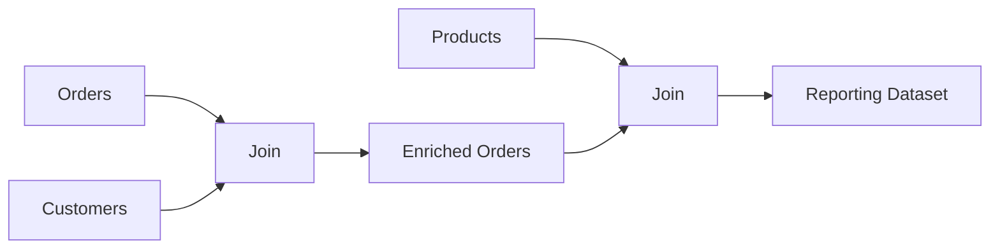
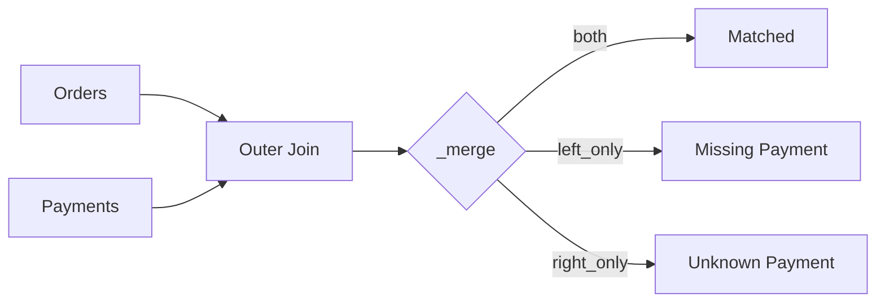
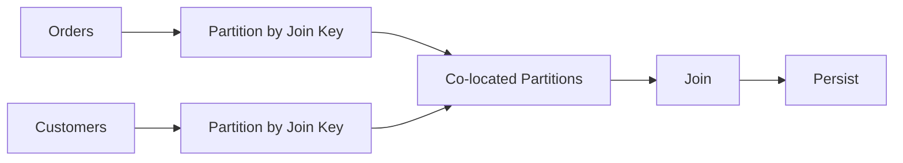

# 12- Efficient Joins

## Overview

Joins are among the most powerful and most memory-intensive operations in Pandas.

A join combines records from two or more datasets using one or more keys:

```text
orders
+
customers
↓
enriched orders
```

In production, join performance depends on more than the syntax of `merge()` or `join()`. Important factors include:

```text
input size
number of columns
key cardinality
duplicate keys
dtype compatibility
join type
memory availability
data distribution
```

A poor join can cause:

```text
large intermediate allocations
row-count explosions
high CPU utilization
container OOM
long-running ETL jobs
unexpected duplicate records
```

An efficient join strategy is:

```text
reduce rows
    ↓
reduce columns
    ↓
normalize join keys
    ↓
validate cardinality
    ↓
choose the correct join
    ↓
join
    ↓
validate result
```

The most important production rule is:

> Optimize the data entering the join before optimizing the join itself.

---

## What a Join Does

Suppose:

```text
orders
```

contains:

| order_id | customer_id | amount |
| --- | --- | ---: |
| 101 | C001 | 500 |
| 102 | C002 | 250 |
| 103 | C001 | 800 |

and:

```text
customers
```

contains:

| customer_id | segment |
| --- | --- |
| C001 | enterprise |
| C002 | consumer |

A left join:

```python
result = orders.merge(
    customers,
    on="customer_id",
    how="left",
)
```

produces:

| order_id | customer_id | amount | segment |
| --- | --- | ---: | --- |
| 101 | C001 | 500 | enterprise |
| 102 | C002 | 250 | consumer |
| 103 | C001 | 800 | enterprise |

The customer information is attached to every matching order.

---

## Why Joins Matter in Backend Data Systems

Most production data is distributed across logical entities:

```text
customers
orders
products
payments
transactions
events
employees
subscriptions
```

A reporting or ETL pipeline often needs to reconstruct a denormalized view:



This resembles relational database operations, but the execution happens in the Pandas process and is constrained by its memory.

---

## `merge()` as the Primary Join API

The standard API is:

```python
result = left.merge(
    right,
    on="customer_id",
    how="left",
)
```

Common parameters include:

```text
on
left_on
right_on
how
suffixes
validate
indicator
```

For production code, explicitly specify `how` rather than relying on defaults when the business relationship matters.

---

## Join Types

| Join | Result |
| --- | --- |
| Inner | Only matching keys |
| Left | All left rows + matching right rows |
| Right | All right rows + matching left rows |
| Outer | Union of keys from both sides |
| Cross | Cartesian product |

Example:

```python
inner = orders.merge(
    customers,
    on="customer_id",
    how="inner",
)

left = orders.merge(
    customers,
    on="customer_id",
    how="left",
)

outer = orders.merge(
    customers,
    on="customer_id",
    how="outer",
)
```

Choose the join based on business semantics, not expected row count.

---

## Join Cardinality

Before optimizing a join, determine the relationship between keys.

Common cardinalities are:

```text
one-to-one
one-to-many
many-to-one
many-to-many
```

For example:

```text
customer → orders
```

is normally:

```text
one customer
→ many orders
```

So from the `orders` perspective:

```text
orders.customer_id
→ customers.customer_id
```

is typically:

```text
many-to-one
```

Understanding cardinality is one of the most important join-performance concepts.

---

## One-to-One

Both datasets contain unique join keys:

```python
result = left.merge(
    right,
    on="customer_id",
    how="inner",
    validate="one_to_one",
)
```

If either side contains duplicate keys, Pandas raises an error.

Use this when the business relationship truly guarantees uniqueness.

---

## Many-to-One

A typical enrichment join:

```python
result = orders.merge(
    customers,
    on="customer_id",
    how="left",
    validate="many_to_one",
)
```

This means:

```text
orders.customer_id
→ may repeat

customers.customer_id
→ must be unique
```

This is one of the most useful production join validations.

---

## One-to-Many

Example:

```text
customers
→ orders
```

from the customer table's perspective:

```python
result = customers.merge(
    orders,
    on="customer_id",
    how="left",
    validate="one_to_many",
)
```

The right side may contain multiple records for each key.

---

## Many-to-Many

Many-to-many joins are valid in some business models, but they require special care.

Example:

```text
order_items
+
product_promotions
```

Both sides may contain multiple records for the same key.

A many-to-many join can produce:

```text
N × M
```

rows for a single key.

This is where join-related memory explosions commonly occur.

---

## Row Multiplication

Suppose:

```text
orders:
customer_id = C001 → 5 rows

customer_notes:
customer_id = C001 → 4 rows
```

A many-to-many join produces:

```text
5 × 4 = 20 rows
```

for customer `C001`.

This may be correct mathematically, but it can be disastrous if accidental.

Always ask:

```text
How many rows should one key produce?
```

before executing a large join.

---

## Validate Join Cardinality

Use:

```python
result = orders.merge(
    customers,
    on="customer_id",
    how="left",
    validate="many_to_one",
)
```

Available validation relationships include:

```text
one_to_one
one_to_many
many_to_one
many_to_many
```

A failed validation is often preferable to silently producing an incorrect and much larger DataFrame.

---

## Verify Key Uniqueness

Before a many-to-one join:

```python
if not customers["customer_id"].is_unique:
    raise ValueError(
        "customer_id must be unique in customers"
    )
```

For more detailed investigation:

```python
duplicates = customers.loc[
    customers["customer_id"].duplicated(
        keep=False,
    )
]
```

Inspect the duplicates before deciding whether:

```text
deduplication
aggregation
data correction
```

is appropriate.

---

## Do Not Deduplicate Blindly

This is dangerous:

```python
customers = customers.drop_duplicates(
    "customer_id",
)
```

It may silently discard meaningful records.

A production pipeline should define:

```text
which record wins
why it wins
whether duplicates are expected
how duplicates are monitored
```

For example:

```python
customers = (
    customers
    .sort_values("updated_at")
    .drop_duplicates(
        subset=["customer_id"],
        keep="last",
    )
)
```

This encodes an explicit latest-record rule.

---

## Reduce Rows Before Joining

Filter unnecessary rows before the merge:

```python
completed_orders = orders.loc[
    orders["status"].eq("completed"),
    [
        "order_id",
        "customer_id",
        "amount",
    ],
]

active_customers = customers.loc[
    customers["is_active"],
    [
        "customer_id",
        "segment",
    ],
]

result = completed_orders.merge(
    active_customers,
    on="customer_id",
    how="left",
    validate="many_to_one",
)
```

Benefits include:

```text
less memory
less CPU
smaller join structures
smaller result
```

Only apply a filter early when it is semantically valid.

---

## Reduce Columns Before Joining

Do not carry unrelated columns into a large join.

Instead of:

```python
result = orders.merge(
    customers,
    on="customer_id",
    how="left",
)
```

consider:

```python
customers_subset = customers[
    [
        "customer_id",
        "segment",
        "country",
    ]
]

result = orders.merge(
    customers_subset,
    on="customer_id",
    how="left",
    validate="many_to_one",
)
```

Wide join inputs can substantially increase memory pressure.

---

## Projection Is Often More Important Than Join Syntax

Suppose:

```text
orders = 8 GB
customers = 3 GB
```

but the join needs only:

```text
orders: customer_id, amount
customers: customer_id, segment
```

Projecting the input can remove gigabytes of unnecessary data before the join.

The optimization hierarchy should therefore be:

```text
reduce columns
→ reduce rows
→ validate keys
→ join
```

rather than:

```text
join everything
→ remove unused columns
```

---

## Join Key Dtypes

Join keys should have compatible logical types.

Bad:

```text
orders.customer_id    → int64
customers.customer_id → string
```

Normalize them:

```python
orders["customer_id"] = (
    orders["customer_id"]
    .astype("string")
)

customers["customer_id"] = (
    customers["customer_id"]
    .astype("string")
)
```

Then:

```python
result = orders.merge(
    customers,
    on="customer_id",
    how="left",
    validate="many_to_one",
)
```

Dtype mismatches are both correctness and performance problems.

---

## Do Not Treat Numeric-Looking IDs as Numbers

An identifier such as:

```text
00012345
```

may need to remain:

```text
"00012345"
```

rather than:

```text
12345
```

Use:

```python
df["customer_code"] = (
    df["customer_code"]
    .astype("string")
)
```

Join semantics should follow business meaning, not visual appearance.

---

## Categorical Join Keys

Categorical dtype can be useful for low-cardinality dimensions.

For example:

```python
orders["region"] = (
    orders["region"]
    .astype("category")
)

customers["region"] = (
    customers["region"]
    .astype("category")
)
```

However, do not introduce categorical representations solely because a join is involved.

For keys, prioritize:

```text
correctness
compatible dtype
cardinality
measured performance
```

over theoretical memory savings.

---

## Index-Based Joins

Pandas also supports index-oriented joins:

```python
result = orders.join(
    customers.set_index("customer_id"),
    on="customer_id",
    how="left",
)
```

This can be convenient when the right-hand dataset is naturally indexed by the join key.

Do not assume index joins are automatically faster than `merge()`.

Benchmark representative data and choose the clearer operation.

---

## `.join()` Versus `.merge()`

| Operation | Typical use |
| --- | --- |
| `merge()` | Explicit relational-style joins |
| `join()` | Joining against index-aligned data |
| `concat()` | Stacking/combining objects rather than relational matching |

For most SQL-like relational joins, `merge()` is the clearest choice:

```python
orders.merge(
    customers,
    on="customer_id",
    how="left",
)
```

---

## Joining on Different Key Names

Use `left_on` and `right_on` when schemas differ:

```python
result = orders.merge(
    customers,
    left_on="customer_id",
    right_on="id",
    how="left",
    validate="many_to_one",
)
```

For long-term maintainability, consider normalizing key names before a complex pipeline if multiple joins repeatedly use different naming conventions.

---

## Joining on Multiple Columns

Composite keys are supported:

```python
result = orders.merge(
    pricing,
    on=[
        "product_id",
        "region",
    ],
    how="left",
    validate="many_to_one",
)
```

This is appropriate when the relationship depends on multiple dimensions.

Validate the uniqueness of the complete composite key:

```python
if pricing.duplicated(
    [
        "product_id",
        "region",
    ]
).any():
    raise ValueError(
        "Pricing composite key must be unique"
    )
```

---

## Composite-Key Cardinality

A single column may not be unique:

```text
product_id
```

but the composite key may be:

```text
product_id + region
```

Therefore:

```python
pricing[
    [
        "product_id",
        "region",
    ]
].duplicated().any()
```

is often more meaningful than:

```python
pricing["product_id"].is_unique
```

Join validation should reflect the actual business key.

---

## Join with Different Semantics

Consider:

```text
product price
=
product + region + effective_date
```

A join on only:

```text
product_id
```

is logically incomplete.

This can result in:

```text
duplicate rows
incorrect prices
row multiplication
```

The correct join key is part of business logic, not merely a technical detail.

---

## Outer Joins

Outer joins are useful for reconciliation:

```python
comparison = orders.merge(
    payments,
    on="order_id",
    how="outer",
    indicator=True,
)
```

The `_merge` column can identify unmatched records.

Example:

```python
missing_records = comparison.loc[
    comparison["_merge"].ne("both")
]
```

This is useful for data-quality checks.

---

## `indicator=True`

Use:

```python
result = orders.merge(
    payments,
    on="order_id",
    how="outer",
    indicator=True,
)
```

The indicator identifies whether each row came from:

```text
left_only
right_only
both
```

This is useful for:

```text
reconciliation
debugging
data quality
incremental synchronization
```

Remove or rename the indicator before final output if it is not part of the downstream schema.

---

## Reconciliation Pattern

A practical payment reconciliation workflow:



This is often more useful than simply checking whether a join succeeded.

---

## Inner Join for Required Relationships

Use inner joins when unmatched rows should be excluded:

```python
enriched = orders.merge(
    customers,
    on="customer_id",
    how="inner",
    validate="many_to_one",
)
```

This can reduce downstream rows dramatically.

However, an inner join can hide data-quality problems by silently removing unmatched records.

If missing relationships are operationally important, measure them explicitly before or during reconciliation.

---

## Left Join for Enrichment

A left join is common for enriching primary records:

```python
enriched_orders = orders.merge(
    customers[
        [
            "customer_id",
            "segment",
        ]
    ],
    on="customer_id",
    how="left",
    validate="many_to_one",
)
```

This preserves every order.

Missing customer information becomes missing in the added columns.

Validate whether that is acceptable.

---

## Detecting Unmatched Left Rows

After a left join:

```python
enriched_orders = orders.merge(
    customers[
        [
            "customer_id",
            "segment",
        ]
    ],
    on="customer_id",
    how="left",
    validate="many_to_one",
)
```

check:

```python
unmatched = enriched_orders.loc[
    enriched_orders["segment"].isna()
]
```

Do not infer unmatched joins from arbitrary nullable right columns if those columns legitimately contain nulls.

For exact reconciliation, use `indicator=True`.

---

## Cross Joins

A cross join creates every combination:

```python
result = regions.merge(
    products,
    how="cross",
)
```

The output size is approximately:

```text
len(regions) × len(products)
```

Cross joins should be treated as an explicit cardinality risk.

Before executing one, calculate the expected size:

```python
expected_rows = (
    len(regions)
    * len(products)
)

print(
    f"Expected rows: {expected_rows:,}"
)
```

Do not run an unbounded cross join against large production datasets.

---

## Prevent Accidental Cartesian Joins

A missing or incorrect key can create unintended many-to-many behavior.

Before joining, confirm:

```text
join keys exist
join dtypes are compatible
join cardinality is expected
reference keys are unique when required
```

Always use:

```python
validate="many_to_one"
```

or another appropriate relationship when possible.

---

## Join Memory Model

A join can require memory for:

```text
left input
right input
key structures
matching metadata
result
temporary allocations
```

A simplified representation is:

```text
Input A
   +
Input B
   +
Join structures
   +
Output
```

This explains why a join can exhaust memory even when:

```text
A + B
```

appear to fit comfortably.

The output and intermediate structures must also fit.

---

## Measure Before and After Join

Track row counts:

```python
left_rows = len(orders)
right_rows = len(customers)

result = orders.merge(
    customers,
    on="customer_id",
    how="left",
    validate="many_to_one",
)

result_rows = len(result)

print(
    {
        "left_rows": left_rows,
        "right_rows": right_rows,
        "result_rows": result_rows,
    }
)
```

Unexpected row-count growth is a strong signal of join-cardinality problems.

---

## Memory Monitoring Around Joins

For large jobs:

```python
import os

import psutil


process = psutil.Process(
    os.getpid(),
)


def rss_mb() -> float:
    return (
        process.memory_info().rss
        / 1024**2
    )


before = rss_mb()

result = orders.merge(
    customers_subset,
    on="customer_id",
    how="left",
    validate="many_to_one",
)

after = rss_mb()

logger.info(
    "join_completed",
    extra={
        "rss_before_mb": before,
        "rss_after_mb": after,
        "rss_delta_mb": after - before,
        "result_rows": len(result),
    },
)
```

For production workloads, peak memory during the operation matters more than only the final RSS.

---

## Avoid Keeping Both Large Inputs Unnecessarily

Suppose:

```text
orders = 5 GB
customers = 4 GB
```

and:

```python
result = orders.merge(
    customers,
    ...
)
```

all three may contribute to peak memory.

If one input is no longer needed after the join, release it when appropriate:

```python
del customers
```

More importantly, architect the pipeline so unnecessary large objects do not remain alive simultaneously.

---

## Chunked Joins

Chunking can sometimes help when one side of the join is large and the computation can be partitioned.

For example:

```python
customers = (
    pd.read_parquet(
        "customers.parquet",
    )
    .set_index("customer_id")
)

for orders_chunk in pd.read_csv(
    "orders.csv",
    chunksize=100_000,
):
    result = orders_chunk.join(
        customers,
        on="customer_id",
        how="left",
    )

    persist(result)
```

This limits the size of the left-side working set.

However, the full reference dataset still resides in memory.

If the reference table itself is too large, another architecture is required.

---

## Chunking Both Sides

Joining two very large datasets cannot always be solved by simply chunking one side.

Potential strategies include:

```text
partition both datasets by join key
database-side join
sort-merge processing
DuckDB
Dask
Polars
Spark
```

The correct choice depends on whether the join can be partitioned safely and whether all matching records can be co-located.

---

## Partitioned Join Design

For very large datasets:

```text
Orders
  ↓
partition by customer_id
  ↓
partitioned orders

Customers
  ↓
partition by customer_id
  ↓
partitioned customers

matching partitions
  ↓
join
```

Conceptually:



This is the general idea behind distributed hash-partitioned joins.

---

## Prefer Database Joins When Appropriate

If both datasets already live in PostgreSQL, avoid exporting them to Pandas just to join them.

Prefer:

```sql
SELECT
    o.order_id,
    o.customer_id,
    o.amount,
    c.segment
FROM orders AS o
JOIN customers AS c
    ON c.customer_id = o.customer_id
WHERE o.status = 'completed';
```

Then load the smaller result:

```python
result = pd.read_sql(
    query,
    connection,
)
```

Database engines are often better positioned to:

```text
optimize joins
use indexes
parallelize queries
manage intermediate state
```

---

## SQL Pushdown

A common optimization is:

```text
PostgreSQL
→ filtering
→ joining
→ aggregation
→ small result
→ Pandas
```

instead of:

```text
PostgreSQL
→ all raw tables
→ Pandas
→ filtering
→ joining
→ aggregation
```

Use Pandas when the remaining transformation benefits from Python-based processing.

Do not move relational operations into Pandas merely because the rest of the pipeline is already written in Python.

---

## API Enrichment and Joins

For API-backed enrichment:

```text
orders
→ extract unique customer IDs
→ batch API lookup
→ customer DataFrame
→ merge
```

is preferable to:

```python
orders["segment"] = orders[
    "customer_id"
].apply(
    fetch_segment,
)
```

The first architecture avoids one network request per row.

---

## Join Key Normalization

Before joining datasets from different systems, normalize:

```text
whitespace
case
encoding
numeric/string representation
timezone where relevant
null handling
```

Example:

```python
orders["customer_id"] = (
    orders["customer_id"]
    .astype("string")
    .str.strip()
)

customers["customer_id"] = (
    customers["customer_id"]
    .astype("string")
    .str.strip()
)
```

Do not normalize arbitrarily.

For case-sensitive identifiers, lowercasing could change legitimate values.

---

## Missing Join Keys

Missing keys generally cannot produce meaningful matches.

Inspect them:

```python
missing_order_keys = (
    orders["customer_id"]
    .isna()
    .sum()
)

missing_customer_keys = (
    customers["customer_id"]
    .isna()
    .sum()
)
```

Do not silently convert missing identifiers into placeholder values such as:

```text
UNKNOWN
0
-1
```

unless the business model explicitly defines such a surrogate key.

---

## Null Join Semantics

Pandas merge behavior around null-like keys should be understood rather than assumed to match SQL `NULL` semantics.

For production pipelines, avoid relying on null-key behavior when nulls are not legitimate business keys.

A safer strategy is often:

```python
orders_with_keys = orders.loc[
    orders["customer_id"].notna()
]

orders_without_keys = orders.loc[
    orders["customer_id"].isna()
]
```

Then process missing-key rows according to business rules.

---

## Duplicate Reference Data

A frequent enrichment problem is:

```text
customer_id
C001
C001
```

in the supposedly unique customer dimension.

Do not immediately use:

```python
.drop_duplicates()
```

without understanding why duplicates exist.

Investigate:

```python
duplicates = customers.loc[
    customers["customer_id"]
    .duplicated(keep=False)
]
```

Then apply an explicit rule such as:

```text
latest record
active record
highest priority record
aggregated record
```

---

## Post-Join Validation

After a critical join, validate:

```text
row count
key uniqueness
expected columns
expected nulls
business constraints
```

Example:

```python
result = orders.merge(
    customers_subset,
    on="customer_id",
    how="left",
    validate="many_to_one",
)

if len(result) != len(orders):
    raise ValueError(
        "Left join unexpectedly changed row count"
    )
```

For a many-to-one left join, preserved left-row count is often an important invariant.

---

## Business-Level Join Validation

Technical success is not sufficient.

For example:

```python
result = orders.merge(
    customers,
    on="customer_id",
    how="left",
    validate="many_to_one",
)
```

may execute correctly while:

```text
30% of customer segments are missing
```

because the reference data is stale.

Track:

```python
match_rate = (
    result["segment"]
    .notna()
    .mean()
)
```

and define acceptable thresholds.

---

## Join Validation Metrics

Useful metrics include:

| Metric | Purpose |
| --- | --- |
| Input rows | Track source size |
| Output rows | Detect multiplication |
| Match rate | Detect missing reference data |
| Duplicate key count | Detect cardinality problems |
| Null join-key count | Detect invalid input |
| Join duration | Detect performance regression |
| Peak RSS | Detect memory pressure |

These metrics make join behavior observable rather than implicit.

---

## Suffixes and Duplicate Columns

When both DataFrames contain non-key columns with the same name:

```python
result = orders.merge(
    customers,
    on="customer_id",
    how="left",
    suffixes=(
        "_order",
        "_customer",
    ),
)
```

Avoid accepting default suffixes when the resulting semantics are unclear.

After the join, explicitly verify the schema.

---

## Avoid Joining `SELECT *`-Style DataFrames

A common anti-pattern is:

```python
result = large_orders.merge(
    large_customers,
    on="customer_id",
)
```

when each DataFrame contains dozens of unused columns.

Instead:

```python
orders_subset = large_orders[
    [
        "order_id",
        "customer_id",
        "amount",
    ]
]

customers_subset = large_customers[
    [
        "customer_id",
        "segment",
    ]
]

result = orders_subset.merge(
    customers_subset,
    on="customer_id",
    how="left",
    validate="many_to_one",
)
```

This reduces the join's memory footprint.

---

## Joining Sequentially

Multiple joins can compound memory usage:

```python
result = (
    orders
    .merge(customers, ...)
    .merge(products, ...)
    .merge(payments, ...)
)
```

The chained form is readable but can make memory peaks harder to diagnose.

For large pipelines, use explicit stages when necessary:

```python
enriched_orders = orders.merge(
    customers_subset,
    on="customer_id",
    how="left",
    validate="many_to_one",
)

enriched_orders = enriched_orders.merge(
    products_subset,
    on="product_id",
    how="left",
    validate="many_to_one",
)
```

Profile each stage and release inputs that are no longer needed.

---

## Join Ordering

When multiple joins are required, consider:

```text
filter first
→ most selective reduction
→ smaller reference joins
→ expensive joins later
```

For example:

```text
100M orders
→ completed only: 20M
→ date range: 3M
→ customer enrichment
→ product enrichment
```

This can be dramatically cheaper than joining all 100M rows first.

Do not change join ordering if it changes business semantics.

---

## Small Reference Tables

If one side is very small:

```text
orders: 50M
countries: 250
```

a lookup-style enrichment may be more efficient than handling a large general-purpose DataFrame join in some situations.

For example:

```python
country_map = (
    countries
    .set_index("country_code")["country_name"]
)

orders["country_name"] = (
    orders["country_code"]
    .map(country_map)
)
```

This is appropriate for simple one-value lookups.

For multiple related columns or complex relationships, `merge()` is generally clearer.

---

## `map()` Versus `merge()`

| Requirement | Prefer |
| --- | --- |
| One value from a simple key lookup | `map()` |
| Multiple reference columns | `merge()` |
| Complex composite key | `merge()` |
| Need join validation | `merge()` |
| Need reconciliation indicator | `merge(indicator=True)` |

Do not use `map()` to hide a relational join that should be explicitly validated.

---

## Efficient Repeated Lookups

If the same reference data is used repeatedly:

```python
customers_subset = (
    customers[
        [
            "customer_id",
            "segment",
        ]
    ]
    .drop_duplicates(
        "customer_id",
    )
)
```

Validate it once:

```python
if not customers_subset[
    "customer_id"
].is_unique:
    raise ValueError(
        "Customer lookup must be unique"
    )
```

Then reuse the validated reference dataset.

This avoids repeating expensive preparation.

---

## Memory and Reference Tables

A common architecture is:

```text
large event stream
+
small dimension table
```

For example:

```text
100M events
+
50K customers
```

It may be practical to keep the reference table in memory while processing event chunks.

This is a common pattern for:

```text
ETL
batch enrichment
report generation
stream processing
```

The reference table must still fit comfortably within the worker's memory budget.

---

## Large Reference Tables

If the reference dataset itself consumes several gigabytes:

```text
100M events
+
8GB customer table
```

loading the full reference DataFrame into every worker may not scale.

Consider:

```text
database join
partitioned processing
Parquet partitioning
DuckDB
distributed processing
pre-aggregated dimension extracts
```

Architecture matters more than Pandas syntax at this point.

---

## Join and Parquet

If both datasets are stored as Parquet, project only required columns:

```python
orders = pd.read_parquet(
    "orders.parquet",
    columns=[
        "order_id",
        "customer_id",
        "amount",
    ],
)

customers = pd.read_parquet(
    "customers.parquet",
    columns=[
        "customer_id",
        "segment",
    ],
)
```

Then:

```python
result = orders.merge(
    customers,
    on="customer_id",
    how="left",
    validate="many_to_one",
)
```

Column projection at read time avoids materializing unnecessary fields.

---

## Join and Incremental Processing

For incremental ETL:

```text
new orders
+
current customer dimension
↓
enrichment
↓
write processed batch
```

The incremental dataset should remain bounded.

Example:

```python
for batch in read_order_batches():
    batch = batch.loc[
        :,
        [
            "order_id",
            "customer_id",
            "amount",
        ],
    ]

    enriched = batch.merge(
        customers_subset,
        on="customer_id",
        how="left",
        validate="many_to_one",
    )

    persist(enriched)
```

This is safer than joining an ever-growing historical DataFrame.

---

## Join and Idempotency

In retryable pipelines, the join itself should be deterministic.

Use stable:

```text
keys
dimension snapshot
filter window
reference version
```

so that rerunning the same batch produces the same enrichment.

This matters when:

```text
Celery
Kubernetes Jobs
AWS Batch
scheduled ETL
```

automatically retry failed processing.

---

## Temporal Joins

Some systems require matching records based on time:

```text
trade
→ nearest price observation
```

Use:

```python
pd.merge_asof()
```

when the relationship is based on ordered timestamps rather than exact equality.

Example:

```python
result = pd.merge_asof(
    trades.sort_values("event_time"),
    prices.sort_values("event_time"),
    on="event_time",
    by="symbol",
    direction="backward",
)
```

Both inputs must satisfy the ordering requirements of the operation.

Temporal joins should be treated as specialized joins rather than ordinary equality merges.

---

## Efficient Join Decision Framework

Use this sequence:

```text
Do both datasets already live in SQL?
        │
       yes
        ↓
Prefer a database join when practical

Otherwise:
        ↓
Can rows be filtered before joining?
        │
       yes
        ↓
Filter early

Can columns be projected?
        │
       yes
        ↓
Project early

Are key dtypes compatible?
        ↓
Normalize

Is cardinality known?
        ↓
Validate

Could the join multiply rows unexpectedly?
        ↓
Check duplicates

Does the result fit comfortably in memory?
        │
       no
        ↓
Chunk / partition / change engine
```

---

## Production Example

Consider a daily sales report.

Source data:

```text
orders
customers
products
```

A memory-aware pipeline might be:

```python
orders = pd.read_parquet(
    "orders/",
    columns=[
        "order_id",
        "customer_id",
        "product_id",
        "status",
        "amount",
    ],
)

orders = orders.loc[
    orders["status"].eq("completed")
]

customers = pd.read_parquet(
    "customers/",
    columns=[
        "customer_id",
        "segment",
    ],
)

products = pd.read_parquet(
    "products/",
    columns=[
        "product_id",
        "category",
    ],
)

sales = orders.merge(
    customers,
    on="customer_id",
    how="left",
    validate="many_to_one",
)

sales = sales.merge(
    products,
    on="product_id",
    how="left",
    validate="many_to_one",
)
```

Then aggregate:

```python
report = (
    sales
    .groupby(
        [
            "segment",
            "category",
        ],
        as_index=False,
    )
    .agg(
        revenue=("amount", "sum"),
        order_count=("order_id", "count"),
    )
)
```

The key optimization decisions are:

```text
Parquet column projection
→ early status filtering
→ narrow reference tables
→ cardinality validation
→ aggregation after enrichment
```

---

## Production Pitfalls

### Accidental Many-to-Many Join

Symptom:

```text
input: 1M rows
output: 30M rows
```

Cause:

```text
duplicate keys
```

Fix:

```text
validate cardinality
inspect duplicates
define business key
```

### Joining Wide DataFrames

Symptom:

```text
high peak memory
```

Fix:

```text
project columns before join
```

### Wrong Join Type

Symptom:

```text
missing records
```

Fix:

```text
choose left/inner/outer semantics based on the business requirement
```

### Incompatible Join Key Dtypes

Symptom:

```text
join error
unexpected non-matches
```

Fix:

```text
normalize logical types before the join
```

### Loading Full Reference Tables

Symptom:

```text
worker OOM
```

Fix:

```text
filter/project reference data
or move the join to the database/distributed engine
```

### Blind Deduplication

Symptom:

```text
silently missing data
```

Fix:

```text
define deterministic duplicate resolution
```

### Ignoring Unmatched Rows

Symptom:

```text
report has unexplained missing attributes
```

Fix:

```text
measure match rate
use reconciliation checks
```

---

## Security Considerations

Joins can combine datasets containing sensitive fields.

Before joining:

```text
customer data
financial records
authentication metadata
PII
internal operational data
```

project only the columns required by the output.

Avoid:

```python
customers[
    [
        "customer_id",
        "name",
        "email",
        "phone",
        "address",
        "tax_id",
        "internal_notes",
    ]
]
```

when the report only needs:

```python
customers[
    [
        "customer_id",
        "segment",
    ]
]
```

Data minimization is both a memory optimization and a security practice.

---

## Operational Monitoring

For critical joins, monitor:

```text
input row counts
output row count
match rate
duplicate key count
null key count
duration
peak RSS
```

A sudden change such as:

```text
output/input ratio: 1.0 → 4.8
```

should trigger investigation.

Possible causes include:

```text
duplicate reference records
changed business keys
schema drift
upstream data corruption
```

---

## Cost Considerations

Efficient joins can reduce:

```text
CPU
RAM requirements
container size
job duration
retry frequency
database transfer
cloud compute cost
```

A join that requires:

```text
32 GB memory
```

may force a much larger Kubernetes node or ECS task than a workload requiring:

```text
8 GB
```

Reducing the join working set can therefore have a direct infrastructure-cost impact.

---

## Testing Joins

Tests should verify both data correctness and cardinality expectations.

Example:

```python
def test_orders_join_customer_segment() -> None:
    orders = pd.DataFrame(
        {
            "order_id": [1, 2, 3],
            "customer_id": ["C1", "C1", "C2"],
        }
    )

    customers = pd.DataFrame(
        {
            "customer_id": ["C1", "C2"],
            "segment": [
                "enterprise",
                "consumer",
            ],
        }
    )

    result = orders.merge(
        customers,
        on="customer_id",
        how="left",
        validate="many_to_one",
    )

    assert len(result) == len(orders)

    assert (
        result["segment"].tolist()
        == [
            "enterprise",
            "enterprise",
            "consumer",
        ]
    )
```

This tests:

```text
join correctness
row preservation
cardinality
business enrichment
```

---

## Testing Duplicate-Key Failures

A good test should confirm that invalid reference data fails loudly:

```python
import pytest


def test_duplicate_customer_keys_fail_join() -> None:
    orders = pd.DataFrame(
        {
            "order_id": [1],
            "customer_id": ["C1"],
        }
    )

    customers = pd.DataFrame(
        {
            "customer_id": ["C1", "C1"],
            "segment": [
                "enterprise",
                "consumer",
            ],
        }
    )

    with pytest.raises(
        pd.errors.MergeError,
    ):
        orders.merge(
            customers,
            on="customer_id",
            how="left",
            validate="many_to_one",
        )
```

This protects the pipeline against accidental cardinality changes.

---

## Testing Unmatched Records

For an enrichment join:

```python
result = orders.merge(
    customers,
    on="customer_id",
    how="left",
    validate="many_to_one",
)
```

test missing references explicitly:

```python
unmatched = result.loc[
    result["segment"].isna()
]

assert len(unmatched) == 0
```

If unmatched rows are allowed, assert the expected count instead of always requiring zero.

---

## Join Checklist

```text
[ ] Business relationship is understood
[ ] Correct join keys are identified
[ ] Composite keys are complete
[ ] Join key dtypes are compatible
[ ] Null-key behavior is understood
[ ] Input rows are filtered where appropriate
[ ] Only required columns are selected
[ ] Reference keys are unique when required
[ ] `validate=` is specified for known cardinality
[ ] Many-to-many behavior is intentional
[ ] Cross joins are explicitly justified
[ ] Output row count is checked
[ ] Match rate is monitored
[ ] Duplicate keys are monitored
[ ] Unmatched records are handled
[ ] Sensitive columns are excluded
[ ] Peak memory is measured for large joins
[ ] Large joins are chunked or partitioned when required
[ ] SQL pushdown is considered
[ ] Parquet projection is used where appropriate
[ ] Retry behavior is deterministic
[ ] Join behavior is covered by automated tests
```

## Interview Perspective

### Why Can a Pandas Join Suddenly Increase Row Count?

Because duplicate keys can create many-to-many combinations. If the left side has `N` rows for a key and the right side has `M`, that key can produce `N × M` output rows.

### What Is `validate="many_to_one"` Used For?

It asserts that the left side may contain repeated keys but the right side must contain at most one row per key. It turns an expected business relationship into an executable data-quality check.

### How Do You Optimize a Large Pandas Join?

First reduce rows and columns, normalize key dtypes, validate cardinality, and avoid accidental many-to-many relationships. If the resulting join still exceeds practical memory limits, push it to SQL or use partitioned/distributed processing.

### Should You Use `merge()` or `join()`?

Use `merge()` for explicit relational joins and `join()` when index-oriented joining is the natural representation. Neither should be assumed to be universally faster.

### Why Is a Database Join Often Preferable?

PostgreSQL and other database engines are designed to optimize relational joins, use indexes and query plans, and manage intermediate data without requiring the complete join working set to live inside a Python process.

### What Is the Most Important Join Metric?

Expected cardinality. Knowing how many output rows each input key should produce is fundamental to both correctness and performance.

## Key Takeaways

- Optimize joins by reducing rows and columns before execution, normalizing join-key dtypes, and choosing the smallest valid working sets.
- Treat join cardinality as a correctness and memory constraint; use `validate=` to prevent accidental many-to-many row explosions.
- Prefer database-side joins when data already resides in PostgreSQL or another relational system, and use chunking or partitioned processing when a Pandas join exceeds practical memory limits.
- Measure output row counts, match rates, duplicate keys, and peak memory because a technically successful join can still produce incorrect or operationally unsafe results.
- Keep join contracts explicit and testable: define business keys, null behavior, duplicate resolution, required relationships, sensitive columns, and retry-safe processing semantics.