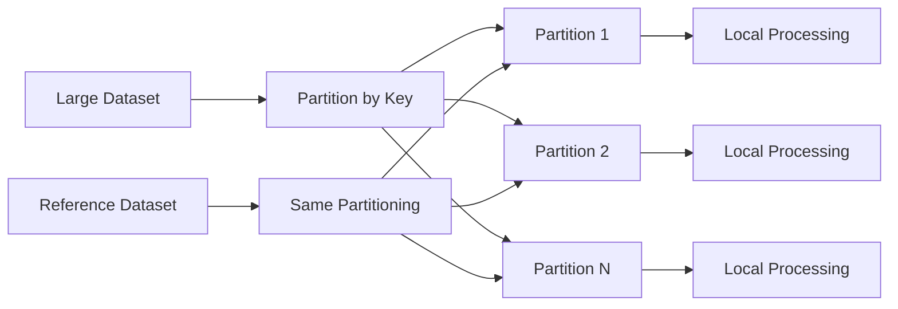
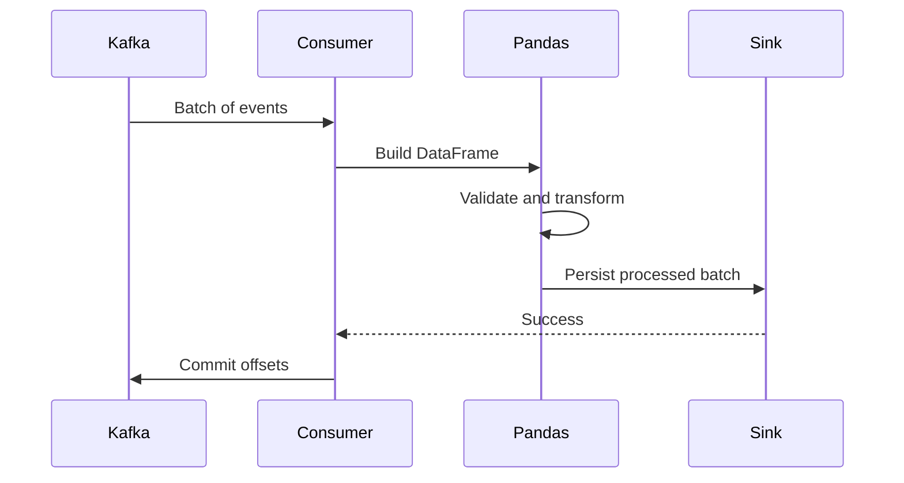

# 13- Chunk Processing

## Overview

Chunk processing is a memory-management technique that processes a large dataset in bounded portions instead of loading the entire dataset into one Pandas DataFrame.

The basic pattern is:

```text
large source
    ↓
bounded chunk
    ↓
validate
    ↓
transform
    ↓
aggregate / persist
    ↓
release
    ↓
next chunk
```

It is most useful when:

```text
the source is larger than available memory
the full dataset would create unsafe peak memory
the operation can be partitioned
incremental processing is acceptable
```

Chunk processing does not make every Pandas operation scalable. Operations that require global state, such as exact global sorting or some large joins, may still require another architecture.

The production objective is:

> Keep the working set bounded while preserving correct global results.

---

## Why Chunk Processing Matters

A DataFrame may require significantly more memory than the raw source file.

For example:

```text
CSV on disk:         3 GB
Parsed DataFrame:    8 GB
Transformation:     11 GB
Join intermediate:  15 GB
```

A machine with:

```text
16 GB RAM
```

may fail even though the source file is only 3 GB.

Chunk processing changes the execution model:

```text
3 GB source
    ↓
100 MB chunk
    ↓
process
    ↓
persist
    ↓
100 MB chunk
    ↓
process
    ↓
...
```

Peak memory becomes much more predictable.

---

## What a Chunk Is

A chunk is a bounded subset of the source data processed independently from the rest.

For CSV input:

```python
for chunk in pd.read_csv(
    "orders.csv",
    chunksize=100_000,
):
    process(chunk)
```

Each iteration produces a DataFrame containing at most approximately:

```text
100,000 rows
```

The exact memory usage depends on:

```text
number of columns
dtype
string sizes
index
temporary allocations
```

`chunksize` controls rows, not a fixed number of megabytes.

---

## Standard Chunked Reading

A basic implementation is:

```python
for chunk in pd.read_csv(
    "orders.csv",
    chunksize=100_000,
):
    process(chunk)
```

This is appropriate when the required operation can be performed independently on each batch.

Typical use cases include:

```text
filtering
validation
normalization
column transformation
format conversion
partial aggregation
incremental loading
```

---

## Chunk Processing Lifecycle

A production chunk pipeline can follow:


Each iteration should be independently observable and, where possible, retryable.

---

## Choosing a Chunk Size

There is no universal optimal chunk size.

Larger chunks generally provide:

```text
fewer iterations
lower loop overhead
better throughput in some workloads
```

but also:

```text
higher peak memory
larger temporary allocations
larger retry units
```

Smaller chunks generally provide:

```text
lower peak memory
smaller retry units
```

but may increase:

```text
iteration overhead
I/O overhead
per-batch setup cost
```

Choose chunk size experimentally based on:

```text
row width
transformation cost
available memory
I/O characteristics
SLA
```

---

## Chunk Size Is Not Memory Size

This:

```python
pd.read_csv(
    "events.csv",
    chunksize=100_000,
)
```

does not guarantee:

```text
100,000 rows = 100 MB
```

One row containing:

```text
small integers
```

can consume far less memory than one containing:

```text
large JSON
long strings
nested payloads
```

Treat `chunksize` as a row-count control, then measure actual memory behavior.

---

## Column Projection During Chunked Reads

Always load only the required columns where possible:

```python
for chunk in pd.read_csv(
    "orders.csv",
    usecols=[
        "order_id",
        "customer_id",
        "status",
        "amount",
    ],
    chunksize=100_000,
):
    process(chunk)
```

This reduces:

```text
I/O
parser work
chunk memory
downstream processing
```

Chunking and column projection should usually be used together.

---

## Dtype Control During Chunked Reads

Explicit dtypes can reduce memory and prevent type drift:

```python
for chunk in pd.read_csv(
    "orders.csv",
    usecols=[
        "order_id",
        "customer_id",
        "quantity",
        "status",
        "amount",
    ],
    dtype={
        "order_id": "string",
        "customer_id": "string",
        "quantity": "Int64",
        "status": "category",
    },
    chunksize=100_000,
):
    process(chunk)
```

Without explicit dtype rules, separate chunks may be inferred differently depending on their local values.

---

## Schema Consistency Across Chunks

This is a common production problem.

Consider:

```text
chunk 1:
quantity → int64

chunk 2:
quantity → float64
```

because one chunk contains missing values.

If downstream code expects a stable schema, normalize explicitly:

```python
for chunk in pd.read_csv(
    "orders.csv",
    chunksize=100_000,
):
    chunk["quantity"] = (
        chunk["quantity"]
        .astype("Int64")
    )

    process(chunk)
```

Chunk boundaries should not determine business schema.

---

## Filtering Within Each Chunk

Filtering should happen before expensive operations:

```python
for chunk in pd.read_csv(
    "orders.csv",
    chunksize=100_000,
):
    completed = chunk.loc[
        chunk["status"].eq("completed"),
        [
            "customer_id",
            "amount",
        ],
    ]

    process(completed)
```

This reduces the size of the working set after each read.

---

## Avoid Accumulating All Filtered Chunks

This defeats the purpose of chunk processing:

```python
results = []

for chunk in pd.read_csv(
    "orders.csv",
    chunksize=100_000,
):
    results.append(
        chunk.loc[
            chunk["status"].eq("completed")
        ]
    )

result = pd.concat(results)
```

If the final result is large, all filtered chunks remain in memory.

Use:

```text
incremental persistence
partial aggregation
bounded output
```

instead.

---

## Chunk-Friendly Aggregation

Additive aggregations are naturally suitable for chunk processing.

Example:

```python
partials = []

for chunk in pd.read_csv(
    "orders.csv",
    chunksize=100_000,
):
    partial = (
        chunk
        .groupby("customer_id")["amount"]
        .sum()
    )

    partials.append(partial)

customer_totals = (
    pd.concat(partials)
    .groupby(level=0)
    .sum()
)
```

This works because:

```text
sum(chunk_1)
+
sum(chunk_2)
+
...
```

produces the same total as:

```text
sum(all rows)
```

The same reasoning applies to additive counts and related decomposable metrics.

---

## Decomposable Aggregations

Aggregations suitable for partial accumulation include many functions based on sufficient statistics.

For example:

```text
sum
count
```

Mean can also be computed correctly through:

```text
sum
+
count
```

rather than averaging chunk means directly.

Example:

```python
total_sum = 0.0
total_count = 0

for chunk in pd.read_csv(
    "orders.csv",
    chunksize=100_000,
):
    amounts = chunk["amount"].dropna()

    total_sum += amounts.sum()
    total_count += amounts.count()

mean_amount = (
    total_sum / total_count
    if total_count
    else float("nan")
)
```

Do not calculate:

```python
chunk_means = [...]
mean(chunk_means)
```

unless all chunks have the same number of valid observations.

---

## Aggregations That Need More Care

Some operations do not combine trivially:

```text
exact median
exact percentile
global ranking
global sorting
```

For example, averaging chunk medians does not produce the global median.

A chunked design may instead require:

```text
database aggregation
external algorithms
approximate algorithms
distributed processing
multiple passes
```

Do not force a mathematically incorrect chunking strategy merely to reduce memory.

---

## Duplicate Detection Across Chunks

Duplicate detection is challenging when duplicates can appear in different chunks.

This is insufficient:

```python
for chunk in chunks:
    duplicates = chunk[
        chunk["order_id"].duplicated()
    ]
```

It only detects duplicates inside each chunk.

A global solution may require external state:

```python
seen_ids = set()

for chunk in chunks:
    duplicate_mask = (
        chunk["order_id"].isin(seen_ids)
    )

    duplicates = chunk.loc[
        duplicate_mask
    ]

    seen_ids.update(
        chunk["order_id"].dropna()
    )
```

However, `seen_ids` can itself become very large.

For high-cardinality datasets, consider:

```text
database uniqueness constraints
external state
partitioning
disk-backed state
distributed processing
```

---

## Chunked Joins

Joining a large event dataset with a smaller reference table is a common chunking pattern.

```python
customers = pd.read_parquet(
    "customers.parquet",
    columns=[
        "customer_id",
        "segment",
    ],
)

for chunk in pd.read_csv(
    "events.csv",
    chunksize=100_000,
):
    enriched = chunk.merge(
        customers,
        on="customer_id",
        how="left",
        validate="many_to_one",
    )

    persist(enriched)
```

This bounds the large left-side input.

The reference table still needs to fit comfortably in memory.

---

## When the Reference Table Is Too Large

If:

```text
events = 100 GB
customers = 12 GB
```

loading the entire customer table into every worker may still be impractical.

Consider:

```text
database-side join
partitioned join
key-based partitioning
DuckDB
Dask
Polars
Spark
```

Chunking is not a substitute for a distributed join architecture when both sides exceed practical memory.

---

## Partitioned Processing

For very large joins or aggregations, partition by a stable key:

```text
customer_id
```

Conceptually:



This is more complex than simple chunking but provides a path toward scalable distributed processing.

---

## Incremental Persistence

A chunk pipeline should often persist after each successful batch.

Example:

```python
for batch_id, chunk in enumerate(
    pd.read_csv(
        "orders.csv",
        chunksize=100_000,
    )
):
    result = transform(chunk)

    write_batch(
        result,
        batch_id=batch_id,
    )
```

This provides:

```text
bounded memory
incremental progress
smaller retry units
partial recovery
```

The write should be atomic or idempotent where retries are possible.

---

## Idempotent Batch Writes

A retry-safe batch pipeline might use:

```text
batch ID
source offset
source time window
deterministic output path
```

Example:

```python
output_path = (
    f"s3://bucket/orders/"
    f"batch_id={batch_id}/"
    f"part.parquet"
)
```

If a batch fails after processing but before checkpointing, the retry should not create inconsistent duplicates.

Design the output protocol together with the chunking strategy.

---

## Checkpointing

For long-running ingestion:

```text
read batch
    ↓
transform
    ↓
validate
    ↓
persist
    ↓
commit checkpoint
    ↓
next batch
```

Do not update the checkpoint before the output is durably persisted.

For example:

```python
result = process_batch(chunk)

write_result(
    result,
    batch_id=batch_id,
)

commit_checkpoint(
    batch_id,
)
```

A failure before checkpoint commit causes a retry of the previous batch, which should be safe if the write is idempotent.

---

## Chunk Processing and Error Handling

A production pipeline should distinguish:

```text
batch failure
record-level failure
source failure
destination failure
schema failure
```

A strict pipeline might stop:

```python
for chunk in chunks:
    validate_schema(chunk)
    result = process(chunk)
    persist(result)
```

An ingestion pipeline may instead quarantine bad records:

```text
valid rows
→ output

invalid rows
→ quarantine
```

Do not silently skip failed chunks because that creates incomplete datasets.

---

## Per-Chunk Validation

Validate each chunk:

```python
def validate_chunk(
    chunk: pd.DataFrame,
) -> None:
    required = {
        "order_id",
        "customer_id",
        "amount",
    }

    missing = (
        required
        - set(chunk.columns)
    )

    if missing:
        raise ValueError(
            f"Missing columns: {sorted(missing)}"
        )

    if chunk["amount"].lt(0).any():
        raise ValueError(
            "Negative order amounts detected"
        )
```

Then:

```python
for chunk in chunks:
    validate_chunk(chunk)
    process(chunk)
```

Validation should happen before irreversible persistence.

---

## Handling Invalid Rows

For pipelines where individual bad records should not fail the entire batch:

```python
valid_mask = (
    chunk["amount"].notna()
    & chunk["amount"].ge(0)
)

valid = chunk.loc[
    valid_mask
]

invalid = chunk.loc[
    ~valid_mask
]
```

Then:

```python
write_valid(valid)
write_quarantine(invalid)
```

Track invalid-row metrics:

```text
invalid_count
invalid_rate
```

A sudden increase may indicate upstream data corruption.

---

## Empty Chunks and Empty Inputs

Some batches may contain:

```text
zero valid rows
```

Handle explicitly:

```python
if chunk.empty:
    continue
```

More importantly, preserve output schema even if every row in the chunk is rejected.

An empty batch should not silently alter:

```text
column names
dtypes
partition schema
```

---

## Chunk Processing and Strings

Large text fields can still make a chunk expensive.

For example:

```text
100,000 rows
×
large JSON payload
```

may exceed memory assumptions.

Use:

```python
usecols=[
    "event_id",
    "event_type",
    "event_time",
]
```

rather than loading raw payloads unless they are required for the current processing stage.

Chunking should be combined with projection.

---

## Chunk Processing and Datetime

Normalize datetime values inside the chunk or during ingestion:

```python
for chunk in pd.read_csv(
    "events.csv",
    chunksize=100_000,
):
    chunk["event_time"] = pd.to_datetime(
        chunk["event_time"],
        utc=True,
        errors="raise",
    )

    process(chunk)
```

Do not repeatedly parse the same values across multiple downstream stages.

If the source format is controlled, provide parsing configuration during reading where appropriate.

---

## Chunk Processing and Categorical Data

Categorical dtype can reduce per-chunk memory:

```python
for chunk in pd.read_csv(
    "orders.csv",
    dtype={
        "status": "category",
    },
    chunksize=100_000,
):
    process(chunk)
```

However, independently inferred chunks can have different category sets.

For a shared categorical domain:

```python
status_dtype = pd.CategoricalDtype(
    categories=[
        "pending",
        "completed",
        "failed",
    ],
)

for chunk in pd.read_csv(
    "orders.csv",
    chunksize=100_000,
):
    chunk["status"] = (
        chunk["status"]
        .astype(status_dtype)
    )

    process(chunk)
```

This provides consistent category semantics.

---

## Chunk Processing and Output Formats

For large output, write incrementally rather than rebuilding a massive final DataFrame.

Common targets include:

```text
Parquet
PostgreSQL
S3
data warehouse
```

For Parquet, a dataset layout such as:

```text
orders/
    date=2026-09-01/
    date=2026-09-02/
```

can support incremental downstream reads.

Choose partition keys based on actual query patterns.

---

## Appending to Parquet

Avoid treating one monolithic file as the only output target for a long-running batch pipeline.

Prefer a dataset structure with multiple files:

```text
orders/
    part-0001.parquet
    part-0002.parquet
    part-0003.parquet
```

or partitioned directories where appropriate.

This supports:

```text
incremental writes
parallel reads
failure isolation
partition pruning
```

The exact file-writing strategy depends on the storage engine and table format used.

---

## Chunk Processing with PostgreSQL

Database reads can also be bounded.

For example, fetch records in windows:

```python
query = """
    SELECT
        order_id,
        customer_id,
        amount,
        created_at
    FROM orders
    WHERE created_at >= %(start_time)s
      AND created_at < %(end_time)s
    ORDER BY created_at, order_id
"""
```

Then process each time window as a bounded batch.

For large database workloads, prefer database-native batching, server-side cursors, keyset pagination, or query-level partitioning where appropriate rather than repeatedly using increasingly large `OFFSET` values.

---

## Keyset-Style Incremental Processing

For stable incremental processing, a cursor can use:

```text
created_at
+
order_id
```

as a deterministic ordering key.

Conceptually:

```sql
WHERE (
    created_at > :last_created_at
    OR (
        created_at = :last_created_at
        AND order_id > :last_order_id
    )
)
ORDER BY
    created_at,
    order_id
LIMIT :batch_size;
```

This avoids the growing cost and instability that can accompany large `OFFSET` pagination.

---

## Chunk Processing from APIs

REST APIs often already provide pagination.

A production flow can be:

```text
API page
    ↓
DataFrame
    ↓
validate
    ↓
transform
    ↓
persist
    ↓
next page
```

For example:

```python
while True:
    response = fetch_orders(
        cursor=cursor,
        limit=1_000,
    )

    chunk = pd.DataFrame(
        response["items"]
    )

    if not chunk.empty:
        process(chunk)

    cursor = response.get(
        "next_cursor"
    )

    if cursor is None:
        break
```

Do not accumulate all API pages into one DataFrame unless the total size is known to fit safely.

---

## Chunk Processing from Kafka

Kafka naturally produces bounded batches.

A consumer can process:

```text
poll batch
→ DataFrame
→ vectorized transformation
→ validation
→ sink
→ commit offset
```

Conceptually:



Offset commits should occur only after the batch output is durably handled according to the delivery guarantees of the system.

---

## Chunk Processing with Celery

A Celery task can process a bounded batch:

```python
@app.task
def process_orders_batch(
    batch_path: str,
) -> None:
    chunk = pd.read_parquet(
        batch_path,
    )

    result = transform(chunk)

    persist(result)
```

A large job can then be decomposed into:

```text
batch 1
batch 2
batch 3
...
```

This provides smaller retry units and limits worker memory.

Avoid putting an unbounded entire dataset into one Celery task.

---

## Kubernetes Batch Jobs

Chunked processing is a natural fit for Kubernetes Jobs:

```text
Job
 ↓
bounded batch
 ↓
Pandas
 ↓
persist
 ↓
exit
```

Resource configuration should leave headroom:

```yaml
resources:
  requests:
    cpu: "1"
    memory: "2Gi"
  limits:
    cpu: "2"
    memory: "4Gi"
```

Do not set chunk size based only on the nominal container limit. Reserve memory for:

```text
Python
Pandas
temporary allocations
network buffers
serialization
application code
```

---

## Chunk Processing and Parallelism

Chunks can sometimes be processed in parallel:

```text
chunk 1 → worker A
chunk 2 → worker B
chunk 3 → worker C
```

But parallelism can multiply memory.

If one worker requires:

```text
1.5 GB
```

and four workers process simultaneously:

```text
~6 GB
```

may be required before considering:

```text
parent process
buffers
overhead
```

Therefore:

```text
parallelism × per-worker peak memory
```

must fit the deployment budget.

---

## When Parallel Chunking Helps

Parallel chunk processing is useful when:

```text
chunks are independent
CPU work dominates
input can be partitioned safely
outputs can be written independently
memory budget supports concurrency
```

It is less useful when:

```text
database is already the bottleneck
API rate limits dominate
chunks require shared state
output order matters
serialization dominates
```

Do not parallelize purely because multiple CPU cores exist.

---

## Chunk Ordering

Some pipelines require deterministic output order.

For example:

```text
event_time
```

may need globally ordered output.

Independent chunk processing can violate that order:

```text
chunk 1
chunk 3
chunk 2
```

If output order matters, define a strategy:

```text
ordered source windows
sequence numbers
external sort
merge stage
```

Do not assume processing order equals output order.

---

## Chunk Processing and Global State

Some operations require state between chunks.

Example:

```text
running customer balance
```

may require carrying forward the previous state:

```python
balance = 0.0

for chunk in chunks:
    chunk["balance"] = (
        balance
        + chunk["amount"].cumsum()
    )

    balance = (
        chunk["balance"].iloc[-1]
        if not chunk.empty
        else balance
    )
```

This is valid only if the source ordering is deterministic and the state definition is correct.

Stateful chunk processing should be documented explicitly.

---

## Chunk Boundaries and Temporal Data

For time-based data, choose deterministic windows:

```text
[start, end)
```

Example:

```python
start = pd.Timestamp(
    "2026-09-01",
    tz="UTC",
)

end = pd.Timestamp(
    "2026-09-02",
    tz="UTC",
)

chunk = events.loc[
    events["event_time"].ge(start)
    & events["event_time"].lt(end)
]
```

This prevents overlapping adjacent batches.

For late-arriving data, use a deliberate:

```text
lookback window
recompute policy
deduplication strategy
```

rather than assuming every event arrives once and in order.

---

## Chunk Processing and Late Data

Suppose an event for:

```text
2026-09-01
```

arrives on:

```text
2026-09-03
```

A daily incremental pipeline may need to:

```text
reprocess prior partition
```

or:

```text
apply a correction
```

Chunking does not solve temporal consistency by itself.

The pipeline should define:

```text
watermark
lateness tolerance
reprocessing window
idempotent write strategy
```

---

## Memory Monitoring per Chunk

Track metrics for each batch:

```python
input_rows = len(chunk)

started = perf_counter()

result = transform(chunk)

elapsed = (
    perf_counter() - started
)

logger.info(
    "chunk_processed",
    extra={
        "batch_id": batch_id,
        "input_rows": input_rows,
        "output_rows": len(result),
        "duration_seconds": elapsed,
    },
)
```

For memory-sensitive jobs, also record:

```text
RSS
peak RSS
input bytes
output bytes
```

This allows detection of batches whose payload characteristics differ significantly from the average.

---

## Throughput Metrics

A useful metric is:

```text
rows processed / second
```

Example:

```python
rows_per_second = (
    len(chunk) / elapsed
    if elapsed
    else 0.0
)
```

Also monitor:

```text
bytes processed / second
```

because two chunks with the same row count can have very different memory and processing costs.

---

## Retry Strategy

Chunking naturally creates smaller retry units.

Instead of retrying:

```text
500 million rows
```

retry:

```text
batch 183
```

However, retries require idempotency.

A safe pattern is:

```text
identify batch
→ process batch
→ write deterministically
→ commit checkpoint
```

Make sure a retry cannot silently create duplicate output.

---

## Failure Isolation

Chunk processing provides a natural failure boundary:

```text
batch 1 → success
batch 2 → success
batch 3 → failure
batch 4 → not started
```

This can be much easier to recover than a monolithic process.

Persist:

```text
completed batch IDs
source cursor
output location
processing version
```

where auditability and replay matter.

---

## Versioned Processing

For reproducibility, include the pipeline version in output metadata or paths.

Conceptually:

```text
dataset/
    pipeline_version=v3/
    batch_id=000123/
```

This helps distinguish:

```text
same input
+
different transformation version
```

A replay after a code change should not silently overwrite outputs produced by a previous transformation version unless that behavior is intentional.

---

## Security Considerations

Chunk processing does not reduce the need for data security.

Each chunk may contain:

```text
PII
financial data
authentication metadata
customer identifiers
raw API payloads
```

Apply:

```text
least-privilege access
column projection
encryption
secure temporary storage
bounded logging
```

Never log complete chunks:

```python
logger.info(
    "chunk=%s",
    chunk,
)
```

Prefer bounded metrics:

```python
logger.info(
    "chunk_processed",
    extra={
        "batch_id": batch_id,
        "row_count": len(chunk),
    },
)
```

---

## Common Mistakes

### Using Chunks but Accumulating Everything

```python
results.append(process(chunk))
```

eventually recreates the memory problem.

### Picking an Arbitrary Chunk Size

`chunksize=100_000` is not universally optimal.

### Assuming Rows Equal Memory

Wide string-heavy rows can make a chunk dramatically larger.

### Ignoring Global Semantics

Chunked medians, sorting, ranking, and duplicate detection can be mathematically or operationally incorrect if handled naively.

### Ignoring Cross-Chunk Duplicates

Duplicate detection within each chunk does not detect duplicates across chunks.

### Committing Progress Before Persistence

This can permanently skip data after a failure.

### Parallelizing Without a Memory Budget

Worker count can multiply peak memory.

### Ignoring Ordering

Independent chunks may complete out of order.

### Treating Chunking as Distributed Computing

Chunking is a memory-management technique. It does not automatically provide distributed execution or horizontal scalability.

### Using `OFFSET` for Huge Database Batches

Large offsets can become inefficient and unstable. Prefer deterministic keyset-style pagination where appropriate.

---

## Production Decision Framework

Use chunk processing when:

```text
dataset does not fit safely in memory
        OR
peak memory of full-data processing is too high
```

Then ask:

```text
Can the operation be performed independently per chunk?
        │
       yes
        ↓
Use chunk processing

Can partial results be safely combined?
        │
       yes
        ↓
Use incremental aggregation

Does the operation require global state?
        │
       yes
        ↓
Design external state / partitioning / different engine

Are both join inputs too large?
        │
       yes
        ↓
Consider database or distributed processing
```

The final question should always be:

> Is Pandas still the appropriate execution engine?

---

## Production Pattern

A reusable chunk-processing function might look like:

```python
from collections.abc import Iterator

import pandas as pd


def process_chunks(
    chunks: Iterator[pd.DataFrame],
) -> None:
    for batch_id, chunk in enumerate(chunks):
        if chunk.empty:
            continue

        required_columns = {
            "order_id",
            "customer_id",
            "amount",
            "status",
        }

        missing = (
            required_columns
            - set(chunk.columns)
        )

        if missing:
            raise ValueError(
                f"Batch {batch_id} missing "
                f"columns: {sorted(missing)}"
            )

        chunk = chunk.loc[
            :,
            [
                "order_id",
                "customer_id",
                "amount",
                "status",
            ],
        ]

        chunk["amount"] = pd.to_numeric(
            chunk["amount"],
            errors="raise",
        )

        completed = chunk.loc[
            chunk["status"].eq("completed")
        ]

        if completed.empty:
            continue

        result = (
            completed
            .groupby(
                "customer_id",
                as_index=False,
            )
            .agg(
                revenue=("amount", "sum"),
                order_count=(
                    "order_id",
                    "count",
                ),
            )
        )

        persist_batch(
            result,
            batch_id=batch_id,
        )
```

The important characteristics are:

```text
bounded input
schema validation
column projection
typed data
early filtering
incremental aggregation
incremental persistence
```

---

## Testing Chunked Pipelines

Tests should verify that chunked processing produces the same business result as full processing when the operation is theoretically equivalent.

For an additive aggregation:

```python
def test_chunked_sum_matches_full_sum(
    orders: pd.DataFrame,
) -> None:
    expected = (
        orders
        .groupby("customer_id")["amount"]
        .sum()
        .sort_index()
    )

    partials = []

    for chunk in [
        orders.iloc[:2],
        orders.iloc[2:],
    ]:
        partials.append(
            chunk
            .groupby("customer_id")["amount"]
            .sum()
        )

    actual = (
        pd.concat(partials)
        .groupby(level=0)
        .sum()
        .sort_index()
    )

    pd.testing.assert_series_equal(
        actual,
        expected,
    )
```

This tests the aggregation property, not merely whether chunks can be iterated.

---

## Testing Chunk Boundaries

Test edge cases around boundaries:

```text
0 rows
1 row
exact chunk size
chunk size + 1
multiple full chunks
last partial chunk
```

For temporal pipelines also test:

```text
exact boundary timestamp
just before boundary
just after boundary
late-arriving record
duplicate boundary key
```

Boundary conditions are where incremental pipelines frequently fail.

---

## Production Checklist

```text
[ ] Full dataset memory requirements are understood
[ ] Chunk processing is used because it solves an actual memory/scalability problem
[ ] Chunk size is benchmarked rather than arbitrary
[ ] Required columns are projected during ingestion
[ ] Dtypes are controlled consistently across chunks
[ ] Schema validation runs per chunk
[ ] Missing and invalid values are handled explicitly
[ ] Cheap filters run before expensive transformations
[ ] Processed chunks are not accumulated indefinitely
[ ] Partial aggregations are mathematically valid
[ ] Global operations have a correct cross-chunk strategy
[ ] Cross-chunk duplicate detection is addressed
[ ] Large reference tables fit within the memory budget
[ ] Join cardinality is validated
[ ] Database/API batching uses deterministic ordering
[ ] Keyset-style pagination is considered for large SQL batches
[ ] Output is persisted incrementally
[ ] Batch writes are idempotent or otherwise retry-safe
[ ] Checkpoints are committed only after durable output
[ ] Late-arriving data has a defined reprocessing policy
[ ] Chunk ordering requirements are explicit
[ ] Per-batch metrics are emitted
[ ] Peak memory is monitored
[ ] Parallelism is sized against memory capacity
[ ] Sensitive data is not written to logs
[ ] Empty chunks preserve schema expectations
[ ] Chunk boundaries are covered by automated tests
[ ] Processing version is identifiable for replay/debugging
[ ] A scaling path exists if both sides of the workload exceed Pandas limits
```

## Interview Perspective

### What Problem Does Chunk Processing Solve?

It bounds the amount of source data loaded into memory at one time, allowing datasets larger than the available RAM to be processed when the computation can be partitioned.

### Does Chunking Make Every Pandas Operation Scalable?

No. Operations requiring global state, such as exact global medians, global sorting, and some large joins, need additional algorithms or another execution engine.

### How Do You Compute a Global Mean from Chunks?

Maintain:

```text
total sum
+
total valid count
```

and calculate:

```text
global mean = total sum / total count
```

Do not average chunk means unless the chunks have equal valid observation counts.

### Why Is `chunk.append()`-Style Accumulation a Problem?

Because storing every processed chunk eventually reconstructs a large in-memory dataset and defeats the primary memory benefit of chunking.

### How Do You Make Chunk Processing Retry-Safe?

Give each batch a deterministic identity, persist output idempotently, and commit the source checkpoint only after the batch output is durable.

### When Should You Stop Using Pandas?

When the workload requires global operations or data volumes that cannot be handled efficiently on a single node even with projection, filtering, efficient dtypes, chunking, and other local optimizations.

## Key Takeaways

- Chunk processing bounds the working set and is effective when a dataset is too large for safe full-memory processing, but `chunksize` controls rows rather than a fixed amount of memory.
- Combine chunking with column projection, explicit dtypes, early filtering, bounded intermediates, and incremental persistence to achieve predictable memory usage.
- Only use chunked aggregation when the computation can be combined correctly across batches; global operations such as exact medians, sorting, and some joins require additional state or a different execution engine.
- Production chunk pipelines need deterministic batching, idempotent writes, checkpoint-after-success semantics, cross-chunk data-quality handling, observability, and a deliberate strategy for late-arriving or duplicate records.
- Chunking is a memory-management technique, not a substitute for distributed architecture; when both data sides or global computations exceed single-node limits, move the workload to SQL or an appropriate analytical/distributed engine.