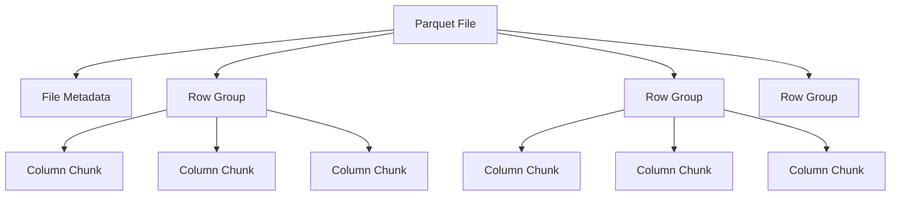
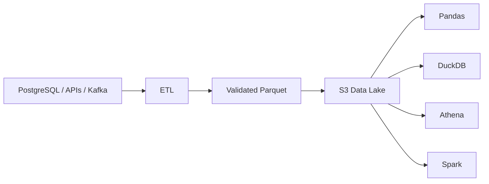
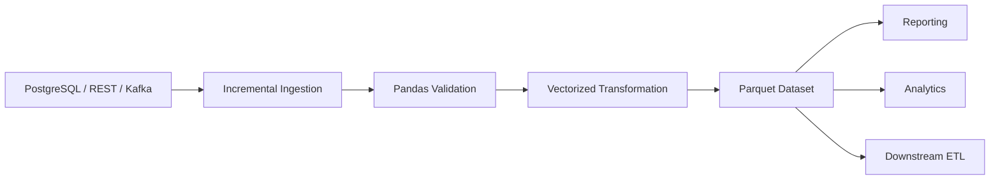

# 14- Parquet Performance

## Overview

Parquet is a columnar storage format designed for efficient analytical workloads. It is particularly effective with Pandas because Pandas commonly processes subsets of columns, performs typed transformations, and runs aggregations over structured tabular data.

Compared with CSV, Parquet can significantly reduce:

```text
disk I/O
network transfer
parsing overhead
memory required for selected columns
```

The main performance characteristics come from:

```text
columnar storage
+
compression
+
typed schema
+
column statistics
+
predicate and column projection
```

For backend and data-engineering workloads, Parquet is especially useful for:

- ETL pipelines
- reporting datasets
- batch processing
- object storage such as Amazon S3
- analytical data lakes
- intermediate pipeline stages
- historical event data

The important engineering principle is:

> Store data in a representation optimized for the way it will be read.

---

## What Parquet Is

Parquet stores data by column rather than primarily by row.

A simplified row-oriented layout looks like:

```text
row 1: customer_id, status, amount, created_at
row 2: customer_id, status, amount, created_at
row 3: customer_id, status, amount, created_at
```

A columnar representation groups values by column:

```text
customer_id:  1001, 1002, 1003, ...
status:       paid, paid, failed, ...
amount:       125, 80, 42, ...
created_at:   ..., ..., ...
```

This is highly useful when a query needs only:

```text
status
amount
```

instead of the entire row.

---

## Why Parquet Is Faster for Analytical Workloads

Consider a dataset with:

```text
50 columns
500 million rows
```

A report may require only:

```text
customer_id
amount
created_at
```

Reading a row-oriented CSV often requires scanning the text representation of the full file.

With Parquet, the reader can project the required columns:

```python
orders = pd.read_parquet(
    "orders.parquet",
    columns=[
        "customer_id",
        "amount",
        "created_at",
    ],
)
```

This can dramatically reduce:

```text
bytes read
CPU spent decoding unused columns
memory consumption
network traffic
```

---

## Row-Oriented vs Columnar Storage

| Characteristic | CSV | Parquet |
|---|---|---|
| Storage model | Text, row-oriented representation | Columnar |
| Schema | Mostly external/inferred | Stored with file metadata |
| Compression | External/manual | Built into format |
| Column projection | Poor | Excellent |
| Predicate pushdown | Limited | Supported by readers |
| Nested types | Awkward | Supported by format |
| Type preservation | Weak | Stronger |
| Human-readable | Yes | No |
| Analytics | Usually slower | Usually better |
| Incremental dataset layout | Possible | Natural |
| Cross-language support | Excellent | Excellent |

CSV remains useful for:

```text
interchange
simple exports
human inspection
external system compatibility
```

Parquet is generally preferable for internal analytical datasets.

---

## Parquet File Structure

A Parquet file is not simply a compressed CSV.

It contains metadata describing:

```text
schema
columns
row groups
column chunks
encodings
statistics
compression
```

A simplified structure is:



A reader can use this metadata to avoid reading unnecessary data.

---

## Row Groups

A Parquet file is divided into row groups.

A row group contains a horizontal subset of rows, with each column stored separately within that group.

Conceptually:

```text
Row Group 1
    customer_id
    amount
    status

Row Group 2
    customer_id
    amount
    status

Row Group 3
    customer_id
    amount
    status
```

Row groups matter because they are a major unit for:

```text
I/O
parallelism
statistics
predicate filtering
```

Poorly chosen row-group sizing can reduce the benefits of Parquet.

---

## Column Projection

Column projection means reading only the columns required by the operation.

Prefer:

```python
orders = pd.read_parquet(
    "orders.parquet",
    columns=[
        "order_id",
        "customer_id",
        "amount",
    ],
)
```

over:

```python
orders = pd.read_parquet(
    "orders.parquet",
)

orders = orders[
    [
        "order_id",
        "customer_id",
        "amount",
    ]
]
```

The first approach prevents unnecessary columns from being loaded in the first place.

This is especially important for wide production datasets.

---

## Predicate Pushdown

Predicate pushdown means applying a filter as close to the storage layer as possible so irrelevant data can be skipped.

For example:

```python
orders = pd.read_parquet(
    "orders.parquet",
    filters=[
        ("status", "=", "completed"),
    ],
)
```

The exact ability to skip data depends on:

```text
reader engine
file metadata
row-group statistics
filter expression
partition layout
```

Pandas delegates Parquet reading to an underlying engine such as PyArrow or another supported implementation.

Predicate pushdown should therefore be viewed as a storage-engine optimization, not simply a Pandas feature.

---

## Column Projection vs Predicate Filtering

These solve different problems:

| Optimization | Reduces |
|---|---|
| Column projection | Unused columns |
| Predicate pushdown | Unneeded rows/row groups |
| Partition pruning | Entire dataset partitions |
| Compression | Physical storage and transfer |
| Appropriate encoding | CPU and storage overhead |

The strongest pipelines often combine all of them.

---

## Compression

Parquet supports compression at the column-chunk level.

Common codecs include:

```text
Snappy
Zstandard
Gzip
Brotli
LZ4
```

A useful default for many analytics workloads is:

```python
orders.to_parquet(
    "orders.parquet",
    engine="pyarrow",
    compression="zstd",
)
```

However, the best codec depends on:

```text
read frequency
write frequency
CPU budget
storage cost
network cost
dataset characteristics
```

---

## Compression Trade-Offs

Compression is a trade-off, not a universal speed multiplier.

| Codec | Typical trade-off |
|---|---|
| Snappy | Fast, moderate compression |
| Zstandard | Strong compression with good general performance |
| Gzip | Strong compression, often more CPU-intensive |
| Brotli | Strong compression, workload-dependent CPU cost |
| LZ4 | Very fast, lower compression ratio in many cases |

For frequently read analytical data:

```text
storage savings
+
reduced network transfer
```

may justify additional CPU spent during decompression.

For extremely latency-sensitive pipelines, benchmark both read and write paths.

---

## Writing Parquet from Pandas

A typical write:

```python
orders.to_parquet(
    "orders.parquet",
    engine="pyarrow",
    compression="zstd",
    index=False,
)
```

Important considerations include:

```text
engine
compression
index handling
schema
partitioning
file size
destination storage
```

For analytics datasets, `index=False` is often appropriate unless the index has explicit semantic value.

---

## Reading Parquet

A basic read:

```python
orders = pd.read_parquet(
    "orders.parquet",
    engine="pyarrow",
)
```

Column projection:

```python
orders = pd.read_parquet(
    "orders.parquet",
    columns=[
        "order_id",
        "customer_id",
        "amount",
    ],
)
```

Filtering:

```python
orders = pd.read_parquet(
    "orders.parquet",
    filters=[
        ("status", "=", "completed"),
    ],
)
```

The exact filter capabilities depend on the storage layout and Parquet reader.

---

## Parquet and Data Types

One of Parquet's major advantages is preserving typed data more effectively than CSV.

For example:

```text
integer
floating-point
boolean
datetime
string
categorical-like representations
nested structures
```

This reduces repeated parsing and schema reconstruction.

For example:

```python
orders = pd.read_parquet(
    "orders.parquet",
)
```

typically does not require the same type-inference process as:

```python
orders = pd.read_csv(
    "orders.csv",
)
```

Typed storage should still be validated against the expected application schema.

---

## CSV to Parquet Pipeline

A common migration pattern is:


Example:

```python
import pandas as pd


orders = pd.read_csv(
    "orders.csv",
    dtype={
        "order_id": "string",
        "customer_id": "string",
        "status": "string",
    },
)

orders["amount"] = pd.to_numeric(
    orders["amount"],
    errors="raise",
)

orders["created_at"] = pd.to_datetime(
    orders["created_at"],
    utc=True,
    errors="raise",
)

orders.to_parquet(
    "orders.parquet",
    engine="pyarrow",
    compression="zstd",
    index=False,
)
```

The conversion step should be treated as schema normalization, not merely file-format conversion.

---

## Parquet and Pandas Memory Usage

Parquet improves storage and read efficiency, but it does not eliminate Pandas' in-memory nature.

This:

```python
orders = pd.read_parquet(
    "orders.parquet",
)
```

can still create a large in-memory DataFrame.

For large datasets:

```python
orders = pd.read_parquet(
    "orders.parquet",
    columns=[
        "customer_id",
        "amount",
    ],
)
```

is better, but may still exceed available memory.

Use:

```text
partitioning
filtered reads
chunked processing
SQL engines
DuckDB
Polars
Dask
Spark
```

when the workload exceeds safe single-node Pandas limits.

---

## Parquet and Chunk Processing

Parquet integrates naturally with bounded processing.

A large Parquet dataset can be organized into:

```text
daily partitions
monthly partitions
multiple files
row-group-level reads
```

The application can then process only the relevant subset.

For example:

```text
S3
└── orders/
    ├── date=2026-09-01/
    ├── date=2026-09-02/
    ├── date=2026-09-03/
    └── ...
```

A report for one day does not need to load the entire historical dataset.

---

## Partitioning

Partitioning places data into separate directory or dataset partitions based on a logical key.

Typical candidates:

```text
date
year
month
region
tenant
event_type
```

The best partition key is driven by query patterns.

For time-series workloads:

```text
event_date
```

is often useful because consumers frequently query date ranges.

Avoid partitioning on high-cardinality keys such as:

```text
request_id
transaction_id
UUID
```

because this can create enormous numbers of tiny files.

---

## Partition Pruning

Partition pruning allows the reader to skip entire partitions that cannot satisfy a filter.

For example:

```text
dataset/
    event_date=2026-09-01/
    event_date=2026-09-02/
    event_date=2026-09-03/
```

A query for:

```text
event_date = 2026-09-03
```

can avoid opening earlier partitions.

This is often more powerful than row-level filtering because entire directories or files can be skipped.

---

## Partitioning vs Row Groups

These operate at different levels:

| Level | Purpose |
|---|---|
| Partition | Organize large datasets into logical subsets |
| File | Physical unit of storage |
| Row group | Internal unit for scan and statistics |
| Column chunk | Per-column storage within a row group |

A production dataset can use all of them together:

```text
date partition
    ↓
Parquet files
    ↓
row groups
    ↓
column chunks
```

---

## The Small Files Problem

One of the most common Parquet performance failures is excessive file fragmentation.

Example:

```text
10 million files
100 KB each
```

Even if the total data volume is reasonable, metadata and filesystem/object-storage operations can become expensive.

Small files increase:

```text
file-open operations
metadata overhead
S3 API requests
query planning overhead
scheduler overhead
```

Prefer fewer reasonably sized files rather than thousands of tiny files.

---

## File Size Considerations

There is no single ideal Parquet file size for every system.

The correct target depends on:

```text
object storage
query engine
network bandwidth
parallelism
dataset size
number of consumers
```

In distributed analytics systems, files that are too small reduce efficiency, while extremely large files can reduce parallelism and make retries expensive.

Benchmark the actual query engine and storage environment.

---

## Partition Explosion

Partitioning can become counterproductive when cardinality is high.

Bad example:

```text
tenant_id
+
customer_id
+
request_id
```

could produce huge numbers of tiny partitions.

Prefer a smaller set of stable, commonly filtered dimensions:

```text
event_date
region
```

when those match real query patterns.

Partition for data access patterns, not because partitioning itself sounds scalable.

---

## Parquet Statistics

Parquet readers can use statistics associated with row groups.

A simplified example:

```text
Row Group 1
amount:
    min = 1
    max = 100

Row Group 2
amount:
    min = 5,000
    max = 9,000
```

A filter such as:

```text
amount > 10,000
```

may allow the reader to skip both groups.

The exact pruning behavior depends on the reader, stored statistics, and predicate.

This is one reason physically organized Parquet datasets can outperform naive file scans.

---

## Sorting and Data Locality

Data organization affects pruning opportunities.

Suppose queries frequently filter by:

```text
customer_id
```

but rows are randomly distributed across every row group.

Statistics may be too broad to skip much data.

If the data is organized so related values are more localized, row-group statistics may become more selective.

This must be balanced against:

```text
write cost
sorting cost
maintenance complexity
```

Do not sort every dataset simply for theoretical pruning benefits. Optimize for dominant access patterns.

---

## Predicate Selectivity

Suppose a dataset contains:

```text
1 billion rows
```

and:

```text
status = "completed"
```

matches:

```text
95%
```

The filter is weakly selective.

But:

```text
customer_id = "C12345"
```

may match:

```text
0.001%
```

Highly selective predicates benefit more from effective partitioning and row-group organization.

Measure actual selectivity rather than assuming every filter provides meaningful pruning.

---

## Parquet and S3

Parquet is particularly effective for object-storage data lakes.

Typical architecture:



Benefits include:

```text
compressed storage
column projection
partition pruning
parallel reads
cross-engine interoperability
```

The S3 path should usually represent a dataset rather than one ever-growing monolithic object.

---

## Network Performance

On AWS or another cloud environment, Parquet can reduce network transfer.

Consider:

```text
100 GB raw CSV
```

versus:

```text
20 GB compressed Parquet
```

If an analytical job needs only:

```text
3 columns
```

the actual data transferred may be much smaller still.

This directly affects:

```text
latency
compute throughput
cross-AZ/network costs
cloud data transfer
```

Storage optimization can therefore become an application performance optimization.

---

## Parquet and REST APIs

Parquet is usually an internal storage format rather than a public REST API format.

A common architecture is:

```text
REST API
   ↓
JSON ingestion
   ↓
Pandas transformation
   ↓
Parquet
   ↓
analytics/reporting
```

For API responses:

```text
JSON
```

is usually appropriate at the service boundary.

For internal analytical storage:

```text
Parquet
```

is often substantially more efficient.

Do not force Parquet into browser-facing APIs simply because it performs well internally.

---

## Parquet and PostgreSQL

PostgreSQL is usually preferable for transactional queries involving:

```text
point lookups
updates
constraints
transactions
relational integrity
```

Parquet is generally better suited to:

```text
large scans
historical analytics
ETL stages
batch reporting
data lake workloads
```

A common architecture is:

```text
PostgreSQL
    ↓
Incremental extraction
    ↓
Parquet
    ↓
Analytical processing
```

Do not move operational workloads to Parquet merely for storage efficiency.

---

## Parquet and Reporting

For a daily reporting system:

```text
PostgreSQL
    ↓
extract changed records
    ↓
Pandas transformation
    ↓
partitioned Parquet
    ↓
report generation
```

A subsequent report can read:

```python
daily_orders = pd.read_parquet(
    "orders",
    filters=[
        ("event_date", "=", "2026-09-09"),
    ],
    columns=[
        "customer_id",
        "amount",
        "status",
    ],
)
```

This avoids repeatedly scanning historical records that are irrelevant to the report.

---

## Incremental Parquet Pipelines

A production pipeline may use:

```text
raw source
    ↓
watermark
    ↓
extract incremental records
    ↓
transform
    ↓
write partition
    ↓
validate
    ↓
publish
```

For example:

```text
s3://analytics/orders/
    event_date=2026-09-08/
    event_date=2026-09-09/
    event_date=2026-09-10/
```

The pipeline can process only newly arrived or changed data.

For late-arriving data, define whether the partition is:

```text
replaced
merged
corrected
recomputed
```

Do not rely on blindly appending new files forever.

---

## Atomic Dataset Publishing

A reporting consumer should not observe a half-written dataset.

A safer workflow is:

```text
write temporary output
    ↓
validate schema/data quality
    ↓
publish atomically or through a versioned manifest
```

For object storage, a common approach is to write immutable files and publish a complete dataset version through metadata or a table abstraction.

The exact mechanism depends on the storage system and table format.

---

## Schema Evolution

Parquet stores schema information, but production datasets still require explicit schema management.

Examples of schema changes:

```text
add column
rename column
change type
remove column
change nullability
```

Safe changes usually require a documented compatibility strategy.

For example:

```text
old files:
amount → float64

new files:
amount → decimal-compatible representation
```

may require careful reader and downstream validation.

Do not assume that a Parquet writer and reader will automatically make every schema evolution safe.

---

## Schema Validation

Before publishing a dataset, validate:

```text
required columns
expected dtypes
nullability
allowed categorical values
date ranges
duplicate keys
row counts
numeric constraints
```

Example:

```python
required_columns = {
    "order_id",
    "customer_id",
    "amount",
    "event_date",
}

missing = (
    required_columns
    - set(orders.columns)
)

if missing:
    raise ValueError(
        f"Missing columns: {sorted(missing)}"
    )

if orders["order_id"].duplicated().any():
    raise ValueError(
        "Duplicate order IDs detected"
    )
```

Storage format optimization should never replace data-quality validation.

---

## Parquet and Decimal Data

Financial values require special care.

Avoid assuming:

```python
float64
```

is an acceptable representation merely because Parquet can store floating-point values efficiently.

For financial systems, consider:

```text
decimal semantics
database-native numeric types
explicit rounding rules
currency-aware validation
```

The storage format should preserve the intended business precision.

---

## Parquet and Time Zones

Normalize timestamp semantics explicitly.

A recommended convention for backend data pipelines is often:

```text
UTC
```

Example:

```python
orders["created_at"] = pd.to_datetime(
    orders["created_at"],
    utc=True,
    errors="raise",
)
```

Avoid mixing:

```text
naive timestamps
timezone-aware timestamps
local-time values
```

across partitions.

Temporal inconsistencies are especially dangerous in incremental pipelines.

---

## Reading Only Needed Partitions

Partition-aware reading should be preferred when the query naturally maps to partitions.

For example:

```text
event_date=2026-09-10
```

rather than:

```text
read all historical files
→ filter later
```

The difference can be enormous at scale.

The general principle is:

```text
filter at storage
>
filter after DataFrame materialization
```

when storage-level filtering is supported.

---

## Performance Measurement

Do not assume Parquet is faster without measuring.

Benchmark:

```text
CSV read time
Parquet read time
Parquet filtered read time
column-projected read time
memory usage
compressed size
network bytes
```

Example:

```python
from time import perf_counter

import pandas as pd


started = perf_counter()

orders = pd.read_parquet(
    "orders.parquet",
    columns=[
        "customer_id",
        "amount",
    ],
)

elapsed = perf_counter() - started

print(
    f"rows={len(orders)} "
    f"elapsed_seconds={elapsed:.3f}"
)
```

Measure the complete workload rather than only the file read.

---

## Benchmarking Storage Formats

A useful comparison is:

| Workload | CSV | Parquet |
|---|---|---|
| Full-table scan | Often slower | Often faster |
| Few-column scan | Inefficient | Strong advantage |
| Filtered scan | Usually weaker | Stronger with pushdown |
| Human inspection | Excellent | Poor |
| Schema preservation | Weak | Stronger |
| Compression | External | Native |
| Analytical storage | Usually suboptimal | Strong fit |

Benchmark using representative data because:

```text
column cardinality
data types
compression
file size
query selectivity
storage medium
```

all influence results.

---

## File-Level Parallelism

Parquet datasets containing multiple files can support parallel reads in analytical systems.

For example:

```text
part-0001.parquet
part-0002.parquet
part-0003.parquet
part-0004.parquet
```

Different workers can process different files.

However, more files do not automatically mean more performance.

The practical target is:

```text
enough parallelism
+
reasonable file sizes
+
manageable metadata
```

---

## Tiny Files and Celery

A pipeline that creates one Parquet file per Celery task can accidentally produce:

```text
millions of tiny Parquet files
```

This creates an operational problem even if each task is fast.

Instead:

```text
many micro-batches
        ↓
controlled aggregation
        ↓
reasonably sized output files
```

should be considered.

Separate task granularity from storage-file granularity.

---

## Compaction

Compaction combines many small files into fewer larger files.

Example:

```text
Before:
10000 × small parquet files

        ↓ compaction

After:
100 × larger parquet files
```

Compaction can improve:

```text
read throughput
metadata operations
planning time
object-storage request overhead
```

But it adds compute and I/O cost.

Run compaction when the read-time benefit justifies the maintenance cost.

---

## Production Monitoring

Monitor Parquet pipelines using metrics such as:

```text
input rows
output rows
input bytes
output bytes
compression ratio
read duration
write duration
bytes read
bytes written
files created
average file size
partition count
invalid rows
schema validation failures
```

For large systems, alert on:

```text
unexpected file-count growth
tiny-file ratio
compression degradation
schema drift
processing latency
abnormally large partitions
```

These often reveal upstream data-quality or pipeline-design problems.

---

## Cost Considerations

Cloud data pipelines incur costs from:

```text
storage
network transfer
object-storage API operations
compute
query scans
compaction
```

Parquet can reduce storage and scan volume, but poor partitioning can increase:

```text
file counts
metadata work
object-store requests
```

The cheapest dataset is not necessarily the one with the smallest byte count.

Optimize total workload cost:

```text
storage
+
compute
+
I/O
+
operational complexity
```

---

## Reliability and Recovery

Parquet works well with immutable, batch-oriented processing.

A robust design can use:

```text
immutable source
    ↓
batch transformation
    ↓
temporary output
    ↓
validation
    ↓
publish
```

If a batch fails:

```text
previous published data remains available
```

and the failed batch can be retried.

This is generally safer than repeatedly mutating one large monolithic file.

---

## Disaster Recovery

For important analytical datasets, define:

```text
source-of-truth
retention
backup strategy
reprocessing strategy
versioning
recovery point objective
recovery time objective
```

Parquet files can often be regenerated from upstream source systems, which may make reproducible ETL more valuable than copying every derived artifact indefinitely.

For S3-based systems, consider:

```text
versioning
cross-region replication where required
lifecycle policies
object lock where appropriate
```

based on business requirements.

---

## Security Considerations

Parquet is a storage format, not a security boundary.

Sensitive datasets still require:

```text
IAM controls
encryption at rest
TLS in transit
least-privilege access
data retention
audit logging
```

For S3:

```text
private buckets
IAM policies
bucket policies
server-side encryption
```

should be configured according to organizational security requirements.

Do not assume that internal analytical storage is safe simply because it is not exposed through a REST endpoint.

---

## Common Mistakes

### Reading the Entire Dataset Before Filtering

```python
df = pd.read_parquet("orders.parquet")
df = df[df["event_date"] == target_date]
```

If the dataset is large and storage-level filtering is available, this can waste substantial I/O and memory.

Prefer partition-aware or filter-aware reads.

### Loading All Columns

Wide datasets can become unnecessarily expensive.

Use:

```python
columns=[
    "customer_id",
    "amount",
]
```

whenever possible.

### Creating Too Many Tiny Files

This increases metadata and storage-operation overhead.

### Over-Partitioning

High-cardinality partition keys can create partition explosion.

### Assuming Compression Always Improves Everything

Higher compression can increase CPU cost.

### Treating Parquet as a Database

Parquet does not provide transactional database semantics by itself.

### Ignoring Schema Evolution

Independent pipeline versions can create incompatible files.

### Using Float for Financial Precision Without a Requirement Review

Storage efficiency is secondary to preserving business correctness.

### Writing Directly to the Final Published Location

Consumers may observe incomplete output unless publishing is designed carefully.

### Assuming Pandas Can Read Arbitrarily Large Parquet Datasets

Parquet reduces I/O and storage costs but does not remove Pandas' in-memory execution constraints.

---

## Parquet vs Database vs Other Engines

| Technology | Best Fit | Main Strength |
|---|---|---|
| PostgreSQL | Transactional and relational workloads | Transactions and indexed queries |
| Parquet | Analytical file-based storage | Columnar scans and compression |
| CSV | Interchange | Simplicity and portability |
| DuckDB | Local analytical SQL | Fast single-node analytics |
| Polars | Fast DataFrame processing | Efficient execution and lower overhead in many workloads |
| Dask | Distributed DataFrame-style workloads | Parallel Python data processing |
| Spark | Large distributed processing | Horizontal scalability |
| Apache Iceberg / Delta Lake / Hudi | Table-level data lake management | Schema evolution, snapshots, table semantics |

Pandas remains valuable when:

```text
data fits comfortably on one machine
+
Python ecosystem integration matters
+
transformation complexity is manageable
```

Parquet improves the storage layer but does not change those boundaries.

---

## Practical ETL Pattern

A production-oriented workflow might be:



The storage layer should optimize the dominant downstream access pattern.

For example:

```text
raw events
→ partition by event_date
→ project frequently queried columns
→ compress with appropriate codec
→ validate schema
→ publish immutable files
```

---

## Practical Example

Consider an order pipeline:

```python
from pathlib import Path

import pandas as pd


input_path = Path("data/raw/orders.csv")
output_path = Path("data/processed/orders.parquet")

orders = pd.read_csv(
    input_path,
    usecols=[
        "order_id",
        "customer_id",
        "status",
        "amount",
        "created_at",
    ],
    dtype={
        "order_id": "string",
        "customer_id": "string",
        "status": "string",
    },
)

orders["amount"] = pd.to_numeric(
    orders["amount"],
    errors="raise",
)

orders["created_at"] = pd.to_datetime(
    orders["created_at"],
    utc=True,
    errors="raise",
)

if orders["order_id"].duplicated().any():
    raise ValueError(
        "Duplicate order IDs detected"
    )

if orders["amount"].lt(0).any():
    raise ValueError(
        "Negative order amounts detected"
    )

orders["event_date"] = (
    orders["created_at"]
    .dt.strftime("%Y-%m-%d")
)

output_path.parent.mkdir(
    parents=True,
    exist_ok=True,
)

orders.to_parquet(
    output_path,
    engine="pyarrow",
    compression="zstd",
    index=False,
)
```

This pattern demonstrates:

```text
column projection
explicit dtypes
type normalization
validation
derived partition-ready data
compressed Parquet output
```

---

## A Better Production Dataset Layout

Rather than:

```text
orders.parquet
```

for an indefinitely growing dataset, prefer a dataset layout aligned with access patterns:

```text
orders/
    event_date=2026-09-07/
        part-0001.parquet
        part-0002.parquet
    event_date=2026-09-08/
        part-0001.parquet
        part-0002.parquet
    event_date=2026-09-09/
        part-0001.parquet
        part-0002.parquet
```

This allows downstream consumers to read only the required dates.

---

## Engineering Decision Checklist

Before choosing a Parquet layout, answer:

```text
What columns are commonly queried?
What filters are commonly applied?
What is the expected dataset size?
What is the expected daily growth?
What is the dominant storage system?
How much parallelism is useful?
What file sizes are practical?
Which columns have high cardinality?
Which columns should be partition keys?
How often will data be rewritten?
How will late data be handled?
How will schemas evolve?
How will failures be recovered?
Who needs access to the data?
```

The answers determine:

```text
partition strategy
file sizing
compression
schema
update strategy
retention policy
```

rather than choosing defaults arbitrarily.

---

## Interview Perspective

### Why Is Parquet Usually Faster Than CSV for Analytics?

Because Parquet is columnar, typed, compressed, and capable of storage-level optimizations such as column projection and predicate filtering.

### What Is Column Projection?

Reading only the columns required for a query instead of materializing every column.

```python
pd.read_parquet(
    path,
    columns=["customer_id", "amount"],
)
```

### What Is Predicate Pushdown?

Applying supported filters during data access so the reader can avoid reading irrelevant row groups or other data units.

### Why Can Too Many Parquet Files Be Slow?

Every file introduces metadata and storage operations. Thousands or millions of tiny files can overwhelm planning and object-storage access even when the aggregate data size is reasonable.

### Should You Partition by Customer ID?

Usually not automatically. A high-cardinality partition key can create huge numbers of small partitions. Partition by dimensions that match real query patterns and have manageable cardinality.

### Does Parquet Eliminate Pandas Memory Problems?

No. Parquet reduces storage and read costs, but `pd.read_parquet()` can still materialize a large DataFrame in memory.

### When Would You Use PostgreSQL Instead?

Use PostgreSQL when transactional consistency, indexed point lookups, updates, constraints, and relational workload characteristics dominate.

### When Would You Move Beyond Pandas?

When data volume, global operations, concurrency, or processing requirements exceed the practical limits of a single-node in-memory execution model. Parquet can remain the storage format even after switching to DuckDB, Spark, Polars, or another processing engine.

## Key Takeaways

- Parquet is a columnar, typed, compressed format that is particularly effective for analytical and ETL workloads because it minimizes unnecessary I/O and preserves schema information.
- Combine column projection, predicate filtering, partition pruning, appropriate row-group organization, and suitable compression rather than relying on Parquet alone for performance.
- Avoid tiny files and partition explosion; dataset layout should reflect real query patterns, expected growth, and the capabilities of the storage and query engines.
- Parquet improves storage efficiency but does not remove Pandas' in-memory constraints, so large workloads may still require chunking, database pushdown, DuckDB, Polars, Dask, or Spark.
- Production Parquet pipelines need explicit schema validation, atomic or versioned publishing, idempotent processing, monitoring, security controls, and a deliberate strategy for schema evolution and late-arriving data.