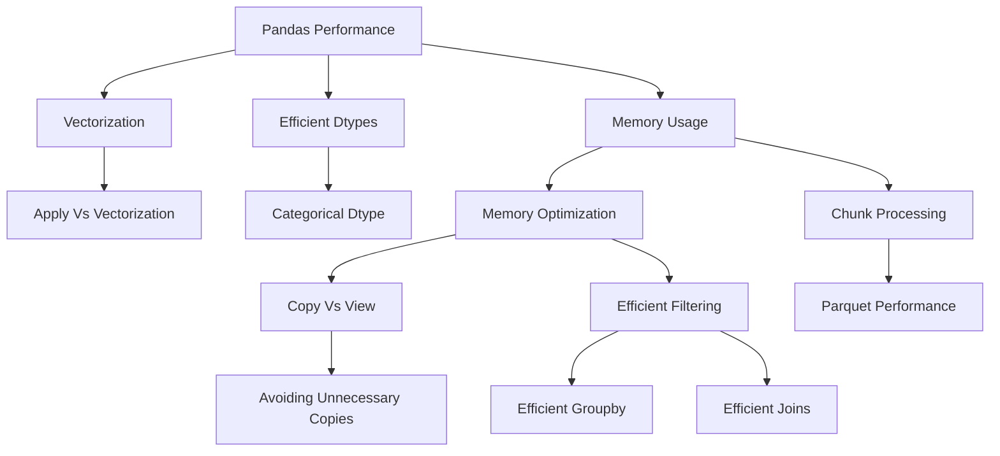

# Performance and Memory

## Overview

Parquet is a column-oriented storage format that is particularly effective for analytical Pandas workloads. This section focuses on one engineering problem: processing tabular data efficiently when memory, CPU, I/O, and dataset size become meaningful constraints.

The topics in this section should be understood as a progression:

```text
measure
  ↓
vectorize
  ↓
choose efficient dtypes
  ↓
control memory
  ↓
avoid unnecessary copies
  ↓
filter efficiently
  ↓
group efficiently
  ↓
join efficiently
  ↓
process large inputs in chunks
  ↓
use efficient storage such as Parquet
```

| # | File | Description |
|---|---|---|
| 01 | [01- Pandas Performance](./01-%20Pandas%20Performance.md) | Overall execution cost and where the workload spends CPU, memory, and I/O |
| 02 | [02- Vectorization](./02-%20Apply%20Vs%20Vectorization.md) | CPU efficiency and whether Python-level iteration can be eliminated |
| 03 | [03- Efficient Dtypes](./03-%20Efficient%20Dtypes.md) | Memory and compute efficiency and whether each column is represented appropriately |
| 04 | [04- Categorical Dtype](./04-%20Categorical%20Dtype.md) | Whether low-cardinality strings can use categorical storage |
| 05 | [05- Memory Usage](./05-%20Memory%20Usage.md) | Actual memory footprint and capacity planning |
| 06 | [06- Memory Optimization](./06-%20Memory%20Optimization.md) | How to reduce the working set safely |
| 07 | [07- Copy Vs View](./07-%20Copy%20Vs%20View.md) | Whether an object owns its data and correctness considerations |
| 08 | [08- Avoiding Unnecessary Copies](./08-%20Avoiding%20Unnecessary%20Copies.md) | Can an intermediate allocation be removed |
| 09 | [09- Efficient Filtering](./09-%20Efficient%20Filtering.md) | Data reduction and whether unnecessary rows can be eliminated earlier |
| 10 | [10- Efficient Groupby](./10-%20Efficient%20Groupby.md) | Whether grouping and aggregation can avoid unnecessary work |
| 11 | [11- Efficient Joins](./11-%20Efficient%20Joins.md) | Whether joins can be made smaller and safer |
| 12 | [12- Chunk Processing](./12-%20Chunk%20Processing.md) | Whether the workload can be processed in bounded batches |
| 13 | [13- Parquet Performance](./13-%20Parquet%20Performance.md) | Whether data can be stored and read more efficiently |
| 14 | [14- Small Files Problem](./14-%20Small%20Files%20Problem.md) | Whether metadata overhead and object-store requests are a problem |

```

Performance work should begin with measurement rather than assumptions. A DataFrame operation that is fast on 10,000 rows may become the dominant cost at 100 million rows.

---

## What This Section Covers

| Topic | Primary Concern | Core Engineering Question |
|---|---|---|
| Pandas Performance | Overall execution cost | Where is the workload spending CPU, memory, and I/O? |
| Vectorization | CPU efficiency | Can Python-level iteration be eliminated? |
| Apply Vs Vectorization | Execution model | Is `apply()` actually necessary? |
| Efficient Dtypes | Memory and compute | Is each column represented appropriately? |
| Categorical Dtype | Repeated dimensions | Can low-cardinality strings use categorical storage? |
| Memory Usage | Capacity planning | What is the actual memory footprint? |
| Memory Optimization | Peak memory | How can the working set be reduced safely? |
| Copy Vs View | Memory and correctness | Does this object own its data? |
| Avoiding Unnecessary Copies | Peak memory | Can an intermediate allocation be removed? |
| Efficient Filtering | Data reduction | Can unnecessary rows be eliminated earlier? |
| Efficient Groupby | Aggregation cost | Can grouping and aggregation avoid unnecessary work? |
| Efficient Joins | Combine cost | Can joins be made smaller and safer? |
| Chunk Processing | Dataset size | Can the workload be processed in bounded batches? |
| Parquet Performance | Storage and I/O | Can data be stored and read more efficiently? |

---

## Why Performance and Memory Matter

Pandas is primarily an in-memory processing library.

A pipeline may therefore consume resources at several stages:

```text
source read
    ↓
DataFrame materialization
    ↓
temporary arrays
    ↓
filtering
    ↓
grouping
    ↓
joins
    ↓
sorting
    ↓
serialization
    ↓
output
```

A dataset that occupies 4 GB on disk can require substantially more than 4 GB while being processed.

For example:

```text
CSV source                 4 GB
Parsed DataFrame            7 GB
Transformation intermediates 2 GB
Join result                10 GB
Peak process memory        >15 GB
```

The engineering target is not merely a small final DataFrame. It is safe and predictable **peak resource usage**.

---

## Performance Model

A useful mental model is:

```text
total cost
    =
I/O
+
parsing
+
memory allocation
+
CPU processing
+
intermediate materialization
+
serialization
```

Optimization should target the dominant component.

For example:

```text
database query is slow
→ optimize SQL first

CSV parsing dominates
→ improve source format or ingestion strategy

Python loops dominate
→ vectorize

memory peaks during join
→ reduce columns/rows and validate join cardinality

repeated full scans dominate
→ change data layout or processing strategy
```

Do not optimize an operation simply because it looks expensive in source code.

---

## Measurement Before Optimization

Basic timing:

```python
from time import perf_counter

started = perf_counter()

result = transform(orders)

elapsed = perf_counter() - started

print(f"elapsed_seconds={elapsed:.3f}")
```

DataFrame memory:

```python
memory_bytes = orders.memory_usage(
    index=True,
    deep=True,
).sum()

print(
    f"dataframe_memory_mb="
    f"{memory_bytes / 1024**2:.2f}"
)
```

Process RSS:

```python
import os

import psutil


process = psutil.Process(os.getpid())

rss_bytes = process.memory_info().rss

print(
    f"rss_mb={rss_bytes / 1024**2:.2f}"
)
```

These measurements answer different questions:

| Measurement | What it represents |
|---|---|
| `perf_counter()` | Elapsed wall-clock time |
| `memory_usage(deep=True)` | DataFrame-level memory estimate |
| RSS | Process resident memory |
| CPU metrics | Processor consumption |
| Storage metrics | Read/write cost |

---

## Optimization Order

A practical optimization sequence is:

```text
1. Measure
2. Reduce input
3. Reduce columns
4. Use appropriate dtypes
5. Vectorize
6. Reduce unnecessary copies
7. Optimize grouping and joins
8. Bound memory with chunks
9. Improve storage format
10. Re-measure
```

The highest-value optimization is often removing work rather than making the same work faster.

---

## Reducing Work at the Source

The best DataFrame optimization may happen before Pandas.

With PostgreSQL:

```sql
SELECT
    order_id,
    customer_id,
    amount
FROM orders
WHERE status = 'completed'
  AND created_at >= %(start_time)s
  AND created_at < %(end_time)s;
```

This is generally preferable to:

```python
orders = pd.read_sql(
    "SELECT * FROM orders",
    connection,
)

orders = orders.loc[
    orders["status"].eq("completed")
]
```

Source-side filtering reduces:

```text
database output
network traffic
Pandas parsing
memory usage
CPU usage
```

The same principle applies to APIs, object storage, and event systems.

---

## Vectorization

Vectorization uses operations implemented through Pandas, NumPy, or lower-level routines rather than repeatedly executing Python code for each row.

Prefer:

```python
orders["total"] = (
    orders["quantity"]
    * orders["unit_price"]
)
```

over:

```python
orders["total"] = orders.apply(
    lambda row: (
        row["quantity"]
        * row["unit_price"]
    ),
    axis=1,
)
```

Vectorized operations generally reduce Python interpreter overhead and often work more efficiently on contiguous arrays or columnar representations.

---

## Common Vectorized Operations

Useful operations include:

```text
Series arithmetic
boolean masks
isin()
between()
where()
mask()
map()
replace()
str.*
dt.*
groupby().agg()
groupby().transform()
rolling()
cumulative operations
```

Example:

```python
orders["is_large"] = (
    orders["amount"]
    .ge(1_000)
)
```

This is clearer and generally more efficient than iterating over rows.

---

## Apply Vs Vectorization

`apply()` is not inherently incorrect.

It is appropriate when:

```text
custom Python logic is genuinely required
no suitable vectorized operation exists
the dataset is small enough that the cost is acceptable
```

It becomes problematic when used as a default replacement for built-in operations.

Example:

```python
orders["is_valid"] = orders.apply(
    lambda row: (
        row["amount"] >= 0
        and row["status"] != "cancelled"
    ),
    axis=1,
)
```

can often be replaced with:

```python
orders["is_valid"] = (
    orders["amount"].ge(0)
    & orders["status"].ne("cancelled")
)
```

Always consider the execution model before choosing `apply()`.

---

## Efficient Dtypes

Dtypes influence:

```text
memory footprint
CPU operations
missing-value semantics
serialization
comparison behavior
```

Examples:

```python
orders = orders.astype(
    {
        "order_id": "string",
        "quantity": "Int64",
        "is_refunded": "boolean",
    }
)
```

Use dtypes based on the semantic meaning of the data.

Identifiers should generally remain identifiers rather than being converted to numeric values merely because they look numeric.

---

## Categorical Data

Low-cardinality repeated dimensions are good candidates for `category`.

Examples:

```text
status
region
country
department
payment_method
event_type
```

Example:

```python
orders["status"] = orders[
    "status"
].astype("category")
```

A categorical column can use a shared category dictionary and store per-row codes.

Do not use categorical dtype for high-cardinality values such as:

```text
UUID
request_id
email
free-form text
```

The memory and performance benefit depends on actual cardinality and workload.

---

## Memory Usage

Inspect column-level memory:

```python
memory = (
    orders
    .memory_usage(
        index=True,
        deep=True,
    )
    .sort_values(
        ascending=False,
    )
)

print(memory)
```

This often exposes unexpectedly expensive columns such as:

```text
object/string data
duplicated text
large JSON payloads
unnecessary columns
```

For production workloads, monitor process RSS as well because DataFrame memory does not account for all application memory.

---

## Peak Memory vs Final Memory

This distinction is critical.

Consider:

```python
result = orders.merge(
    customers,
    on="customer_id",
)
```

The final `result` may require:

```text
8 GB
```

while the process temporarily holds:

```text
orders
customers
join structures
intermediate arrays
result
```

and reaches:

```text
15 GB peak
```

Reducing only final DataFrame size does not necessarily prevent an OOM failure.

Optimize the **peak working set**.

---

## Memory Optimization

A practical memory strategy is:

```text
measure
→ project columns
→ filter rows
→ normalize dtypes
→ avoid duplicate DataFrames
→ reduce intermediates
→ process in chunks
→ use efficient storage
```

Filtering before copying:

```python
completed = orders.loc[
    orders["status"].eq("completed"),
    [
        "order_id",
        "customer_id",
        "amount",
    ],
].copy()
```

is usually better than copying the full DataFrame and then reducing it.

---

## Copy Vs View

Pandas objects may share underlying data depending on how they were produced and on the Pandas execution model.

Do not rely on uncertain aliasing for correctness.

For explicit independent mutation:

```python
completed = orders.loc[
    orders["status"].eq("completed")
].copy()
```

For assignment, prefer explicit `.loc`:

```python
orders.loc[
    orders["status"].eq("completed"),
    "priority",
] = "high"
```

Avoid chained assignment:

```python
orders[
    orders["status"].eq("completed")
]["priority"] = "high"
```

The problem is not merely style. Ambiguous ownership can produce incorrect updates and unnecessary copies.

---

## Avoiding Unnecessary Copies

Unnecessary copies increase:

```text
allocation cost
peak memory
CPU overhead
garbage-collection pressure
```

A useful pattern is:

```python
filtered = orders.loc[
    orders["status"].eq("completed"),
    [
        "customer_id",
        "amount",
    ],
].copy()
```

Instead of:

```python
copy = orders.copy()

filtered = copy.loc[
    copy["status"].eq("completed")
]

filtered = filtered[
    [
        "customer_id",
        "amount",
    ]
]
```

Copy only at meaningful ownership boundaries.

---

## Efficient Filtering

Apply selective, inexpensive filters early.

```python
eligible = orders.loc[
    orders["status"].eq("completed")
    & orders["amount"].gt(0),
    [
        "customer_id",
        "amount",
    ],
]
```

Filtering before:

```text
groupby
join
sort
expensive transformation
```

usually reduces downstream work.

Push equivalent filters into SQL or storage-level predicates whenever practical.

---

## Filter Selectivity

A filter that removes:

```text
99%
```

of the dataset is much more valuable to execute early than one that removes:

```text
2%
```

of the dataset.

This matters especially in pipelines like:

```text
read
→ parse
→ join
→ group
→ sort
```

where reducing the dataset before later stages multiplies the benefit.

---

## Efficient Groupby

Groupby performance depends on:

```text
row count
number of grouping keys
key cardinality
dtype
sort behavior
aggregation complexity
```

Prefer built-in aggregations:

```python
summary = (
    orders
    .groupby(
        "customer_id",
        sort=False,
    )
    .agg(
        revenue=("amount", "sum"),
        order_count=("order_id", "count"),
    )
    .reset_index()
)
```

Avoid Python callbacks when the operation can be expressed using native aggregations.

---

## Groupby Options

Important options include:

```python
orders.groupby(
    "customer_id",
    sort=False,
    observed=True,
)
```

`sort=False` avoids sorting group keys when output order does not matter.

`observed=True` is useful when categorical grouping keys are involved and only observed category combinations are required.

Do not treat either option as a universal performance guarantee. Benchmark the actual workload.

---

## Aggregate vs Transform

Use `agg()` when the output should contain one row per group:

```python
customer_totals = (
    orders
    .groupby("customer_id")
    .agg(
        total_amount=("amount", "sum"),
    )
)
```

Use `transform()` when the group-level result must align back with the original rows:

```python
orders["customer_total"] = (
    orders
    .groupby("customer_id")["amount"]
    .transform("sum")
)
```

Choosing the right operation avoids unnecessary joins or repeated groupby work.

---

## Efficient Joins

Joins can be among the most memory-intensive Pandas operations.

Before joining:

```text
reduce rows
reduce columns
normalize key dtypes
validate cardinality
```

Example:

```python
customers_small = customers.loc[
    :,
    [
        "customer_id",
        "segment",
    ],
]

orders = orders.loc[
    orders["status"].eq("completed"),
]

enriched = orders.merge(
    customers_small,
    on="customer_id",
    how="left",
    validate="many_to_one",
)
```

The `validate` option protects against unexpected many-to-many relationships.

---

## Join Cardinality

Always reason about the expected relationship:

| Relationship | Example |
|---|---|
| One-to-one | user → profile |
| Many-to-one | orders → customer |
| One-to-many | customer → orders |
| Many-to-many | products ↔ promotions |

Many-to-many joins can multiply rows dramatically.

A dataset containing:

```text
10 million orders
```

can produce a much larger intermediate result if reference data contains duplicate keys.

Join correctness and memory safety are therefore closely related.

---

## Chunk Processing

When the full dataset cannot safely fit in memory, use bounded processing.

For CSV:

```python
for chunk in pd.read_csv(
    "orders.csv",
    chunksize=100_000,
):
    process(chunk)
```

The key is to avoid reconstructing the entire dataset in memory afterward.

Prefer:

```text
chunk
→ transform
→ aggregate/persist
→ release
→ next chunk
```

rather than:

```text
chunk
→ append to Python list
→ concatenate everything at the end
```

---

## Chunk-Friendly Computations

Chunk processing works especially well for operations that can be combined.

Examples:

```text
sum
count
partial aggregates
filtering
normalization
format conversion
validation
```

Some global operations require special treatment:

```text
exact median
global sorting
global ranking
cross-chunk duplicate detection
large joins
```

Do not assume an operation remains mathematically correct after independently processing each chunk.

---

## Incremental Processing

Chunking becomes especially useful when paired with incremental data ingestion.

Typical architecture:


For reliability:

```text
persist
→ confirm success
→ checkpoint
```

Do not advance the source checkpoint before the output is durably handled.

---

## Parquet Performance

Parquet is columnar, typed, and compressed.

A targeted read:

```python
orders = pd.read_parquet(
    "orders.parquet",
    columns=[
        "customer_id",
        "amount",
        "event_date",
    ],
)
```

can avoid reading unrelated columns.

For supported datasets and readers, filters can also be pushed toward storage:

```python
orders = pd.read_parquet(
    "orders.parquet",
    filters=[
        ("event_date", "=", "2026-09-10"),
    ],
)
```

The actual amount of data skipped depends on the dataset layout and reader capabilities.

---

## Partitioned Parquet

Large analytical datasets are often better represented as a dataset rather than a single ever-growing file.

Example:

```text
orders/
    event_date=2026-09-08/
    event_date=2026-09-09/
    event_date=2026-09-10/
```

A query for one day can then avoid scanning unrelated partitions.

Good partition keys usually have:

```text
high query relevance
manageable cardinality
stable semantics
```

Avoid creating one partition per:

```text
request_id
UUID
transaction_id
```

---

## Small Files Problem

This layout can be harmful:

```text
orders/
    part-000001.parquet
    part-000002.parquet
    ...
    part-500000.parquet
```

Large numbers of tiny files create:

```text
metadata overhead
object-store requests
query planning overhead
filesystem overhead
```

Storage-file granularity should be designed separately from application task granularity.

Compaction may be necessary when a pipeline generates excessive small files.

---

## CSV vs Parquet

| Concern | CSV | Parquet |
|---|---|---|
| Human readability | Excellent | Poor |
| Schema preservation | Limited | Stronger |
| Compression | External/manual | Built in |
| Few-column reads | Inefficient | Efficient |
| Analytical scans | Usually weaker | Strong fit |
| Interoperability | Excellent | Excellent |
| Append-oriented logs | Simple | Dataset design required |
| Internal analytical storage | Usually suboptimal | Usually preferable |

A common architecture is:

```text
external input
→ CSV / JSON / API
→ validation
→ normalized DataFrame
→ Parquet
→ analytical consumers
```

---

## Backend Integration

Performance techniques in this section connect to the rest of a backend architecture.

### PostgreSQL

Push filtering and aggregation into SQL when the database is the appropriate execution engine.

### REST APIs

Request only necessary fields and use pagination or cursors instead of downloading the entire dataset.

### Kafka

Treat consumer polls as bounded batches and commit offsets only after successful downstream handling.

### Celery

Use bounded task payloads and task granularity that matches retry and resource constraints.

### Docker and Kubernetes

Size CPU and memory resources based on measured peak usage, not only average usage.

### AWS S3

Use Parquet datasets, sensible partitioning, compression, and lifecycle policies rather than continually appending to one massive object.

---

## Observability

Production pipelines should expose enough information to identify performance regressions.

Useful metrics include:

```text
rows read
rows written
bytes read
bytes written
processing duration
rows per second
peak RSS
DataFrame memory
join output rows
group count
invalid rows
file count
average file size
```

Log identifiers such as:

```text
batch_id
pipeline_version
partition
dataset_version
```

rather than logging sensitive DataFrame contents.

---

## Capacity Planning

Estimate:

```text
peak memory
+
worker concurrency
+
temporary allocations
+
serialization overhead
```

For example, if one worker has a measured peak RSS of:

```text
1.8 GB
```

and four workers execute concurrently:

```text
1.8 GB × 4 = 7.2 GB
```

before accounting for process and platform overhead.

A Kubernetes memory limit close to 7.2 GB would be unsafe. Resource requests and limits should include appropriate headroom.

---

## Scaling Beyond Pandas

Pandas is a strong choice when:

```text
the working set fits comfortably on one machine
+
processing complexity is manageable
+
Python integration is valuable
```

Consider another engine when:

```text
datasets no longer fit safely in one process
global operations become dominant
multiple workers are required
the workload needs distributed execution
concurrency requirements exceed Pandas' design
```

Common alternatives include:

```text
PostgreSQL
DuckDB
Polars
Dask
Spark
warehouse engines
lakehouse table formats
```

Parquet can remain the storage format even after changing the processing engine.

---

## Practical Optimization Workflow

A production optimization workflow can be:

```text
Identify workload
    ↓
Measure time and memory
    ↓
Find dominant stage
    ↓
Reduce input volume
    ↓
Reduce columns
    ↓
Normalize dtypes
    ↓
Vectorize
    ↓
Reduce copies
    ↓
Optimize groupby/join
    ↓
Chunk if necessary
    ↓
Improve storage
    ↓
Benchmark again
    ↓
Deploy with monitoring
```

Every optimization should preserve:

```text
correctness
schema
null semantics
business rules
reproducibility
```

---

## Common Mistakes

### Optimizing Without Measuring

A perceived hotspot may not be the actual bottleneck.

### Loading `SELECT *`

Unused database columns create unnecessary transfer and memory cost.

### Using `apply(axis=1)` by Default

Python-level row execution can be significantly more expensive than native vectorized operations.

### Keeping Everything as `object`

Generic object columns can consume substantial memory, especially for strings.

### Copying Defensively Everywhere

Repeated `.copy()` calls increase peak memory without improving correctness when ownership is already clear.

### Joining Before Filtering

Joining a large dataset and filtering afterward can create unnecessary intermediate rows.

### Ignoring Join Cardinality

Duplicate reference keys can silently cause row multiplication.

### Accumulating All Chunks

A chunked reader does not help if every chunk is retained until the end.

### Partitioning Parquet by High-Cardinality Keys

This creates too many small files and partitions.

### Treating Parquet as a Complete Scaling Solution

Parquet improves storage and I/O. It does not turn Pandas into a distributed processing engine.

### Logging Full DataFrames

Large or sensitive DataFrame logs increase cost and create security and privacy risks.

---

## Section Dependencies

The topics work best when understood together:



The intended reasoning is:

```text
understand cost
→ reduce computation
→ represent data efficiently
→ control memory
→ reduce working-set size
→ process larger inputs safely
→ optimize storage and I/O
```

---

## Production Checklist

```text
[ ] Performance bottlenecks are measured
[ ] Peak memory is monitored
[ ] Unnecessary rows are filtered early
[ ] Unused columns are projected out
[ ] Dtypes are intentional
[ ] Low-cardinality dimensions use categorical dtype where beneficial
[ ] Vectorized operations are preferred
[ ] apply() is used only when justified
[ ] Copies are made intentionally
[ ] Groupby operations use appropriate native aggregations
[ ] Join cardinality is explicit and validated
[ ] Database filtering and aggregation are pushed down where appropriate
[ ] Large inputs use bounded processing when necessary
[ ] Chunk outputs are not accumulated indefinitely
[ ] Incremental writes are idempotent
[ ] Checkpoints occur after durable persistence
[ ] Parquet projection and filtering are used where supported
[ ] Parquet partitioning matches query patterns
[ ] Small-file growth is monitored
[ ] Schema and data-quality validation are enforced
[ ] Sensitive data is excluded from logs
[ ] Kubernetes/container memory limits include headroom
[ ] Parallelism is bounded by CPU and memory capacity
[ ] Performance regressions are benchmarked in CI or representative environments
[ ] There is a defined scaling path beyond single-node Pandas
```

## Interview Perspective

### What Should You Optimize First in Pandas?

Measure first, then reduce data volume, memory, and expensive Python-level execution before attempting lower-level micro-optimizations.

### Why Is Peak Memory More Important Than Final DataFrame Size?

Because OOM failures happen when temporary intermediates and input objects coexist. The final result can be small while the operation still exceeds process memory.

### Why Is Vectorization Usually Faster Than `apply(axis=1)`?

Vectorized operations avoid repeatedly invoking Python code for individual rows and can execute through optimized array-oriented implementations.

### Why Can a Join Cause an Unexpected Memory Explosion?

Unexpected many-to-many relationships can multiply rows, while the original DataFrames and join intermediates may remain resident simultaneously.

### When Should `category` Be Used?

For columns with repeated, relatively low-cardinality values where categorical representation provides a meaningful memory or processing benefit.

### Why Does Filtering Before a Join Matter?

It reduces the number of rows entering the most memory-intensive stage, lowering both join work and peak memory.

### Does Chunking Solve Every Large-Dataset Problem?

No. Chunking works best for operations that can be partitioned or incrementally combined. Global sorting, exact global statistics, and some joins require different strategies.

### Why Is Parquet Often Preferable to CSV for Analytics?

Parquet provides typed columnar storage, compression, column projection, and opportunities for predicate and partition pruning.

## Key Takeaways

- Optimize Pandas by reducing work first: project columns, filter rows early, push computation into the database or storage layer where appropriate, and then optimize the remaining DataFrame operations.
- Peak memory is the critical capacity metric; vectorized operations, efficient dtypes, intentional copies, bounded chunks, and efficient joins help control the working set.
- Chunking and Parquet complement each other: chunking bounds processing memory, while Parquet reduces storage and I/O costs through columnar organization, compression, and pruning.
- Performance optimizations must preserve schema, null semantics, join cardinality, aggregation correctness, and retry/recovery behavior.
- Pandas is a single-node execution tool; when the workload exceeds safe single-process limits, move computation to an appropriate database, analytical engine, or distributed system while retaining efficient storage where useful.