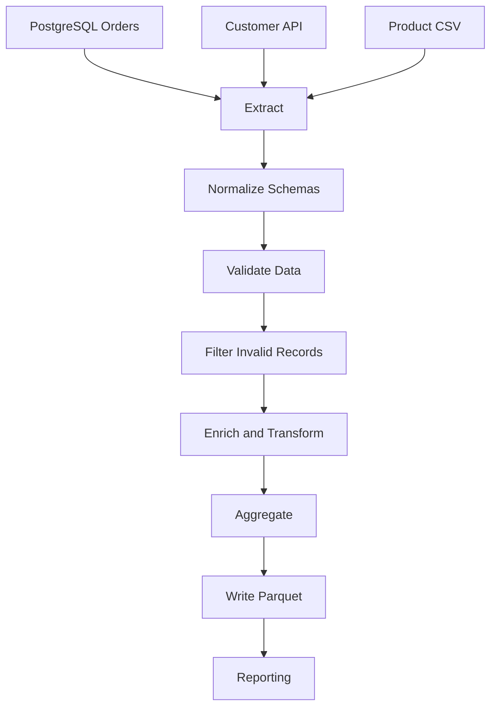
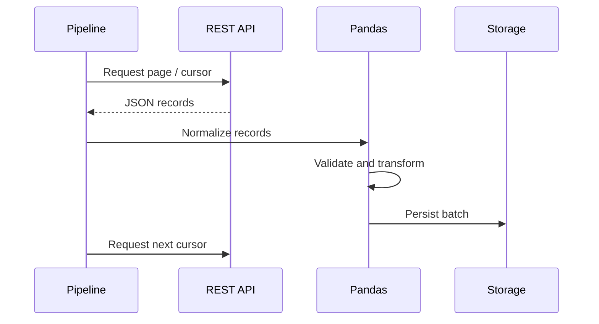
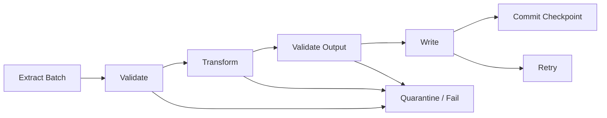

# 01- Pandas In Etl

## Overview

Pandas is useful in ETL pipelines when Python needs to validate, normalize, transform, enrich, aggregate, or prepare structured data between systems.

In backend and data-engineering environments, Pandas is usually one stage in a larger workflow rather than the entire platform:

```text
source systems
    ↓
ingestion
    ↓
validation
    ↓
Pandas transformation
    ↓
data quality checks
    ↓
storage / warehouse
    ↓
reporting / downstream services
```

Typical sources include:

```text
PostgreSQL
REST APIs
Kafka
CSV
JSON
Excel
S3
Parquet
```

Typical destinations include:

```text
PostgreSQL
data warehouses
S3
Parquet datasets
reporting systems
analytics applications
```

The key engineering question is not:

> "Can Pandas transform this data?"

It is:

> "Is Pandas the appropriate processing layer for this data volume, execution model, and reliability requirement?"

---

## Where Pandas Fits in ETL

A practical ETL architecture can look like:


Pandas is strongest in the middle of the pipeline, where data already exists in a structured tabular form and requires substantial transformation logic.

It is generally not the best choice for:

```text
transaction processing
high-concurrency API request handling
very large distributed transformations
long-running streaming computation
large many-to-many joins that exceed single-node memory
```

---

## ETL Responsibilities

| Stage | Typical Responsibility | Pandas Role |
|---|---|---|
| Extract | Obtain source data | Read CSV, JSON, SQL results, API responses, Parquet |
| Validate | Check schema and quality | Strong fit |
| Transform | Clean and reshape data | Strong fit |
| Enrich | Combine datasets | `merge()`, lookups, mappings |
| Aggregate | Produce reporting metrics | `groupby()`, `agg()`, `pivot_table()` |
| Load | Persist results | Write SQL, Parquet, CSV, reporting outputs |
| Monitor | Observe pipeline behavior | Logging and application metrics around Pandas |
| Orchestrate | Schedule dependencies and retries | Celery, Airflow, Kubernetes Jobs, CI/CD, or another orchestrator |

Pandas should generally implement transformation logic rather than orchestration logic.

---

## Extract, Transform, Load

### Extract

Extraction retrieves data from external systems without prematurely applying business transformations.

Examples:

```python
import pandas as pd


orders = pd.read_sql(
    """
    SELECT
        order_id,
        customer_id,
        status,
        amount,
        created_at
    FROM orders
    WHERE created_at >= %(start_time)s
      AND created_at < %(end_time)s
    """,
    connection,
    params={
        "start_time": start_time,
        "end_time": end_time,
    },
)
```

For files:

```python
orders = pd.read_parquet(
    "data/raw/orders.parquet",
)
```

For APIs, convert validated JSON records into a DataFrame:

```python
payload = fetch_orders()

orders = pd.json_normalize(
    payload["items"],
)
```

Extraction should retrieve only the data required for the current pipeline stage whenever the source system supports projection or filtering.

---

## Transform

Transformation is where Pandas commonly provides the most value.

Typical transformations include:

```text
rename columns
normalize types
handle missing values
remove duplicates
standardize strings
parse timestamps
derive fields
filter records
join reference data
aggregate metrics
reshape reporting data
```

Example:

```python
orders["amount"] = pd.to_numeric(
    orders["amount"],
    errors="raise",
)

orders["created_at"] = pd.to_datetime(
    orders["created_at"],
    utc=True,
    errors="raise",
)

orders["status"] = (
    orders["status"]
    .str.strip()
    .str.lower()
)
```

Transformations should be deterministic whenever possible.

---

## Load

The destination determines how results should be written.

For Parquet:

```python
orders.to_parquet(
    "data/processed/orders.parquet",
    engine="pyarrow",
    compression="zstd",
    index=False,
)
```

For PostgreSQL, a batch-oriented loading method is generally preferable to inserting rows individually.

The loading stage should define:

```text
transaction boundaries
idempotency
retry behavior
conflict handling
schema compatibility
```

A correct transformation can still produce a bad pipeline if loading is not reliable.

---

## ETL Data Flow

A realistic e-commerce pipeline might use:



Each boundary should have a clear contract.

For example:

```text
extract output
→ raw source schema

transform input
→ validated source schema

transform output
→ canonical analytical schema

load input
→ publishable dataset schema
```

---

## Raw, Staging, and Processed Data

A common ETL layout is:

```text
data/
    raw/
    staging/
    processed/
    output/
```

### Raw

Raw data should be as close as practical to the source representation.

Examples:

```text
API JSON response
CSV export
database extract
Kafka batch
```

Raw data is valuable for:

```text
reprocessing
auditing
debugging
backfills
schema investigation
```

Avoid modifying raw data destructively.

### Staging

Staging contains normalized intermediate data.

Typical work includes:

```text
schema normalization
dtype conversion
basic validation
standardized names
deduplication
```

### Processed

Processed data represents business-ready transformations.

Examples:

```text
customer revenue
daily order summaries
normalized event data
financial reporting datasets
```

---

## Canonical Schemas

A production pipeline benefits from a stable internal schema even when source systems differ.

For example:

```text
Source A:
customerId

Source B:
customer_id

Source C:
customerID
```

Normalize them at the ingestion boundary:

```python
customers = customers.rename(
    columns={
        "customerId": "customer_id",
    },
)
```

Downstream code should operate against:

```text
customer_id
```

rather than understanding every upstream naming convention.

---

## Schema Validation

Validate expected columns before transformation.

```python
required_columns = {
    "order_id",
    "customer_id",
    "amount",
    "status",
    "created_at",
}

missing = (
    required_columns
    - set(orders.columns)
)

if missing:
    raise ValueError(
        f"Missing required columns: "
        f"{sorted(missing)}"
    )
```

Also validate:

```text
dtype
nullability
allowed values
ranges
uniqueness
relationships
```

Schema validation should fail early rather than allowing malformed data to propagate downstream.

---

## Data Type Normalization

Source systems frequently encode values inconsistently.

Examples:

```text
"100.50"      → numeric
"2026-09-10"  → datetime
"TRUE"        → boolean
"001234"      → identifier string
```

Example:

```python
orders["amount"] = pd.to_numeric(
    orders["amount"],
    errors="raise",
)

orders["created_at"] = pd.to_datetime(
    orders["created_at"],
    utc=True,
    errors="raise",
)

orders["order_id"] = (
    orders["order_id"]
    .astype("string")
)
```

Do not convert identifiers to integers simply because they contain digits.

---

## Missing Values

ETL pipelines need explicit missing-value semantics.

For example:

```python
orders["discount_amount"] = (
    orders["discount_amount"]
    .fillna(0)
)
```

This is appropriate only when:

```text
missing discount
=
zero discount
```

That business assumption must be correct.

In other situations:

```text
missing
≠ zero
```

and the missing value should remain represented as missing.

---

## Invalid Values

Validate domain rules explicitly.

Example:

```python
invalid_amounts = orders[
    orders["amount"].lt(0)
]

if not invalid_amounts.empty:
    raise ValueError(
        "Negative order amounts detected"
    )
```

Other examples:

```text
quantity <= 0
unknown status
future event timestamp
duplicate primary key
invalid currency
missing customer_id
```

A production pipeline should distinguish:

```text
invalid data
```

from:

```text
pipeline failure
```

depending on the intended operational behavior.

---

## Duplicate Records

Duplicates are a common ETL problem.

Detect them explicitly:

```python
duplicates = orders.loc[
    orders["order_id"].duplicated(
        keep=False,
    )
]

if not duplicates.empty:
    raise ValueError(
        "Duplicate order IDs detected"
    )
```

Whether duplicates should:

```text
fail the pipeline
be removed
be merged
be quarantined
be treated as updates
```

is a business rule, not a generic Pandas rule.

---

## Deduplication Strategy

A common pattern is keeping the latest record:

```python
orders = (
    orders
    .sort_values(
        ["order_id", "updated_at"],
    )
    .drop_duplicates(
        "order_id",
        keep="last",
    )
)
```

This requires a deterministic ordering field.

Avoid:

```python
drop_duplicates()
```

without understanding:

```text
which row should survive
why duplicates exist
whether the source represents updates
```

---

## Transformation Functions

ETL code should be broken into focused functions.

```python
def normalize_orders(
    orders: pd.DataFrame,
) -> pd.DataFrame:
    result = orders.rename(
        columns={
            "customerId": "customer_id",
        }
    ).copy()

    result["amount"] = pd.to_numeric(
        result["amount"],
        errors="raise",
    )

    result["created_at"] = pd.to_datetime(
        result["created_at"],
        utc=True,
        errors="raise",
    )

    return result
```

This improves:

```text
testing
reuse
debugging
code review
maintainability
```

Avoid placing an entire ETL workflow inside one giant function.

---

## Separate Validation from Transformation

A useful architecture is:

```text
extract
→ validate source contract
→ normalize
→ transform
→ validate business rules
→ load
```

Some transformations inherently perform validation, but keeping major validation stages explicit makes failures easier to diagnose.

Example:

```python
orders = extract_orders()

validate_schema(orders)

orders = normalize_orders(orders)

validate_business_rules(orders)

result = transform_orders(orders)

validate_output(result)

load_orders(result)
```

---

## Pure Transformations

Prefer transformation functions that behave like:

```text
input DataFrame
→ output DataFrame
```

rather than mixing:

```text
database writes
HTTP calls
logging
environment configuration
global mutable state
```

into the same transformation function.

For example:

```python
def transform_orders(
    orders: pd.DataFrame,
) -> pd.DataFrame:
    result = orders.copy()

    result["net_amount"] = (
        result["amount"]
        - result["discount_amount"]
    )

    return result
```

This makes testing deterministic and keeps external side effects at pipeline boundaries.

---

## External Enrichment

Avoid making one HTTP or database request per DataFrame row:

```python
orders["customer_segment"] = orders.apply(
    lambda row: fetch_customer_segment(
        row["customer_id"],
    ),
    axis=1,
)
```

This creates an N+1 pattern.

Prefer:

```text
collect unique customer IDs
    ↓
batch API/database request
    ↓
normalize reference DataFrame
    ↓
merge
```

Example:

```python
customer_segments = fetch_customer_segments(
    orders["customer_id"]
    .dropna()
    .unique()
)

enriched = orders.merge(
    customer_segments,
    on="customer_id",
    how="left",
    validate="many_to_one",
)
```

This moves I/O outside the row-processing loop.

---

## SQL Pushdown

Do not automatically extract an entire relational table into Pandas.

If PostgreSQL can efficiently perform:

```text
filter
projection
join
aggregation
```

perform those operations in SQL when appropriate.

For example:

```sql
SELECT
    customer_id,
    COUNT(*) AS order_count,
    SUM(amount) AS revenue
FROM orders
WHERE status = 'completed'
GROUP BY customer_id;
```

Then Pandas can consume the already-reduced result:

```python
summary = pd.read_sql_query(
    query,
    connection,
)
```

Database pushdown often reduces the amount of data Pandas needs to process by orders of magnitude.

---

## REST API Extraction

API-based ETL should treat pagination, rate limits, retries, and schema changes as first-class concerns.

Typical flow:



Do not build a DataFrame containing an unbounded number of API pages when the dataset can be processed incrementally.

---

## Pagination and Incremental Extraction

Prefer source-native pagination:

```text
cursor
offset
page token
watermark
created_at + ID
```

For high-volume APIs, cursor or keyset-style pagination is generally more robust than repeatedly requesting increasingly large offsets.

An incremental pipeline should record a deterministic checkpoint such as:

```text
last processed cursor
last event timestamp
last source ID
```

and persist it only after the corresponding output succeeds.

---

## Batch Processing

Large ETL jobs should use bounded batches when the complete dataset cannot safely fit in memory.

Example:

```python
for chunk in pd.read_csv(
    "orders.csv",
    chunksize=100_000,
):
    validate_schema(chunk)

    transformed = transform_orders(
        chunk,
    )

    load_batch(transformed)
```

The critical rule is:

```text
process
→ persist
→ release
```

rather than:

```text
process
→ append to list
→ concatenate everything
```

---

## Incremental Processing

Incremental ETL processes only newly arrived or changed records.

Typical flow:

```text
source
    ↓
watermark
    ↓
extract changes
    ↓
transform
    ↓
validate
    ↓
load
    ↓
checkpoint
```

Common watermark fields include:

```text
updated_at
created_at
sequence number
Kafka offset
API cursor
database change version
```

A production design must account for:

```text
late records
duplicate events
clock skew
source updates
reprocessing
```

---

## Idempotency

ETL jobs must often be safe to retry.

A useful property is:

```text
same input
+
same pipeline version
=
same logical output
```

Idempotent loading strategies include:

```text
upsert by business key
partition replacement
deterministic object paths
staging + publish
deduplicated inserts
```

This is particularly important for:

```text
Celery tasks
Kubernetes Jobs
AWS batch workloads
Kafka consumers
scheduled pipelines
```

---

## Pipeline Checkpointing

A checkpoint should advance only after successful persistence.

Correct:

```text
read batch
→ transform
→ validate
→ write
→ confirm success
→ update checkpoint
```

Incorrect:

```text
read batch
→ update checkpoint
→ transform
→ write
```

The second approach can permanently skip data after a process failure.

---

## Error Handling

Distinguish failures by category:

| Failure | Typical Action |
|---|---|
| Schema mismatch | Fail fast |
| Invalid individual record | Quarantine or reject according to policy |
| Database timeout | Retry |
| API rate limit | Backoff |
| Destination unavailable | Retry |
| Transformation bug | Fail and alert |
| Unexpected duplicate key | Fail or resolve explicitly |
| Corrupt source file | Fail and quarantine |

Retries should generally apply to transient failures, not deterministic validation failures.

---

## Logging

Log pipeline events rather than entire DataFrames.

Useful fields include:

```text
pipeline_name
pipeline_version
run_id
batch_id
partition
input_rows
output_rows
invalid_rows
duration_seconds
source
destination
```

Example:

```python
logger.info(
    "etl_batch_completed",
    extra={
        "run_id": run_id,
        "batch_id": batch_id,
        "input_rows": len(chunk),
        "output_rows": len(result),
        "duration_seconds": elapsed,
    },
)
```

Avoid logging:

```text
customer names
emails
payment details
raw API payloads
entire DataFrames
```

unless explicitly required and protected.

---

## Data Quality Checks

Data quality should be measurable.

Typical metrics include:

```text
row count
null rate
duplicate rate
invalid-value rate
referential integrity
min/max timestamps
numeric range violations
schema version
```

For example:

```python
invalid_rate = (
    invalid_rows / len(orders)
    if len(orders)
    else 0.0
)

if invalid_rate > 0.01:
    raise ValueError(
        "Invalid row rate exceeds threshold"
    )
```

Thresholds should come from business expectations rather than arbitrary values.

---

## Referential Integrity

When combining entities:

```text
orders.customer_id
        ↓
customers.customer_id
```

validate the relationship.

For example:

```python
enriched = orders.merge(
    customers,
    on="customer_id",
    how="left",
    validate="many_to_one",
)

missing_customer_rate = (
    enriched["segment"]
    .isna()
    .mean()
)
```

A sudden increase can indicate:

```text
missing reference data
schema drift
incorrect IDs
late upstream processing
```

---

## Output Validation

Do not treat successful execution as successful ETL.

Validate the output:

```python
expected_columns = {
    "customer_id",
    "revenue",
    "order_count",
}

if set(result.columns) != expected_columns:
    raise ValueError(
        "Unexpected output schema"
    )

if result["order_count"].lt(0).any():
    raise ValueError(
        "Invalid order counts"
    )
```

Also validate expected business invariants.

---

## Pandas and Parquet

Parquet is often an effective output format for analytical ETL.

```python
result.to_parquet(
    "data/processed/customer_metrics.parquet",
    engine="pyarrow",
    compression="zstd",
    index=False,
)
```

Benefits include:

```text
columnar storage
compression
typed schema
column projection
predicate filtering
efficient analytical reads
```

For large datasets, prefer a dataset layout with sensible partitioning over one indefinitely growing file.

---

## Pandas and PostgreSQL

Pandas and PostgreSQL complement each other.

Use PostgreSQL for:

```text
transactions
constraints
indexed lookups
relational joins
source-side aggregation
```

Use Pandas for:

```text
complex DataFrame transformations
multi-source normalization
report preparation
analytical manipulation
Python-based business logic
```

A common architecture is:

```text
PostgreSQL
    ↓
filtered extraction
    ↓
Pandas
    ↓
validation + transformation
    ↓
Parquet / PostgreSQL / warehouse
```

Do not move work from PostgreSQL to Pandas without a reason.

---

## Pandas and Kafka

Kafka provides event streams, while Pandas can process bounded event batches.

A common pattern is:

```text
Kafka consumer
    ↓
bounded batch
    ↓
DataFrame
    ↓
validate
    ↓
transform
    ↓
sink
    ↓
commit offset
```

Pandas is not itself a streaming engine.

For sustained high-throughput stream processing, consider:

```text
Kafka Streams
Flink
Spark Structured Streaming
stream processors
```

and use Pandas where batch-oriented transformation is appropriate.

---

## Pandas and Celery

Celery can orchestrate bounded ETL tasks:

```text
scheduled task
    ↓
extract batch
    ↓
Pandas transform
    ↓
persist result
    ↓
acknowledge task
```

Keep task payloads small.

Prefer passing:

```text
file path
batch ID
partition
cursor
```

rather than serializing large DataFrames through the Celery broker.

---

## Pandas and Kubernetes

Pandas ETL jobs fit naturally into Kubernetes Jobs or CronJobs.

Resource planning should consider:

```text
DataFrame memory
temporary allocations
Python runtime
serialization
network buffers
parallel workers
```

A process that usually uses:

```text
2 GB
```

may require significantly more during:

```text
merge
groupby
sort
Parquet serialization
```

Configure memory limits using measured peak RSS rather than average usage.

---

## Performance Principles

Performance optimization should follow:

```text
measure
→ reduce input
→ reduce columns
→ normalize dtypes
→ vectorize
→ filter early
→ optimize groupby
→ optimize joins
→ chunk large workloads
→ store efficiently
→ measure again
```

The largest optimization is often removing unnecessary work.

---

## Memory-Aware ETL

For large datasets:

```python
for chunk in pd.read_csv(
    "orders.csv",
    usecols=[
        "order_id",
        "customer_id",
        "status",
        "amount",
    ],
    dtype={
        "order_id": "string",
        "customer_id": "string",
        "status": "category",
    },
    chunksize=100_000,
):
    process_chunk(chunk)
```

This combines:

```text
column projection
dtype control
bounded processing
```

Memory monitoring should focus on peak process usage rather than only the final DataFrame size.

---

## Concurrency and Parallelism

Pandas transformations are often CPU- or memory-bound within a process.

Do not assume that adding workers automatically improves throughput.

Parallel ETL must account for:

```text
worker × peak memory
worker × source load
worker × destination load
serialization overhead
database connection limits
API rate limits
```

For example:

```text
4 workers
×
2 GB peak RSS
=
~8 GB
```

before system overhead.

Concurrency should be designed around the entire pipeline, not just the transformation stage.

---

## Security Considerations

ETL pipelines often process sensitive data.

Apply:

```text
least-privilege database roles
IAM controls
encrypted storage
TLS
secret management
limited logging
data retention policies
```

Use dedicated credentials for:

```text
read-only extraction
data loading
administrative operations
```

Do not embed credentials in:

```python
pd.read_sql(...)
```

or source code.

Use environment-managed or dedicated secret-management mechanisms instead.

---

## Reliability and Recovery

A production ETL pipeline should answer:

```text
What happens if extraction fails?
What happens if one batch fails?
Can a batch be retried?
Can output be duplicated?
Where is the checkpoint?
How are bad records quarantined?
How is a historical run reproduced?
```

A robust pattern is:



Every state transition should have a clear failure policy.

---

## Reproducibility

For important pipelines, record:

```text
source version
run ID
pipeline version
configuration version
input partition
processing timestamp
output location
```

This allows a historical output to be traced back to:

```text
what input was processed
how it was transformed
which code version ran
which configuration was active
```

Versioned outputs are especially useful for debugging changes in business logic.

---

## Backfills

ETL systems eventually require historical reprocessing.

Examples:

```text
bug fix
new derived field
schema correction
late-arriving records
business-rule change
```

Backfills should reuse the same transformation functions as normal processing where possible.

A good architecture separates:

```text
what data to process
```

from:

```text
how the data is transformed
```

so a backfill can change the input range without duplicating business logic.

---

## Testing ETL Transformations

Tests should validate behavior rather than execution.

Example:

```python
def test_transform_orders(
    orders: pd.DataFrame,
) -> None:
    result = transform_orders(orders)

    assert list(result.columns) == [
        "order_id",
        "customer_id",
        "amount",
        "net_amount",
    ]

    assert result["net_amount"].tolist() == [
        90.0,
        180.0,
    ]
```

Also test:

```text
empty input
missing values
duplicates
invalid values
unexpected columns
dtype changes
boundary timestamps
join mismatches
large chunks
failure conditions
```

---

## Testing Idempotency

An ETL function should often produce equivalent output when run twice on the same input.

Conceptually:

```python
first = transform_orders(input_df)
second = transform_orders(input_df)

pd.testing.assert_frame_equal(
    first,
    second,
)
```

For full pipelines, verify that rerunning a batch does not duplicate destination records.

Transformation idempotency and load idempotency are separate concerns.

---

## Project Structure

The Pandas ETL projects in this playbook use a production-oriented structure:

```text
projects/
    01- E-Commerce Data Pipeline/
        src/
        tests/
        data/
        scripts/
        config/
        pyproject.toml
        README.md
        .gitignore

    02- API Data Processing Pipeline/
        src/
        tests/
        data/
        scripts/
        config/
        pyproject.toml
        README.md
        .gitignore

    03- Large Dataset Processing/
        src/
        tests/
        data/
        benchmarks/
        scripts/
        config/
        pyproject.toml
        README.md
        .gitignore
```

The projects progressively introduce:

```text
basic ETL
→ external API integration
→ bounded large-scale processing
```

---

## Project Progression

| Project | Primary Challenge | Key Skills |
|---|---|---|
| E-Commerce Data Pipeline | Multi-stage batch ETL | Cleaning, transformation, aggregation, validation |
| API Data Processing Pipeline | External source integration | Pagination, normalization, retries, schema handling |
| Large Dataset Processing | Resource constraints | Chunking, memory optimization, benchmarks, incremental processing |

The progression should reuse previously learned Pandas concepts rather than introducing unrelated complexity.

---

## Recommended ETL Design

A maintainable pipeline usually separates:

```text
configuration
extraction
validation
normalization
transformation
aggregation
loading
logging
orchestration
```

Example:

```text
src/
    config.py
    ingestion.py
    normalization.py
    transformation.py
    validation.py
    aggregation.py
    storage.py
    pipeline.py
```

The pipeline coordinator should compose these components rather than contain every implementation detail.

---

## Anti-Patterns

### Row-by-Row Database Calls

```text
DataFrame row
→ SQL query
→ DataFrame row
→ SQL query
```

This creates an N+1 pattern.

Prefer:

```text
batch query
→ DataFrame
→ merge
```

### Full-Table Extraction

```sql
SELECT *
FROM orders;
```

followed by filtering in Pandas wastes database, network, and memory resources when filtering can happen upstream.

### Monolithic ETL Function

A single function containing extraction, transformation, validation, loading, and retry logic is difficult to test and maintain.

### Unbounded DataFrame Accumulation

Collecting every batch before writing recreates the memory problem chunking was intended to solve.

### Silent Data Loss

Code such as:

```python
pd.to_numeric(
    orders["amount"],
    errors="coerce",
)
```

can turn invalid values into missing values without any alert.

Use coercion only when the resulting missing values are intentionally handled and monitored.

### Checkpointing Before Persistence

This can cause permanent data loss after a failure.

---

## When Pandas Is the Wrong Tool

Pandas is a poor fit when the workload requires:

```text
distributed computation
continuous high-throughput streaming
large-scale global joins
large-scale global sorting
multi-node stateful processing
high-concurrency transactional operations
```

A decision framework:

```text
Does the data fit safely on one node?
        │
       yes
        ↓
Can Pandas express the transformation clearly?
        │
       yes
        ↓
Use Pandas

       no / data too large
        ↓
Consider SQL / DuckDB / Polars / Dask / Spark
```

Pandas can remain part of a larger architecture even when it is no longer the main processing engine.

---

## Orchestration vs Processing

Pandas should not be responsible for workflow orchestration.

For example:

```text
Airflow / Celery / Kubernetes
    ↓
run extraction
    ↓
run Pandas transformation
    ↓
run validation
    ↓
run load
    ↓
publish dataset
```

The orchestrator handles:

```text
scheduling
dependencies
retries
timeouts
alerts
execution state
```

Pandas handles:

```text
DataFrame processing
```

Separating these concerns makes the system easier to operate.

---

## Operational Checklist

```text
[ ] Source schemas are defined
[ ] Source filtering and projection are applied where appropriate
[ ] Raw inputs are preserved when replayability matters
[ ] Data types are explicitly normalized
[ ] Required columns are validated
[ ] Missing-value semantics are defined
[ ] Invalid values have an explicit policy
[ ] Duplicate handling is deterministic
[ ] Transformations are testable and reusable
[ ] External API/database calls are batched
[ ] SQL work is pushed down where appropriate
[ ] Large datasets use bounded processing when necessary
[ ] Output schema is validated
[ ] Destination writes are retry-safe
[ ] Checkpoints occur after successful persistence
[ ] Late-arriving data has a defined strategy
[ ] Data-quality metrics are tracked
[ ] Sensitive records are excluded from logs
[ ] Peak memory is monitored
[ ] Pipeline duration and throughput are monitored
[ ] Pipeline versions are traceable
[ ] Historical backfills are supported
[ ] Tests cover business rules and failure conditions
[ ] The processing engine is reconsidered when scale exceeds Pandas limits
```

## Interview Perspective

### Where Does Pandas Typically Fit in an ETL Architecture?

Pandas is commonly used for validation, normalization, transformation, enrichment, and aggregation after data has been extracted from a source and before it is persisted for downstream systems.

### Should Filtering Happen in Pandas or PostgreSQL?

Prefer the database when it can efficiently perform the filtering and substantially reduce the amount of data transferred to Pandas.

### How Do You Avoid N+1 API or Database Requests?

Batch the required identifiers, retrieve reference data in bulk, convert the result into a DataFrame, and join it with the primary dataset.

### How Do You Make an ETL Pipeline Retry-Safe?

Use deterministic batch identities, idempotent writes, and checkpoint advancement only after successful persistence.

### How Do You Handle a Dataset Larger Than Memory?

Project and filter the input, optimize dtypes, process in bounded chunks, aggregate incrementally where mathematically valid, and avoid accumulating every chunk in memory.

### What Is the Difference Between Batch Processing and Incremental Processing?

Batch processing processes a bounded set of records at a time. Incremental processing additionally tracks progress so later executions process only new or changed data.

### Why Should Raw Data Be Preserved?

Raw data provides a replayable source for debugging, backfills, auditing, and recovering from transformation bugs without requiring the upstream system to regenerate historical data.

### When Would You Replace Pandas?

When single-node memory, global operations, throughput, concurrency, or distributed-processing requirements exceed what Pandas can handle efficiently. The replacement might be SQL, DuckDB, Polars, Dask, Spark, or a dedicated streaming system depending on the workload.

## Key Takeaways

- Pandas is best treated as a transformation engine inside a larger ETL architecture, with extraction, orchestration, storage, retries, and monitoring handled by surrounding systems.
- Production ETL should use explicit schemas, dtype normalization, data-quality validation, deterministic duplicate handling, and clear missing/invalid-value semantics.
- Push filtering, projection, joins, and aggregation into PostgreSQL or other source systems when appropriate, and batch external API/database enrichment instead of creating N+1 calls.
- Large Pandas pipelines require bounded memory, incremental processing, idempotent writes, checkpoint-after-success semantics, observability, and replay/backfill support.
- Pandas remains a strong single-node processing tool, but workloads requiring distributed execution, sustained streaming, or data volumes beyond safe memory limits should move to an appropriate processing engine.