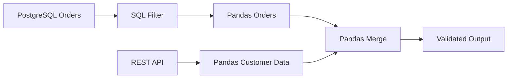

# 02- Pandas And Sql

## Overview

Pandas and SQL solve different parts of the same data-processing problem.

SQL is optimized for querying and manipulating relational data inside a database engine. Pandas is optimized for in-memory tabular processing in Python.

A production ETL or reporting workflow often combines them:

```text
PostgreSQL
    ↓
SQL filtering / projection / aggregation
    ↓
Pandas
    ↓
validation / normalization / transformation
    ↓
Parquet / PostgreSQL / reporting system
```

The key engineering principle is:

> Execute each operation in the system best suited for it.

Moving every database operation into Pandas can waste network bandwidth and memory. Moving complex Python-oriented transformations into SQL can make application logic harder to maintain. Good designs define a deliberate boundary between the database and the DataFrame.

---

## Why Pandas and SQL Are Used Together

A relational database is strong at:

```text
storage
transactions
indexes
constraints
joins
filtering
aggregation
concurrency
query planning
```

Pandas is strong at:

```text
in-memory transformations
data normalization
complex Python logic
multi-source data processing
report preparation
file-oriented ETL
```

A typical workload may therefore look like:

```text
PostgreSQL
    ↓
select only required records
    ↓
Pandas DataFrame
    ↓
clean and enrich
    ↓
aggregate/report
    ↓
write result
```

The database should usually eliminate unnecessary data before sending it to Pandas.

---

## Responsibility Boundary

| Operation | Usually Prefer | Reason |
|---|---|---|
| Filtering millions of database rows | SQL | Database executes close to storage |
| Selecting columns | SQL | Reduces network transfer |
| Indexed lookup | SQL | Uses database indexes |
| Relational join | SQL | Database optimizer can choose efficient plans |
| Transactional update | SQL | Database provides transactional semantics |
| Complex DataFrame transformation | Pandas | Python/Pandas is the natural execution layer |
| Multi-source normalization | Pandas | Sources may not share a relational schema |
| Report formatting | Pandas | Convenient tabular transformations |
| CSV/Parquet processing | Pandas | Native DataFrame workflows |
| Large aggregation already supported by DB | SQL | Reduces data transferred to Python |
| Small local analytical result | Pandas | Fast and convenient once data is bounded |

These are defaults, not absolute rules. Benchmark and evaluate the complete pipeline.

---

## Data Flow

A production workflow often follows:


The important boundary is:

```text
database execution
        |
        v
minimal useful dataset
        |
        v
application-side transformation
```

The objective is to avoid transferring data that Pandas will immediately discard.

---

## Reading SQL Data into Pandas

The most common interface is `pd.read_sql_query()`.

```python
import pandas as pd


query = """
SELECT
    order_id,
    customer_id,
    status,
    amount,
    created_at
FROM orders
WHERE created_at >= %(start_time)s
  AND created_at < %(end_time)s;
"""

orders = pd.read_sql_query(
    query,
    connection,
    params={
        "start_time": start_time,
        "end_time": end_time,
    },
)
```

The result is a `DataFrame`.

The SQL engine handles:

```text
FROM
WHERE
projection
query planning
index usage
```

Pandas receives only the query result.

---

## `read_sql_query()` vs `read_sql()`

`pd.read_sql_query()` is useful when you have a SQL statement.

```python
orders = pd.read_sql_query(
    query,
    connection,
)
```

`pd.read_sql()` can accept either a SQL query or a table name depending on the connection/backend.

For explicit ETL code, a query often makes the intent clearer because projection and filters are visible in the pipeline source.

---

## Parameterized SQL

Never construct SQL by string interpolation with external values.

Avoid:

```python
query = f"""
SELECT *
FROM orders
WHERE customer_id = '{customer_id}'
"""
```

Use parameters:

```python
query = """
SELECT
    order_id,
    customer_id,
    amount
FROM orders
WHERE customer_id = %(customer_id)s;
"""

orders = pd.read_sql_query(
    query,
    connection,
    params={
        "customer_id": customer_id,
    },
)
```

Parameterized queries help prevent SQL injection and allow the database driver to handle value escaping correctly.

---

## SQL Injection Considerations

Pandas does not protect an application from SQL injection.

The security boundary is the database driver and the way SQL is constructed.

Correct:

```python
pd.read_sql_query(
    """
    SELECT
        order_id,
        amount
    FROM orders
    WHERE customer_id = %(customer_id)s
    """,
    connection,
    params={
        "customer_id": customer_id,
    },
)
```

Incorrect:

```python
pd.read_sql_query(
    f"""
    SELECT
        order_id,
        amount
    FROM orders
    WHERE customer_id = '{customer_id}'
    """,
    connection,
)
```

Use parameter binding for values. For dynamic identifiers such as table names or sort expressions, use an allowlist or the database driver's identifier-safe APIs rather than treating them as ordinary values.

---

## Projection Pushdown

Do not load unnecessary columns.

Avoid:

```sql
SELECT *
FROM orders;
```

Prefer:

```sql
SELECT
    order_id,
    customer_id,
    amount,
    created_at
FROM orders;
```

For a wide table:

```text
50 columns
×
100 million rows
```

unnecessary columns can dominate:

```text
disk I/O
network transfer
database work
Pandas memory
```

Projection is often one of the highest-value optimizations in an SQL-to-Pandas pipeline.

---

## Filter Pushdown

Prefer filtering in SQL:

```sql
SELECT
    order_id,
    customer_id,
    amount
FROM orders
WHERE status = 'completed';
```

over:

```python
orders = pd.read_sql_query(
    """
    SELECT
        order_id,
        customer_id,
        amount,
        status
    FROM orders
    """,
    connection,
)

orders = orders.loc[
    orders["status"].eq("completed")
]
```

The first version prevents irrelevant rows from crossing the database/network/Python boundary.

---

## Aggregation Pushdown

When the database can calculate a large aggregation efficiently, perform it in SQL.

```sql
SELECT
    customer_id,
    COUNT(*) AS order_count,
    SUM(amount) AS revenue
FROM orders
WHERE status = 'completed'
GROUP BY customer_id;
```

Then:

```python
summary = pd.read_sql_query(
    query,
    connection,
)
```

Instead of:

```text
100 million database rows
→ Pandas
→ groupby()
```

you may reduce the transfer to:

```text
1 million customer aggregates
→ Pandas
```

This can radically reduce memory and network cost.

---

## Join Pushdown

Relational joins are often better performed inside PostgreSQL when both datasets already reside there.

Prefer:

```sql
SELECT
    o.order_id,
    o.customer_id,
    o.amount,
    c.segment
FROM orders AS o
JOIN customers AS c
    ON c.customer_id = o.customer_id
WHERE o.status = 'completed';
```

over:

```text
load orders into Pandas
+
load customers into Pandas
+
merge()
```

when the database can perform the join efficiently.

PostgreSQL may use:

```text
index scans
hash joins
merge joins
nested loop joins
statistics
parallel query execution
```

to optimize the relational operation.

---

## When a Pandas Join Makes Sense

A Pandas merge is useful when:

```text
one dataset came from an API
one dataset came from a file
reference data exists only in Python
database joins are not practical
post-query enrichment is required
```

Example:

```text
PostgreSQL orders
        ↓
Pandas DataFrame

REST API customer segmentation
        ↓
Pandas DataFrame

orders.merge(customer_segments)
```

Pandas becomes the integration layer between different sources.

---

## Hybrid Join Strategy

A common architecture is:



This is often better than trying to force all inputs into PostgreSQL or extracting all relational data unnecessarily.

---

## Querying with SQLAlchemy

SQLAlchemy provides a widely used connection layer for Python applications.

Example:

```python
from sqlalchemy import create_engine


engine = create_engine(
    database_url,
    pool_pre_ping=True,
)

orders = pd.read_sql_query(
    query,
    engine,
    params={
        "start_time": start_time,
        "end_time": end_time,
    },
)
```

For production systems, consider:

```text
connection pooling
timeouts
pool size
transaction boundaries
credential management
connection health
```

Do not create a new database engine for every request or ETL batch unless the architecture explicitly requires it.

---

## Connection Pooling

Database connection establishment can be expensive.

A backend service or ETL worker should generally reuse a properly configured SQLAlchemy engine and its connection pool.

Conceptually:

```text
application
    ↓
SQLAlchemy Engine
    ↓
connection pool
    ↓
PostgreSQL
```

Pool configuration must account for:

```text
number of workers
Celery concurrency
Kubernetes replicas
PostgreSQL max_connections
other database clients
```

Too many application workers can exhaust database connections even when every individual worker behaves correctly.

---

## Transactions

Pandas transformations are usually outside the database transaction itself.

Consider:

```text
read database
    ↓
Pandas processing
    ↓
write database
```

The transformation may take minutes while the database connection should not necessarily remain inside one transaction for that entire period.

Prefer short, deliberate database transaction boundaries for writes.

---

## Reading Large SQL Results

Do not assume that:

```python
pd.read_sql_query(...)
```

is safe for arbitrarily large result sets.

If the result is too large, use chunked reads:

```python
for chunk in pd.read_sql_query(
    query,
    connection,
    chunksize=100_000,
):
    process(chunk)
```

This follows the same bounded-memory model as chunked file processing.

---

## SQL Chunking

A query with `chunksize` allows Pandas to receive the result in batches.

Conceptually:

```text
PostgreSQL
    ↓
result stream / batches
    ↓
chunk 1 → Pandas
chunk 2 → Pandas
chunk 3 → Pandas
...
```

This can reduce application memory, but database-side execution may still need to process substantial intermediate state.

Chunking controls Python-side materialization; it does not magically make an expensive SQL query inexpensive.

---

## Server-Side Cursors

For very large result sets, database-driver/server-side cursor behavior may reduce client-side buffering.

The exact behavior depends on:

```text
driver
SQLAlchemy configuration
database backend
Pandas version
DBAPI implementation
```

Treat cursor configuration as an infrastructure concern and benchmark actual memory behavior.

Do not assume `chunksize` alone proves that the database never buffers a large result on the client or server.

---

## Keyset Pagination

For incremental database extraction, avoid relying on increasingly large `OFFSET` values when the workload is large.

Prefer a deterministic keyset:

```sql
SELECT
    order_id,
    customer_id,
    amount,
    created_at
FROM orders
WHERE (
    created_at > %(last_created_at)s
    OR (
        created_at = %(last_created_at)s
        AND order_id > %(last_order_id)s
    )
)
ORDER BY
    created_at,
    order_id
LIMIT %(batch_size)s;
```

The application stores:

```text
last_created_at
last_order_id
```

as its checkpoint.

This supports stable incremental extraction.

---

## Time-Window Extraction

For reporting or batch ETL, bounded time windows are often easier to operate:

```sql
SELECT
    order_id,
    customer_id,
    amount
FROM orders
WHERE created_at >= %(start_time)s
  AND created_at < %(end_time)s;
```

The half-open interval:

```text
[start, end)
```

avoids overlapping adjacent windows.

For example:

```text
2026-09-01 00:00
≤ created_at <
2026-09-02 00:00
```

and:

```text
2026-09-02 00:00
≤ created_at <
2026-09-03 00:00
```

do not overlap.

---

## Incremental ETL

A typical incremental SQL-to-Pandas pipeline is:


The checkpoint must advance only after the corresponding output is successfully handled.

---

## Data Type Alignment

SQL and Pandas can represent values differently.

Examples:

```text
PostgreSQL NUMERIC
→ Pandas numeric/decimal representation

PostgreSQL TIMESTAMP WITH TIME ZONE
→ timezone-aware datetime

PostgreSQL BIGINT
→ integer-compatible Pandas dtype

PostgreSQL NULL
→ Pandas missing-value representation
```

Do not assume that every source type maps exactly to the desired DataFrame type.

Explicit normalization is often safer:

```python
orders["created_at"] = pd.to_datetime(
    orders["created_at"],
    utc=True,
    errors="raise",
)
```

---

## NULL Semantics

SQL uses:

```text
NULL
```

and three-valued logic.

Pandas uses several missing-value representations depending on dtype:

```text
pd.NA
NaN
NaT
```

SQL:

```sql
WHERE amount = NULL
```

does not behave like:

```python
orders["amount"].eq(None)
```

The correct SQL form is:

```sql
WHERE amount IS NULL
```

In Pandas:

```python
orders["amount"].isna()
```

The semantic distinction matters when moving business logic between SQL and Pandas.

---

## Boolean Logic Differences

SQL:

```sql
WHERE status = 'completed'
  AND amount > 0
```

Pandas:

```python
mask = (
    orders["status"].eq("completed")
    & orders["amount"].gt(0)
)
```

Do not use Python's scalar `and` and `or` with Pandas Series:

```python
orders["status"].eq("completed") and ...
```

Use:

```text
&
|
~
```

with parentheses around each condition.

---

## Date and Time Semantics

SQL and Pandas must agree on:

```text
timezone
precision
boundary behavior
date truncation
```

For example, PostgreSQL may return timezone-aware timestamps while a DataFrame is accidentally normalized to naive timestamps.

A backend-wide convention such as:

```text
UTC internally
```

reduces ambiguity.

Example:

```python
orders["created_at"] = pd.to_datetime(
    orders["created_at"],
    utc=True,
    errors="raise",
)
```

---

## SQL Aggregation vs Pandas Groupby

The same business metric can often be implemented in either layer.

SQL:

```sql
SELECT
    customer_id,
    SUM(amount) AS revenue
FROM orders
GROUP BY customer_id;
```

Pandas:

```python
summary = (
    orders
    .groupby("customer_id", as_index=False)
    .agg(
        revenue=("amount", "sum"),
    )
)
```

Choose based on:

```text
data location
dataset size
query complexity
database capabilities
memory constraints
reuse
operational cost
```

If the source already contains hundreds of millions of rows, SQL aggregation is often the better first choice.

---

## SQL Window Functions vs Pandas

Many ranking and rolling problems can be expressed in both systems.

SQL:

```sql
SELECT
    customer_id,
    order_id,
    amount,
    SUM(amount) OVER (
        PARTITION BY customer_id
        ORDER BY created_at
        ROWS BETWEEN UNBOUNDED PRECEDING
        AND CURRENT ROW
    ) AS running_revenue
FROM orders;
```

Pandas may use:

```python
orders = orders.sort_values(
    ["customer_id", "created_at"],
)

orders["running_revenue"] = (
    orders
    .groupby("customer_id")["amount"]
    .cumsum()
)
```

Again, execute the computation where the data already is when that reduces unnecessary movement.

---

## Query Pushdown Decision

A useful decision process is:

```text
Does the operation reduce rows significantly?
        │
       yes
        ↓
Prefer SQL

Does the operation reduce columns?
        │
       yes
        ↓
Prefer SQL

Is the operation a relational join
already supported efficiently by the database?
        │
       yes
        ↓
Prefer SQL

Does the operation require complex Python/Pandas logic?
        │
       yes
        ↓
Prefer Pandas

Does the operation combine data from unrelated sources?
        │
       yes
        ↓
Pandas may be appropriate
```

This should remain a workload-based decision.

---

## Query Planning

Before moving a slow query into Pandas, inspect the SQL execution plan.

In PostgreSQL:

```sql
EXPLAIN (ANALYZE, BUFFERS)
SELECT
    customer_id,
    SUM(amount)
FROM orders
WHERE status = 'completed'
GROUP BY customer_id;
```

Look for:

```text
sequential scans
index usage
join strategy
rows estimated vs actual
sort cost
hash memory
I/O
parallel execution
```

A slow SQL query should generally be fixed at the database layer rather than bypassed by extracting more data into Python.

---

## Database Indexes

Indexes can improve source extraction when the predicate is selective and matches the indexing strategy.

For example:

```sql
CREATE INDEX idx_orders_created_at_status
ON orders (created_at, status);
```

Whether this is beneficial depends on:

```text
query shape
selectivity
table size
write overhead
index size
existing indexes
```

Pandas cannot compensate for a poorly designed database access path without often paying a large data-transfer and memory cost.

---

## Selecting Columns Early

Consider:

```python
columns = [
    "order_id",
    "customer_id",
    "amount",
]

orders = pd.read_sql_query(
    """
    SELECT
        order_id,
        customer_id,
        amount
    FROM orders
    WHERE status = 'completed'
    """,
    connection,
)
```

This creates a narrow DataFrame from the start.

It is generally better than:

```text
SELECT *
→ DataFrame with 40 columns
→ drop 37 columns
```

The latter has already paid the database, network, parsing, and memory costs.

---

## Schema Mapping

For large systems, define the canonical schema explicitly.

Example:

```python
EXPECTED_DTYPES = {
    "order_id": "string",
    "customer_id": "string",
    "amount": "Float64",
}
```

Then normalize:

```python
orders = orders.astype(
    EXPECTED_DTYPES,
)
```

Use explicit schema logic when:

```text
multiple SQL queries feed the same transformation
source schema changes frequently
data is persisted downstream
```

---

## Safe DataFrame Writes to SQL

A DataFrame can be loaded to SQL with:

```python
orders.to_sql(
    "staging_orders",
    connection,
    if_exists="append",
    index=False,
)
```

For production workloads, consider:

```text
batch size
transaction behavior
staging tables
constraints
indexes
upserts
conflicts
rollback
```

Do not assume `to_sql()` by itself provides the desired production loading semantics.

---

## Staging Tables

A robust loading pattern is:

```text
Pandas result
    ↓
staging table
    ↓
validation / deduplication
    ↓
merge/upsert into target
```

Conceptually:


This separates:

```text
data transfer
```

from:

```text
business publication
```

and makes recovery easier.

---

## Upserts

For incremental pipelines, rerunning a batch can create duplicate records unless the destination is designed for idempotency.

A typical pattern is:

```text
staging
→ deduplicate
→ insert/update by business key
```

For example:

```text
order_id
```

may serve as the logical key.

Use database-native mechanisms such as PostgreSQL conflict handling where appropriate.

---

## Bulk Loading

For significant volumes, row-by-row inserts are usually inefficient.

Avoid:

```python
for row in orders.itertuples():
    insert_order(row)
```

Prefer:

```text
bulk insert
COPY
staging table
batch operation
```

The exact method depends on:

```text
volume
schema
constraints
transaction requirements
database driver
```

The database should be allowed to perform database-native bulk operations.

---

## `to_sql()` Limitations

`DataFrame.to_sql()` is convenient for moderate-volume ETL but may not be ideal for every production workload.

Consider:

```text
insert throughput
table indexes
transaction size
upsert requirements
database-specific bulk loading
```

For PostgreSQL at larger scale, database-native bulk-loading mechanisms can outperform generic row-oriented insertion paths.

Use `to_sql()` when its behavior matches the workload rather than treating it as the universal loading strategy.

---

## Pandas and Django ORM

Django applications may use the ORM for transactional business logic while Pandas handles offline analytical processing.

A poor pattern is using ORM queries inside a row loop:

```text
DataFrame row
→ Django ORM query
→ DataFrame row
→ Django ORM query
```

This is still an N+1 pattern.

Prefer:

```text
bulk query
→ DataFrame
→ vectorized transformation
```

or:

```text
Pandas-derived result
→ bulk_create / bulk_update
```

when writing back to Django-managed models.

---

## Pandas and FastAPI

Pandas processing should generally not block latency-sensitive API requests.

Avoid:

```text
HTTP request
→ 500 MB DataFrame
→ long Pandas transformation
→ synchronous response
```

Prefer:

```text
FastAPI
    ↓
enqueue job
    ↓
Celery / worker
    ↓
Pandas
    ↓
Parquet / PostgreSQL
    ↓
job status/result
```

Use asynchronous job processing when the workload is too large or slow for normal request latency budgets.

---

## Long-Running ETL

A production architecture may use:


The API layer should generally orchestrate or query job state rather than execute large ETL workloads directly inside request handlers.

---

## Resource Management

A SQL-to-Pandas pipeline consumes resources on both sides:

```text
PostgreSQL
    ↓
CPU
memory
I/O
connections

Python worker
    ↓
CPU
memory
network
temporary DataFrames
```

Optimizing one side can overload the other.

For example:

```text
high ETL concurrency
→ PostgreSQL connection saturation
```

or:

```text
large extraction
→ Python worker OOM
```

Capacity planning must consider the entire data path.

---

## Monitoring

Monitor both database and application metrics.

### Database

```text
query latency
rows returned
database CPU
database I/O
connection count
lock waits
buffer/cache behavior
query plan changes
```

### Pandas Worker

```text
rows received
rows processed
processing duration
peak RSS
output rows
invalid rows
throughput
```

### Pipeline

```text
end-to-end duration
source lag
batch ID
watermark
success/failure rate
retry count
```

This makes it possible to determine whether a slowdown originates in:

```text
database
network
Pandas
destination
orchestration
```

---

## Query Timeouts

Production ETL queries should have deliberate timeout policies.

A runaway query can consume:

```text
database CPU
connections
locks
worker capacity
```

Use database/driver-supported timeout configuration where appropriate.

A timeout should fail predictably and trigger a retry only if the failure is transient and retrying is safe.

---

## Read Consistency

When extracting data for a report, understand the database isolation level and consistency requirements.

For example:

```text
query starts
→ concurrent transactions modify orders
→ query reads a consistent snapshot
```

PostgreSQL's MVCC model provides snapshot-based visibility under common isolation levels.

The important ETL question is:

> Does the extracted dataset represent one consistent point in time?

For financial or audit-sensitive reports, consistency requirements should be explicit.

---

## Reconciliation

After loading data from PostgreSQL into Pandas and transforming it, compare source and target metrics where appropriate.

Examples:

```text
source row count
target row count
sum(source.amount)
sum(target.amount)
distinct customer count
invalid row count
```

Example:

```python
source_total = orders["amount"].sum()
target_total = result["revenue"].sum()

if source_total != target_total:
    raise ValueError(
        "Revenue reconciliation failed"
    )
```

For transformations where totals are intentionally changed, define the expected invariant instead of requiring equality blindly.

---

## Data Quality Checks

A SQL-to-Pandas pipeline should validate:

```text
schema
row counts
null rates
duplicates
business constraints
referential integrity
numeric ranges
timestamps
```

Use database constraints where they are the appropriate source of truth and Pandas validation for transformed/intermediate data.

This provides defense in depth.

---

## Error Handling

Distinguish:

```text
database failure
authentication failure
timeout
schema mismatch
invalid data
Pandas transformation bug
destination failure
```

For example:

```text
SQL timeout
→ retry with backoff if appropriate

schema mismatch
→ fail fast

invalid source record
→ quarantine or reject

destination transient failure
→ retry
```

Do not retry deterministic validation failures indefinitely.

---

## Retry Safety

Suppose:

```text
extract succeeds
transform succeeds
load partially succeeds
worker crashes
```

A retry can duplicate output unless the load is idempotent.

Use:

```text
batch ID
business key
staging table
upsert
partition replacement
```

to make retries safe.

This is more important than simply adding a retry loop.

---

## Backfills

SQL and Pandas ETL pipelines frequently require historical reprocessing.

A backfill should allow:

```text
start time
end time
pipeline version
output target
```

to be specified explicitly.

Example:

```bash
python scripts/run_pipeline.py \
  --start 2026-01-01T00:00:00Z \
  --end 2026-02-01T00:00:00Z
```

The same transformation code should ideally support both:

```text
daily incremental processing
```

and:

```text
historical backfill
```

without duplicating business logic.

---

## Security Considerations

Use a database role appropriate to the pipeline.

For extraction:

```text
SELECT-only
```

is often preferable.

For loading:

```text
INSERT
UPDATE
```

permissions should be limited to the required tables.

Never store database credentials directly in source code.

Use:

```text
environment variables
AWS Secrets Manager
Kubernetes Secrets
Django settings backed by a secret manager
```

according to the deployment environment.

---

## PII and Data Minimization

Do not extract personal data that the transformation does not need.

Bad:

```sql
SELECT
    *
FROM customers;
```

Better:

```sql
SELECT
    customer_id,
    segment,
    country
FROM customers;
```

Minimizing extracted columns reduces:

```text
memory
network traffic
storage
privacy exposure
```

Data minimization is both a performance and security optimization.

---

## Cost Optimization

A SQL-to-Pandas workload can incur cost through:

```text
database compute
Python compute
network traffic
object storage
query execution
worker runtime
```

Reducing rows and columns early may lower cost across multiple layers simultaneously.

For AWS:

```text
RDS / Aurora
    ↓
Python worker
    ↓
S3 / warehouse
```

should be optimized as one pipeline rather than as three independent systems.

---

## Common Mistakes

### `SELECT *` into Pandas

It transfers data that may never be used.

### Filtering After Extraction

The database could often eliminate irrelevant rows first.

### Performing Large Relational Joins in Pandas

If both datasets are already in PostgreSQL, a database-side join is frequently more efficient.

### N+1 ORM or SQL Calls

One query per DataFrame row causes extreme network and database overhead.

### Unparameterized SQL

String interpolation can introduce SQL injection.

### Loading Massive Results Without Chunking

A successful query can still crash the Python worker when materializing the result.

### Assuming `chunksize` Makes the SQL Query Cheap

Chunking limits Pandas-side materialization but does not automatically optimize database execution.

### Holding Database Transactions Open During Long Pandas Work

Long-lived transactions can increase database resource usage and affect vacuuming or other workloads.

### Row-by-Row Inserts

Use bulk loading when volume justifies it.

### Mixing SQL and Pandas Semantics Without Testing

`NULL`, datetime, boolean, and aggregation behavior can differ.

### Running Large Pandas Jobs Inside API Requests

This can cause latency spikes, worker exhaustion, and timeouts.

---

## Practical End-to-End Example

A production-style bounded extraction might look like:

```python
from time import perf_counter

import pandas as pd


def load_orders(
    connection,
    start_time,
    end_time,
) -> pd.DataFrame:
    query = """
        SELECT
            order_id,
            customer_id,
            status,
            amount,
            created_at
        FROM orders
        WHERE created_at >= %(start_time)s
          AND created_at < %(end_time)s
          AND status = 'completed';
    """

    return pd.read_sql_query(
        query,
        connection,
        params={
            "start_time": start_time,
            "end_time": end_time,
        },
    )


def transform_orders(
    orders: pd.DataFrame,
) -> pd.DataFrame:
    result = orders.copy()

    result["amount"] = pd.to_numeric(
        result["amount"],
        errors="raise",
    )

    result["created_at"] = pd.to_datetime(
        result["created_at"],
        utc=True,
        errors="raise",
    )

    if result["order_id"].duplicated().any():
        raise ValueError(
            "Duplicate order IDs detected"
        )

    if result["amount"].lt(0).any():
        raise ValueError(
            "Negative order amounts detected"
        )

    return (
        result
        .groupby(
            "customer_id",
            as_index=False,
        )
        .agg(
            revenue=("amount", "sum"),
            order_count=("order_id", "count"),
        )
    )


started = perf_counter()

orders = load_orders(
    connection,
    start_time,
    end_time,
)

result = transform_orders(orders)

elapsed = perf_counter() - started

logger.info(
    "order_etl_completed",
    extra={
        "input_rows": len(orders),
        "output_rows": len(result),
        "duration_seconds": elapsed,
    },
)
```

The important design choices are:

```text
SQL filters rows
SQL projects columns
Pandas validates and transforms
Pandas aggregates
metrics capture execution behavior
```

---

## Practical Large-Result Example

For very large extraction:

```python
query = """
    SELECT
        order_id,
        customer_id,
        amount,
        created_at
    FROM orders
    WHERE created_at >= %(start_time)s
      AND created_at < %(end_time)s
"""

for batch_id, chunk in enumerate(
    pd.read_sql_query(
        query,
        connection,
        params={
            "start_time": start_time,
            "end_time": end_time,
        },
        chunksize=100_000,
    )
):
    validate_chunk(chunk)

    result = transform_orders(chunk)

    persist_batch(
        result,
        batch_id=batch_id,
    )
```

This combines:

```text
SQL filtering
+
bounded Pandas memory
+
incremental processing
+
incremental persistence
```

For global aggregations, ensure the per-batch results can be combined correctly.

---

## Choosing SQL or Pandas

| Question | Favor SQL | Favor Pandas |
|---|---:|---:|
| Data already lives in PostgreSQL | Yes | Sometimes |
| Need indexed filtering | Yes | No |
| Need relational join | Often | Sometimes |
| Data comes from multiple non-SQL sources | Sometimes | Often |
| Need complex Python transformation | No | Yes |
| Result is too large for memory | Often | Only with chunking/partitioning |
| Need transaction semantics | Yes | No |
| Preparing a local report | Sometimes | Often |
| Need database constraints | Yes | No |
| Need to process CSV/Parquet directly | No | Yes |

The best architecture is frequently hybrid.

---

## Performance Checklist

```text
[ ] Select only required SQL columns
[ ] Filter rows in SQL where appropriate
[ ] Push large relational joins into PostgreSQL when practical
[ ] Push large aggregations into SQL when practical
[ ] Use parameterized SQL
[ ] Reuse database connection pools
[ ] Define query and connection timeouts
[ ] Inspect SQL query plans for slow queries
[ ] Use chunked reads for large results
[ ] Avoid N+1 database calls
[ ] Normalize SQL-to-Pandas dtypes explicitly
[ ] Handle SQL NULL and Pandas missing values deliberately
[ ] Use UTC and explicit datetime semantics
[ ] Keep transaction scopes short
[ ] Use bulk database writes
[ ] Use staging tables for complex ETL loads
[ ] Make batch writes idempotent
[ ] Validate source and transformed data
[ ] Reconcile important metrics
[ ] Monitor database and Pandas resource usage
[ ] Keep PII out of unnecessary extracts and logs
[ ] Do not execute heavy Pandas workloads synchronously inside API requests
[ ] Support incremental processing and backfills where required
[ ] Reconsider Pandas when data volume exceeds safe single-node processing limits
```

## Interview Perspective

### When Should You Push a Transformation into SQL?

Push it into SQL when the database can perform the operation efficiently and doing so substantially reduces the amount of data that must cross into Python.

### Why Is `SELECT *` a Performance Problem?

It transfers unnecessary columns from storage to the application, increasing database work, network traffic, DataFrame memory, and downstream processing.

### When Should You Use `pd.read_sql_query(..., chunksize=...)`?

Use it when the result set is large enough that materializing the entire result as one DataFrame could exceed safe memory limits.

### If You Already Have PostgreSQL Data, Why Use Pandas?

Pandas remains useful for complex Python-side transformation, multi-source data integration, reporting, file processing, and operations that are awkward or inefficient to express in SQL.

### Why Is N+1 Access Dangerous in a DataFrame Pipeline?

Each row causes a separate database request, multiplying network latency, connection usage, database work, and application overhead.

### Should a Large Join Be Done in Pandas or PostgreSQL?

If both datasets already reside in PostgreSQL and the database can execute the join efficiently, SQL is usually preferable. Pandas joins are more appropriate when the datasets come from different systems or when the join belongs naturally in application-side processing.

### How Do SQL NULL and Pandas Missing Values Differ?

SQL uses `NULL` with three-valued logic, while Pandas uses missing-value representations such as `pd.NA`, `NaN`, and `NaT` depending on dtype. Equivalent business logic must be translated explicitly.

### How Do You Make SQL-to-Pandas ETL Retry-Safe?

Use deterministic batches, idempotent destination writes, staging where appropriate, and checkpoint advancement only after the corresponding load succeeds.

### Why Should a Large Pandas Job Not Run Inside a FastAPI Request?

Long-running DataFrame operations can block request workers, exceed latency budgets, cause memory pressure, and make retries and failure recovery difficult. Background workers or batch jobs are generally more appropriate.

### How Do You Decide Whether PostgreSQL or Pandas Should Perform an Aggregation?

Consider where the data is located, how much the aggregation reduces the result, database execution capabilities, Pandas memory requirements, and whether later transformations require the detailed rows.

## Key Takeaways

- PostgreSQL and Pandas are complementary: push filtering, projection, joins, and large aggregations toward the database when that reduces data movement, while keeping complex Python-oriented transformation in Pandas.
- Treat the SQL-to-Pandas boundary as a resource boundary; unnecessary columns and rows increase database work, network traffic, Python memory, and total pipeline cost.
- Large result sets require bounded processing, parameterized queries, explicit dtype and NULL handling, deterministic incremental extraction, and bulk/idempotent loading strategies.
- Production pipelines must account for database connection pools, query plans, timeouts, transactions, retries, data quality, security, observability, and backfills rather than treating `read_sql()` as a simple file-reading operation.
- The strongest architecture is usually hybrid: PostgreSQL handles relational execution and transactional responsibilities, while Pandas handles appropriate in-memory transformation and multi-source data processing.