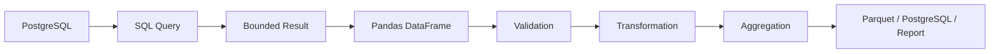
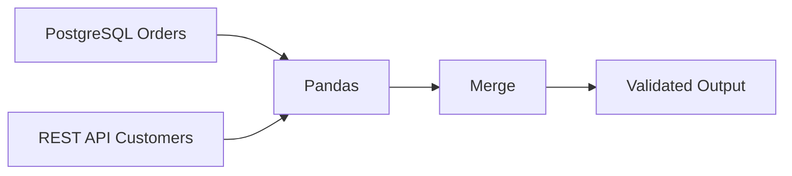
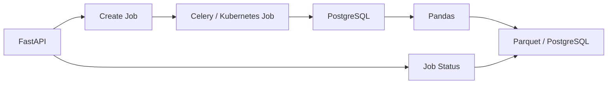
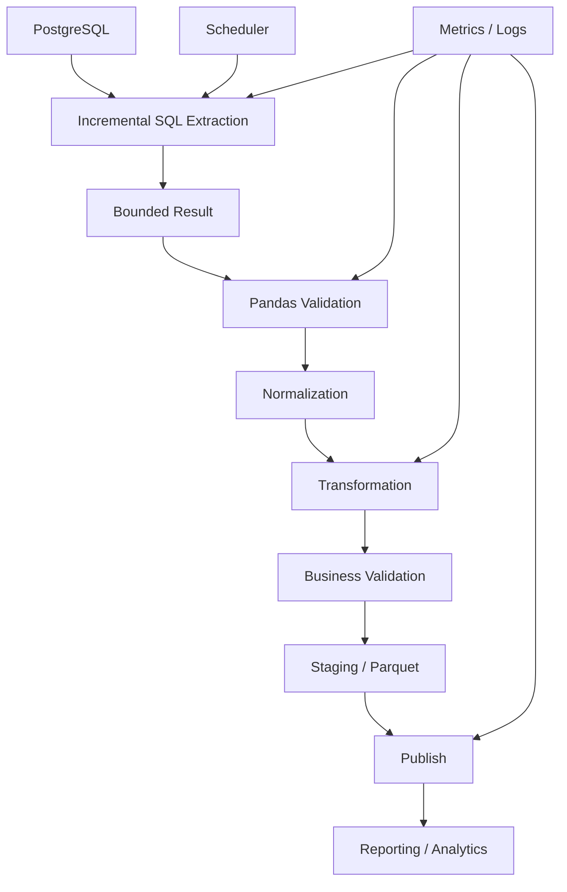

# 03- Database To Dataframe

## Overview

Moving data from a relational database into a Pandas `DataFrame` is a common boundary in backend systems, ETL pipelines, reporting jobs, and analytics workflows.

The basic operation is straightforward:

```text
Database
   ↓
SQL query
   ↓
DB driver / SQLAlchemy
   ↓
Pandas DataFrame
   ↓
validation / transformation / analysis
```

The engineering challenge is designing this boundary correctly.

A production database-to-DataFrame workflow must consider:

```text
query correctness
data volume
memory usage
network transfer
schema and dtype mapping
NULL semantics
transaction consistency
connection management
timeouts
security
observability
incremental extraction
retry behavior
```

The most important rule is:

> Do not use Pandas to compensate for an inefficient database query.

Use the database to reduce and shape the dataset before materializing it in memory whenever that is appropriate.

---

## Where the Database-to-DataFrame Boundary Fits

A typical backend/data pipeline looks like:



The database remains responsible for relational operations and persistence.

Pandas becomes the processing layer for tasks that benefit from:

```text
DataFrame semantics
vectorized transformations
multi-source enrichment
report preparation
file-oriented processing
Python-based business transformations
```

---

## Why This Boundary Matters

The database-to-DataFrame boundary is also a resource boundary.

Suppose a database query returns:

```text
500 million rows
```

and the application needs only:

```text
customer_id
amount
```

Extracting all columns and rows can create unnecessary:

```text
database CPU
database I/O
network traffic
Python memory
parsing cost
```

A better design is:

```text
database filter
+
database projection
+
database aggregation where appropriate
→
bounded DataFrame
```

The amount of data entering Pandas should be intentional.

---

## Basic `read_sql_query()`

The standard Pandas API is:

```python
import pandas as pd


query = """
SELECT
    order_id,
    customer_id,
    amount,
    created_at
FROM orders
WHERE status = 'completed';
"""

orders = pd.read_sql_query(
    query,
    connection,
)
```

The returned object is a `DataFrame`.

The SQL query determines:

```text
rows
columns
database-side expressions
joins
ordering
filters
aggregations
```

Pandas then materializes the result in memory.

---

## Using SQLAlchemy

SQLAlchemy provides a common abstraction for database connections and pooling.

```python
from sqlalchemy import create_engine


engine = create_engine(
    database_url,
    pool_pre_ping=True,
)

orders = pd.read_sql_query(
    query,
    engine,
)
```

For production systems, configure the engine according to:

```text
worker count
connection pool size
database capacity
connection timeout
query timeout
deployment topology
```

A Kubernetes deployment with multiple replicas can create far more database connections than one local process.

---

## Connection Pooling

A typical architecture is:

```text
FastAPI / Celery / ETL Worker
            ↓
     SQLAlchemy Engine
            ↓
       Connection Pool
            ↓
        PostgreSQL
```

Creating an engine once and reusing it is generally preferable to repeatedly creating engines.

For example:

```python
from sqlalchemy import create_engine


engine = create_engine(
    database_url,
    pool_size=5,
    max_overflow=5,
    pool_pre_ping=True,
)
```

Do not choose these numbers arbitrarily.

The total potential connections across:

```text
replicas
×
workers
×
pool size
```

must remain compatible with PostgreSQL capacity.

---

## Parameterized Queries

Use bound parameters for external values.

Correct:

```python
query = """
SELECT
    order_id,
    customer_id,
    amount
FROM orders
WHERE customer_id = %(customer_id)s;
"""

orders = pd.read_sql_query(
    query,
    connection,
    params={
        "customer_id": customer_id,
    },
)
```

Avoid:

```python
query = f"""
SELECT
    order_id,
    customer_id,
    amount
FROM orders
WHERE customer_id = '{customer_id}';
"""
```

String interpolation can create SQL injection vulnerabilities.

Pandas does not make dynamically constructed SQL safe.

---

## Dynamic SQL Identifiers

Parameter binding is intended for values, not arbitrary SQL identifiers.

Avoid:

```python
query = f"""
SELECT *
FROM {table_name}
"""
```

unless `table_name` has already been constrained to an explicit allowlist.

A safer approach is:

```python
ALLOWED_TABLES = {
    "orders",
    "customers",
}

if table_name not in ALLOWED_TABLES:
    raise ValueError("Unsupported table")

query = f"""
SELECT
    order_id,
    customer_id,
    amount
FROM {table_name}
"""
```

For more complex dynamic SQL, use SQLAlchemy's identifier-aware APIs rather than manually concatenating arbitrary input.

---

## Selecting Only Required Columns

Prefer:

```sql
SELECT
    order_id,
    customer_id,
    amount
FROM orders;
```

over:

```sql
SELECT *
FROM orders;
```

A wide table can contain:

```text
customer metadata
raw JSON
audit fields
large text
internal flags
```

that the DataFrame does not need.

Column projection reduces:

```text
database output
network transfer
DataFrame memory
processing time
```

---

## Filtering Before Materialization

Prefer:

```sql
SELECT
    order_id,
    customer_id,
    amount
FROM orders
WHERE status = 'completed'
  AND created_at >= %(start_time)s
  AND created_at < %(end_time)s;
```

rather than:

```python
orders = pd.read_sql_query(
    """
    SELECT
        order_id,
        customer_id,
        amount,
        status,
        created_at
    FROM orders
    """,
    connection,
)

orders = orders.loc[
    orders["status"].eq("completed")
]
```

The first version removes irrelevant records before they enter Python.

---

## Database-Side Aggregation

If the DataFrame only needs aggregates, compute them in SQL.

```sql
SELECT
    customer_id,
    COUNT(*) AS order_count,
    SUM(amount) AS revenue
FROM orders
WHERE status = 'completed'
GROUP BY customer_id;
```

Then:

```python
summary = pd.read_sql_query(
    query,
    connection,
)
```

This can turn:

```text
100 million rows
```

into:

```text
1 million customer rows
```

before network transfer.

This is one of the highest-value optimizations in database-to-Pandas workflows.

---

## Database-Side Joins

When related data already exists in the same relational database, let the database perform the join when it is the better execution engine.

```sql
SELECT
    o.order_id,
    o.customer_id,
    o.amount,
    c.segment
FROM orders AS o
JOIN customers AS c
    ON c.customer_id = o.customer_id
WHERE o.status = 'completed';
```

This is often preferable to:

```text
read orders
→ read customers
→ Pandas merge()
```

because PostgreSQL can optimize the join using:

```text
indexes
statistics
hash joins
merge joins
nested loops
parallel execution
```

---

## When a Pandas Join Is Better

A Pandas join makes sense when:

```text
one source is an API
one source is a CSV
one source is a Parquet dataset
database data must be enriched with local reference data
sources cannot conveniently be joined inside SQL
```

Example:



The decision should be driven by:

```text
where the data lives
how much data moves
which engine is efficient
where the business transformation belongs
```

---

## Query Execution Lifecycle

A simplified request path is:

```text
Python application
    ↓
SQLAlchemy / DBAPI
    ↓
PostgreSQL parser
    ↓
query planner
    ↓
execution
    ↓
network result
    ↓
Pandas parsing / materialization
    ↓
DataFrame
```

Each stage can become the bottleneck.

For example:

```text
query planner slow
→ optimize SQL/indexes

database execution slow
→ optimize query plan

network transfer large
→ reduce rows/columns

DataFrame construction expensive
→ improve schema, chunking, or source representation

Pandas transformation slow
→ vectorize / reduce data / optimize operations
```

---

## Query Plans

For a slow SQL extraction, inspect PostgreSQL's execution plan.

```sql
EXPLAIN (ANALYZE, BUFFERS)
SELECT
    customer_id,
    SUM(amount)
FROM orders
WHERE status = 'completed'
GROUP BY customer_id;
```

Look at:

```text
actual row counts
estimated row counts
scan method
join strategy
sort cost
hash cost
buffer activity
I/O
parallelism
```

Do not move a slow query into Pandas before understanding why the query is slow.

---

## Indexes and Extraction Queries

An extraction query often benefits from indexes when predicates are selective.

For example:

```sql
CREATE INDEX idx_orders_created_status
ON orders (created_at, status);
```

Whether this index is actually useful depends on:

```text
query shape
selectivity
data distribution
table size
existing indexes
write overhead
```

The correct index should be based on real workload and query plans.

---

## Chunked SQL Reads

Large result sets should not always be materialized as one DataFrame.

Use:

```python
for chunk in pd.read_sql_query(
    query,
    connection,
    params=params,
    chunksize=100_000,
):
    process_chunk(chunk)
```

This creates a bounded application-level working set.

A common architecture is:

```text
PostgreSQL
    ↓
batch 1
    ↓
Pandas
    ↓
transform
    ↓
persist
    ↓
batch 2
    ↓
Pandas
    ↓
...
```

This is especially useful for:

```text
large exports
ETL jobs
backfills
historical reporting
data migrations
```

---

## What `chunksize` Actually Controls

`chunksize` controls how many rows Pandas returns per batch.

It does not mean:

```text
exact number of bytes
```

A chunk containing:

```text
100,000 integer rows
```

may consume far less memory than:

```text
100,000 rows with large text fields
```

Choose chunk size based on measured:

```text
row width
memory usage
query characteristics
processing time
destination throughput
```

---

## Server-Side Fetching

For very large results, understand how the specific database driver handles buffering and cursors.

Potential mechanisms include:

```text
client-side buffering
server-side cursors
streaming fetches
batch fetch sizes
```

Pandas and SQLAlchemy abstractions do not make these semantics identical across every database driver.

For high-volume pipelines, verify actual memory behavior rather than assuming that `chunksize` alone makes database access fully streaming.

---

## Incremental Extraction

Do not repeatedly extract the entire table when only new or changed records are required.

Use a watermark:

```text
created_at
updated_at
sequence ID
change version
```

Example:

```sql
SELECT
    order_id,
    customer_id,
    amount,
    updated_at
FROM orders
WHERE updated_at > %(last_watermark)s
ORDER BY updated_at, order_id;
```

The checkpoint should be persisted only after successful downstream processing.

---

## Keyset-Based Extraction

For high-volume incremental processing, use a deterministic keyset instead of large `OFFSET` values.

```sql
SELECT
    order_id,
    customer_id,
    amount,
    updated_at
FROM orders
WHERE (
    updated_at > %(last_updated_at)s
    OR (
        updated_at = %(last_updated_at)s
        AND order_id > %(last_order_id)s
    )
)
ORDER BY
    updated_at,
    order_id
LIMIT %(batch_size)s;
```

Track:

```text
last_updated_at
last_order_id
```

This provides a stable continuation point.

---

## Time-Window Extraction

For scheduled ETL, fixed windows can be straightforward:

```sql
SELECT
    order_id,
    customer_id,
    amount
FROM orders
WHERE created_at >= %(start_time)s
  AND created_at < %(end_time)s;
```

Use half-open intervals:

```text
[start, end)
```

so adjacent windows do not overlap.

For example:

```text
2026-09-10 00:00 ≤ timestamp < 2026-09-11 00:00
```

and:

```text
2026-09-11 00:00 ≤ timestamp < 2026-09-12 00:00
```

are unambiguous.

---

## Handling Late-Arriving Records

Incremental extraction can miss records that arrive after a watermark has advanced.

For example:

```text
watermark = 2026-09-10 12:00
```

but a valid record with:

```text
updated_at = 2026-09-10 11:59
```

is inserted later.

A robust pipeline may use:

```text
lookback window
+
deduplication
+
reprocessing
```

For example:

```text
process updated_at >= watermark - 15 minutes
```

and deduplicate by business key.

The lookback period should reflect actual source behavior.

---

## Transaction Consistency

A DataFrame extraction should have a defined consistency requirement.

Questions include:

```text
Should the query represent one consistent snapshot?
Can concurrent writes occur?
Can the dataset contain records committed at different times?
Is a report required to be point-in-time consistent?
```

For business-critical reporting, consistency requirements should be explicit.

Do not accidentally hold a long-running transaction open while performing expensive Pandas transformations unless the architecture specifically requires it.

---

## Transaction Scope

Avoid this pattern without a clear reason:

```text
BEGIN
  ↓
extract millions of rows
  ↓
Pandas transformation for several minutes
  ↓
write result
  ↓
COMMIT
```

Long transactions can affect:

```text
database resources
vacuuming
locking behavior
transaction visibility
```

Prefer short transaction boundaries where possible.

---

## SQL NULL to Pandas Missing Values

A database `NULL` can become a Pandas missing value such as:

```text
pd.NA
NaN
NaT
```

depending on the column dtype.

Normalize explicitly where semantics matter:

```python
orders["amount"] = pd.to_numeric(
    orders["amount"],
    errors="raise",
)
```

Then use:

```python
orders["amount"].isna()
```

for missing-value checks.

Do not assume that database NULL semantics and Python `None` semantics are interchangeable in every operation.

---

## Datetime Mapping

Database timestamps should be mapped deliberately.

Example:

```python
orders["created_at"] = pd.to_datetime(
    orders["created_at"],
    utc=True,
    errors="raise",
)
```

A production convention such as:

```text
UTC internally
```

reduces ambiguity across:

```text
PostgreSQL
Pandas
Kafka
REST APIs
S3
reporting systems
```

Explicitly define timezone behavior at system boundaries.

---

## Identifier Mapping

Identifiers that contain digits should generally remain strings.

Example:

```text
001234
```

must not accidentally become:

```text
1234
```

Use:

```python
orders["customer_id"] = (
    orders["customer_id"]
    .astype("string")
)
```

This is particularly important for:

```text
account numbers
postal codes
external IDs
product codes
reference numbers
```

Business semantics should determine dtype.

---

## Decimal and Financial Data

Financial systems require explicit precision requirements.

A PostgreSQL `NUMERIC` value should not automatically be treated as ordinary floating-point data simply for convenience.

Define:

```text
required precision
rounding rules
currency semantics
acceptable representation
```

For financial reporting, correctness takes precedence over small memory optimizations.

---

## Schema Validation

Validate the DataFrame after extraction.

```python
required_columns = {
    "order_id",
    "customer_id",
    "amount",
    "created_at",
}

missing = (
    required_columns
    - set(orders.columns)
)

if missing:
    raise ValueError(
        f"Missing columns: {sorted(missing)}"
    )
```

Also validate:

```text
dtypes
nullability
ranges
uniqueness
allowed values
timestamps
```

This catches schema drift before invalid data reaches downstream systems.

---

## Row-Level Validation

Example:

```python
invalid = orders.loc[
    orders["amount"].lt(0)
]

if not invalid.empty:
    raise ValueError(
        "Negative order amounts detected"
    )
```

For high-volume pipelines, separate invalid records when business requirements allow:

```text
valid rows → output
invalid rows → quarantine
```

Never silently drop invalid records.

---

## Duplicate Records

Detect duplicates according to the business key:

```python
duplicates = orders.loc[
    orders["order_id"].duplicated(
        keep=False,
    )
]

if not duplicates.empty:
    raise ValueError(
        "Duplicate order IDs detected"
    )
```

Whether duplicates should be:

```text
rejected
deduplicated
merged
updated
quarantined
```

depends on source semantics.

---

## Referential Validation

If an extraction includes related entities, validate the relationship.

For example:

```text
orders.customer_id
        ↓
customers.customer_id
```

A Pandas merge can explicitly enforce expected cardinality:

```python
enriched = orders.merge(
    customers,
    on="customer_id",
    how="left",
    validate="many_to_one",
)
```

This protects against unexpected many-to-many row multiplication.

---

## Loading the DataFrame Back to SQL

For moderate workloads:

```python
result.to_sql(
    "staging_customer_metrics",
    connection,
    if_exists="append",
    index=False,
)
```

This is convenient but should not automatically be considered the optimal high-volume PostgreSQL loading strategy.

For large workloads, consider:

```text
COPY
staging tables
bulk inserts
database-native upserts
partition loading
```

The right approach depends on:

```text
volume
constraints
indexes
upsert semantics
transaction requirements
```

---

## Staging Table Pattern

A robust workflow is:


This provides a clear boundary between:

```text
loading data
```

and:

```text
publishing business data
```

It also improves:

```text
recovery
retries
validation
auditability
```

---

## Bulk Loading

Avoid:

```python
for row in result.itertuples():
    insert_row(row)
```

This creates substantial application/database round-trip overhead.

Prefer:

```text
bulk load
→ staging
→ database-native merge
```

For PostgreSQL, native bulk-loading approaches can be substantially more efficient for large datasets than generic row-by-row inserts.

---

## ORM Considerations

Django ORM is useful for transactional application logic, but it should not be used as a row-by-row enrichment mechanism for a DataFrame.

Avoid:

```text
DataFrame row
→ Django query
→ DataFrame row
→ Django query
```

Prefer:

```text
bulk query
→ DataFrame
→ transform
```

or:

```text
DataFrame result
→ bulk_create / bulk_update
```

when writing back into Django-managed models.

---

## FastAPI Considerations

Large database-to-DataFrame operations generally do not belong inside latency-sensitive HTTP handlers.

Avoid:

```text
POST /report
    ↓
500 MB SQL result
    ↓
Pandas transformation
    ↓
HTTP response
```

Prefer:



This separates request latency from batch-processing latency.

---

## Celery Integration

A Celery task should receive lightweight identifiers rather than serializing large DataFrames through the broker.

Prefer:

```python
@app.task
def process_report(
    report_date: str,
) -> None:
    run_report(report_date)
```

instead of:

```python
@app.task
def process_report(
    dataframe: pd.DataFrame,
) -> None:
    ...
```

Pass:

```text
batch ID
partition
date range
source cursor
object-storage path
```

and let the worker retrieve the data.

---

## Kubernetes Integration

A large database-to-DataFrame ETL job can run as a Kubernetes Job.

Resource planning should account for:

```text
DataFrame memory
temporary allocations
Python runtime
query result buffering
Parquet serialization
worker concurrency
```

For example:

```yaml
resources:
  requests:
    cpu: "1"
    memory: "2Gi"
  limits:
    cpu: "2"
    memory: "4Gi"
```

The exact values should come from measured workload behavior.

---

## Observability

Track both database and application metrics.

### Database Metrics

```text
query duration
rows returned
CPU
I/O
connections
locks
query-plan changes
```

### Pandas Metrics

```text
rows received
rows processed
peak RSS
DataFrame memory
transformation duration
output rows
invalid rows
```

### Pipeline Metrics

```text
run ID
batch ID
watermark
success/failure
retry count
end-to-end duration
```

Without both sides of the boundary, diagnosing performance problems is difficult.

---

## Logging

Do not log entire DataFrames.

Avoid:

```python
logger.info(
    "orders=%s",
    orders,
)
```

Prefer:

```python
logger.info(
    "database_batch_processed",
    extra={
        "batch_id": batch_id,
        "input_rows": len(orders),
        "output_rows": len(result),
    },
)
```

This reduces:

```text
log volume
storage cost
PII exposure
application overhead
```

---

## Query Timeouts

Long-running extraction queries should have deliberate timeout behavior.

A runaway query can consume:

```text
database CPU
connection slots
worker memory
worker runtime
```

Use database- or driver-supported timeouts appropriate to the workload.

Treat timeout failures as:

```text
potentially transient
```

only when retrying is safe and meaningful.

---

## Retry Strategy

Retries should be designed around failure types.

| Failure | Typical Action |
|---|---|
| Connection interruption | Retry |
| Temporary database overload | Retry with backoff |
| Query timeout | Retry only if safe |
| Schema mismatch | Fail |
| Invalid data | Quarantine or fail |
| Authentication failure | Fail and alert |
| Destination unavailable | Retry |
| Transformation bug | Fail |

Do not blindly retry every exception.

---

## Idempotency

A retry-safe pipeline should be able to repeat a batch without producing inconsistent duplicates.

Use:

```text
batch ID
business key
staging table
upsert
partition replacement
deterministic output path
```

Example:

```text
source range:
2026-09-10

batch:
orders_2026_09_10

destination:
partition=2026-09-10
```

A failed task can then repeat the same logical operation safely.

---

## Reconciliation

After extraction and transformation, compare important metrics.

For example:

```python
source_count = len(orders)
output_count = len(result)

logger.info(
    "etl_reconciliation",
    extra={
        "source_count": source_count,
        "output_count": output_count,
    },
)
```

For metrics that should remain invariant:

```python
source_total = orders["amount"].sum()
output_total = result["revenue"].sum()

if source_total != output_total:
    raise ValueError(
        "Revenue reconciliation failed"
    )
```

Define invariants based on business semantics rather than assuming every transformation preserves row counts or totals.

---

## Memory Management

A database query can be logically correct and still crash the worker.

For large extractions:

```text
project columns
→ filter rows
→ aggregate where appropriate
→ chunk results
→ process
→ persist
```

Measure:

```python
memory_bytes = (
    orders
    .memory_usage(
        index=True,
        deep=True,
    )
    .sum()
)
```

Also monitor process RSS because DataFrame memory does not represent every allocation in the Python process.

---

## Empty Results

SQL queries can legitimately return zero rows.

Handle that explicitly:

```python
orders = pd.read_sql_query(
    query,
    connection,
)

if orders.empty:
    logger.info(
        "no_rows_to_process",
    )
    return
```

The pipeline should define whether an empty result means:

```text
successful no-op
missing upstream data
invalid input
```

Do not confuse zero rows with a query failure.

---

## Unexpected Schema Changes

A source query can change because:

```text
column removed
column renamed
database migration
view changed
source data type changed
```

Validate immediately after extraction.

A stable downstream contract is more reliable than depending on implicit column order or automatic dtype inference.

---

## Production Architecture

A mature database-to-DataFrame architecture can look like:



The important boundaries are:

```text
database query boundary
DataFrame boundary
validation boundary
persistence boundary
publication boundary
```

Each should have explicit failure and ownership semantics.

---

## Security Considerations

Apply least privilege to database credentials.

An extraction worker often needs:

```text
SELECT
```

but should not automatically have:

```text
DROP
ALTER
CREATE USER
```

For loading workflows, separate read and write privileges where practical.

Protect credentials through:

```text
AWS Secrets Manager
Kubernetes Secrets
environment-managed secret injection
```

and never hard-code passwords in Python source.

---

## Data Minimization

Only extract sensitive fields when required.

Avoid:

```sql
SELECT
    customer_id,
    name,
    email,
    phone,
    address,
    payment_metadata,
    internal_notes
FROM customers;
```

when the transformation only needs:

```sql
SELECT
    customer_id,
    segment
FROM customers;
```

Data minimization improves:

```text
security
privacy
memory usage
network efficiency
storage cost
```

---

## Cost Considerations

Database-to-Pandas processing can consume resources in multiple systems:

```text
PostgreSQL compute
+
database storage I/O
+
network transfer
+
Python CPU
+
Python memory
+
object storage
```

Optimizations such as:

```text
SQL filtering
column projection
database-side aggregation
incremental extraction
Parquet output
```

can reduce cost across several layers simultaneously.

---

## Disaster Recovery and Replay

A reproducible pipeline should preserve enough information to repeat historical processing.

Useful metadata:

```text
run ID
source range
watermark
pipeline version
configuration version
output version
```

Where practical, retain raw or recoverable source data so a transformation bug can be corrected without relying on the upstream system to recreate historical records.

---

## Common Mistakes

### Using `SELECT *`

Loads unnecessary columns and increases network and memory cost.

### Filtering Only in Pandas

The database could often eliminate rows before transmission.

### Moving Large Joins Out of PostgreSQL Without Measuring

You may replace an optimized database operation with a memory-intensive DataFrame merge.

### Unparameterized SQL

Creates injection risk.

### Creating a Database Query Per DataFrame Row

Creates an N+1 database access pattern.

### Loading a Huge Query Without Chunking

Can cause a Python worker to exceed its memory limit.

### Assuming `chunksize` Solves Database Performance

It bounds Pandas materialization but does not necessarily make the underlying SQL execution efficient.

### Keeping a Transaction Open During Long Pandas Processing

Can create unnecessary database-side resource pressure.

### Row-by-Row SQL Inserts

Creates unnecessary database round trips.

### Ignoring SQL/Pandas NULL Differences

Can produce incorrect filtering or business calculations.

### Assuming Numeric-Looking IDs Should Be Integers

Leading zeros and identifier semantics can be lost.

### Running Large Processing Inside FastAPI

Can cause request timeouts, worker starvation, and memory pressure.

### Logging DataFrames

Creates excessive logs and may expose sensitive information.

---

## Practical End-to-End Example

```python
from time import perf_counter

import pandas as pd
from sqlalchemy import create_engine


def extract_completed_orders(
    engine,
    start_time,
    end_time,
) -> pd.DataFrame:
    query = """
        SELECT
            order_id,
            customer_id,
            amount,
            created_at
        FROM orders
        WHERE status = 'completed'
          AND created_at >= %(start_time)s
          AND created_at < %(end_time)s;
    """

    return pd.read_sql_query(
        query,
        engine,
        params={
            "start_time": start_time,
            "end_time": end_time,
        },
    )


def validate_orders(
    orders: pd.DataFrame,
) -> None:
    required = {
        "order_id",
        "customer_id",
        "amount",
        "created_at",
    }

    missing = required - set(
        orders.columns,
    )

    if missing:
        raise ValueError(
            f"Missing columns: {sorted(missing)}"
        )

    if orders["order_id"].duplicated().any():
        raise ValueError(
            "Duplicate order IDs detected"
        )

    if orders["amount"].lt(0).any():
        raise ValueError(
            "Negative order amounts detected"
        )


def transform_orders(
    orders: pd.DataFrame,
) -> pd.DataFrame:
    result = orders.copy()

    result["amount"] = pd.to_numeric(
        result["amount"],
        errors="raise",
    )

    result["created_at"] = pd.to_datetime(
        result["created_at"],
        utc=True,
        errors="raise",
    )

    return (
        result
        .groupby(
            "customer_id",
            as_index=False,
        )
        .agg(
            revenue=("amount", "sum"),
            order_count=("order_id", "count"),
        )
    )


engine = create_engine(
    database_url,
    pool_pre_ping=True,
)

started = perf_counter()

orders = extract_completed_orders(
    engine,
    start_time,
    end_time,
)

validate_orders(orders)

result = transform_orders(orders)

elapsed = perf_counter() - started

logger.info(
    "database_to_dataframe_completed",
    extra={
        "input_rows": len(orders),
        "output_rows": len(result),
        "duration_seconds": elapsed,
    },
)
```

The pipeline explicitly separates:

```text
extraction
validation
transformation
observability
```

This makes the components easier to test and maintain.

---

## Large-Scale Version

For larger datasets:

```python
query = """
    SELECT
        order_id,
        customer_id,
        amount,
        created_at
    FROM orders
    WHERE created_at >= %(start_time)s
      AND created_at < %(end_time)s;
"""

for batch_id, chunk in enumerate(
    pd.read_sql_query(
        query,
        connection,
        params={
            "start_time": start_time,
            "end_time": end_time,
        },
        chunksize=100_000,
    )
):
    validate_orders(chunk)

    result = transform_orders(chunk)

    persist_batch(
        result,
        batch_id=batch_id,
    )
```

This should generally be paired with:

```text
bounded memory
idempotent writes
checkpointing
per-batch metrics
failure isolation
```

Do not retain every processed chunk unless the combined result is known to fit safely in memory.

---

## Decision Framework

Use the following decision process:

```text
Is the data already in PostgreSQL?
        │
       yes
        ↓
Can PostgreSQL filter/project/aggregate it efficiently?
        │
       yes
        ↓
Push work into SQL
        │
        no
        ↓
Extract bounded data

Does the result fit comfortably in memory?
        │
       yes
        ↓
Use one DataFrame

       no
        ↓
Use chunks / partitions

Does processing require global state?
        │
       yes
        ↓
Design external state or another engine

Are multiple sources involved?
        │
       yes
        ↓
Use Pandas for appropriate cross-source integration
```

---

## Production Checklist

```text
[ ] SQL is parameterized
[ ] Dynamic SQL identifiers use an allowlist or safe identifier handling
[ ] Only required columns are selected
[ ] Filters are pushed to the database where appropriate
[ ] Large aggregations are pushed down where appropriate
[ ] Database-side joins are used when they are the better execution path
[ ] Query plans are inspected for slow extractions
[ ] Database indexes support important extraction predicates where appropriate
[ ] Connection pooling is configured
[ ] Total connection capacity is compatible with PostgreSQL limits
[ ] Query and connection timeouts are defined
[ ] Large results use chunked or incremental processing
[ ] Checkpoints advance only after successful downstream handling
[ ] SQL NULL semantics are mapped deliberately to Pandas missing values
[ ] Datetime timezone semantics are explicit
[ ] Identifier dtypes preserve business semantics
[ ] Financial precision requirements are explicit
[ ] Source schema is validated
[ ] Duplicate handling is deterministic
[ ] Invalid records have an explicit policy
[ ] Data is minimized before extraction
[ ] External enrichment avoids N+1 queries
[ ] Database writes use bulk loading where appropriate
[ ] Staging tables are used for complex loads when useful
[ ] Batch writes are retry-safe
[ ] Large ETL workloads do not run synchronously inside FastAPI requests
[ ] Celery task payloads remain small
[ ] Kubernetes memory limits account for peak Pandas usage
[ ] Database and Pandas metrics are monitored
[ ] Sensitive data is excluded from logs
[ ] Reconciliation checks exist for critical datasets
[ ] Historical backfills and replay are supported where required
[ ] The processing engine is reconsidered when single-node Pandas becomes a bottleneck
```

## Interview Perspective

### What Is the Main Rule When Moving Database Data into Pandas?

Reduce the dataset in the database whenever practical before materializing it in Pandas.

### Why Is `SELECT *` Usually a Bad Idea?

It transfers and materializes columns that may never be used, increasing database work, network traffic, memory, and processing cost.

### When Should You Use `pd.read_sql_query(..., chunksize=...)`?

When the result set is large enough that materializing the complete query result could exceed safe application memory.

### Does `chunksize` Make the SQL Query Faster?

No. It primarily controls how Pandas materializes the result. The underlying SQL query may still be expensive.

### Why Should a Large Join Often Stay in PostgreSQL?

If both datasets already reside in PostgreSQL, the database can use query planning, indexes, hash joins, merge joins, and other database-native execution strategies without transferring both datasets into Python.

### When Should a Join Be Performed in Pandas?

When the datasets come from different systems or when application-side DataFrame processing is the appropriate integration layer.

### How Do You Prevent N+1 Database Access from a DataFrame?

Retrieve required reference data in bulk and use a DataFrame join or equivalent batch operation instead of querying once per row.

### How Do You Make Incremental Database Extraction Reliable?

Use a deterministic watermark or keyset, handle late-arriving data, make destination writes idempotent, and advance checkpoints only after successful persistence.

### Why Should Large Pandas Processing Avoid FastAPI Request Handlers?

Long-running operations can consume workers, exceed request timeouts, increase memory pressure, and make retries difficult. Background jobs are usually more appropriate.

### How Do You Debug a Slow Database-to-DataFrame Pipeline?

Measure the database query separately from network transfer and Pandas processing, inspect the SQL execution plan, measure DataFrame memory and process RSS, and identify which stage actually dominates the runtime.

## Key Takeaways

- Treat the database-to-DataFrame boundary as a resource boundary: project, filter, join, and aggregate in SQL when that meaningfully reduces the data transferred into Python.
- Use Pandas for appropriate in-memory transformation and cross-source processing, not as a replacement for an efficient relational query engine.
- Large extractions require chunking or incremental processing, explicit schema and dtype handling, checkpointing, idempotent writes, and careful transaction boundaries.
- Production correctness depends on more than successful query execution: handle NULL semantics, timestamps, identifiers, duplicates, validation, retries, reconciliation, security, and observability explicitly.
- Database-to-Pandas architecture should be workload-driven; when single-node memory, global operations, or throughput requirements exceed Pandas' practical limits, move the processing to a more appropriate engine.