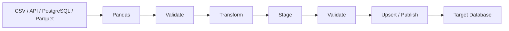

# 04- Dataframe To Database

## Overview

Writing a Pandas `DataFrame` back to a relational database is a common operation in ETL pipelines, reporting systems, data migrations, and backend applications.

The basic flow is:

```text
source data
    ↓
Pandas DataFrame
    ↓
validation
    ↓
transformation
    ↓
database load
    ↓
staging / target tables
```

The difficult part is not calling `to_sql()`. Production-grade DataFrame-to-database loading requires deliberate decisions around:

```text
schema mapping
batch size
transaction boundaries
bulk loading
idempotency
upserts
duplicate handling
constraints
indexes
timeouts
locking
failure recovery
observability
security
```

The central rule is:

> Treat the DataFrame-to-database boundary as a data-loading system, not as a simple function call.

---

## Where DataFrame-to-Database Fits

A common architecture is:



Pandas should generally prepare and validate the data.

The database should remain responsible for:

```text
durable persistence
constraints
transactions
uniqueness
referential integrity
concurrency control
```

---

## `DataFrame.to_sql()`

Pandas provides `DataFrame.to_sql()` for writing tabular data to a SQL database.

Basic usage:

```python
orders.to_sql(
    "orders",
    connection,
    if_exists="append",
    index=False,
)
```

Important parameters include:

| Parameter | Purpose |
|---|---|
| `name` | Target table |
| `con` | Database connection or SQLAlchemy connectable |
| `if_exists` | Behavior when table already exists |
| `index` | Whether the DataFrame index is written |
| `chunksize` | Number of rows sent per batch |
| `dtype` | Explicit SQL column types |
| `method` | Insert strategy |

`to_sql()` is convenient for moderate-volume workloads, but it should not automatically be considered the optimal high-throughput loading mechanism.

---

## `if_exists` Behavior

The main options are:

```python
if_exists="fail"
if_exists="replace"
if_exists="append"
```

### `fail`

Raises an error if the table already exists.

Useful when:

```text
table creation should be explicit
```

### `replace`

Drops and recreates the table.

This is dangerous for production tables because it can destroy existing data and schema objects.

### `append`

Adds rows to the existing table.

This is common for batch ingestion but requires careful duplicate and idempotency handling.

---

## Why `replace` Is Dangerous

Consider:

```python
result.to_sql(
    "customer_metrics",
    engine,
    if_exists="replace",
    index=False,
)
```

This can destroy:

```text
existing rows
indexes
constraints
permissions
triggers
database-specific objects
```

A production ETL pipeline should generally use explicit migration/schema management rather than allowing a Pandas write operation to redefine production tables unexpectedly.

---

## Writing the Index

By default, it is often appropriate to avoid persisting the DataFrame index:

```python
orders.to_sql(
    "orders",
    engine,
    if_exists="append",
    index=False,
)
```

Otherwise the DataFrame index may become an unexpected database column.

Only persist the index when it has explicit business meaning and the target schema is designed for it.

---

## Schema Mapping

A DataFrame is not a database schema.

For example:

```python
orders.dtypes
```

might contain:

```text
order_id       string
amount        Float64
created_at     datetime64[ns, UTC]
is_refunded    boolean
```

while PostgreSQL may need:

```text
TEXT
NUMERIC
TIMESTAMPTZ
BOOLEAN
```

Define important target types explicitly.

```python
from sqlalchemy import Boolean, Numeric, Text, TIMESTAMP


dtype = {
    "order_id": Text(),
    "amount": Numeric(18, 2),
    "created_at": TIMESTAMP(timezone=True),
    "is_refunded": Boolean(),
}
```

Then:

```python
orders.to_sql(
    "orders",
    engine,
    if_exists="append",
    index=False,
    dtype=dtype,
)
```

The exact SQL type should reflect business precision and database design.

---

## Why Explicit Types Matter

Automatic type inference can be convenient, but production systems need stable schemas.

Explicit types help control:

```text
precision
nullability expectations
database storage
query behavior
schema compatibility
```

This is especially important for:

```text
financial values
timestamps
IDs
booleans
large integers
text fields
```

Do not let one unusual batch implicitly redefine the target representation.

---

## DataFrame Dtypes vs SQL Types

| Pandas | Possible PostgreSQL Representation |
|---|---|
| `string` | `TEXT` / `VARCHAR` |
| `Int64` | `INTEGER` / `BIGINT` |
| `Float64` | `DOUBLE PRECISION` |
| Decimal-like values | `NUMERIC` |
| `boolean` | `BOOLEAN` |
| timezone-aware datetime | `TIMESTAMPTZ` |
| naive datetime | `TIMESTAMP` |
| categorical | Usually `TEXT` or an explicit lookup/enum design |

The mapping is not one-to-one. Database schema design should take precedence over automatic inference.

---

## Validation Before Loading

Validate the DataFrame before it reaches the database.

```python
required_columns = {
    "order_id",
    "customer_id",
    "amount",
    "created_at",
}

missing = (
    required_columns
    - set(orders.columns)
)

if missing:
    raise ValueError(
        f"Missing columns: {sorted(missing)}"
    )
```

Also validate:

```text
dtypes
required values
numeric ranges
duplicate keys
timestamps
allowed statuses
referential relationships
```

Database constraints remain an important second line of defense.

---

## Business Validation

Example:

```python
if orders["amount"].lt(0).any():
    raise ValueError(
        "Negative order amounts detected"
    )

if orders["order_id"].duplicated().any():
    raise ValueError(
        "Duplicate order IDs detected"
    )
```

This catches errors before expensive database loading.

However, do not rely only on DataFrame validation for correctness. The target database should also enforce appropriate constraints.

---

## Database Constraints

A production table may define:

```sql
CREATE TABLE orders (
    order_id TEXT PRIMARY KEY,
    customer_id TEXT NOT NULL,
    amount NUMERIC(18, 2) NOT NULL,
    created_at TIMESTAMPTZ NOT NULL
);
```

This provides database-enforced guarantees such as:

```text
primary-key uniqueness
NOT NULL
type correctness
referential integrity
```

Application-side validation and database constraints serve different purposes.

---

## Why Database Constraints Still Matter

The DataFrame may be correct when validated, but another process could write conflicting data simultaneously.

Only the database can reliably enforce shared persistence rules across:

```text
multiple workers
multiple application instances
manual operations
background jobs
different services
```

Do not move database integrity rules entirely into Pandas.

---

## Append Loading

For append-only workloads:

```python
result.to_sql(
    "daily_order_events",
    engine,
    if_exists="append",
    index=False,
    chunksize=5_000,
)
```

This is appropriate when:

```text
records are immutable
duplicates are impossible or controlled
destination is designed for append workloads
```

For mutable entities, append-only loading can create duplicates or stale versions unless the target model explicitly supports them.

---

## Chunked Writes

For large DataFrames, use `chunksize`:

```python
result.to_sql(
    "orders",
    engine,
    if_exists="append",
    index=False,
    chunksize=10_000,
)
```

This limits the number of rows submitted in a single batch.

Benefits include:

```text
bounded client memory during serialization
smaller transactions when configured appropriately
better failure granularity
```

However, `chunksize` does not guarantee that every backend/driver performs a fully optimized bulk load.

---

## Choosing Chunk Size

A larger chunk can provide:

```text
fewer round trips
higher throughput
```

but may increase:

```text
transaction size
memory usage
lock duration
rollback cost
```

A smaller chunk provides:

```text
smaller failure units
lower per-batch memory
```

but may increase:

```text
network round trips
transaction overhead
```

Benchmark using the actual:

```text
database
driver
table
index configuration
row width
workload
```

---

## Batch Transactions

Batching and transaction boundaries are related but not identical.

Conceptually:

```text
chunk 1
→ insert
→ commit

chunk 2
→ insert
→ commit

chunk 3
→ insert
→ commit
```

This reduces the blast radius of failures.

But too-small transactions increase commit overhead.

A production design should choose transaction size according to:

```text
recovery requirements
database load
lock duration
throughput
consistency requirements
```

---

## Atomicity

Sometimes a logical batch must be all-or-nothing.

For example:

```text
customer metrics for 2026-09-10
```

should either:

```text
all be published
```

or:

```text
none be visible as the new version
```

In such cases, use a staging-and-publish pattern rather than independent commits.

---

## Staging Table Pattern

A robust architecture is:

```text
Pandas DataFrame
    ↓
staging table
    ↓
validation
    ↓
deduplication
    ↓
MERGE / UPSERT
    ↓
target table
```

Example:


This creates a controlled boundary between:

```text
data ingestion
```

and:

```text
data publication
```

---

## Why Staging Tables Help

Staging tables are useful for:

```text
validation
reconciliation
deduplication
bulk loading
retry
auditability
schema checks
```

They also make it easier to retry a batch without partially modifying the final target.

---

## Upserts

An upsert means:

```text
insert if record does not exist
update if record already exists
```

This is useful for mutable entities such as:

```text
customers
products
accounts
orders
```

PostgreSQL provides:

```sql
INSERT ...
ON CONFLICT ...
```

A Pandas pipeline can load records into a staging table and then use database-native upsert logic.

---

## PostgreSQL Upsert Pattern

Example:

```sql
INSERT INTO orders (
    order_id,
    customer_id,
    amount,
    updated_at
)
SELECT
    order_id,
    customer_id,
    amount,
    updated_at
FROM staging_orders
ON CONFLICT (order_id)
DO UPDATE SET
    customer_id = EXCLUDED.customer_id,
    amount = EXCLUDED.amount,
    updated_at = EXCLUDED.updated_at;
```

This is generally preferable to attempting row-by-row conflict handling in Python.

---

## `to_sql()` and Upserts

`to_sql()` is primarily a data-transfer API. Production upsert semantics often require additional database-specific SQL.

A common flow is:

```text
DataFrame
→ to_sql(staging table)
→ execute SQL upsert
→ commit
```

This keeps:

```text
bulk transfer
```

separate from:

```text
database-specific publication logic
```

---

## Bulk Loading

For PostgreSQL, large workloads may benefit from native bulk-loading mechanisms such as `COPY`.

Conceptually:

```text
DataFrame
    ↓
efficient serialization
    ↓
COPY
    ↓
PostgreSQL staging table
```

This can be substantially faster than generic insert strategies at sufficiently large volumes.

Use `to_sql()` when simplicity and workload size justify it. Use database-native bulk loading when throughput becomes a material requirement.

---

## `method` Parameter

Pandas allows insert behavior to be customized.

For example:

```python
result.to_sql(
    "orders",
    engine,
    if_exists="append",
    index=False,
    chunksize=10_000,
    method="multi",
)
```

This can improve insert efficiency for some databases and workloads.

It is not equivalent to every database's native bulk-loading mechanism.

Benchmark:

```text
default method
vs
multi-row insert
vs
database-native bulk load
```

before selecting the production strategy.

---

## High-Volume PostgreSQL Loading

For large PostgreSQL loads, the preferred hierarchy is often:

```text
small/moderate workload
→ to_sql()

larger insert workload
→ optimized batch inserts / method="multi"

high-throughput workload
→ COPY or database-native bulk loading

complex incremental load
→ staging + bulk load + SQL merge
```

The exact threshold depends on the environment.

---

## Loading into Existing Tables

When writing to an existing production table:

```text
schema must already be known
indexes must be understood
constraints must be expected
conflicts must be handled
```

Do not let a DataFrame accidentally redefine a production schema.

Production table creation and migration should generally be managed through:

```text
Alembic
Django migrations
Flyway
Liquibase
database migration tooling
```

rather than ad hoc Pandas writes.

---

## Schema Migration vs Data Loading

Keep these concerns separate:

```text
schema migration
    ↓
database structure

data loading
    ↓
records within that structure
```

For example:

```text
migration:
ADD COLUMN customer_tier TEXT

ETL:
populate customer_tier values
```

This is more predictable than having an ETL process unexpectedly create or replace columns.

---

## Duplicate Handling

Appending the same batch twice can create duplicates:

```text
run 1
→ insert batch

run 2 after retry
→ insert same batch again
```

This is one of the most common ETL failure modes.

Use:

```text
primary keys
unique constraints
upserts
batch identifiers
partition replacement
```

to make retries safe.

---

## Idempotent Writes

A load is idempotent when repeating the same logical operation does not create an incorrect final state.

For example:

```text
batch_id = 2026-09-10
```

could be represented by a deterministic staging or partition key.

The pipeline becomes:

```text
process batch
→ write deterministic output
→ publish once
```

or:

```text
upsert by business key
```

depending on the data model.

---

## Exactly-Once vs Idempotency

Do not assume database writes automatically provide exactly-once processing.

A robust system often achieves practical correctness through:

```text
at-least-once delivery
+
idempotent destination logic
```

This is particularly important with:

```text
Kafka
Celery
scheduled ETL
retries
network failures
worker crashes
```

The ability to safely replay data is often more practical than attempting to guarantee exactly-once execution at every layer.

---

## Loading Empty DataFrames

An empty DataFrame should not unexpectedly alter a target table.

Example:

```python
if result.empty:
    logger.info(
        "no_rows_to_load",
    )
    return
```

Whether an empty batch should:

```text
no-op
clear a partition
create an empty table
```

must be explicitly defined.

Do not treat empty input as an accidental database reset signal.

---

## Handling NULL Values

Pandas missing values may map to SQL `NULL`.

Example:

```python
result.to_sql(
    "customers",
    engine,
    if_exists="append",
    index=False,
)
```

The target schema must permit NULL where appropriate.

However:

```text
missing
```

must not automatically mean:

```text
NULL
```

for every business field.

For example:

```text
missing discount
```

might mean:

```text
0
```

or:

```text
unknown
```

or:

```text
not applicable
```

depending on semantics.

---

## Datetime Handling

Normalize timestamps before loading:

```python
result["created_at"] = pd.to_datetime(
    result["created_at"],
    utc=True,
    errors="raise",
)
```

For PostgreSQL:

```text
timezone-aware source
→ TIMESTAMPTZ
```

is often the appropriate mapping when timestamps represent real-world instants.

Avoid mixing:

```text
UTC
local time
naive timestamps
timezone-aware timestamps
```

without an explicit contract.

---

## Financial Data

Do not casually convert financial values to `float64` and then write them into a high-precision financial table.

Prefer a representation that preserves required precision.

For PostgreSQL:

```text
NUMERIC(18, 2)
```

or another explicitly chosen precision may be appropriate.

The exact scale must come from the business domain.

---

## Identifier Integrity

Preserve identifiers as identifiers.

Example:

```python
result["customer_id"] = (
    result["customer_id"]
    .astype("string")
)
```

This prevents problems such as:

```text
001245
```

becoming:

```text
1245
```

before insertion.

---

## Referential Integrity

If the target table references another entity:

```text
orders.customer_id
→ customers.customer_id
```

the DataFrame should be validated before loading.

However, the database should still enforce the foreign key where appropriate.

This protects against other writers bypassing the Pandas pipeline.

---

## Foreign Keys and Load Ordering

When loading related tables:

```text
customers
    ↓
orders
```

parent records must generally exist before child records if foreign-key constraints are active.

A pipeline may therefore use:

```text
load dimensions
→ validate
→ load facts
```

or an appropriate staging strategy.

Do not disable constraints casually to make a batch load succeed.

---

## Indexes and Loading Performance

Indexes improve read performance but increase write cost.

During large loads, every inserted row may require index maintenance.

For a heavily indexed target table:

```text
insert rows
+
update multiple indexes
```

can become expensive.

Use staging tables and appropriate database loading strategies rather than blindly adding indexes to compensate for every query.

---

## Constraint and Index Trade-Offs

| Feature | Read Benefit | Write Cost |
|---|---|---|
| Primary key | High | Moderate |
| Unique index | High | Moderate |
| Foreign key | Integrity | Additional validation |
| Secondary index | Query-dependent | Insert/update overhead |
| Trigger | Business logic | Additional processing |

Do not disable constraints or indexes without understanding the operational and correctness consequences.

---

## Transaction Scope

A transaction that contains a very large load can:

```text
consume database resources
hold locks longer
increase rollback cost
increase WAL volume
```

But committing every row independently is also inefficient.

A production design usually selects transaction boundaries around logical batches.

---

## Error Recovery

Consider:

```text
batch 1 → success
batch 2 → success
batch 3 → failure
batch 4 → not processed
```

A good design should be able to:

```text
retry batch 3
```

without corrupting or duplicating batches 1 and 2.

This requires:

```text
batch identity
idempotent loading
durable checkpoints
observability
```

---

## Database-to-Pandas-to-Database

A common ETL loop is:


This is useful when:

```text
data needs Python-based transformation
```

but the final source of truth should remain in a relational database.

---

## Avoiding Full Round Trips

A poor workflow is:

```text
PostgreSQL
→ extract entire table
→ Pandas
→ write entire table
→ PostgreSQL
```

when only a small subset changed.

Prefer incremental processing:

```text
new/changed source rows
→ Pandas
→ upsert changed rows
```

This reduces:

```text
database I/O
network traffic
Pandas memory
write volume
```

---

## Incremental Load

A common pattern is:

```python
query = """
SELECT
    order_id,
    customer_id,
    amount,
    updated_at
FROM orders
WHERE updated_at > %(watermark)s
ORDER BY updated_at, order_id;
"""

for chunk in pd.read_sql_query(
    query,
    connection,
    params={
        "watermark": watermark,
    },
    chunksize=10_000,
):
    transform(chunk)
    load_batch(chunk)
```

The implementation should also define:

```text
watermark advancement
late-arriving records
duplicate handling
transaction semantics
retry behavior
```

---

## Checkpointing

A safe sequence is:

```text
extract batch
→ transform
→ validate
→ load successfully
→ commit
→ advance checkpoint
```

Do not advance the checkpoint before the database load is successful.

Otherwise a worker failure can cause records to be skipped permanently.

---

## Batch IDs

A deterministic batch identifier can simplify recovery.

Example:

```text
pipeline=orders
date=2026-09-10
batch=000123
```

Store this metadata in:

```text
staging tables
audit tables
control tables
logs
```

where operational visibility is required.

---

## Audit Tables

For critical ETL systems, record run metadata such as:

```text
run_id
batch_id
pipeline_version
started_at
completed_at
input_rows
output_rows
invalid_rows
status
error_message
```

This provides a searchable operational history.

Example table:

```sql
CREATE TABLE etl_runs (
    run_id UUID PRIMARY KEY,
    pipeline_name TEXT NOT NULL,
    batch_id TEXT NOT NULL,
    status TEXT NOT NULL,
    input_rows BIGINT,
    output_rows BIGINT,
    started_at TIMESTAMPTZ NOT NULL,
    completed_at TIMESTAMPTZ
);
```

---

## Reconciliation

Compare important source and destination metrics.

Examples:

```text
input rows
loaded rows
rejected rows
distinct IDs
financial totals
partition counts
```

Example:

```python
expected_revenue = (
    result["amount"]
    .sum()
)

logger.info(
    "load_reconciliation",
    extra={
        "rows": len(result),
        "expected_revenue": float(
            expected_revenue
        ),
    },
)
```

The destination can then be queried to verify the expected invariant.

---

## Upsert Verification

After an upsert, validate:

```text
number of inserted rows
number of updated rows
number of rejected rows
duplicate count
constraint violations
```

For critical financial or reporting pipelines, reconciliation should be part of the normal workflow rather than an emergency debugging technique.

---

## Loading Through SQLAlchemy

A typical production setup:

```python
from sqlalchemy import create_engine


engine = create_engine(
    database_url,
    pool_pre_ping=True,
    pool_size=5,
    max_overflow=5,
)

result.to_sql(
    "staging_orders",
    engine,
    if_exists="append",
    index=False,
    chunksize=10_000,
)
```

Connection settings should be aligned with:

```text
deployment concurrency
database capacity
workload duration
failure behavior
```

Do not configure pool sizes independently on every service.

---

## Connection Pool Capacity

If:

```text
Kubernetes replicas = 4
workers per replica = 3
pool_size = 5
```

potential connections can become substantial.

Capacity planning must consider:

```text
replicas
workers
pool size
overflow connections
other application consumers
administrative access
```

PostgreSQL connection limits should not be treated as infinite.

---

## FastAPI Integration

Large DataFrame-to-database workloads generally should not execute synchronously in latency-sensitive request handlers.

Avoid:

```text
POST /upload
    ↓
large DataFrame transformation
    ↓
large database transaction
    ↓
HTTP response
```

Prefer:

```text
FastAPI
    ↓
create job
    ↓
Celery / Kubernetes Job
    ↓
Pandas
    ↓
database
    ↓
job status
```

This separates API availability from batch-processing latency.

---

## Celery Integration

Pass a lightweight reference:

```python
@app.task
def load_batch(
    batch_path: str,
) -> None:
    batch = pd.read_parquet(
        batch_path,
    )

    validate_batch(batch)
    write_batch(batch)
```

Avoid serializing large DataFrames directly through the Celery broker.

Prefer:

```text
S3 key
file path
batch ID
partition
```

for task arguments.

---

## Kubernetes Integration

Database loaders running in Kubernetes should consider:

```text
CPU
memory
connection count
network bandwidth
batch size
retry policy
termination behavior
```

If a pod is terminated during a batch, the load must be safe to retry.

This is another reason staging and idempotent writes are valuable.

---

## Security

The database credential used for ETL should have only the permissions required by the pipeline.

For example:

```text
read source tables
write staging table
execute required merge
```

Do not grant unrestricted administrative privileges to a Pandas ETL worker.

Protect credentials with:

```text
AWS Secrets Manager
Kubernetes Secrets
environment-managed secrets
```

and rotate them according to operational policy.

---

## SQL Injection

Never construct dynamic SQL from untrusted DataFrame values or request input.

Parameterized values:

```python
pd.read_sql_query(
    query,
    connection,
    params=params,
)
```

are appropriate for extraction.

For database-side publication SQL, use parameterized statements or safe query construction through the database library.

---

## Logging Sensitive Data

Avoid logging:

```python
logger.info(
    "rows=%s",
    result.to_dict("records"),
)
```

A production DataFrame may contain:

```text
PII
financial information
tokens
internal identifiers
```

Log metadata:

```text
batch ID
row count
duration
partition
status
error classification
```

instead.

---

## Monitoring

Track:

```text
rows attempted
rows inserted
rows updated
rows rejected
batch duration
rows per second
database latency
transaction duration
retry count
failure count
```

Also monitor:

```text
database CPU
I/O
connections
locks
WAL volume
replication lag
```

for high-volume loads.

---

## Performance Monitoring

A useful throughput metric is:

```text
rows loaded / second
```

Example:

```python
rows_per_second = (
    len(result) / elapsed
    if elapsed
    else 0.0
)
```

Also measure:

```text
bytes loaded
database execution time
serialization time
network time
```

This helps distinguish Python bottlenecks from database bottlenecks.

---

## Destination Performance

The load path can be affected by:

```text
indexes
triggers
foreign keys
constraints
partitioning
network latency
database locks
```

A DataFrame transformation may be very fast while the final database write becomes the dominant cost.

Optimize the actual bottleneck.

---

## Partitioned Tables

For time-series or large fact data, PostgreSQL table partitioning may be appropriate.

Example:

```text
orders
├── 2026-09-01
├── 2026-09-02
├── 2026-09-03
└── ...
```

Pandas can prepare a specific partition's data while PostgreSQL manages:

```text
storage layout
partition routing
constraints
query planning
```

Do not confuse application-level Pandas chunking with database table partitioning. They solve different problems.

---

## DataFrame Partitioning vs Database Partitioning

| Technique | Scope | Primary Goal |
|---|---|---|
| Pandas chunking | Python process | Bound memory |
| Parquet partitioning | File/object storage | Efficient analytical access |
| PostgreSQL partitioning | Database | Manage large relational tables |
| Kafka partitioning | Event stream | Parallelism and ordering domains |

A production architecture may use multiple layers simultaneously.

---

## Loading Parquet to PostgreSQL

For large analytical files:

```text
Parquet
    ↓
Pandas or database-native reader
    ↓
validation
    ↓
bulk load
    ↓
PostgreSQL
```

For sufficiently large datasets, an intermediate CSV serialization solely to use a bulk loader may be unnecessary or expensive. Prefer a direct or efficient conversion path supported by the chosen database and tooling.

---

## DataFrame-to-Database vs Database-to-Database

If the transformation can be expressed entirely in SQL and both datasets already exist in the database, avoid unnecessary round trips through Pandas.

Prefer:

```text
SQL → SQL
```

when appropriate.

Use:

```text
SQL → Pandas → SQL
```

when the Python/Pandas transformation adds real value.

---

## Common Mistakes

### Calling `to_sql()` on Huge DataFrames Without a Strategy

A large single write can create large transactions and poor failure recovery.

### Using `replace` on Production Tables

This can destroy existing data and schema objects.

### Writing Row by Row

Per-row database calls are usually dramatically slower than batch operations.

### Ignoring Database Constraints

Pandas validation does not replace shared database integrity rules.

### Replaying `append` Without Idempotency

Retries can silently duplicate rows.

### Using `SELECT`/`INSERT` Per DataFrame Row

This creates N+1 database activity.

### Loading Data Before Validating It

Invalid data can partially contaminate production tables.

### Holding One Huge Transaction

Large transactions increase rollback cost and can create resource pressure.

### Disabling Constraints to Improve Speed

This can create invalid relational state.

### Ignoring Index Maintenance

Indexes can become a major write-time cost.

### Assuming `chunksize` Means Fully Optimized Bulk Loading

Chunking changes batch size but does not necessarily use the database's fastest ingestion path.

### Passing Huge DataFrames Through Celery

This increases broker payload size and worker overhead.

### Running Large Loads Inside API Requests

Long database transactions and DataFrame processing can exhaust web workers.

### Logging Entire DataFrames

This creates cost, performance, and security problems.

---

## Production Workflow

A mature DataFrame-to-database load often looks like:

```text
source
  ↓
DataFrame
  ↓
schema validation
  ↓
business validation
  ↓
deduplication
  ↓
batch preparation
  ↓
staging table
  ↓
database constraints / validation
  ↓
bulk load
  ↓
upsert / merge
  ↓
reconciliation
  ↓
commit checkpoint
  ↓
publish success
```

This separates data preparation from durable publication.

---

## Practical Example

```python
from sqlalchemy import (
    Boolean,
    Numeric,
    Text,
    TIMESTAMP,
    create_engine,
)


def load_orders(
    orders,
    engine,
) -> None:
    required_columns = {
        "order_id",
        "customer_id",
        "amount",
        "created_at",
        "is_refunded",
    }

    missing = (
        required_columns
        - set(orders.columns)
    )

    if missing:
        raise ValueError(
            f"Missing columns: {sorted(missing)}"
        )

    if orders.empty:
        return

    if orders["order_id"].duplicated().any():
        raise ValueError(
            "Duplicate order IDs detected"
        )

    if orders["amount"].lt(0).any():
        raise ValueError(
            "Negative amounts detected"
        )

    batch = orders.copy()

    batch["order_id"] = (
        batch["order_id"]
        .astype("string")
    )

    batch["customer_id"] = (
        batch["customer_id"]
        .astype("string")
    )

    batch["amount"] = pd.to_numeric(
        batch["amount"],
        errors="raise",
    )

    batch["created_at"] = pd.to_datetime(
        batch["created_at"],
        utc=True,
        errors="raise",
    )

    dtype = {
        "order_id": Text(),
        "customer_id": Text(),
        "amount": Numeric(18, 2),
        "created_at": TIMESTAMP(
            timezone=True,
        ),
        "is_refunded": Boolean(),
    }

    batch.to_sql(
        "staging_orders",
        engine,
        if_exists="append",
        index=False,
        chunksize=10_000,
        dtype=dtype,
        method="multi",
    )
```

The example deliberately treats:

```text
validation
normalization
typing
batching
staging
```

as separate concerns.

In a high-volume PostgreSQL pipeline, a native bulk-loader plus a SQL upsert stage may be preferable.

---

## Testing

Test the loading contract, not just whether `to_sql()` executes.

Examples:

```text
required columns
dtype normalization
NULL handling
duplicate rejection
invalid-value rejection
row counts
database constraints
upsert behavior
retry behavior
idempotency
empty input
```

A particularly valuable test is:

```text
run the same logical batch twice
```

and verify that the final destination contains the expected number of records.

---

## Idempotency Test

Conceptually:

```python
load_batch(batch)
load_batch(batch)

rows = fetch_orders(
    order_ids=batch["order_id"],
)

assert len(rows) == len(
    batch["order_id"].unique()
)
```

The exact test depends on the database loading strategy.

The important property is:

```text
retry
≠
duplicate data
```

---

## Backfill Support

The same loading code should ideally support:

```text
daily increment
weekly repair
historical backfill
full rebuild
```

without duplicating core transformation logic.

A backfill should specify:

```text
source range
batch identity
pipeline version
destination strategy
```

For large historical loads, use bounded batches and independent checkpoints.

---

## Disaster Recovery

A robust loading system should make it possible to recover from:

```text
worker crash
database failover
network interruption
invalid deployment
corrupt batch
partial load
```

Useful mechanisms include:

```text
staging tables
batch IDs
idempotent writes
audit records
checkpoints
raw source retention
versioned transformations
```

If a load fails after staging but before publication, the staging data should be either:

```text
reused
cleaned safely
expired automatically
```

according to the operational design.

---

## Production Checklist

```text
[ ] Target schema is managed separately from ETL code
[ ] DataFrame schema is validated before loading
[ ] Required dtypes are normalized explicitly
[ ] Financial precision requirements are defined
[ ] Identifier semantics are preserved
[ ] Datetime timezone semantics are explicit
[ ] NULL behavior is intentional
[ ] Duplicate handling is deterministic
[ ] Database constraints enforce critical integrity rules
[ ] Large DataFrames are loaded in bounded batches
[ ] Chunk size is benchmarked
[ ] Bulk loading is used when volume justifies it
[ ] Staging tables are used for complex or high-risk loads
[ ] Upsert semantics are explicit
[ ] Writes are idempotent or otherwise retry-safe
[ ] Empty input behavior is defined
[ ] Transaction boundaries are deliberate
[ ] Database connection pooling is configured
[ ] Connection capacity accounts for all workers and replicas
[ ] Query/load timeouts are defined
[ ] Index and constraint write costs are understood
[ ] Checkpoints advance only after successful persistence
[ ] Reconciliation metrics are collected
[ ] Batch and run identifiers are recorded
[ ] Sensitive data is not logged
[ ] Database credentials use least privilege
[ ] Large jobs do not run synchronously inside API requests
[ ] Celery payloads remain small
[ ] Kubernetes memory and connection capacity are planned
[ ] Retry and failure recovery are tested
[ ] Historical backfills are supported where required
```

## Interview Perspective

### What Is `DataFrame.to_sql()` Good For?

It is a convenient interface for writing DataFrame data to SQL databases, especially for moderate-volume ETL and application workflows.

### Is `to_sql()` Always the Best Choice for Large Loads?

No. For high-volume workloads, database-native bulk-loading mechanisms such as PostgreSQL `COPY` can provide better throughput.

### Why Use a Staging Table?

It separates ingestion from publication and makes validation, deduplication, reconciliation, retry, and upsert workflows easier to control.

### Why Is `if_exists="replace"` Dangerous?

It can destroy the existing table and recreate it, potentially removing data and schema objects such as indexes and constraints.

### How Do You Make a Database Load Idempotent?

Use business keys, unique constraints, batch identifiers, deterministic writes, upserts, or partition replacement so replaying the same batch does not create incorrect duplicates.

### Why Is Row-by-Row Insertion Inefficient?

Each row may require additional application/database interaction and transaction overhead. Batch and bulk operations reduce round trips and improve throughput.

### What Does `chunksize` Solve?

It bounds the number of rows handled per insert batch. It can improve memory and failure granularity but does not automatically provide the fastest possible database load.

### Why Should a Database Still Have Constraints When Pandas Validates Data?

Other processes can write concurrently or bypass the ETL path. Database constraints provide shared enforcement of integrity rules.

### How Should a Large DataFrame Be Loaded into PostgreSQL?

A common high-volume design is:

```text
validate DataFrame
→ staging table
→ bulk load
→ SQL validation
→ upsert / merge
→ reconcile
→ publish
```

### Should Large Database Loads Run in FastAPI?

Usually not. Long-running DataFrame processing and database transactions can exhaust request workers and exceed latency budgets. Background workers or batch jobs are generally more appropriate.

### How Do You Handle Retries?

Use deterministic batch identity, idempotent destination writes, explicit transaction boundaries, and checkpoint advancement only after successful persistence.

### What Is the Difference Between Pandas Validation and Database Constraints?

Pandas validation checks a particular batch before loading. Database constraints enforce integrity across all writers and transactions at the persistence boundary.

## Key Takeaways

- `DataFrame.to_sql()` is convenient for database writes, but production loading requires explicit schema mapping, validation, batching, transaction design, and failure handling.
- Use staging tables, database constraints, bulk-loading mechanisms, and native upsert logic when data volume or reliability requirements exceed simple `to_sql(..., append)` usage.
- Design every batch for safe replay: deterministic identity, idempotent writes, duplicate protection, checkpoint-after-success semantics, and reconciliation.
- Keep schema migrations separate from data loading, preserve identifier and datetime semantics, and treat financial precision and NULL behavior as explicit contracts.
- Optimize the complete write path—Pandas serialization, network transfer, database execution, indexes, constraints, connections, and transaction scope—rather than optimizing `to_sql()` in isolation.