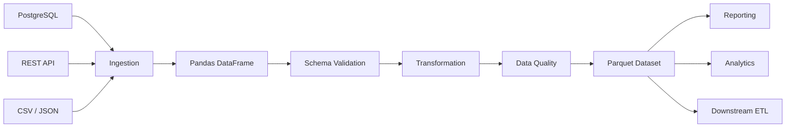

# 05- Pandas And Parquet

## Overview

Pandas and Parquet complement each other in production data-processing systems.

Pandas provides the in-memory processing model:

```text
read
→ validate
→ transform
→ aggregate
→ enrich
```

Parquet provides an efficient persistent representation:

```text
typed
+
columnar
+
compressed
+
analytics-oriented
```

A common architecture is:

```text
PostgreSQL / REST API / CSV / Kafka
                ↓
            Pandas
                ↓
      validation + transformation
                ↓
             Parquet
                ↓
       analytics / reporting
```

The important distinction is:

> Pandas is primarily a processing layer; Parquet is primarily a storage format.

Using them together can reduce memory pressure, disk usage, network transfer, and repeated parsing while creating a stable interchange format between ETL stages.

---

## Why Pandas and Parquet Work Well Together

Pandas frequently needs to process structured tabular datasets, while Parquet is optimized for storing and retrieving exactly that kind of data.

Parquet provides:

```text
columnar storage
schema metadata
compression
encoding
row groups
statistics
```

Pandas provides:

```text
DataFrame operations
vectorization
groupby
joins
filtering
transformation
data validation
```

The resulting workflow is particularly effective for:

```text
ETL
batch processing
historical reporting
data lakes
feature preparation
analytics
intermediate pipeline storage
```

---

## CSV vs Parquet

| Concern | CSV | Parquet |
|---|---|---|
| Storage model | Text | Columnar binary |
| Schema metadata | Limited | Built in |
| Type preservation | Weak | Stronger |
| Compression | External/manual | Native |
| Read selected columns | Inefficient | Efficient |
| Predicate pushdown | Limited | Supported by compatible readers |
| Human readability | Excellent | Poor |
| Large analytical datasets | Usually weaker | Strong fit |
| Cross-language support | Excellent | Excellent |

CSV remains useful for interchange and external integrations. Parquet is generally a better internal analytical storage format.

---

## Typical Architecture



The DataFrame should represent the processing state, while Parquet acts as a durable and efficient boundary between processing stages.

---

## Writing a DataFrame to Parquet

Basic usage:

```python
import pandas as pd


orders.to_parquet(
    "data/processed/orders.parquet",
    engine="pyarrow",
    index=False,
)
```

Common production parameters include:

```text
engine
compression
index
partitioning strategy
schema
destination path
```

For analytical datasets, `index=False` is often appropriate unless the index has explicit business meaning.

---

## Reading Parquet

Basic read:

```python
orders = pd.read_parquet(
    "data/processed/orders.parquet",
    engine="pyarrow",
)
```

Column projection:

```python
orders = pd.read_parquet(
    "data/processed/orders.parquet",
    columns=[
        "order_id",
        "customer_id",
        "amount",
    ],
)
```

Filtering:

```python
orders = pd.read_parquet(
    "data/processed/orders.parquet",
    filters=[
        ("status", "=", "completed"),
    ],
)
```

The effectiveness of filters depends on the reader, file metadata, row-group statistics, and dataset layout.

---

## Column Projection

Column projection means loading only required columns.

Prefer:

```python
orders = pd.read_parquet(
    "orders.parquet",
    columns=[
        "customer_id",
        "amount",
    ],
)
```

over:

```python
orders = pd.read_parquet(
    "orders.parquet",
)

orders = orders[
    [
        "customer_id",
        "amount",
    ]
]
```

The first version can avoid reading unnecessary column chunks.

This becomes increasingly important for wide datasets containing:

```text
raw JSON
free text
audit fields
metadata
large strings
```

that are irrelevant to the current processing task.

---

## Predicate Pushdown

A filter may be pushed toward the Parquet reader:

```python
orders = pd.read_parquet(
    "orders.parquet",
    filters=[
        ("event_date", "=", "2026-09-10"),
    ],
)
```

The reader can use metadata and statistics to avoid reading data that cannot satisfy the predicate.

This reduces:

```text
I/O
decompression
decoding
memory materialization
```

Predicate pushdown is most effective when the data is physically organized so that filtering can eliminate substantial portions of the dataset.

---

## Partition Pruning

A partitioned dataset might look like:

```text
orders/
    event_date=2026-09-08/
    event_date=2026-09-09/
    event_date=2026-09-10/
```

A query for:

```text
event_date = 2026-09-10
```

can avoid scanning other partitions.

Conceptually:

```text
query
  ↓
partition filter
  ↓
matching partitions only
  ↓
row-group filtering
  ↓
column projection
  ↓
DataFrame
```

Partition pruning can provide a larger benefit than row filtering because entire files or directories can be skipped.

---

## Partition Key Selection

Good partition keys usually have:

```text
high query relevance
manageable cardinality
stable semantics
```

Common examples:

```text
event_date
year
month
region
```

Avoid high-cardinality keys such as:

```text
request_id
transaction_id
UUID
customer_id
```

unless the access pattern and storage engine specifically justify them.

---

## Partition Explosion

Consider:

```text
10 million customers
```

and partitioning by:

```text
customer_id
```

This can create an enormous number of partitions or files.

The result may be:

```text
metadata overhead
tiny files
slow planning
high object-storage request counts
```

Partitioning should be based on workload characteristics, not simply dataset size.

---

## Row Groups

Parquet files are internally organized into row groups.

Conceptually:

```text
Parquet File
├── Row Group 1
│   ├── customer_id
│   ├── amount
│   └── status
├── Row Group 2
│   ├── customer_id
│   ├── amount
│   └── status
└── Row Group 3
    ├── customer_id
    ├── amount
    └── status
```

Row groups are important for:

```text
scan granularity
statistics
filter pruning
parallelism
```

A reader may skip row groups whose statistics prove they cannot match the requested predicate.

---

## Parquet Statistics

A simplified example:

```text
Row Group A:
amount min = 10
amount max = 100

Row Group B:
amount min = 10,000
amount max = 20,000
```

For:

```text
amount > 5,000
```

the reader can potentially skip Row Group A.

This works best when values are reasonably localized within row groups.

Randomly distributed values often produce broad statistics that provide less pruning benefit.

---

## Compression

Parquet supports column-level compression.

Common codecs include:

```text
Snappy
Zstandard
Gzip
Brotli
LZ4
```

Example:

```python
orders.to_parquet(
    "orders.parquet",
    engine="pyarrow",
    compression="zstd",
    index=False,
)
```

Compression affects:

```text
storage size
network transfer
write CPU
read CPU
```

There is no universally optimal codec.

---

## Compression Strategy

| Workload | Typical Preference |
|---|---|
| Fast general-purpose analytics | Snappy |
| Strong compression with good overall performance | Zstandard |
| Maximum compression where CPU is less important | Gzip/Brotli |
| Very low compression/decompression latency | LZ4 |

Benchmark with representative data.

A codec that reduces storage by 70% but doubles write CPU may or may not be the correct production choice.

---

## Data Types and Schema

Parquet preserves schema metadata more effectively than text formats.

For example:

```python
orders = orders.astype(
    {
        "order_id": "string",
        "customer_id": "string",
        "quantity": "Int64",
        "is_refunded": "boolean",
    }
)
```

Then:

```python
orders.to_parquet(
    "orders.parquet",
    index=False,
)
```

This can reduce repeated type inference when the dataset is read later.

However, the DataFrame schema should still be explicitly validated before publication.

---

## Categorical Columns

Categorical columns can be useful for repeated dimensions such as:

```text
status
region
country
payment_method
event_type
```

Example:

```python
orders["status"] = orders[
    "status"
].astype("category")
```

The storage representation and downstream behavior should be tested because categorical semantics can interact with:

```text
schema
partitioning
groupby
cross-tool interoperability
```

Use explicit category definitions when the valid domain is controlled.

---

## Schema Evolution

Production Parquet datasets change over time.

Possible changes include:

```text
add column
rename column
change type
change nullability
remove column
```

Example:

```text
v1:
amount → float

v2:
amount → decimal-compatible representation
```

Downstream consumers may break if they assume a fixed schema.

Use explicit schema contracts and compatibility rules.

---

## Schema Drift

Source systems can unexpectedly change:

```text
customer_id → integer
customer_id → string
```

or:

```text
event_time → string
```

instead of a timestamp.

Normalize before writing:

```python
orders["customer_id"] = (
    orders["customer_id"]
    .astype("string")
)

orders["event_time"] = pd.to_datetime(
    orders["event_time"],
    utc=True,
    errors="raise",
)
```

Do not allow accidental source inference to define a long-lived analytical schema.

---

## CSV to Parquet

A common ingestion pattern is:

```python
orders = pd.read_csv(
    "orders.csv",
    dtype={
        "order_id": "string",
        "customer_id": "string",
        "status": "string",
    },
)

orders["amount"] = pd.to_numeric(
    orders["amount"],
    errors="raise",
)

orders["created_at"] = pd.to_datetime(
    orders["created_at"],
    utc=True,
    errors="raise",
)

orders.to_parquet(
    "orders.parquet",
    engine="pyarrow",
    compression="zstd",
    index=False,
)
```

The transformation performs:

```text
text parsing
→ schema normalization
→ validation
→ efficient persistence
```

---

## Parquet as an ETL Intermediate

Parquet is often useful between pipeline stages.

For example:

```text
PostgreSQL
   ↓
raw extraction
   ↓
Parquet
   ↓
Pandas transformation
   ↓
Parquet
   ↓
report generation
```

Advantages include:

```text
restartable stages
reduced repeated parsing
efficient reads
schema visibility
portable artifacts
```

This becomes especially useful for long-running pipelines and backfills.

---

## Parquet Dataset vs Single File

A single file:

```text
orders.parquet
```

may be appropriate for:

```text
small datasets
simple exports
temporary artifacts
```

A dataset:

```text
orders/
    event_date=2026-09-08/
    event_date=2026-09-09/
    event_date=2026-09-10/
```

is generally more suitable for:

```text
large historical data
incremental ingestion
partition pruning
parallel reads
frequent range queries
```

Dataset design should match consumer behavior.

---

## Incremental Parquet Writes

An incremental pipeline can produce:

```text
orders/
    event_date=2026-09-10/
        part-0001.parquet
        part-0002.parquet
```

instead of repeatedly rewriting one giant file.

Benefits include:

```text
bounded writes
incremental processing
smaller failure units
parallel downstream access
```

The pipeline should have a strategy for late-arriving records and partition replacement.

---

## Late-Arriving Data

Suppose:

```text
event_date = 2026-09-09
```

arrives on:

```text
2026-09-10
```

The pipeline may need to:

```text
reprocess the partition
```

or:

```text
append a correction
```

depending on the downstream data model.

Define:

```text
watermark
lateness window
deduplication
reprocessing policy
```

before deploying incremental Parquet pipelines.

---

## Small Files Problem

A pipeline can accidentally create:

```text
one file per API page
one file per Kafka poll
one file per Celery task
```

and eventually produce:

```text
millions of tiny Parquet files
```

This increases:

```text
metadata operations
object-store requests
query planning
file-opening overhead
```

Application batch size and storage-file size should be designed independently.

---

## Compaction

Compaction combines small files into fewer larger files.

```text
Before:
10,000 small files

        ↓

After:
100 larger files
```

Compaction improves:

```text
scan efficiency
metadata handling
query planning
object-storage access
```

but costs:

```text
CPU
I/O
temporary storage
```

Run it based on measurable read-time and operational benefits.

---

## Pandas Memory and Parquet

Parquet reduces storage and I/O, but reading Parquet into Pandas can still materialize large DataFrames.

This:

```python
df = pd.read_parquet(
    "large_dataset.parquet",
)
```

can consume substantial memory.

Use:

```python
df = pd.read_parquet(
    "large_dataset.parquet",
    columns=[
        "customer_id",
        "amount",
    ],
)
```

and storage-level filtering where supported.

For very large workloads, combine Parquet with:

```text
partitioning
chunk processing
DuckDB
Polars
Dask
Spark
```

as appropriate.

---

## Parquet and Chunk Processing

For large datasets, use a layout that supports bounded processing:

```text
partition
    ↓
file
    ↓
bounded batch
    ↓
Pandas
    ↓
transform
    ↓
persist
```

Do not assume one Parquet file equals one processing batch.

A file may itself be too large.

Conversely, many tiny files may create unnecessary overhead.

---

## Reading from S3

A common architecture is:

```text
AWS S3
   ↓
Parquet dataset
   ↓
Pandas / PyArrow
   ↓
analytics
```

Example:

```python
orders = pd.read_parquet(
    "s3://analytics/orders/",
    columns=[
        "customer_id",
        "amount",
        "event_date",
    ],
    filters=[
        ("event_date", "=", "2026-09-10"),
    ],
)
```

Actual support and performance depend on the installed filesystem integration, engine, permissions, partition layout, and reader capabilities.

---

## AWS Considerations

For S3-backed datasets, optimize:

```text
object count
partition layout
file sizes
compression
column projection
request count
data scanned
```

Avoid:

```text
one object per record
```

and avoid unbounded growth of:

```text
tiny Parquet files
```

Use IAM least privilege and private buckets for sensitive datasets.

---

## Pandas and PostgreSQL

A common architecture is:

```text
PostgreSQL
    ↓
incremental SQL extraction
    ↓
Pandas
    ↓
validation / transformation
    ↓
Parquet
    ↓
analytics
```

PostgreSQL remains appropriate for:

```text
transactional workloads
relational integrity
indexed queries
updates
```

Parquet is more appropriate for:

```text
large analytical scans
historical datasets
ETL intermediate storage
data lake workloads
```

Do not replace a transactional database with Parquet simply because Parquet is efficient for analytics.

---

## Pandas and REST APIs

REST APIs typically use JSON at the application boundary.

A reasonable internal architecture is:

```text
REST API
    ↓
JSON
    ↓
Pandas normalization
    ↓
Parquet
```

Parquet is better treated as an internal analytical format than a browser-facing API format.

---

## Pandas and Kafka

Kafka can provide bounded batches to Pandas:

```text
Kafka poll
    ↓
records
    ↓
DataFrame
    ↓
transform
    ↓
Parquet
```

The consumer can treat Parquet as a durable analytical sink.

For sustained high-throughput streaming, however, Pandas may not be the correct processing engine.

---

## Parquet and Data Validation

Before writing:

```python
required_columns = {
    "order_id",
    "customer_id",
    "amount",
    "event_date",
}

missing = (
    required_columns
    - set(orders.columns)
)

if missing:
    raise ValueError(
        f"Missing columns: {sorted(missing)}"
)
```

Also validate:

```text
nullability
duplicate keys
numeric ranges
allowed categories
timestamp ranges
row counts
referential integrity
```

Do not use Parquet as an excuse to skip data-quality checks.

---

## Publishing a Dataset

Avoid exposing half-written data.

A safer workflow is:

```text
write temporary/versioned output
    ↓
validate
    ↓
publish
```

For immutable files:

```text
dataset version
+
complete set of files
+
published metadata
```

can provide clearer visibility than mutating a shared file in place.

The exact publication mechanism depends on:

```text
S3/object storage
table format
query engine
consumer requirements
```

---

## Idempotent Writes

Incremental Parquet pipelines should support retries.

A deterministic path might be:

```text
orders/
    event_date=2026-09-10/
        batch_id=000123.parquet
```

If batch `000123` is retried, the pipeline should either:

```text
safely replace the previous batch
```

or:

```text
detect that the batch already exists
```

Do not blindly append duplicate files on every retry.

---

## Versioning

For reproducibility, identify:

```text
dataset version
pipeline version
batch ID
source range
configuration version
```

Example:

```text
orders/
    pipeline_version=v4/
        event_date=2026-09-10/
```

This makes historical output easier to reproduce and audit.

---

## Security Considerations

Parquet is not an access-control system.

For sensitive datasets:

```text
encrypt at rest
encrypt in transit
use least-privilege IAM
restrict bucket access
avoid sensitive logs
apply retention policies
```

Do not log complete DataFrames:

```python
logger.info(
    "orders=%s",
    orders,
)
```

Prefer:

```python
logger.info(
    "parquet_batch_written",
    extra={
        "batch_id": batch_id,
        "row_count": len(orders),
    },
)
```

---

## Cost Considerations

Parquet can reduce cloud cost by reducing:

```text
storage volume
data scanned
network transfer
CPU spent parsing text
```

But poor dataset design can increase:

```text
object-store API requests
metadata overhead
compaction cost
query planning
```

Optimize total system cost rather than only compressed file size.

---

## Monitoring

Useful dataset-level metrics include:

```text
files created
average file size
total bytes
compression ratio
rows per file
partition count
read duration
write duration
bytes scanned
rows processed
```

Useful pipeline-level metrics include:

```text
batch duration
throughput
peak memory
invalid rows
retry count
late-record count
schema failures
```

Monitor the evolution of the dataset, not just individual job runtime.

---

## Performance Benchmarking

Compare representative workloads:

```text
CSV full read
Parquet full read
Parquet selected-column read
Parquet filtered read
Parquet partitioned read
```

Example:

```python
from time import perf_counter

import pandas as pd


started = perf_counter()

orders = pd.read_parquet(
    "orders.parquet",
    columns=[
        "customer_id",
        "amount",
    ],
)

elapsed = perf_counter() - started

print(
    f"rows={len(orders)} "
    f"elapsed_seconds={elapsed:.3f}"
)
```

Benchmark with realistic:

```text
row counts
column widths
cardinalities
compression
storage medium
query selectivity
```

---

## Common Mistakes

### Treating Parquet Like CSV

Parquet contains schema, metadata, compression, and columnar organization. It should be consumed through appropriate readers rather than text-processing techniques.

### Reading All Columns

This wastes I/O and memory.

### Partitioning by High-Cardinality Columns

This creates partition explosion and tiny files.

### Creating One File per Small Batch

The dataset can become operationally expensive even when individual tasks are fast.

### Assuming Compression Is Free

Compression changes CPU and I/O trade-offs.

### Assuming Parquet Eliminates Pandas Memory Limits

Pandas still materializes DataFrames in memory.

### Ignoring Schema Evolution

Independent pipeline runs can produce incompatible datasets.

### Publishing Partially Written Data

Consumers may observe inconsistent results.

### Blindly Appending on Retry

A failed batch can create duplicate data.

### Using Parquet for Transactional Workloads

Parquet does not provide the transactional semantics of a relational database.

### Choosing Partition Keys Without Looking at Queries

Partitioning should follow access patterns.

---

## Practical ETL Example

```python
from pathlib import Path

import pandas as pd


input_path = Path(
    "data/raw/orders.csv"
)

output_dir = Path(
    "data/processed/orders"
)

orders = pd.read_csv(
    input_path,
    usecols=[
        "order_id",
        "customer_id",
        "status",
        "amount",
        "created_at",
    ],
    dtype={
        "order_id": "string",
        "customer_id": "string",
        "status": "string",
    },
)

orders["amount"] = pd.to_numeric(
    orders["amount"],
    errors="raise",
)

orders["created_at"] = pd.to_datetime(
    orders["created_at"],
    utc=True,
    errors="raise",
)

if orders["order_id"].duplicated().any():
    raise ValueError(
        "Duplicate order IDs detected"
    )

if orders["amount"].lt(0).any():
    raise ValueError(
        "Negative amounts detected"
    )

orders["event_date"] = (
    orders["created_at"]
    .dt.date
)

output_dir.mkdir(
    parents=True,
    exist_ok=True,
)

for event_date, partition in orders.groupby(
    "event_date",
    sort=False,
):
    partition = partition.drop(
        columns="event_date"
    )

    partition_path = (
        output_dir
        / f"event_date={event_date}"
        / "part-0001.parquet"
    )

    partition_path.parent.mkdir(
        parents=True,
        exist_ok=True,
    )

    partition.to_parquet(
        partition_path,
        engine="pyarrow",
        compression="zstd",
        index=False,
    )
```

This demonstrates:

```text
column projection
dtype control
validation
datetime normalization
partitioning
compression
```

In a larger production system, file naming, batch identity, retries, compaction, schema management, and publication would also be explicit.

---

## Practical Large-Dataset Pattern

For large source data:

```text
PostgreSQL / API / CSV
        ↓
bounded extraction
        ↓
Pandas chunk
        ↓
validation
        ↓
transformation
        ↓
Parquet batch
        ↓
next chunk
```

The design should avoid:

```text
all input
→ one giant DataFrame
→ one giant Parquet file
```

when the dataset exceeds safe single-node memory or when incremental processing provides operational advantages.

---

## Decision Framework

Use the following questions when designing a Pandas + Parquet workflow:

```text
Does the dataset fit comfortably in memory?
        │
       yes
        ↓
Can Pandas process it directly?

       no
        ↓
Use chunking / partitioned processing

How are the consumers querying the data?
        │
        ↓
Choose partition keys accordingly

Are only a few columns normally required?
        │
       yes
        ↓
Use column projection

Are filters highly selective?
        │
       yes
        ↓
Use partitioning and storage-level filtering

Are many tiny files being generated?
        │
       yes
        ↓
Compact / redesign file generation

Does the workload need transactions or frequent updates?
        │
       yes
        ↓
Use a database or table-management layer instead
```

---

## Production Checklist

```text
[ ] DataFrame schema is validated before Parquet publication
[ ] Dtypes are intentional
[ ] Timestamps have explicit timezone semantics
[ ] Identifier columns preserve business semantics
[ ] Financial precision requirements are explicit
[ ] Required columns are projected during reads
[ ] Storage-level filters are used where supported
[ ] Partition keys match actual query patterns
[ ] High-cardinality partitioning is avoided
[ ] File sizes are monitored
[ ] Tiny-file growth is monitored
[ ] Compression is benchmarked
[ ] Parquet schema evolution is controlled
[ ] Late-arriving data has a defined strategy
[ ] Incremental writes are idempotent
[ ] Batch identity is deterministic
[ ] Partial datasets are not published accidentally
[ ] Dataset versions are traceable
[ ] Raw inputs are retained where replayability is required
[ ] Sensitive data is protected
[ ] S3/IAM permissions follow least privilege
[ ] Parquet data is not treated as a transactional database
[ ] Pandas memory limits are still respected
[ ] Chunking is used when single-node memory is insufficient
[ ] Database pushdown is used where appropriate
[ ] Read/write performance is benchmarked on representative data
[ ] Pipeline metrics include bytes, rows, files, duration, and failures
```

## Interview Perspective

### Why Is Parquet Usually Better Than CSV for Pandas ETL?

Parquet provides columnar storage, schema metadata, compression, and opportunities for projection and predicate filtering, reducing unnecessary I/O and parsing.

### What Is the Difference Between Column Projection and Predicate Pushdown?

Column projection reduces the columns read. Predicate pushdown reduces the rows or storage units read by applying supported filters closer to the storage layer.

### Why Is Partitioning Important?

Partitioning allows readers to skip entire logical subsets of data before scanning individual rows or row groups.

### How Should You Choose a Partition Key?

Choose a stable, commonly filtered field with manageable cardinality. Time-based fields are often useful for event and reporting datasets.

### Why Are Tiny Parquet Files a Problem?

Every file creates metadata and storage-operation overhead. Large numbers of tiny files can degrade planning, object-storage access, and overall query performance.

### Does Parquet Solve Pandas Memory Problems?

No. It reduces storage and I/O cost, but reading Parquet can still materialize large DataFrames in memory.

### Should Parquet Replace PostgreSQL?

No. PostgreSQL is designed for transactional relational workloads, while Parquet is primarily an analytical storage format.

### How Do You Make a Parquet Pipeline Retry-Safe?

Use deterministic batch IDs or output paths and make retries idempotent so a failed batch does not create duplicate logical data.

### Why Does File Layout Matter?

Parquet performance depends not only on the format but also on partitions, file sizes, row groups, statistics, compression, and how values are physically organized.

### When Should You Use Pandas and Parquet Together?

They are particularly effective when Pandas performs bounded analytical or ETL transformations and Parquet provides efficient intermediate or durable analytical storage.

### When Should You Use Another Engine?

When data volume, global operations, concurrency, or throughput exceeds Pandas' practical single-node execution limits. Parquet can remain the storage format even when processing moves to DuckDB, Polars, Dask, Spark, or another engine.

## Key Takeaways

- Pandas is the processing layer and Parquet is the storage layer; together they form an effective foundation for analytical ETL, reporting, and data-engineering workflows.
- Use column projection, predicate filtering, sensible partitioning, row-group-aware storage, and appropriate compression to reduce I/O, memory, and compute cost.
- Avoid high-cardinality partitioning and tiny-file proliferation; storage layout should be designed around actual query patterns and operational behavior.
- Parquet improves storage efficiency but does not eliminate Pandas' in-memory limits, so combine it with chunking or a more scalable processing engine when required.
- Production Pandas + Parquet pipelines need explicit schema management, idempotent writes, versioning, validation, security, monitoring, late-data handling, and reliable publication semantics.