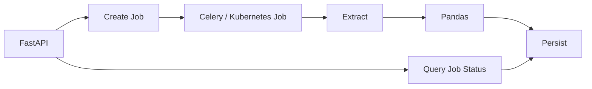

# 06- Large Dataset Processing

## Overview

Large dataset processing is where Pandas' in-memory execution model becomes a deliberate engineering constraint rather than an incidental implementation detail.

A dataset does not need to be enormous by industry standards to become operationally large for a single Python process. Memory pressure can appear because of:

```text
wide DataFrames
large string columns
object dtype
joins
groupby operations
sorting
temporary arrays
multiple copies
serialization
high concurrency
```

The objective is not to make Pandas process unlimited data. The objective is to determine:

```text
what fits safely on one machine
how much work should happen in the source system
how the working set can be bounded
when a different processing engine is required
```

A production large-data workflow commonly follows:

```text
source
    ↓
reduce rows and columns
    ↓
partition / chunk
    ↓
Pandas processing
    ↓
incremental aggregation / persistence
    ↓
validation
    ↓
analytics storage
```

---

## What Makes a Dataset Large

"Large" is relative to the execution environment.

A dataset becomes operationally large when one or more of these constraints become problematic:

| Constraint | Typical Risk |
|---|---|
| RAM | DataFrame or intermediate results exceed memory |
| CPU | Transformation exceeds the job SLA |
| I/O | Reading or writing dominates execution time |
| Network | Data transfer becomes the bottleneck |
| Database | Source query becomes too expensive |
| Storage | Intermediate/output data becomes difficult to manage |
| Concurrency | Multiple workers multiply resource usage |

A useful engineering question is:

> What is the peak working set of the complete operation?

Not:

> How large is the source file on disk?

---

## The In-Memory Problem

Suppose:

```text
CSV file = 5 GB
```

After parsing, the DataFrame may require substantially more memory:

```text
CSV text
    ↓
parsed values
    ↓
Pandas representations
    ↓
temporary arrays
    ↓
join/groupby/sort intermediates
```

A pipeline can therefore fail even when:

```text
available RAM > source file size
```

For example:

```text
source data              20 GB
materialized DataFrame   30 GB
temporary allocations    10 GB
join output              15 GB
```

The resulting peak may be much greater than the source size.

---

## Peak Memory

Peak memory is more important than final result size.

Consider:

```python
result = orders.merge(
    customers,
    on="customer_id",
)
```

During execution, the process may contain:

```text
orders
customers
join state
temporary arrays
result
```

A final result of:

```text
8 GB
```

does not imply the operation requires only 8 GB of RAM.

For large-data engineering, optimize the:

```text
peak working set
```

rather than only the:

```text
final DataFrame
```

---

## Measuring the Workload

Start with elapsed time:

```python
from time import perf_counter


started = perf_counter()

result = transform(orders)

elapsed = perf_counter() - started

print(
    f"elapsed_seconds={elapsed:.3f}"
)
```

Measure DataFrame memory:

```python
memory_bytes = (
    orders
    .memory_usage(
        index=True,
        deep=True,
    )
    .sum()
)

print(
    f"dataframe_memory_mb="
    f"{memory_bytes / 1024**2:.2f}"
)
```

Measure process RSS:

```python
import os

import psutil


process = psutil.Process(os.getpid())

rss_bytes = process.memory_info().rss

print(
    f"rss_mb={rss_bytes / 1024**2:.2f}"
)
```

These measurements answer different questions:

| Measurement | Meaning |
|---|---|
| `perf_counter()` | Wall-clock duration |
| `memory_usage(deep=True)` | DataFrame-level memory estimate |
| RSS | Resident memory of the Python process |
| CPU metrics | Processor consumption |
| Storage metrics | Read/write cost |

---

## Performance Model

A large-data pipeline can be viewed as:

```text
source I/O
    ↓
parsing
    ↓
memory allocation
    ↓
transformation
    ↓
intermediate allocation
    ↓
aggregation / join
    ↓
serialization
    ↓
destination I/O
```

Optimize the dominant stage.

Examples:

```text
slow PostgreSQL query
→ optimize SQL

slow CSV parsing
→ reduce columns / change format

high Python CPU
→ vectorize

high peak memory
→ reduce working set / chunk

large join
→ push down / partition / use another engine
```

Do not optimize an operation merely because it looks expensive in source code.

---

## First Optimization: Reduce the Input

Before changing algorithms, reduce:

```text
rows
columns
data types
```

Example:

```python
orders = pd.read_parquet(
    "orders.parquet",
    columns=[
        "customer_id",
        "amount",
        "status",
    ],
    filters=[
        ("status", "=", "completed"),
    ],
)
```

The most valuable optimization is often:

```text
do less work
```

rather than:

```text
do the same work faster
```

---

## Push Work to the Source

If the source is PostgreSQL, use SQL to reduce the input:

```sql
SELECT
    customer_id,
    amount,
    created_at
FROM orders
WHERE status = 'completed'
  AND created_at >= %(start_time)s
  AND created_at < %(end_time)s;
```

Instead of:

```sql
SELECT *
FROM orders;
```

followed by:

```python
orders = orders.loc[
    orders["status"].eq("completed")
]
```

Source-side reduction lowers:

```text
database output
network transfer
Pandas memory
Pandas CPU
```

The same principle applies to:

```text
REST APIs
Kafka
CSV/object storage
database exports
```

---

## Column Projection

Wide datasets are particularly expensive.

Suppose an event dataset contains:

```text
50 columns
```

but the transformation needs:

```text
5 columns
```

Read only those columns:

```python
events = pd.read_parquet(
    "events.parquet",
    columns=[
        "event_id",
        "customer_id",
        "event_type",
        "event_time",
        "value",
    ],
)
```

For SQL:

```sql
SELECT
    event_id,
    customer_id,
    event_type,
    event_time,
    value
FROM events;
```

Projection should happen as early as possible.

---

## Efficient Dtypes

Dtype choice directly affects memory and execution behavior.

Example:

```python
orders = orders.astype(
    {
        "order_id": "string",
        "customer_id": "string",
        "quantity": "Int64",
        "is_refunded": "boolean",
    }
)
```

Use:

```text
category
```

for suitable low-cardinality repeated dimensions.

Consider numeric downcasting only after confirming that the value range is safe.

Do not convert identifiers to integers merely because they contain digits.

---

## Object and String Columns

Generic object/string-heavy columns can consume substantial memory.

Inspect column-level usage:

```python
memory = (
    orders
    .memory_usage(
        deep=True,
    )
    .sort_values(
        ascending=False,
    )
)

print(memory)
```

Common memory-heavy columns include:

```text
raw JSON
large text
duplicated labels
request payloads
free-form descriptions
embedded metadata
```

Possible solutions include:

```text
column projection
string dtype
category
normalization
separating raw payloads from analytical columns
```

---

## Vectorization

Large datasets amplify Python interpreter overhead.

Prefer:

```python
orders["net_amount"] = (
    orders["amount"]
    - orders["discount"]
)
```

over row-wise Python execution.

For conditional logic:

```python
import numpy as np


orders["priority"] = np.select(
    [
        orders["amount"].ge(5_000),
        orders["amount"].ge(1_000),
    ],
    [
        "high",
        "medium",
    ],
    default="normal",
)
```

A small per-row cost becomes significant at hundreds of millions of rows.

---

## Avoiding `apply(axis=1)`

This:

```python
orders["total"] = orders.apply(
    lambda row: (
        row["quantity"]
        * row["unit_price"]
    ),
    axis=1,
)
```

executes Python-level logic once per row.

Prefer:

```python
orders["total"] = (
    orders["quantity"]
    * orders["unit_price"]
)
```

Use `apply()` when the business logic genuinely requires a Python callable and there is no practical native alternative.

---

## Efficient Filtering

Filter before expensive operations:

```python
completed = orders.loc[
    orders["status"].eq("completed"),
    [
        "customer_id",
        "amount",
    ],
]
```

Then perform:

```text
join
groupby
sort
string parsing
complex transformations
```

on the smaller dataset.

Early selectivity compounds across downstream stages.

---

## Efficient Groupby

For large datasets:

```python
summary = (
    orders
    .groupby(
        "customer_id",
        sort=False,
    )
    .agg(
        revenue=("amount", "sum"),
        order_count=("order_id", "count"),
    )
    .reset_index()
)
```

Important factors include:

```text
number of rows
number of groups
key cardinality
key dtype
sort requirements
aggregation complexity
```

High-cardinality groupings may require substantial temporary memory.

---

## Partial Aggregation

Some operations can be performed incrementally.

For example:

```python
partials = []

for chunk in pd.read_csv(
    "orders.csv",
    chunksize=100_000,
):
    partial = (
        chunk
        .groupby(
            "customer_id",
        )["amount"]
        .sum()
    )

    partials.append(partial)

customer_totals = (
    pd.concat(partials)
    .groupby(level=0)
    .sum()
)
```

This works because:

```text
sum(part 1)
+
sum(part 2)
+
...
```

is equivalent to:

```text
sum(all data)
```

For very high group cardinality, the partial-results structure can itself become too large. Then consider database-side aggregation, partitioned processing, or another engine.

---

## Global Operations

Some computations require global knowledge.

Examples:

```text
exact median
exact percentile
global sorting
global ranking
cross-chunk duplicate detection
large many-to-many joins
```

For example:

```text
average(chunk medians)
```

does not generally equal:

```text
global median
```

Large-data algorithms must preserve the mathematical meaning of the original operation.

---

## Chunk Processing

When the input cannot safely fit into memory, process it in bounded chunks.

```python
for chunk in pd.read_csv(
    "orders.csv",
    chunksize=100_000,
):
    process(chunk)
```

A production chunk flow is:

```text
read chunk
    ↓
validate
    ↓
transform
    ↓
aggregate / persist
    ↓
release
    ↓
next chunk
```

Do not accumulate all chunks unless the total output is known to fit comfortably within the memory budget.

---

## Choosing Chunk Size

`chunksize` represents a number of rows, not a memory limit.

This:

```python
chunksize=100_000
```

does not mean:

```text
100 MB
```

The actual memory depends on:

```text
column count
row width
string lengths
dtype
temporary allocations
transformation behavior
```

Benchmark several sizes while measuring:

```text
throughput
peak RSS
CPU
I/O
retry cost
```

---

## Bounded Accumulation

This pattern may defeat chunking:

```python
results = []

for chunk in chunks:
    results.append(
        process(chunk)
    )

result = pd.concat(results)
```

It is acceptable only when the combined output remains safely within the memory budget.

For genuinely large outputs, prefer:

```text
incremental database writes
partitioned Parquet
partial aggregation
external storage
```

---

## Database Extraction in Chunks

Large SQL result sets can also be processed incrementally:

```python
for chunk in pd.read_sql_query(
    query,
    connection,
    params=params,
    chunksize=100_000,
):
    result = transform(chunk)
    persist(result)
```

This limits Pandas-side materialization.

However:

> Chunked fetching does not automatically make the database query efficient.

The database may still perform an expensive scan, join, sort, or aggregation.

---

## Keyset-Based Database Batching

For high-volume incremental extraction, deterministic keyset pagination is often preferable to large `OFFSET` values.

Example:

```sql
SELECT
    order_id,
    customer_id,
    amount,
    updated_at
FROM orders
WHERE (
    updated_at > %(last_updated_at)s
    OR (
        updated_at = %(last_updated_at)s
        AND order_id > %(last_order_id)s
    )
)
ORDER BY
    updated_at,
    order_id
LIMIT %(batch_size)s;
```

Track:

```text
last_updated_at
last_order_id
```

as the checkpoint.

---

## Partitioned Processing

Large data can be partitioned by stable dimensions such as:

```text
event_date
region
tenant
```

Example:

```text
orders/
    event_date=2026-09-08/
    event_date=2026-09-09/
    event_date=2026-09-10/
```

Then:

```text
partition
    ↓
Pandas
    ↓
output
    ↓
next partition
```

This provides:

```text
bounded working sets
failure isolation
parallelism
incremental processing
```

Partitioning should match the access pattern and storage engine.

---

## Parquet for Large Data

Parquet is a strong storage format for large analytical workloads.

It provides:

```text
columnar storage
compression
schema metadata
column projection
predicate filtering
row-group statistics
```

Example:

```python
orders.to_parquet(
    "orders.parquet",
    engine="pyarrow",
    compression="zstd",
    index=False,
)
```

Parquet can reduce I/O significantly, but it does not eliminate Pandas' in-memory execution model.

---

## Partitioned Parquet

For historical datasets:

```text
orders/
    event_date=2026-09-08/
        part-0001.parquet
    event_date=2026-09-09/
        part-0001.parquet
    event_date=2026-09-10/
        part-0001.parquet
```

This allows readers to avoid unrelated date partitions.

Avoid partitioning by:

```text
request_id
transaction_id
UUID
```

unless there is a compelling workload-specific reason.

---

## Small Files Problem

Do not make every application micro-batch a permanent file.

For example:

```text
one Kafka poll
→ one Parquet file

one Celery task
→ one Parquet file
```

at very high throughput can create:

```text
millions of tiny files
```

This increases:

```text
metadata overhead
S3 API requests
query-planning time
file-open overhead
```

Use controlled output sizes and compaction when appropriate.

---

## External Storage as a Memory Boundary

A large pipeline can use Parquet or object storage as an intermediate boundary:

```text
Pandas
    ↓
Parquet
    ↓
Pandas
```

instead of:

```text
Pandas
    ↓
very large in-memory object
    ↓
Pandas
```

This is useful for:

```text
long-running ETL
reprocessing
backfills
cross-worker handoff
checkpointed stages
```

---

## Incremental Processing

Incremental processing handles only new or changed data.

Typical controls include:

```text
updated_at
created_at
sequence ID
Kafka offset
API cursor
change version
```

The workflow is:

```text
watermark
    ↓
extract changes
    ↓
process
    ↓
persist
    ↓
checkpoint
```

Checkpoint advancement should occur only after successful downstream persistence.

---

## Late-Arriving Data

A strict watermark can miss delayed records.

Example:

```text
event_time = 2026-09-09 23:58
arrival    = 2026-09-10 02:15
```

Common strategies include:

```text
lookback windows
reprocessing windows
partition replacement
deduplication
correction records
```

Do not assume event time and arrival time are identical.

---

## Deduplication at Scale

Global deduplication can require large state.

A Python set:

```python
seen_ids = set()

for chunk in chunks:
    duplicate_mask = chunk[
        "order_id"
    ].isin(seen_ids)

    seen_ids.update(
        chunk["order_id"].dropna()
    )
```

can itself become a memory bottleneck.

For very large keyspaces, consider:

```text
database uniqueness constraints
external state
partitioning
sorting
distributed processing
```

---

## Stateful Chunk Processing

Some computations require state between batches.

Example:

```python
running_total = 0.0

for chunk in pd.read_csv(
    "transactions.csv",
    chunksize=100_000,
):
    chunk["running_total"] = (
        running_total
        + chunk["amount"].cumsum()
    )

    if not chunk.empty:
        running_total = (
            chunk["running_total"].iloc[-1]
        )

    persist(chunk)
```

This requires:

```text
deterministic input ordering
correct state transition
reliable checkpointing
```

A worker restart should be able to recover the required state.

---

## Parallel Processing

Independent partitions can be processed concurrently:

```text
partition 1 → worker A
partition 2 → worker B
partition 3 → worker C
```

But concurrency multiplies resource requirements.

If each worker peaks at:

```text
2 GB
```

then:

```text
4 workers × 2 GB = 8 GB
```

before considering:

```text
Python runtime
system overhead
network buffers
temporary allocations
```

Parallelism must fit the complete memory budget.

---

## CPU vs I/O

Large-data workloads can be:

```text
CPU-bound
I/O-bound
memory-bound
database-bound
network-bound
```

Examples:

```text
regex transformation
→ CPU-heavy

S3 download
→ network/I/O-heavy

huge string DataFrame
→ memory-heavy

large PostgreSQL join
→ database-heavy
```

Choose concurrency and architecture based on the actual bottleneck.

---

## Multiprocessing and Threads

For CPU-heavy Python work, multiple processes may provide more useful parallelism than threads because Python bytecode execution is affected by the GIL.

For I/O-heavy work, concurrency through:

```text
threads
async I/O
batching
```

may be more appropriate.

Pandas operations frequently call native code, so the actual behavior depends on the specific workload.

Benchmark instead of relying on generic concurrency rules.

---

## Celery Architecture

A large ETL workflow can partition work into tasks:

```text
scheduler
    ↓
discover partitions
    ↓
Celery tasks
    ↓
Pandas
    ↓
Parquet / PostgreSQL
```

Pass lightweight arguments:

```text
partition
batch ID
date range
S3 path
source cursor
```

Do not serialize multi-gigabyte DataFrames through the Celery broker.

---

## Kubernetes Jobs

Large ETL processing can run as Kubernetes Jobs:

```text
Job
 ↓
bounded input
 ↓
Pandas
 ↓
persist
 ↓
exit
```

Memory limits should be based on measured peak RSS.

Do not size chunk size to consume the entire container limit.

Reserve headroom for:

```text
Python
libraries
temporary allocations
serialization
network buffers
```

---

## FastAPI and Large Data

Avoid executing large DataFrame jobs directly inside synchronous API requests.

Bad:

```text
POST /generate-report
    ↓
500 MB query
    ↓
Pandas transformation
    ↓
database write
    ↓
HTTP response
```

Prefer:



This separates user-facing latency from batch processing.

---

## Data Quality at Scale

Validate every processing unit.

Typical checks include:

```text
required columns
dtypes
null rate
duplicate rate
allowed values
numeric ranges
timestamp validity
referential integrity
```

Example:

```python
if chunk["amount"].lt(0).any():
    raise ValueError(
        "Negative amounts detected"
    )
```

Track:

```text
invalid rows
invalid rate
quarantined rows
```

rather than silently discarding malformed data.

---

## Batch Failure Isolation

A useful processing state is:

```text
batch 1 → success
batch 2 → success
batch 3 → failure
batch 4 → pending
```

Only batch 3 should require recovery.

This depends on:

```text
batch identity
idempotent persistence
checkpoints
observability
```

Chunking by itself does not guarantee recoverability.

---

## Idempotent Writes

A processing unit should be safely replayable.

Possible mechanisms:

```text
business key
batch ID
staging table
partition replacement
upsert
deterministic output path
```

The desired property is:

```text
replaying the same batch
does not create incorrect duplicates
```

This is important for:

```text
worker crashes
Celery retries
Kubernetes restarts
network failures
backfills
```

---

## Checkpointing

Correct:

```text
read batch
→ transform
→ validate
→ persist
→ confirm success
→ checkpoint
```

Incorrect:

```text
read batch
→ checkpoint
→ transform
→ persist
```

The second design can permanently skip data if processing fails after checkpoint advancement.

---

## Observability

Track:

```text
rows processed
bytes processed
batch duration
rows/sec
peak RSS
DataFrame memory
invalid rows
group counts
join output rows
files written
database latency
retry count
```

Useful structured logging fields include:

```text
run_id
batch_id
partition
pipeline_version
source
destination
```

Avoid logging actual large or sensitive datasets.

---

## Capacity Planning

Estimate:

```text
per-worker peak memory
×
worker concurrency
+
application overhead
+
temporary allocations
```

For example:

```text
2 GB peak worker memory
×
4 workers
=
8 GB
```

A Kubernetes memory limit of exactly 8 GB would provide no safety margin.

Capacity planning should include:

```text
failure retries
parallel tasks
serializer buffers
database connections
network buffers
```

---

## Database Pressure

Large Pandas workloads can overload the source database even when Python itself is healthy.

For example:

```text
10 workers
×
large extraction query
```

can create:

```text
10 concurrent scans
```

against PostgreSQL.

Coordinate:

```text
worker concurrency
database connection pool
query schedules
read replicas
source query cost
```

The fastest possible ETL pipeline is not useful if it destabilizes the production database.

---

## Read Replicas

If the workload is primarily analytical extraction and the database architecture supports read replicas, a replica may isolate ETL reads from transactional workloads.

Conceptually:

```text
Application writes
        ↓
Primary PostgreSQL
        ↓
Replication
        ↓
Read Replica
        ↓
ETL / Pandas
```

Read replicas are not automatically suitable for every consistency requirement.

Understand:

```text
replication lag
data freshness
failover behavior
```

before using one for critical reporting.

---

## Cost Considerations

Large-data pipelines consume:

```text
CPU
RAM
database compute
network
storage
object-storage requests
worker runtime
```

Reducing rows and columns early can lower several cost categories simultaneously.

However, excessive parallelism may increase:

```text
database load
S3 requests
worker count
compute cost
```

Optimize total pipeline cost rather than maximizing one stage's throughput.

---

## Security Considerations

Large datasets frequently contain:

```text
PII
financial data
customer identifiers
authentication metadata
raw API payloads
```

Use:

```text
least-privilege IAM
database permissions
encryption
TLS
secret management
data minimization
bounded logging
```

Extract only the columns required for the workload.

Never log complete DataFrames:

```python
logger.info(
    "batch=%s",
    chunk,
)
```

Prefer metadata:

```python
logger.info(
    "batch_processed",
    extra={
        "batch_id": batch_id,
        "row_count": len(chunk),
    },
)
```

---

## Disaster Recovery

Large pipelines should be replayable at a bounded scope.

Retain where appropriate:

```text
raw inputs
batch identifiers
source checkpoints
pipeline version
configuration version
output locations
```

A good architecture allows recovery of:

```text
one batch
one partition
one date range
```

rather than forcing a complete historical rebuild.

---

## Backfills

Backfills are easier when processing is partition-aware.

Example:

```bash
python scripts/run_pipeline.py \
  --start 2026-01-01T00:00:00Z \
  --end 2026-02-01T00:00:00Z
```

The same transformation functions should ideally support:

```text
normal incremental runs
historical backfills
targeted reprocessing
```

Avoid duplicating business logic for each execution mode.

---

## Benchmarking Chunk Size

A benchmark should compare several chunk sizes:

```text
10,000
50,000
100,000
250,000
500,000
```

and record:

```text
throughput
peak RSS
CPU
I/O
database impact
retry granularity
```

Example:

```python
from time import perf_counter

import pandas as pd


def benchmark(
    chunk_size: int,
) -> None:
    started = perf_counter()
    rows = 0

    for chunk in pd.read_csv(
        "orders.csv",
        chunksize=chunk_size,
    ):
        process(chunk)
        rows += len(chunk)

    elapsed = (
        perf_counter() - started
    )

    print(
        f"chunk_size={chunk_size} "
        f"rows={rows} "
        f"seconds={elapsed:.3f}"
    )
```

Choose a size that provides sufficient throughput without consuming excessive memory.

---

## Benchmarking Full vs Incremental Processing

For representative workloads, compare:

```text
full extraction
vs
incremental extraction
```

Measure:

```text
rows transferred
database duration
network bytes
Pandas duration
peak RSS
destination writes
```

A design that is slower per batch may still be much cheaper overall if it avoids repeated full-table scans.

---

## When Pandas Is Still Appropriate

Pandas remains suitable when:

```text
working set fits safely on one machine
+
transformations are manageable
+
batch processing is acceptable
+
Python integration is valuable
```

This can include datasets from:

```text
hundreds of MB
multiple GB
tens of GB
```

depending on:

```text
row width
operation complexity
available RAM
concurrency
intermediate allocations
```

There is no universal maximum dataset size for Pandas.

---

## When to Stop Scaling Pandas

Reconsider the architecture when:

```text
memory cannot be bounded safely
global operations dominate
processing time exceeds SLAs
concurrency causes system contention
data cannot be partitioned effectively
state becomes difficult to manage
```

Potential alternatives include:

```text
PostgreSQL
DuckDB
Polars
Dask
Spark
warehouse engines
stream-processing systems
```

---

## Pandas vs Distributed Processing

| Requirement | Pandas | Distributed Engine |
|---|---|---|
| Single-node transformation | Strong | Possible but often unnecessary |
| Dataset fits safely in RAM | Strong | Often unnecessary |
| Multi-node execution | No | Strong |
| Very large global joins | Limited | Better fit |
| Large global sorting | Limited | Better fit |
| Complex local Python logic | Strong | Engine-dependent |
| High-throughput streaming | Weak | Stronger alternatives |
| Operational simplicity | Higher | Lower |

Distributed infrastructure should be introduced when the workload requires it, not merely because the dataset sounds large.

---

## DuckDB as a Local Alternative

DuckDB can be useful when the workload is analytical and SQL-based but larger or more scan-oriented than a comfortable Pandas workflow.

A common pattern is:

```text
Parquet
   ↓
DuckDB SQL
   ↓
reduced result
   ↓
Pandas
```

This allows large scans and aggregations to happen outside the Python DataFrame's in-memory model.

---

## Polars, Dask, and Spark

A practical decision model is:

```text
single-node + Pandas semantics
→ Pandas

single-node + larger analytical workload
→ DuckDB / Polars

distributed Python dataframe workflow
→ Dask

large distributed batch processing
→ Spark
```

The correct choice depends on:

```text
data size
latency
team expertise
deployment complexity
existing platform
```

---

## Architecture Decision Framework

```text
Can source-side filtering reduce the dataset?
        │
       yes
        ↓
Push filtering down

Can unused columns be removed?
        │
       yes
        ↓
Project columns

Does the complete working set fit safely?
        │
       yes
        ↓
Use Pandas directly

       no
        ↓
Can the operation be partitioned?
        │
       yes
        ↓
Chunk / partition

       no
        ↓
Does it require global state?
        │
       yes
        ↓
Use external state or another engine

Are both join sides too large?
        │
       yes
        ↓
Use database / distributed processing

Does single-node processing still violate SLA?
        │
       yes
        ↓
Scale out
```

---

## Production Checklist

```text
[ ] Dataset size and row width are understood
[ ] Peak process RSS has been measured
[ ] DataFrame memory has been inspected by column
[ ] Source-side filtering is applied where appropriate
[ ] Required columns are projected early
[ ] Database-side aggregation is used where appropriate
[ ] Database-side joins are used when they are the better execution path
[ ] Dtypes are explicit and memory-aware
[ ] Large object/string columns are reviewed
[ ] Vectorized operations are preferred
[ ] apply(axis=1) is justified or avoided
[ ] Group cardinality is understood
[ ] Join cardinality is explicit and validated
[ ] Chunk size is benchmarked
[ ] Chunks are not accumulated without a memory budget
[ ] Global operations have a correct strategy
[ ] Stateful processing has deterministic ordering
[ ] Incremental extraction uses a reliable watermark or cursor
[ ] Late-arriving records have a defined policy
[ ] Cross-chunk deduplication is addressed
[ ] Batch writes are idempotent
[ ] Checkpoints advance only after successful persistence
[ ] Batch identifiers are deterministic
[ ] Partitioning follows actual access patterns
[ ] Parquet is used where appropriate
[ ] Small-file growth is controlled
[ ] Database concurrency is bounded
[ ] Connection pool capacity is understood
[ ] Worker concurrency fits the memory budget
[ ] Kubernetes/container memory limits include headroom
[ ] Sensitive fields are minimized
[ ] Large or sensitive DataFrames are not logged
[ ] Batch-level metrics are available
[ ] Failure and retry behavior is tested
[ ] Backfills can reuse production transformation logic
[ ] Raw inputs or replayable state are retained where required
[ ] A scaling path exists beyond single-node Pandas
```

## Interview Perspective

### What Is the First Step When Processing a Large Pandas Dataset?

Measure the workload and reduce the amount of data entering Pandas. Projection, filtering, source-side aggregation, and dtype optimization often provide larger gains than micro-optimizing DataFrame expressions.

### Why Can a 5 GB File Require More Than 5 GB of RAM?

The file is a serialized representation. Parsing, DataFrame structures, string/object storage, indexes, and temporary intermediates can substantially increase memory consumption.

### How Do You Process Data Larger Than Available RAM?

Reduce the input, then use chunked or partitioned processing with incremental aggregation or persistence. If the computation requires global state that cannot be handled efficiently, use another execution strategy.

### Why Is Peak Memory More Important Than Final DataFrame Size?

Joins, groupbys, sorts, and transformations may keep the original inputs alive while allocating large intermediates. OOM failures occur at peak usage, not at the final result size.

### When Does Chunk Processing Work Well?

It works well when the computation can be performed independently per batch or when partial results can be combined correctly, such as filtering, normalization, additive aggregation, and many conversion tasks.

### Which Operations Are Difficult to Chunk?

Exact global medians, global sorting, ranking, cross-chunk deduplication, and certain large joins require global information or additional state.

### How Do You Choose Chunk Size?

Benchmark different sizes while measuring throughput and peak RSS. Larger chunks may improve throughput but require more memory and create larger retry units.

### Why Is Accumulating Chunks Often Wrong?

If every processed chunk is retained, the process eventually reconstructs a large in-memory result and defeats the purpose of bounded processing.

### How Do You Safely Process Large SQL Results?

Push filtering and projection into SQL, use chunked extraction when necessary, process incrementally, and design batch persistence and checkpointing for safe replay.

### Why Is Keyset Pagination Preferable to Large `OFFSET` Values?

Large offsets can require the database to traverse increasing amounts of earlier data. Keyset pagination continues from a deterministic ordering key and is typically better suited to high-volume incremental extraction.

### How Does Parallelism Affect Memory?

Per-worker peak memory is multiplied by concurrency. A worker using 2 GB at peak can require roughly 8 GB across four concurrent workers before application and infrastructure overhead.

### When Should You Use DuckDB, Polars, Dask, or Spark?

Use them when Pandas' single-node in-memory model becomes the limiting factor or when the workload characteristics better match analytical SQL, efficient single-node execution, distributed DataFrame processing, or distributed batch computation.

### Is Pandas Automatically the Wrong Tool for Tens of Gigabytes?

No. Dataset size alone is insufficient to make that decision. Row width, operation type, available RAM, partitioning, concurrency, and intermediate allocations determine whether a workload fits safely.

## Key Takeaways

- Large-dataset Pandas engineering starts by reducing data before it reaches the DataFrame: push filters and aggregations into source systems, project required columns, and use appropriate dtypes.
- Peak memory is the critical constraint because joins, groupbys, sorts, temporary arrays, and concurrent workers can make runtime memory far larger than either the source file or final result.
- Chunking and partitioning are effective when computations are decomposable, but global operations such as exact median, global sorting, and cross-chunk deduplication require additional state or a different execution strategy.
- Production pipelines need bounded batches, idempotent writes, checkpoint-after-success semantics, late-data handling, observability, failure isolation, security controls, and reproducible backfills.
- Pandas can handle substantial datasets with careful design, but once single-node memory, throughput, or global-processing requirements become limiting, move the workload to SQL, DuckDB, Polars, Dask, Spark, or another appropriate engine.