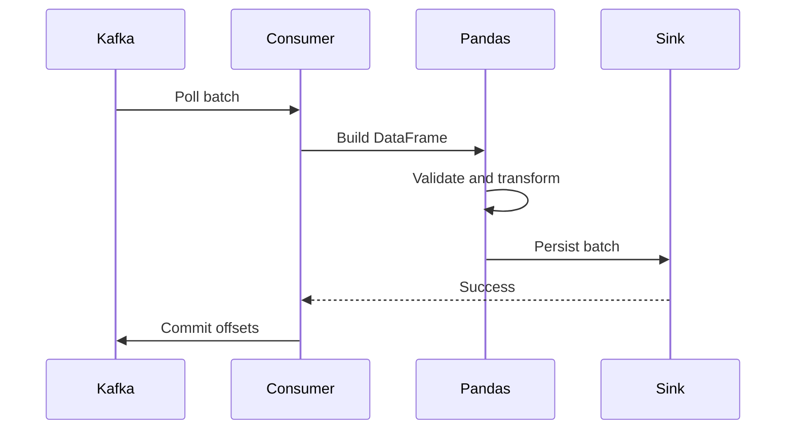

# 07- Chunk Processing

## Overview

Chunk processing allows Pandas to process datasets in bounded portions instead of materializing an entire source into memory at once.

This is important when:

```text
dataset size > comfortable process memory
```

or when bounded processing provides better:

```text
failure isolation
throughput control
retry behavior
incremental persistence
resource predictability
```

The core pattern is:

```text
source
    ↓
read bounded chunk
    ↓
validate
    ↓
transform
    ↓
aggregate / persist
    ↓
record metrics
    ↓
release chunk
    ↓
next chunk
```

Chunk processing is a memory and execution strategy, not a distributed-processing framework. When the computation requires large global state or exceeds single-node capabilities, another engine or architecture may be more appropriate.

---

## Why Chunk Processing Matters

Pandas is primarily an in-memory processing library.

A source file such as:

```text
CSV = 8 GB
```

can require considerably more memory after parsing:

```text
CSV
    ↓
DataFrame
    ↓
temporary arrays
    ↓
transformation intermediates
    ↓
join/groupby state
```

A full-data implementation can therefore exceed RAM even when the source file itself appears manageable.

Chunking changes the memory model:

```text
8 GB source

→ 100 MB chunk
→ process
→ persist
→ release

→ next 100 MB chunk
→ process
→ persist
→ release
```

The goal is to keep the active working set bounded.

---

## When to Use Chunk Processing

Chunk processing is appropriate when:

```text
the source is too large for safe full-memory processing
the operation can be decomposed into batches
the output can be persisted incrementally
partial aggregates can be combined
```

Typical use cases include:

```text
large CSV ingestion
database exports
historical backfills
API pagination
data migration
ETL
incremental aggregation
format conversion
batch validation
```

It is less suitable when the algorithm fundamentally requires the entire dataset in one operation.

---

## When Chunk Processing Is Not Enough

Some operations require global information:

```text
exact global median
exact global percentile
global sort
global ranking
cross-chunk duplicate detection
large many-to-many joins
global window operations
```

For these workloads, chunking may require:

```text
external state
multiple passes
partitioned algorithms
database processing
distributed execution
```

Do not force a chunked implementation if it changes the semantics of the calculation.

---

## Chunk Processing Architecture

A production pipeline can look like:


The important boundaries are:

```text
input
validation
transformation
persistence
checkpoint
```

Each boundary should have explicit failure behavior.

---

## Reading CSV in Chunks

Pandas supports chunked CSV reads through `chunksize`.

```python
import pandas as pd


for chunk in pd.read_csv(
    "orders.csv",
    chunksize=100_000,
):
    process(chunk)
```

Each iteration returns a `DataFrame`.

The chunk size is expressed in rows:

```text
100,000 rows
```

not:

```text
100 MB
```

Actual memory depends on the width and representation of those rows.

---

## Reading Only Required Columns

Combine chunking with projection:

```python
for chunk in pd.read_csv(
    "orders.csv",
    usecols=[
        "order_id",
        "customer_id",
        "status",
        "amount",
    ],
    chunksize=100_000,
):
    process(chunk)
```

This reduces:

```text
disk I/O
parser work
memory
downstream computation
```

Do not read 40 columns into memory when the transformation needs only four.

---

## Explicit Dtypes During Chunking

Explicit dtypes prevent batch-dependent inference.

```python
for chunk in pd.read_csv(
    "orders.csv",
    dtype={
        "order_id": "string",
        "customer_id": "string",
        "status": "string",
        "quantity": "Int64",
    },
    chunksize=100_000,
):
    process(chunk)
```

Without explicit typing, one chunk may infer:

```text
quantity → int64
```

while another may infer:

```text
quantity → float64
```

because it contains missing values.

A pipeline should maintain a stable schema independent of chunk boundaries.

---

## Normalizing Each Chunk

Normalize data as soon as it enters the pipeline.

```python
def normalize_orders(
    chunk: pd.DataFrame,
) -> pd.DataFrame:
    result = chunk.copy()

    result["amount"] = pd.to_numeric(
        result["amount"],
        errors="raise",
    )

    result["created_at"] = pd.to_datetime(
        result["created_at"],
        utc=True,
        errors="raise",
    )

    result["status"] = (
        result["status"]
        .str.strip()
        .str.lower()
    )

    return result
```

Then:

```python
for chunk in pd.read_csv(
    "orders.csv",
    chunksize=100_000,
):
    chunk = normalize_orders(chunk)
    process(chunk)
```

This establishes a consistent internal schema.

---

## Per-Chunk Validation

Validate required columns:

```python
def validate_chunk(
    chunk: pd.DataFrame,
) -> None:
    required = {
        "order_id",
        "customer_id",
        "amount",
        "status",
    }

    missing = required - set(
        chunk.columns,
    )

    if missing:
        raise ValueError(
            f"Missing columns: {sorted(missing)}"
        )
```

Then:

```python
for chunk in chunks:
    validate_chunk(chunk)
    process(chunk)
```

Fail early before irreversible output is produced.

---

## Business Validation

Example:

```python
if chunk["amount"].lt(0).any():
    raise ValueError(
        "Negative order amounts detected"
    )
```

Additional rules might include:

```text
quantity > 0
known status
valid currency
non-null business key
valid timestamp range
```

Invalid records can either:

```text
fail the batch
```

or:

```text
be quarantined
```

depending on the pipeline contract.

---

## Handling Invalid Records

When the pipeline supports record-level quarantine:

```python
valid_mask = (
    chunk["amount"].notna()
    & chunk["amount"].ge(0)
)

valid = chunk.loc[
    valid_mask
]

invalid = chunk.loc[
    ~valid_mask
]
```

Then:

```text
valid
  ↓
normal output

invalid
  ↓
quarantine
```

Track:

```text
invalid_count
invalid_rate
```

A sudden increase should be observable.

---

## Empty Chunks

Handle empty input safely:

```python
if chunk.empty:
    continue
```

The pipeline should still preserve expected schema semantics if downstream systems require schema-bearing empty results.

Do not assume:

```text
empty batch = failure
```

or:

```text
empty batch = success
```

without defining the expected business behavior.

---

## Chunk Size

There is no universally correct chunk size.

Larger chunks generally provide:

```text
fewer iterations
lower per-batch overhead
potentially higher throughput
```

but increase:

```text
peak memory
temporary allocation size
retry size
batch failure impact
```

Smaller chunks provide:

```text
lower peak memory
smaller retries
finer progress tracking
```

but increase:

```text
loop overhead
per-batch I/O
transaction overhead
```

Choose chunk size through measurement.

---

## Benchmarking Chunk Size

Benchmark representative values:

```text
10,000
50,000
100,000
250,000
500,000
```

Measure:

```text
rows/second
bytes/second
peak RSS
CPU
I/O
database impact
```

Example:

```python
from time import perf_counter

import pandas as pd


def benchmark(
    chunk_size: int,
) -> None:
    started = perf_counter()
    rows = 0

    for chunk in pd.read_csv(
        "orders.csv",
        chunksize=chunk_size,
    ):
        process(chunk)
        rows += len(chunk)

    elapsed = perf_counter() - started

    print(
        f"chunk_size={chunk_size} "
        f"rows={rows} "
        f"seconds={elapsed:.3f} "
        f"rows_per_second="
        f"{rows / elapsed:.1f}"
    )
```

Choose a size that leaves meaningful memory headroom.

---

## Chunk Size Is Not a Memory Limit

This assumption is incorrect:

```python
chunksize=100_000
```

therefore:

```text
100 MB memory
```

The actual memory depends on:

```text
column count
dtype
string length
index
temporary arrays
transformation behavior
```

A chunk with 100,000 rows of long JSON strings may require far more memory than one with 100,000 integer rows.

---

## Memory Monitoring

Measure DataFrame memory:

```python
memory_bytes = (
    chunk
    .memory_usage(
        index=True,
        deep=True,
    )
    .sum()
)
```

Measure process RSS:

```python
import os

import psutil


process = psutil.Process(os.getpid())

rss_bytes = process.memory_info().rss
```

The important distinction is:

```text
DataFrame memory
≠
total process memory
```

Use process RSS to understand the actual container or VM memory pressure.

---

## Avoid Accumulating Chunks

This can recreate the original memory problem:

```python
results = []

for chunk in chunks:
    results.append(
        process(chunk)
    )

result = pd.concat(results)
```

It is acceptable only when the combined result has a known bounded size.

For large outputs, prefer:

```text
incremental persistence
partial aggregation
partitioned output
```

---

## Incremental Aggregation

Chunking works well for decomposable metrics.

Example:

```python
partial_results = []

for chunk in pd.read_csv(
    "orders.csv",
    chunksize=100_000,
):
    partial = (
        chunk
        .groupby("customer_id")["amount"]
        .sum()
    )

    partial_results.append(partial)

customer_totals = (
    pd.concat(partial_results)
    .groupby(level=0)
    .sum()
)
```

The second aggregation combines partial customer totals.

---

## Why Some Aggregations Combine Correctly

For `sum`:

```text
sum(all rows)
=
sum(sum(chunk 1), sum(chunk 2), ...)
```

For a mean, maintain:

```text
sum
+
count
```

rather than averaging chunk means.

```python
total_sum = 0.0
total_count = 0

for chunk in chunks:
    values = chunk["amount"].dropna()

    total_sum += values.sum()
    total_count += values.count()

mean = (
    total_sum / total_count
    if total_count
    else float("nan")
)
```

The general question is:

> Can the partial result be combined without losing information required for the final answer?

---

## Global Median and Quantiles

Do not calculate:

```python
mean(chunk_medians)
```

or:

```text
median of chunk medians
```

and treat it as the exact global statistic.

The chunk medians do not contain enough information to reconstruct the exact global distribution.

Possible alternatives include:

```text
database computation
external sort
approximate algorithms
distributed analytics
multiple-pass algorithms
```

---

## Chunked SQL Reads

Large SQL result sets can be processed in batches:

```python
query = """
    SELECT
        order_id,
        customer_id,
        amount,
        created_at
    FROM orders
    WHERE created_at >= %(start_time)s
      AND created_at < %(end_time)s
"""

for chunk in pd.read_sql_query(
    query,
    connection,
    params={
        "start_time": start_time,
        "end_time": end_time,
    },
    chunksize=100_000,
):
    process(chunk)
```

This reduces Python-side materialization.

It does not automatically make the underlying SQL query efficient.

---

## SQL Pushdown Before Chunking

Chunking should not be an excuse to extract unnecessary data.

Prefer:

```sql
SELECT
    customer_id,
    amount
FROM orders
WHERE status = 'completed';
```

over:

```sql
SELECT *
FROM orders;
```

followed by Pandas filtering.

A strong large-data strategy is:

```text
source-side filtering
    ↓
source-side projection
    ↓
bounded extraction
    ↓
Pandas processing
```

---

## Incremental Database Extraction

For large relational datasets, use deterministic boundaries.

Example:

```sql
SELECT
    order_id,
    customer_id,
    amount,
    updated_at
FROM orders
WHERE (
    updated_at > %(last_updated_at)s
    OR (
        updated_at = %(last_updated_at)s
        AND order_id > %(last_order_id)s
    )
)
ORDER BY
    updated_at,
    order_id
LIMIT %(batch_size)s;
```

This provides a stable continuation point.

---

## Time-Window Processing

For scheduled processing, use half-open ranges:

```text
[start, end)
```

Example:

```python
chunk = events.loc[
    events["event_time"].ge(start),
    :
]

chunk = chunk.loc[
    chunk["event_time"].lt(end)
]
```

Then:

```text
2026-09-10 00:00 ≤ event_time < 2026-09-11 00:00
```

avoids overlap with the next window.

---

## Stateful Chunk Processing

Some computations require state from the previous chunk.

Example:

```python
running_total = 0.0

for chunk in pd.read_csv(
    "transactions.csv",
    chunksize=100_000,
):
    chunk["running_total"] = (
        running_total
        + chunk["amount"].cumsum()
    )

    if not chunk.empty:
        running_total = (
            chunk["running_total"].iloc[-1]
        )

    persist(chunk)
```

This only works correctly when:

```text
input ordering is deterministic
state transition is correct
restarts recover the required state
```

Stateful batch processing requires more careful checkpointing than stateless chunk processing.

---

## Cross-Chunk Duplicates

This detects duplicates only within one chunk:

```python
chunk[
    chunk["order_id"].duplicated()
]
```

It does not detect:

```text
duplicate in chunk 1
+
same ID in chunk 5
```

A global state approach might use:

```python
seen_ids = set()

for chunk in chunks:
    duplicate_mask = chunk[
        "order_id"
    ].isin(seen_ids)

    seen_ids.update(
        chunk["order_id"].dropna()
    )
```

But `seen_ids` may become a large memory structure.

For very large datasets, consider:

```text
database uniqueness
external state
partitioning
sorting
distributed processing
```

---

## Chunked Joins

Chunking can help when one side of a join is large and the other is a manageable reference dataset.

```python
customers = pd.read_parquet(
    "customers.parquet",
    columns=[
        "customer_id",
        "segment",
    ],
)

for chunk in pd.read_csv(
    "orders.csv",
    chunksize=100_000,
):
    enriched = chunk.merge(
        customers,
        on="customer_id",
        how="left",
        validate="many_to_one",
    )

    persist(enriched)
```

This bounds the large left-side input.

The reference table still needs to fit comfortably in memory.

---

## When a Chunked Join Is Not Enough

If both sides are large:

```text
orders = 200 GB
customers = 80 GB
```

loading the full reference dataset into every worker is usually not practical.

Consider:

```text
database-side join
partitioned join
key-based partitioning
DuckDB
Dask
Spark
other analytical engines
```

Do not confuse chunking with distributed join execution.

---

## Incremental Persistence

A chunk should ideally move through:

```text
read
→ transform
→ validate
→ persist
```

without waiting for the entire source to finish.

For example:

```python
for batch_id, chunk in enumerate(
    pd.read_csv(
        "orders.csv",
        chunksize=100_000,
    )
):
    result = transform(chunk)

    persist_batch(
        result,
        batch_id=batch_id,
    )
```

This provides:

```text
bounded memory
progress visibility
smaller retry units
partial recovery
```

---

## Idempotent Batch Writes

A failed batch should be safely replayable.

Use:

```text
batch ID
business key
deterministic output path
upsert
partition replacement
staging table
```

Desired property:

```text
retry batch N
→ same logical result
→ no incorrect duplicate
```

This matters for:

```text
Celery retries
Kubernetes restarts
network failures
worker crashes
backfills
```

---

## Checkpointing

Correct order:

```text
read batch
→ transform
→ validate
→ persist
→ confirm success
→ checkpoint
```

Incorrect:

```text
read batch
→ checkpoint
→ transform
→ persist
```

The incorrect sequence can cause permanent data loss after a worker failure.

---

## Batch Failure Isolation

A well-designed pipeline should allow:

```text
batch 1 → success
batch 2 → success
batch 3 → failure
batch 4 → pending
```

to recover by replaying:

```text
batch 3
```

instead of restarting the entire dataset.

This is one of the strongest operational benefits of chunk-oriented processing.

---

## API Pagination

REST APIs naturally expose bounded pages or cursors.

A production flow is:

```text
API page
    ↓
DataFrame
    ↓
validate
    ↓
transform
    ↓
persist
    ↓
next cursor
```

Example:

```python
while True:
    response = fetch_orders(
        cursor=cursor,
        limit=1_000,
    )

    chunk = pd.DataFrame(
        response["items"]
    )

    if not chunk.empty:
        process(chunk)

    cursor = response.get(
        "next_cursor"
    )

    if cursor is None:
        break
```

Do not accumulate all API pages into one DataFrame when the source can be processed incrementally.

---

## Kafka Batch Processing

Kafka consumers already work with bounded batches.

A common flow is:



Offset commits should follow successful downstream handling according to the desired delivery semantics.

Pandas should process the batch, not act as the stream broker or offset manager.

---

## Celery

A Celery workload can process bounded partitions:

```text
partition 1 → task 1
partition 2 → task 2
partition 3 → task 3
```

Pass:

```text
S3 key
batch ID
partition
date range
cursor
```

rather than a massive DataFrame through the broker.

This keeps broker payloads small and task retry behavior manageable.

---

## Kubernetes

Chunked jobs can run as Kubernetes Jobs or CronJobs.

Resource planning must account for:

```text
chunk memory
temporary allocations
Python runtime
serialization
network buffers
worker concurrency
```

A container configured for:

```text
4 GiB memory
```

should not run a chunk expected to consume:

```text
3.9 GiB
```

at peak.

Leave safety headroom.

---

## Parallel Chunk Processing

Parallelism can improve throughput when chunks are genuinely independent.

Example:

```text
partition 1 → worker A
partition 2 → worker B
partition 3 → worker C
```

But memory multiplies.

If:

```text
worker peak = 2 GB
```

then:

```text
4 workers × 2 GB = 8 GB
```

before:

```text
application overhead
system memory
network buffers
```

Concurrency should be sized against both:

```text
memory
+
downstream capacity
```

---

## CPU and I/O Bound Workloads

Identify the dominant resource.

| Workload | Likely Bottleneck |
|---|---|
| Large regex transformations | CPU |
| S3 download | Network / I/O |
| PostgreSQL scan | Database |
| Huge string columns | Memory |
| Parquet serialization | CPU / I/O |
| Bulk database insert | Database / network |

For CPU-heavy operations, process-based parallelism may be useful. For I/O-heavy workloads, controlled concurrency can be more effective.

The correct strategy should be benchmarked.

---

## Memory-Aware Transformations

Even within a chunk, transformations can create temporary allocations.

For example:

```python
chunk["total"] = (
    chunk["quantity"]
    * chunk["unit_price"]
)
```

is generally preferable to creating several unnecessary intermediate DataFrames.

Filter and project early:

```python
chunk = chunk.loc[
    chunk["status"].eq("completed"),
    [
        "customer_id",
        "quantity",
        "unit_price",
    ],
]
```

Then transform the smaller working set.

---

## Avoiding Unnecessary Copies

This:

```python
filtered = chunk.loc[
    chunk["status"].eq("completed")
].copy()
```

is appropriate when an independently mutable result is required.

But avoid:

```python
a = chunk.copy()
b = a.copy()
c = b.copy()
```

without an ownership requirement.

Repeated copies can turn a memory-efficient chunked pipeline into a memory-heavy one.

---

## Parquet as a Chunk Boundary

Parquet works well as a durable boundary between processing stages.

Example:

```text
source
    ↓
chunk
    ↓
transform
    ↓
Parquet batch
    ↓
next stage
```

A partitioned layout might be:

```text
orders/
    event_date=2026-09-10/
        batch-0001.parquet
        batch-0002.parquet
```

This supports:

```text
bounded processing
replay
parallel reads
incremental data publishing
```

Control output file counts to avoid a small-files problem.

---

## Large Dataset Workflow

A production workflow can combine all of these techniques:


The design principle is:

```text
reduce
→ bound
→ process
→ persist
→ checkpoint
```

---

## Observability

Track metrics for every batch:

```text
batch ID
input rows
output rows
invalid rows
duration
rows/second
input bytes
output bytes
peak RSS
```

Useful logs:

```python
logger.info(
    "batch_processed",
    extra={
        "batch_id": batch_id,
        "input_rows": len(chunk),
        "output_rows": len(result),
        "duration_seconds": elapsed,
    },
)
```

Avoid logging actual DataFrame contents.

---

## Data Quality Metrics

Track:

```text
null rate
duplicate rate
invalid row rate
unknown category rate
join miss rate
row count
```

A useful operational metric is:

```text
invalid rows / input rows
```

If that rate changes suddenly, the source may have changed.

---

## Performance Metrics

Track:

```text
rows/sec
MB/sec
CPU utilization
peak RSS
database latency
S3 latency
output file size
retry count
```

Do not optimize only for rows/sec.

A faster pipeline that consumes unsafe amounts of memory or overloads PostgreSQL is not an improvement.

---

## Reliability

A production chunk processor should define:

```text
batch identity
failure boundary
retry behavior
checkpoint semantics
duplicate handling
late-data strategy
output publication
```

A useful state model is:

```text
PENDING
   ↓
PROCESSING
   ↓
SUCCEEDED

PROCESSING
   ↓
FAILED
   ↓
RETRYING
   ↓
PROCESSING
```

The exact implementation may live in:

```text
database
Redis
orchestrator
object-store metadata
```

depending on the system.

---

## Security Considerations

Chunking does not change data-security requirements.

Sensitive data should still be:

```text
minimized
encrypted
access-controlled
excluded from logs
```

For example, read only:

```sql
SELECT
    customer_id,
    segment
FROM customers;
```

instead of extracting unnecessary PII.

Use least-privilege credentials for:

```text
database access
S3 access
Kafka access
```

according to the workload.

---

## Cost Considerations

Chunking can reduce:

```text
worker memory requirements
```

but may increase:

```text
number of I/O operations
```

Partitioning can reduce scans but increase:

```text
file count
metadata operations
```

Parallelism can reduce wall-clock time but increase:

```text
compute
database load
network traffic
```

Optimize the total system cost.

---

## Disaster Recovery

A chunk-oriented pipeline is easier to recover when intermediate results are durable.

Retain where appropriate:

```text
raw inputs
batch IDs
checkpoints
pipeline version
configuration version
output locations
```

Recovery should ideally operate at the smallest useful boundary:

```text
batch
partition
date range
```

rather than requiring a complete rebuild.

---

## Backfills

Backfills should use the same transformation code as normal processing where possible.

For example:

```bash
python scripts/run_pipeline.py \
  --start 2026-01-01T00:00:00Z \
  --end 2026-02-01T00:00:00Z
```

The execution range changes:

```text
what is processed
```

not:

```text
how the business transformation works
```

This reduces divergence between production and historical processing.

---

## Testing Chunked Processing

Test:

```text
empty input
single row
exact chunk size
chunk size + 1
multiple chunks
final partial chunk
invalid records
duplicate records
missing values
dtype consistency
cross-chunk state
failure and retry
```

The most valuable test is often:

```text
chunked result
=
expected full-data result
```

for operations where chunk decomposition is mathematically valid.

---

## Testing Chunk Equivalence

Example:

```python
expected = (
    orders
    .groupby("customer_id")["amount"]
    .sum()
    .sort_index()
)

partials = []

for chunk in [
    orders.iloc[:2],
    orders.iloc[2:],
]:
    partials.append(
        chunk
        .groupby("customer_id")["amount"]
        .sum()
    )

actual = (
    pd.concat(partials)
    .groupby(level=0)
    .sum()
    .sort_index()
)

pd.testing.assert_series_equal(
    actual,
    expected,
)
```

This validates the mathematical property of the chunked implementation.

---

## Common Mistakes

### Loading the Entire Dataset First

```python
df = pd.read_csv("large.csv")
```

before deciding to chunk defeats the purpose.

### Using an Arbitrary Chunk Size

A value such as:

```python
chunksize=100_000
```

should be benchmarked against actual row width and memory.

### Accumulating Every Chunk

This recreates the memory problem.

### Assuming Chunking Makes Global Operations Safe

It does not. Global median, sorting, ranking, and deduplication require special handling.

### Ignoring Cross-Chunk Duplicates

`duplicated()` within a chunk cannot detect duplicates in another chunk.

### Advancing the Checkpoint Too Early

Checkpoint only after durable persistence.

### Parallelizing Without a Memory Budget

Worker concurrency multiplies peak memory.

### Passing DataFrames Through Celery

Large broker payloads create unnecessary serialization and infrastructure pressure.

### Running Large Chunk Processing Inside FastAPI

Long-running processing can exhaust web workers and violate request latency budgets.

### Ignoring Source-System Load

Many concurrent chunk readers can overload PostgreSQL or an API.

### Treating `chunksize` as a Byte Limit

Rows have different memory footprints.

### Creating Millions of Output Files

Application batch size and storage file size are different design concerns.

---

## Decision Framework

Use this sequence when deciding whether and how to chunk:

```text
Can the source reduce rows?
        │
       yes
        ↓
Push filtering upstream

Can the source reduce columns?
        │
       yes
        ↓
Project columns

Does the full dataset fit safely?
        │
       yes
        ↓
Process directly

       no
        ↓
Can the computation be partitioned?
        │
       yes
        ↓
Chunk / partition

       no
        ↓
Does it require global state?
        │
       yes
        ↓
Use external state or another engine

Are both sides of a join too large?
        │
       yes
        ↓
Database / distributed join

Does the workload still violate SLA?
        │
       yes
        ↓
Scale the processing architecture
```

---

## Pandas vs Other Processing Strategies

| Strategy | Best Fit | Main Limitation |
|---|---|---|
| Pandas in-memory | Moderate single-node datasets | Memory-bound |
| Pandas chunks | Large decomposable workloads | Global operations require care |
| PostgreSQL | Relational filtering/join/aggregation | Not ideal for arbitrary Python transformations |
| DuckDB | Large local analytical workloads | Single-node scope |
| Polars | High-performance DataFrame processing | Different execution model/API |
| Dask | Distributed Python data processing | More operational complexity |
| Spark | Large distributed batch processing | Higher infrastructure complexity |
| Kafka stream processing | Continuous event workloads | Different programming model |

Choose the simplest system that reliably satisfies the workload.

---

## Practical Production Pattern

```python
from collections.abc import Iterator

import pandas as pd


def process_orders(
    chunks: Iterator[pd.DataFrame],
) -> None:
    for batch_id, chunk in enumerate(chunks):
        if chunk.empty:
            continue

        validate_chunk(chunk)

        chunk = chunk.loc[
            :,
            [
                "order_id",
                "customer_id",
                "amount",
                "status",
            ],
        ].copy()

        chunk["amount"] = pd.to_numeric(
            chunk["amount"],
            errors="raise",
        )

        completed = chunk.loc[
            chunk["status"].eq("completed")
        ]

        if completed.empty:
            continue

        result = (
            completed
            .groupby(
                "customer_id",
                as_index=False,
            )
            .agg(
                revenue=("amount", "sum"),
                order_count=(
                    "order_id",
                    "count",
                ),
            )
        )

        persist_batch(
            result,
            batch_id=batch_id,
        )
```

The implementation demonstrates:

```text
bounded input
schema validation
projection
explicit typing
early filtering
vectorized processing
incremental aggregation
incremental persistence
```

---

## Production Checklist

```text
[ ] Dataset size and row width are understood
[ ] Peak process memory has been measured
[ ] Source-side filtering is applied where appropriate
[ ] Required columns are projected early
[ ] Dtypes are explicit and stable across chunks
[ ] Schema is validated per batch
[ ] Missing-value semantics are defined
[ ] Invalid records have an explicit policy
[ ] Duplicate handling is deterministic
[ ] Cross-chunk duplicates are addressed
[ ] Chunk size is benchmarked
[ ] Chunks are not accumulated without a memory budget
[ ] Global operations have a correct strategy
[ ] Stateful operations have deterministic ordering
[ ] SQL extraction uses bounded batches where needed
[ ] Database query cost is measured separately from Pandas processing
[ ] API pagination uses stable cursors where appropriate
[ ] Batch writes are idempotent
[ ] Checkpoints advance only after successful persistence
[ ] Late-arriving records have a defined strategy
[ ] Output files are reasonably sized
[ ] Small-file growth is controlled
[ ] Parallelism is bounded by memory and downstream capacity
[ ] Database connection capacity is respected
[ ] Celery task payloads remain small
[ ] Kubernetes memory limits include headroom
[ ] Sensitive data is minimized and excluded from logs
[ ] Per-batch metrics are recorded
[ ] Retry behavior is tested
[ ] Backfills can reuse production transformation logic
[ ] Recovery can target individual batches or partitions
[ ] A scaling path exists beyond Pandas when required
```

## Interview Perspective

### What Problem Does Chunk Processing Solve?

It bounds the amount of source data materialized and processed at one time, allowing suitable workloads to operate within a controlled memory budget.

### Does Chunking Make Pandas Distributed?

No. Chunking is bounded local processing. It does not automatically provide distributed execution, fault tolerance, or cross-node coordination.

### How Do You Choose a Chunk Size?

Benchmark different sizes against:

```text
throughput
peak RSS
CPU
I/O
database load
```

while leaving enough memory for the rest of the process.

### Why Is `chunksize` Not a Memory Limit?

It specifies row count. Memory usage depends on column width, dtypes, string lengths, and intermediate allocations.

### Which Operations Work Well with Chunking?

Filtering, normalization, format conversion, validation, and decomposable aggregations such as sums and counts are strong candidates.

### Which Operations Are Difficult to Chunk?

Exact global median, global sort, global ranking, cross-chunk deduplication, and large joins often require additional state or another execution strategy.

### Why Is Averaging Chunk Means Incorrect?

Chunk means may represent different numbers of observations. The correct global mean requires total sum divided by total valid count.

### How Do You Handle Cross-Chunk Duplicates?

Maintain external or in-process state when the cardinality is manageable, or use database uniqueness, partitioning, sorting, or distributed mechanisms when it is not.

### Why Should Chunks Be Persisted Incrementally?

Incremental persistence reduces recovery scope, provides progress, bounds memory, and avoids rebuilding the entire output in memory.

### How Do You Make a Chunk Retry-Safe?

Assign a deterministic batch identity, make persistence idempotent, and advance checkpoints only after successful durable output.

### Why Does Parallel Chunk Processing Increase Memory?

Each worker maintains its own working set. Approximate peak memory therefore grows with worker concurrency.

### How Does Chunk Processing Relate to Kafka?

Kafka naturally delivers bounded batches. Pandas can transform each batch, but offset management and delivery semantics remain responsibilities of the Kafka consumer and sink design.

### Should Large Chunk Processing Run Inside FastAPI?

Generally no. Long-running, memory-intensive ETL should use background workers or batch jobs rather than consuming API request workers.

### When Should You Stop Using Pandas Chunking?

When the computation requires too much global state, data cannot be partitioned effectively, processing SLAs cannot be met, or the workload exceeds reliable single-node capacity. At that point, consider SQL, DuckDB, Polars, Dask, Spark, or a dedicated streaming system.

## Key Takeaways

- Chunk processing bounds Pandas' working set and is most effective when the workload can be partitioned or incrementally combined.
- Reduce data before chunking: push filtering and aggregation upstream, project required columns, and normalize dtypes consistently across batches.
- Do not assume chunking preserves global semantics; exact median, sorting, ranking, cross-chunk deduplication, and large joins require additional state or another execution strategy.
- Production chunk pipelines need deterministic batch identities, idempotent persistence, checkpoint-after-success semantics, observability, failure isolation, late-data handling, and bounded concurrency.
- Chunking extends Pandas to larger workloads but does not make it a distributed engine; when single-node limits are reached, move computation to a processing system suited to the workload.