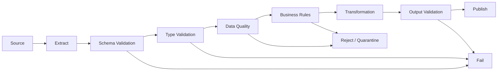
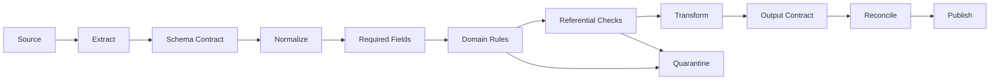

# 08- Data Validation

## Overview

Data validation is the process of verifying that a Pandas `DataFrame` satisfies the structural, type, quality, and business rules required by the next stage of a pipeline.

In production systems, validation is not simply:

```python
assert df is not None
```

It is a contract between pipeline stages:

```text
source
    ↓
extract
    ↓
schema validation
    ↓
type validation
    ↓
data-quality validation
    ↓
business validation
    ↓
transformation
    ↓
output validation
    ↓
load / publish
```

Validation matters because malformed data can otherwise propagate into:

```text
incorrect reports
invalid financial calculations
database constraint failures
broken APIs
corrupted analytical datasets
silent data loss
```

The engineering goal is:

> Detect invalid data as early as possible, classify failures correctly, and prevent bad data from becoming durable output.

---

## Validation Layers

A robust Pandas pipeline typically validates at multiple levels.

| Layer | Example | Typical Action |
|---|---|---|
| Schema | Required column missing | Fail fast |
| Type | `amount` is non-numeric | Reject/coerce according to contract |
| Completeness | `customer_id` is null | Reject/quarantine |
| Uniqueness | Duplicate `order_id` | Deduplicate or fail |
| Domain | `amount < 0` | Reject |
| Referential | Unknown `customer_id` | Reject/quarantine |
| Temporal | Future `created_at` | Reject or investigate |
| Statistical | Sudden 90% null rate | Alert/fail based on threshold |
| Output | Unexpected row count | Fail before publish |

Different failures require different responses.

---

## Validation Architecture

A production ETL pipeline can be structured as:



The important distinction is between:

```text
pipeline-invalid
```

and:

```text
record-invalid
```

A malformed schema usually means the pipeline cannot safely continue.

One bad record may be safely quarantined if the business process allows it.

---

## Why Validation Should Happen Early

Suppose a source contains:

```text
10 million rows
```

and one required column is missing.

If the pipeline discovers this after:

```text
join
→ groupby
→ transformation
→ Parquet write
```

it has already consumed significant resources.

Failing immediately after extraction is cheaper:

```text
extract
→ validate
→ stop
```

Early validation reduces:

```text
CPU
memory
database writes
storage
reprocessing
debugging effort
```

---

## Schema Validation

A schema defines the expected structure of a DataFrame.

Example:

```python
required_columns = {
    "order_id",
    "customer_id",
    "amount",
    "status",
    "created_at",
}

missing = (
    required_columns
    - set(orders.columns)
)

if missing:
    raise ValueError(
        f"Missing columns: {sorted(missing)}"
    )
```

This is the simplest structural validation.

For production systems, also validate:

```text
unexpected columns
column order where relevant
dtype
nullability
required fields
schema version
```

---

## Required Columns

A useful validation helper:

```python
def validate_required_columns(
    df: pd.DataFrame,
    required: set[str],
) -> None:
    missing = required - set(df.columns)

    if missing:
        raise ValueError(
            f"Missing required columns: "
            f"{sorted(missing)}"
        )
```

Usage:

```python
validate_required_columns(
    orders,
    {
        "order_id",
        "customer_id",
        "amount",
    },
)
```

Keep validation reusable rather than duplicating ad hoc checks throughout the pipeline.

---

## Unexpected Columns

Unexpected columns are not always errors.

For ingestion systems, they may indicate:

```text
backward-compatible source evolution
new optional field
upstream deployment
schema drift
```

Possible policies are:

```text
strict
allow-list
allow unknown columns
warn
```

Choose deliberately.

For critical financial pipelines, unexpected schema changes may justify failing the pipeline.

---

## Column Order

Pandas operations generally do not require a specific column order.

However, serialization or downstream interfaces may.

If order matters:

```python
expected_order = [
    "order_id",
    "customer_id",
    "amount",
    "created_at",
]

if list(orders.columns) != expected_order:
    raise ValueError(
        "Unexpected column order"
    )
```

Do not enforce column order when only column names and types matter.

---

## Dtype Validation

Schema validation should include types when downstream behavior depends on them.

Example:

```python
expected_dtypes = {
    "order_id": "string",
    "customer_id": "string",
}

for column, expected in expected_dtypes.items():
    actual = str(orders[column].dtype)

    if actual != expected:
        raise TypeError(
            f"{column}: expected {expected}, "
            f"got {actual}"
        )
```

In production, exact dtype comparison should account for the intended Pandas extension dtype and the acceptable database/storage representation.

---

## Type Normalization vs Type Validation

These are related but different.

Type normalization:

```python
orders["amount"] = pd.to_numeric(
    orders["amount"],
    errors="raise",
)
```

converts a valid input representation into the expected type.

Type validation asks:

```text
Did the result match the expected contract?
```

A useful pipeline is:

```text
raw representation
→ normalize
→ validate
→ continue
```

Do not silently coerce malformed values and assume validation has succeeded.

---

## `errors="coerce"` and Data Quality

This:

```python
orders["amount"] = pd.to_numeric(
    orders["amount"],
    errors="coerce",
)
```

converts invalid values into missing values.

That can be useful when the pipeline intentionally treats malformed records as invalid.

However, this:

```python
orders["amount"] = pd.to_numeric(
    orders["amount"],
    errors="coerce",
)

orders["amount"] = orders["amount"].fillna(0)
```

can silently convert bad input into:

```text
0
```

which may corrupt financial calculations.

Use coercion only when the resulting missing-value behavior is explicit.

---

## Null Validation

Required fields should be checked explicitly.

```python
required_non_null = [
    "order_id",
    "customer_id",
    "amount",
]

null_counts = (
    orders[required_non_null]
    .isna()
    .sum()
)

if null_counts.any():
    raise ValueError(
        f"Nulls in required columns: "
        f"{null_counts[null_counts > 0].to_dict()}"
    )
```

Do not treat all missing values as errors.

For example:

```text
discount_amount = NULL
```

may be valid if NULL means:

```text
not applicable
```

Validation must reflect business semantics.

---

## Null Rate

For large datasets, inspect the proportion of missing values.

```python
null_rate = orders.isna().mean()

print(
    null_rate.sort_values(
        ascending=False
    )
)
```

A pipeline may define thresholds such as:

```text
customer_id null rate > 0%
→ fail

marketing_source null rate > 20%
→ warning

optional_comment null rate > 95%
→ expected
```

Thresholds should be based on data contracts and historical behavior.

---

## Empty DataFrames

An empty DataFrame is not necessarily invalid.

For example:

```python
orders = extract_orders()

if orders.empty:
    logger.info(
        "no_records_to_process"
    )
    return
```

The pipeline should distinguish:

```text
valid zero-row result
```

from:

```text
unexpected missing source data
```

An empty result can be a successful no-op for an incremental period or a serious anomaly for a mandatory daily feed.

---

## Duplicate Validation

For a unique business key:

```python
duplicate_mask = orders[
    "order_id"
].duplicated(
    keep=False,
)

duplicates = orders.loc[
    duplicate_mask
]

if not duplicates.empty:
    raise ValueError(
        "Duplicate order IDs detected"
    )
```

Always define:

```text
what constitutes a duplicate
which record should survive
whether duplicates are source retries
whether duplicates represent updates
```

Do not automatically call `drop_duplicates()` without understanding the data model.

---

## Deterministic Deduplication

If the source contains multiple versions:

```python
orders = (
    orders
    .sort_values(
        ["order_id", "updated_at"],
    )
    .drop_duplicates(
        "order_id",
        keep="last",
    )
)
```

This assumes:

```text
updated_at
```

provides a meaningful ordering.

For truly deterministic results, add a stable tie-breaker if timestamps can collide:

```text
updated_at
+
source_sequence
```

---

## Business Rule Validation

Business rules verify domain constraints.

Examples:

```python
if orders["amount"].lt(0).any():
    raise ValueError(
        "Order amount cannot be negative"
    )

if ~orders["status"].isin(
    {
        "pending",
        "completed",
        "cancelled",
    }
).all():
    raise ValueError(
        "Unknown order status detected"
    )
```

These rules should live near the domain boundary rather than being scattered throughout unrelated transformations.

---

## Allowed Values

For controlled categories:

```python
allowed_statuses = {
    "pending",
    "processing",
    "completed",
    "failed",
}

invalid_statuses = (
    set(
        orders["status"]
        .dropna()
        .unique()
    )
    - allowed_statuses
)

if invalid_statuses:
    raise ValueError(
        f"Unknown statuses: "
        f"{sorted(invalid_statuses)}"
    )
```

Controlled domains should ideally also be represented in:

```text
database constraints
reference tables
API contracts
schema definitions
```

where appropriate.

---

## Numeric Range Validation

Validate ranges explicitly:

```python
invalid = orders.loc[
    orders["quantity"].le(0)
]

if not invalid.empty:
    raise ValueError(
        "Quantity must be greater than zero"
    )
```

Other examples:

```text
percentage ∈ [0, 100]
rating ∈ [1, 5]
amount >= 0
latitude ∈ [-90, 90]
longitude ∈ [-180, 180]
```

Use domain-specific constraints instead of generic assumptions.

---

## Datetime Validation

Normalize timestamps first:

```python
orders["created_at"] = pd.to_datetime(
    orders["created_at"],
    utc=True,
    errors="raise",
)
```

Then validate:

```python
future_orders = orders.loc[
    orders["created_at"]
    > pd.Timestamp.now(tz="UTC")
]

if not future_orders.empty:
    raise ValueError(
        "Future order timestamps detected"
    )
```

For production systems, consider:

```text
clock skew
late-arriving data
timezone
allowed future window
source timestamp semantics
```

A few seconds of clock skew may be acceptable; several days usually is not.

---

## Temporal Range Validation

For event pipelines:

```text
event_time
```

should be checked against a reasonable window.

Example:

```python
now = pd.Timestamp.now(tz="UTC")

too_old = orders.loc[
    orders["created_at"]
    < now - pd.Timedelta(days=3650)
]

if not too_old.empty:
    raise ValueError(
        "Unexpectedly old records detected"
    )
```

The threshold should be based on the actual domain.

---

## Referential Integrity

Suppose:

```text
orders.customer_id
```

must reference:

```text
customers.customer_id
```

Check unmatched records:

```python
enriched = orders.merge(
    customers,
    on="customer_id",
    how="left",
    validate="many_to_one",
)

missing_customers = enriched[
    enriched["segment"].isna()
]
```

A high unmatched rate may indicate:

```text
source corruption
late reference data
wrong IDs
schema changes
stale dimensions
```

---

## Join Cardinality Validation

Use:

```python
validate="many_to_one"
```

when every order should map to at most one customer.

```python
enriched = orders.merge(
    customers,
    on="customer_id",
    how="left",
    validate="many_to_one",
)
```

This turns an implicit assumption into an executable validation rule.

Other useful relationships include:

```text
one_to_one
one_to_many
many_to_one
many_to_many
```

Only use `many_to_many` when that relationship is genuinely intended.

---

## Cross-Source Validation

When combining PostgreSQL and REST API data:

```text
PostgreSQL orders
+
API customer data
```

validate:

```text
ID coverage
duplicate reference keys
unexpected categories
schema differences
row counts
```

The external source should not silently override the canonical data model.

---

## Data Quality Checks

Beyond schema and domain validation, monitor quality signals:

```text
row count
null rate
duplicate rate
invalid-value rate
distribution changes
join match rate
timestamp range
```

Example:

```python
invalid_rate = (
    invalid_rows / len(orders)
    if len(orders)
    else 0.0
)

if invalid_rate > 0.01:
    raise ValueError(
        "Invalid row rate exceeded threshold"
    )
```

A threshold should reflect historical behavior and business tolerance.

---

## Statistical Validation

For some datasets, simple distribution checks can identify upstream failures.

Examples:

```text
today's rows < 20% of historical average
status="completed" suddenly becomes 99%
amount median changes by 100x
null rate jumps sharply
```

These are not deterministic schema failures.

They are anomaly signals.

Treat them separately:

```text
hard validation
vs
quality anomaly detection
```

---

## Data Drift

Data drift occurs when valid-looking data changes unexpectedly.

For example:

```text
normal:
status distribution
completed = 60%
pending   = 30%
failed    = 10%

new batch:
completed = 99%
pending   = 1%
failed    = 0%
```

Every value may still satisfy the schema.

A distribution monitor can detect the anomaly.

Production pipelines should combine:

```text
schema validation
+
business validation
+
quality monitoring
```

rather than relying on only one layer.

---

## Validation Before Transformation

Prefer:

```text
raw
→ structural validation
→ type normalization
→ business validation
→ transformation
```

rather than transforming malformed data first.

For example, do not calculate:

```python
orders["net_amount"] = (
    orders["amount"]
    - orders["discount"]
)
```

before establishing that:

```text
amount
discount
```

have valid numeric semantics.

---

## Validation After Transformation

Some rules cannot be checked before transformation.

For example:

```text
net_amount >= 0
```

may depend on:

```text
amount
+
discount
+
tax
```

Validate derived output:

```python
if result["net_amount"].lt(0).any():
    raise ValueError(
        "Negative net amounts detected"
    )
```

Production pipelines often need both:

```text
input validation
+
output validation
```

---

## Output Schema Validation

After transformation:

```python
expected_columns = {
    "customer_id",
    "revenue",
    "order_count",
}

actual_columns = set(
    result.columns
)

if actual_columns != expected_columns:
    raise ValueError(
        "Unexpected output schema"
    )
```

Also validate:

```text
dtypes
row counts
uniqueness
nullability
business invariants
```

A transformation that executes successfully can still produce incorrect output.

---

## Reconciliation

Reconciliation compares source and output metrics.

Examples:

```text
input rows
output rows
rejected rows
distinct IDs
financial totals
```

For a transformation where totals should remain unchanged:

```python
source_total = orders["amount"].sum()
output_total = result["revenue"].sum()

if source_total != output_total:
    raise ValueError(
        "Revenue reconciliation failed"
    )
```

For transformations that intentionally change totals, define the correct invariant rather than comparing blindly.

---

## Validation and Database Constraints

Pandas validation and database constraints solve different problems.

```text
Pandas
→ validates the current batch

Database
→ enforces integrity across all writers
```

For example:

```sql
CREATE TABLE orders (
    order_id TEXT PRIMARY KEY,
    customer_id TEXT NOT NULL,
    amount NUMERIC(18, 2) NOT NULL
);
```

Even if Pandas checks duplicates, the database should still enforce the primary key.

Other database protections include:

```text
NOT NULL
UNIQUE
CHECK
FOREIGN KEY
PRIMARY KEY
```

Use both layers where appropriate.

---

## Validation and REST APIs

API-driven pipelines must validate:

```text
response shape
required fields
pagination
types
allowed values
HTTP response status
```

Example:

```python
payload = response.json()

if "items" not in payload:
    raise ValueError(
        "API response missing items"
    )

chunk = pd.json_normalize(
    payload["items"]
)
```

Do not assume successful HTTP status implies valid business data.

---

## Validation and PostgreSQL

For database extraction, validate:

```text
query result columns
dtypes
NULL behavior
row count
expected time range
```

Database constraints do not guarantee that an analytical query returned the right dataset.

For example, a query can legally return:

```text
0 rows
```

when the pipeline expected:

```text
1 million rows
```

The pipeline needs its own completeness expectations.

---

## Validation and CSV

CSV is especially prone to:

```text
type inference problems
missing columns
extra columns
encoding issues
delimiter changes
date format changes
unexpected text
```

Normalize immediately after reading:

```python
orders = pd.read_csv(
    "orders.csv",
    dtype={
        "order_id": "string",
        "customer_id": "string",
    },
)

orders["amount"] = pd.to_numeric(
    orders["amount"],
    errors="raise",
)
```

Validate before processing downstream.

---

## Validation and Parquet

Parquet preserves schema more effectively than CSV, but data validation is still necessary.

Validate:

```text
schema
dtypes
partition values
nullability
duplicate keys
business rules
```

Do not interpret a valid Parquet file as proof of valid business data.

A perfectly readable Parquet file can still contain:

```text
incorrect prices
unknown customers
duplicated orders
invalid timestamps
```

---

## Chunk-Level Validation

For large datasets, validate each chunk.

```python
for chunk in pd.read_csv(
    "orders.csv",
    chunksize=100_000,
):
    validate_schema(chunk)
    validate_business_rules(chunk)

    result = transform(chunk)

    validate_output(result)

    persist(result)
```

This keeps failures bounded and avoids processing known-invalid data further.

---

## Global Validation Across Chunks

Some checks require information across the entire dataset.

Examples:

```text
global duplicate IDs
global row count
global total amount
global min/max
```

Use appropriate state:

```python
total_rows = 0
total_amount = 0.0

for chunk in chunks:
    total_rows += len(chunk)
    total_amount += chunk["amount"].sum()

if total_rows == 0:
    raise ValueError(
        "Expected at least one record"
    )
```

For global uniqueness, state may become large. Consider external or database-backed validation for high-cardinality keys.

---

## Validation Result Model

For reusable validation, it can be useful to return structured results instead of only raising exceptions.

Example:

```python
from dataclasses import dataclass


@dataclass(frozen=True)
class ValidationResult:
    valid: bool
    error_count: int
    warnings: list[str]
```

This supports reporting:

```text
valid
errors
warnings
```

without forcing every validation condition to become a hard failure.

---

## Warnings vs Errors

Not every anomaly should stop the pipeline.

Example:

| Condition | Typical Severity |
|---|---|
| Missing required column | Error |
| Invalid primary key | Error |
| Duplicate business key | Error |
| Unknown optional category | Warning or quarantine |
| Null optional field | Normal/warning |
| Small row-count deviation | Warning |
| Severe row-count deviation | Error |
| Minor distribution shift | Warning |
| Major distribution shift | Alert/error |

Severity should be part of the operational contract.

---

## Fail Fast vs Quarantine

### Fail Fast

Use when the pipeline cannot safely continue.

Examples:

```text
missing required column
corrupt schema
invalid target type
broken configuration
```

### Quarantine

Use when individual records are invalid but valid records can still be processed.

Example:

```text
10 million records
9,999,500 valid
500 invalid
```

The 500 records can be written to:

```text
quarantine/
```

while the valid records continue.

Never silently discard quarantined records.

---

## Quarantine Data

A useful quarantine record contains:

```text
source record
batch ID
pipeline version
validation error
timestamp
source location
```

For example:

```python
invalid = chunk.loc[
    ~valid_mask
].copy()

invalid["validation_error"] = (
    "invalid_amount"
)

invalid["batch_id"] = batch_id

write_quarantine(invalid)
```

This supports:

```text
debugging
reprocessing
auditing
source-team feedback
```

---

## Validation Error Messages

Make errors operationally useful.

Poor:

```text
ValueError("Invalid data")
```

Better:

```python
raise ValueError(
    "orders: missing columns "
    f"{sorted(missing)}"
)
```

Useful validation errors identify:

```text
dataset
batch
column
rule
observed condition
```

Avoid including sensitive raw values in error messages.

---

## Validation Performance

Validation itself can become expensive on large datasets.

Prefer vectorized checks:

```python
invalid = orders["amount"].lt(0)
```

rather than:

```python
for amount in orders["amount"]:
    if amount < 0:
        ...
```

Run inexpensive and highly selective validation early.

Do not repeatedly scan the same large DataFrame for identical conditions.

---

## Combining Validation Checks

Compute reusable masks when appropriate:

```python
valid_amount = (
    orders["amount"].notna()
    & orders["amount"].ge(0)
)

valid_status = orders[
    "status"
].isin(
    {
        "pending",
        "completed",
        "cancelled",
    }
)

valid_orders = orders.loc[
    valid_amount
    & valid_status
]
```

This can make downstream processing explicit and reduce repeated condition evaluation.

---

## Validation Pipeline Design

A reusable validation flow might be:

```python
def validate_orders(
    orders: pd.DataFrame,
) -> pd.DataFrame:
    validate_schema(orders)

    normalized = normalize_orders(
        orders,
    )

    validate_required_values(
        normalized,
    )

    validate_business_rules(
        normalized,
    )

    return normalized
```

This makes the order of operations explicit:

```text
schema
→ normalization
→ completeness
→ business rules
```

---

## Production Validation Architecture

A mature pipeline may look like:



This provides multiple defenses against:

```text
schema drift
bad records
incorrect relationships
transformation regressions
unexpected outputs
```

---

## Data Contracts

A data contract specifies what a producer promises to provide.

For an order dataset:

```text
order_id        string, required, unique
customer_id     string, required
amount          decimal, required, >= 0
status          enum, required
created_at      UTC timestamp, required
```

A contract can be implemented through:

```text
Pandas validation
JSON schema
database schema
Pydantic models
Great Expectations
Pandera
custom validation code
```

The important part is not the library. It is having an explicit contract.

---

## Pandera and Schema Validation

For complex Pandas validation, a dedicated schema library can make rules declarative.

Example with Pandera:

```python
import pandera.pandas as pa


orders_schema = pa.DataFrameSchema(
    {
        "order_id": pa.Column(
            str,
            nullable=False,
        ),
        "customer_id": pa.Column(
            str,
            nullable=False,
        ),
        "amount": pa.Column(
            float,
            nullable=False,
            checks=pa.Check.ge(0),
        ),
    }
)

validated_orders = orders_schema.validate(
    orders,
)
```

Libraries such as Pandera can improve consistency for larger codebases, but custom validation remains appropriate for domain rules and operational checks.

---

## Pydantic and Pandas

Pydantic is useful for:

```text
API contracts
configuration
individual structured records
```

Pandas is useful for:

```text
columnar batch processing
large tabular transformations
```

Do not automatically convert millions of DataFrame rows into individual Pydantic objects if doing so adds unnecessary CPU and memory overhead.

Use each validation technology at the boundary where it fits best.

---

## Testing Validation

Validation tests should verify both success and failure behavior.

Example:

```python
import pandas as pd
import pytest


def test_negative_amount_is_rejected() -> None:
    orders = pd.DataFrame(
        {
            "order_id": ["O-1"],
            "customer_id": ["C-1"],
            "amount": [-10.0],
            "status": ["completed"],
        }
    )

    with pytest.raises(
        ValueError,
        match="Negative order amounts",
    ):
        validate_business_rules(orders)
```

Also test:

```text
missing column
null required field
duplicate key
invalid category
invalid timestamp
empty input
valid boundary value
invalid boundary value
```

---

## Testing Data Quality Thresholds

For threshold-based checks, test both sides of the boundary:

```text
threshold - 1 record
threshold
threshold + 1 record
```

For example, if:

```text
invalid rate > 1%
```

causes failure, test:

```text
0.99%
1.00%
1.01%
```

Boundary testing prevents subtle operational regressions.

---

## Validation in CI/CD

Validation logic should be tested before deployment.

A typical workflow:

```text
pull request
    ↓
unit tests
    ↓
data-transformation tests
    ↓
validation tests
    ↓
integration tests
    ↓
deploy
```

For critical pipelines, CI can also execute representative fixture datasets.

Do not wait for production data to expose schema mistakes.

---

## Production Monitoring

Validation failures should generate operational signals.

Track:

```text
validation failures
invalid records
quarantined records
schema drift
null rates
duplicate rates
join miss rates
row count anomalies
processing failures
```

Useful tags include:

```text
pipeline
dataset
batch
source
validation_rule
environment
```

This makes failures searchable and actionable.

---

## Alerting

Not every warning needs an immediate page.

A reasonable severity model is:

```text
INFO
→ expected anomaly

WARNING
→ quality degradation

ERROR
→ batch failed

CRITICAL
→ sustained or business-impacting failure
```

Alert on:

```text
consecutive failures
sudden data-quality degradation
unexpected schema changes
missing expected daily feeds
```

Avoid creating alerts for every benign anomaly.

---

## Security Considerations

Validation data may contain sensitive records.

Avoid:

```python
logger.error(
    "Invalid record: %s",
    row,
)
```

because the record may contain:

```text
PII
financial information
tokens
internal identifiers
```

Prefer:

```python
logger.error(
    "Validation failed",
    extra={
        "batch_id": batch_id,
        "rule": "amount_non_negative",
    },
)
```

Quarantine storage should have the same or stronger access controls as the source data.

---

## Validation and Authorization

Data validation is not authorization.

A valid record is not necessarily:

```text
authorized to access
authorized to modify
authorized to publish
```

Do not use Pandas validation as an access-control mechanism.

Security policies belong at:

```text
API
service
database
IAM
storage
```

boundaries.

---

## Large Dataset Validation

For very large datasets:

```text
project columns
→ validate chunks
→ aggregate validation metrics
→ validate global invariants
```

Avoid building a second full-size DataFrame solely for validation.

For example:

```python
invalid_rows = 0
total_rows = 0

for chunk in chunks:
    invalid_mask = (
        chunk["amount"].isna()
        | chunk["amount"].lt(0)
    )

    invalid_rows += int(
        invalid_mask.sum()
    )
    total_rows += len(chunk)

invalid_rate = (
    invalid_rows / total_rows
    if total_rows
    else 0.0
)
```

This keeps validation memory bounded.

---

## Validation and Incremental Processing

Incremental pipelines must distinguish:

```text
new data is invalid
```

from:

```text
historical data already invalid
```

Track validation results by:

```text
batch
partition
source window
pipeline version
```

This prevents one historical anomaly from being confused with a current ingestion failure.

---

## Validation and Reprocessing

When a batch is reprocessed after a bug fix, validation should run again.

Record:

```text
pipeline version
validation version
batch ID
output version
```

This helps answer:

```text
Why did the same source data produce a different validation result?
```

---

## Common Mistakes

### Using `assert` for Production Data Validation

Avoid:

```python
assert not orders["amount"].lt(0).any()
```

Assertions can be disabled with Python optimization flags and are not a good production validation mechanism.

Raise explicit exceptions instead.

### Coercing Invalid Values to Zero

This can silently corrupt financial or analytical data.

### Treating Every Missing Value as Invalid

Nullability is a schema/business rule, not a universal error.

### Calling `dropna()` Without Understanding the Contract

This can silently remove valid records.

### Calling `drop_duplicates()` Without a Business Rule

The surviving record may be arbitrary or incorrect.

### Validating After Expensive Transformation

Invalid input should be rejected before unnecessary processing.

### Validating Only the First Chunk

Each chunk may have different data-quality characteristics.

### Checking Duplicates Only Within a Chunk

Global duplicates can exist across chunk boundaries.

### Logging Invalid Records

This can expose sensitive information and generate huge logs.

### Treating Successful Execution as Valid Data

A pipeline can complete without exceptions while producing semantically incorrect results.

### Using Only Schema Validation

Valid types do not guarantee valid business data.

### Using Only Statistical Checks

Anomalies do not replace deterministic constraints.

### Ignoring Output Validation

Transformations can introduce new errors even when the input was valid.

---

## Practical Production Example

```python
import pandas as pd


REQUIRED_COLUMNS = {
    "order_id",
    "customer_id",
    "amount",
    "status",
    "created_at",
}

ALLOWED_STATUSES = {
    "pending",
    "processing",
    "completed",
    "cancelled",
}


def validate_schema(
    orders: pd.DataFrame,
) -> None:
    missing = (
        REQUIRED_COLUMNS
        - set(orders.columns)
    )

    if missing:
        raise ValueError(
            f"Missing columns: {sorted(missing)}"
        )


def normalize_orders(
    orders: pd.DataFrame,
) -> pd.DataFrame:
    result = orders.copy()

    result["order_id"] = (
        result["order_id"]
        .astype("string")
    )

    result["customer_id"] = (
        result["customer_id"]
        .astype("string")
    )

    result["amount"] = pd.to_numeric(
        result["amount"],
        errors="raise",
    )

    result["created_at"] = pd.to_datetime(
        result["created_at"],
        utc=True,
        errors="raise",
    )

    result["status"] = (
        result["status"]
        .astype("string")
        .str.strip()
        .str.lower()
    )

    return result


def validate_business_rules(
    orders: pd.DataFrame,
) -> None:
    required_non_null = [
        "order_id",
        "customer_id",
        "amount",
        "status",
        "created_at",
    ]

    null_counts = (
        orders[required_non_null]
        .isna()
        .sum()
    )

    if null_counts.any():
        raise ValueError(
            f"Required fields contain nulls: "
            f"{null_counts[null_counts > 0].to_dict()}"
        )

    if orders["order_id"].duplicated().any():
        raise ValueError(
            "Duplicate order IDs detected"
        )

    if orders["amount"].lt(0).any():
        raise ValueError(
            "Negative order amounts detected"
        )

    invalid_statuses = (
        set(
            orders["status"].unique()
        )
        - ALLOWED_STATUSES
    )

    if invalid_statuses:
        raise ValueError(
            f"Unknown statuses: "
            f"{sorted(invalid_statuses)}"
        )


def validate_output(
    result: pd.DataFrame,
) -> None:
    expected = {
        "customer_id",
        "revenue",
        "order_count",
    }

    if set(result.columns) != expected:
        raise ValueError(
            "Unexpected output schema"
        )

    if result["revenue"].lt(0).any():
        raise ValueError(
            "Negative revenue detected"
        )

    if result["order_count"].le(0).any():
        raise ValueError(
            "Invalid order count detected"
        )
```

The implementation deliberately separates:

```text
schema
normalization
business rules
output validation
```

This makes individual rules easier to test and maintain.

---

## Production ETL Pattern

A complete pipeline may use:

```python
def process_orders(
    orders: pd.DataFrame,
) -> pd.DataFrame:
    validate_schema(orders)

    normalized = normalize_orders(
        orders,
    )

    if normalized.empty:
        return normalized

    validate_business_rules(
        normalized,
    )

    result = transform_orders(
        normalized,
    )

    validate_output(result)

    return result
```

For large datasets, the same architecture can be applied per chunk while global metrics are tracked separately.

---

## Validation Checklist

```text
[ ] Required columns are defined
[ ] Unexpected schema changes have an explicit policy
[ ] Required dtypes are explicit
[ ] Type normalization occurs before dependent business rules
[ ] Required fields have defined nullability
[ ] Duplicate keys are validated
[ ] Duplicate resolution is deterministic
[ ] Allowed categories are enforced
[ ] Numeric ranges are validated
[ ] Timestamp semantics and timezones are explicit
[ ] Referential integrity is checked
[ ] Join cardinality is validated
[ ] Empty-input behavior is defined
[ ] Invalid-record handling is explicit
[ ] Quarantine exists where appropriate
[ ] Validation failures are observable
[ ] Output schema is validated
[ ] Output business invariants are checked
[ ] Source/output reconciliation exists where necessary
[ ] Chunk-level validation is used for large datasets
[ ] Global invariants are tracked separately
[ ] Statistical anomalies are distinguished from hard failures
[ ] Validation logic is covered by automated tests
[ ] CI executes representative validation tests
[ ] Sensitive data is excluded from logs
[ ] Quarantine data is access-controlled
[ ] Database constraints enforce critical integrity rules
[ ] Validation is not used as an authorization mechanism
[ ] Batch IDs and pipeline versions are traceable
[ ] Reprocessing reruns validation
```

## Interview Perspective

### What Is the Difference Between Schema Validation and Business Validation?

Schema validation checks structure and representation:

```text
columns
types
nullability
```

Business validation checks domain rules:

```text
amount >= 0
status is allowed
customer exists
```

A record can satisfy its schema and still violate business rules.

### Should All Invalid Records Fail the Pipeline?

No. Pipeline-level failures such as missing required columns usually warrant fail-fast behavior. Individual bad records may be quarantined when the business process allows valid records to continue.

### Why Is Validation Before Transformation Important?

It prevents expensive processing of data that is already known to be invalid and makes the source of failures easier to diagnose.

### Why Validate After Transformation Too?

Transformations can create invalid states that did not exist in the input. Output schema and business invariants should therefore be checked before publication.

### Why Is `assert` Not a Good Production Validation Mechanism?

Python assertions can be disabled under optimization and do not communicate operational failure semantics as explicitly as deliberate exceptions.

### Why Is `errors="coerce"` Dangerous?

It can turn malformed input into missing values. If those missing values are later filled or ignored without an explicit policy, the pipeline can silently corrupt data.

### How Do You Validate Large Datasets Without Loading More Data?

Validate per chunk and maintain compact global state for metrics and invariants. Avoid creating another full-size DataFrame solely for validation.

### How Do You Detect Duplicates Across Chunks?

Maintain state externally or in memory when cardinality permits, or use database uniqueness, partitioning, sorting, or another scalable mechanism when the keyspace is too large.

### Why Use `validate="many_to_one"` in a Merge?

It converts an expected relationship into an executable check and prevents unexpected many-to-many row multiplication.

### What Is a Data Contract?

A data contract defines the producer/consumer expectations for structure, types, required fields, allowed values, and other semantics.

### How Do You Handle Schema Drift?

Detect it explicitly, classify whether the change is compatible, alert or fail according to policy, and avoid silently allowing upstream changes to redefine downstream assumptions.

### How Should Validation Results Be Monitored?

Track rule-level failures, invalid rates, null rates, duplicate rates, join misses, schema changes, row-count anomalies, and batch identifiers so operators can distinguish data-quality issues from infrastructure failures.

### Does Data Validation Replace Database Constraints?

No. Pandas validates a particular processing batch. Database constraints protect shared persistent state across all writers and transactions.

### Is Data Validation a Security Boundary?

No. Validation determines whether data conforms to expected rules. Authentication, authorization, IAM, database privileges, and storage controls must enforce security independently.

## Key Takeaways

- Data validation should be layered: schema, types, completeness, uniqueness, domain rules, referential integrity, output contracts, and reconciliation each detect different classes of failure.
- Validate early, normalize deliberately, and validate derived outputs again; successful code execution does not prove that the resulting dataset is correct.
- Large datasets require chunk-level validation plus compact global state for metrics and invariants rather than materializing additional full-size validation structures.
- Production pipelines should distinguish hard failures from quarantine-worthy records, make validation observable, protect sensitive quarantine/log data, and enforce critical integrity rules again at the database boundary.
- Treat validation as an explicit data contract that evolves with the pipeline, is covered by automated tests, and is rerun consistently during retries, reprocessing, and backfills.